# 一、机器学习概述

## 1、人工智能、机器学习、深度学习

### 1.1 三者概念

- 什么是人工智能（Artificial Intelligence）：AI
  - 人工智能是研究智能行为的计算代理的合成和分析的领域
  - 人工智能就是用计算机来模拟人脑
  - 简单来说：<font color="red">**用计算机来模拟人脑，让计算机能够像人类一样，理性的思考和行动**</font>

- 什么是机器学习（Machine Learning）：ML

  - 赋予计算机学习能力而不需要明确编程的研究领域
  - 简单来说：<font color="red">**不需要之前那种明确的if else这种具体的代码，而是让计算机能够自己学习知识，然后对新数据进行预测处理**</font>
  - 机器如何学习：先训练，再预测

  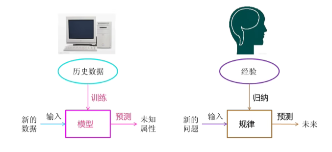

- 什么是深度学习（Deep Learning）：DL

  - 也叫深度神经网络，大脑仿生，设计一层一层的神经元模拟完事万物
  - 简单来说：<font color="red">**让机器像人脑一样，通过多层神经网络，自动从大量数据里学习规律，从而自己做判断、识别、生成内容**</font>

  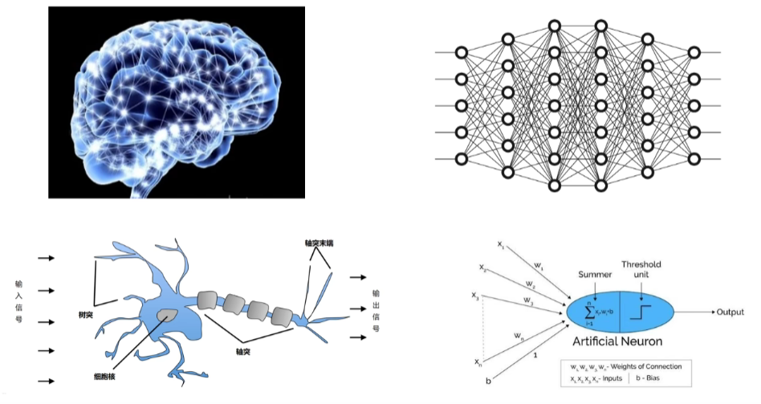


### 1.2 三者关系

- 机器学习是实现人工智能的一种途径
- 深度学习是机器学习的一种方法


### 1.3 机器学习和深度学习的区别

- 机器学习（传统）

  - <font color="red">**需要人工提取特征**</font>，比如识别猫：人要告诉机器 “耳朵、胡须、爪子” 这些特征

  - 模型层数少，结构简单

  - 数据量小也能用

  - 可解释性强，人能看懂它怎么判断的

- 深度学习

  - <font color="red">**不需要人工提取特征**</font>
  - 直接喂图片，模型自己一层层学特征

  - 层数很多（深度网络）

  - 需要**大量数据 + 强大算力（GPU）**

  - 效果更强，但像黑盒，不太好解释

- 用一个例子对比：识别猫

  - 传统机器学习

    - 人手动设计特征：颜色、边缘、纹理、形状

    - 把特征输入模型（SVM、决策树等）

    - 模型学习分类

  - 深度学习

    - 直接把像素丢进神经网络

    - 第一层学边缘

    - 第二层学形状

    - 高层学 “猫” 整体

    - 自动判断是不是猫

- 一句话：<font color="red">**深度学习自动干了人原本要做的特征工作**</font>


### 1.4 学习方式

- 基于规则的学习：程序员根据经验利用<font color="red">**手工的if-else方式进行预测**</font>


- 基于模型的学习：<font color="red">**从数据中自动学出规律**</font>

  - 有很多问题无法明确的写下规则，此时无法使用规则学习的方式来解决这类问题，比如：图像和语音识别和自然语言处理

  

  - 举个例子：房价预测

  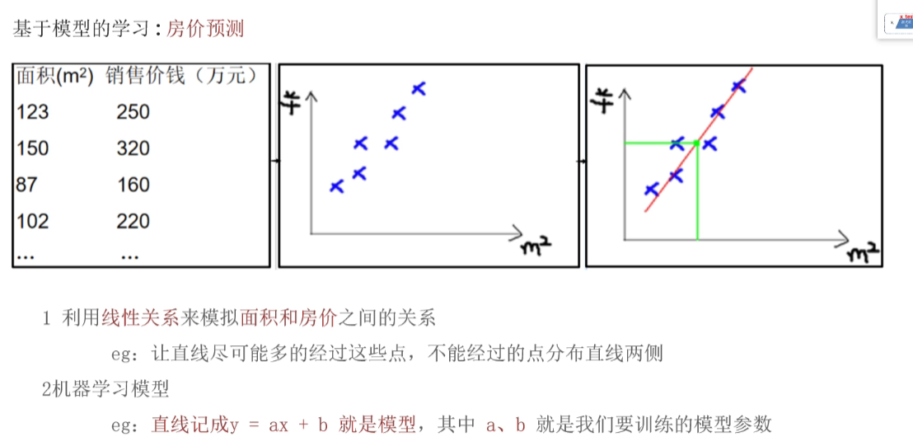

  - 一元线性回归，公式：y = kx + b
    - k：斜率 —> weight，权重
    - b：截距 —> bias，偏值


### 1.5 例题

- **题目**：有关人工智能概念说法正确的？（多选）

  A）实现人工智能的方法很多，其中机器学习是实现人工智能一种途径、一种方法

  B）广义上深度学习是从机器学习发展而来的，两者有区别还有联系

  C）深度学习方法是大脑仿生，深度学习方法从机器学习发展而来

  D）机器学习就是基于模型自动学习事物特征，而不是程序员手工的编写规则

  E）深度学习和机器学习都有各自的应用场景。在研究领域中要根据待解决的问题来选择合理的方法。

~~~bash
# 答案
ABCDE
# 解析
这道多选题的正确选项为 A、B、C、D、E，解析如下：
A ✅：人工智能的实现途径多样，机器学习是核心方法之一。
B ✅：深度学习是机器学习的一个重要分支，二者既有继承关系，又在模型结构、适用场景上存在区别。
C ✅：深度学习受人类大脑神经网络结构启发（大脑仿生），且源于机器学习领域。
D ✅：机器学习的核心是让模型从数据中自动学习规律，而非依赖人工编写规则。
E ✅：深度学习与机器学习各有优势，需根据具体任务（如小样本场景 vs 复杂高维数据场景）选择合适技
~~~


## 2、机器学习的应用领域和发展史

- 应用领域
  - <font color="red">**计算机视觉 CV**</font>：对人看到的东西进行理解
  - <font color="red">**自然语言处理**</font>：对人交流的东西进行理解
  - <font color="red">**数据挖掘和数据分析**</font>：也属于人工智能的范畴


- 发展史
  - 1956 年人工智能元年
  - 2012 年计算机视觉深度神经网络方法研究兴起
  - 2017 年自然语言处理应用大幕拉开
  - 2022 年 chatGPT 的出现，引起 AIGC 的发展

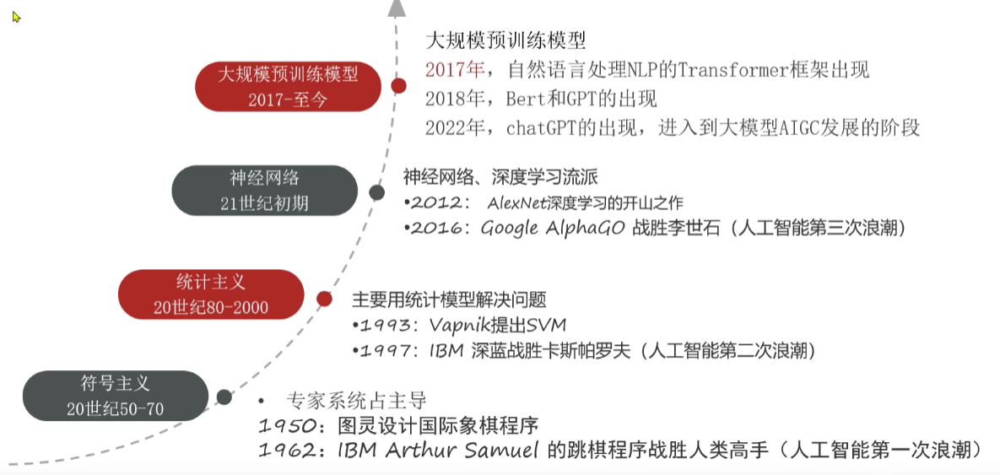

- AI发展三要素

  - 数据
  - 算法
  - 算力

  

- 处理器区别
  - CPU：主要适合 I\O 密集型的任务
  - GPU：主要适合计算密集型任务
  - TPU：专门针对大型网络训练而设计的一款处理器


## 3、机器学习常用术语

- 总结：已知x_train、y_train、x_test，碰撞y_test


- 基本术语
  - <font color="red">**样本 (sample)**</font>：一行数据就是一个样本；多个样本组成数据集；有时一条样本被叫成一条记录
  - <font color="red">**特征 (feature)**</font>：一列数据一个特征，有时也被称为属性
  - <font color="red">**标签 / 目标 (label/target)**</font>：模型要预测的那一列数据。本场景是就业薪资
    - 就业薪资 与 培训学科、作业考试、学历、工作经验、工作地点 **5 个特征** 有关系
  - 特征如何理解（重点）：<font color="red">**特征是从数据中抽取出来的，对结果预测有用的信息**</font>

- 数据集可以分为：训练集、测试集，比例 8:2 或 7:3
  - <font color="red">**训练集**</font>：用来训练模型的数据集
  - <font color="red">**测试集**</font>：用来测试模型的数据集

- 总结：
  - x_train：训练集中的x（训练集中的特征）
  - y_train：训练集中的y（训练集中的标签）
  - x_test：测试集中的x（测试集中的特征）
  - y_test：测试集中的y（测试集中的标签）
  - 机器学习实质就是：已知前三项，碰撞第四项


## 4、机器学习算法分类

### 4.1 监督学习和无监督学习

- 无监督分类

  - <font color="red">**监督学习**</font>：<font color="blue">**有特征有标签**</font>
    - 定义：输入数据是由输入特征值和目标值所组成，即<font color="red">**输入的训练数据有标签**</font>
    - 数据集：需要标注数据的标签/目标值

  - <font color="red">**无监督学习**</font>：<font color="blue">**有特征无标签**</font>
    - 定义：输入数据没有被标记，即样本数据类别未知，<font color="red">**没有标签**</font>，根据样本间的相似性，对样本集聚类，以发现事物内部的结构和相似性
    - 数据集：标注数据没有标签/目标值
  - 如下：
    - 左侧的是监督学习，有特征有标签，电影名称、搞笑镜头、拥抱镜头、打斗镜头等为特征，电影类型为标签
    - 右侧的是无监督学习，有特征无标签，根据样本间的相似性，对样本集聚类，比如：有无帽子分一类、手里有无工具分一类等，然后根据这些发现其结构和相似性，从而发现标签/目标值


- 监督学习下分类
  - <font color="red">**分类问题**</font>
    - 目标值（标签值）是不连续的
    - 分类种类：二分类、多分类
  - <font color="red">**回归问题**</font>
    - 目标值（标签值）是连续的
  - 如下：
    - 左侧的是分类问题，标签值是分具体类别的
    - 右侧的是回归问，标签值是那种连续的


- 无监督学习下分类
  - <font color="red">**聚类问题**</font>
    - 无监督学习是有特征无标签的类型，所以只能依靠样本间相似性对数据进行聚类，然后发现其内部结构和相互关系

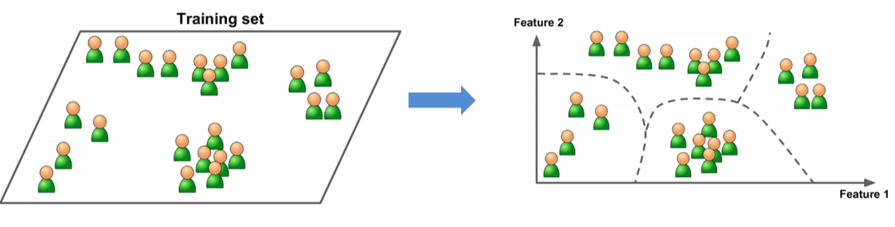


### 4.2 半监督学习

- <font color="red">**有特征，部分数据有目标值（标签值）**</font>

- 工作原理
  - 让专家标注少量数据，利用已经标记的数据（也就是带有类标签）训练出一个模型
  - 再利用该模型去套用未标记的数据
  - 通过询问领域专家分类结果与模型分类结果做对比，从而对模型做进一步改善和提高
- <font color="red">**半监督学习可以大幅度降低标记成本**</font>

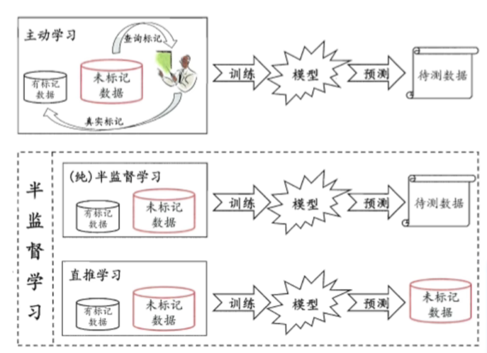

- 例子

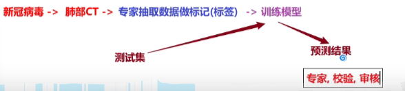


### 4.3 强化学习

- **强化学习（Reinforcement Learning）**：机器学习的一个重要分支
- **应用场景**：里程碑 AlphaGo 围棋、各类游戏、对抗比赛、无人驾驶场景

- 四要素
  - Agent
  - 环境
  - 奖励
  - 动作
- 基本原理：Agent根据环境状态进行行动获取最多的累计奖励
- 总结：<font color="red">**强化学习 = 寻找最短路径 (最优解)，以便获取最多的奖励**</font>

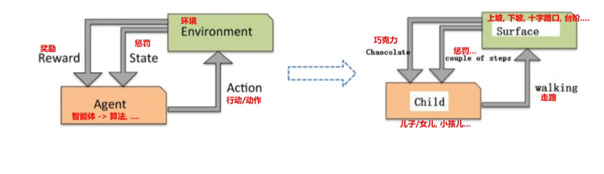


### 4.4 总结

| 学习类型                                 | 核心特点 | 输入数据                        | 输出 / 反馈     | 核心目标                   | 典型案例                                 |
| ---------------------------------------- | -------- | ------------------------------- | --------------- | -------------------------- | ---------------------------------------- |
| **监督学习**(Supervised Learning)        | 有老师教 | 带标签的数据（输入 + 正确答案） | 有明确反馈      | 预测结果 / 分类            | 猫狗图像分类、房价预测、垃圾邮件识别     |
| **无监督学习**(Unsupervised Learning)    | 自主探索 | 无标签数据（只有输入）          | 无反馈          | 发现数据内在结构 / 规律    | 客户分群、异常检测、“物以类聚，人以群分” |
| **半监督学习**(Semi-Supervised Learning) | 折中方案 | 少量有标签 + 大量无标签数据     | 有反馈          | 降低标注成本，提升模型效果 | 文本分类、图像识别（标注成本高的场景）   |
| **强化学习**(Reinforcement Learning)     | 试错学习 | 环境状态 + 奖励机制             | 延迟奖励 / 惩罚 | 长期利益最大化             | AlphaGo 围棋、游戏 AI、自动驾驶          |


## 5、机器学习建模流程


- 机器学习建模的一般步骤

  - <font color="red">**获取数据**</font>：搜集与完成机器学习任务相关的数据集

  - <font color="red">**数据基本处理**</font>：数据集中异常值、缺失值的处理等

  - <font color="red">**特征工程**</font>：对数据特征进行提取、转成向量，让模型达到最好的效果

  - <font color="red">**机器学习（模型训练）**</font>：选择合适的算法对模型进行训练
    - 根据不同的任务来选中不同的算法；有监督学习、无监督学习、半监督学习、强化学习

  - <font color="red">**模型评估**</font>：评估效果好则上线服务，评估效果不好则重复上述步骤

- 注：在整个建模流程中，数据基本处理、特征工程一般是最耗时、耗精力最多的

- 模型预测
  - 用训练集训练出来模型
  - 然后用测试集中的x_train通过模型跑出来p_test
  - 然后用测试集中的p_pred（预期值）和p_test对比即可


~~~bash
下面关于机器学习建模的流程每个步骤表示如下：
获取数据（3）、数据基本处理（1）、特征工程（6）、机器学习（模型训练）（5）、模型评估（4）、在线服务模型预测（2）。下列流程正确的是：
A) 1 -> 2 -> 3 -> 4 -> 5 -> 6
B) 3 -> 1 -> 6 -> 5 -> 4 -> 2
C) 3 -> 1 -> 6 -> 2 -> 5 -> 4
D) 1 -> 3 -> 6 -> 5 -> 4 -> 2

# 答案：B
~~~


## 6、特征工程概念入门

### 6.1 概念

- 特征工程：利用专业背景知识和技巧<font color="red">**处理数据**</font>，让机器学习算法效果最好。这个过程就是特征工程
- 数据和特征决定了机器学习的上限，而模型和算法只是逼近这个上限而已


### 6.2 设计内容

- <font color="red">**特征提取**</font>：原始数据中提取与任务相关的特征，构成特征向量

  - 例子：提取鸢尾花的花瓣的长、宽、花萼的长宽作为特征向量

- <font color="red">**特征预处理**</font>：特征对模型会产生影响，因量纲（单位）问题，有些特征对模型影响大、有些影响小
  - 方式分为：<font color="red">**归一化、标准化**</font>
  - 例子：人一般身高用m，体重用kg，但是如果用身高用mm，体重用g，那么差值就会很大

- <font color="red">**特征降维**</font>：将原始数据的维度降低，叫做特征降维，一般会对原始数据产生影响

  - 例子：比如3D的地球仪转为2D地图

- <font color="red">**特征选择**</font>：原始数据特征很多，与任务相关是其中一个特征集合子集，不会改变原数据

  - 例子：比如有10列特征，选出最直接相关的5列

- <font color="red">**特征组合**</font>：把多个特征合并为一个特征。利用乘法或者加法来完成

  - 例子：

    - `[A X B]`：将两个特征的值相乘形成的特征组合。

    - `[A x B x C x D x E]`：将五个特征的值相乘形成的特征组合。

    - `[A x A]`：对单个特征的值求平方形成的特征组合


### 6.3 例题

有关特征工程说法正确的？（多选）

A）在机器学习整个工程项目中，一般情况下特征工程往往是耗时、耗精力最多工作

B）特征工程就是处理数据，不重要

C）特征提取一般是做数据的标准化、归一化等工作

D）特征降维会修改原始数据，特征选择不会修改原始数据

E）特征工程的好坏会影响模型的上限，是一项专项的工作；开发者需要掌握

~~~bash
答案：ADE
A ✅：在工业界机器学习项目中，特征工程通常占项目开发 60%~80% 的时间，是最耗时耗力的环节。
B ❌：特征工程是决定模型效果上限的关键环节，并非 “不重要”。
C ❌：标准化、归一化属于特征预处理 / 特征缩放，而特征提取是从原始数据中构造新特征（如文本转 TF-IDF、图像提取 HOG 特征）。
D ✅：特征降维（如 PCA）会通过线性 / 非线性变换生成新特征，修改了原始数据结构；特征选择只是从原始特征中筛选子集，不会修改原始数据。
E ✅：“数据和特征决定了模型的上限”，特征工程是机器学习中非常核心的专项技能，开发者必须掌握
~~~


## 7、模型拟合问题

- **拟合（fitting）**：用在机器学习领域，用来表示模型对样本点的拟合情况

- 通俗来说：<font color="red">**拟合 = 模型在训练集和测试集上表现情况**</font>

  - <font color="red">**欠拟合（under-fitting）**</font>：模型在训练集上表现很差、在测试集表现也很差

  - <font color="red">**过拟合（over-fitting）**</font>：模型在训练集上表现很好、在测试集表现很差

- 拟合例子
  - 左边的欠拟合
  - 右边的过拟合

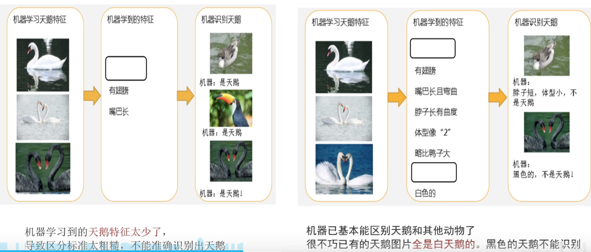

- 拟合问题产生原因
  - 欠拟合产生原因：<font color="red">**模型过于简单**</font>
  - 过拟合产生原因：<font color="red">**模型太过于复杂，数据不纯，训练数据太少**</font>


- <font color="red">**泛化（Generalization）**</font>：模型在新数据集（非训练数据）上的表现好坏的能力。<font color="red">**模型的拟合情况 = 泛化能力**</font>
- <font color="red">**奥卡姆剃刀原则**</font>：给定两个具有相同泛化误差的模型，<font color="red">**较简单的模型比较复杂的模型更可取**</font>

~~~bash
下列有关过拟合欠拟合说法正确的？（多选）
A）欠拟合：模型学习到的特征过少，无法准确的预测未知样本
B）过拟合：模型学习到的特征过多，导致模型只能在训练样本上得到较好的预测结果，而在未知样本上的效果不好
C）欠拟合可以通过增加特征来解决
D）过拟合可以通过正则化、异常值检测、特征降维等方法来解决

# 答案：ABCD
A ✅：欠拟合的本质是模型容量不足，学习到的有效特征太少，无法捕捉数据规律，导致训练集和测试集表现都差。
B ✅：过拟合是模型过度学习了训练集中的噪声和细节，学到了过多非通用特征，只在训练集表现好，泛化能力差。
C ✅：增加更多有区分度的特征（如特征交叉、构造新特征）可以提升模型表达能力，缓解欠拟合。
D ✅：正则化（L1/L2）可约束模型复杂度，异常值检测可减少噪声干扰，特征降维可去除冗余特征，这些都是缓解过拟合的常用方法。
~~~


## 8、机器学习开发环境

- 基于 Python 的 scikit-learn 库

  - 简单高效的数据挖掘和数据分析工具

  - 可供大家使用，可在各种环境中重复使用

  - 建立在 NumPy、SciPy 和 matplotlib 上

  - 开源，可商业使用 —— 获取 BSD 许可证

- 安装方法

~~~bash
uv add scikit-learn
~~~

- 官网：https://scikit-learn.org/stable/


# 二、KNN算法

## 1、KNN简介

### 1.1 定义

- **K - 近邻算法**（K Nearest Neighbor，简称 KNN）：根据你的 “邻居” 来推断出你的类别


- **KNN 算法思想**：如果一个样本在特征空间中的 k 个<font color="red">**最相似**</font>的样本中的大多数属于某一个类别，则该样本也属于这个类别


### 1.2 如何确定样本相似性

- 样本相似性：样本都是属于一个任务数据集的，<font color="red">**样本距离越近越相似**</font>

- 利用K邻近算法预测电影类型


- <font color="red">**欧式距离 = 对应维度差值平方和，开平方根**</font>
- 举例
  - 分别计算10号电影与前9个电影的距离
    - 1号：((39 - 23)² + (0 - 3)² + (31 - 17)²)开平方 =  21.47
    - 2号：50.21
    - 3号：43.42
    - 4号：40.57
    - 5号：34.44
    - 6号：43.87
    - 7号：21.47
    - 8号：18.55
    - 9号：23,43
  - 当K = 5时，1、4、5、7、8号电影与10号电影距离最近，所以得出10号电影为喜剧片
- K值选择问题i
  - K 值过小的影响
    - 用**较小邻域**中的训练实例进行预测
    - 容易受到**异常点**的影响
    - K 值减小 → 模型变复杂 → 容易发生<font color="red">**过拟合**</font>
    - 举例：K=1
      - 无论输入实例是什么，只会按照训练集中<font color="red">**距离最近**</font>进行预测
      - 完全受样本数据最近数据影响
  - K 值过大的影响
    - 用**较大邻域**中的训练实例进行预测
    - 受到**样本均衡**问题的影响
    - K 值增大 → 模型变简单 → 容易发生<font color="red">**欠拟合**</font>
    - 举例：K=N（N 为训练样本个数）
      - 无论输入实例是什么，只会按训练集中<font color="red">**最多的类别**</font>进行预测
      - 完全受样本均衡性的影响


### 1.3 两类问题流程

- 解决问题：<font color="red">**分类问题(投票)、回归问题(均值)**</font>
- 算法思想：若一个样本在特征空间中的 k 个最相似的样本大多数属于某一个类别，则该样本也属于这个类别
- 相似性：欧式距离
- 分类流程
  - 计算未知样本到每一个训练样本的距离
  - 将训练样本根据距离大小升序排序
  - 取出距离最近的 K 个训练样本
  - 进行<font color="red">**多数表决**</font>，统计 K 个样本中哪个样本个数最多
  - 将未知样本归属到<font color="red">**出现次数最多的类别**</font>
- 回归流程
  - 计算未知样本到每一个训练样本的距离
  - 将训练样本根据距离大小升序排序
  - 取出距离最近的 K 个训练样本
  - 把这个K个样本的目标值<font color="red">**计算其平均值**</font>
  - 作为未知样本预测的值

- K值选择
  - K值过小，过拟合
  - K值过大，欠拟合

~~~bash
有关KNN的K值选择，以下说法正确的是？（多选）
A、若k值过小，意味着模型更容易收到异常点影响，更容易学习到嘈杂数据，模型有过拟合的风险
B、若k值过大，模型会变得相对简单，结果更容易受到异常值的影响
C、若k值与训练样本数相同，会导致最终模型的结果都是指向训练集汇总类别数最多的那一类，忽略了数据当中其他的重要信息，模型会过于简单
D、实际工作中经常使用交叉验证的方式去选取最优的k值，而且一般情况下，k值都是比较小的数值

# 答案：ACD
B：K值过大，模型会变得相对简单，但是结果会受到样本均衡性的影响，而不是异常值的影响
~~~


## 2、KNN算法API介绍

### 2.1 分类问题

- KNN分类API

~~~python
sklearn.neighbors.KNeighborsClassifier(n_neighbors=5)
# n_neighbors：int，可选（默认=5），n_neighbors查询默认使用的邻近数
~~~

- 代码实现

~~~python
"""
KNN算法介绍（K Nearest Neighbor）: K - 近邻算法
    原理：
        基于 欧式距离（或者其他距离计算方式）计算 测试集 和 每个训练集之间的距离，然后根据距离升序排列，找到最近的K个样本
        基于K个样本投票，票数最多的就作为最终预测结果 ——> 分类问题
        基于K个样本计算平均值，作为最终预测结果 ——> 回归问题
    实现思路：
        1、分类问题
            适用于：有特征，有标签，且标签不是连续的（离散的）
        2、回归问题
            适用于：有特征，有标签，且标签是连续的
    KNN算法，分类问题思路如下：
        1、计算测试集和每个训练样本之间的距离
        2、基于距离进行升序
        3、找到最近的k个样本
        4、K个样本进行投票
        5、票数最多的结果，作为最终的预测结果
    代码实现思路：
        1、导包
        2、准备数据集（训练集 和 测试集）
        3、创建（KNN 分类模型）模型对象
        4、模型训练
        5、模型预测
"""


# 1、导包
from sklearn.neighbors import KNeighborsClassifier

# 2、准备数据集（训练集 和 测试集）
# train：训练集
# test：测试集
# n_neighbors：最邻近的邻居数
x_train = [[0], [1], [2], [3]]       # 训练集的特征数据，因为特征可以有多个特征，所以是一个二维数组
y_train = [0, 0, 1, 1]               # 训练集的标签数据，因为标签是离散的，所以是一个一维数组
x_test = [[5]]                       # 测试集的特征数据

# 3、创建（KNN 分类模型）模型对象
# estimator：估计器，模型对象，也可以使用变量名 model 做接收
estimator = KNeighborsClassifier(n_neighbors=2)

# 4、模型训练
# 入参：训练集的特征数据、训练集的标签数据
estimator.fit(x_train, y_train)

# 5、模型预测
# 入参：测试集的特征数据
# 出参：预测结果（测试集的标签，y_test）
y_pre = estimator.predict(x_test)

# 6、打印预测结果
print(f'预测结果为：{y_pre}')
~~~

- 结果：
  - 当n_neighbors = 1时，结果为：1；原因：3离5最近，只会是结果为1的分类
  - 当n_neighbors = 2时，结果为：1；原因：2、3离5最近，都是结果为1的分类
  - 当n_neighbors = 3时，结果为：1；原因：2、3肯定上榜，所以结果为1的分类有两票，所以为1
  - 当n_neighbors = 4时，结果为：0；原因：1、2、3、4都上榜，选数值小的，所以是0

- 注意：<font color="red">**scikit-learn平票处理，默认选择数值较小的标签，可以通过设置weights='distance'让距离近的样本有更大权重**</font>


### 2.2 回归问题

- KNN回归API

~~~bash
sklearn.neighbors.KNeighborsRegressor(n_neighbors=5)
# n_neighbors：int，可选（默认=5），n_neighbors查询默认使用的邻近数
~~~

- 代码实现

~~~python
"""
KNN算法介绍（K Nearest Neighbor）: K - 近邻算法
    原理：
        基于 欧式距离（或者其他距离计算方式）计算 测试集 和 每个训练集之间的距离，然后根据距离升序排列，找到最近的K个样本
        基于K个样本投票，票数最多的就作为最终预测结果 ——> 分类问题
        基于K个样本计算平均值，作为最终预测结果 ——> 回归问题
    实现思路：
        1、分类问题
            适用于：有特征，有标签，且标签不是连续的（离散的）
        2、回归问题
            适用于：有特征，有标签，且标签是连续的
    KNN算法，回归问题思路如下：
        1、计算测试集和每个训练样本之间的距离
        2、基于距离进行升序
        3、找到最近的k个样本
        4、基于K个样本的标签值，计算平均值
        5、将上述计算出来的平均值，作为最终的预测结果
    代码实现思路：
        1、导包
        2、准备数据集（训练集 和 测试集）
        3、创建（KNN 回归模型）模型对象
        4、模型训练
        5、模型预测
"""


# 1、导包
from sklearn.neighbors import KNeighborsRegressor

# 2、准备数据集（训练集 和 测试集）
# train：训练集
# test：测试集
# n_neighbors：最邻近的邻居数
x_train = [
    [0, 0, 1],              # 差值：[3, 11, 9]，平方和：211，开根号：14.53
    [1, 1, 0],              # 差值：[2, 10, 10]，平方和：204，开根号：14.28
    [3, 10, 10],            # 差值：[0, 1, 0]，平方和：1，开根号：1
    [4, 11, 12]             # 差值：[1, 0, 2]，平方和：5，开根号：2.24
]                                           # 训练集的特征数据，因为特征可以有多个特征，所以是一个二维数组
y_train = [0.1, 0.2, 0.3, 0.4]               # 训练集的标签数据，因为标签是离散的，所以是一个一维数组
x_test = [[3, 11, 10]]                       # 测试集的特征数据

# 3、创建（KNN 分类模型）模型对象
# estimator：估计器，模型对象，也可以使用变量名 model 做接收
estimator = KNeighborsRegressor(n_neighbors=4)

# 4、模型训练
# 入参：训练集的特征数据、训练集的标签数据
estimator.fit(x_train, y_train)

# 5、模型预测
# 入参：测试集的特征数据
# 出参：预测结果（测试集的标签，y_test）
y_pre = estimator.predict(x_test)

# 6、打印预测结果
print(f'预测结果为：{y_pre}')
~~~

- 结果：
  - 当n_neighbors = 1时，结果为：0.3；原因：3号最近，所以必定是0.3
  - 当n_neighbors = 2时，结果为：0.35；原因：3、4号最近，所以0.3 + 0.4求平均值，为0.35
  - 当n_neighbors = 3时，结果为：0.3；原因：2、3、4号最近，所以0.2 + 0.3 + 0.4求平均值，为0.35
  - 当n_neighbors = 4时，结果为：0.25；原因：1、2、3、4都上榜，0.1+ 0.2+ 0.3+ 0.4求平均值，为0.25


### 2.3 例题

~~~bash
以下关于KNN算法API的使用有误的一项是：D
A、导入算法对象
	from sklearn.neighbors import KNeighborsClassifier
B：构造数据
	x = [[0], [1], [2], [3]]
	y = [0, 0, 1, 1]
C：实例化算法API
	estimator = KNeighborsClassifier(n_neighbors=2)
D：训练模型并预测
	estimator.fit(x, y)
	estimator.predict([1])

# D的模型预测应该是一个二位数组，应该改为：estimator.predict([[1]])
~~~


## 3、距离度量

- <font color="red">**欧式距离（掌握）**</font>

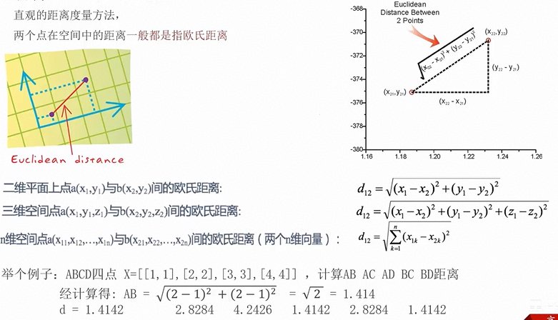

- <font color="red">**曼哈顿距离（掌握）**</font>

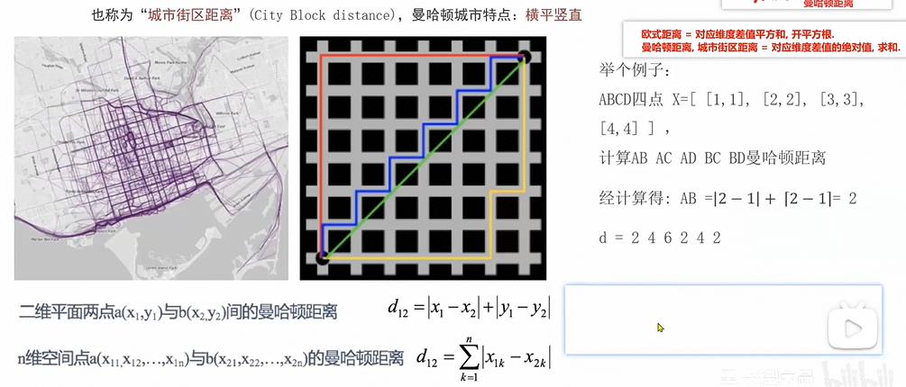

- <font color="red">**切比雪夫距离（了解）**</font>

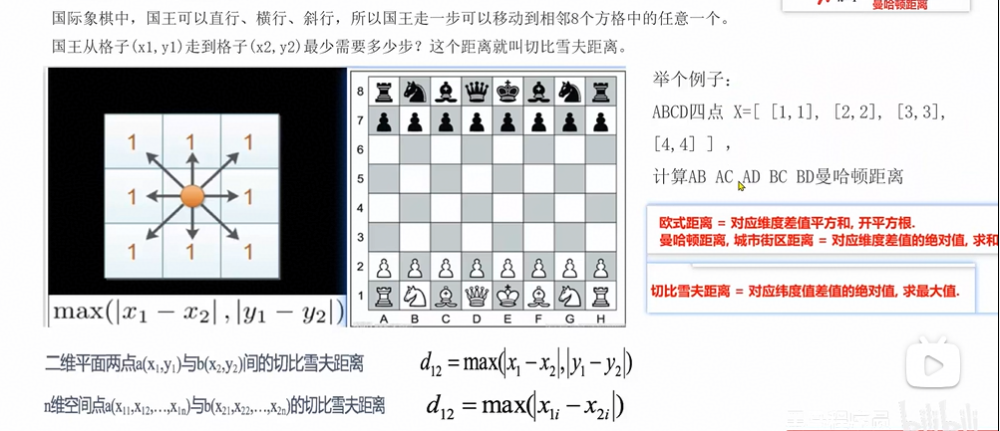

- <font color="red">**闵可夫斯基距离（闵氏距离，了解）**</font>

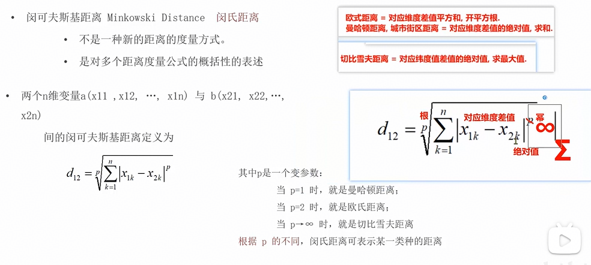

- 总结
  - <font color="red">**欧式距离 = 对应维度差值平方和，开平方根**</font>
  - <font color="red">**曼哈顿距离 = 对应维度差值的绝对值，求和**</font>
  - <font color="red">**切比雪夫距离 = 对应维度差值的绝对值，最大值**</font>


## 4、特征预处理

### 4.1 定义

- <font color="red">**特征预处理**</font>：特征对模型会产生影响，因量纲（单位）问题，有些特征对模型影响大、有些影响小
- 手段：<font color="red">**归一化、标准化**</font>
- 为什么要做归一化和标准化
  - 特征的<font color="red">**单位或者大小相差太大，或者某特征的方差相比其他的特征要大出几个数量级，容易影响（支配）目标结果**</font>，使得一些模型（算法）无法学习到其他的特征
- 举例：体重单位为kg，身高单位为m，那么身高的差值一般都是0.几，而体重的差值就很大了


### 4.2 归一化

- 定义：<font color="red">**通过原始数据进行变换把数据映射到【min, max】(默认为[0, 1])之间**</font>
- 弊端：<font color="red">**容易收到最大值和最小值的影响，所以一般用于处理小数据集**</font>

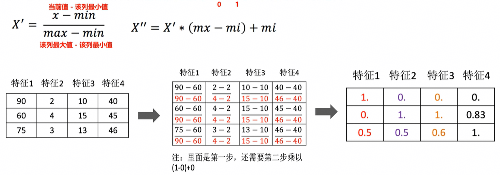

- 归一化API

~~~python
sklearn.preprocessing.MinMaxScaler(feature_range=(0, 1)) # feature_range 缩放空间
transfer.fit_transform(x_train) # 将特征进行归一化操作
~~~

- 代码实现

~~~python
"""
案例：归一化

回顾：特征工程的目的和步骤
    目的：利用专业的背景知识和技巧处理数据，用于提升模型的性能
    步骤：
        1、特征提取
        2、特征预处理（归一化、标准化）
        3、特征降维
        4、特征选择
        5、特征组合

特征预处理：归一化介绍
    目的：
        防止因为量纲(单位)问题，导致特征列的方差值相差较大，影响模型的最终结果
        所以通过公式把各列的值映射到[0, 1]之间
    公式：
        x1 = (当前值 - 该列最小值) / (该列最大值 - 该列最小值)
        x2 = x1 * (该列最大值 - 该列最小值) + 该列最小值
    公式解释：
        x1：基于公式算出来的结果
        x2：最终结果
    弊端：
        容易收到最大值和最小值的影响，所以一般用于处理小数据集
"""

# 1、导包：归一化对象
from sklearn.preprocessing import MinMaxScaler

# 2、准备数据集（归一化的原数据）
x_train = [[90, 2, 10, 40], [60, 4, 15, 45], [75, 3, 13, 46]]

# 3、创建归一化对象
# feature_range表示生成范围，默认为0,1，如果就是这个区间，可以省略不写
# transfer = MinMaxScaler(feature_range=(0, 1))
transfer = MinMaxScaler()

# 4、对原数据集进行归一化操作
x_train_new = transfer.fit_transform(x_train)

# 5、打印数据
print(x_train_new)
~~~


### 4.3 标准化

- 定义：<font color="red">**通过原始数据进行标准化，转换为均值为0标准差为1的标准正态分布的数据**</font>
- 公式：
  - 方差计算公式：该列每个值 和 该列均值的差 的平方和 的平均值
  - 标准差计算公式：方差开平方根
  - <font color="red">**结果 = (s - 特征平均值) / 特征标准差**</font>

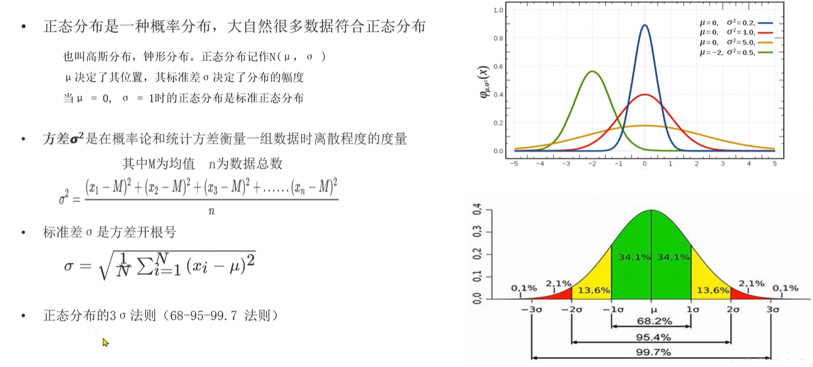

- 标准化API

~~~python
sklearn.preprocessing.StandardScaler() # 标准化对象
transfer.fit_transform(x_train) # 将特征进行标准化操作
~~~

- 代码实现：

~~~python
"""
案例：标准化

回顾：特征工程的目的和步骤
    目的：利用专业的背景知识和技巧处理数据，用于提升模型的性能
    步骤：
        1、特征提取
        2、特征预处理（归一化、标准化）
        3、特征降维
        4、特征选择
        5、特征组合

特征预处理：标准化介绍
    目的：
        防止因为量纲(单位)问题，导致特征列的方差值相差较大，影响模型的最终结果
        所以通过公式把各列的值映射到均值为0，标准差为1的正态分布序列
    公式：
        x1 = (当前值 - 该列平均值) / 该列标准差
    应用场景：
        适用于大数据集的处理

结论：无论是归一化还是标准化，目的都是为了解决因为量纲（单位）问题，导致模型评估较低等问题

回顾：
    方差计算公式：该列每个值 和 该列均值的差 的平方和 的平均值
    标准差计算公式：方差开平方根
"""

# 1、导包：标准化对象
from sklearn.preprocessing import StandardScaler

# 2、准备数据集（标准化的原数据）
x_train = [[90, 2, 10, 40], [60, 4, 15, 45], [75, 3, 13, 46]]

# 3、创建标准化对象
transfer = StandardScaler()

# 4、对原数据集进行归一化操作
x_train_new = transfer.fit_transform(x_train)

# 5、打印数据
print('标准化后的数据集为：\n')
print(x_train_new)

# 6、打印数据集的均值和方差
print(f'数据集的均值：{transfer.mean_}\n')
print(f'数据集的方差：{transfer.var_}\n')
print(f'数据集的标准差：{transfer.scale_}\n')
~~~


### 4.4 总结

- 归一化
  - 如果出现异常点，影响了最大值和最小值，那么结果显然会发生改变
  - 应用场景：最大值和最小值非常容易收到异常点影响，鲁棒性较差，只适合传统精确小数据场景
  - transfer = sklearn.preprocessing.MinMaxScaler(feature_range=(0, 1))
- 标准化
  - 如果出现异常点，由于具有一定数据量，少量的异常点对于平均值的影响并不大
  - 应用场景：适合现代嘈杂大数据场景
  - transfer = sklearn.preprocessing.StandardScaler()


## 5、鸢尾花案例

### 5.1 前置了解

- 数据特征
  - 花萼长
  - 花萼宽
  - 花瓣长
  - 花瓣宽

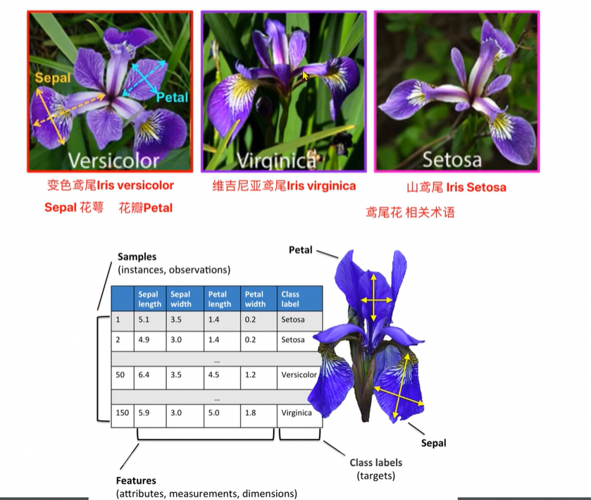

- 实现流程
  - 获取数据集
  - 数据基本处理
  - 数据集预处理 —> 数据标准化
  - 机器学习（模型训练）
  - 模型评估
  - 模型预测


### 5.2 代码实现

#### 5.2.1 导包

~~~python
"""
案例：通过KNN算法实现鸢尾花分类操作

回顾：机器学习项目的研发流程
    1、获取数据集
    2、数据基本处理
    3、数据集预处理 —> 数据标准化
    4、机器学习（模型训练）
    5、模型评估
    6、模型预测
"""
from itertools import count

# 导包
from sklearn.datasets import load_iris                  # 加载鸢尾花测试集
import seaborn as sns
import pandas as pd
import matplotlib.pyplot as plt
from sklearn.model_selection import train_test_split    # 分割训练集和测试集的
from sklearn.preprocessing import StandardScaler        # 数据标准化
from sklearn.neighbors import KNeighborsClassifier      # KNN算法分类对象
from sklearn.metrics import accuracy_score              # 模型评估的，计算模型预测的准确率
~~~


#### 5.2.2 查看数据集信息

~~~python
# 1、定义函数，加载鸢尾花数据集，并查看数据集
def cust_load_iris():
    # 1、加载鸢尾花数据集
    iris_data = load_iris()
    # 2、查看数据集
    print(f'数据集：{iris_data}')               # 字典形态
    print(f'数据集类型：{type(iris_data)}')      # <class 'sklearn.utils._bunch.Bunch'>
    # 3、查看数据集所有的键
    print(f'数据集所有的键：{iris_data.keys()}')    # dict_keys(['data', 'target', 'frame', 'target_names', 'DESCR', 'feature_names', 'filename', 'data_module'])
    # 4、数据集最重要的信息
    print(f'数据集特征数据：{iris_data.data}')
    print(f'数据集特征数据有{len(iris_data.data)}条数据')          # 有150条数据，每条数据有4个特征
    print(f'数据集标签数据：{iris_data.target}')
    print(f'数据集标签数据有{len(iris_data.target)}条数据')        # 有150条数据，每条数据有1个标签
    print(f"特征对应的名称：{iris_data.feature_names}")           # ['sepal length (cm)', 'sepal width (cm)', 'petal length (cm)', 'petal width (cm)']
    print(f"标签对应的名称：{iris_data.target_names}")            # ['setosa' 'versicolor' 'virginica']
    # 5、其他信息
    print(f"数据集框架：{iris_data.frame}")                       # None
    print(f"数据集描述：{iris_data.DESCR}")
    print(f"数据集文件名：{iris_data.filename}")                  # iris.csv
    print(f"数据集的模型（在哪个包下）：{iris_data.data_module}")    # sklearn.datasets.data
~~~


#### 5.2.3 绘制数据集的散点图

```python
# 2、定义函数，绘制数据集的散点图
def cust_show_iris():
    # 1、加载鸢尾花数据集
    iris_data = load_iris()
    # 2、把鸢尾花数据集封装成 DateFrame对象
    iris_df = pd.DataFrame(data=iris_data.data, columns=iris_data.feature_names)
    # 3、给df对象新增一列，即：标签列
    iris_df['label'] = iris_data.target
    # 4、通过 Seaborn绘制散点图
    """
        参数1：数据集
        参数2：x轴
        参数3：y轴
        参数4：分组字段
        参数5：是否显示拟合线
    """
    sns.lmplot(
        data=iris_df, 
        x='sepal length (cm)', 
        y='sepal width (cm)', 
        hue='label', 
        fit_reg=True
    )
    # 5、设置标题，显示
    plt.title('iris data')
    plt.tight_layout()          # 自动调整子图参数，使整个图像的边界与子图匹配
    plt.show()
```


#### 5.2.4 数据集划分

~~~python
# 3、定义函数，数据集划分，切分训练集和测试集
def cust_split_train_test():
    # 1、加载鸢尾花数据集
    iris_data = load_iris()
    # 2、数据的预处理：从150条特征和标签中，按照8:2的比例，切分训练集和测试集
    """
        入参：
            参数1：特征数据
            参数2：标签数据
            参数3：测试集比例
            参数4：随机种子（种子一致，每次生成的随机数据集都是固定的）
        返回值：
            参数1：训练集的特征数据
            参数2：测试集的特征数据
            参数3：训练集的标签数据
            参数4：测试集的标签数据
    """
    x_train, x_test, y_train, y_test = train_test_split(
        iris_data.data,  # 特征数据
        iris_data.target,  # 标签数据
        test_size=0.2,
        random_state=23
    )
    # 3、打印切割后的数据
    print(f'训练集的特征：{x_train}, 个数：{len(x_train)}')           # 120条，每条4列（特征）
    print(f'测试集的特征：{x_test}, 个数：{len(x_test)}')             # 30条，每条4列（特征）
    print(f'训练集的标签：{y_train}, 个数：{len(y_train)}')           # 120条，每条1列（标签）
    print(f'测试集的标签：{y_test}, 个数：{len(y_test)}')             # 30条，每条1列（标签）
~~~


#### 5.2.5 模型训练

```python
# 4、实现鸢尾花案例
def cust_iris_evaluate_test():
    # 1、加载数据
    iris_data = load_iris()
    # 2、数据的预处理，这里是把150条数据，按照8：2的比例，切分训练集和测试集
    x_train, x_test, y_train, y_test = train_test_split(
        iris_data.data,  # 特征数据
        iris_data.target,  # 标签数据
        test_size=0.2,
        random_state=23
    )

    # 3、特征工程（特征提取、预处理...）
    # 思考1：特征提取：因为原数据只有4个特征列，且都是要用的，所以这里不需要特征提取
    # 思考2：特征预处理：因为原数据的4列特征值差值不大，所以其实无需做特征预处理，但是，加入特征预处理会让代码流程更加规范，所以加入
    # 3.1 创建标准化对象
    transfer = StandardScaler()
    # 3.2 对特征列进行标准化处理，即：x_train(训练集的特征数据)，x_test(测试集的特征数据)
    # fit_transform兼具fit和transform的功能，即：训练、转化，该函数适合：第一次进行标准化的时候使用,一般用于处理训练集
    x_train = transfer.fit_transform(x_train)
    # transform只有转换的功能，该函数适合：重复进行标准化动作的时候使用，一般用于处理测试集
    x_test = transfer.transform(x_test)

    # 4、模型训练
    # 4.1 创建模型对象
    estimator = KNeighborsClassifier(n_neighbors=5)
    # 4.2 具体的训练模型的动作
    estimator.fit(x_train, y_train)     # 传入：训练集的特征数据，训练集的标签数据

    # 5、模型预测
    # 场景1：对刚刚切分的 测试集（30条）进行预测]
    # 5.1 直接预测即可，获取预测结果
    y_pred = estimator.predict(x_test)      # 入参：测试集的特征数据
    # 5.2 打印预测结果
    print(f'测试集预测结果为：{y_pred}')

    # 场景2：对新的数据集（源数据集150条之外的）进行预测
    # 5.1 自定义调试
    my_data = [[7.8, 2.1 , 3.9, 1.6]]
    # 5.2 对数据进行标准化处理
    my_data = transfer.transform(my_data)
    # 5.3 模型预测
    y_pred_new = estimator.predict(my_data)  # 入参：自定义特征数据
    # 5.4 打印预测结果
    print(f'自定义调试预测结果为：{y_pred_new}')
    # 5.5 查看上述数据每种分类的预测概率
    y_pre_proba = estimator.predict_proba(my_data)
    print(f'自定义调试预测概率为：{y_pre_proba}')      # [[0.  0.6 0.4]] ——> 0分类概率、1分类概率、2分类概率

    # 6、模型评估
    # 方式1：直接评分，基于：测试集的特征和测试集的标签
    print(f'准确率：{estimator.score(x_test, y_test)}')
    # 方式2：基于测试集的标签和预测结果进行评分
    print(f'准确率：{accuracy_score(y_test, y_pred)}')
```


#### 5.2.6 代码综合

~~~python
"""
案例：通过KNN算法实现鸢尾花分类操作

回顾：机器学习项目的研发流程
    1、获取数据集
    2、数据基本处理
    3、数据集预处理 —> 数据标准化
    4、机器学习（模型训练）
    5、模型评估
    6、模型预测
"""
from itertools import count

# 导包
from sklearn.datasets import load_iris                  # 加载鸢尾花测试集
import seaborn as sns
import pandas as pd
import matplotlib.pyplot as plt
from sklearn.model_selection import train_test_split    # 分割训练集和测试集的
from sklearn.preprocessing import StandardScaler        # 数据标准化
from sklearn.neighbors import KNeighborsClassifier      # KNN算法分类对象
from sklearn.metrics import accuracy_score              # 模型评估的，计算模型预测的准确率


# 1、定义函数，加载鸢尾花数据集，并查看数据集
def cust_load_iris():
    # 1、加载鸢尾花数据集
    iris_data = load_iris()
    # 2、查看数据集
    print(f'数据集：{iris_data}')               # 字典形态
    print(f'数据集类型：{type(iris_data)}')      # <class 'sklearn.utils._bunch.Bunch'>
    # 3、查看数据集所有的键
    print(f'数据集所有的键：{iris_data.keys()}')    # dict_keys(['data', 'target', 'frame', 'target_names', 'DESCR', 'feature_names', 'filename', 'data_module'])
    # 4、数据集最重要的信息
    print(f'数据集特征数据：{iris_data.data}')
    print(f'数据集特征数据有{len(iris_data.data)}条数据')          # 有150条数据，每条数据有4个特征
    print(f'数据集标签数据：{iris_data.target}')
    print(f'数据集标签数据有{len(iris_data.target)}条数据')        # 有150条数据，每条数据有1个标签
    print(f"特征对应的名称：{iris_data.feature_names}")           # ['sepal length (cm)', 'sepal width (cm)', 'petal length (cm)', 'petal width (cm)']
    print(f"标签对应的名称：{iris_data.target_names}")            # ['setosa' 'versicolor' 'virginica']
    # 5、其他信息
    print(f"数据集框架：{iris_data.frame}")                       # None
    print(f"数据集描述：{iris_data.DESCR}")
    print(f"数据集文件名：{iris_data.filename}")                  # iris.csv
    print(f"数据集的模型（在哪个包下）：{iris_data.data_module}")    # sklearn.datasets.data


# 2、定义函数，绘制数据集的散点图
def cust_show_iris():
    # 1、加载鸢尾花数据集
    iris_data = load_iris()
    # 2、把鸢尾花数据集封装成 DateFrame对象
    iris_df = pd.DataFrame(data=iris_data.data, columns=iris_data.feature_names)
    # 3、给df对象新增一列，即：标签列
    iris_df['label'] = iris_data.target
    # 4、通过 Seaborn绘制散点图
    """
        参数1：数据集
        参数2：x轴
        参数3：y轴
        参数4：分组字段
        参数5：是否显示拟合线
    """
    sns.lmplot(
        data=iris_df,
        x='sepal length (cm)',
        y='sepal width (cm)',
        hue='label',
        fit_reg=True
    )
    # 5、设置标题，显示
    plt.title('iris data')
    plt.tight_layout()          # 自动调整子图参数，使整个图像的边界与子图匹配
    plt.show()


# 3、定义函数，数据集划分，切分训练集和测试集
def cust_split_train_test():
    # 1、加载鸢尾花数据集
    iris_data = load_iris()
    # 2、数据的预处理：从150条特征和标签中，按照8:2的比例，切分训练集和测试集
    """
        入参：
            参数1：特征数据
            参数2：标签数据
            参数3：测试集比例
            参数4：随机种子（种子一致，每次生成的随机数据集都是固定的）
        返回值：
            参数1：训练集的特征数据
            参数2：测试集的特征数据
            参数3：训练集的标签数据
            参数4：测试集的标签数据
    """
    x_train, x_test, y_train, y_test = train_test_split(
        iris_data.data,  # 特征数据
        iris_data.target,  # 标签数据
        test_size=0.2,
        random_state=23
    )
    # 3、打印切割后的数据
    print(f'训练集的特征：{x_train}, 个数：{len(x_train)}')           # 120条，每条4列（特征）
    print(f'测试集的特征：{x_test}, 个数：{len(x_test)}')             # 30条，每条4列（特征）
    print(f'训练集的标签：{y_train}, 个数：{len(y_train)}')           # 120条，每条1列（标签）
    print(f'测试集的标签：{y_test}, 个数：{len(y_test)}')             # 30条，每条1列（标签）


# 4、实现鸢尾花案例
def cust_iris_evaluate_test():
    # 1、加载数据
    iris_data = load_iris()
    # 2、数据的预处理，这里是把150条数据，按照8：2的比例，切分训练集和测试集
    x_train, x_test, y_train, y_test = train_test_split(
        iris_data.data,  # 特征数据
        iris_data.target,  # 标签数据
        test_size=0.2,
        random_state=23
    )

    # 3、特征工程（特征提取、预处理...）
    # 思考1：特征提取：因为原数据只有4个特征列，且都是要用的，所以这里不需要特征提取
    # 思考2：特征预处理：因为原数据的4列特征值差值不大，所以其实无需做特征预处理，但是，加入特征预处理会让代码流程更加规范，所以加入
    # 3.1 创建标准化对象
    transfer = StandardScaler()
    # 3.2 对特征列进行标准化处理，即：x_train(训练集的特征数据)，x_test(测试集的特征数据)
    # fit_transform兼具fit和transform的功能，即：训练、转化，该函数适合：第一次进行标准化的时候使用,一般用于处理训练集
    x_train = transfer.fit_transform(x_train)
    # transform只有转换的功能，该函数适合：重复进行标准化动作的时候使用，一般用于处理测试集
    x_test = transfer.transform(x_test)

    # 4、模型训练
    # 4.1 创建模型对象
    estimator = KNeighborsClassifier(n_neighbors=5)
    # 4.2 具体的训练模型的动作
    estimator.fit(x_train, y_train)     # 传入：训练集的特征数据，训练集的标签数据

    # 5、模型预测
    # 场景1：对刚刚切分的 测试集（30条）进行预测]
    # 5.1 直接预测即可，获取预测结果
    y_pred = estimator.predict(x_test)      # 入参：测试集的特征数据
    # 5.2 打印预测结果
    print(f'测试集预测结果为：{y_pred}')

    # 场景2：对新的数据集（源数据集150条之外的）进行预测
    # 5.1 自定义调试
    my_data = [[7.8, 2.1 , 3.9, 1.6]]
    # 5.2 对数据进行标准化处理
    my_data = transfer.transform(my_data)
    # 5.3 模型预测
    y_pred_new = estimator.predict(my_data)  # 入参：自定义特征数据
    # 5.4 打印预测结果
    print(f'自定义调试预测结果为：{y_pred_new}')
    # 5.5 查看上述数据每种分类的预测概率
    y_pre_proba = estimator.predict_proba(my_data)
    print(f'自定义调试预测概率为：{y_pre_proba}')      # [[0.  0.6 0.4]] ——> 0分类概率、1分类概率、2分类概率

    # 6、模型评估
    # 方式1：直接评分，基于：测试集的特征和测试集的标签
    print(f'准确率：{estimator.score(x_test, y_test)}')
    # 方式2：基于测试集的标签和预测结果进行评分
    print(f'准确率：{accuracy_score(y_test, y_pred)}')


if __name__ == '__main__':
    # 1、加载鸢尾花数据集，并查看数据集
    # cust_load_iris()
    # 2、绘制数据集的散点图
    # cust_show_iris()
    # 3、数据集划分
    # cust_split_train_test()
    # 4、实现鸢尾花案例
    cust_iris_evaluate_test()
~~~


## 6、超参数选择方法

### 6.1 交叉验证

- 什么是交叉验证？
  - 是一种<font  color="red">**数据集的分割方法**</font>，将训练集划分为 <font  color="red">**n 份**</font>，拿<font  color="red">**一份做验证集（测试集）**</font>、<font  color="red">**其他 n-1 份做训练集**</font>

- 交叉验证法原理（以 4 折交叉验证为例，cv=4）

  - 第一次：把**第一份**数据做验证集，其他数据做训练

  - 第二次：把**第二份**数据做验证集，其他数据做训练

  - … 以此类推，总共训练 4 次，评估 4 次

  - 使用训练集 + 验证集多次评估模型，取**平均值**作为交叉验证的模型得分

  - 交叉验证结束后，通常会用全部数据（训练集 + 验证集）重新训练一个最终模型
    - 在交叉验证阶段，我们把**原始训练集**拆成了 k 份（比如 4 份），轮流用其中 1 份做验证、剩下 3 份做训练。
    - 这一步的目的是**评估不同模型 / 超参数的表现**，选出得分最好的那个（比如 k=4 时表现最好的模型）。
    - 但交叉验证时，每次训练只用了 3/4 的数据，没有用到全部数据。
    - 所以，为了让最终模型学到**尽可能多的数据信息**，我们会把之前拆分的「训练集 + 验证集」重新合并，用**完整的原始训练集**对最优模型再训练一次，让模型能力最大化。

- 以 4 折交叉验证（cv=4）为例

  1. 将训练集均分为 4 份：A、B、C、D
  2. 第 1 轮：A 做验证集，B+C+D 做训练集 → 得到第 1 个分数
  3. 第 2 轮：B 做验证集，A+C+D 做训练集 → 得到第 2 个分数
  4. 第 3 轮：C 做验证集，A+B+D 做训练集 → 得到第 3 个分数
  5. 第 4 轮：D 做验证集，A+B+C 做训练集 → 得到第 4 个分数
  6. 最终模型得分 = (分数 1 + 分数 2 + 分数 3 + 分数 4) / 4

- 核心结论：交叉验证法，是划分数据集的一种方法，目的就是为了得到<font  color="red">**更加准确可信的模型评分**</font>

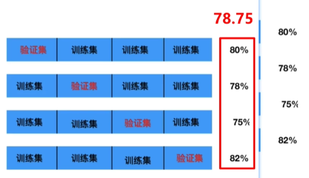


### 6.2 网格搜索

- 为什么需要网格搜索？
  - 模型有很多超参数，其能力也存在很大的差异。<font color="red">**需要手动产生很多超参数组合，来训练模型**</font>
  - 每组超参数都采用<font color="red">**交叉验证评估**</font>，最后选出最优参数组合建立模型。
  - 示例：`n_neighbors = [1, 2, 3, 5, 7]`，采用**4 折验证**，共执行次数：`5 × 4 = 20 次`
- 核心思想
  - 你先给每个超参数设定一个候选值列表，网格搜索会把这些列表做<font color="red">**全排列组合**</font>，生成一个 “网格”，然后逐个尝试网格里的每一组参数，用交叉验证打分，最后保留得分最高的参数组合
  - 举个例子：
    - 超参数 1：`max_depth` → 候选值 `[3, 5, 7]`
    - 超参数 2：`learning_rate` → 候选值 `[0.01, 0.1, 0.2]`
    - 网格组合：`(3,0.01)、(3,0.1)、(3,0.2)、(5,0.01)、(5,0.1)、(5,0.2)、(7,0.01)、(7,0.1)、(7,0.2)`，共 9 组
    - 对每一组都用交叉验证（比如 5 折）训练 + 评估，最后挑出得分最高的那组作为最优超参

- 网格搜索的作用

  - 网格搜索是<font color="red">**模型调参的有力工具**</font>，是寻找最优超参数的工具。

  - <font color="red">**只需要将若干参数传递给网格搜索对象**</font>，它自动帮我们完成不同超参数的组合、模型训练、模型评估，<font color="red">**最终返回一组最优的超参数**</font>

- 网格搜索 + 交叉验证的强力组合（模型选择和调优）

  - 交叉验证解决<font color="red">**模型的数据输入问题（数据集划分）**</font>，得到更可靠的模型。

  - 网格搜索解决<font color="red">**超参数的组合问题**</font>。

  - 两个组合再一起形成一个模型参数调优的解决方案。


### 6.3 交叉验证网格搜索 API 介绍

~~~python
sklearn.model_selection.GridSearchCV(estimator, param_grid=None, cv=None)
~~~

- 参数说明

  - **estimator**：估计器对象（即你要调参的模型，如 `KNeighborsClassifier`）

  - **param_grid**：估计器参数，以字典形式传入，例如 `{"n_neighbors":[1,3,5]}`

  - **cv**：指定几折交叉验证（如 `cv=4` 表示 4 折交叉验证）

- 核心方法
  - **fit(X, y)**：输入训练数据，执行网格搜索与交叉验证
  - **score(X, y)**：在测试集上计算模型准确率

- 结果分析属性

  - `best_score_`：交叉验证中得到的最好平均结果

  - `best_estimator_`：最优超参数对应的模型

  - `cv_results_`：每次交叉验证后，验证集与训练集的准确率结果


### 6.4 代码实现

~~~python
"""
案例：演示 网格搜索和 交叉验证

交叉验证：
    原理：把数据分成n份；例如分成：4份 ——> 也叫：4折交叉验证
        第1次:把第1份数据作为 验证集，其它作为训练集，训练模型，模型预测，获取:准确率 ——> 准确率1
        第2次:把第2份数据作为 验证集，其它作为训练集，训练模型，模型预测，获取:准确率 ——> 准确率2
        第3次:把第3份数据作为 验证集，其它作为训练集，训练模型，模型预测，获取:准确率 ——> 准确率3
        第4次:把第份数据作为 验证集，其它作为训练集，训练模型，模型预测，获取:准确率 ——> 准确率4
        然后计算上述的4次准确率的平均值，作为:模型最终的准确率.
        交叉验证结束后，通常会用全部数据（训练集 + 验证集）重新训练一个最终模型
    目的：为了让模型的最终验证结果更准确

网格搜素：
    目的/ 作用：寻找最优超参；
    原理：接收超参可能出现的值，然后针对超参的每个值进行 交叉验证，获取到 最优超参组合；
    超参：需要用户手动录入的数据，不同的超参（组合），可能会影响模型的最终评测结果

通俗理解：网格搜索 + 交叉验证，本质上指的是 GirdSearchCV这个API它会帮我们寻找最有超参
"""

# 导包
from sklearn.datasets import load_iris                                # 加载鸢尾花测试集
from sklearn.model_selection import train_test_split, GridSearchCV    # 分割训练集和测试集的,寻找最优超参（网格搜索 + 交叉验证）
from sklearn.preprocessing import StandardScaler                      # 数据标准化
from sklearn.neighbors import KNeighborsClassifier                    # KNN算法分类对象
from sklearn.metrics import accuracy_score                            # 模型评估的，计算模型预测的准确率

# 1、加载鸢尾花数据集
iris_data = load_iris()

# 2、数据预处理，这里是切分训练集和测试集，比例8:2
"""
    入参：
        参数1：特征数据
        参数2：标签数据
        参数3：测试集比例
        参数4：随机种子（种子一致，每次生成的随机数据集都是固定的）
    返回值：
        参数1：训练集的特征数据
        参数2：测试集的特征数据
        参数3：训练集的标签数据
        参数4：测试集的标签数据
"""
x_train, x_test, y_train, y_test = train_test_split(
    iris_data.data,  # 特征数据
    iris_data.target,  # 标签数据
    test_size=0.2,
    random_state=22
)

# 3、特征工程 ——> 特征预处理 ——> 标准化
# 3.1 创建标准化对象
transfer = StandardScaler()
# 3.2 对训练集和测试集的数据进行标准化
x_train = transfer.fit_transform(x_train)
x_test = transfer.transform(x_test)

# 4、模型训练
# 4.1 创建KNN对象
estimator = KNeighborsClassifier()
# 4.2 定义字典，记录：超参可能出现的情况（值）
param_dict = {'n_neighbors': [i for i in range(1, 11)]}
# 4.3 创建 GridSearchCV 对象，寻找最优超参，使用网格搜搜 + 交叉验证
"""
入参：
    参数1：要计算最优超参的模型对象
    参数2：该模型超参可能出现的值
    参数3：交叉验证的折数，这里4折表示：每个超参组合都会进行4折交叉验证，这里共计：4 * 10 = 40次
返回值：
    estimator：处理后的模型对象
"""
estimator = GridSearchCV(estimator, param_dict, cv=4)
# 4.4 模型训练
estimator.fit(x_train, y_train)
# 4.5 打印最优超参组合
print(f'最优评分：{estimator.best_score_}')
print(f'最优超参组合：{estimator.best_params_}')
print(f'最优估计器对象：{estimator.best_estimator_}')
print(f'具体的交叉验证结果：{estimator.cv_results_}')

# 5.模型评估
# 5.1 获取最优超参的模型对象
# estimator=estimator.best_estimator_ # 获取最优的模型对象
estimator=KNeighborsClassifier(n_neighbors=3)
# 5.2 模型训练
estimator.fit(x_train, y_train)
# 5.3 模型预测
y_predict=estimator.predict(x_test)
# 5.4 模型评估
#参1：测试集，参2：预测集
print("准确率：", accuracy_score(y_test, y_predict))
~~~


### 6.5 例题

~~~bash
交叉验证和网格搜索的目的是什么？（多选）
A、为了让呗评估的模型更加准确可信，一般会使用交叉验证网格搜索取完成任务
B、有些算法模型本身自带较多的超参数，无法高效的去筛选比较合适的超参数组合
C、使用交叉验证和网格搜索可以提升模型的可信度和查找最佳参数组合的效率
D、仅交叉验证功能能提升模型的准确率

答案：ABC
~~~


## 7、手写数字识别

### 7.1 前置要求


# 三、线性回归

## 1、简介

