# 一、简介

- Claude Code 是 Anthropic 推出的 AI 编程助手，能直接在你的电脑上帮你干活。你只需要用简单的语言告诉它要做什么，它就能理解你的项目，自动完成操作
- 普通 AI 对话核心区别：<font color="red">**不只是聊天，而是能直接帮你动手做**事</font>

| 维度     | 普通 AI 对话（网页版）                            | Claude Code                                               |
| -------- | ------------------------------------------------- | --------------------------------------------------------- |
| 交互方式 | 复制代码 → 粘贴到对话框 → 复制回答 → 粘贴回编辑器 | 直接在你的项目里操作，不需要来回复制                      |
| 上下文   | 你告诉它什么，它才知道什么                        | 它能自己读你整个项目的代码，自己搜索文件                  |
| 执行力   | 只能给你建议和代码片段                            | 能直接创建文件、修改代码、运行命令、跑测试                |
| 记忆     | 每次对话是独立的                                  | 通过 CLAUDE.md 和 Memory 系统，它能记住项目规则和你的偏好 |
| 工具调用 | 无法调用外部工具                                  | 通过 MCP 可以连接浏览器、数据库、GitHub 等外部服务        |

- 一个直观的比喻：
  - 普通 AI 对话 = 你打电话问一个远程顾问
  - Claude Code = 你请了一个助手坐在你旁边，他能自己翻你的文件夹，自己动手改


# 二、安装

## 1、安装流程

- 官网：https://claude.com/product/claude-code

- 安装步骤流程

  - 安装git

  - 安装Nodejs

  - 安装Claude Code


## 2、git和Nodejs安装

- git地址：https://git-scm.com/
- Nodejs地址：https://nodejs.org/zh-cn
- 下载安装包后下一步就行
- cmd验证安装成功

~~~bash
# 验证git是否安装成功
git -v
# 打印：git version 2.50.0.windows.1

# 验证Nodejs是否安装成功
node -v
# 打印：v24.14.0
npm -v
# 打印：11.9.0
~~~


## 3、Claude Code安装

### 3.1 安装

- 打开cmd
- 执行命令

~~~bash
# 如果网络环境不太好可以先执行这条命令
npm config set registry https://registry.npmmirror.com

# 执行如下命令，开始安装claude code
npm install -g @anthropic-ai/claude-code
~~~

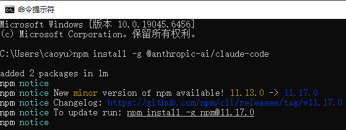

- 验证安装是否成功：claude --version

~~~bash
claude --version
# 打印：2.1.220 (Claude Code)
~~~


### 3.2 deepseek生成apikey

- deepseek平台地址：[https://platform.deepseek.com](https://platform.deepseek.com/usage)
- 创建APIKEY

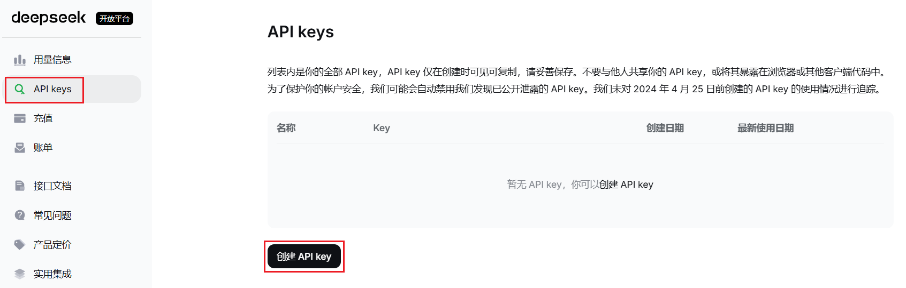

- 为 APIKEY 设置一个名字（随意）

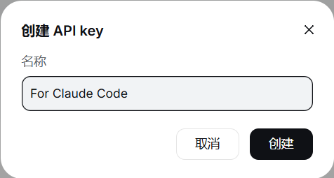

- 点击创建后会显示 APIKEY，请复制并保存好，APIKEY 只显示这一次，如果遗忘需要重新创建一个；

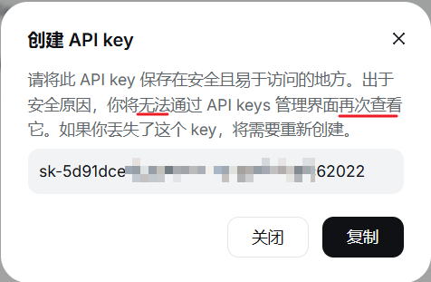

- 创建完成

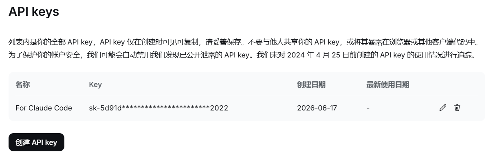


### 3.3 ClaudeCode配置

#### 3.3.1 配置参数介绍

| 参数（环境变量）               | 作用                         | 何时使用                 |
| ------------------------------ | ---------------------------- | ------------------------ |
| ANTHROPIC_API_KEY              | Anthropic 官方 API Key       | 直接使用官方服务时       |
| ANTHROPIC_AUTH_TOKEN           | 第三方平台的 API Key         | 使用中转 / 第三方模型时  |
| ANTHROPIC_BASE_URL             | API 端点地址（覆盖默认地址） | 使用中转 / 第三方服务时  |
| ANTHROPIC_MODEL                | 默认使用的模型名称或别名     | 持久指定默认模型         |
| ANTHROPIC_DEFAULT_OPUS_MODEL   | opus 槽位映射的具体模型      | 自定义三级槽位映射       |
| ANTHROPIC_DEFAULT_SONNET_MODEL | sonnet 槽位映射的具体模型    | 自定义三级槽位映射       |
| ANTHROPIC_DEFAULT_HAIKU_MODEL  | haiku 槽位映射的具体模型     | 自定义三级槽位映射       |
| API_TIMEOUT_MS                 | API 请求超时间（毫秒）       | 网络慢或模型推理耗时长时 |

- 提示： **参数关系说明**：
  - ANTHROPIC_API_KEY 用于官方直连
  - ANTHROPIC_AUTH_TOKEN 用于第三方服务。
  - 两者不要同时设置，否则会冲突。ANTHROPIC_BASE_URL 只在使用非官方端点时需要设置


#### 3.3.2 配置对比

- **三种配置方式对比：**

| 配置方式                   | 持久性         | 作用范围       | 推荐场景                    |
| -------------------------- | -------------- | -------------- | --------------------------- |
| **临时环境变量**           | 关闭终端即失效 | 当前终端窗口   | 快速测试、临时切换          |
| **永久环境变量**           | 永久生效       | 所有终端和项目 | 日常一台电脑固定使用        |
| **配置文件 settings.json** | 永久生效       | 全局或特定项目 | 多项目/多模型切换、团队共享 |

- 配置文件路径说明：

  - **全局**：~/.claude/settings.json（Windows：C:\Users\<用户名>\.claude\settings.json）

  - **项目级（团队共享）**：项目根目录/.claude/settings.json（可提交 Git）

  - **项目级（个人私有）**：项目根目录/.claude/settings.local.json（加入 .gitignore）


#### 3.3.3 接入三方模型

- **工作原理：**Claude Code 内部有一个<font color="red">**三级模型槽位**</font>体系。无论你用哪个模型提供商，它始终维护三个"角色位"：

| 槽位（别名） | 用途                                 | 对应环境变量                   |
| ------------ | ------------------------------------ | ------------------------------ |
| **opus**     | 复杂推理、架构决策                   | ANTHROPIC_DEFAULT_OPUS_MODEL   |
| **sonnet**   | 日常编码主力模型                     | ANTHROPIC_DEFAULT_SONNET_MODEL |
| **haiku**    | 后台轻量任务（自动压缩、文件分析等） | ANTHROPIC_DEFAULT_HAIKU_MODEL  |

- 接入第三方模型有两种方式：


| 方式                           | 原理                                                         | 优点                           | 适用场景                        |
| ------------------------------ | ------------------------------------------------------------ | ------------------------------ | ------------------------------- |
| **Anthropic 兼容接口**（推荐） | 模型厂商提供 Anthropic Messages API 格式的接口，三个槽位自动映射 | 配置简单，无需逐个指定模型名   | 智谱 GLM 等已提供兼容接口的厂商 |
| **直接指定模型**               | 通过 --model 或环境变量指定具体模型名称                      | 灵活，适用任何 OpenAI 兼容接口 | DeepSeek、通义千问、Ollama 等   |

- <font color="red">**方式一：直接指定模型（通用方式）**</font>

  ```bash
  # 设置 API Key 和 Base URL（大部分第三方模型都兼容 OpenAI 格式）
  set ANTHROPIC_AUTH_TOKEN="你的模型API-Key"
  set ANTHROPIC_BASE_URL="模型的API地址"
  ```

  然后在启动 Claude Code 时指定模型：

  ```bash
  # 使用指定模型启动
  $ claude --model "模型名称"
  ```

- <font color="red">**方式二：Anthropic 兼容接口（自动映射，包含 DeepSeek、GLM、Kimi）**</font>

  目前官方提供 Anthropic Messages API 兼容端点的国产厂商越来越多，包括：

  | 厂商                 | Anthropic 兼容端点                     | 官方文档                                                     |
  | -------------------- | -------------------------------------- | ------------------------------------------------------------ |
  | **DeepSeek**         | https://api.deepseek.com/anthropic     | https://api-docs.deepseek.com/zh-cn/quick_start/agent_integrations/claude_code |
  | **智谱 GLM**         | https://open.bigmodel.cn/api/anthropic | https://docs.bigmodel.cn/cn/coding-plan/tool/claude          |
  | **Kimi（月之暗面）** | https://api.moonshot.ai/anthropic      | https://platform.moonshot.cn/docs/guide/agent-support        |

  配置后，Claude Code 界面仍然显示 Opus/Sonnet/Haiku 的别名，但实际调用的是厂商的模型——这就是**服务端模型映射**。

  以智谱 GLM 为例：

  ```bash
  # 智谱 GLM 最简配置
  set ANTHROPIC_AUTH_TOKEN="你的智谱API-Key"
  set ANTHROPIC_BASE_URL="https://open.bigmodel.cn/api/anthropic"
  ```

  智谱 GLM **默认**的服务端自动映射关系（根据官方文档最新表述）：

  | Claude Code 界面显示 | 实际调用的模型  |
  | -------------------- | --------------- |
  | Opus                 | **GLM-4.7**     |
  | Sonnet               | **GLM-4.7**     |
  | Haiku                | **GLM-4.5-Air** |

  > **提示**：要用上旗舰型号 **GLM-5.1**，需要手动覆盖三个槽位（详见下面「接入智谱 GLM」部分）。**不要误以为默认就是 GLM-5.1**。
  >
  > **现在GLM的Coding Plan非常抢手，不一定能买到，而且有限额、高峰期翻倍消耗额度。**

- <font color="red">**方式三：通过配置文件（推荐持久化配置）**</font>

  除了环境变量，还可以在 settings.json 的 env 块中配置，效果相同但更持久、更清晰：

  ```json
  // ~/.claude/settings.json（全局生效）
  {
    "env": {
     "ANTHROPIC_AUTH_TOKEN": "你的API-Key",
     "ANTHROPIC_BASE_URL": "https://open.bigmodel.cn/api/anthropic",
     "API_TIMEOUT_MS": "3000000"
    }
  }
  ```

  > **提示**：三种配置方式的优先级为：启动参数 --model > 环境变量 ANTHROPIC_MODEL > 配置文件 settings.json 中的 model 字段。选择最适合你工作习惯的方式即可。

  **接入智谱 GLM 的完整步骤：**

  智谱 AI 提供了 Anthropic Messages API 兼容接口，是目前国内**配置最简单**的方案之一。

  >  **官方文档**：https://docs.bigmodel.cn/cn/coding-plan/tool/claude

  **最简配置（使用默认 GLM-4.7 映射）：**

  ```bash
  # 环境变量方式
  set ANTHROPIC_AUTH_TOKEN="你的智谱Key"
  set ANTHROPIC_BASE_URL="https://open.bigmodel.cn/api/anthropic"
  ```

  或使用配置文件（智谱官方推荐方式）：

  ```json
  // ~/.claude/settings.json
  {
    "env": {
     "ANTHROPIC_AUTH_TOKEN": "你的智谱Key",
     "ANTHROPIC_BASE_URL": "https://open.bigmodel.cn/api/anthropic",
     "API_TIMEOUT_MS": "3000000",
     "CLAUDE_CODE_DISABLE_NONESSENTIAL_TRAFFIC": 1
    }
  }
  ```

  另外智谱官方要求在 ~/.claude.json 中添加（跳过首次启动的引导流程）：

  ```json
  // ~/.claude.json
  {
    "hasCompletedOnboarding": true
  }
  ```

  配置完成后重启终端，运行 claude 即可。默认服务端映射如上表（Opus/Sonnet → GLM-4.7，Haiku → GLM-4.5-Air）。

  **使用 GLM-5.1（需手动覆盖三个槽位）：**

  GLM-5.1 / GLM-5-Turbo 作为高阶模型，对标 Claude Opus，使用时会按“高峰期 3 倍、非高峰期 2 倍”系数消耗套餐额度（"高峰期"为每日 14:00～18:00 UTC+8）。如需使用，手动覆盖：

  ```json
  // ~/.claude/settings.json
  {
    "env": {
     "ANTHROPIC_AUTH_TOKEN": "你的智谱Key",
     "ANTHROPIC_BASE_URL": "https://open.bigmodel.cn/api/anthropic",
     "ANTHROPIC_DEFAULT_OPUS_MODEL": "glm-5.1",
     "ANTHROPIC_DEFAULT_SONNET_MODEL": "glm-5-turbo",
     "ANTHROPIC_DEFAULT_HAIKU_MODEL": "glm-4.5-air",
     "API_TIMEOUT_MS": "3000000",
     "CLAUDE_CODE_DISABLE_NONESSENTIAL_TRAFFIC": 1
    }
  }
  ```

  > 注意： **版本兼容提醒**：第三方 Anthropic 兼容接口可能会受到 Claude Code 新功能影响。如果遇到工具调用或 Beta 参数报错，优先查看对应厂商官方文档的兼容说明，不要盲目复制旧版本配置。

  > 提示： **一键脚本**：macOS / Linux 用户可以直接运行官方脚本自动完成上述配置：
  >
  > ```bash
  > curl -O "https://cdn.bigmodel.cn/install/claude_code_env.sh" && bash ./claude_code_env.sh
  > ```

  

#### 3.3.4 模型配置速查表

**所有模型配置速查表（以各厂商官方文档为准）：**

| 模型          | 接口类型           | API Base URL                                  | 模型名称 / 映射                                      | 是否需 --model | 官方文档                      |
| ------------- | ------------------ | --------------------------------------------- | ---------------------------------------------------- | -------------- | ----------------------------- |
| Claude (官方) | Anthropic 原生     | 默认                                          | 建议使用 sonnet / opus / haiku 别名或官方当前模型 ID | 否             | https://docs.anthropic.com    |
| Claude (中转) | Anthropic 兼容     | 中转服务商地址                                | 同上                                                 | 否             | 中转服务商网站                |
| **DeepSeek**  | **Anthropic 兼容** | https://api.deepseek.com/anthropic            | 官方示例：deepseek-v4-pro[1m]、deepseek-v4-flash     | 否             | https://api-docs.deepseek.com |
| **智谱 GLM**  | **Anthropic 兼容** | https://open.bigmodel.cn/api/anthropic        | 默认 Opus/Sonnet→GLM-4.7、Haiku→GLM-4.5-Air          | 否             | https://docs.bigmodel.cn      |
| **Kimi**      | **Anthropic 兼容** | https://api.moonshot.ai/anthropic             | 三个槽位都用 kimi-k2.5                               | 否             | https://platform.moonshot.cn  |
| 通义千问Max   | OpenAI 兼容        | https://dashscope.aliyuncs.com/apps/anthropic | qwen-max                                             | 是             | https://dashscope.aliyun.com  |


### 3.4 接入 DeepSeek 的完整步骤

- 参考 DeepSeek 官方文档：https://api-docs.deepseek.com/zh-cn/guides/coding_agents

- 修改复制如下内容

~~~bash
{
  "env": {
    "ANTHROPIC_BASE_URL": "https://api.deepseek.com/anthropic",
    "ANTHROPIC_AUTH_TOKEN": "你的DEEPSEEK-APIKEY",
    "ANTHROPIC_MODEL": "deepseek-v4-flash[1m]",
    "ANTHROPIC_DEFAULT_OPUS_MODEL": "deepseek-v4-flash[1m]",
    "ANTHROPIC_DEFAULT_SONNET_MODEL": "deepseek-v4-flash[1m]",
    "ANTHROPIC_DEFAULT_HAIKU_MODEL": "deepseek-v4-flash[1m]",
    "CLAUDE_CODE_DISABLE_NONESSENTIAL_TRAFFIC": "1",
    "CLAUDE_CODE_EFFORT_LEVEL": "max"
  }
}
~~~

- 参数介绍
  - **提示**：参数关系说明：ANTHROPIC_API_KEY 用于官方直连，ANTHROPIC_AUTH_TOKEN 用于第三方服务，两者不要同时设置，否则……（后续文字被截断）

- 打开如下文件（如果文件或文件夹没有请直接新建或者cmd执行claude命令即可）：
  - Windows 系统：C:\Users\你的用户名\.claude\settings.json
  - Mac 系统：~/.claude/settings.json
- 将上述内容复制到文件中，并保存即可


### 3.5 ClaudeCode测试

- 新建文件夹test，cmd进入
- 执行：claude，进入 claude code 界面（第一次进入）
- 如下图，选择文本风格，建议选择编号 1 自动控制（按键盘上下键控制）然后回车

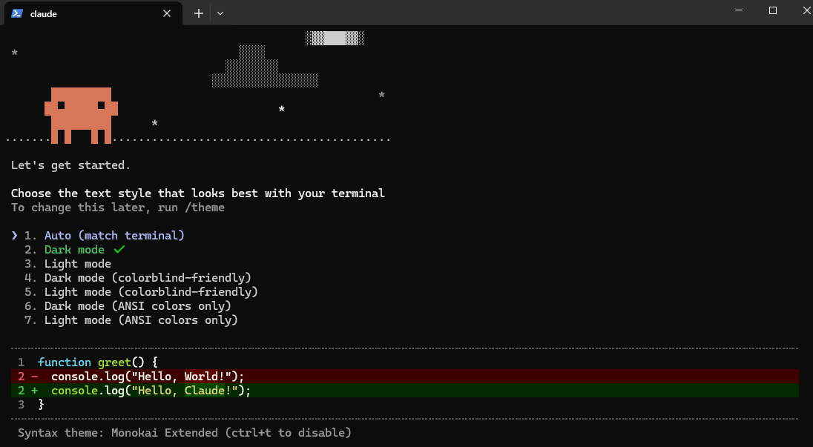

- 会弹出一些安全警告，直接按回车即可，如下图

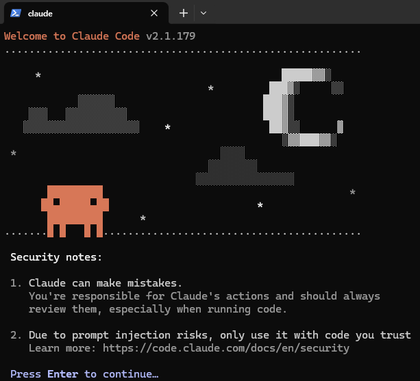

- 选择 yes信任文件夹，如下图

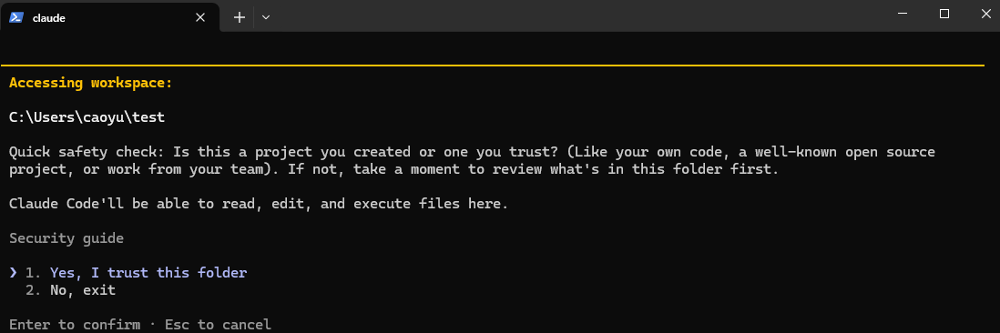

- 此时可以正常使用 claude code 了
- 先问一个简单问题， 你是什么大模型？

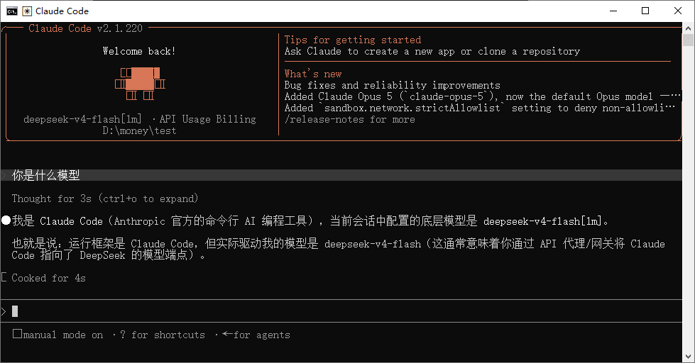


## 4、cc-switch工具

上面几类方案你并不需要"二选一"——很多人的真实使用场景是：**今天偶尔走 Anthropic 官方、明天切中转、后天干脆用 DeepSeek，偶尔还要用 GLM Coding Plan 套餐**。手动改环境变量太麻烦，这时候就需要一个专门的多模型管理器。

**cc-switch** 是社区开源的一款桌面小工具，可以让你在多个 Claude Code 配置间一键切换。

- **项目地址**：https://github.com/farion1231/cc-switch
- **下载**：进入 Releases 页面，选对应系统（Windows、macOS、Linux）的安装包
- **使用**：打开 cc-switch → 点击“新增” → 填入 API Key 和 BaseURL → 起个名字（如 “Anthropic-官方”、“DeepSeek”、“GLM-CodingPlan”）保存 → 需要哪个点哪个
- 保存后，他会写入到setting文件中

工作机制：cc-switch 把你配置的多个 API Key 和 BaseURL 存起来，选择哪个就自动修改对应的环境变量，然后重启终端运行 `claude` 就生效。

> 注意： **最容易翻车的坑（必看）**：**切换 cc-switch 一定要在启动 `claude` 之前**！如果你已经在 cc 会话里了再去 cc-switch 切换，是切不动的——环境变量在进程启动时就被加载到内存了。正确顺序是：先 cc-switch 选定配置 → **重启终端** → 运行 `claude`。很多新手都在这里上过当。

> 提示： **适用人群**：如果你只用一家服务商，直接走上面配置方案里的 `settings.json` 即可，不需要 cc-switch。它是为"多模型重度用户"准备的。

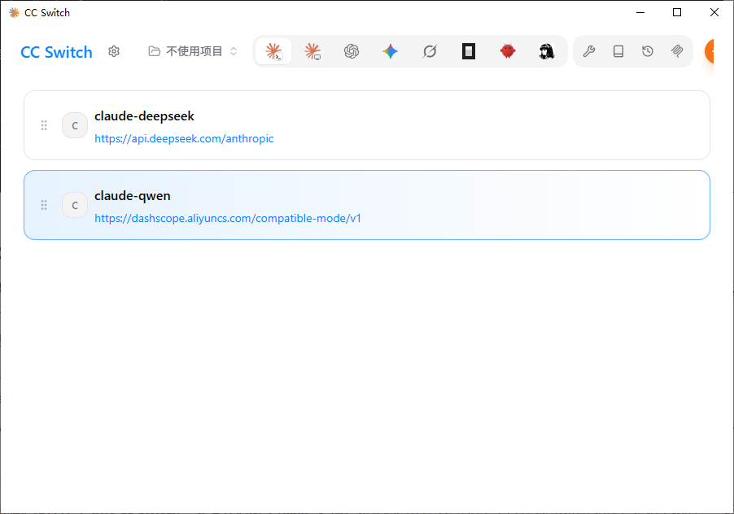


## 5、集成vscode

- vscode官网：https://code.visualstudio.com/

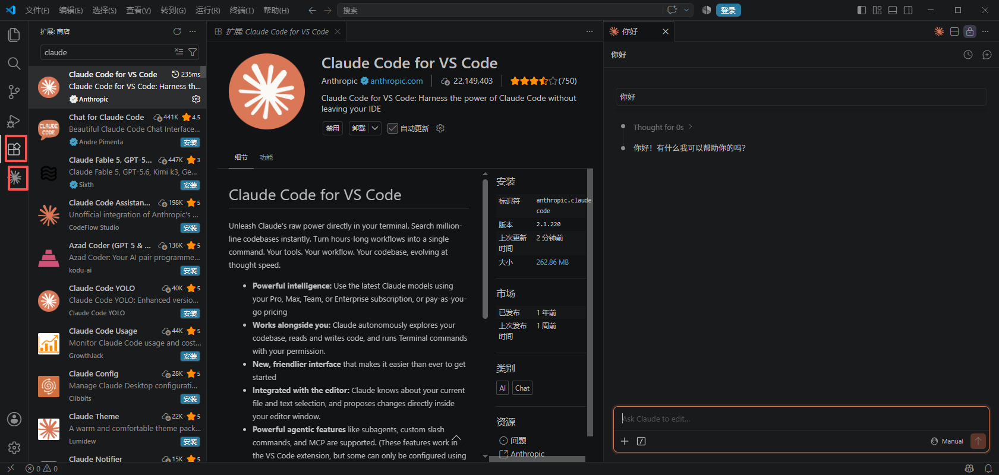


# 三、使用

Claude Code 的能力可以按 **7 层扩展（Harness）** 来理解。Anthropic 官方在 2026 年 5 月的企业级指南中总结了这个框架：

1. **CLAUDE.md** — 项目说明书，每次会话自动加载
2. **Hooks** — 事件触发器，在特定时机自动执行
3. **Skills** — 专业知识包，AI 按需加载
4. **Plugins** — 把 Skills + Hooks + MCP 打包分发
5. **LSP** — 给 AI 装上 IDE 级的代码导航
6. **MCP** — 连接外部工具和数据源
7. **子 Agent** — 独立上下文并行干活

这 7 层从底向上，每一层建立在前一层之上。前 3 层是基础配置，后 4 层是高级扩展。本部分和第四部分会逐个展开。

官方反复强调一个观点：**模型能力是地板，配置质量才是天花板**。花时间把配置做好，比追最新模型版本更有实际收益


## 1、模型切换

配置好API后，你可能会问："这么多模型，我该用哪个？"这一节帮你解答。

**Claude 模型家族对比：**

| 模型              | 速度 | 代码质量 | 推理能力 | 成本     | 推荐场景                           |
| ----------------- | ---- | -------- | -------- | -------- | ---------------------------------- |
| Claude Haiku 4.5  | 极快 | 良好     | 中等     | $ 较低   | 简单代码补全、格式化、小修改       |
| Claude Sonnet 4.6 | 快   | 优秀     | 强       | $$ 适中  | 日常开发、功能实现（**默认推荐**） |
| Claude Opus 4.7   | 中等 | 顶级     | 极强     | $$$ 较高 | 复杂架构设计、疑难 Bug、算法难题   |

**成本估算参考（2026-05-18 核对）：**

| 模型              | 输入费用     | 输出费用      | 一次普通编程对话费用 |
| ----------------- | ------------ | ------------- | -------------------- |
| Claude Haiku 4.5  | $1/百万Token | $5/百万Token  | 低成本批处理         |
| Claude Sonnet 4.6 | $3/百万Token | $15/百万Token | 日常开发主力         |
| Claude Opus 4.7   | $5/百万Token | $25/百万Token | 复杂问题少量使用     |

> **提示**：日常开发使用 Sonnet 就足够了。只在遇到特别复杂的问题时才切换到 Opus。Haiku 适合大批量处理简单的任务。

**在 Claude Code 中切换模型（四种方式）：**

Claude Code 提供了四种模型切换方式，按优先级从高到低排列：

**方法一：启动时指定（临时使用）**

```bash
# 使用模型别名（推荐，自动指向最新版本）
$ claude --model opus      # 最强推理
$ claude --model sonnet    # 日常编码（默认）
$ claude --model haiku     # 快速轻量

# 使用具体模型名时，请以当前服务商官方文档为准
$ claude --model opus
$ claude --model "deepseek-v4-pro[1m]"
```

> **提示**：Claude Code 提供了方便的**模型别名**，常见包括 `opus`、`sonnet`、`haiku`、`default` 等。具体别名会随版本变化，使用前以 `/model` 当前显示为准。

**方法二：运行中切换（使用斜杠命令）**

在 Claude Code 对话中直接输入：

```
> /model           # 打开模型选择器（交互式）
> /model sonnet      # 直接切换到 Sonnet
> /model opus       # 直接切换到 Opus
```

选择后会保存到用户设置，下次启动也会生效。

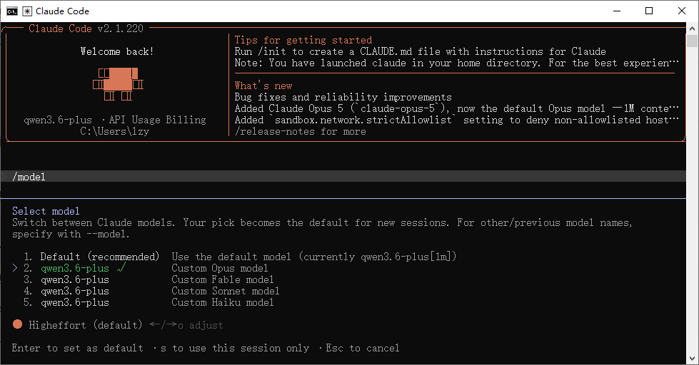

**方法三：环境变量持久设置**

```bash
# 设置默认使用的模型（支持别名或具体名称）
set ANTHROPIC_MODEL="sonnet"
```

**方法四：配置文件持久设置（推荐）**

在 `settings.json` 中设置 `model` 字段，重启即生效：

```json
// ~/.claude/settings.json（全局生效）
{
  "model": "sonnet"
}
```

```json
// 项目/.claude/settings.json（仅该项目生效）
{
  "model": "opus"
}
```

> **注意**：四种方式的优先级为：`--model` 启动参数 > `ANTHROPIC_MODEL` 环境变量 > `settings.json` 中的 `model` 字段。`/model` 命令的选择会保存到用户设置文件。

**配置文件层级说明：**

| 配置文件位置                       | 作用范围             | 是否提交 Git    | 优先级 |
| ---------------------------------- | -------------------- | --------------- | ------ |
| `~/.claude/settings.json`          | 全局（所有项目）     | 否              | 低     |
| `项目/.claude/settings.json`       | 当前项目（团队共享） | 是              | 中     |
| `项目/.claude/settings.local.json` | 当前项目（个人私有） | 否（gitignore） | 高     |

**不同模型的使用建议：**

| 场景                | 推荐模型                       | 理由                     |
| ------------------- | ------------------------------ | ------------------------ |
| 日常功能开发        | Claude Sonnet                  | 速度和质量的最佳平衡     |
| 简单代码修改/格式化 | Claude Haiku                   | 足够胜任，成本最低       |
| 复杂架构设计        | Claude Opus                    | 最强推理，值得多花钱     |
| Bug调试（简单）     | Claude Sonnet                  | 通常够用                 |
| Bug调试（复杂）     | Claude Opus 或 DeepSeek V4 Pro | 需要深度推理             |
| 中文项目文档        | Claude Sonnet / 通义千问       | 中文能力出色             |
| 预算紧张            | DeepSeek API / GLM / Kimi      | 按当前价格选择性价比方案 |
| 离线/隐私敏感       | 本地Ollama模型                 | 完全本地，免费           |

**实际对比实验：**

用同一个任务测试不同模型的表现，帮你直观感受差异：

**测试任务**：用 Express.js 创建一个简单的 RESTful API，包含 GET 和 POST 两个端点。

```
> 请用 Express.js 创建一个简单的待办事项 API，包含：
> 1. GET /todos - 获取所有待办事项
> 2. POST /todos - 创建新的待办事项
> 数据存在内存中即可，不需要数据库。
```

| 模型            | 完成时间   | 代码质量                                                   | 额外优化                           |
| --------------- | ---------- | ---------------------------------------------------------- | ---------------------------------- |
| Claude Haiku    | ~3秒       | 功能正确，代码简洁                                         | 无额外优化                         |
| Claude Sonnet   | ~8秒       | 功能正确，有输入验证和错误处理                             | 添加了 CORS、请求体解析中间件      |
| Claude Opus     | ~15秒      | 功能正确，架构清晰                                         | 分层设计、详细注释、完整的错误处理 |
| DeepSeek V4 Pro | 视网络而定 | 功能正确，代码规范There's an issue witThere's an issue wit | 适合低成本深度推理                 |

> **提示**：模型选择没有绝对的对错，关键是**根据任务复杂度选择合适的模型**。简单任务用贵的模型是浪费钱，复杂任务用便宜的模型是浪费时间。


## 2、核心配置详解

Claude Code 有多层配置体系，从全局到项目级，层层覆盖。

**配置层级：**

```
全局配置（影响所有项目）
  └── ~/.claude/settings.json

项目级配置（只影响当前项目）
  └── 项目根目录/.claude/settings.json

项目上下文文件（告诉AI项目背景信息）
  └── 项目根目录/CLAUDE.md ← 最重要！
```

##### 3.2.1 settings.json 配置文件

Claude Code 的配置文件位于 `~/.claude/settings.json`（全局）或项目目录下的 `.claude/settings.json`（项目级）。

常用配置项：

```json
{
  // 允许 Claude Code 执行的操作（不再需要每次确认）
  "permissions": {
   "allow": [
     "Read",        // 读取文件
     "Write",       // 写入文件
     "Bash(npm *)",   // 执行 npm 命令
     "Bash(git *)",   // 执行 git 命令
     "Bash(node *)"   // 执行 node 命令
   ],
   "deny": [
     "Bash(rm -rf *)" // 禁止执行危险的删除命令
   ]
  },
  // 默认使用的模型
  "model": "sonnet",
  // 自动紧凑阈值（上下文使用超过此比例时自动压缩）
  "autoCompactThreshold": 80
}
```

> **注意**：权限设置要谨慎。过于宽松的权限可能导致AI执行你不期望的操作。建议初学者保持默认设置，让 Claude Code 在执行每个操作前都询问你确认。

##### 3.2.2 CLAUDE.md：你的项目"说明书"

CLAUDE.md 是 Claude Code 中**最重要的配置文件之一**。它就像你给新来的实习生写的"项目入职手册" —— 告诉AI这个项目的背景、技术栈、编码规范和当前进度。

**为什么 CLAUDE.md 如此重要？**

没有 CLAUDE.md 时，Claude Code 每次开始工作都要花时间"重新认识"你的项目。有了 CLAUDE.md，它一启动就知道项目的全部背景，效率大幅提升。

**CLAUDE.md 模板（可直接复制修改）：**

````markdown
# 项目名称

## 项目概述
一句话描述这个项目做什么。

## 技术栈
- 前端：Next.js 14 + TypeScript + Tailwind CSS
- 后端：Next.js API Routes
- 数据库：Prisma + SQLite
- 部署：Vercel

## 项目结构
​```
src/
├── app/         # Next.js App Router 页面
│   ├── api/      # API 路由
│   ├── layout.tsx # 全局布局
│   └── page.tsx   # 首页
├── components/   # React 组件
│   ├── ui/      # 通用UI组件
│   └── features/  # 业务组件
├── lib/         # 工具函数和配置
├── prisma/      # 数据库 schema 和迁移
└── types/       # TypeScript 类型定义
​```

## 编码规范
- 使用函数式组件 + React Hooks
- 组件文件使用 PascalCase 命名（如 BookmarkCard.tsx）
- 工具函数使用 camelCase 命名
- API 路由返回统一格式：{ success: boolean, data?: any, error?: string }
- 所有数据库操作通过 Prisma Client 执行

## 当前开发状态
-  项目初始化完成
-  数据库 Schema 设计完成
-  书签 CRUD API 开发中
-  前端页面待开发
-  搜索功能待开发

## 注意事项
- SQLite 数据库文件在 prisma/dev.db，不要提交到 Git
- 环境变量在 .env 文件中，不要提交到 Git
- 所有新功能先创建 Git 分支再开发
````

**CLAUDE.md 的三个层级（由顶向下叠加生效）：**

很多人只知道 CLAUDE.md 可以放在项目根目录，其实官方设计了 **3 个层级的 CLAUDE.md**，它们会同时生效、不冲突：

| 层级         | 路径                   | 作用范围       | 适合写什么                                                   |
| ------------ | ---------------------- | -------------- | ------------------------------------------------------------ |
| **全局级**   | `~/.claude/CLAUDE.md`  | 所有项目都会读 | 个人习惯、身份、翻译偏好（如"永远用中文回答"、"我是 xx、从事 xx"） |
| **项目级**   | 项目根目录/`CLAUDE.md` | 仅本项目       | 项目技术栈、架构、规范、进度（可提交 Git，团队共享）         |
| **文件夹级** | 子目录/`CLAUDE.md`     | 仅该子目录     | 模块专属约定（如 `src/payment/CLAUDE.md` 写支付模块踩过的坑） |

三层叠加生效，不冲突。优先级：文件夹级 > 项目级 > 全局级。

**两个官方推荐的创建姿势：**

- **`/init` 创建项目级**：在项目根目录下运行 `claude` 后输入 `/init`，cc 会自动扫描项目并生成一份 CLAUDE.md 初稿，你再调整。官方建议：**项目有一定规模再 `/init` 效果更好**（太空它扫不出什么东西）。
- **`/memory` 编辑全局级**：在 cc 会话里输入 `/memory` 选择“全局 CLAUDE.md”，会用默认编辑器打开该文件供你修改。**修改全局后需重启 cc 才生效。**

**最佳实践：**

1. **保持更新**：项目级 CLAUDE.md 应该是动态的——项目加了功能、踩了坑，就同步更新

2. **足够具体**：技术栈写明具体版本号，目录结构要与实际一致

3. **写明禁忌**：把"不要做什么"也写清楚（如"不要修改数据库迁移文件"）

4. **适度简洁**：不要写成论文，AI需要的是关键信息而非赘述

5. **只放"顶层不变原则"**：随着实践你会发现，CLAUDE.md 不该塞太多。卡帕西发布的「claude.skills」几百行通用规则就能拿 10 万+ Star——写点 “顶层、不变、须严守" 的东西就够了。

   ```
   https://github.com/multica-ai/andrej-karpathy-skills
   ```

##### 3.2.3 第二层记忆：Auto Memory（cc 自己的笔记本）

如果说 CLAUDE.md 是**你主动立下的规矩**，那 Auto Memory 就是 **cc 在干活过程中默默记下的设计笔记**。你没显式写进 CLAUDE.md 的习惯、反馈、项目踩坑，会被一个后台 agent 静静记录。

**如何启用：**

```bash
# 在 cc 会话中输入
/memory

# 在弹出的菜单里选第一个选项 “启用 Auto Memory”
# 启用后菜单里会多出“打开自动记忆文件夹”选项
```

**Auto Memory 会记哪几类东西：**

| 类型        | 含义         | 举例                                |
| ----------- | ------------ | ----------------------------------- |
| `user`      | 关于你       | 你的角色、偏好（如“不喜欢深色 UI”） |
| `feedback`  | 你给过的反馈 | “不要这样做"、“对，就这样"          |
| `project`   | 项目相关     | 进度、决策、技术选型                |
| `reference` | 外部资源索引 | “某份设计文档在 docs/design.md”     |

**使用手感（重要）：**

- 它只在当前项目生效（文件存在项目目录下），换项目需重新积累
- 启用后 cc 不会每次都把所有记忆全部加载进上下文，只会读一份 `memory.md` 索引——**遇到具体问题才去读对应的子文件**，占 token 很少
- 随时可以用快捷键 `Ctrl+O` 在会话中查看实际被调用过的记忆内容
- 记错了就跟它说：“忘掉刚刚说的不喜欢深色主题”，它会自己删掉

> 提示： **一句话区分 CLAUDE.md vs Auto Memory**：CLAUDE.md 是**第一优先级、全量注入的明规则**；Auto Memory 是**第二优先级、按需注入的隐规则**。两者配合，cc 越用越懂你。

##### 3.2.4 第三层记忆：自建参考文档（渐进式披露）

除了上面两层，你还可以仿照 Skill 的"**渐进式披露**"机制为 cc 手动打造一套**专项参考文档**。

**应用场景**：某些东西不适合全部塞进 CLAUDE.md（太长、太专门），但 cc 需要的时候必须能查到。比如做个产品，你希望：

- **品牌视觉规范**：颜色、字体、间距 → `docs/brand-visual.md`
- **产品文本风格**：语调、术语表 → `docs/copywriting-style.md`
- **API 约定**：请求响应格式、错误码 → `docs/api-conventions.md`

然后在 CLAUDE.md 里加上指引：

```markdown
## 外部参考文档

- 修改前端视觉、调颜色、调间距时 → 必读 `docs/brand-visual.md`
- 写产品文案、按钮文字、提示语时 → 必读 `docs/copywriting-style.md`
- 写 API 、定义返回格式时 → 必读 `docs/api-conventions.md`
```

这样 cc 只在"需要的时候"才去读完整文档，既保证了准确性，又不占多余上下文。

##### 3.2.5 三层记忆总览

Claude Code 的三层记忆体系：第一层 CLAUDE.md（你主动写，全量加载）→ 第二层 Auto Memory（cc 自己记，按需读取）→ 第三层自建参考文档（你写，cc 遇到对应任务才读）。

| 层   | 位置              | 优先级 | 加载方式               | 谁在维护              |
| ---- | ----------------- | ------ | ---------------------- | --------------------- |
| 1    | CLAUDE.md（三级） | 高     | 会话启动全量加载       | 你手动维护            |
| 2    | Auto Memory       | 中     | 先读索引、按需读子文件 | cc 自己写、你校对修改 |
| 3    | 参考文档          | 按需   | cc 遇到对应任务才读    | 你手动维护            |

>  **本质认知**：agent 的所有"记忆"，本质上都是在**合适的时候向大模型注入压缩过的上下文**。粗暴点说 —— 这些记忆机制本质上还是提示词工程，只不过由 cc 帮你组织了层次。

##### 3.2.6 .claudeignore 文件

类似于 `.gitignore`，用来告诉 Claude Code 哪些文件/目录不需要关注：

```
# .claudeignore 示例
node_modules/      # 依赖包目录（太大了，AI不需要看）
.next/            # Next.js 构建产物
dist/            # 编译输出
*.log            # 日志文件
.env             # 环境变量（包含敏感信息）
```

### 

