# 一、概述

## 1、为什么需要LangChain

### 1.1 从传统应用到智能体时代

- PC互联网时代
- 移动互联网时代
- AI 智能化时代


### 1.2 单一的大语言模型的局限性

- 单一的大语言模型有局限性
  - <font color="red">**知识受限于训练数据**</font>，无法获取训练时点之后的信息
  - <font color="red">**无法直接与外部系统交互**</font>，无法查询实时数据，调用API或读取数据库
  - <font color="red">**不具备状态保持能力**</font>，难以及逆行连贯的多轮对话，遗忘之前的上下文


- 所以要构建真正的AI应用，必须将大语言模型与外部工具、数据源和记忆机制有机结合，从而催生了LangChain框架的设计理念
- LangChain，是当前构建生产级AI智能体系统的首选


### 1.3 LangChain框架定位

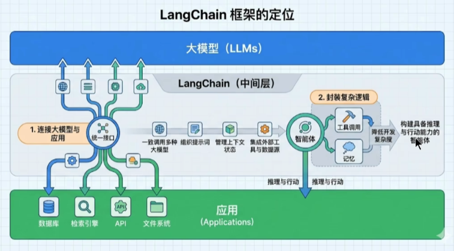

- LangChain 作为大模型与应用间的中间层，可统一调用各类大模型、管理提示词与上下文，还能集成外部工具和数据源，快速搭建具备推理、行动能力的智能体。
- 核心定位三点：
  1. <font color="red">**打通大模型与外部资源**</font>：统一接口对接数据库、检索引擎、API、文件系统等；
  2. <font color="red">**封装底层复杂逻辑**</font>：抽象工具调用、记忆等能力，降低智能体开发难度；
  3. <font color="red">**支撑多智能体协作**</font>：依托 LangGraph 等生态，从单智能体拓展至多智能体协作，可构建工业级智能体


### 1.4 LangChain应用场景

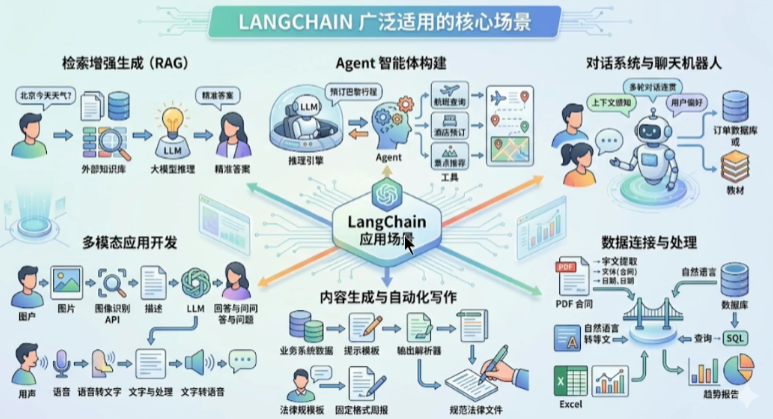

- 主要应用场景如下

  - <font color="red">**检索增强生成（RAG）**</font>

    - 流程：用户提问 → 调用外部知识库 → 大模型结合检索信息推理 → 输出精准答案

    - 价值：解决大模型 “幻觉” 和知识滞后问题，让回答更可靠、贴合业务数据

  - <font color="red">**Agent 智能体构建**</font>

    - 流程：用户目标（如 “预订巴黎行程”）→ 推理引擎规划 → Agent 调用航班查询、酒店预订等工具 → 完成复杂任务

    - 价值：让大模型具备自主规划、工具调用和多步执行能力，实现 “目标驱动” 的智能体

  - <font color="red">**对话系统与聊天机器人**</font>

    - 流程：多轮对话 → 上下文感知与用户偏好学习 → 对接订单数据库、教材等业务数据

    - 价值：构建连贯、个性化的对话交互，适用于客服、教育助手等场景

  - <font color="red">**多模态应用开发**</font>

    - 视觉方向：用户上传图片 → 图像识别 API → 生成描述 → 大模型问答

    - 语音方向：用户语音 → 转文字 → 处理 → 生成语音回复

    - 价值：打通图文、语音等多模态交互，拓展大模型的输入输出形态

  - <font color="red">**内容生成与自动化写作**</font>

    - 流程：业务系统数据 / 法律模板 → 提示模板生成 → 输出解析 → 生成规范周报、法律文件等

    - 价值：自动化生成结构化、合规的文档，提升办公效率

  - <font color="red">**数据连接与处理**</font>

    - 流程：PDF/Excel 等文件 → 文本提取 / 自然语言转等文 → 统一数据处理 → 生成 SQL 查询 → 输出趋势报告
    - 价值：让大模型直接对接企业数据资产，用自然语言完成数据分析与可视化


## 2、LangChain是什么

### 2.1 是什么

- LangChain 是一个基于 python 语言的模块化、可组合、面向开发者的开源框架，<font color="red">**旨在简化基于大型语言模型的应用程序开发**</font>。它由 Harrison Chase 于 2022 年 10 月发起，迅速成为 GitHub 上增长最快的开源项目之一。

- 顾名思义，LangChain中的“Lang”是指language，即⼤语⾔模型，“Chain”即“链”，也就是<font color="red">**将⼤模型与外部数据&各种组件连接成链，以此构建AI应⽤程序**</font>
  - LangChain ≠ LLMs
  - LangChain 之于 LLMs，类似于Spring之于 Java
  - LangChain 之于 LLMs，类似于Django、Flask之于 Python
- <font color="red">**学习LangChain框架，高效开发大模型应用**</font>


### 2.2 为什么使用LangChain

- 当ChatGPT、QwenLM、DeepSeek等大语言模型（LLM）横空出世时，开发者们立刻意识到：LLM不是终点，而是构建智能应用的“大脑”。但要让这个“大脑”真正解决实际问题，还需要解决<font color="red">**三个关键痛点**</font>：
  - <font color="red">**信息过时**</font>：LLM的知识截止于训练数据的时间节点（如GPT-4的训练数据截止到2023年），无法回答诸如“2024年最新AI论文内容”或“今天纽约股市收盘价”这样的问题
  - <font color="red">**无法动手**</font>：LLM虽然能生成自然语言，但它不能执行外部操作，比如调用API、计算数值、查询数据库、发送邮件等。它就像一个只会思考的“脑壳”，没有“手脚”。
  - <font color="red">**记忆有限**</font>：LLM的上下文窗口（例如GPT-4最多支持32,768个tokens）限制了它处理长文本的能力，难以记住对话历史或文档细节。
- 因此，我们需要一个框架，<font color="red">**将LLM的“大脑”与“感官（数据）”、“手脚（工具）”、“记忆（上下文）”连接起来，让它从“聊天机器人”升级为“能解决具体问题的助手”**</font>
- 不使用LangChain，确实可以使用GPT 或GLM4 等模型的API进行开发。比如，搭建“智能体”（Agent）、问答系统、对话机器人等复杂的 LLM 应用，但使用LangChain的<font color="red">**好处**</font>有：
  - <font color="red">**简化开发难度**</font>：更简单、更高效、效果更好
  - <font color="red">**学习成本更低**</font>：不同模型的API不同，调用方式也有区别，切换模型时学习成本高。使用LangChain，可以以统一、规范的方式进行调用，有更好的移植性。
  - <font color="red">**现成的链式组装**</font>：LangChain提供了一些现成的链式组装，用于完成特定的高级任务。让复杂的逻辑变得结构化、易组合、易扩展

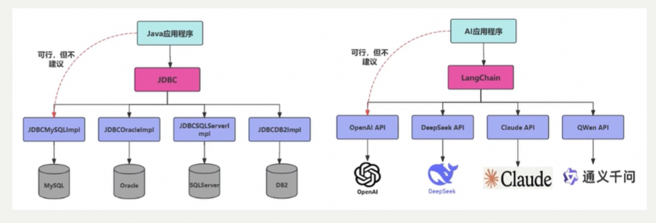

- 总结：<font color="red">**LangChain是一个能构建LLM应用的全套工具集，涉及到prompt构建、LLM接入、记忆管理、工具调用、RAG、智能体开发等模块**</font>


### 2.3 主要模块


- **langchain-core**：官方推荐的核心 API。比如 Runnable, BaseMessage 等
- **langchain-classic**：冗余代码或不推荐使用的经典 API 移到此。比如 0.x 中常用而 1.x 移除的 API 都在这里。
- **langchain-community**：第三方集成，比如：合作伙伴包 `langchain-openai`, `langchain-anthropic` 等，按需安装、避免臃肿。
- **langgraph**：深度整合 LangGraph 1.0，协调多个 Chain、Agent、Tools 完成更复杂（下方文字被遮挡，推测为 “任务，可能也需要调用到 LangGraph 的”）


### 2.4 API文档

- 官网：https://www.langchain.com/

- Github 地址：https://github.com/langchain-ai

- 中文文档地址：https://docs.langchain.org.cn/oss/python/langchain/overview

- 英文文档地址：https://docs.langchain.com/oss/python/langchain/overview

- API 文档查询地址：https://reference.langchain.com/python/langchain/


## 3、LangChain四大支柱


- 截至 2025 年 11 月，LangChain 已从一个独立的开发框架，成长为一个覆盖智能体系统全生命周期的技术生态。该生态由四大核心支柱构成：LangChain、LangGraph、Deep Agent 与 LangSmith。

- LangChain 智能体生态全生命周期

  - **智能体抽象层（Deep Agent）**：复杂任务拆解、自主决策

  - **运行时编排层（LangGraph）**：多智能体协作、状态管理

  - **基础能力层（LangChain）**：大模型连接、工具调用、数据加载

  - **监控与评估层（LangSmith）**：应用监控、性能评估、问题调试

- 核心支柱构成

  - LangChain（基础能力层）

  - LangGraph（运行时编排层）

  - Deep Agent（智能体抽象层）
  - LangSmith（监控与评估层）

- 它们分别对应基础能力层、运行时编排层、智能体抽象层、监控与评估层，共同构建了一个从技术验证到生产部署、从单体智能到复杂协作的项目闭环


### 3.1 LangChain：智能体开发的基石

- LangChain 是整个生态的核心与起点，为开发者提供了模型调用、工具与中间件集成、智能体构建等一整套基础能力。

- 其核心价值如下：

  - **统一的模型抽象层**：屏蔽了不同模型服务提供商（如 OpenAI、Anthropic、Ollama 等）的接口差异，提供一致的调用方式。

  - **高度模块化的设计**：使用 Message、Tool、Agent、Middleware 等组件实现灵活的组合与扩展。

  - **丰富的集成生态**：预置了丰富的数据源、API、中间件等，构成了强大的 AI 能力枢纽。

- 在整体架构中，LangChain 如同智能体的操作系统内核，是所有上层能力构建的基础。

- **结论**：<font color="red">**如果你需要构建简单的智能体应用，无需复杂的编排需求，那就选择 LangChain**</font>


### 3.2  LangGraph：复杂工作流的编排引擎

- 当智能体的任务从单一指令执行扩展为多步骤、有状态的复杂工作流时，LangGraph 应运而生。

- 其核心思想是**将智能体内部抽象为一张有向图**。

  - **节点（Node）**：代表独立的功能单元或决策点。

  - **边（Edge）**：定义了节点之间的流转条件与路径。

  - **状态（State）**：作为一个共享上下文，在节点间传递并持久化存储任务信息。

- 通过这种图式结构，LangGraph 让智能体的工作流节点交互变得显式、可控、可观测

- 官方也强调：“快速起步用 LangChain，复杂控制用 LangGraph，二者并行协同”
  - LangChain = 能力抽象层（LLM / Tool / Message 标准化），负责 “有什么能力”
  - LangGraph = 执行与编排层（状态机 / 工作流 / 多 Agent 系统），负责 “怎么跑”


### 3.3 Deep Agent：智能体的执行框架

- Deep Agent 是新推出的全新组件，被定位为 Agent Harness（智能体执行框架）。它<font color="red">**构建于 LangChain 与 LangGraph 之上**</font>，增加了规划能力、文件系统、子 Agent 等高级功能。旨在让开发者**无须从零构建**复杂的控制逻辑，即可创建具备深度规划、长期记忆与多专家协作能力的智能体。

- Deep Agent 的核心能力如下：

  - **显式规划**：自主生成、执行并动态调整多步任务计划。

  - **虚拟文件系统**：为智能体提供结构化的中间结果与知识存储。

  - **子智能体**：支持任务在多个智能体之间的分解与协作。

  - **长期记忆**：通过与 LangGraph 状态存储的结合，实现跨对话的经验积累。

  - **可扩展中间件**：允许嵌入安全审计、性能监控或自定义业务逻辑


### 3.4 三者关系

- 三个框架不是竞争关系，并非排斥，复杂项目完全可以同时使用到这三层

- 从LangChain快速搭建，用LangGraph打磨生产稳定性，再用Deep Agents赋予Agent更强的自主能力，这才是完整的LangChain生态


### 3.5 LangSmith：可视化监控与测试平台

- 当智能体系统逐渐复杂时，单靠日志与打印输出（print）调试已无法满足调试与质量管理的需求。

- LangSmith 是 LangChain 官方推出的<font color="red">**可视化监控与测试平台，用于跟踪、记录和分析智能体在运行过程中的完整调用链路**</font>，让智能体的内部运行过程变得透明和可评估

- LangSmith 的核心目标如下：

  - **全链路追踪**：可视化追踪模型调用、提示词输入、结果输出、工具使用等行为。

  - **调试与优化**：发现运行中智能体的异常行为与性能瓶颈。

  - **评测与质量控制**：支持人工与自动化评测，量化智能体表现。

  - **团队协作**：支持多人共享测试集与调用记录。

- LangSmith 官网：`https://www.langchain.com/langsmith`

- LangSmith 的引入使得智能体的开发、调试与运维形成了完整的质量闭环


## 4、大模型应用场景介绍

### 4.1 RAG开发

- 1、背景

  - <font color="red">**大模型的知识冻结**</font>：随着 LLM 规模扩大，训练成本与周期相应增加，模型无法实时学习到最新的信息或动态变化。导致 LLM 难以应对诸如“请推荐现在的热门影片”等时间敏感的问题。

  - <font color="red">**大模型幻觉**</font>：涉及到大模型从未在训练过程中学习过的信息时，大模型无法给出准确的答复，转而开始臆想和编造答案。

- 2、举例：LLM在考试的时候面对陌生的领域，答复能力有限，然后就准备放飞自我了，而此时RAG给了一些提示和思路，让LLM懂了开始往这个提示的方向做，最终考试的正确率从60%到了90%！

- 3、何为RAG：Retrieval-Augmented Generation（检索增强生成）


- 4、这些过程中的难点：1、文件解析 2、文件切割 3、知识检索 4、知识重排序

  - 1、文件解析：如果是pdf，内部包含文件、图片、表格，图片上还有文字，需要处理。

  - 2、文件切割：没有固定的格式

  - 3、在 RAG 应用中，随着文档数量增加，召回准确率会下降，引入reranker（重排器）可对初步召回的较多 chunk（如 top 20 或 top 50）进行精排，提高召回准确率，防止LLM 处理无关信息，减少时间和成本。此外，与基于基本矢量搜索的 RAG 相比，reranker增强型 RAG 的成本更高，但与仅依靠LLM 生成答案相比，它的成本低些。Reranker的使用场景：

    - 适合：追求回答高精度和高相关性的场景中特别适合使用 Reranker，例如专业知识库或者客服系统等应用。

    - 不适合：引入reranker会增加召回时间，增加检索延迟。服务对响应时间要求高时，使用reranker可能不合适


### 4.2 Agent开发

- 充分利用 LLM 的推理决策能力，通过增加规划、记忆和工具调用的能力，构造一个能够独立思考、逐步完成给定目标的 Agent（智能体）
- 一个数学公式来表示：<font color="red">**Agent = LLM + Planning + Tools + Memory + Action**</font>


- 类比：打车到西藏玩

  - 大脑中枢：规划行程的你
  - 规划：步骤1：规划打车路线，步骤2：订饭店、酒店，。。。
  - 调用工具：调用MCP或FunctionCalling等API，滴滴打车、携程、美团订酒店饭店
  - 记忆能力：沟通时，要知道上下文。比如订酒店得知道是西藏路上的酒店，不能聊着聊着忘了最初的目的。
  - 能够执行上述操作。说走就走，不能纸上谈兵

- 智能体核心要素被细化为以下模块：

  - 1、<font color="red">**大模型（LLM）作为“大脑”**</font>：提供推理、规划和知识理解能力，是AI Agent的决策中枢。大脑主要由一个大型语言模型 LLM 组成，承担着信息处理和决策等功能， 并可以呈现推理和规划的过程，能很好地应对未知任务。

  - 2、<font color="red">**规划决策（Planning）**</font>：通过任务分解、反思与自省框架实现复杂任务处理。例如，利用思维链（Chain of Thought）将目标拆解为子任务，并通过反馈优化策略
  - 3、<font color="red">**工具使用（Tool Use）**</font>：调用外部工具（如API、数据库）扩展能力边界
  - 4、<font color="red">**记忆（Memory）**</font>：智能体像人类一样，能留存学到的知识以及交互习惯等，这样的机制能让智能体在处理重复工作时调用以前的经验，从而避免用户进行大量重复交互
    - 短期记忆：存储单次对话周期的上下文信息，属于临时信息存储机制。受限于模型的上下文窗口长度。
    - 长期记忆：可以横跨多个会话或时间周期，可存储并调用核心知识，非即时任务。比如，关于用户的偏好，过去执行过的指令等。长期记忆，可以通过模型参数微调（固化知识）、知识图谱（结构化语义网络）或向量数据库（相似性检索）方式实现。
  - 5、<font color="red">**行动（Action）**</font>：实际执行决策的模块，涵盖软件接口操作（如自动订票）和物理交互（如机器人执行搬运）。比如：检索、推理、编程等

- 智能体会形成完整的计划流程。例如先读取以前工作的经验和记忆，之后规划子目标并使用相应工具去处理问题，最后输出给用户并完成反思


### 4.3 大模型应用开发的4个场景

#### 4.3.1 纯 Prompt

- Prompt是操作大模型的唯一接口
- 当人看：你说一句，ta回一句，你再说一句，ta再回一句...


#### 4.3.2 Agent + Function Calling

- Agent：AI 主动提要求
- Function Calling：需要对接外部系统时，AI 要求执行某个函数
- 当人看：你问 ta「我明天去杭州出差，要带伞吗？」，ta 让你先看天气预报，你看了告诉ta，ta 再告诉你要不要带伞

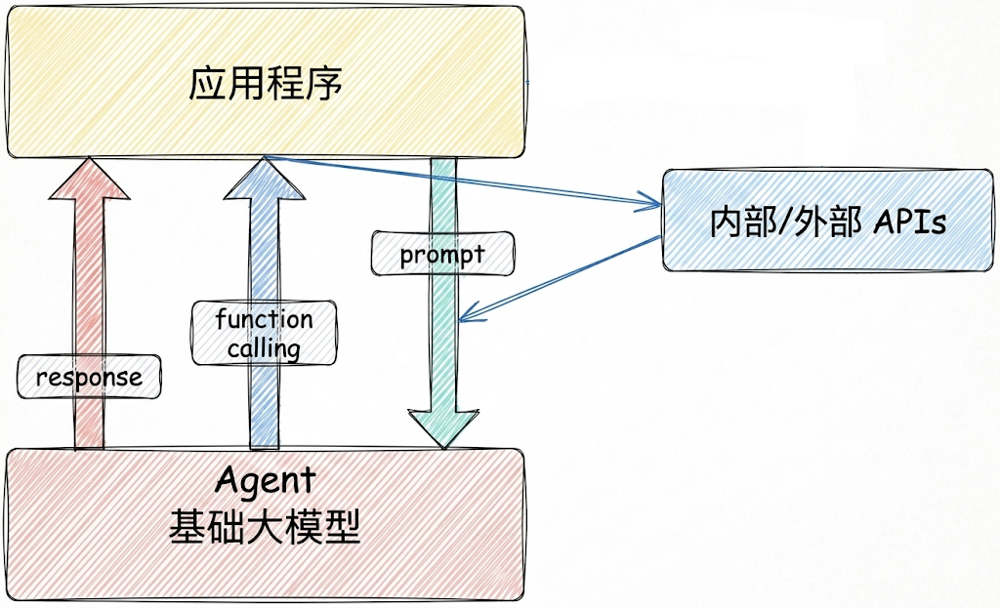


#### 4.3.3 RAG 

- RAG：需要补充领域知识时使用

  - Embeddings：把文字转换为更易于相似度计算的编码。这种编码叫向量

  - 向量数据库：把向量存起来，方便查找
  - 向量搜索：根据输入向量，找到最相似的向量

- 举例：考试答题时，到书上找相关内容，再结合题目组成答案

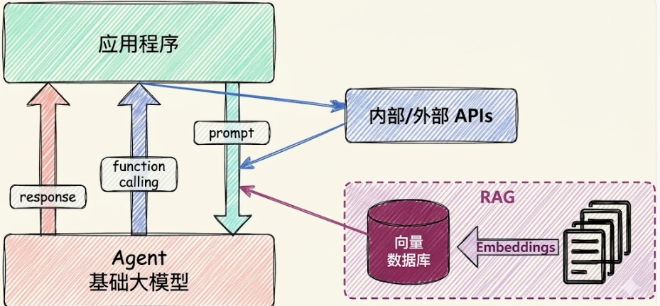


#### 4.3.4 Fine-tuning(精调/微调)

- 举例：努力学习考试内容，长期记住，活学活用。

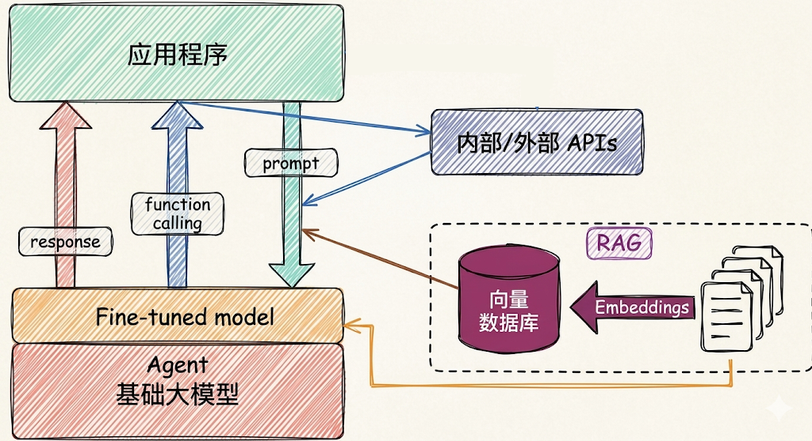


### 4.4 如何选择相关技术

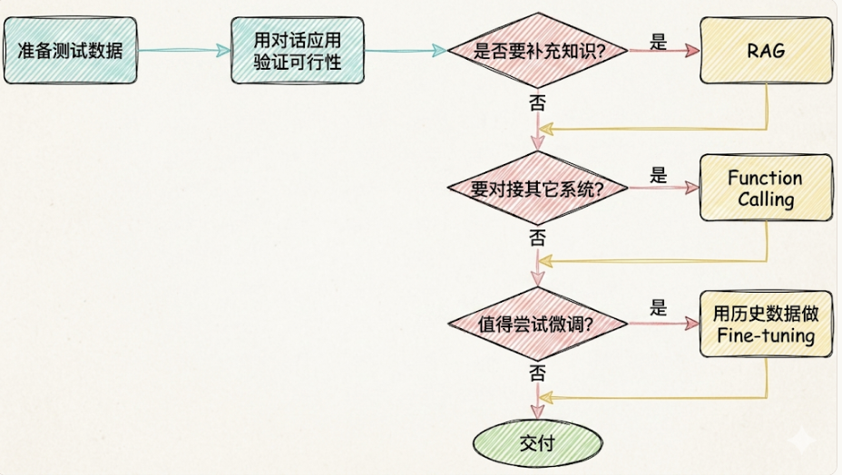


# 二、模型调用和创建

## 1、准备工作

### 1.1 大模型的调用步骤

- 在LangChain v0.3版本中，提到了Model I/O，包括输入提示(Format)、调用模型(Predict)、输出解析(Parse)。分别对应着Prompt Template ， Model 和Output Parser 


- 关于模型调用模块，如今对话模型已经是主要形式。从历史上解读：
  - 在GPT-3时代，大模型以补全模型为主，只能以类似“成语接龙”的方式对文本进行补全，并且实际运行效果也非常不稳定。此时LangChain借助一些高层封装的API，能够让模型完成对话、调用外部工具、甚至是结构化输出等功能，为开发者提供了极大的便利。
  - 伴随着GPT-3.5模型的发布，对话模型正式登上历史的舞台，并逐渐成为主流。而得益于对话模型更强的指令跟随能力，很多GPT-3需要借助LangChain才能完成的工作，已经成为GPT-3.5原生自带的一些功能。

- 所以，本章只提供了对话模型的创建，而没有了非对话模型


### 1.2 模型初始化的分类方式

- 简单来说，就是用谁家的API以什么方式创建存放在哪个位置的大模型

- 角度1：调用谁家的API
  - 使用模型提供商的库
  - 使用LangChain统一方式（推荐）

- 角度2：模型初始化时，几个重要参数(如BASE_URL、API-KEY)的书写位置的不同：
  - 使用配置文件（推荐）
  - 硬编码：写在代码文件中

- 角度3：调用的模型所在位置

  - 在线部署的大模型

  - 本地部署的大模型

- LangChain作为一个“工具”，不提供任何 LLMs，而是依赖于第三方集成各种大模型。这里就看大模型到底部署在哪里


### 1.3 线上大模型服务平台

- 有许多提供大模型API服务的平台，使用时只需要注册、充值并创建API-Key，之后即可使用API-Key与URL来调用平台提供的相应的模型的服务。

| 平台       | 网址                                           | 备注                 |
| ---------- | ---------------------------------------------- | -------------------- |
| OpenRouter | https://openrouter.ai/                         | 全球主流，含国外模型 |
| CloseAI    | https://platform.closeai-asia.com/             | 亚洲最大，含国外模型 |
| 阿里云百炼 | https://bailian.console.aliyun.com/            | 企业端友好           |
| 硅基流动   | https://www.siliconflow.cn/                    | 性价比高，适合个人   |
| 百度千帆   | https://console.bce.baidu.com/qianfan/overview | 主打百度生态         |
| 火山引擎   | https://console.volcengine.com/ark/            | 主打字节多模态生态   |

- 说明：每个平台配置时，都需要几个要素：模型名、api-key 、base-url 。

- 如果大家想使用国外的大模型，就选择前两个；如果只使用国内的大模型，可以选择后四个。


## 2、使用模型提供商库初始化

- 在 LangChain 中初始化模型，主要可以通过直接<font color="red">**使用特定的 Model Class**</font> 和<font color="red">**使用统一的 init_chat_model 函数**</font>这两种方式来实现。
- 这里先讲方式 1，这种方式最直接。LangChain 为一些大模型供应商提供了专门的 Model 类，导入对应的具体类（如 `ChatOpenAI`、`ChatAnthropic`、`ChatDeepSeek`、`ChatOllama`、`ChatHunyuan`、`ChatTongyi`、`ChatZhipuAI`）并进行实例化。
- 官网链接：https://reference.langchain.com/python/langchain-community/chat-models


### 2.1 通过专用API调用

注意：使用不同的模型可能传入的参数名称不同，可以参考对应的源码


#### 2.1.1 DeepSeek大模型

- 官网：https://www.deepseek.com/
- 步骤1：安装依赖
  - 说明：langchain-deepseek 是使用deepseek 大模型必要依赖。
  - 注意：langchain-deepseek 依赖于langchain-openai ，安装前者，pip会自动从pypi拉取元数据解析依赖，后者也会被安装。所以我们把langchain-openai 也放在此处。

~~~bash
# 初始化项目
uv init
# 安装ChatOpenAI依赖包
uv add langchain-openai
# 安装ChatDeepSeek 依赖包
uv add langchain-deepseek
# 用于环境管理的包
uv add python-dotenv
~~~

- 步骤2：创建.env环境变量

~~~bash
DEEPSEEK_API_KEY=<Your API Key>
DEEPSEEK_BASE_URL=https://api.deepseek.com
~~~

- 步骤3：读取配置并初始化模型

~~~python
from langchain_deepseek import ChatDeepSeek
import os
from dotenv import load_dotenv


# 通过load_dotenv()将.env中的变量加载为环境变量
# override=True表示：无论你当前的操作系统、终端或者虚拟环境中是否已经存在同名的环境变量，
load_dotenv(override=True)

# 从环境变量读取配置
DEEPSEEK_API_KEY = os.getenv("DEEPSEEK_API_KEY")
DEEPSEEK_BASE_URL = os.getenv("DEEPSEEK_BASE_URL")

# 创建DeepSeek LLM
deepseek_llm = ChatDeepSeek(
    api_key=DEEPSEEK_API_KEY,
    api_base=DEEPSEEK_BASE_URL,
    model_name="deepseek-v4-flash",
)

print(deepseek_llm.invoke("你好"))
~~~

- 步骤3优化：依靠默认行为读取 .env 环境变量

~~~python
from langchain_deepseek import ChatDeepSeek
import os
from dotenv import load_dotenv


# 通过load_dotenv()将.env中的变量加载为环境变量
# override=True表示：无论你当前的操作系统、终端或者虚拟环境中是否已经存在同名的环境变量，
load_dotenv(override=True)

# 从环境变量读取配置
DEEPSEEK_API_KEY = os.getenv("DEEPSEEK_API_KEY")
DEEPSEEK_BASE_URL = os.getenv("DEEPSEEK_BASE_URL")

# 创建DeepSeek LLM
deepseek_llm = ChatDeepSeek(
    model_name="deepseek-v4-flash"
)

print(deepseek_llm.invoke("你好"))
~~~

- <font color="red">**调用ChatDeepSeek要求系统存在名为DEEPSEEK_API_KEY的环境变量**</font>。URL通过源码可以查看，有默认值。如下：

~~~python
api_key: SecretStr | None = Field(
    default_factory=secret_from_env("DEEPSEEK_API_KEY",
                                 default=None),
)
"""DeepSeek API key"""
api_base: str = Field(
    default_factory=from_env("DEEPSEEK_API_BASE",
                         default=DEFAULT_API_BASE),
)
"""DeepSeek API base URL"""
DEFAULT_API_BASE = "https://api.deepseek.com/v1"
~~~


#### 2.1.2 智谱大模型

- 官网：<https://www.bigmodel.cn/>

- 步骤1：相关依赖：

~~~bash
# 安装 Langchain 社区依赖包，包含ChatHunyuan、ChatTongyi、ChatZhipuAI
uv add langchain-community
# ChatZhipuAI / 智谱 AI 认证相关依赖
uv add pyjwt
~~~

- 步骤2：在.env环境变量中补充

~~~bash
ZHIPUAI_API_KEY=<Your API Key>
ZHIPUAI_BASE_URL=https://open.bigmodel.cn/api/paas/v4/
~~~

- 步骤3：初始化大模型

~~~python
import os

from langchain_community.chat_models import ChatZhipuAI
from dotenv import load_dotenv

# override=True 确保.env文件优先
load_dotenv(override=True)

ZHIPUAI_API_KEY = os.getenv("ZHIPUAI_API_KEY")
ZHIPUAI_BASE_URL = os.getenv("ZHIPUAI_BASE_URL")

zhipu_llm = ChatZhipuAI(
    model="glm-5.1",
    api_base=ZHIPUAI_BASE_URL,  #可选
    api_key=ZHIPUAI_API_KEY     #可选
)
print(zhipu_llm.invoke("请介绍一下你自己"))
~~~


#### 2.1.3 千问大模型

- 通过阿里云百炼平台调用，官网：<https://bailian.console.aliyun.com/>
- 步骤1：相关依赖：

~~~bash
# ChatTongyi / 阿里通义千问依赖包
uv add dashscope
~~~

- 步骤2：环境变量.env
  - 注意：一般不要添加这样的环境变量
  - DASHSCOPE_BASE_URL=<https://dashscope.aliyuncs.com/compatible-mode/v1>
  - 百炼平台提供了两种访问方式：专用SDK和OpenAI兼容接口，上述URL是为后者准备的，而ChatTongyi底层是基于专用SDK实现的，如果指定了上述URL，则运行报错

~~~bash
DASHSCOPE_API_KEY=<Your API Key>
~~~

- 步骤3：初始化模型

~~~python
import os
from langchain_community.chat_models import ChatTongyi
from dotenv import load_dotenv

# override=True 确保.env文件优先
load_dotenv(override=True)
DASHSCOPE_API_KEY = os.getenv("DASHSCOPE_API_KEY")
tongyi_llm = ChatTongyi(
    api_key=DASHSCOPE_API_KEY,
    model="glm-5",
)

print(tongyi_llm.invoke("请介绍一下你自己"))
~~~


### 2.2 兼容用法

- 一方面，LangChain没有为所有大模型厂商提供专用接口，见Langchain大模型集成列表。如果选用的平台没有专用接口，可以通过兼容接口调用。
- 另一方面，专用接口的对接方式五花八门，如腾讯混元的ChatHunyuan需要单独的APP_ID + SecretId + SecretKey ，配置繁琐，用户不友好。

- 结论：<font color="red">**大多数API平台都支持OpenAI API接口规范，所以基本都可以通过 ChatOpenAI 集成**</font>
- DeepSeek

~~~python
import os

from dotenv import load_dotenv
from langchain_openai import ChatOpenAI

# 从环境变量中加载
load_dotenv(override=True)
# 从环境变量读取配置
DASHSCOPE_API_KEY = os.getenv("DASHSCOPE_API_KEY")
DASHSCOPE_BASE_URL = os.getenv("DASHSCOPE_BASE_URL")

chat_model = ChatOpenAI(
    api_key=DASHSCOPE_API_KEY,
    base_url=DASHSCOPE_BASE_URL,
    model_name="glm-5"
)

print(chat_model.invoke("你好"))
~~~

- 智谱

~~~python
import os

from dotenv import load_dotenv
from langchain_openai import ChatOpenAI

# 从环境变量中加载
load_dotenv(override=True)
# 从环境变量读取配置
DEEPSEEK_API_KEY = os.getenv("DEEPSEEK_API_KEY")
DEEPSEEK_BASE_URL = os.getenv("DEEPSEEK_BASE_URL")

chat_model = ChatOpenAI(
    api_key=DEEPSEEK_API_KEY,
    base_url=DEEPSEEK_BASE_URL,
    model_name="glm-5.1"
)

print(chat_model.invoke("你好"))
~~~

- 千问

~~~python
import os

from dotenv import load_dotenv
from langchain_openai import ChatOpenAI

# 从环境变量中加载
load_dotenv(override=True)
# 从环境变量读取配置
DASHSCOPE_API_KEY = os.getenv("DASHSCOPE_API_KEY")
DASHSCOPE_BASE_URL = os.getenv("DASHSCOPE_BASE_URL")

chat_model = ChatOpenAI(
    api_key=DASHSCOPE_API_KEY,
    base_url=DASHSCOPE_BASE_URL,
    model_name="glm-5"
)

print(chat_model.invoke("你好"))
~~~


### 2.3 中转站

- 受政策影响，国内无法直接调用国外顶尖的闭源模型，某些复杂任务需要用这些模型实现，此时可以通过中转平台曲线救国


#### 2.3.1 OpenRouter

- 官网：<https://openrouter.ai/>

- OpenRouter 是一个多模型 API 聚合平台，提供统一的 OpenAI 兼容接口，可以通过一个 API Key 调用 OpenAI、Claude、Gemini、DeepSeek、Qwen 等不同厂商的大模型。它适合用于模型对比、模型路由、Agent 应用开发和课程实验。

- 是目前知名度最高的中转平台。但是使用的话，需要tizi（即魔法，大家都懂的）

- 步骤1：相关依赖：

~~~bash
# OpenRouter 模型集成
uv add langchain-openrouter
~~~

- 步骤2：环境变量

~~~bash
OPENROUTER_API_KEY=<YOUR_API_KEY>
OPENROUTER_API_BASE=https://openrouter.ai/api/v1
~~~

- 步骤3：LangChain 当前版本为 OpenRouter 提供了专用集成：ChatOpenRouter

~~~python
from langchain_openrouter import ChatOpenRouter
from dotenv import load_dotenv
import os


load_dotenv(override=True)
OPENROUTER_API_KEY = os.getenv("OPENROUTER_API_KEY")
# OPENROUTER_API_BASE = os.getenv("OPENROUTER_API_BASE")
model = ChatOpenRouter(
    model="deepseek/deepseek-v4-flash",
    api_key=OPENROUTER_API_KEY,
    # base_url=OPENROUTER_API_BASE,
)
print(model.invoke("一句话介绍下你自己"))
~~~

- 步骤3：当然也可以使用ChatOpenAI的方式进行调用。如下：

~~~python
from dotenv import load_dotenv
from langchain_openai import ChatOpenAI
import os
load_dotenv(override=True)
OPENROUTER_API_KEY = os.getenv("OPENROUTER_API_KEY")
OPENROUTER_API_BASE = os.getenv("OPENROUTER_API_BASE")
model = ChatOpenAI(
    model="deepseek/deepseek-v4-flash",
    api_key=OPENROUTER_API_KEY,
    base_url=OPENROUTER_API_BASE,
)
print(model.invoke("一句话介绍下你自己"))
~~~


#### 2.3.2 CloseAI

- 官网：<https://www.closeai-asia.com/>

- CloseAI 是一个面向国内用户的 AI API 中转平台，提供 OpenAI、Claude、Gemini 等模型接口的代理访问能力。它适合用于解决国内网络访问、支付和接口统一管理等问题，常用于大模型应用开发、教学演示和测试环境。

- LangChain没有为CloseAI提供专用集成，可以通过ChatOpenAI兼容接口调用。

- 举例：

~~~python
from dotenv import load_dotenv
from langchain_openai import ChatOpenAI
import os

load_dotenv(override=True)
CLOSEAI_API_KEY = os.getenv("CLOSEAI_API_KEY")
CLOSEAI_BASE_URL = os.getenv("CLOSEAI_BASE_URL")

model = ChatOpenAI(
    # model="gpt-5-mini",
    model="deepseek-v4-flash",
    api_key=CLOSEAI_API_KEY,
    base_url=CLOSEAI_BASE_URL,
)
print(model.invoke("欧盟都有哪些国家"))
~~~


## 3、init_chat_model初始化模型

### 3.1 介绍

- init_chat_model 是 LangChain 1.x 中推出的用于初始化聊天模型的统一接口。只要是LangChain支持的模型都可以处理，它会根据模型名称自动选择对应的模型类初始化实例

- 基本用法

~~~python
from langchain.chat_models import init_chat_model
model = init_chat_model(
    "provider:model_name",   # 提供商:模型名称
    api_key="your-api-key",  # API 密钥（可选，可从环境变量读取）
    temperature=0.7,         # 温度参数（可选）
    max_tokens=1000,         # 最大 token 数（可选）
    **kwargs                 # 其他模型特定参数
)
~~~

- 问题： init_chat_model 和直接使用 ChatTongyi、ChatOpenAI、ChatDeepSeek有什么区别？
- 回答： init_chat_model 是 LangChain 1.0 的统一接口，优势包括：
  - <font color="red">**统一接口**</font>：无需记住每个提供商的不同初始化方式（以一致的方式初始化）
  - <font color="red">**易于切换**</font>：简化了智能体系统中模型切换策略（只需修改模型字符串）
  - <font color="red">**简洁明了**</font>：更简洁的语法，减少样板代码自动适配：内部根据模型标识自动选择对应的驱动类(ChatOpenAI、ChatDeepSeek)

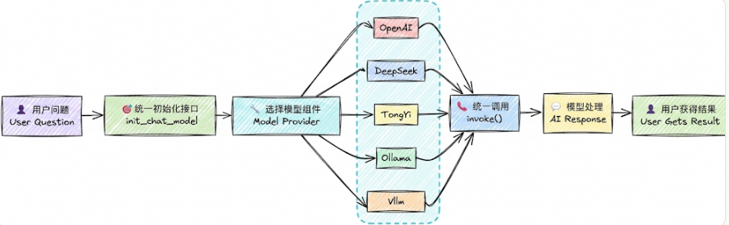


### 3.2 使用步骤

- 调用DeepSeek官网的大模型：当我们传递的模型名称为deepseek-v4-flash 时，init_chat_model会自动调用ChatDeepSeek初始化模型实例，和直接通过ChatDeepSeek初始化的效果完全一致

~~~python
import os
from langchain.chat_models import init_chat_model
from dotenv import load_dotenv

# 从.env文件中加载环境变量
load_dotenv(override=True)

# 从环境变量读取配置
DEEPSEEK_API_KEY = os.getenv("DEEPSEEK_API_KEY")
DEEPSEEK_BASE_URL = os.getenv("DEEPSEEK_BASE_URL")
model = init_chat_model(model="deepseek:deepseek-v4-flash",
                        #model_provider="deepseek",
                        api_key=DEEPSEEK_API_KEY,
                        base_url=DEEPSEEK_BASE_URL)
# 向模型发送单条数据
response = model.invoke("你好，用一句话回答")
# 打印响应
print(response)
~~~

- 调用阿里百炼大模型

~~~python
import os

from dotenv import load_dotenv
from langchain.chat_models import init_chat_model

load_dotenv(override=True)

DASHSCOPE_API_KEY = os.getenv("DASHSCOPE_API_KEY")
DASHSCOPE_BASE_URL = os.getenv("DASHSCOPE_BASE_URL")

model = init_chat_model(
    model="glm-5",
    model_provider="openai",
    api_key=DASHSCOPE_API_KEY,
    base_url=DASHSCOPE_BASE_URL
)

print(model.invoke("你是谁"))
~~~

- 调用CloseAI中转平台大模型

~~~python
from langchain.chat_models import init_chat_model
from dotenv import load_dotenv
import os

load_dotenv(override=True)
CLOSEAI_API_KEY=os.getenv("CLOSEAI_API_KEY")
CLOSEAI_BASE_URL=os.getenv("CLOSEAI_BASE_URL")
model = init_chat_model(model="deepseek-v4-flash",
                        model_provider="openai",
                        api_key=CLOSEAI_API_KEY,
                        base_url=CLOSEAI_BASE_URL)
print(model.invoke("你好，用一句话回答"))
~~~

- 问题1：model_provider支持哪些provider？
  - 答：model_provider 表示模型的提供者，支持的providers有：anthropic , anthropic_bedrock, azure_ai, azure_openai, bedrockbedrock_converse, cohere, deepseek , fireworks, google_anthropic_vertex, google_genai, google_vertexaigrog, huggingface, ibm, mistralai, nvidia, ollama , openai , openrouter , perplexity, together, upstage, xai。
  - 如果 model_provider="openai" ，会自动加载langchain-openai 的依赖包，底层调用的是 ChatOpenAI 类。
  - 如果 model_provider="deepseek" ，会自动加载langchain-deepseek 的依赖包，底层调用的是ChatDeepSeek 类。
  - 像阿里的dashscope 尚未被LangChain官方纳入模型的统一注册体系，暂时不知道"dashscope"的提供者是谁。此时可以将model_provider设置为openai，底层将会用openai的规范处理请求，这就要求我们调用的模型服务是OpenAI Compatible的

- 问题2：如果在model参数中没有指明模型提供者，必须在model_provider中指明？
  - <font color="red">**可以在model参数中通过前缀指定模型供应商，和模型名称之间用冒号分割，等价于通过model_provider参数指定供应商。**</font>如果两个位置都没有指明供应商，LangChain底层会按照内置规则自动推断。
  - 但是，并非所有的模型都支持自动推断，如model名称qwen-plus 不支持自动推断，没有指明供应商会报错


### 3.3 小结

- DeepSeek官网的DeepSeek模型：可以调用ChatDeepSeek()、ChatOpenAI()、init_chat_model()三种方式
- 阿里云百炼平台的DeepSeek模型：可以调用ChatTongyi()、ChatOpenAI()、init_chat_model()三种方式
- OpenRouter平台的DeepSeek模型：可以调用ChatOpenRouter()、ChatOpenAI()、init_chat_model()三种方式
- CloseAPI平台的DeepSeek模型：可以调用ChatOpenAI()、init_chat_model() 两种方式


### 3.4 模型初始化参数(常用版)

- 在LangChain中，Model Class 和init_chat_model初始化模型共同的参数及解释。

- API文档：<https://docs.langchain.org.cn/oss/python/langchain/models#parameters>


## 5、模型调用

- 在 LangChain 中，模型调用（Invocation）是指通过特定方法触发大语言模型生成输出的过程。根据不同的应用场景和需求，LangChain 提供了几种核心的调用方式，主要是 invoke() 、stream() 和 batch() 方法，以及它们的异步版本 ainvoke() 、astream() 和abatch() ，下面将系统地介绍这些方法。

  - invoke() ：阻塞式，<font color="red">**一次性返回完整结果**</font>问答、批处理任务、无需实时反馈的场景。

  - ainvoke() ：非阻塞式，提高系统吞吐量高并发Web应用、IO密集型任务。

  - stream() ：流式输出，<font color="red">**实时返回每个token**</font>聊天机器人、长文本生成、需要提升用户体验的交互应用。

  - asteam() ：非阻塞式，提高系统吞吐量高并发Web应用、IO密集型任务。

  - batch() ：<font color="red">**批量处理多个输入高并发场景**</font>，需要同时处理大量请求。

  - abatch() ：非阻塞式，提高系统吞吐量高并发Web应用、IO密集型任务


### 5.1 invoke()

- invoke()是LangChain中最核心的方法，它的工作模式是<font color="red">**阻塞式**</font>的，即<font color="red">**程序会等待模型完全生成整个响应之后，再一次性将结果返回给用户**</font>


#### 5.1.1 invoke()说明

- 简单来说，invoke方法的作用就是：
  - <font color="red">**接收用户输入**</font>（问题、指令、对话历史等）
  - <font color="red">**发送给LLM模型**</font>（GPT、deepseek等）
  - <font color="red">**返回模型响应**</font>（文本回复+元数据信息）
- 基本语法

~~~python
response = model.invoke(input, config=None)
~~~

- 参数详解

| 参数   | 类型                                 | 说明                                 | 必需 | 默认值 |
| ------ | ------------------------------------ | ------------------------------------ | ---- | ------ |
| input  | str \| list[dict] \| list[Message]等 | 要发送给模型的内容                   | 必需 | 无     |
| config | dict                                 | 高级配置（回调函数、元数据、标签等） | 可选 | None   |


#### 5.1.2 输入参数详解

- invoke方法非常灵活，支持三种形式的输入：<font color="red">**文本输入、字典列表、消息对象列表**</font>

- <font color="red">**文本输入（最简单）**</font>

  - 简单的一次性问答，直接传入一个问题或者指令，在invoke中直接输入文本，即可自动转化为user message并进行对话
  - 使用场景：快速测试，不需要保留对话历史的简单生成任务
  - 缺点：无法设置系统提示（system prompt），无法传递对话历史

  ~~~python
  import os
  
  import dotenv
  from langchain.chat_models import init_chat_model
  
  # 从环境变量中获取配置信息
  dotenv.load_dotenv(override=True)
  
  # 初始化模型
  model = init_chat_model(
      model=os.getenv("CHAT_MODEL"),
      model_provider="openai",
      base_url=os.getenv("CHAT_BASE_URL"),
      api_key=os.getenv("CHAT_API_KEY")
  )
  
  # 模型对话
  response = model.invoke("你好", config=None)
  print(response)
  ~~~

- <font color="red">**字典列表（推荐，最灵活）**</font>

  - 创建字典列表组成消息。一条消息通常包含：**role（角色）、content（内容）**等信息
  - 使用场景：可以设置系统提示，表达多轮对话历史，JSON兼容，易于序列化和网络传输，生产环境最推荐
  - 缺点：代码稍微多点（但更清晰）
  - 格式

  ~~~python
  message = [
      {"role": "system", "content": "系统提示"},
      {"role": "user", "content": "用户消息"},
      {"role": "assistant", "content": "AI回复"},       # 可选，用于历史对话
      {"role": "user", "content": "继续提问"}
  ]
  ~~~

  - 角色说明

    - 注意："user"和"human"有时可以互换，单遵循模型提供商的惯例”user“最为稳妥

    | 角色      | 英文           | 作用                           | 示例                       |
    | --------- | -------------- | ------------------------------ | -------------------------- |
    | system    | System         | 设定AI的行为、角色、规则       | "你是一个专业的python导师" |
    | user      | Human / User   | 用户的输入问题                 | "什么是装饰器"             |
    | assistant | AI / Assistant | AI的历史回复（用于对话上下文） | "装饰器是一种设计模式"     |

  - 举例

  ~~~python
  import os
  
  import dotenv
  from langchain.chat_models import init_chat_model
  
  # 从环境变量中获取配置信息
  dotenv.load_dotenv(override=True)
  
  # 初始化模型
  model = init_chat_model(
      model=os.getenv("CHAT_MODEL"),
      model_provider="openai",
      base_url=os.getenv("CHAT_BASE_URL"),
      api_key=os.getenv("CHAT_API_KEY")
  )
  
  # 模型对话
  message = [
      {"role": "system", "content": "你是一个专业的数学老师"},
      {"role": "user", "content": "1 + 2 = ?"},
      {"role": "assistant", "content": "3"},
      {"role": "user", "content": "我刚刚问的什么问题，回答的是什么"}
  ]
  response = model.invoke(message, config=None)
  print(response)
  ~~~

- <font color="red">**消息对象列表**</font>

  - 使用内置的消息类（如：SystemMessage、HumanMessge、AIMessage），将消息对象列表输入模型
  - 适用场景：需要类型检查（针对大型项目），IDE自动补全的场景
  - 缺点：代码较长，不如字典简洁，难以序列化（JSON）
  - 消息类型对照

  | 消息类        | 对应字典格式                         | 作用     |
  | ------------- | ------------------------------------ | -------- |
  | SystemMessage | {"role": "system", "content": ""}    | 系统提示 |
  | HumanMessage  | {"role": "user", "content": ""}      | 用户输入 |
  | AIMessage     | {"role": "assistant", "content": ""} | AI回复   |

  - 举例

  ~~~python
  import os
  
  import dotenv
  from langchain.chat_models import init_chat_model
  from langchain_core.messages import SystemMessage, HumanMessage, AIMessage
  
  # 从环境变量中获取配置信息
  dotenv.load_dotenv(override=True)
  
  # 初始化模型
  model = init_chat_model(
      model=os.getenv("CHAT_MODEL"),
      model_provider="openai",
      base_url=os.getenv("CHAT_BASE_URL"),
      api_key=os.getenv("CHAT_API_KEY")
  )
  
  # 模型对话
  message = [
      SystemMessage("你是一个专业的数学老师"),
      HumanMessage("1 + 2 = ?"),
      AIMessage("3"),
      HumanMessage("我刚刚问的什么问题，回答的是什么")
  ]
  
  response = model.invoke(message, config=None)
  print(response)
  ~~~


#### 5.1.3 返回值详解

- invoke返回的是一个AIMessage对象，源码如下：

~~~python
def invoke(
    self,
    input: LanguageModelInput,
    config: RunnableConfig | None = None,
    *,
    stop: list[str] | None = None,
    **kwargs: Any,
) -> AIMessage:
~~~

- AIMessage中包含丰富的信息，通过rich库将返回格式化如下：

~~~json
AIMessage(
    # --- 核心内容 --- 
    content='你刚刚问的是：“1 + 2 = ?”  \n我回答的是：“3”。', # 模型生成的最终文本答案
    additional_kwargs={'refusal': None},  # 模型拒绝回答的情况（如触碰安全策略），None表示正常												回答
    
    # --- 响应元数据（API返回的详细原始数据）---
    response_metadata={
        'token_usage': {
            'completion_tokens': 20,				# 生成回答消耗的Token数（输出）
            'prompt_tokens': 28,					# 用户输入消耗的Token数（输入）
            'total_tokens': 48,						# 本次交互总共消耗的Token数
            'completion_tokens_details': None,
            'prompt_tokens_details': None,
            'ttft': 349,
            'tpot': 67
        },
        'model_provider': 'openai',
        'model_name': 'hosted_vllm/DeepSeek-V3.1-Terminus-NoThinking-32K',
        'system_fingerprint': None,
        'id': 'chatcmpl-46aca926b6',
        'finish_reason': 'stop',
        'logprobs': None
    },
    
    # --- LangChain 内部标识 ---
    # LangChain追踪此条运行的唯一ID
    id='lc_run--019f261d-6cc7-7530-ad74-6bcad39fd11d-0',
    
    # --- 工具调用信息 ---
    tool_calls=[],			# 正常触发的外部工具调用列表
    invalid_tool_calls=[],	# 触发失败或格式错误的工具调用列表
    
    # --- 统一消耗元数据（LangChain标准的消耗格式）---
    usage_metadata={
        'input_tokens': 28,				# 输入token数
        'output_tokens': 20,			# 输出token数
        'total_tokens': 48,				# 总token数
        'input_token_details': {
			'audio': 0,
    		'cache_read': 0				# 从缓存中读取的输入token数量
        },		
    	'output_token_details': {
    		'audio': 0,
    		'reasoning': 0				# 包含在输出中的推理token
    	}
    }
)
~~~


### 5.2 stream()

- invoke和stream有什么区别
  - invoke()：<font color="red">**同步调用，在模型输出完成后一次性获取响应**</font>，对于输出文本很长的场景，用户体验不好
  - stream()：<font color="red">**流式调用，实时返回响应片段**</font>。调用后，返回一个迭代器 (iterator)，可以通过循环来实时处理每个新生的chunk内容块

- 注意：流式输出依赖于模型供应商对于流式输出的支持
- 基本语法
  - **end=''**
    - 默认情况下，`print()`会在输出内容后自动添加换行符（`\n`）。
    - 通过设置`end=''`，可以将原本的换行符替换为空字符串，使输出内容不换行，直接衔接下一次打印的内容。
  - **flush=True**
    - 默认情况下，`print()`的输出会被缓存在系统缓冲区中，可能不会立即显示（例如在重定向到文件或某些终端时）。
    - 设置`flush=True`会强制将缓冲区的内容立即刷新到目标输出（如控制台或文件），确保内容实时显示。这在需要即时输出（如进度条、实时日志）时特别有用

```python
response = model.stream(message, config=None)
for chunk in response:
    print(chunk.text, end='', flush=True)
```

- 例子

~~~python
import os

import dotenv
from langchain.chat_models import init_chat_model
from langchain_core.messages import SystemMessage, HumanMessage, AIMessage

# 从环境变量中获取配置信息
dotenv.load_dotenv(override=True)

# 初始化模型
model = init_chat_model(
    model=os.getenv("CHAT_MODEL"),
    model_provider="openai",
    base_url=os.getenv("CHAT_BASE_URL"),
    api_key=os.getenv("CHAT_API_KEY")
)

# 模型对话
message = [
    SystemMessage("你是一个专业的数学老师"),
    HumanMessage("1 + 2 = ?"),
    AIMessage("3"),
    HumanMessage("我刚刚问的什么问题，回答的是什么")
]

response = model.stream(message, config=None)
for chunk in response:
    print(chunk.text, end='', flush=True)
~~~

- 优点
  - <font color="red">**响应速度更快**</font>，用户不必等待完整输出
  - <font color="red">**交互体验更流畅**</font>，尤其在长文本或复杂推理场景下
  - <font color="red">**可实时展示模型思考过程**</font>


### 5.3 batch()

- batch()方法允许一次性<font color="red">**发送一组请求**</font>（含多条独立请求），模型会在后台<font color="red">**并行处理**</font>，然后<font color="red">**返回所有结果的列表**</font>
- 与逐个顺序调用 (invoke) 相比，能<font color="red">**大幅减少网络往返开销和等待时间**</font>，显著提升性能、降低成本
- 适用场景：文档摘要、批量问答、数据预处理、多样本分类等


#### 5.3.1 按输入消息顺序接收

- 关键字：batch()

- 语法

~~~python
message = [
    "你是谁?",
    "1 + 2 = ?",
    "我国首都是哪里?"
]

response_list = model.batch(message, config=None)
for response in response_list:
    print(response)
~~~

- batch()特点是等待所有请求处理完毕，按原始输入顺序返回结果列表

~~~python
import os

import dotenv
from langchain.chat_models import init_chat_model
from langchain_core.messages import SystemMessage, HumanMessage, AIMessage

# 从环境变量中获取配置信息
dotenv.load_dotenv(override=True)

# 初始化模型
model = init_chat_model(
    model=os.getenv("CHAT_MODEL"),
    model_provider="openai",
    base_url=os.getenv("CHAT_BASE_URL"),
    api_key=os.getenv("CHAT_API_KEY")
)

# 模型对话
message = [
    "你是谁?",
    "1 + 2 = ?",
    "我国首都是哪里?"
]

response_list = model.batch(message, config=None)
for response in response_list:
    print(response)
~~~

- 回答也是按照输入的问题的顺序进行返回的
  - 你好！我是DeepSeek，由深度求索公司创造的AI助手！
  - 1 + 2 = 3
  - 中国的首都是**北京**


#### 5.3.2 按完成顺序接收响应

- 关键字：batch_as_completed()

- 语法

```python
message = [
    "你是谁?",
    "1 + 2 = ?",
    "我国首都是哪里?"
]

response_list = model.batch_as_completed(message, config=None)
for response in response_list:
    print(response)
```

- batch()特点是等待所有请求处理完毕，按原始输入顺序返回结果列表

```python
import os

import dotenv
from langchain.chat_models import init_chat_model
from langchain_core.messages import SystemMessage, HumanMessage, AIMessage

# 从环境变量中获取配置信息
dotenv.load_dotenv(override=True)

# 初始化模型
model = init_chat_model(
    model=os.getenv("CHAT_MODEL"),
    model_provider="openai",
    base_url=os.getenv("CHAT_BASE_URL"),
    api_key=os.getenv("CHAT_API_KEY")
)

# 模型对话
message = [
    "你是谁?",
    "1 + 2 = ?",
    "我国首都是哪里?"
]

response_list = model.batch_as_completed(message, config=None)
for response in response_list:
    print(response)
```

- 回答是按完成顺序接收响应
  - 1 + 2 = 3
  - 中国的首都是**北京**
  - 你好！我是DeepSeek，由深度求索公司创造的AI助手！


#### 5.3.3 性能对比

- 使用batch()方法：batch耗时1.37秒

~~~python
import os
import time

import dotenv
from langchain.chat_models import init_chat_model

# 从环境变量中获取配置信息
dotenv.load_dotenv(override=True)

# 初始化模型
model = init_chat_model(
    model=os.getenv("CHAT_MODEL"),
    model_provider="openai",
    base_url=os.getenv("CHAT_BASE_URL"),
    api_key=os.getenv("CHAT_API_KEY")
)

# 模型对话
message = [
    "翻译成英文：春天来了",
    "翻译成英文：夏天很热",
    "翻译成英文：秋天落叶",
    "翻译成英文：冬天下雪"
]

# 记录开始时间
start_time = time.time()
# 模型调用
response_list = model.batch(message, config=None)
# 计算耗时
batch_time = time.time() - start_time

# 循环输出
for response in response_list:
    print(response)

# 打印耗时
print(f"batch耗时{batch_time:.2f}秒")
~~~

- 使用invoke循环调用：循环invoke耗时4.23秒

~~~python
import os
import time

import dotenv
from langchain.chat_models import init_chat_model

# 从环境变量中获取配置信息
dotenv.load_dotenv(override=True)

# 初始化模型
model = init_chat_model(
    model=os.getenv("CHAT_MODEL"),
    model_provider="openai",
    base_url=os.getenv("CHAT_BASE_URL"),
    api_key=os.getenv("CHAT_API_KEY")
)

# 模型对话
messages = [
    "翻译成英文：春天来了",
    "翻译成英文：夏天很热",
    "翻译成英文：秋天落叶",
    "翻译成英文：冬天下雪"
]

# 记录开始时间
start_time = time.time()
# 模型调用
response_list = []
for message in messages:
    response = model.invoke(message, config=None)
    response_list.append(response)
# 计算耗时
batch_time = time.time() - start_time

# 循环输出
for response in response_list:
    print(response)

# 打印耗时
print(f"循环invoke耗时{batch_time:.2f}秒")
~~~

- 总结：性能提升了一倍


### 5.4 异步调用

- 同步（sync）
  - 发起一个任务后，<font color="red">**需要等待该任务完成后**</font>，才能继续执行后续任务
  - 表现：<font color="red">**当前执行流会被阻塞**</font>
- 异步（async）
  - 发起一个任务后。<font color="red">**不必等待该任务完成**</font>，就可以继续执行其他任务
  - 备注：虽然不必等待任务完成，但是任务完成后，仍然可以通过特定方式获取结果
  - 表现：<font color="red">**当前执行流不会被阻塞**</font>

- 在LangChain框架中，异步方法（ainvoke、astream、abatch）以他们的同步版本（invoke、stream、batch）相比，具备以下特点
  - <font color="red">**避免阻塞主线程**</font>：同步调用会阻塞程序执行，而异步方法会让应用程序在等待API响应时保持响应性
  - <font color="red">**优化资源利用**</font>：异步操作可以更高效率利用系统资源，减少空闲等待时间

- ainvoke

~~~python

~~~


## 6、拓展内容

### 6.1 美化模型输出响应

#### 6.1.1 使用pretty_print()

- 可以使用pretty_print()美化输出内容
- 用法：<font color="red">**response.pretty_print()**</font>

~~~python
import os

import dotenv
from langchain.chat_models import init_chat_model

# 从环境变量中获取配置信息
dotenv.load_dotenv(override=True)

# 初始化模型
model = init_chat_model(
    model=os.getenv("CHAT_MODEL"),
    model_provider="openai",
    base_url=os.getenv("CHAT_BASE_URL"),
    api_key=os.getenv("CHAT_API_KEY")
)

# 模型调用
response = model.invoke("1+1=?", config=None)
response.pretty_print()
~~~

- <font color="red">**控制字符无法被渲染，只会输出文本内容**</font>，返回如下

~~~bash
================================== Ai Message ==================================

1 + 1 = 2.  

If you’re looking for a more detailed explanation:  
- In basic arithmetic, adding two single units together results in two units.  
- In binary, 1 + 1 = 10 (which is 2 in decimal).  

Let me know if you meant something more abstract!
~~~


#### 6.1.2 使用rich库

- 如果在终端（Terminal）工作，想要色彩鲜明，排版优雅的测试界面，可以使用rich库

~~~python
import os

import dotenv
from langchain.chat_models import init_chat_model
from rich import print as rprint

# 从环境变量中获取配置信息
dotenv.load_dotenv(override=True)

# 初始化模型
model = init_chat_model(
    model=os.getenv("CHAT_MODEL"),
    model_provider="openai",
    base_url=os.getenv("CHAT_BASE_URL"),
    api_key=os.getenv("CHAT_API_KEY")
)

# 模型调用
response = model.invoke("1+1=?", config=None)
rprint(response)
~~~

- 返回如下

~~~bash
AIMessage(
    content='**Answer:** 2\n\n**Explanation:** In basic arithmetic, adding the 
number 1 to the number 1 equals 2.',
    additional_kwargs={'refusal': None},
    response_metadata={
        'token_usage': {
            'completion_tokens': 28,
            'prompt_tokens': 8,
            'total_tokens': 36,
            'completion_tokens_details': None,
            'prompt_tokens_details': None,
            'ttft': 310,
            'tpot': 58
        },
        'model_provider': 'openai',
        'model_name': 'hosted_vllm/DeepSeek-V3.1-Terminus-NoThinking-32K',
        'system_fingerprint': None,
        'id': 'chatcmpl-8cb1bb3ba4',
        'finish_reason': 'stop',
        'logprobs': None
    },
    id='lc_run--019f2729-39a6-7602-8186-6db728e46e48-0',
    tool_calls=[],
    invalid_tool_calls=[],
    usage_metadata={
        'input_tokens': 8,
        'output_tokens': 28,
        'total_tokens': 36,
        'input_token_details': {},
        'output_token_details': {}
    }
)
~~~


### 6.2 模型配置信息profile


# 三、LangSmith基本使用

## 1、概述

### 1.1 什么是LangSmith

- LangSmith是LangChain生态系统中专门用于LLM（大语言模型）应用<font color="red">**调试、监控、评估和管理**</font>的平台
  - <font color="red">**追踪（tracing）**</font>：记录每次LLM调用的详细信息
  - <font color="red">**监控（monitoring）**</font>：实时查看应用性能
  - <font color="red">**调试（debug）**</font>：排查问题和优化性能
  - <font color="red">**评估（evaluate）**</font>：系统化测试LLM应用


### 1.2 LangSmith功能

| 菜单项                     | 所属             | 核心功能                                                     |
| -------------------------- | ---------------- | ------------------------------------------------------------ |
| **Tracing**                | 核心应用与开发   | **链路追踪**：查看所有 LLM 应用的运行日志和调用链路，是调试和排查问题的核心入口。你可以看到每一次请求的完整执行流程、输入输出、耗时和 Token 消耗。 |
| **Monitoring**             | 核心应用与开发   | **监控仪表板**：聚合展示项目的运行指标，如请求量、延迟、错误率、Token 消耗等，用于生产环境的性能监控和异常告警。 |
| **Datasets & Experiments** | 核心应用与开发   | **数据集与实验**：管理测试数据集，批量运行你的 LLM 应用，对比不同模型、提示词或配置的效果，用于版本迭代和 A/B 测试。 |
| **Evaluators**             | 核心应用与开发   | **评估器**：配置和管理自动评估规则，用于量化评估模型输出的质量（如相关性、准确性、是否存在幻觉等）。 |
| **Annotation Queues**      | 核心应用与开发   | **人工标注队列**：将需要人工审核的模型输出加入队列，供团队成员进行标注和反馈，用于优化评估和训练数据。 |
| **Prompts**                | 提示词与调试工具 | **提示词管理**：集中管理和版本化你的提示词模板，方便在不同场景下复用和迭代。 |
| **Playground**             | 提示词与调试工具 | **在线调试 playground**：快速测试模型、提示词和工具调用，无需编写完整代码，适合快速验证想法。 |
| **Studio**                 | 提示词与调试工具 | **可视化工作流 Studio**：通过拖拽方式可视化构建和编辑 LangChain 链 / 代理，适合低代码方式开发复杂流程。 |
| **Context Hub**            | 提示词与调试工具 | **上下文中心**：管理和存储可复用的上下文数据（如文档、知识库片段），方便在应用中快速引用。 |
| **Deployments**            | 部署与沙盒       | **部署管理**：将你的 LangChain 应用部署为 API 服务，管理部署版本、流量和环境。 |
| **Sandboxes**              | 部署与沙盒       | **沙箱环境**：提供隔离的运行环境，用于安全测试新功能或代码，避免影响生产环境。 |

- 使用建议
  - **开发调试阶段**：优先使用 **Tracing** 和 **Playground**，快速定位问题和验证逻辑。
  - **迭代优化阶段**：结合 **Datasets & Experiments** 和 **Evaluators**，量化评估不同方案的效果。
  - **生产上线后**：重点关注 **Monitoring**，实时监控应用健康状态和成本消耗。


## 2、准备账号

### 2.1 注册或登录

- 步骤1：访问官网，地址：https://smith.LangChain.com/
- 步骤2：自由选择注册或登陆方式，一般用的github账号，可以直接登录
- 步骤3：登陆成功

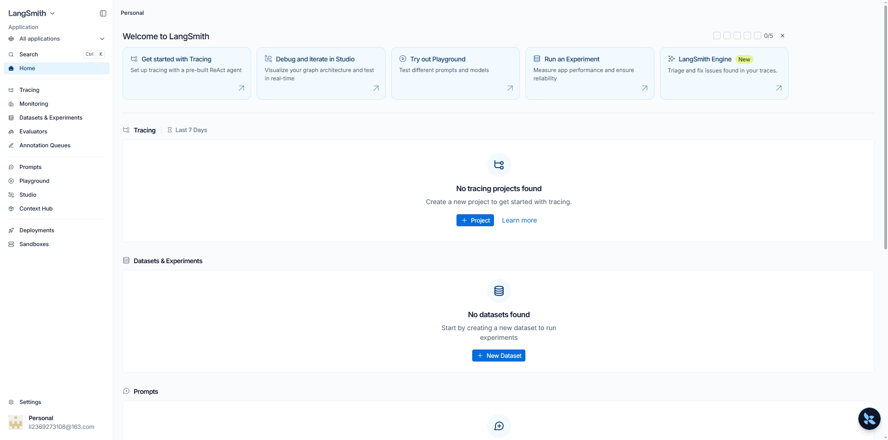


### 2.2 获取Key

- 在左下角有个setting

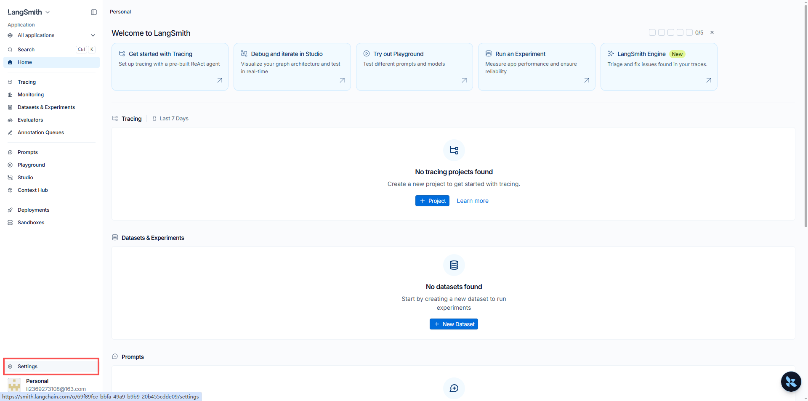

- 然后右上角新增

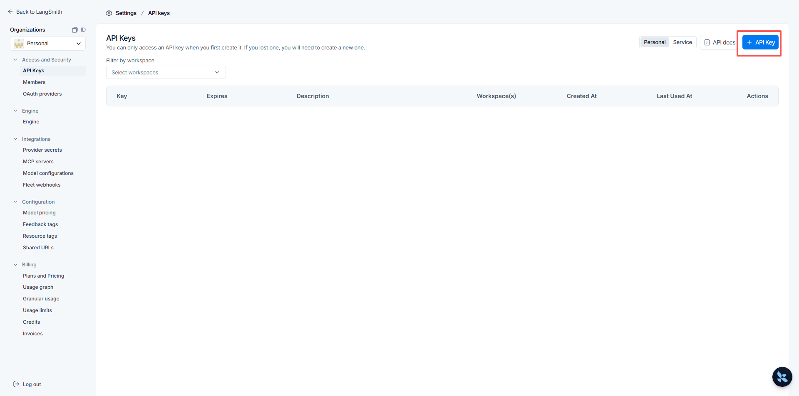

- 新增后复制

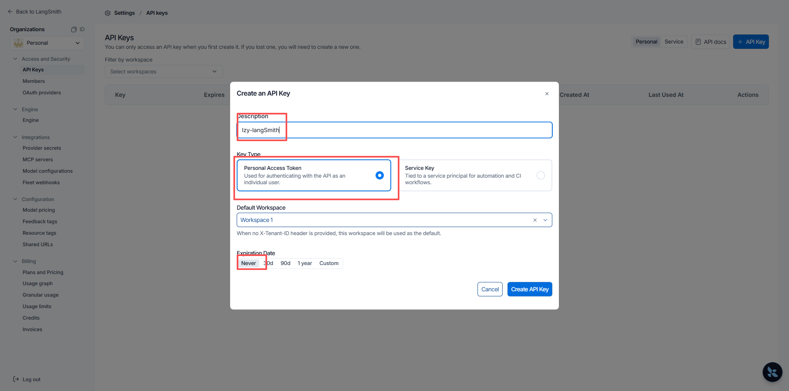


### 2.3 新增环境变量

- 在`.env`配置文件中，添加四个环境变量：

~~~bash
# 是否启用Langsmith监控功能
LANGSMITH_TRACING=true

# Langsmith监控WebUI地址
LANGSMITH_ENDPOINT=https://api.smith.langchain.com

# 创建的API_KEY
LANGSMITH_API_KEY=<YOUR_API_KEY>

# 自定义项目名称，可以在Langsmith WebUI监控页面根据名称查看对应的运行记录
LANGSMITH_PROJECT="LangChainDemo"
~~~


## 3、性能指标

- **添加上述环境变量后，在程序中通过`load_dotenv()`加载，而后运行 LangChain 代码，LangSmith 会自动记录运行指标，并同步至后台服务，我们可以在 LangSmith 官网查看运行记录**

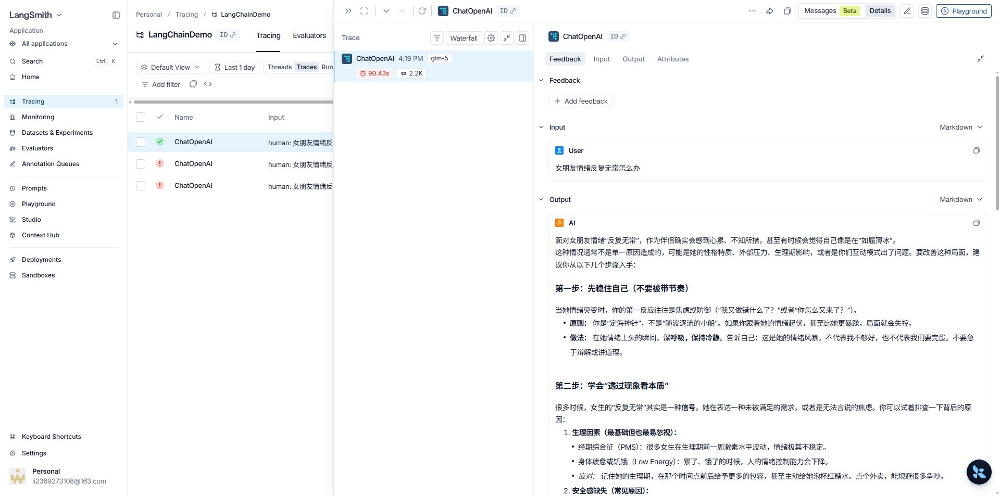


# 四、消息与提示词模板

## 1、认识消息

- 大模型没有记忆，它的输出只和输入模型的内容有关（上下文），很多大模型API服务也没有在服务端维护会话历史，是无状态的。因此，<font color="red">**如果应用要记住对话历史，需要在程序中维护消息列表**</font>

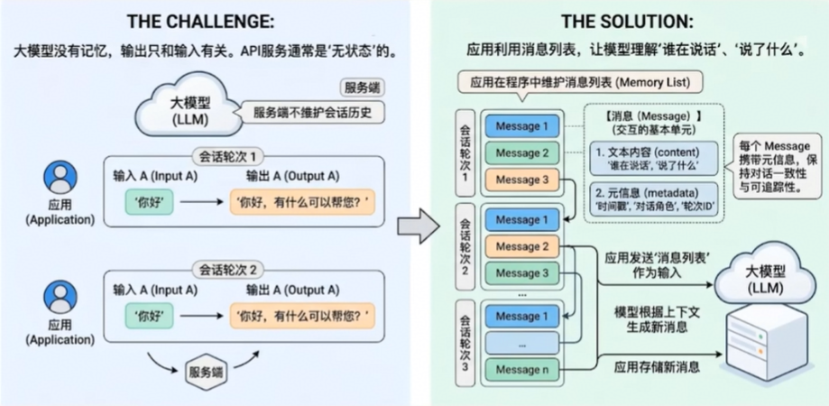

- <font color="red">**在LangChain中，Message（消息）是模型交互的最基本单元**</font>。他既代表模型接收到的输入（input），也代表了模型生成的输出（output）

- 每一轮与大模型的对话，都由一条或多条messge构成，每条message不仅包含了<font color="red">**文字内容**</font>，还携带描述上下文状态的<font color="red">**元信息（metadata）**</font>，用于保持对话的一致性和可追踪性。比如，模型在多轮交互中理解谁在说话、说了什么、这条信息属于哪一轮对话

- LangChain在1.0中提供了<font color="red">**跨模型统一的message标准**</font>。无论使用的是OpenAI、Anthropic、Gemini还是本地模型，这一标准都能保持一致的行为。好处：

  - <font color="red">**兼容性强**</font>：不同模型的消息格式自动对其
  - <font color="red">**可扩展性高**</font>：方便添加多模态内容或自定义字段
  - <font color="red">**可追踪性好**</font>：为LangSmith等调试工具提供一致的上下文数据结构


### 1.1 消息的内部结构

- LangChain的消息（message）对象包含了三种字段
  - <font color="red">**Role**</font>：消息所属的角色或类型，如：system、user、assistant
  - <font color="red">**Content**</font>：消息内容
  - <font color="red">**Metadata**</font>：（可选）元数据，存储额外信息，如：消息ID、响应时间、token消耗量、消息标签等


### 1.2 消息的类型

- LangChain定义了很多消息类型，通过role区分，常见的有四种

  - <font color="red">**系统消息**</font>

    - 也称为系统提示词，用于在对话开始时，为模型设定角色、行为准则和上下文背景。它像是给AI助手的一份工作说明书，决定了其回答问题的风格、领域和专业范围

    ~~~json
    {"role": "system", "content": "你是一个精通编程的软件架构师"}
    ~~~

  - <font color="red">**用户消息**</font>

    - 也称用户提示词，在多轮对话中，它表示用户的一次输入。可以包含简单的文本问题，也可以是复杂的多模态内容（如图片、音频、文档等）

    ~~~json
    {"role": "user", "content": "你好"}
    ~~~

  - <font color="red">**助手(AI)消息**</font>

    - 代表模型的回复，包括生成的文本、工具调用、元数据等

    ~~~json
    {"role": "assistant", "content": "我也很高兴认识你"}
    ~~~

    ~~~json
    {
        "role": "assistant",
        "content": "我也很高兴认识你",
        "tool_calls": [{
            "name": "get_weather",
            "args": {"location": "北京"},
            "id": "call_00_nfqwfqfafasgsgsdgsag"
        }]
    }
    ~~~

  - <font color="red">**工具调用消息**</font>

    - 工具调用结果匹配的消息类型。将此消息返回给模型，让模型基于这个结果继续生成回复。

    ~~~json
    {
        "role": "tool",
        "content": "我也很高兴认识你",
        "tool_calls_id": "call_00_nfqwfqfafasgsgsdgsag"
    }
    ~~~

- 问题：<font color="red">**为什么要使用不同的消息类型**</font>

  - <font color="red">**明确角色**</font>：清晰区分系统提示、用户输入和AI回复
  - <font color="red">**控制行为**</font>：通过SystemMessage精确控制AI的行为
  - <font color="red">**对话历史**</font>：构建完整的多轮对话上下文
  - <font color="red">**调试友好**</font>：更容易追踪和调试对话流程


### 1.3 消息格式

- LangChain支持两种消息格式

  - <font color="red">**Json格式**</font>

    - 系统消息

    ~~~json
    {"role": "system", "content": "你是一个精通编程的软件架构师"}
    ~~~

    - 用户消息

    ~~~json
    {"role": "user", "content": "你好"}
    ~~~

    - 助手消息

    ~~~json
    {
        "role": "assistant",
        "content": "我也很高兴认识你",
        "tool_calls": [{
            "name": "get_weather",
            "args": {"location": "北京"},
            "id": "call_00_nfqwfqfafasgsgsdgsag"
        }]
    }
    ~~~

    - 工具调用消息

    ~~~json
    {
        "role": "tool",
        "content": "我也很高兴认识你",
        "tool_calls_id": "call_00_nfqwfqfafasgsgsdgsag"
    }
    ~~~

  - <font color="red">**对象格式**</font>

    - 系统消息

    ~~~bash
    SystemMessage(content="你是一个精通编程的软件架构师")
    ~~~

    - 用户消息

    ~~~bash
    HumanMessage(content="你好")
    ~~~

    - 助手消息

    ~~~bash
    AIMessage(content="我也很高兴认识你")
    ~~~

    - 工具调用消息

    ~~~bash
    ToolMessage(
    	content="<工具输出>",
    	tool_call_id="call_00_nfqwfqfafasgsgsdgsag"
    )
    ~~~


### 1.4 例子

```python
import os

import dotenv
from langchain.chat_models import init_chat_model
from langchain_core.messages import SystemMessage, HumanMessage, AIMessage

# 从环境变量中获取配置信息
dotenv.load_dotenv(override=True)

# 初始化模型
model = init_chat_model(
    model=os.getenv("CHAT_MODEL"),
    model_provider="openai",
    base_url=os.getenv("CHAT_BASE_URL"),
    api_key=os.getenv("CHAT_API_KEY")
)

# 消息列表
message_list = [
    SystemMessage(content="你是一个友好的AI助手"),
    HumanMessage(content="1 + 2 = ？"),
    AIMessage(content="3"),
    HumanMessage(content="我刚刚问了什么？")
]

# 模型对话
response_list = model.stream(message_list, config=None)
for response in response_list:
    print(response.text, end='', flush=True)
```


### 1.5 消息对象字段说明

#### 1.5.1 SystemMessage

- <font color="red">**content**</font>：消息内容，字段名可以省略

~~~python
SystemMessage("你是一个善解人意的助手")
# 相当于
SystemMessage(content="你是一个善解人意的助手")
~~~


#### 1.5.2 HumanMessage

- <font color="red">**content**</font>：消息内容，字段名可以省略

```python
HumanMessage("你好")
# 相当于
HumanMessage(content="你好")
```

- <font color="red">**metadata**</font>：元数据字段，可以有很多，自定义
  - name和id都属于元数据字段，当消息类型相同，对消息进行区分。但不是所有模型都支持这一功能，是否支持取决于模型供应商
  - 比如：OpenAI支持name作为元数据，DeepSeek不支持

~~~python
HumanMessage(
    content="你好",
    name="alice",	# 可选：用户名
    id="id_123"		# 可选：message的ID
)
~~~

- 例子

~~~python
import os

import dotenv
from langchain.chat_models import init_chat_model
from langchain_core.messages import SystemMessage, HumanMessage, AIMessage

# 从环境变量中获取配置信息
dotenv.load_dotenv(override=True)

# 初始化模型
model = init_chat_model(
    model=os.getenv("CHAT_MODEL"),
    model_provider="openai",
    base_url=os.getenv("CHAT_BASE_URL"),
    api_key=os.getenv("CHAT_API_KEY")
)

# 消息列表
message_list = [
    SystemMessage(content="你是一个信息抽取器，你会收到多条来自不同发言者的user消息，每条消息可能带有name字段，你的任务是："
                          "严格根据每条消息的name提取发言者及其观点，并输出Json，禁止使用“第一个人/第二个人”这种相对称呼。若某条消息没有name，则输出unknown，"
                          "输出格式：{\"speakers\": [{\"name\": \"...\", \"claim\": \"...\"}]}"),
    HumanMessage(content="我认为 1+1=2", name="Bob"),
    HumanMessage(content="我认为 1+1>2", name="Tom"),
    HumanMessage(content="请列举出谁说了什么，不要判断对错", name="audience")
]

# 模型对话
response_list = model.stream(message_list, config=None)
for response in response_list:
    print(response.text, end='', flush=False)

# 打印：{"speakers": [{"name": "unknown", "claim": "我认为 1+1=2"}, {"name": "unknown", "claim": "我认为 1+1>2"}]}
~~~


#### 1.5.3 AIMessage

- <font color="red">**content**</font>：模型输出的原始内容，字段名可以省略

```python
AIMessage("你好")
# 相当于
AIMessage(content="你好")
```

- <font color="red">**response_metadata**</font>：AIMessage特有属性，LLM响应中附加元数据，根据不同模型会有不同，如可能会包含本次token使用量等信息
- <font color="red">**tool_calls**</font>：AIMessage特有属性，表示工具调用信息。当LLM决定调用工具时，在AIMessage中就会包含这个属性，没有工具调用则为空。结构如下：
  - tool_calls属性是一个ToolCall列表，每个ToolCall都是一个字典，包含字段如下

~~~python
tool_calls=[
    {
        "name":"get_weather",				# 调用工具的工具名
        "args":{"city": "杭州"},			   # 调用工具的参数
        "id":"call_asdasdassdfsfsdf",		# 工具调用的唯一标识ID
        "type":"tool_call",
    },
    {
        "name":"get_news",
        "args":{},
        "id":"call_asdasdassdzxcz",
        "type":"tool_call",
    }
]
~~~

- <font color="red">**usage_metadata**</font>：用量信息


#### 1.5.4 ToolMessage

- <font color="red">**content**</font>：文本内容
- <font color="red">**name**</font>：工具列表
- <font color="red">**tool_call_id**</font>：工具调用唯一ID，ToolMeseage必须紧邻匹配的AIMessage，和前者tool_calls中的id一致

~~~python
ToolMessage(
	content="<工具输出>",
    name="get_weather",
    tool_call_id="call_00_fvdsgsgdsgsdgwtfwq"
)
~~~


### 1.6 实战

#### 1.6.1 对话历史管理

- 关键规则：每次调用必须传递完整的对话历史

~~~bash
第一轮
[system, user] —> AI回复 —> 保存回复 

第二轮
[system, user, assistant, user] —> AI回复 —> 保存回复 

第三轮
[system, user, assistant, user, assistant, user] —> AI回复
~~~

- 注意：<font color="red">**每次对话都要在原有的消息列表中添加新消息，不可重新创建新的列表**</font>

~~~python
import os

import dotenv
from langchain.chat_models import init_chat_model


# 从环境变量中获取配置信息
dotenv.load_dotenv(override=True)

# 初始化模型
model = init_chat_model(
    model=os.getenv("CHAT_MODEL"),
    model_provider="openai",
    base_url=os.getenv("CHAT_BASE_URL"),
    api_key=os.getenv("CHAT_API_KEY")
)

# 消息列表
conversation = []

# 第一次
conversation.append({"role": "user", "content": "我叫张三"})
response1 = model.invoke(conversation, config=None)
# 关键：保存 AI 回复
conversation.append({"role": "assistant", "content": response1.text})

# 第二次
conversation.append({"role": "user", "content": "我的朋友叫李四"})
response2 = model.invoke(conversation, config=None)
# 关键：保存 AI 回复
conversation.append({"role": "assistant", "content": response2.text})

# 第三次
conversation.append({"role": "user", "content": "我叫什么"})
response3 = model.invoke(conversation, config=None)
print(response3)
~~~


#### 1.6.2 对话历史优化

- 问题：对话历史会越来越长，消耗大量token和成本
- 解决方案：只保留最近N轮对话，具体
  - 总是保留system消息（定义角色）
  - 只保留近N轮对话，丢弃更早的历史
- 定义保留最近对话轮数的函数

~~~python
def keep_recent_messages(messages, max_pairs=2):
    """
    保留最近的N轮对话
    :param messages: 消息列表
    :param max_pairs: 保留的对话轮数（每轮 = user + assistant）
    :return:
    """

    # 分离system消息和对话消息
    system_message = {}
    conversation_message = []
    for message in messages:
        if message.get("role") == "system":
            system_message = message
        if message.get("role") != "system":
            conversation_message.append(message)

    # 只保留最近的消息对：从-4到结尾
    recent_messages = conversation_message[-(max_pairs * 2):]
    return recent_messages
~~~


#### 1.6.3 多轮对话聊天机器人

- 代码

```python
import os
from http.client import responses

import dotenv
from langchain.chat_models import init_chat_model
from requests_toolbelt.utils.deprecated import find_pragma

# 从环境变量中获取配置信息
dotenv.load_dotenv(override=True)

# 初始化模型
model = init_chat_model(
    model=os.getenv("CHAT_MODEL"),
    model_provider="openai",
    base_url=os.getenv("CHAT_BASE_URL"),
    api_key=os.getenv("CHAT_API_KEY")
)

def keep_recent_messages(messages, max_pairs=3):
    """
    保留最近的N轮对话
    :param messages: 消息列表
    :param max_pairs: 保留的对话轮数（每轮 = user + assistant）
    :return:
    """

    # 分离system消息和对话消息
    system_message = []
    conversation_message = []
    for message in messages:
        if message.get("role") == "system":
            system_message.append(message)
        if message.get("role") != "system":
            conversation_message.append(message)

    # 只保留最近的消息对:从-4到结尾
    recent_messages = conversation_message[-(max_pairs * 2):]
    return system_message + recent_messages


def chat_with_machine():
    """
    跟机器人对话
    :return:
    """
    # 维护一个消息列表
    message_list = [{"role": "system", "content": "你是一个耐心、友好的AI助手，可以回答任何问题，请根据用户的问题耐心回答"}]

    print("请输入具体的问题，当输入exit的时候，结束对话")

    # 多轮对话
    i = 1
    while True:
        print("\n", "="*10, f"第{i}轮对话开始", "="*10, "\n")
        # 用户输入
        user_input = input("请输入：")

        # 判断用户输入是否是exit
        if user_input == "exit":
            print("回话已结束")
            break

        # 将用户输入添加到多轮对话中
        message_list.append({"role": "user", "content": user_input})

        # 模型对话
        response_list = model.stream(message_list, config=None)
        assistant_response = ""
        for response in response_list:
            assistant_response = assistant_response + response.text
            print(response.text, end='', flush=True)

        # 将模型回答放回消息列表中
        message_list.append({"role": "assistant", "content": assistant_response})
        # 只选择前十轮对话
        message_list = keep_recent_messages(messages=message_list, max_pairs=5)

        i = i + 1

if __name__ == '__main__':
    chat_with_machine()
```

- 响应

~~~bash
请输入具体的问题，当输入exit的时候，结束对话

 ========== 第1轮对话开始 ========== 

请输入：你好
你好！有什么问题我可以帮助你吗？
 ========== 第2轮对话开始 ========== 

请输入：你是谁
我是来自阿里云的大规模语言模型，我叫通义千问。我是来帮助你的，可以回答写故事、写公文、表达观点，玩游戏等任务。请问有什么我可以帮到你的吗？
 ========== 第3轮对话开始 ========== 

请输入：我的名字叫lzy
很高兴认识你，lzy！如果你有任何问题或需要帮助，尽管告诉我，我会尽力提供支持的。
 ========== 第4轮对话开始 ========== 

请输入：你的名字是什么
我是通义千问，是阿里云开发的超大规模预训练模型。你可以叫我通义千问，也可以叫我Qwen。很高兴为你提供帮助！
 ========== 第5轮对话开始 ========== 

请输入：第一个问题是什么
你好，lzy！既然你问起了第一个问题，那你想从哪个方面开始呢？可以是任何你感兴趣的话题，比如学习、工作、生活中的疑问，或者是对某个具体领域的探索。我在这里，就是希望能帮到你。请随时告诉我你的问题吧！
 ========== 第6轮对话开始 ========== 

请输入：我跟你对话的第一个问题是什么
你跟我对话的第一个问题是：“你好。” 这也是你向我打招呼的方式。如果你有更具体的问题或者需要帮助的地方，随时可以告诉我哦！
 ========== 第7轮对话开始 ========== 

请输入：我跟你对话的第一个问题是什么
你跟我对话的第一个问题是：“你是谁”。这个问题你是在了解我的身份和背景。如果有更多问题或者需要帮助，随时可以告诉我！
 ========== 第8轮对话开始 ========== 

请输入：我跟你对话的第一个问题是什么
你跟我对话的第一个问题是：“我的名字叫lzy”。这是你向我介绍自己的方式。如果还有其他问题或需要帮助，欢迎随时提问！
 ========== 第9轮对话开始 ========== 

请输入：我跟你对话的第一个问题是什么
你跟我对话的第一个问题是：“你的名字是什么”。这个问题你是在了解我的名称和身份。如果有更多问题或者需要帮助，随时可以告诉我！
 ========== 第10轮对话开始 ========== 

请输入：exit
回话已结束
~~~


### 1.7 消息属性


# 五、Tools工具

## 1、概述

### 1.1 工具的重要性

- 要构建更强大的 AI 工程应用，只有生成文本这样的 “纸上谈兵” 能力自然是不够的。

- 工具是赋予大语言模型<font color="red">**与外部世界交互能力**</font>的关键组件，从而能让智能体执行搜索、计算、数据库查询、邮件发送或调用第三方 API 等，进而构建功能强大的 AI 应用。借助工具，大模型才能从 “<font color="red">**认识世界**</font>” 走向 “<font color="red">**改变世界**</font>”

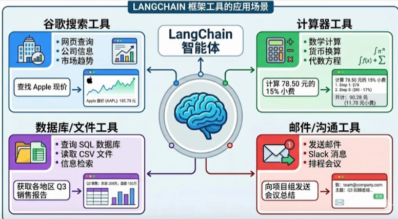

- 工具是构建智能体的核心要素之一


### 1.2 工具调用方式

- 在LangChain中，工具(Tools)实际上是指明确定义了输入和输出的<font color="red">**可调用函数**</font>。因此，<font color="red">**工具调用(Tool Calling)**</font>也被称为<font color="red">**"函数调用"（Function Calling）**</font>

- 有两种调用方式
  - 调用方式1：<font color="red">**直接调用**</font>

  ~~~python
  @tool
  def get_weather(city: str) -> str:
      """
      获取指定城市的天气信息
  
      参数：
          city：城市名称，如：北京、上海
  
      返回：
          天气信息字符串
      :return:
      """
      # 具体实现
      return city + "晴天，温度25度"
  
  # 使用invoke方法直接调用
  result = get_weather.invoke({"city": "上海"})
  print(result)
  ~~~

  - 调用方式2：<font color="red">**基于模型进行调用**</font>

  ~~~python
  @tool
  def get_weather(city: str) -> str:
      """
      获取指定城市的天气信息
  
      参数：
          city：城市名称，如：北京、上海
  
      返回：
          天气信息字符串
      :return:
      """
      return city + "晴天，温度25度"
  
  # 绑定工具
  model_with_tool = model.bind_tools([get_weather])
  
  # AI可以决定是否调用工具
  responses = model_with_tool.invoke("北京天气如何?")
  
  # 检查AI是否要调用工具
  if responses.tool_calls:
      print("AI想要调用工具：", responses.tool_calls)
  else:
      print("AI直接回答：", responses.content)
      
      
  # 打印1：AI想要调用工具： [{'name': 'get_weather', 'args': {'city': '北京'}, 'id': 'call_uB506ogH', 'type': 'tool_call'}]
  # 打印2：AI直接回答： 1 + 1 = 2
  ~~~


### 1.3 工具调用的整体流程


# 六、结构化输出

## 1、结构化输出概述

### 1.1 什么是结构化输出

- LangChain的结构化输出（Structured Output）指的是：

  - <font color="red">**要求模型最终返回一个符合预定义结构的数据对象**</font>，例如固定字段的JSON，Pydantic模型、TypedDict，而不再是无格式的自然语言文本

- 它的核心目标是<font color="red">**把自然语言回答变成程序可以稳定消费的数据**</font>

- 例如

  - 不再让模型输出

  ~~~bash
  盗梦空间在2010年上映，导演是诺兰，评分9.3	
  ~~~

  - 而是让他输出类似这样的结构

  ~~~json
  {
      "title": "盗梦空间",
      "year": 2010,
      "director": "诺兰",
      "rating": 9.3
  }
  ~~~

- 这样做的价值有三点

  - <font color="red">**更容易被代码处理**</font>：下游系统可以直接读字段，而不再从自然语言里做解析
  - <font color="red">**结果更稳定**</font>：减少模型说法变了但意思差不多导致的解析失败
  - <font color="red">**更适合工程化**</font>：适用于表单抽取、分类、路由、调用工具参数生成、工作流状态传递等场景


### 1.2 传统方式 vs 结构化输出

- <font color="red">**传统的几种方式：繁琐不推荐**</font>

~~~python
# 1、提示词要求json
prompt = "以json格式返回：{name, age, sex}"
response = model.invoke(prompt)

# 2、手动解析
import json
data = json.loads(response.content)

# 3、手动验证类型
if not isintance(data['age'], int):
    raise ValueError('age must be int')
    
# 4、手动创建对象
person = Person(**data)
~~~

- <font color="red">**结构化输出：简洁**</font>

~~~python
# 一步到位
structured_llm = model.with_structured_output(Person)
person = structured_llm.invoke("张三是一名30岁的工程师")
~~~

- 为什么结构化输出受欢迎
  - 在没有Pydantic等结构化方案之前，开发者需要写大量的Prompt苦口婆心的球大模型“请返回json，不要带任何解释”，然后自己写繁琐的 json.loads()和try ...except
  - 而有了Pydantic等结构化方案结合 .with_structured_output()之后
    - <font color="red">**prompt变干净了**</font>：字段的description直接充当了prompt的一部分
    - <font color="red">**类型安全**</font>：编辑器能自动补全，代码运行前就能做类型检查
    - <font color="red">**极其稳定**</font>：依托大模型厂商底层的json模式，输出错误率降到了极低


### 1.3 结构化输出模式

- 目前LangChain支持多种Schema与结构化输出方式
  - <font color="red">**Pydantic**</font>（字段校验、描述、嵌套结构、功能最丰富）
  - <font color="red">**TypedDict**</font>（轻量类型约束）
  - <font color="red">**JSON Schema**</font>（与前后端/跨语言接口最通用）
  - <font color="red">**dataclass**</font>

- 模型对象可以调用with_structured_output()绑定输出模式(schema)
- <font color="red">**只有Pydantic返回的是Schema类实例，其余三种返回的都是字典；也只有Pydantic在类型不匹配时会抛出异常**</font>

- 目前绝大数模型都支持结构化输出，不支持的LangChain需要回退到提示词+json解析


## 2、四种模式使用

### 2.1 Pydantic

