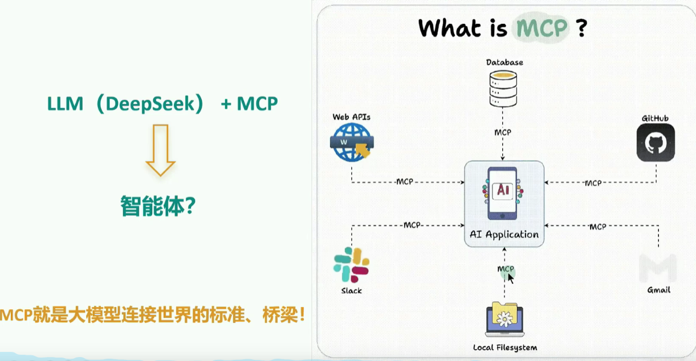
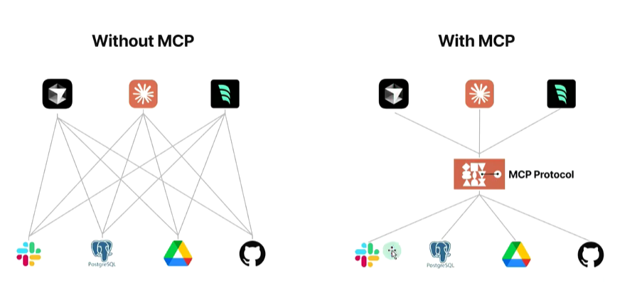

# 一、概述

## 1、AI互联领域的重大挑战

- **Agent 与 Tools (工具)的交互**：MCP ---> Agent 需要调用外部工具和API、访问数据库、执行代码等
- **Agent 与 Agent (其他智能体或用户) 的交互**：A2A ---> Agent需要理解其他 Agent的意图、协同完成任务、与用户进行自然的对话

## 2、MCP能干什么

- 对程序员：

  - 举例 1：开发部署

    - 开发者通过自然语言指令 “部署新版本到测试环境”，触发 MCP 链式调用 GitLab API（代码合并）、Jenkins API（构建镜像）、Slack API（通知团队）。

  - 举例 2：SQL 查询

    - 开发者通过自然语言输入，比如 “查询某集团部门上个季度销售额”，就能查询出数据库的数据，并结合大模型进行回答，不再需要编写 SQL，MCP 自动转换为精准 SQL 语句并执行。

  - 举例 3：manus 智能体

    - Manus 的每一次任务处理都至少需要调用网页搜索、网页访问、网页信息获取、本地文件创建、代码解释器等几十个外部工具。

    - 这里就暴露了两个问题
      - 问题 1：可供大模型调用的工具不足
      - 问题 2：调用工作量很大

- 对大众用户：

  - 举例 1：旅游规划

    - 当我要去旅行时，**旅行规划助手**通过 MCP 同时调用天气 API（获取目的地气象）、交通 API（查询航班动态）、地图 API（规划路线），AI 自动生成**带实时数据的行程方案**。

  - 举例 2：联网搜索

    - 我们在与 LLM 交互时，经常需要**联网搜索**最新信息以减少幻觉。然而，这里也存在问题：

      - 并非所有聊天机器人都支持联网功能

      - 即使支持联网，也可能不包含你习惯使用的搜索引擎。

    - 有了MCP之后，只需简单配置，就能将所需服务接入当前使用的聊天机器人

  - 举例 3：业绩查询

    - 用户询问 “查询上季度营业额”，MCP 自动组合调用 **CRM 系统 API**（获取客户数据）+ **财务系统 API**（调取报表）+ **邮件 API**（发送总结报告）

## 3、MCP是什么

- MCP（Model Context Protocol，模型上下文协议），2024 年 11 月底，由 Anthropic 推出的一种开放标准。旨在**为大语言模型（LLM）提供统一的、标准化方式与外部数据源和工具之间进行通信**

- **传统 AI 集成的问题**：这种为每个数据源构建独立连接的方式，可以被视为一个 **M\*N** 问题。

- **问题**：架构碎片化，难以扩展，限制了 AI 获取必要上下文信息的能力。

- **MCP 解决方案**：提供统一且可靠的方式来访问所需数据，克服了以往集成方法的局限性
- 总结：MCP作为一种标准化协议，极大的简化了大语言模型与外部世界的交互方式，使得开发者能够统一的方式为AI应用添加各种能力