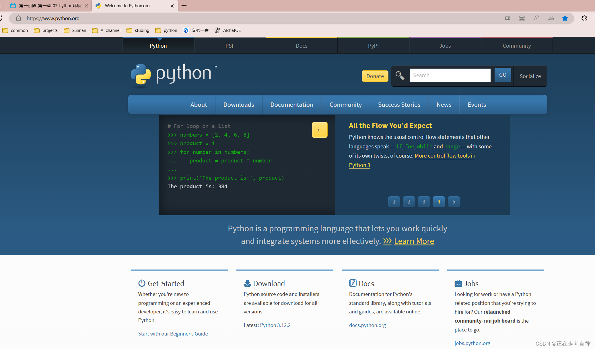
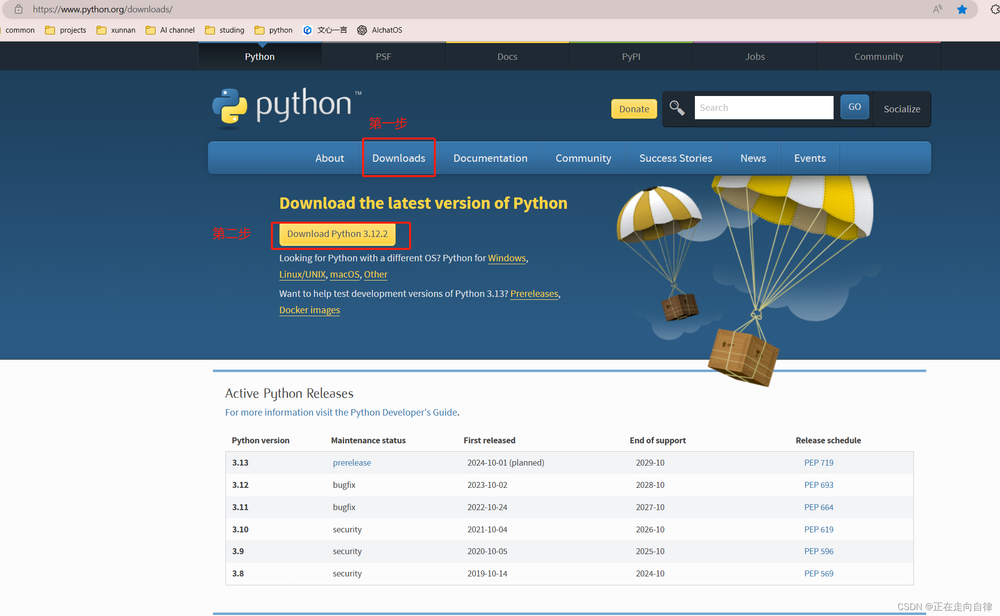
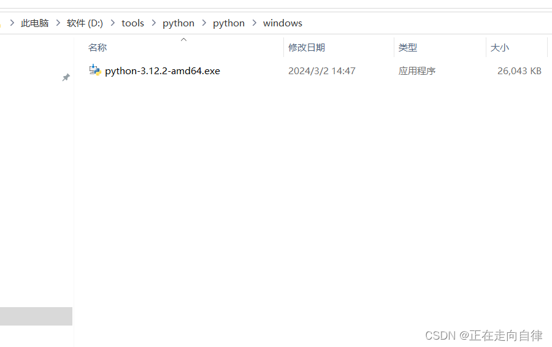
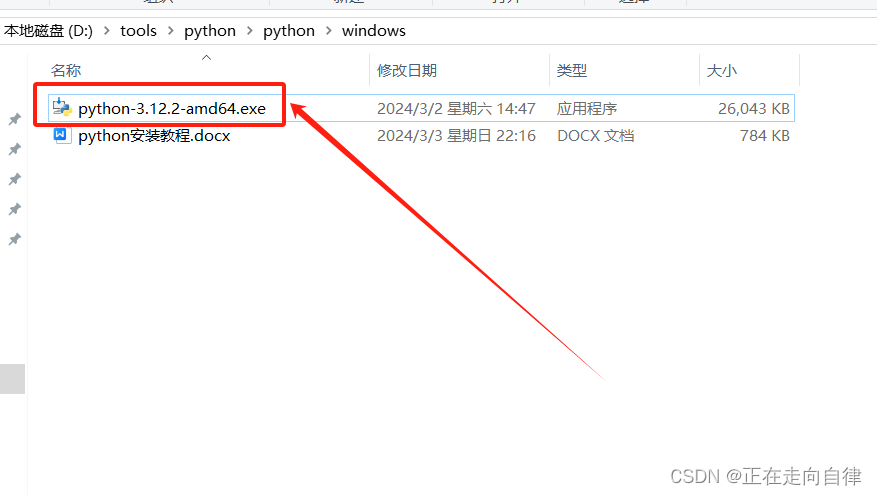
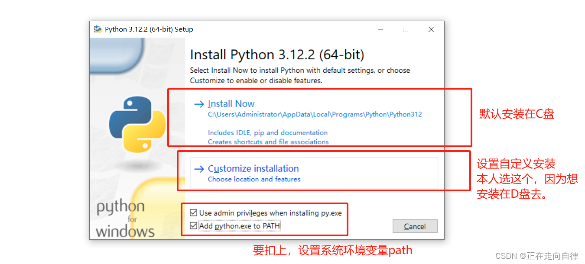
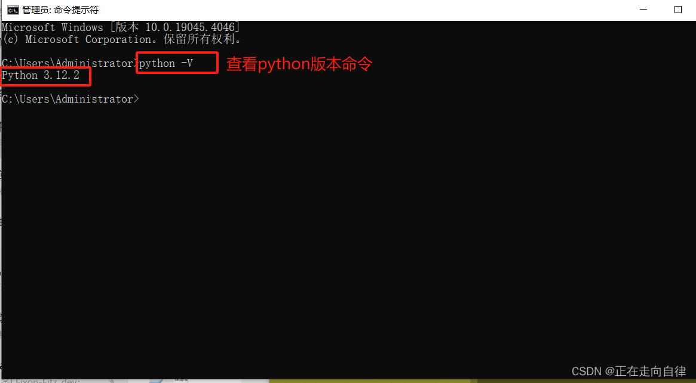
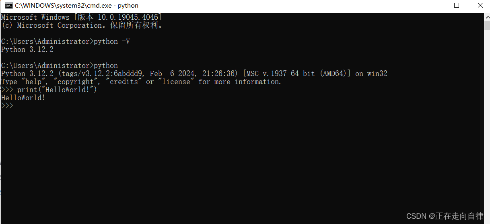
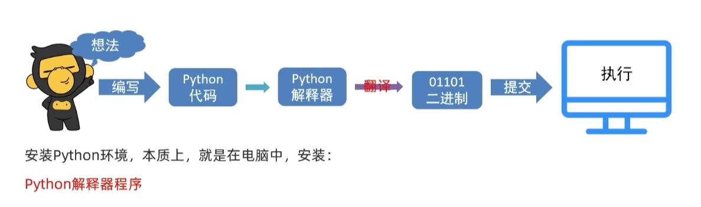
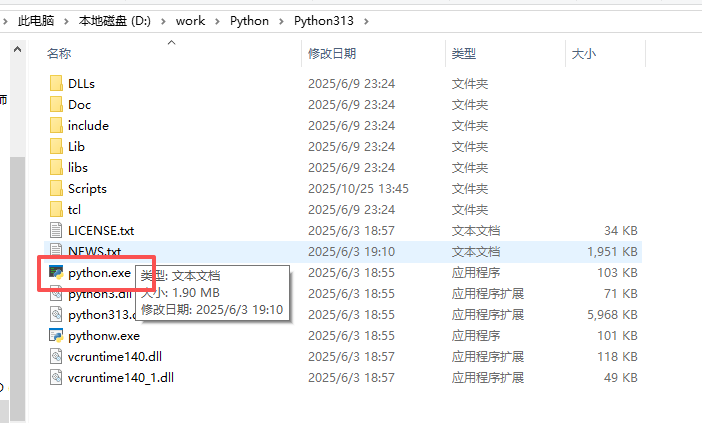

# 一、前置知识

## 1、了解知识

- Python 是荷兰计算机科学家吉多・范罗苏姆（Guido van Rossum，龟叔）在 1991 发布的一门语法简单、容易上手的**编程语言**。

- 语言：是人类进行沟通交流的主要表达方式。

- 编程语言：是人类与计算机之间进行信息交流的一种特殊的语言。
- 总结：**python是一门语法简单、容易上手且应用非常广泛的编程语言**


## 2、win环境安装

### 2.1 下载

- python官网：https://www.python.org/



- 官网下载Windows版本：https://www.python.org/downloads/windows/



- 下载后如图所示




### 2.2 安装

- 点击安装程序



- 如下图，建议选择自定义安装，确保勾选 "Add Python.exe to PATH" 选项（将 Python 添加到系统环境变量中，这样可以在命令行中直接运行 python 命令）



- 如下图，直接默认下一步


- 正在安装中


- 如下图，有一个提示Disable path length limit 点击关闭长度的限制，点击它然后安装完成。


### 2.3 验证安装

- 打开终端或命令提示符cmd（Windows用户）。


-  输入“python --version”或“python3 --version”，确认Python是否已成功安装。如果输出版本号，则表示安装成功。



- 输入“python”或“python3”，进入Python交互式环境。你可以在这里编写和运行Python代码。



- 查看pip版本


## 3、第一个python程序

- 打开cmd，输入python进入交互界面，输入下面代码后回车

~~~python
print('hello world')
~~~

- 输出：hello world

- 注意：<font color="red">**输入的双引号和括号都要使用英文的**</font>


## 4、第一个程序的常见问题

- 在命令提示符内输入 `python` 时，出现提示：

  ```
  'python' 不是内部或外部命令，也不是可运行的程序或批处理文件。
  ```

  - 原因：安装 Python 时，没有勾选 **Add Python 3.10 to PATH** 选项。

  - 解决步骤：

    1. 卸载当前 Python 程序。

    1. 重新运行 Python 安装程序，**务必勾选** `Add Python 3.10 to PATH` 选项（同时可勾选 `Install launcher for all users (recommended)`）。

    1. 安装完成后，重新打开命令提示符程序，即可正常使用 `python` 命令。

- 在命令提示符内直接执行 Python 代码时，出现提示：

  ```
  无法初始化设备 PRN
  ```

  - 原因：**没有进入 Python 解释器环境**，直接在 CMD 中执行了 Python 代码，系统误将 `print` 识别为 DOS 打印命令。
  - 解决步骤：
    - 在命令提示符中先输入 `python`，按下回车，等待出现 `>>>` 标记，代表已进入 Python 交互环境。
    - 在 `>>>` 后输入 Python 代码（如 `print("Hello World!!!!")`），再按下回车执行。

- 在 Python 交互环境中执行代码时，出现语法错误：

  ```
  SyntaxError: invalid character '“' (U+201C)
  ```

  - 原因：代码中使用了**中文符号**，Python 语法只识别英文符号。
  - 需要检查并修正的符号：
    - **双引号**：必须使用英文双引号 `" "`，不能使用中文双引号 `“ ”`
    - **小括号**：必须使用英文小括号 `( )`，不能使用中文小括号 `（ ）`


## 5、python解释器

- 计算机只认识二进制，即：0和1
- 所以计算机并不认识python代码，但是<font color="red">**通过python解释器程序将代码翻译成二进制**</font>，然后计算机就认识了



- python解释器的功能
  - 宏观功能
    - 翻译代码
    - 提交给计算机运行
  - 直接功能
    - 将 Python 代码翻译成计算机认识的 0 和 1 并提交计算机执行
    - 在解释器环境内可以一行行的执行我们输入的代码
    - 也可以使用解释器程序，去执行`.py`代码文件

- 解释器放在：python安装目录/python.exe
- cmd中执行python就是执行的这里的python.exe



- .py文件是什么

  - python语言的代码文件，里面记录了python代码

- 执行多行代码方式

  - 编写一个python.py文件

  ~~~python
  print('lzy')
  print('djb')
  ~~~

  - 然后通过cmd命令：python py文件

  ~~~bash
  python D:\test.py
  ~~~

- cmd退出python模式

  - exit()


