# 一、机器学习概述

## 1、人工智能、机器学习、深度学习

### 1.1 三者概念

- 什么是人工智能（Artificial Intelligence）：AI
  - 人工智能是研究智能行为的计算代理的合成和分析的领域
  - 人工智能就是用计算机来模拟人脑
  - 简单来说：**用计算机来模拟人脑，让计算机能够像人类一样，理性的思考和行动**

- 什么是机器学习（Machine Learning）：ML

  - 赋予计算机学习能力而不需要明确编程的研究领域
  - 简单来说：**不需要之前那种明确的if else这种具体的代码，而是让计算机能够自己学习知识，然后对新数据进行预测处理**
  - 机器如何学习：先训练，再预测

  

- 什么是深度学习（Deep Learning）：DL

  - 也叫深度神经网络，大脑仿生，设计一层一层的神经元模拟完事万物
  - 简单来说：**让机器像人脑一样，通过多层神经网络，自动从大量数据里学习规律，从而自己做判断、识别、生成内容**

  

### 1.2 三者关系

- 机器学习是实现人工智能的一种途径
- 深度学习是机器学习的一种方法

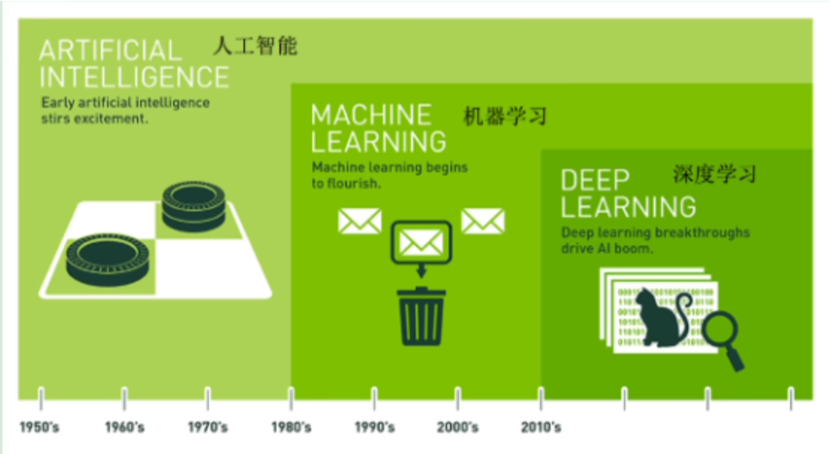

### 1.3 机器学习和深度学习的区别

- 机器学习（传统）

  - **需要人工提取特征**，比如识别猫：人要告诉机器 “耳朵、胡须、爪子” 这些特征

  - 模型层数少，结构简单

  - 数据量小也能用

  - 可解释性强，人能看懂它怎么判断的

- 深度学习

  - **不需要人工提取特征**
  - 直接喂图片，模型自己一层层学特征

  - 层数很多（深度网络）

  - 需要**大量数据 + 强大算力（GPU）**

  - 效果更强，但像黑盒，不太好解释

- 用一个例子对比：识别猫

  - 传统机器学习

    - 人手动设计特征：颜色、边缘、纹理、形状

    - 把特征输入模型（SVM、决策树等）

    - 模型学习分类

  - 深度学习

    - 直接把像素丢进神经网络

    - 第一层学边缘

    - 第二层学形状

    - 高层学 “猫” 整体

    - 自动判断是不是猫

- 一句话：**深度学习自动干了人原本要做的特征工作**

### 1.4 学习方式

- 基于规则的学习：程序员根据经验利用**手工的if-else方式进行预测**

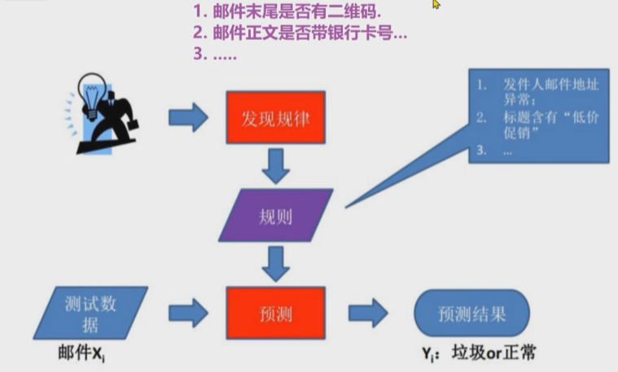

- 基于模型的学习：**从数据中自动学出规律**

  - 有很多问题无法明确的写下规则，此时无法使用规则学习的方式来解决这类问题，比如：图像和语音识别和自然语言处理

  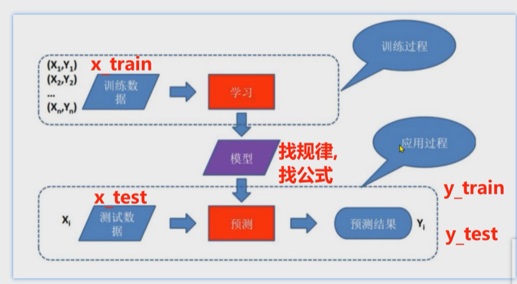

  - 举个例子：房价预测

  

  - 一元线性回归，公式：y = kx + b
    - k：斜率 —> weight，权重
    - b：截距 —> bias，偏值

### 1.5 例题

- **题目**：有关人工智能概念说法正确的？（多选）

  A）实现人工智能的方法很多，其中机器学习是实现人工智能一种途径、一种方法

  B）广义上深度学习是从机器学习发展而来的，两者有区别还有联系

  C）深度学习方法是大脑仿生，深度学习方法从机器学习发展而来

  D）机器学习就是基于模型自动学习事物特征，而不是程序员手工的编写规则

  E）深度学习和机器学习都有各自的应用场景。在研究领域中要根据待解决的问题来选择合理的方法。

~~~bash
# 答案
ABCDE
# 解析
这道多选题的正确选项为 A、B、C、D、E，解析如下：
A ✅：人工智能的实现途径多样，机器学习是核心方法之一。
B ✅：深度学习是机器学习的一个重要分支，二者既有继承关系，又在模型结构、适用场景上存在区别。
C ✅：深度学习受人类大脑神经网络结构启发（大脑仿生），且源于机器学习领域。
D ✅：机器学习的核心是让模型从数据中自动学习规律，而非依赖人工编写规则。
E ✅：深度学习与机器学习各有优势，需根据具体任务（如小样本场景 vs 复杂高维数据场景）选择合适技
~~~

## 2、机器学习的应用领域和发展史

- 应用领域
  - **计算机视觉 CV**：对人看到的东西进行理解
  - **自然语言处理**：对人交流的东西进行理解
  - **数据挖掘和数据分析**：也属于人工智能的范畴

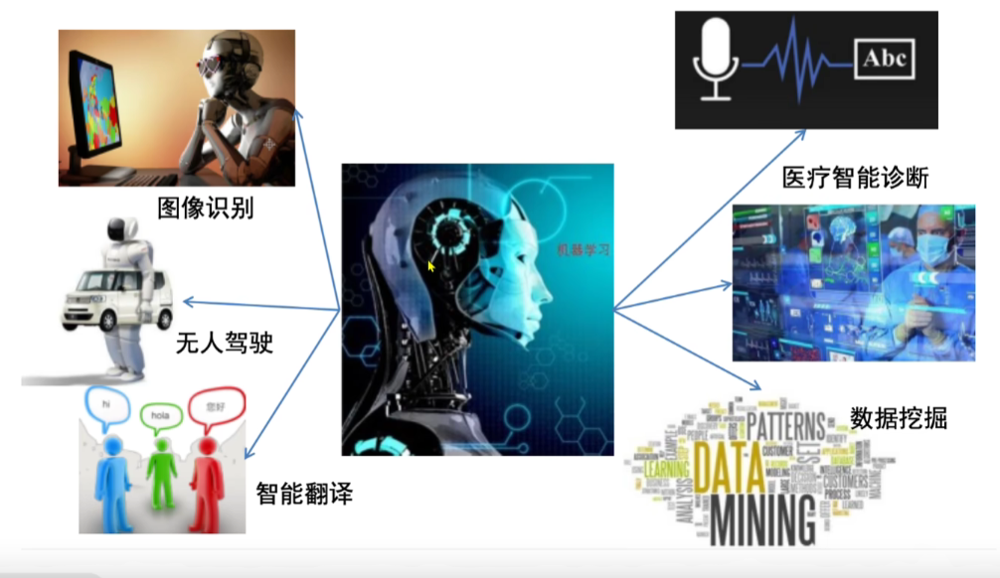

- 发展史
  - 1956 年人工智能元年
  - 2012 年计算机视觉深度神经网络方法研究兴起
  - 2017 年自然语言处理应用大幕拉开
  - 2022 年 chatGPT 的出现，引起 AIGC 的发展

- AI发展三要素

  - 数据
  - 算法
  - 算力

  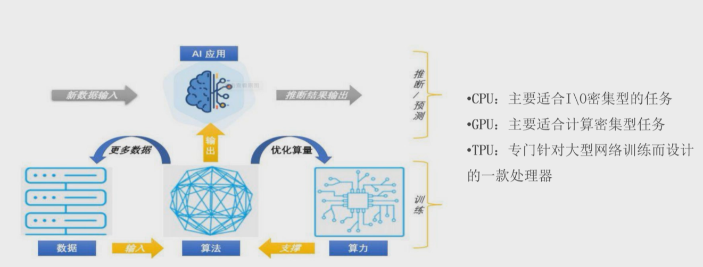

- 处理器区别
  - CPU：主要适合 I\O 密集型的任务
  - GPU：主要适合计算密集型任务
  - TPU：专门针对大型网络训练而设计的一款处理器

## 3、机器学习常用术语

- 总结：已知x_train、y_train、x_test，碰撞y_test

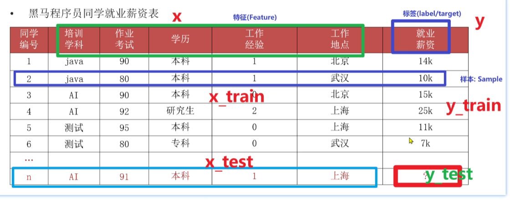

- 基本术语
  - **样本 (sample)**：一行数据就是一个样本；多个样本组成数据集；有时一条样本被叫成一条记录
  - **特征 (feature)**：一列数据一个特征，有时也被称为属性
  - **标签 / 目标 (label/target)**：模型要预测的那一列数据。本场景是就业薪资
    - 就业薪资 与 培训学科、作业考试、学历、工作经验、工作地点 **5 个特征** 有关系
  - 特征如何理解（重点）：**特征是从数据中抽取出来的，对结果预测有用的信息**

- 数据集可以分为：训练集、测试集，比例 8:2 或 7:3
  - **训练集**：用来训练模型的数据集
  - **测试集**：用来测试模型的数据集

- 总结：
  - x_train：训练集中的x（训练集中的特征）
  - y_train：训练集中的y（训练集中的标签）
  - x_test：测试集中的x（测试集中的特征）
  - y_test：测试集中的y（测试集中的标签）
  - 机器学习实质就是：已知前三项，碰撞第四项

## 4、机器学习算法分类

### 4.1 监督学习和无监督学习

- 无监督分类

  - **监督学习**：**有特征有标签**
    - 定义：输入数据是由输入特征值和目标值所组成，即**输入的训练数据有标签**
    - 数据集：需要标注数据的标签/目标值

  - **无监督学习**：**有特征无标签**
    - 定义：输入数据没有被标记，即样本数据类别未知，**没有标签**，根据样本间的相似性，对样本集聚类，以发现事物内部的结构和相似性
    - 数据集：标注数据没有标签/目标值
  - 如下：
    - 左侧的是监督学习，有特征有标签，电影名称、搞笑镜头、拥抱镜头、打斗镜头等为特征，电影类型为标签
    - 右侧的是无监督学习，有特征无标签，根据样本间的相似性，对样本集聚类，比如：有无帽子分一类、手里有无工具分一类等，然后根据这些发现其结构和相似性，从而发现标签/目标值

- 监督学习下分类
  - **分类问题**
    - 目标值（标签值）是不连续的
    - 分类种类：二分类、多分类
  - **回归问题**
    - 目标值（标签值）是连续的
  - 如下：
    - 左侧的是分类问题，标签值是分具体类别的
    - 右侧的是回归问，标签值是那种连续的

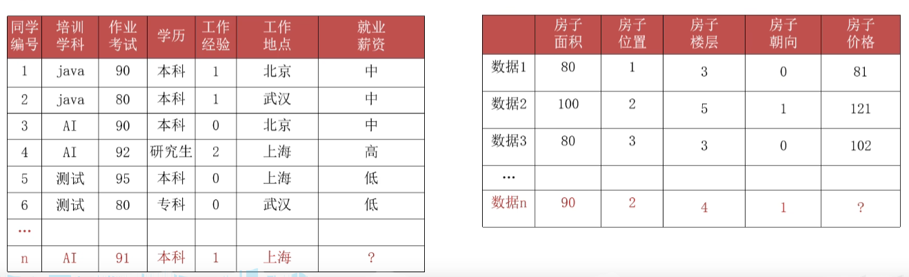

- 无监督学习下分类
  - **聚类问题**
    - 无监督学习是有特征无标签的类型，所以只能依靠样本间相似性对数据进行聚类，然后发现其内部结构和相互关系

### 4.2 半监督学习

- **有特征，部分数据有目标值（标签值）**

- 工作原理
  - 让专家标注少量数据，利用已经标记的数据（也就是带有类标签）训练出一个模型
  - 再利用该模型去套用未标记的数据
  - 通过询问领域专家分类结果与模型分类结果做对比，从而对模型做进一步改善和提高
- **半监督学习可以大幅度降低标记成本**

- 例子

### 4.3 强化学习

- **强化学习（Reinforcement Learning）**：机器学习的一个重要分支
- **应用场景**：里程碑 AlphaGo 围棋、各类游戏、对抗比赛、无人驾驶场景

- 四要素
  - Agent
  - 环境
  - 奖励
  - 动作
- 基本原理：Agent根据环境状态进行行动获取最多的累计奖励
- 总结：**强化学习 = 寻找最短路径 (最优解)，以便获取最多的奖励**

### 4.4 总结

| 学习类型                                 | 核心特点 | 输入数据                        | 输出 / 反馈     | 核心目标                   | 典型案例                                 |
| ---------------------------------------- | -------- | ------------------------------- | --------------- | -------------------------- | ---------------------------------------- |
| **监督学习**(Supervised Learning)        | 有老师教 | 带标签的数据（输入 + 正确答案） | 有明确反馈      | 预测结果 / 分类            | 猫狗图像分类、房价预测、垃圾邮件识别     |
| **无监督学习**(Unsupervised Learning)    | 自主探索 | 无标签数据（只有输入）          | 无反馈          | 发现数据内在结构 / 规律    | 客户分群、异常检测、“物以类聚，人以群分” |
| **半监督学习**(Semi-Supervised Learning) | 折中方案 | 少量有标签 + 大量无标签数据     | 有反馈          | 降低标注成本，提升模型效果 | 文本分类、图像识别（标注成本高的场景）   |
| **强化学习**(Reinforcement Learning)     | 试错学习 | 环境状态 + 奖励机制             | 延迟奖励 / 惩罚 | 长期利益最大化             | AlphaGo 围棋、游戏 AI、自动驾驶          |

## 5、机器学习建模流程

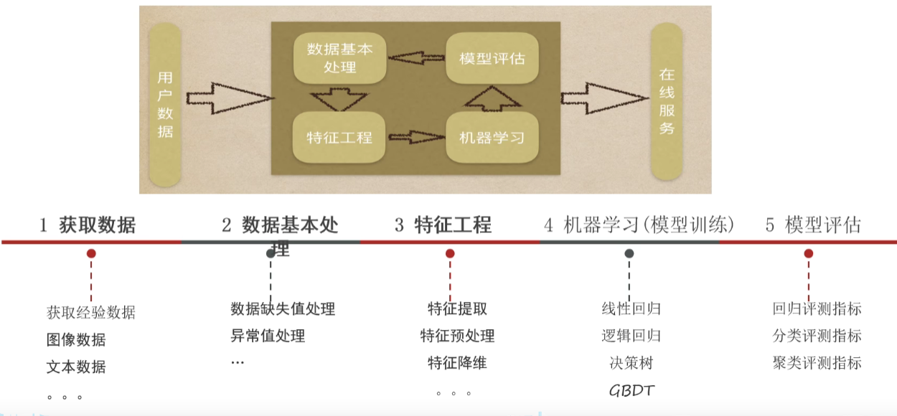

- 机器学习建模的一般步骤

  - **获取数据**：搜集与完成机器学习任务相关的数据集

  - **数据基本处理**：数据集中异常值、缺失值的处理等

  - **特征工程**：对数据特征进行提取、转成向量，让模型达到最好的效果

  - **机器学习（模型训练）**：选择合适的算法对模型进行训练
    - 根据不同的任务来选中不同的算法；有监督学习、无监督学习、半监督学习、强化学习

  - **模型评估**：评估效果好则上线服务，评估效果不好则重复上述步骤

- 注：在整个建模流程中，数据基本处理、特征工程一般是最耗时、耗精力最多的

- 模型预测
  - 用训练集训练出来模型
  - 然后用测试集中的x_train通过模型跑出来p_test
  - 然后用测试集中的p_pred（预期值）和p_test对比即可

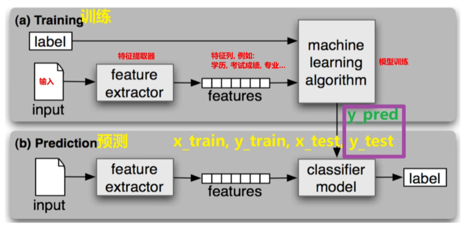

~~~bash
下面关于机器学习建模的流程每个步骤表示如下：
获取数据（3）、数据基本处理（1）、特征工程（6）、机器学习（模型训练）（5）、模型评估（4）、在线服务模型预测（2）。下列流程正确的是：
A) 1 -> 2 -> 3 -> 4 -> 5 -> 6
B) 3 -> 1 -> 6 -> 5 -> 4 -> 2
C) 3 -> 1 -> 6 -> 2 -> 5 -> 4
D) 1 -> 3 -> 6 -> 5 -> 4 -> 2

# 答案：B
~~~

## 6、特征工程概念入门

### 6.1 概念

- 特征工程：利用专业背景知识和技巧**处理数据**，让机器学习算法效果最好。这个过程就是特征工程
- 数据和特征决定了机器学习的上限，而模型和算法只是逼近这个上限而已

### 6.2 设计内容

- **特征提取**：原始数据中提取与任务相关的特征，构成特征向量

  - 例子：提取鸢尾花的花瓣的长、宽、花萼的长宽作为特征向量

- **特征预处理**：特征对模型会产生影响，因量纲（单位）问题，有些特征对模型影响大、有些影响小

  - 方式分为：**归一化、标准化**
  - 例子：人一般身高用m，体重用kg，但是如果用身高用mm，体重用g，那么差值就会很大

- **特征降维**：将原始数据的维度降低，叫做特征降维，一般会对原始数据产生影响

  - 例子：比如3D的地球仪转为2D地图

- **特征选择**：原始数据特征很多，与任务相关是其中一个特征集合子集，不会改变原数据

  - 例子：比如有10列特征，选出最直接相关的5列

- **特征组合**：把多个特征合并为一个特征。利用乘法或者加法来完成

  - 例子：

    - `[A X B]`：将两个特征的值相乘形成的特征组合。

    - `[A x B x C x D x E]`：将五个特征的值相乘形成的特征组合。

    - `[A x A]`：对单个特征的值求平方形成的特征组合

### 6.3 例题

有关特征工程说法正确的？（多选）

A）在机器学习整个工程项目中，一般情况下特征工程往往是耗时、耗精力最多工作

B）特征工程就是处理数据，不重要

C）特征提取一般是做数据的标准化、归一化等工作

D）特征降维会修改原始数据，特征选择不会修改原始数据

E）特征工程的好坏会影响模型的上限，是一项专项的工作；开发者需要掌握

~~~bash
答案：ADE
A ✅：在工业界机器学习项目中，特征工程通常占项目开发 60%~80% 的时间，是最耗时耗力的环节。
B ❌：特征工程是决定模型效果上限的关键环节，并非 “不重要”。
C ❌：标准化、归一化属于特征预处理 / 特征缩放，而特征提取是从原始数据中构造新特征（如文本转 TF-IDF、图像提取 HOG 特征）。
D ✅：特征降维（如 PCA）会通过线性 / 非线性变换生成新特征，修改了原始数据结构；特征选择只是从原始特征中筛选子集，不会修改原始数据。
E ✅：“数据和特征决定了模型的上限”，特征工程是机器学习中非常核心的专项技能，开发者必须掌握
~~~

## 7、模型拟合问题

- **拟合（fitting）**：用在机器学习领域，用来表示模型对样本点的拟合情况

- 通俗来说：**拟合 = 模型在训练集和测试集上表现情况**

  - **欠拟合（under-fitting）**：模型在训练集上表现很差、在测试集表现也很差

  - **过拟合（over-fitting）**：模型在训练集上表现很好、在测试集表现很差

- 拟合例子
  - 左边的欠拟合
  - 右边的过拟合

- 拟合问题产生原因
  - 欠拟合产生原因：**模型过于简单**
  - 过拟合产生原因：**模型太过于复杂，数据不纯，训练数据太少**

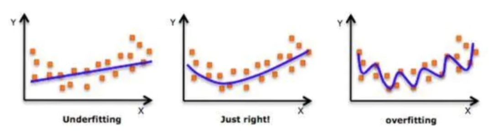

- **泛化（Generalization）**：模型在新数据集（非训练数据）上的表现好坏的能力。**模型的拟合情况 = 泛化能力**
- **奥卡姆剃刀原则**：给定两个具有相同泛化误差的模型，**较简单的模型比较复杂的模型更可取**

~~~bash
下列有关过拟合欠拟合说法正确的？（多选）
A）欠拟合：模型学习到的特征过少，无法准确的预测未知样本
B）过拟合：模型学习到的特征过多，导致模型只能在训练样本上得到较好的预测结果，而在未知样本上的效果不好
C）欠拟合可以通过增加特征来解决
D）过拟合可以通过正则化、异常值检测、特征降维等方法来解决

# 答案：ABCD
A ✅：欠拟合的本质是模型容量不足，学习到的有效特征太少，无法捕捉数据规律，导致训练集和测试集表现都差。
B ✅：过拟合是模型过度学习了训练集中的噪声和细节，学到了过多非通用特征，只在训练集表现好，泛化能力差。
C ✅：增加更多有区分度的特征（如特征交叉、构造新特征）可以提升模型表达能力，缓解欠拟合。
D ✅：正则化（L1/L2）可约束模型复杂度，异常值检测可减少噪声干扰，特征降维可去除冗余特征，这些都是缓解过拟合的常用方法。
~~~

## 8、机器学习开发环境

- 基于 Python 的 scikit-learn 库

  - 简单高效的数据挖掘和数据分析工具

  - 可供大家使用，可在各种环境中重复使用

  - 建立在 NumPy、SciPy 和 matplotlib 上

  - 开源，可商业使用 —— 获取 BSD 许可证

- 安装方法

~~~bash
pip install scikit-learn
~~~

- 官网：https://scikit-learn.org/stable/

# 二、KNN算法

## 1、KNN简介

### 1.1 定义

- **K - 近邻算法**（K Nearest Neighbor，简称 KNN）：根据你的 “邻居” 来推断出你的类别

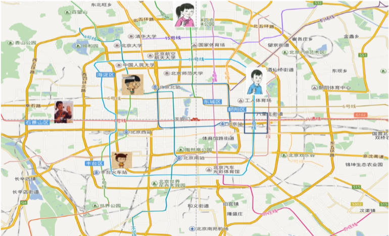

- **KNN 算法思想**：如果一个样本在特征空间中的 k 个**最相似**的样本中的大多数属于某一个类别，则该样本也属于这个类别

### 1.2 如何确定样本相似性

- 样本相似性：样本都是属于一个任务数据集的，**样本距离越近越相似**

- 利用K邻近算法预测电影类型

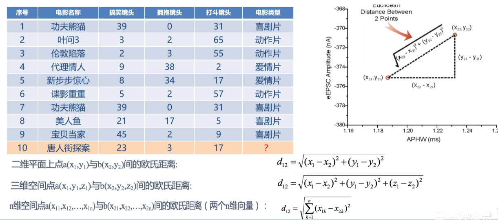

- **欧式距离 = 对应维度差值平方和，开平方根**
- 举例
  - 分别计算10号电影与前9个电影的距离
    - 1号：((39 - 23)² + (0 - 3)² + (31 - 17)²)开平方 =  21.47
    - 2号：50.21
    - 3号：43.42
    - 4号：40.57
    - 5号：34.44
    - 6号：43.87
    - 7号：21.47
    - 8号：18.55
    - 9号：23,43
  - 当K = 5时，1、4、5、7、8号电影与10号电影距离最近，所以得出10号电影为喜剧片
- K值选择问题i
  - K 值过小的影响
    - 用**较小邻域**中的训练实例进行预测
    - 容易受到**异常点**的影响
    - K 值减小 → 模型变复杂 → 容易发生**过拟合**
    - 举例：K=1
      - 无论输入实例是什么，只会按照训练集中**距离最近**进行预测
      - 完全受样本数据最近数据影响
  - K 值过大的影响
    - 用**较大邻域**中的训练实例进行预测
    - 受到**样本均衡**问题的影响
    - K 值增大 → 模型变简单 → 容易发生**欠拟合**
    - 举例：K=N（N 为训练样本个数）
      - 无论输入实例是什么，只会按训练集中**最多的类别**进行预测
      - 完全受样本均衡性的影响