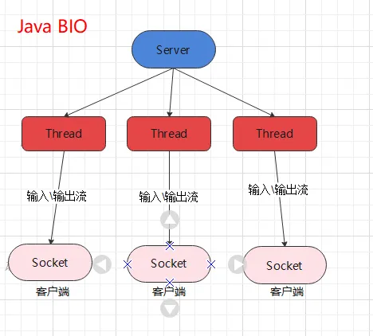
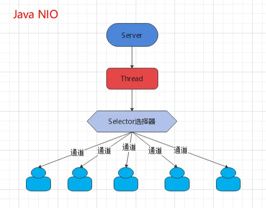
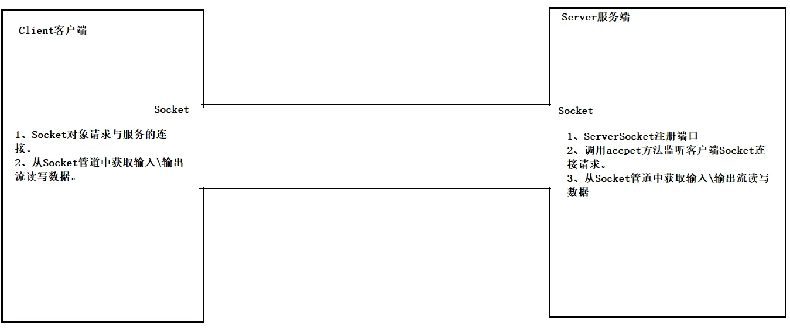
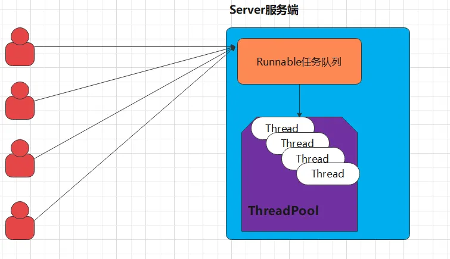
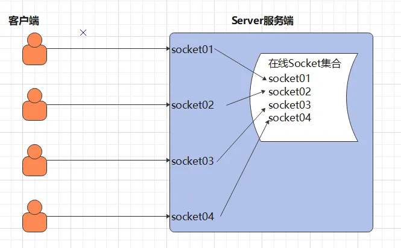
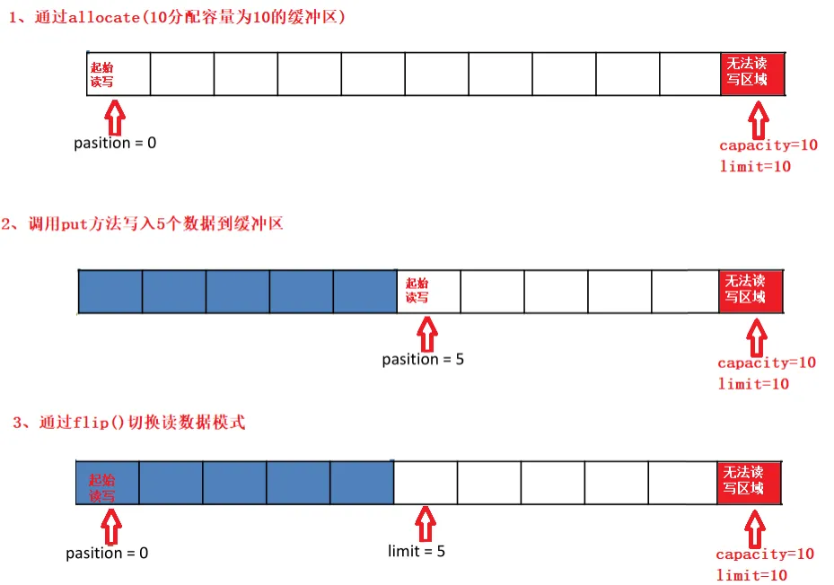
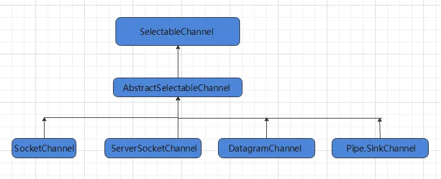
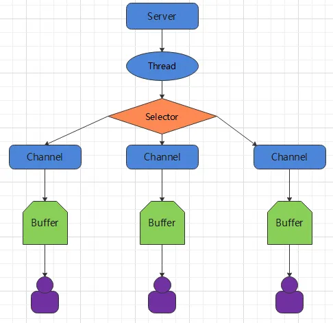

-  在Java的软件设计开发中，通信架构是不可避免的，我们在进行不同系统或者不同进程之间的数据交互，或者在高并发下的通信场景下都需要用到网络通信相关的技术，对于一些经验丰富的程序员来说，Java早期的网络通信架构存在一些缺陷，<font color="red">**其中最令人恼火的是基于性能低下的同步阻塞式的I/O通信（BIO）**</font>，随着互联网开发下通信性能的高要求，Java在2002年开始支持了<font color="red">**非阻塞式的I/O通信技术(NIO)**</font>。


# 一、Java的I/O演进之路

## 1、I/O 模型基本说明

- I/O 模型：就是用什么样的通道或者说是通信模式和架构进行数据的传输和接收，很大程度上决定了程序通信的性能
- Java 共支持 3 种网络编程的/IO 模型：**BIO、NIO、AIO**


### 1.1 BIO

- <font color="red">**同步并阻塞(传统阻塞型)**</font>，服务器实现模式为一个连接一个线程，即客户端有连接请求时服务器端就需要启动一个线程进行处理，如果这个连接不做任何事情会造成不必要的线程开销 




### 1.2 NIO

- <font color="red">**同步非阻塞**</font>，服务器实现模式为一个线程处理多个请求(连接)，即客户端发送的连接请求都会注册到<font color="red">**多路复用器**</font>上，多路复用器轮询到连接有 I/O 请求就进行处理 




### 1.3 AIO

- Java AIO(NIO.2) ：  <font color="red">**异步非阻塞**</font>，服务器实现模式为一个有效请求一个线程，<font color="red">**客户端的I/O请求都是由OS先完成了再通知服务器应用去启动线程进行处理**</font>，一般适用于连接数较多且连接时间较长的应用


### 1.4  适用场景分析

- BIO： 方式适用于连接数目比较小且固定的架构，这种方式对服务器资源要求比较高，并发局限于应用中，JDK1.4以前的唯一选择，但程序简单易理解。
- NIO：方式适用于连接数目多且连接比较短（轻操作）的架构，比如聊天服务器，弹幕系统，服务器间通讯等。编程比较复杂，JDK1.4 开始支持。
- AIO：方式使用于连接数目多且连接比较长（重操作）的架构，比如相册服务器，充分调用 OS 参与并发操作，编程比较复杂，JDK7 开始支持。


# 二、BIO

## 1、基本介绍

- Java BIO 就是传统的 java io  编程，其相关的类和接口在 java.io
- BIO(blocking I/O) ： <font color="red">**同步阻塞**</font>，服务器实现模式为一个连接一个线程，即客户端有连接请求时服务器端就需要启动一个线程进行处理，如果这个连接不做任何事情会造成不必要的线程开销，可以通过线程池机制改善(实现多个客户连接服务器).


## 2、工作机制



- 服务器端启动一个 <font color="red">**ServerSocket**</font>，注册端口，调用accpet方法监听客户端的Socket连接。
- 客户端启动 <font color="red">**Socket**</font> 对服务器进行通信，默认情况下服务器端需要对每个客户 建立一个线程与之通讯


## 3、传统的BIO编程实例回顾

- 网络编程的基本模型是Client/Server模型，也就是两个进程之间进行相互通信，其中服务端提供位置信（绑定IP地址和端口），客户端通过连接操作向服务端监听的端口地址发起连接请求，<font color="red">**基于TCP协议下进行三次握手连接**</font>，连接成功后，双方通过网络套接字（Socket）进行通信。
- 传统的同步阻塞模型开发中，服务端ServerSocket负责绑定IP地址，启动监听端口；客户端Socket负责发起连接操作。连接成功后，双方通过输入和输出流进行同步阻塞式通信。
-  基于BIO模式下的通信，<font color="red">**客户端 - 服务端是完全同步**</font>，完全耦合的。
- 客户端Client代码

~~~java
package com.example.study.bio;

import java.io.OutputStream;
import java.io.PrintStream;
import java.net.Socket;

/**
 目标: Socket网络编程。

 Java提供了一个包：java.net下的类都是用于网络通信。
 Java提供了基于套接字（端口）Socket的网络通信模式，我们基于这种模式就可以直接实现TCP通信。
 只要用Socket通信，那么就是基于TCP可靠传输通信。

 功能1：客户端发送一个消息，服务端接口一个消息，通信结束！！

 创建客户端对象：
 （1）创建一个Socket的通信管道，请求与服务端的端口连接。
 （2）从Socket管道中得到一个字节输出流。
 （3）把字节流改装成自己需要的流进行数据的发送
 创建服务端对象：
 （1）注册端口
 （2）开始等待接收客户端的连接,得到一个端到端的Socket管道
 （3）从Socket管道中得到一个字节输入流。
 （4）把字节输入流包装成自己需要的流进行数据的读取。

 Socket的使用：
 构造器：public Socket(String host, int port)
 方法：  public OutputStream getOutputStream()：获取字节输出流
 public InputStream getInputStream() :获取字节输入流

 ServerSocket的使用：
 构造器：public ServerSocket(int port)

 小结：
 通信是很严格的，对方怎么发你就怎么收，对方发多少你就只能收多少！！

 */
public class Client {
    public static void main(String[] args) {
        try {
            System.out.println("==客户端的启动==");
            // 1、创建一个Socket的通信管道，请求与服务端的端口连接。
            Socket socket = new Socket("127.0.0.1", 9999);
            // 2、从Socket通信管道中得到一个字节输出流。
            OutputStream outputStream = socket.getOutputStream();
            // 3、把字节流改装成自己需要的流进行数据的发送
            PrintStream printStream = new PrintStream(outputStream);
            // 开始发送消息
            printStream.println("我是客户端，你好");
            printStream.flush();
        } catch (Exception e) {
            e.printStackTrace();
        }
    }
}

~~~

- 服务端Server代码

~~~java
package com.example.study.bio;

import java.io.BufferedReader;
import java.io.InputStream;
import java.io.InputStreamReader;
import java.net.ServerSocket;
import java.net.Socket;

/**
 * 目标：客户端发送消息，服务段接收消息
 */
public class Server {
    public static void main(String[] args) {
        try {
            System.out.println("==服务器的启动==");
            // 1、定义一个ServerSocket对象对服务端的端口进行注册
            ServerSocket serverSocket = new ServerSocket(9999);
            // 2、监听客户端的socket连接请求
            Socket socket = serverSocket.accept();
            // 3、从socket管道中得到一个字节输入流对象
            InputStream inputStream = socket.getInputStream();
            // 4、把字节输入流包装成一个缓冲字符输入流
            BufferedReader bufferedReader = new BufferedReader(new InputStreamReader(inputStream));
            // 5、读取数据
            String line ;
            // 这里为什么不能用while，因为客户端发送只有一条，发送完代码就执行完了，所以这里就等不到后续的输入，监听失效导致报错java.net.SocketException: Connection reset（客户端和服务端是同步的，客户端爆炸结束了，服务端也会跟着完蛋）
            if((line = bufferedReader.readLine())!=null){
                System.out.println("服务端收到：" + line);
            }
        } catch (Exception e) {
            e.printStackTrace();
        }
    }
}
~~~

- 在以上通信中，服务端会一致等待客户端的消息，如果客户端没有进行消息的发送，服务端将一直进入阻塞状态。
- 同时服务端是按照行获取消息的，这意味着客户端也必须按照行进行消息的发送，否则服务端将进入等待消息的阻塞状态！


## 4、BIO模式下多发和多收消息

- 上述案例<font color="red">**只能实现客户端发送消息，服务端接收消息，并不能实现反复的收消息和反复的发消息**</font>，我们只需要在客户端案例中，加上反复按照行发送消息的逻辑即可！案例代码如下：
- 服务端Server


~~~java
package com.example.study.bio;

import java.io.BufferedReader;
import java.io.InputStream;
import java.io.InputStreamReader;
import java.net.ServerSocket;
import java.net.Socket;

/**
 * 目标：客户端发送消息，服务段接收消息
 */
public class Server {
    public static void main(String[] args) {
        try {
            System.out.println("==服务器的启动==");
            // 1、定义一个ServerSocket对象对服务端的端口进行注册
            ServerSocket serverSocket = new ServerSocket(9999);
            // 2、监听客户端的socket连接请求
            Socket socket = serverSocket.accept();
            // 3、从socket管道中得到一个字节输入流对象
            InputStream inputStream = socket.getInputStream();
            // 4、把字节输入流包装成一个缓冲字符输入流
            BufferedReader bufferedReader = new BufferedReader(new InputStreamReader(inputStream));
            // 5、读取数据
            String line ;
            while ((line = bufferedReader.readLine())!=null){
                System.out.println("服务端收到：" + line);
            }
        } catch (Exception e) {
            e.printStackTrace();
        }
    }
}
~~~

- 客户端Client

~~~java
package com.example.study.bio;

import java.io.OutputStream;
import java.io.PrintStream;
import java.net.Socket;
import java.util.Scanner;

/**
 目标: Socket网络编程。

 功能1：客户端可以反复发消息，服务端可以反复收消息

 小结：
 通信是很严格的，对方怎么发你就怎么收，对方发多少你就只能收多少！！

 */
public class Client {
    public static void main(String[] args) {
        try {
            System.out.println("==客户端的启动==");
            // 1、创建一个Socket的通信管道，请求与服务端的端口连接。
            Socket socket = new Socket("127.0.0.1", 9999);
            // 2、从Socket通信管道中得到一个字节输出流。
            OutputStream outputStream = socket.getOutputStream();
            // 3、把字节流改装成自己需要的流进行数据的发送
            PrintStream printStream = new PrintStream(outputStream);
            // 开始发送消息
            Scanner scanner = new Scanner(System.in);
            while (true) {
                System.out.println("请说：");
                String msg = scanner.nextLine();
                printStream.println(msg);
                printStream.flush();
            }
        } catch (Exception e) {
            e.printStackTrace();
        }
    }
}
~~~

- 服务端只能处理一个客户端的请求，因为服务端是单线程的。一次只能与一个客户端进行消息通信。


## 5、BIO模式下接收多个客户端

- 上述案例如果多个客户端同时连接一个服务端出现的问题
  - **服务端只会响应第一个客户端的消息，第二个客户端发送的消息并不会接收**

- 在上述的案例中，一个服务端只能接收一个客户端的通信请求，<font color="red">**那么如果服务端需要处理很多个客户端的消息通信请求应该如何处理呢**</font>，此时我们就需要在服务端引入线程了，也就是说客户端每发起一个请求，服务端就创建一个新的线程来处理这个客户端的请求，这样就实现了一个客户端一个线程的模型，图解模式如下：


- 只需要修改服务端代码即可

~~~java
package com.example.study.bio;

import java.io.BufferedReader;
import java.io.InputStream;
import java.io.InputStreamReader;
import java.net.ServerSocket;
import java.net.Socket;

/**
 目标: Socket网络编程。

 功能1：客户端可以反复发，一个服务端可以接收无数个客户端的消息！！

 小结：
 服务器如果想要接收多个客户端，那么必须引入线程，一个客户端一个线程处理！！

 */
public class Server {
    public static void main(String[] args) {
        try {
            System.out.println("==服务器的启动==");
            // 1、定义一个ServerSocket对象对服务端的端口进行注册
            ServerSocket serverSocket = new ServerSocket(9999);
            // 2、定义一个死循环，开始在这里暂停等待接收客户端的连接,得到一个端到端的Socket管道
            while (true) {
                Socket socket = serverSocket.accept();
                new ServerReadThread(socket).start();
                System.out.println(socket.getRemoteSocketAddress() + "上线了！");
            }

        } catch (Exception e) {
            e.printStackTrace();
        }
    }
}

/**
 * 继承线程类，将socket传入，得到新的socket管道对不同的客户端进行通信
 */
class ServerReadThread extends Thread {
    private Socket socket;

    public ServerReadThread(Socket socket) {
        this.socket = socket;
    }

    @Override
    public void run() {
        try{
            //（3）从Socket管道中得到一个字节输入流。
            InputStream is = socket.getInputStream();
            //（4）把字节输入流包装成自己需要的流进行数据的读取。
            BufferedReader br = new BufferedReader(new InputStreamReader(is));
            //（5）读取数据
            String line ;
            while ((line = br.readLine()) != null){
                System.out.println("服务端收到：" + socket.getRemoteSocketAddress()+":"+line);
            }
        } catch (Exception e){
            System.out.println(socket.getRemoteSocketAddress() + "下线了！");
        }
    }
}
~~~

- 1.每个Socket接收到，都会创建一个线程，线程的竞争、切换上下文影响性能；
- 2.每个线程都会占用栈空间和CPU资源；
- 3.并不是每个socket都进行IO操作，无意义的线程处理；
- 4.客户端的并发访问增加时。服务端将呈现1:1的线程开销，访问量越大，系统将发生线程栈溢出，线程创建失败，最终导致进程宕机或者僵死，从而不能对外提供服务。


## 6、伪异步I/O编程

- 在上述案例中：<font color="red">**客户端的并发访问增加时，服务端将呈现1:1的线程开销，访问量越大，系统将发生线程栈溢出，线程创建失败，最终导致进程宕机或者僵死，从而不能对外提供服务**</font>
- 接下来我们采用一个伪异步I/O的通信框架，采用线程池和任务队列实现，当客户端接入时，将客户端的Socket封装成一个Task(该任务实现java.lang.Runnable线程任务接口)交给后端的线程池中进行处理。<font color="red">**JDK的线程池维护一个消息队列和N个活跃的线程，对消息队列中Socket任务进行处理，由于线程池可以设置消息队列的大小和最大线程数，因此，它的资源占用是可控的，无论多少个客户端并发访问，都不会导致资源的耗尽和宕机。**</font>



- 服务端代码Server

~~~java
package com.example.study.bio;

import java.io.BufferedReader;
import java.io.InputStream;
import java.io.InputStreamReader;
import java.net.ServerSocket;
import java.net.Socket;
import java.util.concurrent.Executor;

/**
 目标: 伪异步I/O编程

 功能1：交给线程池处理

 小结：
 服务器如果想要接收多个客户端，那么必须引入线程，一个客户端一个线程处理！！

 */
public class Server {
    public static void main(String[] args) {
        try {
            System.out.println("==服务器的启动==");
            // 1、定义一个ServerSocket对象对服务端的端口进行注册
            ServerSocket serverSocket = new ServerSocket(9999);
            // 2、一个服务端只需要对应一个线程池
            HandlerSocketThreadPool handlerSocketThreadPool =
                new HandlerSocketThreadPool(3, 1000);
            // 3、定义一个死循环，开始在这里暂停等待接收客户端的连接,得到一个端到端的Socket管道
            while (true) {
                Socket socket = serverSocket.accept();   // 阻塞式的
                System.out.println("有人上线了！！");
                // 3、把socket对象包装成一个任务交给线程池
                // 每次收到一个客户端的socket请求，都需要为这个客户端分配一个
                // 独立的线程 专门负责对这个客户端的通信！！
                handlerSocketThreadPool.execute(new ReaderClientRunnable(socket));
            }

        } catch (Exception e) {
            e.printStackTrace();
        }
    }
}
~~~

- 线程池代码

~~~java
package com.example.study.bio;

import java.util.concurrent.ArrayBlockingQueue;
import java.util.concurrent.ExecutorService;
import java.util.concurrent.ThreadPoolExecutor;
import java.util.concurrent.TimeUnit;

/**
 * 线程池处理类
 */
public class HandlerSocketThreadPool {
    // 线程池
    private ExecutorService executor;

    /**
     * 声明线程池
     * @param maxPoolSize 最大线程数
     * @param queueSize 阻塞任务队列容量
     */
    public HandlerSocketThreadPool(int maxPoolSize, int queueSize) {
        this.executor = new ThreadPoolExecutor(3, maxPoolSize, 120L, TimeUnit.SECONDS,
            new ArrayBlockingQueue<Runnable>(queueSize));
    }

    public void execute(Runnable task) {
        this.executor.execute(task);
    }
}
~~~

- 将socket包装成任务对象

~~~java
package com.example.study.bio;

import java.io.BufferedReader;
import java.io.InputStream;
import java.io.InputStreamReader;
import java.io.Reader;
import java.net.Socket;

/**
 * 将socket包装成任务对象
 */
public class ReaderClientRunnable implements Runnable {
    private Socket socket;

    public ReaderClientRunnable(Socket socket) {
        this.socket = socket;
    }

    @Override
    public void run() {
        try {
            // 读取一行数据
            InputStream is = socket.getInputStream() ;
            // 转成一个缓冲字符流
            Reader fr = new InputStreamReader(is);
            BufferedReader br = new BufferedReader(fr);
            // 一行一行的读取数据
            String line = null ;
            while((line = br.readLine())!=null){ // 阻塞式的！！
                System.out.println("服务端收到了数据：" + line);
            }
        } catch (Exception e) {
            System.out.println("有人下线了");
        }

    }
}
~~~

- 客户端代码

~~~java
package com.example.study.bio;

import java.io.OutputStream;
import java.io.PrintStream;
import java.net.Socket;
import java.util.Scanner;

/**
 目标: Socket网络编程。

 功能1：客户端可以反复发消息，服务端可以反复收消息

 小结：
 通信是很严格的，对方怎么发你就怎么收，对方发多少你就只能收多少！！

 */
public class Client {
    public static void main(String[] args) {
        try {
            System.out.println("==客户端的启动==");
            // 1、创建一个Socket的通信管道，请求与服务端的端口连接。
            Socket socket = new Socket("127.0.0.1", 9999);
            // 2、从Socket通信管道中得到一个字节输出流。
            OutputStream outputStream = socket.getOutputStream();
            // 3、把字节流改装成自己需要的流进行数据的发送
            PrintStream printStream = new PrintStream(outputStream);
            // 开始发送消息
            Scanner scanner = new Scanner(System.in);
            while (true) {
                System.out.println("请说：");
                String msg = scanner.nextLine();
                printStream.println(msg);
                printStream.flush();
            }
        } catch (Exception e) {
            e.printStackTrace();
        }
    }
}
~~~

- 伪异步io采用了线程池实现，因此避免了为每个请求创建一个独立线程造成线程资源耗尽的问题，但由于底层依然是采用的同步阻塞模型，因此无法从根本上解决问题。
- 如果单个消息处理的缓慢，或者服务器线程池中的全部线程都被阻塞，那么后续socket的i/o消息都将在队列中排队。新的Socket请求将被拒绝，客户端会发生大量连接超时。
  - 比如这里线程池最大三个，当出现第四个客户端的时候，这里就会陷入阻塞，得等到前面的仨有东西下线宕机了自己才能上位


## 7、基于BIO形式下的文件上传

- 支持任意类型文件形式的上传。
- 客户端代码

~~~java
package com.example.study.bio;

import java.io.DataOutputStream;
import java.io.FileInputStream;
import java.io.InputStream;
import java.io.OutputStream;
import java.net.Socket;

/**
 目标：实现客户端上传任意类型的文件数据给服务端保存起来。

 */
public class Client {
    public static void main(String[] args) {
        try (InputStream is = new FileInputStream("D:\\knowledge\\knowledge\\Java高级\\BIO、NIO、AIO\\图片\\BIO.png")) {
            System.out.println("==客户端的启动==");
            // 1、创建一个Socket的通信管道，请求与服务端的端口连接。
            Socket socket = new Socket("127.0.0.1", 9999);
            // 2、从Socket通信管道中得到一个字节输出流。
            OutputStream outputStream = socket.getOutputStream();
            // 3、把字节输出流包装成一个数据输出流
            DataOutputStream dataOutputStream = new DataOutputStream(outputStream);
            // 4、先发送上传文件的后缀给服务端
            dataOutputStream.writeUTF(".png");
            // 5、把文件数据发送给服务端进行接收
            byte[] buffer = new byte[1024];
            int len;
            while((len = is.read(buffer)) > 0 ){
                dataOutputStream.write(buffer , 0 , len);
            }
            dataOutputStream.flush();
            socket.shutdownOutput();
        } catch (Exception e) {
            e.printStackTrace();
        }
    }
}
~~~

- 服务端代码

~~~java
package com.example.study.bio;

import java.net.ServerSocket;
import java.net.Socket;

/**
 目标：服务端开发，可以实现接收客户端的任意类型文件，并保存到服务端磁盘。
 */
public class Server {
    public static void main(String[] args) {
        try {
            System.out.println("==服务器的启动==");
            // 1、定义一个ServerSocket对象对服务端的端口进行注册
            ServerSocket serverSocket = new ServerSocket(9999);
            // 2、交给一个独立的线程来处理与这个客户端的文件通信需求。
            while (true) {
                Socket socket = serverSocket.accept();
                new ServerReaderThread(socket).start();
            }
        } catch (Exception e) {
            e.printStackTrace();
        }
    }
}
~~~

- 线程执行类代码

```java
package com.example.study.bio;

import java.io.DataInputStream;
import java.io.FileOutputStream;
import java.io.OutputStream;
import java.net.Socket;
import java.util.UUID;

/**
 * 线程执行内容
 */
class ServerReaderThread extends Thread {
    private Socket socket;
    public ServerReaderThread(Socket socket) {
        this.socket = socket;
    }

    @Override
    public void run() {
        try{
            // 1、得到一个数据输入流读取客户端发送过来的数据
            DataInputStream dis = new DataInputStream(socket.getInputStream());
            // 2、读取客户端发送过来的文件类型
            String suffix = dis.readUTF();
            System.out.println("服务端已经成功接收到了文件类型：" + suffix);
            // 3、定义一个字节输出管道负责把客户端发来的文件数据写出去
            OutputStream os = new FileOutputStream("D:\\knowledge\\knowledge\\Java高级\\BIO、NIO、AIO\\图片\\"+
                UUID.randomUUID() + suffix);
            // 4、从数据输入流中读取文件数据，写出到字节输出流中去
            byte[] buffer = new byte[1024];
            int len;
            while((len = dis.read(buffer)) > 0){
                os.write(buffer,0, len);
            }
            os.close();
            System.out.println("服务端接收文件保存成功！");
        } catch (Exception e) {
            e.printStackTrace();
        }
    }
}
```


## 8、BIO模式下的端口转发思想

- 需求：需要实现一个客户端的消息可以发送给所有的客户端去接收。（群聊实现）



- 客户端代码

~~~java
package com.example.study.bio;

import java.io.PrintStream;
import java.net.Socket;
import java.util.Scanner;

/**
 目标：实现客户端的开发

 基本思路：
 1、客户端发送消息给服务端
 2、客户端可能还需要接收服务端发送过来的消息
 */
public class Client {
    public static void main(String[] args) {
        try{
            // 1、创建于服务端的Socket链接
            Socket socket = new Socket("127.0.0.1" , 9999);
            // 4、分配一个线程为客户端socket服务接收服务端发来的消息
            new ClientReaderThread(socket).start();

            // 2、从当前socket管道中得到一个字节输出流对应的打印流
            PrintStream ps = new PrintStream(socket.getOutputStream());
            // 3、接收用户输入的消息发送出去
            Scanner sc = new Scanner(System.in);
            while (true) {
                String msg = sc.nextLine();
                ps.println("波妞："+msg);
                ps.flush();
            }
        }catch (Exception e){
            e.printStackTrace();
        }
    }
}
~~~

- 客户端线程接收方法

~~~java
package com.example.study.bio;

import java.io.BufferedReader;
import java.io.InputStreamReader;
import java.net.Socket;

/**
 * 客户端的线程实现方法
 */
public class ClientReaderThread extends Thread {
    private Socket socket;
    public ClientReaderThread(Socket socket) {
        this.socket = socket;
    }

    @Override
    public void run() {
        try {
            BufferedReader br = new BufferedReader(new InputStreamReader(socket.getInputStream()));
            String msg;
            while ((msg = br.readLine())!=null){
                System.out.println(msg);
            }
        } catch (Exception e) {
            e.printStackTrace();
        }
    }

}
~~~

- 服务端代码

~~~java
package com.example.study.bio;

import java.net.ServerSocket;
import java.net.Socket;
import java.util.ArrayList;
import java.util.List;

/**
 目标：BIO模式下的端口转发思想-服务端实现。

 服务端实现的需求：
 1、注册端口
 2、接收客户端的socket连接，交给一个独立的线程来处理。
 3、把当前连接的客户端socket存入到一个所谓的在线socket集合中保存
 4、接收客户端的消息，然后推送给当前所有在线的socket接收。
 */
public class Server {
    // 定义一个静态集合
    public static List<Socket> allSocketOnline = new ArrayList<>();

    public static void main(String[] args) {
        try {
            System.out.println("==服务器的启动==");
            // 1、定义一个ServerSocket对象对服务端的端口进行注册
            ServerSocket serverSocket = new ServerSocket(9999);
            // 2、定义一个循环，获取所有的socket
            while (true) {
                Socket socket = serverSocket.accept();
                // 把登录成功的客户端socket存到线程集合里去
                allSocketOnline.add(socket);
                // 为当前登录成功的客户端socket分配一个独立的线程来处理并与之通信
                new ServerReaderThread(socket).start();
            }
        } catch (Exception e) {
            e.printStackTrace();
        }
    }
}

~~~

- 服务端的发送代码

~~~java
package com.example.study.bio;

import java.io.BufferedReader;
import java.io.InputStreamReader;
import java.io.PrintStream;
import java.net.Socket;

/**
 * 服务端的线程实现方法
 */
public class ServerReaderThread extends Thread {
    private Socket socket;
    public ServerReaderThread(Socket socket) {
        this.socket = socket;
    }

    @Override
    public void run() {
        try {
            // 1、从socket获取当前客户端的输入流
            BufferedReader br = new BufferedReader(new InputStreamReader(socket.getInputStream()));
            String msg;
            while ((msg = br.readLine()) != null) {
                // 2、服务端接收到客户端消息之后，是愮推送给当前的所有在线socket
                sendMsgToAllClient(msg);
            }
        } catch (Exception e) {
            System.out.println("当前有人下线");
            // 从在线socket集合中移除此socket
            Server.allSocketOnline.remove(socket);
        }
    }

    /**
     * 把当前客户端发来的消息推送给全部在线的socket
     * @param msg
     */
    private void sendMsgToAllClient(String msg) throws Exception {
        for (Socket sk : Server.allSocketOnline) {
            PrintStream ps = new PrintStream(sk.getOutputStream());
            ps.println(msg);
            ps.flush();
        }
    }

}
~~~


## 9、基于BIO模式下即时通信


# 三、NIO

## 1、基本介绍

- Java NIO（New IO）也有人称之为 java non-blocking IO是从Java 1.4版本开始引入的一个新的IO API，可以替代标准的Java IO API。NIO与原来的IO有同样的作用和目的，但是使用的方式完全不同，NIO支持<font color="red">**面向缓冲区的、基于通道的**</font>IO操作。NIO将以更加高效的方式进行文件的读写操作。NIO可以理解为<font color="red">**非阻塞IO**</font>，传统的IO的read和write只能阻塞执行，线程在读写IO期间不能干其他事情，比如调用socket.read()时，如果服务器一直没有数据传输过来，线程就一直阻塞，而NIO中可以配置socket为非阻塞模式。
- NIO 相关类都被放在 java.nio 包及子包下，并且对原 java.io 包中的很多类进行改写。
- NIO 有三大核心部分：<font color="red">**Channel( 通道) ，Buffer( 缓冲区)，Selector( 选择器)**</font>
- Java NIO 的非阻塞模式，使一个线程从某通道发送请求或者读取数据，但是它仅能得到目前可用的数据，如果目前没有数据可用时，就什么都不会获取，而不是保持线程阻塞，<font color="red">**所以直至数据变的可以读取之前，该线程可以继续做其他的事情。**</font>非阻塞写也是如此，一个线程请求写入一些数据到某通道，但不需要等待它完全写入，这个线程同时可以去做别的事情。
- 通俗理解：NIO 是可以做到用一个线程来处理多个操作的。假设有 1000 个请求过来，根据实际情况，可以分配20 或者 80个线程来处理。不像之前的阻塞 IO 那样，非得分配 1000 个。


## 2、NIO和BIO的比较

- BIO 以流的方式处理数据，而 <font color="red">**NIO 以块的方式处理数据**</font>，块 I/O 的效率比流 I/O 高很多
- BIO 是阻塞的，NIO 则是非阻塞的
- BIO 基于字节流和字符流进行操作，而 <font color="red">**NIO 基于 Channel(通道)和 Buffer(缓冲区)进行操作，数据总是从通道读取到缓冲区中，或者从缓冲区写入到通道中。**</font>Selector(选择器)用于监听多个通道的事件（比如：连接请求，数据到达等），因此使用单个线程就可以监听多个客户端通道

|       BIO        |         NIO          |
| :--------------: | :------------------: |
| 面向流（Stream） | 面向缓冲区（Buffer） |
|      阻塞的      |       非阻塞的       |
|                  |       有选择器       |

## 3、NIO三大核心

- NIO 有三大核心部分：<font color="red">**Channel( 通道) ，Buffer( 缓冲区)，Selector( 选择器)**</font>
- Buffer缓冲区
  - <font color="red">**缓冲区本质上是一块可以写入数据，然后可以从中读取数据的内存**</font>。这块内存被包装成NIO Buffer对象，并提供了一组方法，用来方便的访问该块内存。相比较直接对数组的操作，Buffer API更加容易操作和管理。
- Channel（通道）
  - Java NIO的通道类似流，但又有些不同：既可以从通道中读取数据，又可以写数据到通道。但流的（input或output)读写通常是单向的。 <font color="red">**通道可以非阻塞读取和写入通道，通道可以支持读取或写入缓冲区，也支持异步地读写。**</font>
- Selector选择器
  - Selector是 一个Java NIO组件，<font color="red">**可以能够检查一个或多个 NIO 通道，并确定哪些通道已经准备好进行读取或写入**</font>。这样，一个单独的线程可以管理多个channel，从而管理多个网络连接，提高效率


- 每个 channel 都会对应一个 Buffer
- 一个线程对应Selector ， 一个Selector对应多个 channel(连接)
- 程序切换到哪个 channel 是由事件决定的
- Selector 会根据不同的事件，在各个通道上切换
- Buffer 就是一个内存块 ， 底层是一个数组
- 数据的读取写入是通过 Buffer完成的 , BIO 中要么是输入流，或者是输出流, 不能双向，但是 **NIO 的 Buffer 是可以读也可以写**。
- Java NIO系统的核心在于：通道(Channel)和缓冲区 (Buffer)。通道表示打开到 IO 设备(例如：文件、 套接字)的连接。若需要使用 NIO 系统，需要获取 用于连接 IO 设备的通道以及用于容纳数据的缓冲区。然后操作缓冲区，对数据进行处理。简而言之，<font color="red">**Channel 负责传输， Buffer 负责存取数据**</font>


### 3.1 Buffer类及其子类

-  Buffer就像一个数组，可以保存多个相同类型的数据。根据数据类型不同 ，有以下 Buffer 常用子类：
  - ByteBuffer
  - CharBuffer
  - ShortBuffer
  - IntBuffer
  - LongBuffer
  - FloatBuffer
  - DoubleBuffer
- 上述 Buffer 类 他们都采用相似的方法进行管理数据，只是各自 管理的数据类型不同而已。都是通过如下方法获取一个 Buffer 对象：

~~~java
static XxxBuffer allocate(int capacity) : 创建一个容量为capacity 的 XxxBuffer 对象
~~~


#### 3.1.1 缓冲区的基本属性

- Buffer 中的重要概念：
  - <font color="red">**容量 (capacity)**</font>：作为一个内存块，Buffer具有一定的固定大小，也称为"容量"，缓冲区容量不能为负，并且创建后不能更改。
  - <font color="red">**限制 (limit)**</font>：表示缓冲区中可以操作数据的大小（limit 后数据不能进行读写）。缓冲区的限制不能为负，并且不能大于其容量。 **写入模式，限制等于buffer的容量。读取模式下，limit等于写入的数据量**
  - <font color="red">**位置 (position)**</font>：下一个要读取或写入的数据的索引。缓冲区的位置不能为负，并且不能大于其限制
  - <font color="red">**标记 (mark)与重置 (reset)**</font>：标记是一个索引，通过 Buffer 中的 mark() 方法 指定 Buffer 中一个特定的 position，之后可以通过调用 reset() 方法恢复到这 个 position。**标记、位置、限制、容量遵守以下不变式： 0 <= mark <= position <= limit <= capacity**




#### 3.1.2 buffer常见方法

~~~java
Buffer clear() 清空缓冲区并返回对缓冲区的引用
Buffer flip() 为 将缓冲区的界限设置为当前位置，并将当前位置重置为 0
int capacity() 返回 Buffer 的 capacity 大小
boolean hasRemaining() 判断缓冲区中是否还有元素
int limit() 返回 Buffer 的界限(limit) 的位置
Buffer limit(int n) 将设置缓冲区界限为 n, 并返回一个具有新 limit 的缓冲区对象
Buffer mark() 对缓冲区设置标记
int position() 返回缓冲区的当前位置 position
Buffer position(int n) 将设置缓冲区的当前位置为 n , 并返回修改后的 Buffer 对象
int remaining() 返回 position 和 limit 之间的元素个数
Buffer reset() 将位置 position 转到以前设置的 mark 所在的位置
Buffer rewind() 将位置设为为 0， 取消设置的 mark
~~~


#### 3.1.3 缓冲区的数据操作

~~~java
Buffer 所有子类提供了两个用于数据操作的方法：get()put() 方法

取获取 Buffer中的数据
get() ：读取单个字节
get(byte[] dst)：批量读取多个字节到 dst 中
get(int index)：读取指定索引位置的字节(不会移动 position)
    
放到 入数据到 Buffer 中 中
put(byte b)：将给定单个字节写入缓冲区的当前位置
put(byte[] src)：将 src 中的字节写入缓冲区的当前位置
put(int index, byte b)：将指定字节写入缓冲区的索引位置(不会移动 position)
~~~

- 使用Buffer读写数据一般遵循以下四个步骤：
  - 1.写入数据到Buffer
  - 2.调用flip()方法，转换为读取模式
  - 3.从Buffer中读取数据
  - 4.调用buffer.clear()方法或者buffer.compact()方法清除缓冲区

~~~java
package com.itheima;

import org.junit.Test;

import java.net.Socket;
import java.nio.ByteBuffer;

/**
     目标：对缓冲区Buffer的常用API进行案例实现。

     Buffer clear() 清空缓冲区并返回对缓冲区的引用
     Buffer flip() 为 将缓冲区的界限设置为当前位置，并将当前位置充值为 0
     int capacity() 返回 Buffer 的 capacity 大小
     boolean hasRemaining() 判断缓冲区中是否还有元素
     int limit() 返回 Buffer 的界限(limit) 的位置
     Buffer limit(int n) 将设置缓冲区界限为 n, 并返回一个具有新 limit 的缓冲区对象
     Buffer mark() 对缓冲区设置标记
     int position() 返回缓冲区的当前位置 position
     Buffer position(int n) 将设置缓冲区的当前位置为 n , 并返回修改后的 Buffer 对象
     int remaining() 返回 position 和 limit 之间的元素个数
     Buffer reset() 将位置 position 转到以前设置的 mark 所在的位置
     Buffer rewind() 将位置设为为 0， 取消设置的 mark
     ByteBuffer compact() :方法将所有未读的数据拷贝到Buffer起始处。然后将position设到最后一个未读元素正后面
 */
public class BufferTest {

    
    @Test
    public void test01(){
        // 1、分配一个缓冲区，容量设置成10
        ByteBuffer buffer = ByteBuffer.allocate(10);
        System.out.println(buffer.position()); // 0
        System.out.println(buffer.limit());    // 10
        System.out.println(buffer.capacity()); // 10
        System.out.println("--------------------------");

        // 2、put往缓冲区中添加数据
        String name = "itheima";
        buffer.put(name.getBytes());
        System.out.println(buffer.position()); // 7
        System.out.println(buffer.limit());    // 10
        System.out.println(buffer.capacity()); // 10
        System.out.println("--------------------------");

        // 3、Buffer flip() 为将缓冲区的界限设置为当前位置，并将当前位置设值为0: 可读模式
        buffer.flip();
        System.out.println(buffer.position()); // 0
        System.out.println(buffer.limit());    // 7
        System.out.println(buffer.capacity()); // 10
        System.out.println("--------------------------");

        // 4、get数据的读取
        char ch = (char) buffer.get();
        System.out.println(ch);  //i
        System.out.println(buffer.position()); // 1
        System.out.println(buffer.limit());    // 7
        System.out.println(buffer.capacity()); // 10
    }
    

    @Test
    public void test02(){
        // 1、分配一个缓冲区，容量设置成10
        ByteBuffer buffer = ByteBuffer.allocate(10);
        System.out.println(buffer.position()); // 0
        System.out.println(buffer.limit());    // 10
        System.out.println(buffer.capacity()); // 10
        System.out.println("----------------------------");
        String name = "itheima";
        buffer.put(name.getBytes());
        System.out.println(buffer.position()); // 7
        System.out.println(buffer.limit());    // 10
        System.out.println(buffer.capacity()); // 10
        System.out.println("--------------------------");
        // 2、clear清除缓冲区中的数据
        buffer.clear();
        System.out.println(buffer.position()); // 0
        System.out.println(buffer.limit());    // 10
        System.out.println(buffer.capacity()); // 10
        System.out.println((char)buffer.get()); //i

        // 3、定义一个缓冲区
        ByteBuffer buf = ByteBuffer.allocate(10);
        String n = "itheima";
        buf.put(n.getBytes());

        buf.flip();

        // 读取数据
        byte[] b = new byte[2];
        buf.get(b);
        String rs = new String(b);
        System.out.println(rs);  //it

        System.out.println(buf.position()); // 2
        System.out.println(buf.limit());    // 7
        System.out.println(buf.capacity()); // 10
        System.out.println("---------------------");
        buf.mark(); // 标记此刻这个位置！ 2

        byte[] b2 = new byte[3];
        buf.get(b2);
        System.out.println(new String(b2)); //hei
        System.out.println(buf.position()); // 5
        System.out.println(buf.limit());    // 7
        System.out.println(buf.capacity()); // 10

        buf.reset(); // 回到mark标记位置 2
        if(buf.hasRemaining()){
            System.out.println(buf.remaining()); //5
        }
    }


    
    @Test
    public void test03(){
        // 1、创建一个直接内存的缓冲区
        ByteBuffer buffer = ByteBuffer.allocateDirect(1024);
        System.out.println(buffer.isDirect());  //true
    }

}
~~~


#### 3.1.4 直接与非直接缓存区

- byte byffer可以是两种类型，一种是基于<font color="red">**直接内存（也就是非堆内存）**</font>；另一种是<font color="red">**非直接内存（也就是堆内存）**</font>。对于直接内存来说，JVM将会在IO操作上具有更高的性能，因为**<font color="red">它直接作用于本地系统的IO操作</font>**。而非直接内存，也就是堆内存中的数据，如果要作IO操作，**<font color="red">会先从本进程内存复制到直接内存，再利用本地IO处理</font>**。
- 从数据流的角度
  - 非直接内存是下面这样的作用链：本地IO-->直接内存-->非直接内存-->直接内存-->本地IO
  - 而直接内存是：本地IO-->直接内存-->本地IO
- 很明显，在做IO处理时，比如网络发送大量数据时，直接内存会具有更高的效率。直接内存使用allocateDirect创建，但是它**<font color="red">比申请普通的堆内存需要耗费更高的性能</font>**。不过，这部分的数据是在JVM之外的，因此它不会占用应用的内存。所以呢，当你有很大的数据要缓存，并且它的生命周期又很长，那么就比较适合使用直接内存。只是一般来说，如果不是能带来很明显的性能提升，还是推荐直接使用堆内存。字节缓冲区是直接缓冲区还是非直接缓冲区可通过调用其 isDirect()  方法来确定。
- 使用场景
  - 有很大的数据需要存储，它的生命周期又很长
  - 适合频繁的IO操作，比如网络并发场景


### 3.2 通道(Channel)

#### 3.2.1 概述

- 通道（Channel）：由 java.nio.channels 包定义 的。**<font color="red">Channel 表示 IO 源与目标打开的连接</font>**。 Channel 类似于传统的“流”。只不过 Channel 本身不能直接访问数据，**<font color="red">Channel 只能与 Buffer 进行交互</font>**。
- NIO 的通道类似于流，但有些区别如下：
  - 通道可以同时进行读写，而流只能读或者只能写 
  - 通道可以实现异步读写数据 
  - 通道可以从缓冲读数据，也可以写数据到缓冲: 
- BIO 中的 stream 是单向的，例如 FileInputStream 对象只能进行读取数据的操作，而 NIO 中的通道(Channel)是双向的，可以读操作，也可以写操作。
- Channel 在 NIO 中是一个接口：

~~~java
public interface Channel extends Closeable{}
~~~


#### 3.2.2 常用的Channel实现类

- FileChannel：用于读取、写入、映射和操作文件的通道。
- DatagramChannel：通过 UDP 读写网络中的数据通道。
- SocketChannel：通过 TCP 读写网络中的数据。
- ServerSocketChannel：可以监听新进来的 TCP 连接，对每一个新进来的连接都会创建一个 SocketChannel。 【ServerSocketChannel 类似 ServerSocket , SocketChannel 类似 Socket】


#### 3.2.3 FileChannel文件通道

- 获取通道的一种方式是对支持通道的对象调用getChannel() 方法。支持通道的类如下：
  - FileInputStream
  - FileOutputStream
  - RandomAccessFile
  - DatagramSocket
  - Socket
  - ServerSocket
  - 获取通道的其他方式是使用 Files 类的静态方法 newByteChannel() 获取字节通道。或者通过通道的静态方法 open() 打开并返回指定通道
- 常用方法

~~~java
int read(ByteBuffer dst)  从  Channel 中读取数据到  ByteBuffer
long read(ByteBuffer[] dsts) 将  Channel 到 中的数据“分散”到  ByteBuffer[]
int write(ByteBuffer src) 将 将  ByteBuffer 到 中的数据写入到  Channel
long write(ByteBuffer[] srcs) 将 将  ByteBuffer[] 到 中的数据“聚集”到  Channel
long position() 返回此通道的文件位置
FileChannel position(long p) 设置此通道的文件位置
long size() 返回此通道的文件的当前大小
FileChannel truncate(long s) 将此通道的文件截取为给定大小
void force(boolean metaData) 强制将所有对此通道的文件更新写入到存储设备中
~~~

- 写入数据例子

~~~java
@Test
public void write(){
    try {
        // 1、字节输出流通向目标文件
        FileOutputStream fos = new FileOutputStream("data01.txt");
        // 2、得到字节输出流对应的通道Channel
        FileChannel channel = fos.getChannel();
        // 3、分配缓冲区
        ByteBuffer buffer = ByteBuffer.allocate(1024);
        buffer.put("hello,黑马Java程序员！".getBytes());
        // 4、把缓冲区切换成写出模式
        buffer.flip();
        channel.write(buffer);
        channel.close();
        System.out.println("写数据到文件中！");
    } catch (Exception e) {
        e.printStackTrace();
    }
}
~~~


#### 3.2.4 本地文件读取数据

~~~java
@Test
public void read() {
    try {
        // 1、字节输入流通向目标文件
        FileInputStream fis = new FileInputStream("data01.txt");
        // 2、得到字节输入流对应的通道Channel
        FileChannel channel = fis.getChannel();
        // 3、分配缓冲区
        ByteBuffer buffer = ByteBuffer.allocate(1024);
        // 4、读取数据到缓冲区
        channel.read(buffer);
        buffer.flip();
        // 5、读取出缓冲区中的数据并输出即可
        String msg = new String(buffer.array(), 0, buffer.remaining());
        System.out.println(msg);
        channel.close();
    } catch (Exception e) {
        e.printStackTrace();
    }
}
~~~


#### 3.2.5 复制文件

~~~java
@Test
public void copy() throws Exception {
    // 源文件
    File srcFile = new File("D:\\BaiduNetdiskDownload\\hm_IO模式详解\\资料\\文件\\壁纸.jpg");
    File destFile = new File("D:\\BaiduNetdiskDownload\\hm_IO模式详解\\资料\\文件\\壁纸new.jpg");
    // 得到一个字节字节输入流
    FileInputStream fis = new FileInputStream(srcFile);
    // 得到一个字节输出流
    FileOutputStream fos = new FileOutputStream(destFile);
    // 得到的是文件通道
    FileChannel isChannel = fis.getChannel();
    FileChannel osChannel = fos.getChannel();
    // 分配缓冲区
    ByteBuffer buffer = ByteBuffer.allocate(1024);
    while(true){
        // 必须先清空缓冲然后再写入数据到缓冲区
        buffer.clear();
        // 开始读取一次数据
        int flag = isChannel.read(buffer);
        if(flag == -1){
            break;
        }
        // 已经读取了数据 ，把缓冲区的模式切换成可读模式
        buffer.flip();
        // 把数据写出到
        osChannel.write(buffer);
    }
    isChannel.close();
    osChannel.close();
    System.out.println("复制完成！");
}
~~~


#### 3.2.6 分散和聚集

- 分散读取（Scatter）:是指把Channel通道的数据读入到多个缓冲区中去
- 聚集写入（Gathering）是指将多个 Buffer 中的数据“聚集”到 Channel。

~~~java
@Test
public void multiBufferTest() {
    try {
        // 1、字节输入流和字节输出流
        FileInputStream fis = new FileInputStream("data01.txt");
        FileOutputStream fos = new FileOutputStream("data02.txt");
        // 2、文件流通道
        FileChannel fisChannel = fis.getChannel();
        FileChannel fosChannel = fos.getChannel();
        // 定义多个缓冲区
        ByteBuffer buffer1 = ByteBuffer.allocate(4);
        ByteBuffer buffer2 = ByteBuffer.allocate(1024);
        ByteBuffer[] buffers = {buffer1, buffer2};
        // 从通道中读取数据分散到各个缓冲区
        fisChannel.read(buffers);
        // 从每个缓冲区中查询是否有数据读取到了
        for(ByteBuffer buffer : buffers){
            buffer.flip();// 切换到读数据模式
            System.out.println(new String(buffer.array() , 0 , buffer.remaining()));
        }
        // 聚集写入到通道
        fosChannel.write(buffers);
        // 关闭流
        fosChannel.close();
        fisChannel.close();
        fos.close();
        fis.close();
        System.out.println("文件复制~~");
    } catch (Exception e) {
        e.printStackTrace();
    }
}

/**
 hell
 o,黑马Java程序员！
 */
~~~


#### 3.2.7 transferFrom()

- 从目标通道中去复制原通道数据

~~~java
@Test
public void transferFrom() {
    try {
        // 1、字节输入管道
        FileInputStream fis = new FileInputStream("data01.txt");
        FileChannel fisChannel = fis.getChannel();
        // 2、字节输出流管道
        FileOutputStream fos = new FileOutputStream("data03.txt");
        FileChannel fosChannel = fos.getChannel();
        // 3、复制
        // fosChannel.transferFrom(fisChannel, fisChannel.position(), fisChannel.size());
        fisChannel.transferTo(fisChannel.position(), fisChannel.size(), fosChannel);
        fisChannel.close();
        fosChannel.close();
    } catch (Exception e) {
        e.printStackTrace();
    }
}
~~~


### 3.3 选择器(Selector)

#### 3.3.1 概述

- 选择器（Selector） 是 SelectableChannel对象的<font color="red">**多路复用器**</font>，Selector 可以同时监控多个 SelectableChannel 的 IO 状况，也就是说，利用 Selector可使一个单独的线程管理多个 Channel。Selector 是非阻塞 IO 的核心



- Java 的 NIO，用<font color="red">**非阻塞的 IO 方式**</font>。可以用一个线程，处理多个客户端连接，就会使用到 Selector(选择器)
- Selector 能够检测多个注册的通道上是否有事件发生(注意:<font color="red">**多个 Channel 以事件的方式可以注册到同一个Selector**</font>)，如果有事件发生，便获取事件然后针对每个事件进行相应的处理。这样就可以只用一个单线程去管理多个通道，也就是管理多个连接和请求。
- <font color="red">**只有在 连接/通道 真正有读写事件发生时，才会进行读写**</font>，就大大地减少了系统开销，并且不必为每个连接都创建一个线程，不用去维护多个线程
- 避免了多线程之间的上下文切换导致的开销


#### 3.3.2 选择器Selector的应用

- 创建 Selector ：通过调用 Selector.open() 方法创建一个 Selector。

~~~java
Selector selector = Selector.open();
~~~

- 向选择器注册通道：

~~~java
SelectableChannel.register(Selector sel, int ops)
~~~

- 常用方法

~~~java
//1. 获取通道
ServerSocketChannel ssChannel = ServerSocketChannel.open();
//2. 切换非阻塞模式
ssChannel.configureBlocking(false);
//3. 绑定连接
ssChannel.bind(new InetSocketAddress(9898));
//4. 获取选择器
Selector selector = Selector.open();
//5. 将通道注册到选择器上, 并且指定“监听接收事件”
ssChannel.register(selector, SelectionKey.OP_ACCEPT);
~~~

- 当调用 register(Selector sel, int ops) 将通道注册选择器时，选择器对通道的监听事件，需要通过第二个参数 ops 指定。可以监听的事件类型（用 可使用 SelectionKey  的四个常量 表示）：

  - 读 : SelectionKey.OP_READ （1）
  - 写 : SelectionKey.OP_WRITE （4）
  - 连接 : SelectionKey.OP_CONNECT （8）
  - 接收 : SelectionKey.OP_ACCEPT （16）
  - 若注册时不止监听一个事件，则可以使用“位或”操作符连接。

  ~~~java
  int interestSet = SelectionKey.OP_READ|SelectionKey.OP_WRITE
  ~~~


#### 3.3.3 Selector示意图和特点

- Selector可以实现： 一个 I/O 线程可以并发处理 N 个客户端连接和读写操作，这从根本上解决了传统同步阻塞 I/O 一连接一线程模型，架构的性能、弹性伸缩能力和可靠性都得到了极大的提升。




#### 3.3.4 服务端流程

-  当客户端连接服务端时，服务端会通过 ServerSocketChannel 得到 SocketChannel：1. 获取通道 

~~~java
ServerSocketChannel ssChannel = ServerSocketChannel.open();
~~~

-  切换非阻塞模式 

~~~java
ssChannel.configureBlocking(false);
~~~

- 绑定连接 

~~~java
ssChannel.bind(new InetSocketAddress(9999));
~~~

- 获取选择器 

~~~java
Selector selector = Selector.open();
~~~

- 将通道注册到选择器上, 并且指定“监听接收事件” 

~~~java
ssChannel.register(selector, SelectionKey.OP_ACCEPT);
~~~

- 轮询式的获取选择器上已经“准备就绪”的事件

~~~java
//轮询式的获取选择器上已经“准备就绪”的事件
 while (selector.select() > 0) {
        System.out.println("轮一轮");
        //7. 获取当前选择器中所有注册的“选择键(已就绪的监听事件)”
        Iterator<SelectionKey> it = selector.selectedKeys().iterator();
        while (it.hasNext()) {
            //8. 获取准备“就绪”的是事件
            SelectionKey sk = it.next();
            //9. 判断具体是什么事件准备就绪
            if (sk.isAcceptable()) {
                //10. 若“接收就绪”，获取客户端连接
                SocketChannel sChannel = ssChannel.accept();
                //11. 切换非阻塞模式
                sChannel.configureBlocking(false);
                //12. 将该通道注册到选择器上
                sChannel.register(selector, SelectionKey.OP_READ);
            } else if (sk.isReadable()) {
                //13. 获取当前选择器上“读就绪”状态的通道
                SocketChannel sChannel = (SocketChannel) sk.channel();
                //14. 读取数据
                ByteBuffer buf = ByteBuffer.allocate(1024);
                int len = 0;
                while ((len = sChannel.read(buf)) > 0) {
                    buf.flip();
                    System.out.println(new String(buf.array(), 0, len));
                    buf.clear();
                }
            }
            //15. 取消选择键 SelectionKey
            it.remove();
        }
    }
}
~~~


#### 3.3.5 客户端流程

- 获取通道

~~~java
SocketChannel sChannel = SocketChannel.open(new InetSocketAddress("127.0.0.1", 9999));
~~~

- 切换非阻塞模式 

~~~java
sChannel.configureBlocking(false);
~~~

- 分配指定大小的缓冲区

~~~java
sChannel.configureBlocking(false);
~~~

- 发送数据给服务端

~~~java
Scanner scan = new Scanner(System.in);
while(scan.hasNext()){
	String str = scan.nextLine();
	buf.put((new SimpleDateFormat("yyyy/MM/dd HH:mm:ss").format(System.currentTimeMillis())
			 + "\n" + str).getBytes());
	buf.flip();
	sChannel.write(buf);
	buf.clear();
}
//关闭通道
sChannel.close();
~~~

