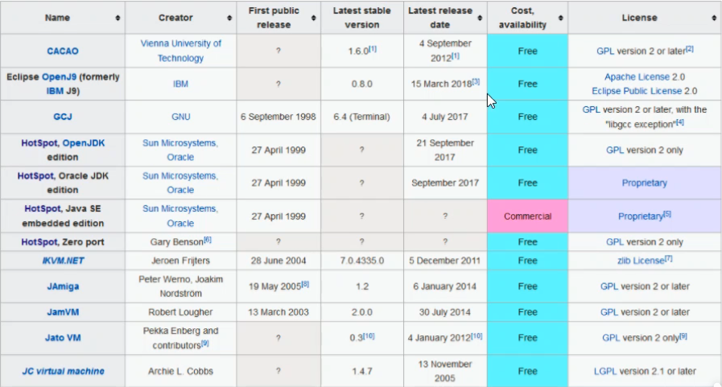
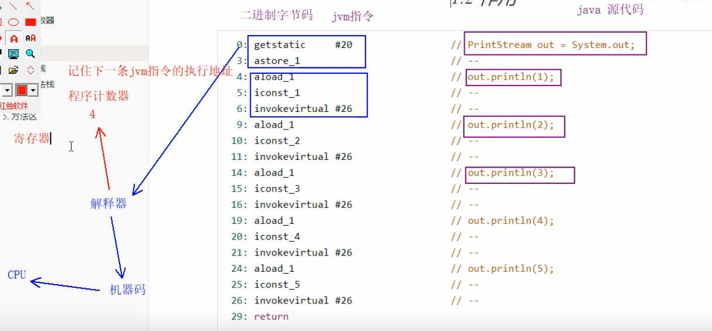
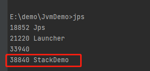
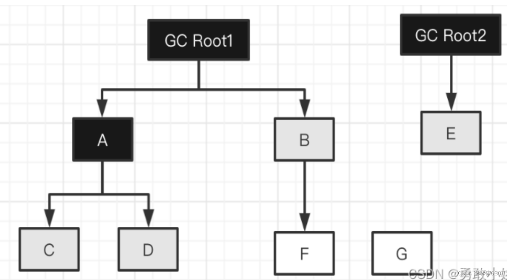

# 一、JVM绪论

## 1、什么是JVM

- 定义：Java Virtual Machine，**Java程序的运行环境**（Java二进制字节码的运行环境）
- 好处
  - **一次编写，到处运行**
    - Java是跨平台的，即可以在win、mac或linux等上运行
    - 原因：JVM屏蔽了字节码和底层操作系统之间的差异，对外提供了一致的运行环境，JVM就可以用这种解释的方法执行二进制字节码，从而达到这种代码的平台无关性
  - **自动内存管理，垃圾回收功能**
  - **数组下标越界检查**
    - 之前的C语言等都是没有这个的，只能通过程序员手动检查，当数组下标越界后，可能会覆盖其他地方的内存数据
  - **多态**
- 比较
  - JVM：Java程序的运行环境，它屏蔽了操作系统和Java代码之间的差异
  - JRE：运行Java程序所必须环境的集合，包含JVM标准实现及 Java核心类库
  - JDK：提供了Java的开发环境(提供了编译器javac等工具，用于将Java文件编译为class文件)和运行环境(提 供了JVM和Runtime辅助包，用于解析class文件使其得到运行)


## 2、JVM用处

- 理解底层的实现原理
- 利用JVM可以快速定位到项目出错的地方以便排查问题
  - 比如：内存溢出、响应时间缓慢


## 3、常见的JVM

- JVM是一套规范，只要遵从这套规范，都可以称之为JVM，甚至自己开发一套JVM




## 4、JVM基本组成


- 编写好的Java源码都是通过类加载器（ClassLoader）编译为二进制字节码进入JVM中
- JVM内存结构
  - 类放方法区
  - 类创建的实例对象放堆里
  - 实例对象调用方法又会用到虚拟机栈、程序计数器、本地方法栈
- 执行引擎
  - 方法执行时每行代码都是通过解释器逐行执行的
  - 热点代码，即频繁执行调用的代码通过即时编译器执行的
  - 垃圾回收会对堆里面不常使用的对象进行回收
- 本地方法接口
  - 还会有一些Java代码不方便实现的功能，必须调用底层操作系统的功能，需要跟操作系统中的一些功能打交道，此时就需要用到本地方法接口来调用操作系统中的一些接口


# 二、内存结构

## 1、程序计数器（线程私有）

- 名称：Program Counter Register程序计数器（寄存器：读取速度最快的一个单元）
- 作用：**记住下一条jvm指令的执行地址**
- 特点：
  - **线程私有**：每个线程有自己的程序计数器，如果时间片切换，本线程的程序计数器依然记录的是本线程的下一条指令地址，切换回来后就从下一条开始执行
  - **不会存在内存溢出**




## 2、虚拟机栈（线程私有）

### 2.1 基本概念

- 名字：Java Virtual Machine Stacks（Java虚拟机栈）
- 每个线程运行时所需要的内存，称为虚拟机栈
- 每个栈由多个栈帧（Frame）组成，对应着每次方法调用时所占用的内存
- **每个线程只能有一个活动栈帧，对应着当前正在执行的那个方法**
- 可以通过**-Xss256k**设置栈内存大小


### 2.2 问题辨析

- 垃圾回收是否涉及到栈内存
  - 不会。因为栈帧是在每个方法被调用的时候分配出来的，当这个方法调用结束后，这个栈帧就会自动的被释放掉，所以不需要垃圾回收来处理
- 栈内存分配越大越好吗
  - 不会。因为物理内存是有限的，所以当增大了栈内存，就意味着线程数量的减少。而栈内存的增大，只是能够支持更多次的递归调用，并且存活的栈帧始终只有一个，故而并不能提升效率。**系统默认一般是1024kb**
- 方法内的局部变量是否线程安全
  - **如果方法内局部变量没有逃离方法的作用范围，那么他就是线程安全的**
  - **如果是局部变量引用了对象，并逃离了方法的作用范围，就需要考虑线程安全**

```java
package com.lzy.demo;

/**
 * 方法内的局部变量是否是线程安全的
 */
public class Demo {
    
    public static void main(String[] args) {
		StringBuilder sb = new StringBuilder();
		sb.append(4);
		sb.append(5);
		sb.append(6);
         // 多线程会同时操作sb对象，所以m2是不安全的
         new Thread(() -> {
         	m2(sb);
         }).start();
    }
    
	
	// 此时变量只是方法内部的，所以是线程安全的
	public static void m1() {
		StringBuilder sb = new StringBuilder();
		sb.append(1);
		sb.append(2);
		sb.append(3);
		System.out.println(sb.toString());
	}
	
	// 此时变量作为方法入参，可能会被别的线程访问，所以可能是不安全的
	public static void m2(StringBuilder sb) {
		sb.append(1);
		sb.append(2);
		sb.append(3);
		System.out.println(sb.toString());
	}
	
	// 此时变量作为方法返回值，可能会被别的线程访问，所以可能是不安全的
	public static StringBuilder m3() {
		StringBuilder sb = new StringBuilder();
		sb.append(1);
		sb.append(2);
		sb.append(3);
		return sb;
	}
}
```


### 2.3 栈内存溢出

- 什么时候会导致栈内存溢出？

  - **栈帧过多导致栈内存溢出**：比如频繁的递归调用方法创建栈帧，然后压入到栈中，但是没有一个合理的结束调用方法，就会导致栈帧积压，栈内存溢出
  - **栈帧过大导致栈内存溢出**：调用的方法创建的栈帧太大，直接导致栈内存溢出


#### 2.3.1 栈内存溢出1

```java
package com.lzy.demo;

/**
 * 栈内存溢出1
 */
public class StackDemo {

    private static int count;

    public static void main(String[] args) {
        try {
            method();
        } catch (Throwable e) {
            e.printStackTrace();
            System.out.println(count);
        }
    }

    // 频繁的递归调用，但是不设置正确的方法结束，最终会导致栈内存溢出
    private static void method() {
        count++;
        method();
    }
}

// java.lang.StackOverflowError：栈内存溢出错误
// 最终方法递归调用22582次
```

- 在IDEA中设置栈内存大小


- 设置之后在运行上面代码：3191——表示方法调用了3191次

#### 2.3.2 栈内存溢出2

```java
package com.lzy.demo;

import java.util.Arrays;
import java.util.List;

/**
 * 栈内存溢出2
 */
public class StackDemo {

    public static void main(String[] args) throws JsonProcessingException {
        Dept dept = new Dept();
        dept.setName("Market");

        Emp emp1 = new Emp();
        emp1.setName("张三");
        emp1.setDept(dept);

        Emp emp2 = new Emp();
        emp1.setName("李四");
        emp1.setDept(dept);

        dept.setEmps(Arrays.asList(emp1, emp2));

        // {name: "Market", emps: [{name: "张三", dept: {name: "", emps: [{..., ...}]}},{name: "李四", dept: {name: "", emps:}}]}
        // 相当于一个对象的无限递归，循环引用，所以会造成栈内存溢出
        ObjectMapper objectMapper = new ObjectMapper();
        System.out.println(objectMapper.writeValueAsString(dept));
    }

}

class Emp{
    private String name;
    // 解决方案：在dept上面加一个注解：@JsonIgnore
    // 作用：转换Emp对象，如果遇到Dept，就不对其进行转换，自动忽略
    // 结果：{name: "Market", emps: [{name: "张三"},{name: "李四"}]}
    private Dept dept;

    public String getName() {
        return name;
    }

    public void setName(String name) {
        this.name = name;
    }

    public Dept getDept() {
        return dept;
    }

    public void setDept(Dept dept) {
        this.dept = dept;
    }
}

class Dept {
    private String name;
    private List<Emp> emps;

    public String getName() {
        return name;
    }

    public void setName(String name) {
        this.name = name;
    }

    public List<Emp> getEmps() {
        return emps;
    }

    public void setEmps(List<Emp> emps) {
        this.emps = emps;
    }
}
```


### 2.4 线程运行诊断

- 案例1：CPU占用过多（原因：第八行代码是个死循环）

```bash
# nohup：后台运行java代码
nohup java cn.itcast.jvm.t1.Demo1_16 &
# top：查看进程资源占用情况
top
# ps：查看进程信息，H：打印进程的所有线程，eo：输出哪些感兴趣的东西，比如pid、tid啥的+
ps H -eo pid,tid,%cpu | grep 进程id #（用ps命令进一步定位是哪个线程引起的CPU占用过高）
# 查看进程下的所有线程信息，然后找到刚刚的线程进行16进制转化，然后找到指定的地方排查问题
jstack 线程id
# 可以根据线程id找到有问题的线程，进一步定位到问题代码的源码行号
```


```java
// 第八行代码
while(true) {
    
}
// 会无限死循环，所以资源会一直占用，导致cpu无法释放
```

- 案例2：程序运行很长时间没有结果

```java
public class Demo {
	static A a = new A();
	static B b = new B();
    
    public static void main(String[] args) throws InterruptedException {
        new Thread(() -> {
            synchronized(a) {
                try {
                    Thread.sleep(2000);
                } catch (InterruptedException e) {
                    e.printStackTrace();
                }
                synchronized(b) { 
                	sout("获得了a和b");					// a里面锁住了b
                }
            }
        }).start();
        
        Thread.sleep(2000);
        
        new Thread(() -> {
            synchronized(b) {
                synchronized(a) { 
                	sout("获得了a和b");					// b里面锁住了a
                }
            }
        }).start();
    }
}
```

jstack输出，排除出死锁


## 3、本地方法栈

- **Java虚拟机调用一些本地方法时，需要给这些本地方法提供的内存空间**

- 本地方法（**Native Method**）：不是由Java代码编写的方法。因为Java语言有时候不能直接跟操作系统底层打交道，所以就需要用一些C/C++编写的本地方法，通过这些本地方法来与操作系统的底层API交互

  - 例子：Object下的clone()方法
  - 声明是通过native，没有具体方法实现，都是通过底层C/C++写的

  

## 4、堆

### 4.1 定义

- 通过new关键字创建的对象都会使用堆内存
- 特点
  - **线程共享**，堆中对象都需要考虑线程安全的问题
  - 有垃圾回收机制

### 4.2 堆内存溢出

- 更改堆内存大小：**-Xmx8m**，默认4g

```java
package com.example.heap;

import java.util.ArrayList;
import java.util.List;

/**
 * 演示堆内存溢出:java.lang.OutOfMemoryError: Java heap space
 * 更改堆内存大小：-Xmx8m
 */
public class Demo1 {

    public static void main(String[] args) {
        int i = 0;
        try {
            List<String> list = new ArrayList<>();
            String a = "hello";
            while (true) {
                list.add(a);	// hello、hellohello、hellohellohellohello....
                a = a + a;
                i++;
            }
        } catch(Throwable e) {
            e.printStackTrace();
            System.out.println(i);
        }
    }

}
// 因为a每拼接一次，都会产生一个新的对象放入list中，而list是new出来的，放到堆中，不断有字符串放入里面但是list的作用域一直到catch前，所以会导致list的内存不断变大，最终超出范围
// 用-Xmx8m改堆内存大小，没改之前默认是4g，所以打印出来是26，改成8m之后，打印17
```


### 4.3 堆内存诊断

- jps工具
  - 查看当前系统中有哪些java进程
- jmap工具
  - 查看堆内存占用情况
- jconsole工具
  - 图形界面的，多功能的监测工具，可以连续监测

#### 4.3.1 jps和jmap使用

```java
package com.example.heap;

/**
 * 演示堆内存
 */
public class Demo2 {

    public static void main(String[] args) throws InterruptedException {
        System.out.println("1...");
        Thread.sleep(30000);
        byte[] array = new byte[1024 * 1024 * 10];      // 分配10MB的内存空间
        System.out.println("2...");
        Thread.sleep(30000);
        array = null;                                   // 将引用置为空，证明其可以被垃圾回收了
        System.gc();                                    // 调用垃圾回收
        System.out.println("3...");
        Thread.sleep(1000000L);
    }

}
```

- 查看当前系统中有哪些java进程



- jmap -heap 进程号：查看进程信息

  - 第一次使用jmap，这时候是堆初始化的时候

  

  - 第二次使用jmap，这时候给堆分配了10MB的内存，所以多加了8MB的内存

  

  - 第三次使用，这时候调用了垃圾回收，把可以回收的内存全部回收，内存释放，所以少点

  

#### 4.3.2 jconsole的使用

- 在命令行中输入jconsole命令


- 出现图形化连接配置界面


- 配置好配置信息后，进入图形化界面查看堆内存信息


#### 4.3.3 jvisualvm使用

```java
package com.example.heap;

import java.util.ArrayList;
import java.util.List;

/**
 * 演示查看对象个数
 */
public class Demo3 {

    public static void main(String[] args) throws InterruptedException {
        List<Student> students = new ArrayList<>();
        for(int i = 0; i < 200; i++) {
            Student student = new Student(); // 给students数组添加200个大小为1MB的student对象
            students.add(student);
        }
        Thread.sleep(1000000000L);
    }
}

class Student{
    private byte[] big = new byte[1024 * 1024];     // 1MB内存
}
```

- 启动程序的时候，在命令行中输入jvisualvm


- 进入图形化界面，找到对应的程序，监视页面的堆Dump


- 查找前20个内存最大的对象


- 查看得出最大的是list


- 点进去发现，是由200个student对象在list里面，而且作用域一直在，所以未能释放，故而导致堆内存一直得不到释放


## 5、方法区

### 5.1 定义

- 方法区概述
  - 方法区是所有Java虚拟机线程共享的区域
  - **存储了跟类的结构相关的信息**，比如：运行时常量池、成员变量、方法数据、成员方法和构造器方法的代码部分，包括一些特殊方法（类的构造器）
  - **方法区在虚拟机启动时被创建**
  - **逻辑上是堆的一个组成部分**，具体实现要看Jvm厂商的方式，这个规范并不强制他的实现位置
    - 比如Oracle的HotSpot虚拟机
    - 1.8以前：方法区实现是通过永久代，这个永久代就是使用堆内存的一部分作为方法区
    - 1.8以后：废弃永久代的实现方式，转而用元空间实现，元空间使用的不是堆的内存，而是本地内存，即操作系统的内存
  - 方法区如果在申请内存的时候发现不足时，也会让虚拟机抛异常OutOfMemoryError


### 5.2 方法区内存溢出

#### 5.2.1 演示元空间内存溢出

- 通过ClassWriter动态创建类
- **-XX:MaxMetaspaceSize=8m**：修改元空间内存大小，因为元空间使用的是本地内存，即操作系统的内存，默认16g，很大，所以要看代码效果，必须开始将元空间的内存设置小点

```java
package com.example.heap;

import jdk.internal.org.objectweb.asm.ClassWriter;
import jdk.internal.org.objectweb.asm.Opcodes;

/**
 * 演示元空间内存溢出
 * -XX:MaxMetaspaceSize=8m
 */
public class Demo4 extends ClassLoader{     // 可以用来加载类的二进制字节码

    public static void main(String[] args) {
        int j = 0;
        try {
            Demo4 test = new Demo4();
            for (int i = 0; i < 10000; i++,j++) {
                // ClassWriter作用：生成类的二进制字节码
                ClassWriter cw = new ClassWriter(0);
                // 版本号：1.8   访问权限：public   类名：Class1...  包名    继承的父类   实现的接口
                cw.visit(Opcodes.V1_8, Opcodes.ACC_PUBLIC, "Class" + i, null, "java/lang/Object", null);
                // 返回类的二进制字节码
                byte[] code = cw.toByteArray();
                // 执行了类的加载: 类名、类的二进制字节码数组、数组起始索引、数组结束索引
                test.defineClass("Class" + i, code, 0, code.length);
            }
        } finally {
            System.out.println(j);
        }
    }

}
```

- 内存溢出时会报错：**java.lang.OutOfMemoryError**: Metaspace

#### 5.2.2  演示永久代内存溢出

- 1.8以前的是用永久代
- **-XX:MaxPermSize=8m**：设置永久代大小
- 内存溢出报错：java.lang.OutOfMemoryError: PermGen space

### 5.3 常量池

```java
package com.example.heap;

/**
 * 二进制字节码（类基本信息，常量池，类方法定义：包含了虚拟机指令）
 */
public class Demo5 {
    public static void main(String[] args) {
        System.out.println("hello world");
    }
}
```

- 打开命令行，进入target下的编译包，输入命令：javap -v Demo5.class，反编译代码


- 第一部分：类的基本信息，比如方法public啥的


- 第二部分：常量池


- 第三部分：类的方法定义，包含了虚拟机指令


- 主方法里面的指令解读
  - 第一步：#2，去对应的常量池中找到#2，然后顺着引用往下找#21、#22等，就是System.out.println
  - 第二部：#3，去对应的常量池中找到#3，然后顺着引用往下找#23，就是hello world


### 5.4 运行时常量池

- **常量池**：就是一张表，虚拟机指令根据这张常量表找到要执行的类名、方法名、参数类型、字面量等信息
- **运行时常量池**：常量池是*.class文件中的，当该类被加载，它的常量池信息就会放入运行时常量池，并把里面的符号地址变为真实地址
- **StringTable（字符串常量池）**：
  - 字面量方式创建的字符串，会放入 StringTable 中，**StringTable 管理的字符串，才具有不重复的特性**
    - **字面量：  就是来直接给值，不声明自变量储存。**
      - 例1：int a = 0;a = a + 3; a 是变量，3是字面量 
      - 例2：String s = "字符串"; s 是变量，System.out.println("这是一个字符串字面量");
  - 而 char[]，byte[]，int[]，String，以及 + 方式本质上都是使用 new 来创建，它们都是在堆中创建新的字符串对象，不会考虑字符串重不重复，这种字符串的缺点就是如果存在大量值相同的字符串，对内存占用非常严重


#### 5.4.1 StringTable(串池)案例1

- s3 == s4打印false的原因
  - 因为s3执行完之后，ab已经变成了String对象已经放入到了串池中
  - 执行到s4时，s1和s2拼接实际上是通过new了一个StringBuilder对象，然后把a和b拼接起来变为ab，然后再执行toString()方法，而toString()方法实际上就是new String()方法，重新new了一个String对象，所以他在堆中
  - 故而两个对象的引用不是同一个
- s3 == s5打印true的原因
  - 因为此时s5的拼接是常量拼接，所以他在编译期间被优化过，这个值就是固定的不会变，就是ab，所以运行到这一行的时候，会去串池中找ab，有就不用创建新的，所以二者引用是一个

```java
package com.example.heap;

// StringTable: ["a", "b", "ab"] hashtable结构，不能扩容
public class Demo6 {
    public static void main(String[] args) {
        // 常量池中的信息，都会被加载到运行时常量池中，这时a、b、ab都是常量池中的符号，还没变成java的字符串对象放入串池中
        // 注意是延时加载，懒惰的，执行到哪一步才会把其放入串池
        String s1 = "a";            // 代码执行到这一步，Idc #2：会把a符号变成"a"字符串对象
        String s2 = "b";            // 代码执行到这一步，Idc #3：会把b符号变成"b"字符串对象
        String s3 = "ab";           // 代码执行到这一步，Idc #4：会把ab符号变成"ab"字符串对象

        String s4 = s1 + s2;
        // 第一步：new StringBuilder().append("a").append("b").toString()
        // 第二步：new String("ab")
        System.out.println(s3 == s4);
        // 打印：false
        
        String s5 = "a" + "b";
        // 因为此时s5的拼接是常量拼接，所以他在编译期间被优化过，这个值就是固定的不会变，就是ab，所以运行到这一行的时候，会去串池中找ab，有就不用创建新的，所以二者引用是一个
        System.out.println(s3 == s5);
        // 打印：true
    }
}
```


#### 5.4.2 StringTable(串池)案例2

- 字符串是延迟加载的
- 执行一行，哪一行的准备实例化成对象放入串池
- 且串池中是唯一的，如果有就直接引用，不新建了

```java
package com.example.heap;

/**
 * 延迟实例化证明
 */
public class Demo7 {
    public static void main(String[] args) {
        int x = args.length;

        System.out.println("1");    // 字符串个数：2142
        System.out.println("2");
        System.out.println("3");
        System.out.println("4");
        System.out.println("5");
        System.out.println("6");
        System.out.println("7");
        System.out.println("8");
        System.out.println("9");
        System.out.println("0");

        System.out.println("1");     // 字符串个数：2152
        System.out.println("2");
        System.out.println("3");
        System.out.println("4");
        System.out.println("5");
        System.out.println("6");
        System.out.println("7");
        System.out.println("8");
        System.out.println("9");
        System.out.println("0");

        System.out.println(x);      // 字符串个数：2152
    }
}
```


#### 5.4.3 StringTable(串池)特性

- **常量池中的字符串仅是符号，第一次用到时才会变为对象**
- 利用串池的机制，来避免重复创建字符串对象
- 字符串变量拼接的原理是StringBulider（1.8）
- 字符串常量拼接的原理是编译期优化
- 可以使用intern方法，主动将串池重还没有的字符串对象放入串池
  - JDK1.8将这个字符串对象尝试放入串池，如果有则并不会放入，如果没有则放入串池，会把串池中的对象返回
  - JDK1.6将这个字符串对象尝试放入串池，如果有则并不会放入，如果没有会把此对象复制一份放入串池，然后把串池中的对象返回
- JDK1.8例子1

```java
package com.example.heap;

public class Demo8 {
    // StringTable: ["a","b"]
    // 堆：new String("a")  new String("b")  new String("ab")
    public static void main(String[] args) {
        String s = new String("a") + new String("b");
        // new StringBuilder().append("a").append("b").toString()，即new String("ab")
        // 上一行代码执行，会产生5个对象，串池中2个：a,b；堆中a，b，ab
        String s1 = s.intern();     // 将这个字符串对象尝试放入串池中，如果有则不放人，没有则放入，并把串池中的对象返回。 即：把ab放入到串池中，然后串池中ab的地址给s1
        System.out.println(s1 == "ab"); // true，s1指向的串池中ab，而ab也是先从串池中找，有则不用创建新的，所以二者是同一个
        System.out.println(s == "ab");  // true，s这个字符串对象放入了串池中，所以指向的也是串池中的ab，二者是同一个
    }
}
```

- JDK1.8例子2

```java
package com.example.heap;

public class Demo9 {
    // StringTable： ["ab","a","b"]
    public static void main(String[] args) {
        String x = "ab";
        String s = new String("a") + new String("b");
        // new StringBuilder().append("a").append("b").toString()，即new String("ab")
        // 上一行代码执行后，共计6个对象，串池中3个：a,b，ab；堆中a，b，ab
        String s1 = s.intern();     // 将这个字符串对象尝试放入串池中，如果有则不放人，没有则放入，并把串池中的对象返回
        System.out.println(s1 == x); // true，s1指向的串池中ab，而ab也是先从串池中找，有则不用创建新的，所以二者是同一个
        System.out.println(s == x);  // false，尝试把ab放入串池中，但是ab有，所以s还是指向堆中的，故而fasle
    }
}
```

- JDK1.6例子1

```java
package com.example.heap;

public class Demo10 {
    // StringTable: ["a","b"]
    public static void main(String[] args) {
        String s = new String("a") + new String("b");
        // new StringBuilder().append("a").append("b").toString()，即new String("ab")
        // 上一行代码执行，会产生5个对象，串池中2个：a,b；堆中a，b，ab
        String s1 = s.intern();     // 将这个字符串对象尝试放入串池中，如果有则并不会放入，如果没有会把此对象复制一份放入串池，然后把串池中的对象返回，即s还是堆中的，而s1是串池中的
        System.out.println(s1 == "ab"); // true，s1指向的串池中ab，而ab也是先从串池中找，有则不用创建新的，所以二者是同一个
        System.out.println(s == "ab");  // false，s这个字符串对象还在堆中，所以二者不是同一个
    }
}
```

- JDK1.6例子2

```java
package com.example.heap;

public class Demo11 {
    // StringTable： ["ab","a","b"]
    public static void main(String[] args) {
        String x = "ab";
        String s = new String("a") + new String("b");
        // new StringBuilder().append("a").append("b").toString()，即new String("ab")
        // 上一行代码执行后，共计6个对象，串池中3个：a,b，ab；堆中a，b，ab
        String s1 = s.intern();     // 将这个字符串对象尝试放入串池中，如果有则并不会放入，如果没有会把此对象复制一份放入串池，然后把串池中的对象返回，即s和s1都是串池中的
        System.out.println(s1 == x); // true，s1指向的串池中ab，而ab也是先从串池中找，有则不用创建新的，所以二者是同一个
        System.out.println(s == x);  // fasle，尝试把ab放入串池中，但是ab有，所以s还是指向堆中的，故而fasle
    }
}
```


#### 5.4.4 StringTable(串池)面试题

- Jdk1.8面试题1

```java
package com.example.heap;

public class Demo10 {
    // StringTable: ["a","b","ab"]
    // 堆：["ab"]
    public static void main(String[] args) {
        String s1 = "a";                    // 串池：a
        String s2 = "b";                    // 串池：b
        String s3 = "a" + "b";              // 串池：ab
        String s4 = s1 + s2;                // 堆：ab
        String s5 = "ab";                   // 串池：ab
        String s6 = s4.intern();            // s4尝试放入串池，但是有了就不放，还是堆中；s6串池

        System.out.println(s3 == s4);       // false
        System.out.println(s3 == s5);       // true
        System.out.println(s3 == s6);       // true

        String x2 = new String("c") + new String("d");    // 堆：cd
        // StringTable：["c","d"]   堆：["c","d","cd"]
        String x1 = "cd";       // 串池：cd
        x2.intern();            // x2尝试放入串池，但是有cd，所以还是在堆中

        System.out.println(x1 == x2);       // false
    }

}
```

- Jdk1.8面试题2

```java
package com.example.heap;

public class Demo10 {
    public static void main(String[] args) {
        String x2 = new String("c") + new String("d");    // 堆：cd
        // StringTable：["c","d"]   堆：["c","d","cd"]
        x2.intern();            // x2尝试放入串池，这次没有，所以x2放入串池中
        String x1 = "cd";       // 串池：cd
       
        System.out.println(x1 == x2);       // true
    }

}
```

- Jdk1.6面试题1

```java
package com.example.heap;

public class Demo10 {
    public static void main(String[] args) {
        String x2 = new String("c") + new String("d");    // 堆：cd
        // StringTable：["c","d"]   堆：["c","d","cd"]
        String x1 = "cd";       // 串池：cd
        x2.intern();            // x2复制一份尝试放入串池，但是有cd，所以还是在堆中
       
        System.out.println(x1 == x2);       // false
    }

}
```

- Jdk1.6面试题2

```java
package com.example.heap;

public class Demo10 {
    public static void main(String[] args) {
        String x2 = new String("c") + new String("d");    // 堆：cd
        // StringTable：["c","d"]   堆：["c","d","cd"]
        x2.intern();         // x2复制一份尝试放入串池，这次没cd，所以复制一份放进去，但是它还是在堆中
        String x1 = "cd";       // 串池：cd
       
        System.out.println(x1 == x2);       // false
    }

}
```


#### 5.4.5 StringTable位置

- StringTable存放位置
  - 1.6中，StringTable是常量池的一部分，随着常量池存放在永久代中
  - 1.7和1.8以后，就放到了堆里
- 理由：
  - 永久代的回收效率很低，**永久代需要父GC的时候才会触发永久代的垃圾回收**，而父GC又是会等到老年代的空间不足时才会触发，触发时机晚，从而间接导致StringTable回收效率不高
  - StringTable里面存放的是大量的字符串常量，如果它的回收效率不高，可能会导致内存溢出


- 例子
  - jdk1.8下的报错：java.lang.OutOfMemoryError: Java heap space（堆空间溢出）
  - jdk1.6下的报错：java.lang.OutOfMemoryError: PermGen space（永久代空间溢出）

```java
package com.example.heap;

import java.util.ArrayList;
import java.util.List;

/**
 * 演示StringTable位置
 * 在jdk1.8下设置：-Xmx10m -XX:-UseGCOverheadLimit
 *      -Xmx10 设置堆的大小为10m
 *      -XX:-UseGCOverheadLimit   JVM的垃圾回收规则的开关
 *            -XX:+UseGCOverheadLimit +就是打开开关
 *            -XX:-UseGCOverheadLimit -就是关闭开关
 *            什么时候会出现OutOfMemoryError：如果98%的时间花在了垃圾回收且只释放了2%的堆内存，此时就不会尝试再垃圾回收了，就会报错GC overhead limit exceeded，而不是Java heap space，默认打开
 * 在jdk1.6下设置：-XX:MaxPermSize=10m
 *     -XX:MaxPermSize=10m   永久代的空间设置为10m
 */
public class Demo11 {

    public static void main(String[] args) {
        List<String> list = new ArrayList<>();
        int i = 0;
         try {
             for(int j = 0; j < 260000; j++) {
                 list.add(String.valueOf(j).intern());
                 i++;
             }
         } catch (Throwable e) {
             e.printStackTrace();
         } finally {
             System.out.println(i);
         }
    }
}

```


#### 5.4.6 StringTable垃圾回收

- StringTable也会受到垃圾回收机制的管理，当内存空间不足时，StringTable中那些未被引用的字符串常量就会被垃圾回收

```java

package com.example.heap;

/**
 * 演示StringTable垃圾回收
 * -Xmx10m -XX:+PrintStringTableStatistics -XX:+PrintGCDetails -verbose:gc
 * -Xmx10m  设置堆的大小为10m
 * -XX:+PrintStringTableStatistics   打印字符串表的统计信息，通过它可以清楚看到串池中字符串常量的个数，包括一些占用大小的信息
 * -XX:+PrintGCDetails -verbose:gc   打印垃圾回收的一些信息，比如垃圾回收的次数和时间
 */
public class Demo12 {

    public static void main(String[] args) {
        int i = 0;
        try {
            for(int j = 0; j < 10000; j++) {
                String.valueOf(j).intern();
                i++;
            }
        } catch (Throwable e) {
            e.printStackTrace();
        } finally {
            System.out.println(i);
        }
    }
}
```

- 信息解读

  - 垃圾回收信息（-XX:+PrintGCDetails -verbose:gc  这个指令加上后就会打印）

  

  - 符号表：存放一些类的方法名、变量名啥的

  

  - StringTable表

  


#### 5.4.7 StringTable性能调优1

- 原理：StringTable是以hash表实现的，底层是数组+链表的方式，每个数组即为一个存储桶，当存储桶数量变大时，分给每个存储桶的字符串常量就变少了，从而发生冲突的概率就会变小，效率就大大提高
- **-XX:StringTableSize=20000**  设置StringTable的存储桶个数
- 例子

```java
package com.example.heap;

import java.io.*;

/**
 * StringTable调优
 * -XX:StringTableSize=20000  设置StringTable的存储桶个数
 * 读取linux.words文件中的单词数，然后将其每行入池，查看其所花费时间
 */
public class Demo13 {
    public static void main(String[] args) throws IOException {
        try(BufferedReader reader = new BufferedReader(new InputStreamReader(new FileInputStream("linux.words"),"utf-8"))) {
            String line = null;
            long start = System.nanoTime();     // 获取当前时间纳秒
            while(true) {
                line = reader.readLine();
                if(line == null) {
                    break;
                }
                line.intern();
            }
            System.out.println("cost:" + (System.nanoTime() - start) / 1000000);
        }
    }
}
// 设置成200w的时候只需0.4s
// 设置1009的时候很久
```


#### 5.4.8 StringTable性能调优2

- 考虑是否将字符串常量进行入池
- 例子：比如将刚刚的那个文件中48个单词循环10次放入list中，如果不入池的话，那么每个单词都会循环10次放入，但是如果进行入池操作后，StringTable每个单词只会存储一份，大大降低堆内存使用

```java
package com.example.heap;

import java.io.*;

/**
 * StringTable调优
 * -XX:StringTableSize=20000  设置StringTable的存储桶个数
 * 读取linux.words文件中的单词数，然后将其每行入池，查看其所花费时间
 */
public class Demo13 {
    public static void main(String[] args) throws IOException {
        List<String> list = new ArrayList<>();
        for(int i = 0; i < 10; i++) {
            try(BufferedReader reader = new BufferedReader(new InputStreamReader(new FileInputStream("linux.words"),"utf-8"))) {
                String line = null;
                long start = System.nanoTime();     // 获取当前时间纳秒
                while(true) {
                    line = reader.readLine();
                    if(line == null) {
                        break;
                    }
                    // list.add(line);				// 不入池
                    // 入池操作如下
                    list.add(line.intern());	
                }
                System.out.println("cost:" + (System.nanoTime() - start) / 1000000);
            }
        }
    }
}
```


## 6、直接内存

### 6.1 直接内存

- 它不是Java虚拟机内存，而是系统内存
- **常见于NIO操作，用于数据缓冲区**
- **分配回收成本较高，但读写性能高**
- **不受JVM内存回收管理**
- 例子：直接内存读取只需0.4s，传统io方式需要1s

```java
package com.example.heap;

import java.io.FileI  nputStream;
import java.io.FileOutputStream;
import java.io.IOException;
import java.nio.ByteBuffer;
import java.nio.channels.FileChannel;

/**
 * 演示ByteBuffer作用
 */
public class Demo14 {

    static final String FROM = "D://百度网盘//Java进阶训练营(www.dmzshequ.com)//第10周.zip";
    static final String TO = "D://a.zip";
    static final int _1MB = 1024 * 1024;

    public static void main(String[] args) throws IOException {
        io();                   // 传统IO方式
        directBuffer();         // 直接内存方式
    }

    /**
     * 直接内存方式
     */
    private static void directBuffer() throws IOException {
        long start = System.nanoTime();
        try(FileChannel from = new FileInputStream(FROM).getChannel();
            FileChannel to = new FileOutputStream(TO).getChannel();
        ) {
            ByteBuffer byteBuffer = ByteBuffer.allocateDirect(_1MB);        // 开辟1MB的直接内存空间
            while(true) {
                int len = from.read(byteBuffer);
                if (len == -1) {
                    break;
                }
                byteBuffer.flip();
                to.write(byteBuffer);
                byteBuffer.clear();
            }
        } catch (IOException e) {
            e.printStackTrace();
        }
        long end = System.nanoTime();
        System.out.println("directBuffer共计花费时间：" + (end - start) / 1000_000.0);
    }


    /**
     * 传统IO方式
     */
    private static void io() throws IOException {
        long start = System.nanoTime();
        try(FileInputStream from = new FileInputStream(FROM);
            FileOutputStream to = new FileOutputStream(TO);
        ) {
           byte[] bytes = new byte[_1MB];
           while (true) {
               int len = from.read(bytes);
               if (len == -1) {
                   break;
               }
               to.write(bytes, 0 ,len);
           }

        } catch (IOException e) {
            e.printStackTrace();
        }
        long end = System.nanoTime();
        System.out.println("io共计花费时间：" + (end - start) / 1000_000.0);
    }

}
```


### 6.2 直接内存读取效率高原理

- 传统IO读取方式
  - 首先需要CPU改变为内核态
  - 然后这时候就可以调用本地方法，从磁盘中读取文件
  - 读取出来的文件会先存放在系统内存中开辟的一块系统缓存区
  - 然后在Java堆内存中也会开辟一块缓冲区，从系统缓存中读取并将其放到java缓冲区中
  - 这时候java代码才能真正读取到文件的内容


- directMemeory直接内存方式
  - 调用ByteBuffer.allocateDirect(_1MB)这个方法后，会在操作系统这边划出一块缓冲区
  - 这块缓冲区java代码可以直接访问
  - 所以这时候，两块地方都可以直接访问它，操作系统可以，java代码也可，故而就不用进行两次缓冲区的读取，效率大大提高


### 6.3 直接内存溢出

```java
package com.example.heap;

import java.nio.Buffer;
import java.nio.ByteBuffer;
import java.util.ArrayList;
import java.util.List;

/**
 * 直接内存溢出演示
 */
public class Demo15 {

    static int _100MB = 1024 * 1024 * 100; // 100mb

    public static void main(String[] args) {
        List<ByteBuffer> list = new ArrayList<>();
        int i = 0;
        try {
            while (true) {
                ByteBuffer byteBuffer = ByteBuffer.allocateDirect(_100MB);
                list.add(byteBuffer);
                i++;
            }
        } finally {
            System.out.println(i);
        }
    }
}
// 报错：java.lang.OutOfMemoryError: Direct buffer memory
```


### 6.4 直接内存释放原理

```java
package com.example.heap;

import java.io.IOException;
import java.nio.ByteBuffer;

/**
 * 直接内存释放
 */
public class Demo16 {

    static int _1GB = 1024 * 1024 * 1024;  // 1GB

    public static void main(String[] args) throws IOException {
        ByteBuffer byteBuffer = ByteBuffer.allocateDirect(_1GB);  // 分配1G的直接内存
        System.out.println("分配完毕！");
        System.in.read();           // 读取回车才会继续往下走
        System.out.println("开始释放！");
        byteBuffer = null;          // 将直接内存置为null
        System.in.read();           // 读取回车才会继续往下走
    }
}
```

- 运行程序之后，分配1个G的直接内存，Java虚拟机占用1个G


- 将byteBuffer置为空之后，直接内存释放，没了


#### 6.4.1 unsafe释放直接内存

- 直接内存释放是跟一个unsafe对象有关
- unsafe.allocateMemory分配直接内存
- unsafe.freeMemory(base)释放直接内存

```java
package com.example.heap;

import sun.misc.Unsafe;

import java.io.IOException;
import java.lang.reflect.Field;

/**
 * 直接内存释放是跟一个unsafe对象有关
 */
public class Demo17 {
    static int _1GB = 1024 * 1024 * 1024;

    public static void main(String[] args) throws IOException {
        Unsafe unsafe = getUnsafe();
        // 分配内存
        long base = unsafe.allocateMemory(_1GB);	// 分配的地址
        unsafe.setMemory(base, _1GB, (byte) 0);
        System.in.read();

        // 释放内存
        unsafe.freeMemory(base);
        System.in.read();
    }

    /**
     * 获取Unsafe对象
     * @return
     */
    public static Unsafe getUnsafe() {
        try {
            Field field = Unsafe.class.getDeclaredField("theUnsafe");
            field.setAccessible(true);
            Unsafe unsafe = (Unsafe)field.get(null);
            return unsafe;
        } catch (NoSuchFieldException | IllegalAccessException e) {
            throw new RuntimeException(e);
        }
    }
}
```


#### 6.4.2 ByteBuffer源码

- ByteBuffer.allocateDirect(capacity)

```java
public static ByteBuffer allocateDirect(int capacity) {
	return new DirectByteBuffer(capacity);
}
```

- new DirectByteBuffer(capacity)：构造方法
  - 构造方法直接会调用unsafe.allocateMemory(size)，然后分配内存
  - Cleaner是个虚引用对象，当它关联的对象如果被回收后，他就会触发Cleaner对象的clean方法
  - 然后有个回调方法new Deallocator(base, size, cap)

```java
DirectByteBuffer(int cap) {                   // package-private
	super(-1, 0, cap, cap);
	boolean pa = VM.isDirectMemoryPageAligned();
	long size = Math.max(1L, (long)cap + (pa ? ps : 0));
	Bits.reserveMemory(size, cap);

	long base = 0;
	try {
		base = unsafe.allocateMemory(size);
	} catch (OutOfMemoryError x) {
		Bits.unreserveMemory(size, cap);
		throw x;
	}
	unsafe.setMemory(base, size, (byte) 0);
	if (pa && (base % ps != 0)) {
		// Round up to page boundary
		address = base + ps - (base & (ps - 1));
	} else {
		address = base;
	}
	cleaner = Cleaner.create(this, new Deallocator(base, size, cap));
	att = null;
}
```

- Cleaner对象的clean方法，Cleaner是个虚引用对象，当它关联的对象如果被回收后它就会触发

```java
public void clean() {
	if (remove(this)) {
		try {
			this.thunk.run();
		} catch (final Throwable var2) {
			AccessController.doPrivileged(new PrivilegedAction<Void>() {
				public Void run() {
					if (System.err != null) {
						(new Error("Cleaner terminated abnormally", var2)).printStackTrace();
					}

					System.exit(1);
					return null;
				}
			});
		}
	}
}
```

- 回调方法中有个 unsafe.freeMemory(address)，最终还是会调用unsafe.freeMemory(address)

```java
private static class Deallocator
    implements Runnable
{

    private static Unsafe unsafe = Unsafe.getUnsafe();

    private long address;
    private long size;
    private int capacity;

    private Deallocator(long address, long size, int capacity) {
        assert (address != 0);
        this.address = address;
        this.size = size;
        this.capacity = capacity;
    }

    public void run() {
        if (address == 0) {
            // Paranoia
            return;
        }
        unsafe.freeMemory(address);
        address = 0;
        Bits.unreserveMemory(size, capacity);
    }

}
```


#### 6.4.3 总结

- 使用Unsage对象完成直接内存的分配回收，并且回收需要主动调用freeMemory方法
- ByteBuffer的实现类内部，使用了Cleaner（虚引用）来监测ByteBuffer对象，一旦ByteBuffer对象被垃圾回收，那么就会由ReferenceHandler线程通过Cleaner的clean方法调用freeMemory来释放直接内存
- **-XX:+DisableExplicitGC**  显示禁用GC垃圾回收，即代码层面的，**让System.gc()无效**
  - 用法：因为它回收不仅要回收新生代，也要回收老年代，所以会占用大量时间，故而有时候会使用这个命令禁用、
- 如果用了上述命令，那么就无法自动触发clean方法，那么就可以通过手动调用unsafe().freeMemory(base)方法来释放直接内存


```java
package com.juc;

import java.io.IOException;
import java.nio.ByteBuffer;

/**
 * 直接内存释放
 */
// -XX:+DisableExplicitGC
public class Test1 {

    static int _1GB = 1024 * 1024 * 1024;  // 1GB

    public static void main(String[] args) throws IOException {
        ByteBuffer byteBuffer = ByteBuffer.allocateDirect(_1GB);  // 分配1G的直接内存
        System.out.println("分配完毕！");
        System.in.read();           // 读取回车才会继续往下走
        System.out.println("开始释放！");
        byteBuffer = null;          // 将直接内存置为null
        System.gc();                // 显示的GC垃圾回收
        System.in.read();           // 读取回车才会继续往下走
    }
}
// -XX:+DisableExplicitGC加上这个参数之后，显示禁用GC垃圾回收，即代码层面的，让System.gc()无效
// 而Cleaner对象的clean方法，Cleaner是个虚引用对象，当它关联的对象如果被回收后它就会触发
// gc执行后，不会执行垃圾回收，所以就不会回收虚引用，那么就不会调用Cleaner对象的clean方法，即：直接内存的回收跟垃圾回收机制无关
```


# 三、垃圾回收

## 1、如何判断对象可以回收

### 1.1 引用计数法

- 一个对象被其他变量所引用，那么就让这个对象的计数+1，如果被引用了两次，就让其计数+2，依次类推
- 当其某一个变量不再引用它了，那么其计数-1，依次类推
- 当其计数为0时，就证明没有变量引用他了，那么它就可以作为一个垃圾被回收了
- 缺点：当两个循环循环引用时，即使他们没有被其他变量引用，也是无法被回收的


### 1.2 可达性分析算法

- Java虚拟机中的垃圾回收器采用可达性分析来探索所有存活的对象
- 扫描堆中的对象，看是否能够沿着GC Root对象（根对象）为起点的引用链找到该对象，找不到就表示可回收
- **GC root原理：通过对枚举GCroot对象做引用可达性分析，即从GC root对象开始，向下搜索，形成的路径称之为引用链。如果一个对象到GC roots对象没有任何引用，没有形成引用链，那么该对象等待GC回收**


- **Java中可以作为GC Roots的对象**
  - 当前正在被调用的方法里局部变量引用的对象，即**虚拟机栈的局部变量**表中引用的对象；
  - 方法区中**静态变量**引用的对象；
  - 方法区中**常量**引用的对象；
  - 本地方法栈中**Native方法引用的对象**
  - 这几个对象有个特点，分别在虚拟机栈，本地方法栈，方法区中，都没有在堆中，所以这些对象**可简单记为不在虚拟机堆中的对象**


- 根对象：
  - System Class：系统类：启动器加载类加载的类，即一些核心的类，运行期间肯定会用到的
  - Native Stack：操作系统的一些类，本地方法区的一些类
  - Thread：当前正在被调用的方法里局部变量引用的对象
  - Busy Monitor：被加锁的对象，即被synchronized加锁的对象，如果被回收了，那就没法解锁了


## 2、四种引用

- **强引用**：只有所有GC Roots对象都不通过【强引用】引用该对象，该对象才会被垃圾回收
- **软引用**（SoftReference）
  - 仅有软引用引用该对象时，在垃圾回收后，**内存仍不足时再次触发垃圾回收，才会回收该引用对象**
  - 可以配合引用队列来释放软引用自身：软引用对象本身也是对象，会占用一定的空间，当软引用引用的对象被清除释放后，软引用对象会进入到引用队列中，这时候就可以通过遍历引用队列来释放软引用对象的内存空间
- **弱引用**（WeakReference）
  - 仅有弱引用引用该对象时，在垃圾回收后，**无论内存是否充足，都会回收弱引用对象**
  - 可以配合引用队列来释放弱引用自身：弱引用对象本身也是对象，会占用一定的空间，当弱引用引用的对象被清除释放后，弱引用对象会进入到引用队列中，这时候就可以通过遍历引用队列来释放弱引用对象的内存空间
- **虚引用**（PhantomReference）
  - 必须配合引用队列使用，主要配合ByteBuffer使用，被引用对象回收时，会将虚引用入队，由Reference Handler线程调用虚引用相关方法释放直接内存
- **终结器引用**（FinalReference）
  - 无需手动编码，但其内部配合引用队列使用，在垃圾回收时，终结器引用入队（被引用对象暂时没有被回收），再由Finalizer线程通过终结器引用找到被引用对象并调用它的finalize方法释放内存，第二次GC才能回收被引用对象


### 2.1 强引用

- Java编程中经常new的一个对象就是强引用，例如Student stu = new Student("张三");中stu就是一个强引用。
- 强引用具有以下特点：
  - **被强引用关联的对象不会被垃圾回收器回收**。注意： 当JVM的内存空间不足时，宁愿抛出OutOfMemoryError异常使得程序止，也不愿意回收具有强引用对象来解决内存不足的问题！
  - 强引用可能会发生内存泄露


### 2.2 软引用

- 软引用的生命周期比强引用短，使用SoftReference类来创建软引用，具体方法如下。这里的sf才是软引用对象，而stu是sf软引用的对象。

~~~java
Student stu = new Student();
SoftReference<Student> sf = new SoftReference<Student>(stu);
stu = null;  // 使对象只被软引用关联
~~~

- 软引用的特点：
  - 如果一个对象只具备软引用，当JVM内存空间足够时，不会被回收；当JVM内存空间不足了，就会GC该对象
  - 软引用可用来实现内存敏感的高速缓存，例如图片缓存框架中缓存图片就是通过软引用的。
  - 软引用可以和一个引用队列（ReferenceQueue） 联合使用：如果软引用所关联的对象被垃圾回收器回收， JVM就会把这个软引用加入到与之关联的引用队列中。

~~~java
package com.example.jvm;

import java.io.IOException;
import java.lang.ref.SoftReference;
import java.util.ArrayList;
import java.util.List;

/**
 * -Xmx20m：设置堆大小20m
 * -XX:+PrintGCDetails -verbose:gc：打印GC详情信息
 */
public class Test1 {
    private static final int _4MB = 4 * 1024 * 1024;

    /**
	 * 强引用
	 */
    public static void main(String[] args) throws IOException {
//        List<byte[]> list = new ArrayList<>();
//        for (int i = 0 ; i < 5; i++) {
//            list.add(new byte[_4MB]);
//        }
//        System.in.read();
        soft();
    }

    /**
     * 软引用
     */
    public static void soft() {
        List<SoftReference<byte[]>> list = new ArrayList<>();
        for (int i = 0 ; i < 5; i++) {
            // 创建软引用对象
            SoftReference<byte[]> ref = new SoftReference<>(new byte[_4MB]);
            System.out.println(ref.get());
            list.add(ref);
            System.out.println(list.size());
        }
        System.out.println("循环结束：" + list.size());
        for (SoftReference<byte[]> ref : list) {
            System.out.println(ref.get());
        }
    }

}
~~~

- 如果用的是强引用，那么在大小为20m的堆就存不下这五次循环创建的强引用对象，而且只要被list强引用，那么垃圾回收就不会回收，最终就会报错：堆内存溢出
- 如果用的是软引用对象，在第四次垃圾回收的时候发现内存还是不足的时候，就会把软引用引用的对象内存给清除掉，所以list中前四次的软引用指向的对象都没了，即：null，只有最后一次的软引用对象信息才有指向地址


- 清除软引用对象本身


- **关联了引用队列，当软引用所关联的 byte[] 被回收时，这个无用的软引用自己会加入到 queue 中去，最终queue中的对象都是那些无用的软引用对象，可以直接移除掉**

~~~java
package com.example.jvm;

import java.io.IOException;
import java.lang.ref.Reference;
import java.lang.ref.ReferenceQueue;
import java.lang.ref.SoftReference;
import java.util.ArrayList;
import java.util.List;

/**
 * -Xmx20m：设置堆大小20m
 * -XX:+PrintGCDetails -verbose:gc：打印GC详情信息
 */
public class Test2 {
    private static final int _4MB = 4 * 1024 * 1024;

    public static void main(String[] args) throws IOException {
        List<SoftReference<byte[]>> list = new ArrayList<>();

        // 创建引用队列
        ReferenceQueue<byte[]> queue = new ReferenceQueue<>();
        for (int i = 0 ; i < 5; i++) {
            // 创建软引用对象，同时关联软引用队列，当软引用所关联的byte[]被回收时，软引用对象本身就会加入到queue中
            SoftReference<byte[]> ref = new SoftReference<>(new byte[_4MB], queue);
            System.out.println(ref.get());
            list.add(ref);
            System.out.println(list.size());
        }

        // poll：获取最先入队的那个软引用对象，并移除软引用对象
        Reference<? extends byte[]> poll = queue.poll();
        while (poll != null) {
            list.remove(poll);
            poll = queue.poll();
        }

        System.out.println("==================");
        for (SoftReference<byte[]> ref : list) {
            System.out.println(ref.get());
        }
    }

}

~~~


### 2.3 弱引用

- 弱引用的生命周期比软引用还要短，弱引用是通过`WeakReference`类实现的，`ThreadLocal`中的key就用到了弱引用
- 弱引用的具体实现如下：

~~~java
Object obj = new Object();
WeakReference<Object> wf = new WeakReference<Object>(obj);
obj = null;// 去除强引用
~~~

- 弱引用的特点：
  - 被弱引用关联的对象一定会被回收，也就是说**被弱引用关联的对象只能存活到下一次垃圾回收发生之前**。
  - 当垃圾收集器工作时，无论当前内存是否足够，都会**回收掉只被弱引用关联的对象**。
  - 弱引用**同样可以和一个引用队列（ReferenceQueue）联合使用**，也同样适用于内存敏感的缓存。如果弱引用所引用的对象被垃圾回收，Java虚拟机就会把这个弱引用加入到与之关联的引用队列中。同样也可以配合ReferenceQueue 使用
- **与软引用的区别：** 软引用关联的对象在内存空间不足够时才被回收，而弱引用关联的对象无论内存是否充足都会被回收。

~~~java
package com.example.jvm;

import java.io.IOException;
import java.lang.ref.WeakReference;
import java.util.ArrayList;
import java.util.List;

/**
 * -Xmx20m：设置堆大小20m
 * -XX:+PrintGCDetails -verbose:gc：打印GC详情信息
 */
public class Test3 {
    private static final int _4MB = 4 * 1024 * 1024;

    public static void main(String[] args) throws IOException {
        List<WeakReference<byte[]>> list = new ArrayList<>();

        for (int i = 0 ; i < 10; i++) {
            // 创建弱引用对象
            WeakReference<byte[]> ref = new WeakReference<>(new byte[_4MB]);
            list.add(ref);
            for (WeakReference<byte[]> weakReference : list) {
                System.out.print(weakReference.get() + " ");
            }
            System.out.println();
        }
        System.out.println("循环结束：" + list.size());
    }

}

~~~


- 前九次是内存不够时，就回收掉了上一个，好让后面的能够继续放入
- 第十次是因为弱引用对象本身也会有内存，所以都不够会发生过Full GC，就把所有的弱引用全回收了


### 2.4 虚引用

- 虚引用又称为**幽灵引用**或者**幻影引用**，使用 PhantomReference 来创建虚引用。具体示例如下：

~~~java
Object obj = new Object();
ReferenceQueue queue = new ReferenceQueue();
PhantomReference<Object> phantomObj = new PhantomReference<Object>(obj , queue);
obj = null； //去除强引用
~~~

- 虚引用的特点：
  - 虚引用关联的对象在**任何时候可能被GC回收**, 就像没有引用一样，因此可能发生内存泄露。
  - 一个对象是否有虚引用的存在，**不会对其生存时间造成影响**，也**无法通过虚引用得到一个对象**。
  - 为一个对象设置虚引用的唯一目的是**能在这个对象被回收时收到一个系统通知**。
  - 虚引用**必须和引用队列 （ReferenceQueue） 联合使用**。


- 虚引用与软引用和弱引用的一个区别在于： 当**垃圾回收器**准备回收一个对象时， 如果发现它**有虚引用**， 就会在回收对象的内存之前， **把这个虚引用加入到与之关联的引用队列中**。


### 2.5 终结器引用

- **终结器引用是一种弱引用（Weak Reference）**
-  在Java的垃圾回收（GC）机制中，**终结器引用（Finalizer Reference）**是一种特殊的引用关系。终结器引用用于与对象的终结器（Finalizer）方法相关联。终结器是一种特殊的方法，在对象被回收前，由GC调用以执行一些清理操作。
- 当一个对象被创建时，可以通过重写**finalize()**方法来定义一个终结器。当对象被GC判定为可回收时，它会被放置在一个待清理队列中，并在稍后的时间执行终结器方法。与这个对象相关联的终结器引用也会被加入到终结器引用队列中。
- 特点是在GC运行时，**无论内存是否充足，只要发现了对象的终结器引用，就会将其加入到终结器引用队列中。通过检测终结器引用队列，可以得知即将执行终结器方法的对象，并且允许用户在终结器方法中执行一些特定的清理操作，如关闭文件、释放资源等。**
- 然而，终结器引用的使用存在一些问题。首先，**终结器的执行时间是不确定的，可能会导致延迟对象的回收。**此外，由于终结器在单独的线程中执行，可能会引发竞争条件和不可预测的行为。因此，在Java 9及后续版本中，**推荐使用Cleaner类代替终结器**，以提供更可控和可靠的清理操作。
- **总结：终结器引用被GC检测到时，会将其加入终结器引用队列中，供用户在对象被回收前执行一些特定的清理操作**


## 3、回收算法

### 3.1 标记清除算法

- 标记清除算法（Mark-Sweep Algorithm）是一种常见的垃圾回收算法，用于自动管理动态分配的内存空间。其原理如下：
  - **标记阶段**（Mark）：从根对象开始，通过引用链追踪，标记所有的活动对象。标记过程中，将活动对象的标记位设置为有效状态，表示这些对象是可达的，不会被回收。
  - **清除阶段**（Sweep）：在标记阶段完成后，遍历整个内存空间，将未被标记的对象视为垃圾对象，将其所占用的内存空间释放，以便下次分配给新的对象使用。（**注意：清除的过程是把所占用的起止地址记录下来，并不会有清零操作，下次再用的时候看对象的大小超过了此碎片大小没，没超过就把对象赋值上去。所以这样可能会导致很多地址碎片产生**）
- 标记清除算法通过标记和清除的过程，将不再被使用的内存空间回收，以避免内存泄漏和内存碎片的问题。然而，标记清除算法也存在一些缺点，如清除阶段会产生内存碎片，可能会导致内存分配的效率降低
- 优点：不需要进行清除操作，只需要记录起止地址，所以**清除效率快**
- 缺点：会产生大量的地址碎片，其他对象也不够用，只能闲置


### 3.2 标记整理算法

- 其原理如下：
  - **标记阶段**：从根对象开始，通过引用链追踪，标记所有的活动对象。标记过程中，将活动对象的标记位设置为有效状态，表示这些对象是可达的，不会被回收。
  - **整理阶段**：先把垃圾进行回收清除，同时把可用对象往前移动，使内存更加紧凑
- 优点：不会出现内存碎片
- 缺点：整理需要对象的移动，会额外使用资源，导致效率低


### 3.3 复制算法

- 特点：需要两块地址空间，一块From区（待清除），一块to区（复制过去的区）
- 步骤：
  - 先扫描from区，区分可用对象和带回收对象并标记
  - 然后把可用对象按序移动到to区
  - 清除from区的内存
  - 将from区和to区调换位置
- 优点：不会出现地址碎片
- 缺点：**需要双倍的内存空间**


## 4、分代垃圾回收

### 4.1 结构

- 分为两块
  - 新生代：存放那些生命周期短的对象，Minor GC就会清理
    - **Eden区**：位于Java堆的新生代，是**新对象**分配内存的地方，由于堆是所有线程共享的，因此在堆上分配内存需要加锁
    - **Survival区**：在Java堆的年轻代。Survival区有两块，一块称为from区，另一块为to区，这两个区是相对的，在发生一次Minor GC后，from区就会和to区互换。在发生Minor GC时，Eden区和Survivalfrom区会把一些仍然存活的对象复制进Survival to区，并清除内存。Survival to区会把一些存活得足够旧的对象移至年老代。
  - 老年代：一般存放那种生命周期长的对象，只有Full GC才会对其进行清理
- 类比
  - 堆：居民楼
  - 新生代：楼下垃圾堆，每天清洁工都要清理
  - 老年代：每个家庭，那种旧家具啥的，一般只有家里放不下了才会清理


### 4.2 步骤

- 对象首先都会放在新生代的伊甸园里
- 当伊甸园内存不足时，就会触发Minor GC：使用copy复制算法将伊甸园区和from区的存活对象复制到to区，同时存活的对象年龄+1，然后交换from区和to区
  - Minor GC会引发stop the world，**暂停其他用户的线程，等垃圾回收结束，用户线程才恢复运行**
  - 原因：**因为Minor GC会发生对象复制，对象地址都会改变，此时如果其他多个用户线程都在同时运行，就会造成一个混乱**（比如对象此时已经移动了，其他线程还在用原来的地址访问，就访问不到了）
  - 暂停时间很短，因为新生代大部分对象都会被回收，只有少部分对象才会发生复制移动，故而暂停时间很短
- 当对象寿命超过阈值时，会晋升到老年代，最大寿命15（4bit）
- 当老年代空间不足，先尝试做一次Minor GC，如果空间仍然不足，就会触发一次Full GC
  - Full GC也会引发stop the world，只是时间相对较长
  - 原因：1点是对象一般较多，因为老年代本来存放的就是不易清除的对象；2是他的回收算法一般是标记清除或者标记整理，处理较慢
- 当Full GC处理后，若空间够了皆大欢喜，不够，则报错，堆空间不足


## 5、相关JVM参数

|        含义        |                             参数                             |
| :----------------: | :----------------------------------------------------------: |
|     初始堆大小     |                             -Xms                             |
|     堆最大大小     |                  -Xmx或-XX:MaxHeapSize=size                  |
|     新生代大小     |       -Xmn或（-XX:NewSize=size + -XX:MaxNewSize=size）       |
| 幸存区比例（动态） | -XX:InitialSurvivorRatio=ratio 和 -XX:+UseAdaptiveSizePolicy |
|     幸存区比例     |            -XX:SurvivorRatio=ratio（eden区占比）             |
|      晋升阈值      |              -XX:MaxTenuringThreshold=threshold              |
|      晋升详情      |                -XX:+PrintTenuringDistribution                |
|       GC详情       |               -XX:+PrintGCDetails -verbose:gc                |
|  Full GC前MinorGC  |                  -XX:+ScavengeBeforeFullGC                   |


### 5.1 GC分析1

#### 5.1.1 初始情况

~~~JAVA
package com.example.jvm;

/**
 * -Xms20m：设置堆初始大小20m
 * -Xmx20m：设置堆最大大小20m
 * -Xmn10m：设置新生代大小10m
 * -XX:+UseSerialGC：采用默认的GC
 * -XX:+PrintGCDetails -verbose:gc：打印GC详情信息
 */
public class Test4 {
    private static final int _512KB = 512 * 1024;
    private static final int _1MB = 1024 * 1024;
    private static final int _6MB = 6 * 1024 * 1024;
    private static final int _7MB = 7 * 1024 * 1024;
    private static final int _8MB = 8 * 1024 * 1024;

    // -Xms20m -Xmx20m -Xmn10m -XX:+UseSerialGC -XX:+PrintGCDetails -verbose:gc
    public static void main(String[] args) {

    }
}
~~~

- 初始情况：
  - **新生代总共占10M，eden和survival按8:1:1分**
  - 这里打印的新生代总共9M，是把幸存区to的排除了，没有算进去，而初始加载时也会加载一些核心必要的类对象信息，所以这里用了2M多


#### 5.1.2 放入7M时

~~~java
package com.example.jvm;

import java.util.ArrayList;

/**
 * -Xms20m：设置堆初始大小20m
 * -Xmx20m：设置堆最大大小20m
 * -Xmn10m：设置新生代大小10m
 * -XX:+UseSerialGC：采用默认的GC
 * -XX:+PrintGCDetails -verbose:gc：打印GC详情信息
 */
public class Test4 {
    private static final int _512KB = 512 * 1024;
    private static final int _1MB = 1024 * 1024;
    private static final int _6MB = 6 * 1024 * 1024;
    private static final int _7MB = 7 * 1024 * 1024;
    private static final int _8MB = 8 * 1024 * 1024;

    // -Xms20m -Xmx20m -Xmn10m -XX:+UseSerialGC -XX:+PrintGCDetails -verbose:gc
    public static void main(String[] args) {
        ArrayList<byte[]> list = new ArrayList<>();
        list.add(new byte[_7MB]);
    }
}
~~~

- 放入7m时，加上之前的2m多，eden不够，这个时候就发生了一次Minor GC
- 新生代从2229k回收到713k，部分对象从eden区移动到幸存区to里面
- 回收之后，eden区就够了，此时再把这个8m放到了eden区里，这里显示应该是to和from已经换了位置
- 从而构成了下面图中，eden占用92%，to占用了69%


#### 5.1.3 再放两个512k时

~~~java
package com.example.jvm;

import java.util.ArrayList;

/**
 * -Xms20m：设置堆初始大小20m
 * -Xmx20m：设置堆最大大小20m
 * -Xmn10m：设置新生代大小10m
 * -XX:+UseSerialGC：采用默认的GC
 * -XX:+PrintGCDetails -verbose:gc：打印GC详情信息
 */
public class Test4 {
    private static final int _512KB = 512 * 1024;
    private static final int _1MB = 1024 * 1024;
    private static final int _6MB = 6 * 1024 * 1024;
    private static final int _7MB = 7 * 1024 * 1024;
    private static final int _8MB = 8 * 1024 * 1024;

    // -Xms20m -Xmx20m -Xmn10m -XX:+UseSerialGC -XX:+PrintGCDetails -verbose:gc
    public static void main(String[] args) {
        ArrayList<byte[]> list = new ArrayList<>();
        list.add(new byte[_7MB]);
        list.add(new byte[_512KB]);
        list.add(new byte[_512KB]);
    }
}

~~~

- 再放两个512k时，第二次放发现新生代放不下了，触发第二次Minor GC，同时开始晋升老年代
- 所以这里新生代第二次回收从8721k回收到了512k
- 部分新生代对象晋升到老年代，索引老年代占用7m多的空间


### 5.2 大对象直接晋升到老年代

~~~java
package com.example.jvm;

import java.util.ArrayList;

/**
 * -Xms20m：设置堆初始大小20m
 * -Xmx20m：设置堆最大大小20m
 * -Xmn10m：设置新生代大小10m
 * -XX:+UseSerialGC：采用默认的GC
 * -XX:+PrintGCDetails -verbose:gc：打印GC详情信息
 */
public class Test4 {
    private static final int _512KB = 512 * 1024;
    private static final int _1MB = 1024 * 1024;
    private static final int _6MB = 6 * 1024 * 1024;
    private static final int _7MB = 7 * 1024 * 1024;
    private static final int _8MB = 8 * 1024 * 1024;

    // -Xms20m -Xmx20m -Xmn10m -XX:+UseSerialGC -XX:+PrintGCDetails -verbose:gc
    public static void main(String[] args) {
        ArrayList<byte[]> list = new ArrayList<>();
        list.add(new byte[_8MB]);
    }
}

~~~

- 直接放8m的时候，新生代不够，但是老年代够，就直接晋升到老年代，也不会发生GC


### 5.3 内存溢出

~~~java
package com.example.jvm;

import java.util.ArrayList;

/**
 * -Xms20m：设置堆初始大小20m
 * -Xmx20m：设置堆最大大小20m
 * -Xmn10m：设置新生代大小10m
 * -XX:+UseSerialGC：采用默认的GC
 * -XX:+PrintGCDetails -verbose:gc：打印GC详情信息
 */
public class Test4 {
    private static final int _512KB = 512 * 1024;
    private static final int _1MB = 1024 * 1024;
    private static final int _6MB = 6 * 1024 * 1024;
    private static final int _7MB = 7 * 1024 * 1024;
    private static final int _8MB = 8 * 1024 * 1024;

    // -Xms20m -Xmx20m -Xmn10m -XX:+UseSerialGC -XX:+PrintGCDetails -verbose:gc
    public static void main(String[] args) {
        ArrayList<byte[]> list = new ArrayList<>();
        list.add(new byte[_8MB]);
        list.add(new byte[_8MB]);
    }
}

~~~

- 新生代和老年代都不够，放入的时候先触发Minor GC，发现还是不够，再触发Full GC，发现还是不够，这个时候就会报内存溢出


### 5.4 线程独立

~~~java
package com.example.jvm;

import java.util.ArrayList;

/**
 * -Xms20m：设置堆初始大小20m
 * -Xmx20m：设置堆最大大小20m
 * -Xmn10m：设置新生代大小10m
 * -XX:+UseSerialGC：采用默认的GC
 * -XX:+PrintGCDetails -verbose:gc：打印GC详情信息
 */
public class Test4 {
    private static final int _512KB = 512 * 1024;
    private static final int _1MB = 1024 * 1024;
    private static final int _6MB = 6 * 1024 * 1024;
    private static final int _7MB = 7 * 1024 * 1024;
    private static final int _8MB = 8 * 1024 * 1024;

    // -Xms20m -Xmx20m -Xmn10m -XX:+UseSerialGC -XX:+PrintGCDetails -verbose:gc
    public static void main(String[] args) throws InterruptedException {
        new Thread(() -> {
            ArrayList<byte[]> list = new ArrayList<>();
            list.add(new byte[_8MB]);
            list.add(new byte[_8MB]);
        }).start();

        System.out.println("sleep....");
        Thread.sleep(1000);
    }
}

~~~

- **一个线程抛出内存溢出异常后，它所占据的内存资源会被全部释放掉，从而不会影响其他线程的运行**
- 堆内存是共享的，所以这里的老年代是占了80%，因为在主线程里没有发生Full GC，所以不会被清除


## 6、垃圾回收器

- 分类
  - **并行收集**：指多条垃圾收集线程并行工作，但此时用户线程仍处于**等待状态**。
  - **并发收集**：指用户线程与垃圾收集线程**同时工作**（不一定是并行的可能会交替执行）。用户程序在继续运行，而垃圾收集程序运行在另一个 CPU 上
  - **吞吐量**：即 CPU 用于运行用户代码的时间与 CPU 总消耗时间的比值**（吞吐量 = 运行用户代码时间 / ( 运行用户代码时间 + 垃圾收集时间 )）**，也就是。例如：虚拟机共运行 100 分钟，垃圾收集器花掉 1 分钟，那么吞吐量就是 99% 


- **串行回收器（Serial Collector）**
  - 串行回收器是最基本的垃圾回收器，它以**单线程方式**执行垃圾回收操作。
  - 在进行垃圾回收时，它会暂停所有应用程序的线程（STW：stop the word），适合于**单核处理器**或**低并发堆内存较小**环境。其特点是简单高效，适用于对系统资源要求不高且关注最小化垃圾回收开销的场景。


- **吞吐量优先垃圾回收器（Throughput Collector）**：让单位时间内，STW时间最短
  - 吞吐量优先垃圾回收器主要关注系统的吞吐量，即**最大化应用程序的运行时间，垃圾回收的时间相对较短**。
  - 主要代表是**并行回收器（Parallel Collector）**，它使用**多线程并行地执行**垃圾回收操作，充分利用多核处理器的优势。通过并行执行，可以显著提高垃圾回收的吞吐量。
  - 让单位时间内， STW 的时间最短，比如一次0.2，发生两次，总共就是0.2 + 0.2 = 0.4 ，垃圾回收时次数少，**多吃少餐**，这样就称吞吐量高


- **响应时间优先垃圾回收器（Concurrent Collector）**：尽可能让单次STW时间最短

  - 响应时间优先垃圾回收器主要关注系统的响应时间，即**最小化垃圾回收对应用程序的停顿时间**。
  - 主要代表是并发标记扫描回收器（Concurrent Mark and Sweep Collector），**它在应用程序运行的同时进行垃圾回收操作，减少了垃圾回收对应用程序的停顿时间**。它通过并发地标记和清理垃圾对象，从而使得垃圾回收的过程与应用程序的运行可以并发进行
  - 尽可能让单次 STW 的时间最短，比如一次0.1，发生五次，就是 0.1 +  0.1 +  0.1 + 0.1 + 0.1 = 0.5，**少吃多餐**，单次垃圾回收时间占比最低，这样就称响应时间快


### 6.1 串行垃圾回收器

- 打开指令： **-XX:+UseSerialGC = Serial + SerialOld**
- Serial：新生代，复制算法
- SerialOld：老年代：标记整理算法


- 单线程：**串行回收器只使用单线程进行垃圾回收操作（这里单线程指的是 垃圾回收单线程）**，因此在进行垃圾回收时会暂停应用程序的所有线程。这可能导致较长的停顿时间，特别是对于较小的堆内存和较小的对象集合。
- 简单高效：由于串行回收器基于简单的算法（新生代用复制回收算法，老年代用标记整理算法），没有复杂的多线程并发控制，因此**实现简单且高效**。它适用于资源受限的环境，对**系统资源要求不高**。
- **只适用于单核处理器或低并发环境**：由于串行回收器是单线程的，因此对于单核处理器或低并发环境是较为适合的选择。


### 6.2 吞吐量优先回收器

- **parallel**并行，指的是，多个垃圾回收器可以并行的运行，占用不同的cpu。但是在此期间，用户线程是被暂停的，只有垃圾回收线程在运行。


~~~bash
# 虚拟机参数
# 并行
-XX:+UseParallelGC(新生代) ~ -XX:+UseParallelOldGC(老年代) # 开启吞吐量优先垃圾回收器
-XX:+UseAdaptiveSizePolicy   # 自适应策略，开启后会自动调整更新新生代占比，晋升阈值等 
-XX:GCTimeRatio=ratio	    # 垃圾回收时间占比，ratio=19时，1/1+19=0.05，即100分钟只允许5分钟垃圾回收的时间
-XX:MaxGCPauseMillis=ms		# 每次垃圾回收的时间
-XX:ParallelGCThreads=n		# 允许的并行线程数
~~~


- **吞吐量优先回收器工作时，CPU会飙升到100%**：当吞吐量优先回收器（例如并行回收器）工作时，CPU飙升到100%是正常现象，因为并行回收器的设计目标是最大化系统的吞吐量，**充分利用多核处理器的并行计算能力**。
- 以下是引起CPU飙升的一些原因：
  - **并行执行**：并行回收器使用多个线程并行执行垃圾回收操作**（默认它的垃圾回收线程等于它的CPU核数）**，这意味着在执行过程中会同时利用多个CPU核心。**每个线程都在进行垃圾回收操作**，而垃圾回收的工作量通常是非常大的，因此会占用大量的CPU资源，导致CPU利用率的飙升。
  - **对整个堆进行扫描**：吞吐量优先回收器通常会对整个堆（包括年轻代和老年代）进行**扫描**和**处理**，以找出可回收的垃圾对象。这涉及到大量的**内存操作**和**对象遍历**，这些操作同样会占用大量的CPU资源
  - **应用程序暂停**：在并行回收器工作期间，为了保证垃圾回收的正确性，通常会暂停应用程序的所有线程。这意味着**在垃圾回收的过程中，应用程序无法继续执行，CPU资源会被完全用于垃圾回收操作，导致CPU利用率的飙升**。


### 6.3 响应时间优先回收器

- 多线程并发：**ParNew 回收器（年轻代）** + **CMS（Concurrent Mark Sweep）回收器（老年代）以下主要讲CMS**
- 适合堆内存较大，多核 cpu
- 目标：尽可能让 **单次STW的时间** 最短
- 问题：
  - “标记清除算法”：导致空间碎片化，无法存储大对象，进而导致”并发失败“。临时启用 SerialOld 收集器进行标记整理
  - “并发标记、并发清理”：产生 “浮动垃圾”，需要预留空间。
  - “重新标记”：先做新生代回收再重新扫描，减轻压力


- CMS 收集器：Concurrent Mark Sweep，一种以获取最短回收停顿时间为目标的老年代收集器
  - 特点：基于**标记-清除**算法实现。**并发收集、低停顿，但是会产生内存碎片**
  - 应用场景：适用于注重服务的响应速度，希望系统停顿时间最短，给用户带来更好的体验等场景下。如 web 程序、b/s 服务
  - **CMS 收集器的内存回收过程是与用户线程一起并发执行的，**可以搭配 **ParNew 收集器**（多线程，新生代，复制算法）与 **Serial Old 收集器**（单线程，老年代，标记-整理算法）使用。


- 初始标记：**标记 GC Roots 能直接到的对象**。速度很快但是仍存在 Stop The World 问题。    
- 并发标记：进行 GC Roots Tracing 的过程，**找出存活对象且用户线程可并发执行**。 
- 重新标记：为了修正**并发标记期间因用户程序继续运行而导致标记产生变动的那一部分对象的标记记录**。仍然存在 Stop The World 问题  
- 并发清除：**对标记的对象进行清除回收，清除的过程中，可能仍然会有新的垃圾产生，这些垃圾就叫浮动垃圾**，如果当用户需要存入一个很大的对象时，新生代放不下去，老年代由于浮动垃圾过多，就会退化为 serial Old 回收器（串行回收器），将老年代垃圾进行标记-整理，当然这也是很耗费时间的！
  - **因为内存碎片，导致内存不足会让虚拟机提前进行一次fullgc，这里是不会退化成serialold的。而退化成serialold是因为并发清理阶段产生的浮动垃圾超过了cms设定的预留空间**


- 细节
  - 垃圾回收的并发数受参数影响
    - `-XX:ParallelGCThreads=n` 表示并行的垃圾回收线程数，一般跟cpu数目相等
    - `-XX:ConcGCTreads=threads` 并发的垃圾回收线程数目，一般是`ParallelGCThreads`的 `1/4`。即一个`cpu`做垃圾回收，剩下3个cpu留给人家用户线程。
  - **CMS垃圾回收器对cpu的占用率并不高，但是用户线程不能完全占用cpu，吞吐量变小了**。
  - CMS在执行最后一步并发清理的时候，由于其他线程还在运行，就会产生新的垃圾，而新的垃圾只有等到下次垃圾回收才能清理了。这些垃圾被称为浮动垃圾，所以要预留一些空间来存放浮动垃圾。
  - -XX:CMSInitiatingOccupancyFraction=percent，开始执行CMS垃圾回收时的内存占比，早期默认65，即只要老年代内存占用率达到65％的时候就要开始清理，留下35％的空间给新产生的浮动垃圾。
  - -XX:+CMSScavengeBeforeRemark。在重新标记阶段，有可能新生代的对象会引用老年代的对象，重新标记时需要扫描整个堆，做可达性分析时，只要新生代的引用存在，不管有没有必要，都会通过新生代引用找到老年代，但是这其实对性能影响有些大。因为新生代对象很多，且很多要作为垃圾被回收。可达性分析又会通过新生代引用去找老年代，但是就算找到了老年代，这些新生代还是要被回收，也就是说，本来没有必要查找老年代。**所以在重新标记之前，把新生代先回收了，就不会存在新生代引用老年代，然后去查找老年代了。**
  - 新生代的回收是通过-XX:+UseParNewGC，垃圾回收之后，新生代对象少了，自然重新标记的压力就轻了。
  - 因为CMS基于标记清除，有可能会产生比较多的内存碎片。这样的话，会造成将来给对象分配空间时，空间不足时，如果minorGC后内存空间也不足。那么由于标记清除，老年代的空间也不足，造成并发失败。于是CMS退化成SerialOld串行地垃圾回收，通过标记整理，来得到空间。但是这样会导致垃圾回收的时间变得很长（要整理），结果本来是响应时间优先的回收器，响应时间长，给用户造成不好的体验


### 6.4 三色标记法

- 在CMS垃圾回收器中提到了，在CMS的并发清理阶段才产生的垃圾对象，会被当做浮动垃圾，留到下一次GC再清理。**其实在并发标记阶段，由于用户线程在并发运行，也可能会导致引用关系发生改变，导致标记结果不准确，(尽管有STW机制下的重复标记来校验，但是由于多线程下的时间片轮询操作，可能会导致有一些在并发标记中修改过的引用不被GC检测到，这样子即使在重复标记阶段也不能重新标记该引用对象)从而引发更加严重的问题**，这些发生变更的数据会在重新标记阶段被处理
- **CMS算法的基础是通过可达性分析找到存活的对象，然后给存活的对象打个标记，最终在清理的时候，如果一个对象没有任何标记，就表示这个对象不可达，需要被清理，标记算法就是使用的三色标记。并发标记阶段是从GC Root直接关联的对象开始枚举的过程**
  - 于三色标记算法而言， 对象会根据是否被访问过（也就是是否在可达性分析过程中被检查过）被分为三个颜色：白色、灰色和黑色：
  - 白色：这个对象还没有被访问过，在初始阶段，所有对象都是白色，所有都枚举完仍是白色的对象将会被当做垃圾对象被清理。
  - 灰色：这个对象已经被访问过，但是这个对象所直接引用的对象中，至少还有一个没有被访问到，表示这个对象正在枚举中。
  - 黑色：对象和它所直接引用的所有对象都被访问过。这里只要访问过就行，比如A只引用了B，B引用了C、D，那么只要A和B都被访问过，A就是黑色，即使B所引用的C或D还没有被访问到，此时B就是灰色。
- 据这些定义，我们可以得出：
  - 在可达性分析的初始阶段，所有对象都是白色，一旦访问了这个对象，那么就变成灰色，一旦这个对象所有直接引用的对象都访问过（或者没有引用其它对象），那么就变成黑色
  - 初始标记之后，GC Root节点变为黑色（GC Root不会是垃圾），GC Root直接引用的对象变为灰色
  - 正常情况下，一个对象如果是黑色，那么其直接引用的对象要么是黑色，要么是灰色，不可能是白色（**如果出现了黑色对象直接引用白色对象的情况，就说明漏标了，就会导致对象误删，后面会介绍如何解决**），这个特性也可以说是三色标记算法正确性保障的前提条件。


- **算法大致的流程是（初始状态所有对象都是白色）**：

  - 首先从GC Roots开始枚举，它们所有的直接引用变为灰色，自己变为黑色。可以想象有一个队列用于存储灰色对象，会把这些灰色对象放到这个队列中


  - 然后从队列中取出一个灰色对象进行分析：将这个对象所有的直接引用变为灰色，放入队列中，然后这个对象变为黑色；如果取出的这个灰色对象没有直接引用，那么直接变成黑色
  - 继续从队列中取出一个灰色对象进行分析，分析步骤和第二步相同，一直重复直到灰色队列为空
  - 分析完成后仍然是白色的对象就是不可达的对象，可以作为垃圾被清理
  - 最后重置标记状态


- 这里以一个例子进行说明，假设现在有以下引用关系：

  - 初始状态

  
  - 首先，所有GC Root的直接引用（A、B、E）变为灰色，放入队列中，GC Root变为黑色

    

  - 然后从队列中取出一个灰色对象进行分析，比如取出A对象，将它的直接引用C、D变为灰色，放入队列，A对象变为黑色：

  
  - 继续从队列中取出一个灰色对象，比如取出B对象，将它的直接引用F变为灰色，放入队列，B对象变为黑色：

  

  - 继续从队列中取出一个灰色对象E，但是E对象没有直接引用，变为黑色：

  

  - 同理依次取出C、D、F对象，他们都没有直接引用，那么变成黑色（这里就不一个一个的画了）：

  

  - 到这里分析已经结束了，还剩一个G对象是白色，证明它是一个垃圾对象，不可访问，可以被清理掉。

- **并发标记带来的问题**： 如果整个标记过程是[STW](https://so.csdn.net/so/search?q=STW&spm=1001.2101.3001.7020)的，那么没有任何问题，但是并发标记的过程中，用户线程也在运行，那么对象引用关系就可能发生改变，进而导致两个问题出现。

- **问题一：非垃圾变成了垃圾**

  - 比如在上述流程中的这个状态：

  

  - 此时E对象已经被标记为黑色，表示不是垃圾，不会被清除。此时某个用户线程将GC Root2和E对象之间的关联断开了（比如 xx.e=null;）

  

  - 后面的图就不用画了，很显然，E对象变为了垃圾对象，但是由于已经被标记为黑色，就不会被当做垃圾删除，姑且也可以称之为**浮动垃圾**。

- **问题二：垃圾变成了非垃圾**

  - 如果上面提到的浮动垃圾你觉得没啥所谓，即使本次不清理，下一次GC也会被清理，而且并发清理阶段也会产生所谓的浮动垃圾，影响不大。但是如果**一个垃圾变为了非垃圾**，那么后果就会比较严重。比如我们回到上述流程中的这个状态：

  

  - 标记的下一步操作是从队列中取出B对象进行分析，但是这个时候GC线程的[时间片](https://so.csdn.net/so/search?q=%E6%97%B6%E9%97%B4%E7%89%87&spm=1001.2101.3001.7020)用完了，操作系统调度用户线程来运行，而用户线程先执行了这个操作：A.f = F；那么引用关系变成了：

  
  - 接着执行：B.f=null；那么引用关系变成了：

  
  - 好了，用户线程的事儿干完了，GC线程重新开始运行，按照之前的标记流程继续走：从队列中取出B对象，发现B对象**没有直接引用**，那么将B对象变为黑色：

  

  - 到现在所有灰色对象分析完毕，你肯定已经发现问题了，出现了**黑色对象直接引用白色对象**的情况，而且虽然F是白色对象，但是它是垃圾吗？显然不是垃圾，如果F被当做垃圾清理掉了，那就GG 


- **增量更新和原始快照(SATB)**
  - 上面一共出现了两个问题，从结果上来看，可以这样描述：
    - 一个本应该是垃圾的对象被视为了非垃圾
    - 一个本应该不是垃圾的对象被视为了垃圾
  - **对于第一个问题，我们前文也提到了，即使不去处理它也无所谓，大不了等到下次GC再清理**。最重要的是第二个问题，如果误清理了正在被使用的对象，那就是实打实的BUG了
  - 出现这个问题的主要原因是，一个对象从被B引用，变更为了被A引用。那么对于A来说就是多了一个直接引用，对于B来说就是少了一个直接引用。我们可以从这两个方面入手来解决这个问题，对应了也有两个方案，分别是增量更新（Incremental Update） 和原始快照（SATB，Snapshot At The Beginning）
- **读写屏障**：在这讲述解决方案之前，要描述两个名词：**读屏障和写屏障**。注意，这里的屏障和并发编程中的屏障是两码事儿。**这里的屏障很简单，可以理解成就是在读写操作前后插入一段代码，用于记录一些信息、保存某些数据等，概念类似于AOP**。


- **增量更新**

  - 增**量更新是站在新增引用的对象（也就是例子中的A对象）的角度来解决问题**。所谓增量更新，就是在赋值操作之前添加一个写屏障，在写屏障中记录新增的引用。比如，用户线程要执行：A.f = F；那么在写屏障中将新增的这个引用关系记录下来。标准的描述就是，**当黑色对象新增一个白色对象的引用时，就通过写屏障将这个引用关系记录下来。然后在重新标记阶段，再以这些引用关系中的黑色对象为根，再扫描一次，以此保证不会漏标。**
  - 在我们这个例子中，在并发标记阶段，A是一个黑色对象，F是一个白色对象，A引用了F，这个引用关系会被记录下来，然后**通过这个记录在重新标记阶段再从A对象开始枚举一次，保证如果A还是保持着F的引用，那么F会被正确标记；如果A到F的引用在并发标记阶段又断开了，此次枚举也无法访问到它，活该被清除。**


  - 要实现也很简单，**在重新标记阶段直接把A对象（和其它有相同情况发生的对象）变为灰色,（因为灰色对象会再次进行枚举），放入队列中，再来一次枚举过程。**要注意，在重新标记阶段如果用户线程还是继续执行，那么这个GC永远可能也做不完了，所以重新标记需要STW，但是这个时间消耗不会太夸张。如果实在重新标记阶段耗时过长，那么可以尝试在重新标记之前做一次Minor GC。


- **原始快照**
  - **原始快照是站在减少引用的对象（也就是例子中的B对象）的角度来解决问题**。所谓原始快照，简单的讲，就是**在赋值操作（这里是置空）执行之前添加一个写屏障，在写屏障中记录被置空的对象引用**。比如，用户线程要执行：B.f=null；那么在写屏障中，首先会把B.f记录下来，然后再进行置空操作。记录下来的这个对象就可以称为原始快照。
  - 记录下来之后直接把它变为黑色。意思就是默认认为它不是垃圾，不需要将其清理。当然，这样处理有两种情况
    - 一种情况是，F的确不是垃圾，直到清理的那一刻，都仍然有至少一个引用链能访问到它，这没有什么问题；
    - 另一种情况就是F又变成了垃圾。在上述的例子中，就是A到F的引用链也断了，或者直接A都成垃圾了，那F对象就成了浮动垃圾。对于浮动垃圾，前面不止一次就提到了，直接不用理会，如果到下一次GC时它仍然是垃圾，自然会被清理掉。


- **方案选择**
  - 从增量更新和原始快照的实现（理论上）就可以发现，**原始快照相比于增量更新来说效率会更高**，因为不用在重新标记阶段再去做枚举遍历，但是也就可能会导致有更多的浮动垃圾。**G1使用的就是原始快照，CMS使用的是增量更新。**
  - 既然原始快照可能会有更严重的浮动垃圾问题，那么为什么不使用增量更新呢？原因可能很简单，就是因为简单。想象一下，G1虽然也是基于年轻代和老年代的分代收集算法，但是年轻代和老年代被弱化为了逻辑上，其所管理的内存被划分为了很多region，对象跨代引用带来的问题在G1中要比传统的分代收集器更加突出，虽然有Remember Set方案缓解，但是相对来说在重新标记阶段进行再次遍历枚举的代价会大很多。最重要的是，重新标记（最终标记）阶段是会STW的，如果这个阶段花费太多的时间去做可达性分析，那么就违背了G1低延时的理念。


- **总结**
  - 这里有一个需要注意的点，重新标记阶段会STW，以此保证标记结果的正确性（主要是漏标）。到现在你可能理解了，垃圾收集器中所描述的：**并发清理阶段产生的垃圾会被当做浮动垃圾，只能留待下一次GC被清理**。那么实际上是怎么回事呢？其实就很简单了，只要在并发清理阶段产生的对象，直接就认为是黑色对象，全部都不是垃圾。如果一个对象最终成了垃圾，那它就是浮动垃圾，如果没成垃圾，那么标记为黑色也没有什么问题。因为到了清理阶段，标记工作已经完成，没有办法再找到合适的方式去处理这个问题，不然一次GC可能永远也结束不了。
  - 话说回来，对于上面漏标的情况，你可能还有一个疑问：**在并发标记过程中，除了引用关系发生变更的情况，如果用户线程直接创建了一个新对象，这个对象默认是白色，又直接和黑色对象关联，那又该当如何呢？**也就是白色对象可能是从其他对象的引用链上”转移“过来的，也可能就是一个新对象。其实可以想象的到，对于新对象加入到黑色节点，我们无法使用原始快照，但是可以使用增量更新，或者直接简单处理，和并发清理阶段一样：在这期间创建的新对象都认为不是垃圾（比如标记为黑色），如果成了垃圾，那就是浮动垃圾，还是留待下一次GC处理。总之，标记的总体原则就是，“另可放过，不可杀错”。


### 6.5 G1垃圾回收器

- **定义：** Garbage First
- **适用场景：**
  - 同时注重吞吐量和低延迟（响应时间）
  - 超大堆内存（内存大的），会将堆内存划分为多个大小相等的区域
  - 整体上是**标记-整理**算法，两个区域之间是**复制**算法


- **相关参数：**JDK8 并不是默认开启的，所需要参数开启

  ```bash
  -XX:+UseG1GC
  -XX:G1HeapRegionSize=size   # 分的块数量
  -XX:MaxGCPauseMillis=time	# 暂停时间
  ```


- 因为G1是一个并行回收器，它把堆内存分割为很多**不相关的区域（Region）**（物理上不连续的）。使用不同的Region来表示Eden、幸存者0区，幸存者1区，老年代等。**每一个区域都是伊甸园、幸存区、老年代中的一个**


- G1垃圾回收阶段

  - Young Collection：对新生代垃圾收集


  - Young Collection + Concurrent Mark：如果老年代内存到达一定的阈值了，新生代垃圾收集同时会执行一些并发的标记。
  - Mixed Collection：会对新生代 + 老年代 + 幸存区等进行混合收集，然后收集结束，会重新进入新生代收集。


- **Young Collection**

  - 将新对象分配到各个伊甸园区域**（图中的E区域）**

  

  - 当堆中伊甸园区域被逐渐被占满后，触发 Young Collection 并 **STW 和 进行初始标记**。将伊甸园区域幸存的对象使用**复制**的算法拷贝到**幸存区域**

  

  - 将幸存区域中**没有超过阈值**的对象拷贝到**另一个幸存区域**，将幸存区域中**超过阈值的对象**晋升到**老年代区域**

  

- **Young Collection + 并发标记**

  - Young Collection：**在 Young GC 时会进行 GC Root 的初始标记**
  - 并发标记：老年代区域占用堆空间比例达到阈值时，进行 **并发标记（不会 STW）**，由下面的 JVM 参数决定
  - **-XX:InitiatingHeapOccupancyPercent=percent （默认45%）**


- **Mixed Collection**

  - 最终标记（Remark）会 **STW（这个步骤类似于CMS中的重复标记，由于同步并发操作过程中的引用改变）**
  - 拷贝存活（Evacuation）会 **STW**：**会选择回收价值最高（获得的空间大小、回收所需时间）的老年代区域进行回收**，以满足暂停时间的设置-XX:MaxGCPauseMillis=ms

  

- Full GC

  - SerialGC 串行垃圾回收器
    - 新生代内存不足发生的垃圾收集 - minor gc
    - 老年代内存不足发生的垃圾收集 - **full gc（准确来说是major gc）**
  - ParallelGC 并行垃圾回收器
    - 新生代内存不足发生的垃圾收集 - minor gc
    - 老年代内存不足发生的垃圾收集 - **full gc（准确来说是major gc）**
  - CMS 并发标记清除垃圾回收器
    - 新生代内存不足发生的垃圾收集 - minor gc
    - 老年代内存不足发生的垃圾收集 - **major gc**
    - 并发清除失败导致老年代内存不足 - full gc（退化为串行回收器）
  - G1 
    - 新生代内存不足发生的垃圾收集 - minor gc
    - 老年代内存达到一定比例 - **mixed gc**
    - 混合收集失败导致老年代内存不足 - full gc（多线程）


- G1当老年代的内存达到设定的阈值（默认为45%）后就会触发并发标记阶段和Mixed Collection阶段，再这个过程中，有两种情况：
  - 如果回收垃圾的速度 > 生成垃圾的速度快，那么这个时候采用的还是**并发垃圾收集阶段**，虽然后续的**重新标记**和**数据拷贝**过程会有STW，但是由于其STW的时间很短。因此是不能算是Full GC的 
  - 如果回收垃圾的速度 < 生成垃圾的速度快，那么这个时候的并发收集就会失败了，就会化为一个串行垃圾回收器来进行**Full GC**


#### 6.5.1 跨代引用

- 堆空间通常被划分为新生代和老年代，所谓跨代引用，一般是指**老年代对象引用了新生代的对象**。如下图的X和Y引用：
- 
- 新生代的垃圾收集通常很频繁（朝生夕死），如果老年代对象引用了新生代的对象，那么在回收新生代（`Young GC`）的时候，需要跟踪从老年代到新生代的所有引用。这是很可怕的 


#### 6.5.2 记忆集

  - 跨代引用主要存在于Young GC的过程中，除了常见的GC Roots之外，如果老年代有对象引用了的新生代对象，那么老年代的对象也属于GC Roots（如上图中的老年代对象B和C）对象，但是如果每次进行Young GC我们都需要扫描一次老年代的话，那我们进行垃圾回收的代价实在是太大了，因此收集器在新生代上建立一个全局的称为记忆集的数据结构来记录这种引用关系
  - `Rset(Remember Set)`，简单来说就是一种抽象数据结构用来**存老年代对象对新生代的引用（即引用X和Y）**。


- 卡表

  - 卡表（CardTable）在很多资料上被认为是对记忆集的实现，它定义了记忆集的记录精度、与堆内存的映射关系等，由于在Young GC的过程中，需要扫描整个老年代，效率非常低，所以 JVM 设计了卡表，如果一个老年代的卡表中有对象指向新生代， 就将它设为 Dirty（标志位 1，反之设为0），下次扫描时，只需要扫描卡表上是 Dirty 的内存区域即可。 而卡表和记忆集的关系可以理解为一个HashMap，类似于下图的样子。

  

  - 这个时候根据记忆集合卡表的记录，我可以直接确定扫描记忆集确定Card[1]的位置，而不需要扫描整个老年代。


#### 6.5.3 DK8u20字符串去重

- **-XX:+UseStringDeduplication**
- 优点：节省大量内存
- 缺点：略微多占用了 cpu 时间，新生代回收时间略微增加

~~~java
String s1 = new String("hello"); // char[]{'h','e','l','l','o'}
String s2 = new String("hello"); // char[]{'h','e','l','l','o'}
~~~

- 将所有新分配的字符串放入一个队列。当新生代回收时，G1并发检查是否有字符串重复，如果它们值一样，让它们引用同一个 char[ ]
- 注意，与 String.intern() 不一样
- String.intern() 关注的是字符串对象,而字符串去重关注的是 char[]
- 在JVM 内部，使用了不同的字符串表


#### 6.5.4 DK8u60回收巨型对象

- 一个对象大于 region 的一半时，称之为巨型对象
- G1 不会对巨型对象进行拷贝，回收时被优先考虑
- G1 会跟踪老年代所有 incoming 引用，这样老年代 incoming 引用为0 的巨型对象就可以在新生代垃圾回收时处理掉（说人话就是如果老年代中没有对象引用巨型对象，那么就会回收巨型对象)


## 7、GC调优

### 7.1 确定目标

- 看应用到底需要倾向什么，低延迟/高吞吐量？ 选择合适的GC


- 追求**吞吐量**用：
  - ParallelGC


- 追求**低延迟**用：
  - CMS / G1 /  ZGC


### 7.2 最快的GC是没有GC

- 原因：如果没有GC，那么就不会有STW

- 首先排除减少因为自身编写的代码而引发的内存问题，查看 Full GC 前后的内存占用，考虑以下几个问题

  - **数据是不是太多？**
    - 比如：**resultSet = statement.executeQuery(“select /* from 大表**”) 针对这个实例，我们将数据库的众多数据都封装为对象存入到一个集合中，那么此时容易发生堆内存溢出OOM，而不是GC了，因为此时这些对象还处于被引用的状态


  - **数据表示是否太臃肿**
    - 对象图，用到那个属性就查哪些，不用就不封装
    - 对象大小 16 Integer 24 int 4  
    - 这里尽量采用小对象，不要没事就用大对象，比如查询数据库的时候尽量用VO不要用最大的封装类，或者能用int（四字节）就不要用Integer（24字节），**让对象小一点，精致点**


  - **是否存在内存泄漏**
    - 比如：static Map map，静态map变量一直往里加，不断往里放但是不移除，最终就会有内存泄漏，甚至内存溢出报错
    - 可以使用下面的东西代替
      - 软引用
      - 弱引用
      - 第三方缓存实现


### 7.3 新生代调优

- 新生代的特点：**所有的 new 操作的内存分配非常廉价**，因为它仅仅是在堆上分配一块内存空间
- **TLAB**：线程局部分配缓冲区，thread-local allocation buffer（可防止多个线程创建对象时的干扰）
  - **每个线程都在Eden区中分配私有的区域，即TLAB; 当new一个对象时，首先检查TLAB缓冲区中是否有可用内存，如果有，会优先在这一块空间进行对象的分配。之所以这么做，因为对象的分配也有线程安全的问题：比如线程1需要使用这段内存，在分配还没结束的过程中，线程2也要用这段内存，就会造成内存的分配混乱。因此在做对象的内存分配时，也要做一个线程的并发冲突安全的保护，当然这个操作是由jvm做的**
  - 作用：让每个线程用自己私有的这块eden区内存来进行对象的分配，这样多个线程哪怕同时进行创建对象时，也不会产生堆内存占用的干扰


- **死亡对象的回收代价是零（新生代中的gc算法都是复制算法）**
  - 新生代中的垃圾收集算法通常是基于**复制**算法。**在Minor GC**（新生代回收）中，只有存活的对象被复制到另一个区域，而已经死亡的对象不会被复制，因此确实不需要为死亡对象付出额外的回收代价


- **大部分对象用过即死**
  - 新生代中的绝大多数对象并不会存活很长时间，因此在**Minor GC**中被回收
- **Minor GC 的时间远远低于 Full GC**
  - Minor GC（局部回收）通常**只清理新生代**，并且只涉及到**较小的内存区域**，因此其执行时间通常较短。相比之下，Full GC（全局回收）需要清理**整个堆内存**，包括新生代和老年代，因此所需的时间更长。


#### 7.3.1 新生代调优策略

- **增大新生代内存(**-Xmn ：设置新生代的初始和最大值)
  - 因为增大新生代内存将提供更多的空间用于存放刚刚创建的对象，从而**减少了新生代发生Minor GC的频率**。
  - 此外， 当新生代的对象经过多次Minor GC后仍然存活时，它们将会被晋升到老年代。通过增大新生代内存，可以**延迟这些对象的晋升或减少它们晋升的比例**。这有助于减少老年代的内存压力。


- 新生代内存太小：**频繁触发Minor GC**，会**STW**，会使得吞吐量下降
  - 如果设置小了，可用空间少，创建新对象时，一旦发现新生代空间不足，就会触Minor GC，会产生STW, 产生短暂的暂停


- 新生代内存太大：
  - 老年代内存占比有所降低（堆空间一定前提下），新生代认为空闲空间很多，新创建的对象不会触发GC。
  - 但是老年代的空间紧张，再触发垃圾回收，就是Full GC了。
  - Full GC的STW要比MinorGC更长。
  - 如果新生代过大，引发的垃圾回收类型可能就是Full GC，就需要占用更长的时间才能完成垃圾回收。会更频繁地触发Full GC。而且触发Minor GC时，清理新生代所花费的时间会更长


- **oracle给的建议是：堆的25% < 新生代 < 堆的50%**


- **吞吐量与新生代大小的关系**


- **但是总的原则啊，我们还是要将新生代调的尽可能大。**原因：
  - 就是**新生代垃圾的回收都是复制算法**。算法也是分成两个阶段，第1个阶段标记，第2个阶段呢去进行复制，那么这两个阶段哪个阶段花费的时间更多一些呢，其实是**复制**。
  - 因为复制牵扯到这个对象的占用内存块移动。另外呢你要更新对象引用的地址，这个速度相对更耗时一些。
  - 而新生代的对象，绝大部分都是朝生夕死的，也就是说最终只有少量的对象会存活下来的，**所以既然是少量的对象存活，那它复制所占用的时间其实也是相对较短的，而标记时间，相对于复制时间来讲，显得不是那么重要**，所以新生代调大的情况下。因为主要耗费的时间还是在复制上。即使增的很大效率也不会有特别明显的下降，这是对新生代大小设置的一个补充。


- 新生代内存设置为能容纳**[并发量/*(一次请求-响应所产生的对象)]**的数据为宜
  - 比如一次请求产生512k的对象，同一时刻1000次，那么就是512M的大小最适合，能够一次容纳，不会发生垃圾回收


#### 7.3.2 调节幸存区大小

- **幸存区大到能保留【当前活跃对象+需要晋升对象】**


- 新生代还有一块区域，我们称之为叫幸存区。幸存区呢，它的内存设置要遵从这么几个规则。
  - 要考虑到幸存区也要足够的大，**大到能够保留当前的活跃对象和需要晋升的对象**。
    - 幸存区中有两类对象：类是马上就要被回收的；一类是将来肯定要晋升的。
      - 第1类对象是生命周期较短，也许下一次垃圾的时候就要把它回收掉了，但是由于现在还正在使用，它暂时不能回收，所以它就留在幸存区中；
      - 另一类呢是他肯定将来会被晋升到老年的 ，因为大家都在用它，但是由于年龄还不够，所以暂时还存活在幸存区当中，没有被晋升。
    - 那幸存区的大小就得大到把这两类对象都能够容纳。
      - 这里要提到幸存区的一个晋升规则，**如果幸存区比较小，它就会由jvm动态的去调这个晋升的阈值**。也许你本来有一些对象，轮不到他晋升，它的寿命还不够，但是由于幸存区的内存太少，导致提前把一些对象晋升到老年代区。也许是刚才说的这种存活时间较短的对象，提前被晋升到了老年代，就是如果你本来一个存活时间短的对象被晋升到了老年代，那就意味着，**他得等到老年代内存不足时触发Full GC时才能把它当成垃圾进行回收。所以这就是变相的延长了这个对象的生存的时间**。这是一个不太好的地方。**最好能实现，就是这种存活时间短的，在下次新生代的垃圾回收里就把它回收掉了。真正需要，长时间存活的对象，我才把它晋升到老年代**，
  - **晋升阈值配置得当，让长时间存活对象尽快晋升**
    - -XX:MaxTenuringThreshold=threshold  调整最大晋升阈值
    - -XX:+PrintTenuringDistribution 打印晋升信息
  - 事物呢还是都有两面性，**一方面希望的是存活时间短的对象让他留在幸存区，以便下一次垃圾回收能把它回收掉；而另一方面，又希望这个长时间存活的对象，他应该尽快的被晋升**。
    - 因为如果你是一个长时间存活的对象，把它留在幸存区里，只能够浪费我们幸存区的这个内存，并且因为新生代垃圾回收都是复制算法，要把这个幸存区中的这些对象，下次存活了又要把它进行复制复制，从from复制到to，那么这个**新生代复制算法主要的耗费时间就是在这个对象的复制上，如果有大量的这些长时间存活的对象，他们不能及早的晋升，那么他们就相当于留在这个幸存区，被复制来复制去，这样对性能其实反而是一个负担**。所以遇到这种情况呢就要设置一下它的晋升阈值，把晋升阈值调的比较小，让这些长时间存活的对象呢，能够尽快的晋升到老年代区。这个参数：-XX:MaxTenuringThreshold=threshold  可以调整最大晋升阈值。
    - 有的时候还需要把它晋升的一些详细信息显示出来，便于判断到底应该把晋升阈值设置为多少更为比较合适，相关的参数是下面这个参数：-XX:+PrintTenuringDistribution 这个参数呢，带上以后它就会在每次垃圾回收时把survival幸存区中的这些存活对象、详情显示出来。
      - 第一列，就是它的一个对象的年龄可以从这个事例中看到，年龄为1的，是刚逃过一次MinorGCC的这个对象，它占用的空间大小是多少；年龄2的对象在这个幸存区中的对象占用了多少的空间；为3的占用空间是多少；这是年龄为1、2、3的对象各自占用空间数
      - 后面是他们的累计总和数——空间占用的累计总和，比如说1跟2加起来是3058888,123加起来是31784800。


### 7.4 老年代调优

- 以 CMS 为例：
  - CMS 的老年代内存越大越好，**因为如果老年代满了会导致转变为单线程的串行Full GC **
  - 先尝试不做调优，如果没有 Full GC 那么已经，否者先尝试调优新生代。
  - 观察发现 Full GC 时老年代内存占用，将老年代内存预设调大**1/4 ~ 1/3**
- -XX:CMSInitiatingOccupancyFraction=percent // 调节老年代阈值比例


### 7.5 调优案例

- **Full GC 和 Minor GC 频繁**
  - 增加堆内存：频繁GC可能是因为堆内存不足导致的。可以通过调整Java虚拟机的堆内存参数（如-Xmx和-Xms）来增加堆内存的大小，以减少GC的频率。
  - 优化对象的生命周期：一些对象的生命周期很短，频繁创建和销毁可能导致频繁的Minor GC。对于这种情况，可以考虑使用对象池或重用对象的方式，避免对象的频繁分配和销毁。
  - 优化对象的内存使用：检查应用程序中的对象使用情况，确保及时释放不再使用的对象，避免内存泄漏问题。尽量减少不必要的对象引用、避免过度创建临时对象。
  - 使用合适的垃圾收集器：根据应用程序的特性和需求选择合适的垃圾收集器和相应的参数配置。不同的垃圾收集器在内存分配和回收策略上有所不同，可能对GC的频率和效果产生影响。例如，Serial GC适用于小规模应用，而CMS或G1 GC适用于大型应用。
  - 分析GC日志和堆内存快照：启用GC日志并分析其内容，可以了解GC的原因和频率。结合使用堆内存快照工具（如Eclipse Memory Analyzer、VisualVM等）可以更深入地分析内存泄漏和对象使用情况，找出可能导致频繁GC的问题。
  - 调整垃圾收集器参数，提高新生代的空间：根据GC日志和内存快照的分析结果，根据实际情况调整垃圾收集器的参数，如堆大小、新生代比例、晋升阈值等。这些参数的调整可能需要结合实际场景进行多次实验和测试。
  - 优化应用程序的性能：频繁GC可能是应用程序本身性能问题导致的。通过优化算法、调整数据结构、减少IO操作等方式，提升应用程序的性能，可以减少GC的频率。
- **请求高峰期发生 Full GC，单次暂停时间特别长（CMS）** 
  - 加堆内存：通过增加堆内存的大小（使用-Xmx参数），可以减少Full GC的频率，减轻垃圾收集器的压力，并降低暂停时间。当堆内存足够大时，CMS收集器可以更好地完成标记和清理阶段的工作。
  - 调整CMS相关的参数：CMS收集器有一系列的相关参数可以调整，例如：
    - -XX:+UseCMSInitiatingOccupancyOnly：只在达到阈值时开始CMS收集，避免在完全空闲时触发CMS。
    - -XX:CMSInitiatingOccupancyFraction：设置CMS开始收集的阈值百分比。
    - -XX:+UseCMSCompactAtFullCollection：开启Full GC后进行碎片整理。
    - -XX:CMSFullGCsBeforeCompaction：设置进行Full GC后进行碎片整理的次数。
    - 调整这些参数可以根据具体情况优化CMS收集器的行为。
  - 选择合适的垃圾收集器：除了CMS收集器，还可以尝试其他垃圾收集器，如使用G1（Garbage-First）收集器。G1收集器在处理大堆内存和高并发性能方面表现良好，并且可以避免长时间的暂停。
  - 寻找应用程序瓶颈：优化应用程序自身的性能可能有助于减少Full GC时间。通过分析应用程序的代码和性能瓶颈，可能可以减少垃圾的产生，减少对象的创建和销毁，从而降低Full GC的频率和时间。
  - 分析GC日志和堆内存快照：启用GC日志并分析其内容，密切关注Full GC发生的具体原因，并进行堆内存快照分析，以了解对象分配和管理的问题。
  - 考虑升级到最新的JDK版本：不同版本的JDK中，对垃圾收集器和调优参数可能做了一些改进和优化。因此，升级到最新的JDK版本可能会带来更好的性能和更低的GC暂停时间。
- **老年代充裕情况下，发生 Full GC（jdk1.7）**
  - 调整新生代的大小：增加新生代的大小（使用-XX:NewSize和-XX:MaxNewSize参数），可以减少对象过早进入老年代的频率，从而降低Full GC的触发。适当调整新生代和老年代的比例，可以优化垃圾收集的效率。
  - 调整老年代的参数：在JDK 1.7中，可以通过一些参数来调整老年代的行为。以下是一些常用的参数：
  - -XX:MaxTenuringThreshold：设置对象进入老年代之前的存活次数阈值。适当增大这个值可能会减少过早晋升至老年代的对象，从而降低Full GC的频率。
  - -XX:TargetSurvivorRatio：设置Eden区和Survivor区的比例。适当调整这个比例可能会减少Survivor区不够用导致对象进入老年代的情况。
  - 分析GC日志和堆内存快照：启用GC日志并分析其内容，密切关注Full GC发生的具体原因，并进行堆内存快照分析，以了解对象分配和管理的问题。这将有助于确定是否存在内存泄漏或对象持久性等问题。
  - 调整垃圾收集器：JDK 1.7默认使用Parallel Old收集器作为老年代的收集器。根据实际情况和硬件配置，可以尝试使用其他收集器，如CMS（Concurrent Mark and Sweep）或G1（Garbage-First）。这些收集器可能在Full GC的性能和效率上有所不同，可以根据实际需求选择合适的收集器。
  - 升级到更高版本的JDK：JDK 1.7的垃圾收集器性能相对较低，升级到更高版本的JDK可能会有更好的垃圾收集器优化和性能改进。


# 四、类加载与字节码技术


## 1、类文件结构

- 首先获得.class字节码文件

- 方法：

  - 在文本文档里写入java代码（文件名与类名一致），将文件类型改为.java
  - java终端中，执行javac X:...\XXX.java
  - javac D:\AI\code\DealServeWord\src\main\java\com\example\juc\Test1.java

  ~~~java
  package com.example.juc;
  
  public class Test1 {
      public static void main(String[] args) {
          System.out.println("hello world");
      }
  }
  ~~~


- 以下是字节码文件

~~~bash
0000000 ca fe ba be 00 00 00 34 00 23 0a 00 06 00 15 09 
0000020 00 16 00 17 08 00 18 0a 00 19 00 1a 07 00 1b 07 
0000040 00 1c 01 00 06 3c 69 6e 69 74 3e 01 00 03 28 29 
0000060 56 01 00 04 43 6f 64 65 01 00 0f 4c 69 6e 65 4e 
0000100 75 6d 62 65 72 54 61 62 6c 65 01 00 12 4c 6f 63 
0000120 61 6c 56 61 72 69 61 62 6c 65 54 61 62 6c 65 01 
0000140 00 04 74 68 69 73 01 00 1d 4c 63 6e 2f 69 74 63 
0000160 61 73 74 2f 6a 76 6d 2f 74 35 2f 48 65 6c 6c 6f 
0000200 57 6f 72 6c 64 3b 01 00 04 6d 61 69 6e 01 00 16 
0000220 28 5b 4c 6a 61 76 61 2f 6c 61 6e 67 2f 53 74 72 
0000240 69 6e 67 3b 29 56 01 00 04 61 72 67 73 01 00 13 
0000260 5b 4c 6a 61 76 61 2f 6c 61 6e 67 2f 53 74 72 69 
0000300 6e 67 3b 01 00 10 4d 65 74 68 6f 64 50 61 72 61 
0000320 6d 65 74 65 72 73 01 00 0a 53 6f 75 72 63 65 46 
0000340 69 6c 65 01 00 0f 48 65 6c 6c 6f 57 6f 72 6c 64
0000360 2e 6a 61 76 61 0c 00 07 00 08 07 00 1d 0c 00 1e 
0000400 00 1f 01 00 0b 68 65 6c 6c 6f 20 77 6f 72 6c 64 
0000420 07 00 20 0c 00 21 00 22 01 00 1b 63 6e 2f 69 74 
0000440 63 61 73 74 2f 6a 76 6d 2f 74 35 2f 48 65 6c 6c 
0000460 6f 57 6f 72 6c 64 01 00 10 6a 61 76 61 2f 6c 61 
0000500 6e 67 2f 4f 62 6a 65 63 74 01 00 10 6a 61 76 61 
0000520 2f 6c 61 6e 67 2f 53 79 73 74 65 6d 01 00 03 6f 
0000540 75 74 01 00 15 4c 6a 61 76 61 2f 69 6f 2f 50 72 
0000560 69 6e 74 53 74 72 65 61 6d 3b 01 00 13 6a 61 76 
0000600 61 2f 69 6f 2f 50 72 69 6e 74 53 74 72 65 61 6d 
0000620 01 00 07 70 72 69 6e 74 6c 6e 01 00 15 28 4c 6a 
0000640 61 76 61 2f 6c 61 6e 67 2f 53 74 72 69 6e 67 3b 
0000660 29 56 00 21 00 05 00 06 00 00 00 00 00 02 00 01 
0000700 00 07 00 08 00 01 00 09 00 00 00 2f 00 01 00 01 
0000720 00 00 00 05 2a b7 00 01 b1 00 00 00 02 00 0a 00 
0000740 00 00 06 00 01 00 00 00 04 00 0b 00 00 00 0c 00 
0000760 01 00 00 00 05 00 0c 00 0d 00 00 00 09 00 0e 00 
0001000 0f 00 02 00 09 00 00 00 37 00 02 00 01 00 00 00 
0001020 09 b2 00 02 12 03 b6 00 04 b1 00 00 00 02 00 0a 
0001040 00 00 00 0a 00 02 00 00 00 06 00 08 00 07 00 0b 
0001060 00 00 00 0c 00 01 00 00 00 09 00 10 00 11 00 00 
0001100 00 12 00 00 00 05 01 00 10 00 00 00 01 00 13 00 
0001120 00 00 02 00 14
~~~

- 根据 JVM 规范，**类文件结构**如下
  - u代表几个字节

~~~java
ClassFile {
    u4 			   magic
    u2             minor_version;    
    u2             major_version;    
    u2             constant_pool_count;    
    cp_info        constant_pool[constant_pool_count-1];    
    u2             access_flags;    
    u2             this_class;    
    u2             super_class;   
    u2             interfaces_count;    
    u2             interfaces[interfaces_count];   
    u2             fields_count;    
    field_info     fields[fields_count];   
    u2             methods_count;    
    method_info    methods[methods_count];    
    u2             attributes_count;    
    attribute_info attributes[attributes_count];
}
~~~

- 魔数
  - u4 magic
  - 对应字节码文件的0~3(下标)个字节，表示它是否是【class】类型的文件
  - 0000000 <font color="red">**ca fe ba be**</font> 00 00 00 34 00 23 0a 00 06 00 15 09
- 版本
  - u2 minor_version;
  - u2 major_version;
  - 0000000 ca fe ba be <font color="red">**00 00 00 34**</font> 00 23 0a 00 06 00 15 09
  - 34H = 52，代表JDK8

- 


## 2、字节码指令


## 3、编译期处理

- 所谓的 **语法糖** ，其实就是指 java 编译器把 *.java 源码编译为 *.class 字节码的过程中，**自动生成**和**转换**的一些代码，主要是为了减轻程序员的负担，算是 java 编译器给我们的一个额外福利


### 3.1 默认构造器

- java代码

~~~java
public class Candy1 {

}
~~~

- 经过编译期优化后

~~~java
public class Candy1 {
   //这个无参构造器是java编译器帮我们加上的
   public Candy1() {
      //即调用父类 Object 的无参构造方法，即调用 java/lang/Object." <init>":()V
      super();
   }
}
~~~


### 3.2 自动拆装箱

- 基本类型和其包装类型的相互转换过程，称为拆装箱

- 在JDK 5以后，它们的转换可以在编译期自动完成

~~~java
public class Demo2 {
   public static void main(String[] args) {
      Integer x = 1;
      int y = x;
   }
}
~~~

- 转换过程如下

~~~java
public class Demo2 {
   public static void main(String[] args) {
      //基本类型赋值给包装类型，称为装箱
      Integer x = Integer.valueOf(1);
      //包装类型赋值给基本类型，称谓拆箱
      int y = x.intValue();
   }
}
~~~


### 3.3 泛型集合取值

- 泛型也是在 JDK 5 开始加入的特性，但 java 在**编译泛型代码后**会执行 **泛型擦除** 的动作，即泛型信息在编译为字节码之后就**丢失**了，实际的类型都当做了 **Object** 类型来处理：

~~~java
public class Demo3 {
   public static void main(String[] args) {
      List<Integer> list = new ArrayList<>();
      list.add(10);
      Integer x = list.get(0);
   }
}
~~~

- 编译后class文件

~~~java
package com.example.juc;

import java.util.ArrayList;

public class Test1 {
    public Test1() {
    }

    public static void main(String[] var0) {
        ArrayList var1 = new ArrayList();
        var1.add(10);
        Integer var2 = (Integer)var1.get(0);
    }
}
~~~

- 对应字节码

~~~java
Code:
    stack=2, locals=3, args_size=1
       0: new           #2                  // class java/util/ArrayList
       3: dup
       4: invokespecial #3                  // Method java/util/ArrayList."<init>":()V
       7: astore_1
       8: aload_1
       9: bipush        10
      11: invokestatic  #4                  // Method java/lang/Integer.valueOf:(I)Ljava/lang/Integer;
      //这里进行了泛型擦除，实际调用的是add(Objcet o)
      14: invokeinterface #5,  2            // InterfaceMethod java/util/List.add:(Ljava/lang/Object;)Z

      19: pop
      20: aload_1
      21: iconst_0
      //这里也进行了泛型擦除，实际调用的是get(Object o)   
      22: invokeinterface #6,  2            // InterfaceMethod java/util/List.get:(I)Ljava/lang/Object;
//这里进行了类型转换，将Object转换成了Integer
      27: checkcast     #7                  // class java/lang/Integer
      30: astore_2
      31: return
~~~

- 所以调用get函数取值时，有一个类型转换的操作

~~~java
Integer x = (Integer) list.get(0);
~~~

- 如果要将返回结果赋值给一个int类型的变量，则还有**自动拆箱**的操作

~~~java
int x = (Integer) list.get(0).intValue();
~~~


## 4、类加载阶段

### 4.1 加载

- **通过类的完全限定名，查找此类的二进制字节码文件，通过该字节码文件创建Class对象**

- **将类的字节码载入方法区**（1.8后为元空间，在本地内存中）中，内部采用 C++ 的 instanceKlass 描述 java 类，它的重要 field 有：
  - _java_mirror 即 java 的类镜像，例如对 String 来说，它的镜像类就是 String.class，作用是把 klass 暴露给 java 使用
  - _super 即父类
  - _fields 即成员变量
  - _methods 即方法
  - _constants 即常量池
  - _class_loader 即类加载器
  - _vtable 虚方法表
  - _itable 接口方法
- 如果这个类还有父类没有加载，**先加载父类**
- 加载和链接可能是**交替运行**的


- instanceKlass保存在**方法区**。JDK 8以后，方法区位于元空间中，而元空间又位于本地内存中
- _java_mirror则是保存在**堆内存**中
- InstanceKlass和*.class(JAVA镜像类)互相保存了对方的地址*
- *类的对象在对象头中保存了*.class的地址。让对象可以通过其找到方法区中的instanceKlass，从而获取类的各种信息


### 4.2 链接

#### 4.2.1 验证

- <font color="red">**验证**</font>：**验证类是否符合 JVM规范，安全性检查**

- **确保Class文件符合虚拟机规定的Class文件格式，包含文件格式验证、元数据验证、字节码验证、引用符号验证**

  - 比如编写一个Java代码

  ~~~java
  package com.example.juc;
  
  public class Test1 {
      public static void main(String[] args) {
          System.out.println("hello world");
      }
  }
  ~~~

  - 将编译后的.class文件以16进制打开，随便修改一个，比如这里修改魔数

  

  - 再启动执行这个class文件就会报错，这里就是链接的验证部分的职责

  


#### 4.2.2 准备

- <font color="red">**准备**</font>：**为 static 变量分配空间，设置初始化值**。注：这里不包含**final**修饰的静态变量，因为**final**修饰的静态变量是在编译期分配。
  - static变量在JDK 7以前是存储与instanceKlass末尾。但在JDK 7以后就存储在_java_mirror末尾了
  - static变量在分配空间和赋值是在两个阶段完成的。分配空间在准备阶段完成，赋值在初始化阶段完成
  - 如果 static 变量是 final 的**基本类型**，以及**字符串常量**，那么编译阶段值就确定了，**赋值在准备阶段完成**
  - 如果 static 变量是 final 的，但属于**引用类型**，那么赋值也会在**初始化阶段完成**

~~~java
package com.example.juc;

public class Test1 {
    static int a;
    static int b = 10;
    static final String str = "hello";
    static final Object obj = new Object();
}
~~~

- 查看其编译过程
  - javac D:\AI\code\DealServeWord\src\main\java\com\example\juc\Test1.java
  - javap -v -p D:\AI\code\DealServeWord\src\main\java\com\example\juc\Test1.class


- a和b都是普通的静态变量，都是在准备阶段声明开辟空间，但是赋值则是在后面的init初始化阶段
- str是final修饰的静态变量，它的常量串在准备阶段就给了
- obj是final修饰的静态变量，但属于引用类型，即：用new声明的，那么赋值也会在初始化阶段完成


#### 4.2.3 解析

- <font color="red">**解析**</font>：**将常量池中的符号引用解析为直接引用，解析包含字段解析、接口解析、方法解析。**

- HSDB使用方法

  - 先获得要查看的进程ID：jps
  - 打开HSDB：java -cp D:\soft\jdk1.8\lib\sa-jdi.jar sun.jvm.hotspot.HSDB
  - 定位需要的进程

  

  - 打开类信息界面

  

- **未解析时，常量池中的看到的对象仅是符号，未真正的存在于内存中**

  ~~~java
  package com.example.juc;
  
  import java.io.IOException;
  
  public class Test1 {
  
      public static void main(String[] args) throws ClassNotFoundException, IOException {
          ClassLoader classLoader = Test1.class.getClassLoader();
          Class<?> c = classLoader.loadClass("com.example.juc.C");
          System.in.read();
      }
  }
  
  class C {
      D d = new D();
  }
  
  class D {
  
  }
  ~~~

  - 打开HSDB，可以看到此时只加载了类C

  

  - 查看类C的常量池，可以看到类D**未被解析**，只是存在于常量池中的符号

  

- **解析以后，会将常量池中的符号引用解析为直接引用，此时已加载并解析了类C和类D**

  - 加载C和D

  ~~~java
  package com.example.juc;
  
  import java.io.IOException;
  
  public class Test1 {
  
      public static void main(String[] args) throws ClassNotFoundException, IOException {
          new C();
          System.in.read();
      }
  }
  
  class C {
      D d = new D();
  }
  
  class D {
  
  }
  ~~~

  

  - D变为直接引用

  


### 4.3 初始化

- **初始化静态变量和静态块，先初始化父类，再初始化当前类，只有对类主动时才会初始化**

- 初始化阶段就是<font color="red">**执行类构造器clinit()方法的过程**</font>，虚拟机会保证这个类的『构造方法』的线程安全
- clinit()方法是由编译器自动收集类中的所有类变量的**赋值动作和静态语句块**（static{}块）中的语句合并产生的

- 注意：
  - 编译器收集的顺序是由语句在源文件中**出现的顺序决定**的，静态语句块中只能访问到定义在静态语句块之前的变量，定义在它**之后**的变量，在前面的静态语句块**可以赋值，但是不能访问**，如


- **发生时机**：**类的初始化的懒惰的**，以下情况会初始化
  - main 方法所在的类，总会被首先初始化
  - 首次访问这个类的静态变量或静态方法时
  - 子类初始化，如果父类还没初始化，会引发
  - 子类访问父类的静态变量，只会触发父类的初始化
  - Class.forName
  - new 会导致初始化
- 以下情况不会初始化
  - 访问类的 static final 静态常量（基本类型和字符串）
  - 类对象.class 不会触发初始化
  - 创建该类对象的数组
  - 类加载器的.loadClass方法
  - Class.forNamed的参数2为false时
- **验证类是否被初始化，可以看该类的静态代码块是否被执行**

~~~java

~~~

