# 一、集合分类

## 1、集合大类

- 集合分为**单列集合**和**双列集合**

  - **单列集合**：Collection，即添加数据的时候一次添加一个元素

  

  - **双列集合**：Map

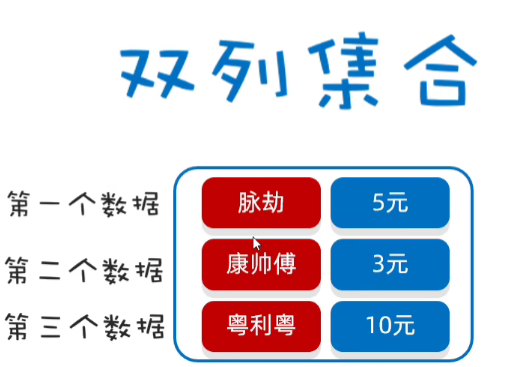

## 2、单列集合

- List系列集合：添加的元素是有序（存取顺序）、可重复、有索引
- Set系列集合：添加的元素是无序（存取顺序）、不可重复、无索引

### 2.1 Collection

#### 2.1.1 通用方法

- **Collection 是单列集合的祖宗接口，它的功能是全部单列集合都可以继承使用的。**

|              方法名称               |               说明                |
| :---------------------------------: | :-------------------------------: |
|       public boolean add(E e)       |   把给定的对象添加到当前集合中    |
|         public void clear()         |       清空集合中所有的元素        |
|     public boolean remove(E e)      |   把给定的对象在当前集合中删除    |
| public boolean contains(Object obj) | 判断当前集合中是否包含给定的对象  |
|      public boolean isEmpty()       |       判断当前集合是否为空        |
|          public int size()          | 返回集合中元素的个数 / 集合的长度 |

- 例子

~~~java
package org.example.collectiondemo;

import java.util.ArrayList;
import java.util.Collection;

public class CollectionDemo1 {
    public static void main(String[] args) {
        /**
         * public boolean add(E e)        添加
         * public void clear()            清空
         * public boolean remove(E e)     删除
         * public boolean contains(Object obj) 判断是否包含
         * public boolean isEmpty()       判断是否为空
         * public int size()              集合长度
         * 

         * 注意点:
         * Collection是一个接口,我们不能直接创建他的对象。
         * 所以，现在我们学习他的方法时，只能创建他实现类的对象。
         * 实现类: ArrayList
         * 

         * 目的: 为了学习Collection接口里面的方法
         * 自己在做一些练习的时候, 还是按照之前的方式去创建对象。
         */
        Collection<String> coll = new ArrayList<>();

        /**
         * 1、添加
         * 细节1：如果我们要往List系列集合中添加数据，那么方法永远返回true，因为List系列的是允许元素重复的。
         * 细节2：如果我们要往Set系列集合中添加数据，如果当前要添加元素不存在，方法返回true，表示添加成功。
         * 如果当前要添加的元素已经存在，方法返回false，表示添加失败。
         * 因为Set系列的集合不允许重复。
         */
        coll.add("aaa");
        coll.add("bbb");
        coll.add("ccc");
        System.out.println(coll);

        /**
         * 2.清空
         */
        coll.clear();

        /**
         * 3.删除
         * 细节1：因为Collection里面定义的是共性的方法，所以此时不能通过索引进行删除。只能通过元素的对象进行删除。
         * 细节2：方法会有一个布尔类型的返回值，删除成功返回true，删除失败返回false
         * 如果要删除的元素不存在，就会删除失败。
         */
        System.out.println(coll.remove("aaa"));
        System.out.println(coll);

        /**
         * 4.判断元素是否包含
         * 细节：底层是依赖equals方法进行判断是否存在的。
         * 所以，如果集合中存储的是自定义对象，也想通过contains方法来判断是否包含，那么在javabean类中，一定要重写equals方法。
         */
        boolean result = coll.contains("bbb");
        System.out.println(result);

        /**
         * 5.判断集合是否为空
         */

        boolean result2 = coll.isEmpty();
        System.out.println(result2);//false

        /**
         * 6.获取集合的长度
         */
        int size = coll.size();
        System.out.println(size);//2
    }
}
~~~

- add：添加

   * 细节1：如果我们要往List系列集合中添加数据，那么方法永远返回true，因为List系列的是允许元素重复的。
   * 细节2：如果我们要往Set系列集合中添加数据，如果当前要添加元素不存在，方法返回true，表示添加成功。
   * 如果当前要添加的元素已经存在，方法返回false，表示添加失败。
   * 因为Set系列的集合不允许重复。

- clear：清空

- remove：删除

  - 细节1：因为Collection里面定义的是共性的方法，所以此时不能通过索引进行删除。只能通过元素的对象进行删除。
  - 细节2：方法会有一个布尔类型的返回值，删除成功返回true，删除失败返回false
  - 如果要删除的元素不存在，就会删除失败。

- contains：判断元素是否包含

  - 下面是源码

  ~~~java
  public boolean contains(Object o) {
      return indexOf(o) >= 0;
  }
  
  
  /**
   * 1、首先判断入参o是否为空，如果为空，则遍历集合，只要里面有等于null的就返回
   * 2、如果不为空，则用equals进行遍历判断，返回对应的对象
   */
  public int indexOf(Object o) {
      if (o == null) {
          for (int i = 0; i < size; i++)
              if (elementData[i]==null)
                  return i;
      } else {
          for (int i = 0; i < size; i++)
              if (o.equals(elementData[i]))
                  return i;
      }
      return -1;
  }
  ~~~

  - 细节：**底层是依赖equals方法进行判断是否存在的。**
  - 所以，如果集合中存储的是自定义对象，也想通过contains方法来判断是否包含，那么在javabean类中，一定要重写equals方法。
  - 如果存的是自定义对象，没有重写equals方法，那么默认使用Object类中的equals方法进行判断，而Object类中equals方法，依赖地址值进行判断，那么就无法匹配上。

  ~~~java
  package org.example.collectiondemo;
  
  public class Student {
      private String name;
      private int age;
  
      public Student(String name, int age) {
          this.name = name;
          this.age = age;
      }
  
      public String getName() {
          return name;
      }
  
      public void setName(String name) {
          this.name = name;
      }
  
      public int getAge() {
          return age;
      }
  
      public void setAge(int age) {
          this.age = age;
      }
      
      @Override
      public boolean equals(Object o) {
          if (o == null || getClass() != o.getClass()) return false;
          Student student = (Student) o;
          return age == student.age && Objects.equals(name, student.name);
      }
  }
  
  
  package org.example.collectiondemo;
  
  import java.util.ArrayList;
  import java.util.Collection;
  
  public class CollectionDemo2 {
      public static void main(String[] args) {
          Collection<Student> collection = new ArrayList<>();
          collection.add(new Student("张三", 18));
          collection.add(new Student("李四", 18));
  		// 需求：如果姓名和年龄一致就认为是同一个对象包含
          // 当Student没有重写equals方法时，打印 false
          // 当Student重写equals方法时，打印 true
          System.out.println(collection.contains(new Student("李四", 18)));
      }
  }
  ~~~

- isEmpty：判断集合是否为空

- size：获取集合的长度

#### 2.1.2 遍历方式

- 迭代器遍历
- 增强for遍历
- Lambda表达式遍历

##### 2.1.2.1 迭代器遍历

- 迭代器在 Java 中的类是**Iterator**，迭代器是集合专用的遍历方式。
- **Collection 集合获取迭代器**
  - Iterator<E> iterator()：返回迭代器对象，默认指向当前集合的 0 索引
- **Iterator 中的常用方法**
  - boolean hasNext()：判断当前位置是否有元素，有元素返回 true，没有元素返回 false
  - E next()：获取当前位置的元素，并将迭代器对象移向下一个位置。

- **迭代器遍历不依赖索引**

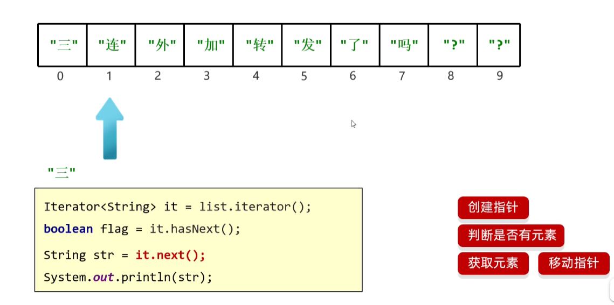

~~~java
package org.example.collectiondemo;

import java.util.ArrayList;
import java.util.Collection;
import java.util.Iterator;

public class CollectionDemo3 {
    public static void main(String[] args) {
        // 1.创建集合并添加元素
        Collection<String> coll = new ArrayList<>();
        coll.add("aaa");
        coll.add("bbb");
        coll.add("ccc");
        coll.add("ddd");

        // 2.获取迭代器对象
        // 迭代器就好比是一个箭头，默认指向集合的0索引处
        Iterator<String> it = coll.iterator();
        // 3.利用循环不断的去获取集合中的每一个元素
        while(it.hasNext()){
            // 4.next方法的两件事情：获取元素并移动指针
            String str = it.next();
            System.out.println(str);
        }
    }
}

/**
 aaa
 bbb
 ccc
 ddd
 */
~~~

- 细节注意点
  - 当指针已经指向最后没有元素的位置，再强行使用next()方法，就会报错 NoSuchElementException
  - 迭代器遍历完毕，指针不会复位，想再重新遍历，只能重新再次获取一个新的迭代器对象
  - 循环中只能用一次 next 方法：
    - 因为next()方法是有两步的，分别是 获取值 和 移动指针
    - 上一个指针已经移动到最后了，第二个再移动就会报错 NoSuchElementException
  - 迭代器遍历时，不能用集合的方法进行增加或者删除
    - 会报错并发修改异常：java.util.ConcurrentModificationException
    - 如果是倒数第二个，则不会报错原因：异常还没爆出就结束了
    - 如果实在要删除，那么可以用迭代器提供的remove方法进行删除

~~~java
package org.example.collectiondemo;

import java.util.ArrayList;
import java.util.Collection;
import java.util.Iterator;

public class CollectionDemo3 {
    public static void main(String[] args) {
        Collection<String> coll = new ArrayList<>();
        coll.add("aaa");
        coll.add("bbb");
        coll.add("ccc");
        coll.add("ddd");

        // 这里已经将指针移动到最后了
//        Iterator<String> it = coll.iterator();
//        while (it.hasNext()) {
//            String str = it.next();
//            System.out.println(str);
//        }

        /**
         * 1、当指针已经指向最后没有元素的位置，再强行使用next()方法，就会报错 NoSuchElementException
         */
//        String str = it.next();

        /**
         * 2、迭代器遍历完毕，指针不会复位，想再重新遍历，只能重新再次获取一个新的迭代器对象
         */
//        Iterator<String> iterator = coll.iterator();
//        while(iterator.hasNext()){
//            String s = iterator.next();
//            System.out.println(s);
//        }

        /**
         * 3、循环中只能用一次 next 方法
         * 因为next()方法是有两步的，分别是 获取值 和 移动指针
         * 上一个指针已经移动到最后了，第二个再移动就会报错 NoSuchElementException
         */
//        Iterator<String> it = coll.iterator();
//        while(it.hasNext()){
//            System.out.println(it.next());
//            System.out.println(it.next());
//        }

        /**
         * 4、不能用集合的方法进行增加或者删除
         * 
         */
        Iterator<String> it = coll.iterator();
        while(it.hasNext()){
           String str = it.next();
           if ("bbb".equals(str)) {
               // 会报错java.util.ConcurrentModificationException，并发操作异常
//               coll.remove(str);
               // 实在要删除，就用迭代器的remove
               it.remove();
           }
        }
        System.out.println(coll);
    }
}
~~~

##### 2.1.2.2 增强for遍历

- 增强 for 的底层就是迭代器，为了简化迭代器的代码书写的。
- 它是 JDK5 之后出现的，其内部原理就是一个Iterator迭代器。
- 所有的单列集合和数组才能用增强 for 进行遍历。
- 格式

~~~java
for (数据类型 变量名 : 集合/数组) {
    
}
~~~

- s其实就是一个第三方变量，在循环的过程中依次表示集合中的每一个数据，**修改其值不会改变集合中原本的数据**

~~~java
package org.example.collectiondemo;

import java.util.ArrayList;
import java.util.Collection;
import java.util.Iterator;

public class CollectionDemo4 {
    public static void main(String[] args) {
        //1.创建集合并添加元素
        Collection<String> coll = new ArrayList<>();
        coll.add("zhangsan");
        coll.add("lisi");
        coll.add("wangwu");

        // 2.利用增强for进行遍历
        // 注意点：
        // s其实就是一个第三方变量，在循环的过程中依次表示集合中的每一个数据，修改其值不会改变集合中原本的数据
        for(String s : coll){
            s = "qqq";
        }

        System.out.println(coll);  //[zhangsan, lisi, wangwu]
    }
}
~~~

##### 2.1.2.3 lambda表达式遍历

- 得益于 JDK 8 开始的新技术 Lambda 表达式，提供了一种更简单、更直接的遍历集合的方式。
- 方法：default void forEach(Consumer<? super T> action)  :  结合 lambda 遍历集合

~~~java
package org.example.collectiondemo;

import java.util.ArrayList;
import java.util.Collection;
import java.util.function.Consumer;

public class CollectionDemo5 {
    public static void main(String[] args) {
        // 1.创建集合并添加元素
        Collection<String> coll = new ArrayList<>();
        coll.add("zhangsan");
        coll.add("lisi");
        coll.add("wangwu");

        // 2.利用匿名内部类的形式
        // 底层原理：
        // 其实也会自己遍历集合，依次得到每一个元素
        // 把得到的每一个元素，传递给下面的accept方法
        // s依次表示集合中的每一个数据
        /*
        coll.forEach(new Consumer<String>() {
            @Override
            public void accept(String s) {
                System.out.println(s);
            }
        });
        */
        
        //lambda表达式
        coll.forEach(s -> {
            System.out.println(s);
        });
    }
}
~~~

- forEach底层源码

~~~java
default void forEach(Consumer<? super T> action) {
    Objects.requireNonNull(action);
    // 就是这里的for循环遍历，然后把每个对象交给匿名内部类的accept方法，所以在外部使用时，只需要重写accept方法即可操作每个元素
    for (T t : this) {
        action.accept(t);
    }
}
~~~

### 2.2 List

#### 2.2.1 通用方法

- 有序：存和取的元素顺序一致（存取）
- 有索引：可以通过索引操作元素
- 可重复：存储的元素可以重复

- Collection 的方法 List 都继承了，可以直接用

- List 集合因为有索引，所以多了很多索引操作的方法。

| 方法名称                      | 说明                                   |
| ----------------------------- | -------------------------------------- |
| void add(int index,E element) | 在此集合中的指定位置插入指定的元素     |
| E remove(int index)           | 删除指定索引处的元素，返回被删除的元素 |
| E set(int index,E element)    | 修改指定索引处的元素，返回被修改的元素 |
| E get(int index)              | 返回指定索引处的元素                   |

~~~java
package org.example.listdemo;

import java.util.ArrayList;
import java.util.List;

public class ListDemo1 {
    public static void main(String[] args) {
        /**
         * List集合独有的方法:

         * void add(int index,E element)      在此集合中的指定位置插入指定的元素
         * E remove(int index)                删除指定索引处的元素，返回被删除的元素
         * E set(int index,E element)         修改指定索引处的元素，返回被修改的元素
         * E get(int index)                   返回指定索引处的元素
         */

        // 1.创建一个集合
        List<String> list = new ArrayList<>();

        // 2.添加元素
        list.add("aaa");
        list.add("bbb");//1
        list.add("ccc");

        // void add(int index,E element)      在此集合中的指定位置插入指定的元素
        // 细节：原来索引上的元素会依次往后移
        list.add(1, "QQQ");

        // E remove(int index)                删除指定索引处的元素，返回被删除的元素
        String remove = list.remove(0);
        System.out.println(remove);//aaa

        // E set(int index,E element)           修改指定索引处的元素，返回被修改的元素
        String result = list.set(0, "QQQ");
        System.out.println(result);
        
        // E get(int index)                     返回指定索引处的元素
        String s = list.get(0);
        System.out.println(s);

        //3.打印集合
        System.out.println(list);
    }
}
~~~

- add(int index,E element) ：在此集合中的指定位置插入指定的元素

  - 原来索引上的元素会依次往后移

- E remove(int index) ：删除指定索引处的元素，返回被删除的元素

  - 小细节，list.remove(1);除的是索引下标1的数据，而不是值为1的数据
  - 原因：**优先调用，实参跟形参类型一致的那个方法。**这里有俩方法，肯定优先使用索引下标的方法

  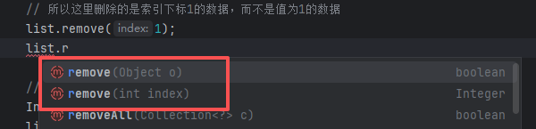

  - 如果想删除值为1的，就需要将其手动装箱，变成Integer类型，那么就会自动调用删除对象的方法
  

~~~java
package org.example.listdemo;

import java.util.ArrayList;
import java.util.List;

public class ListDemo2 {
    public static void main(String[] args) {
        // 1.创建集合并添加元素
        List<Integer> list = new ArrayList<>();
        list.add(1);
        list.add(2);
        list.add(3);

        // 2.删除元素
        // 请问：此时删除的是1这个元素，还是1索引上的元素？
        // 为什么？
        // 因为在调用方法的时候，如果方法出现了重载现象
        // 优先调用，实参跟形参类型一致的那个方法。
        // 所以这里删除的是索引下标1的数据，而不是值为1的数据
        list.remove(1);

        // 手动装箱，手动把基本数据类型的1，变成Integer类型
        Integer i = Integer.valueOf(1);
        list.remove(i);

        System.out.println(list);
    }
}
~~~

- E set(int index,E element) ：修改指定索引处的元素，返回被修改的元素
-  E get(int index)： 返回指定索引处的元素

#### 2.2.2 遍历方式

- 迭代器遍历
- 列表迭代器遍历
- 增强for遍历
- lambda表达式遍历
- 普通for遍历

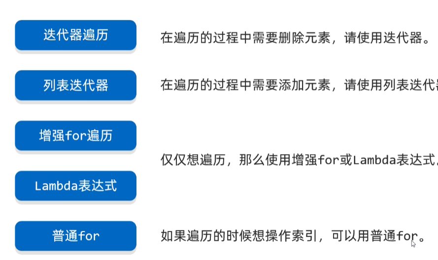

~~~java
package org.example.listdemo;

import java.util.ArrayList;
import java.util.List;
import java.util.ListIterator;
import java.util.function.Consumer;

public class ListDemo3 {
    public static void main(String[] args) {
        //创建集合并添加元素
        List<String> list = new ArrayList<>();
        list.add("aaa");
        list.add("bbb");
        list.add("ccc");

        //1.迭代器
        /*Iterator<String> it = list.iterator();
        while(it.hasNext()){
            String str = it.next();
            System.out.println(str);
        }*/

        //2.增强for
        //下面的变量s，其实就是一个第三方的变量而已。
        //在循环的过程中，依次表示集合中的每一个元素
        /* for (String s : list) {
            System.out.println(s);
        }*/

        //3.Lambda表达式
        list.forEach(new Consumer<String>() {
            @Override
            public void accept(String s) {

            }
        });

        //4.普通for循环
        //size方法跟get方法还有循环结合的方式，利用索引获取到集合中的每一个元素
        /*for (int i = 0; i < list.size(); i++) {
            //i:依次表示集合中的每一个索引
            String s = list.get(i);
            System.out.println(s);
        }*/

        // 5.列表迭代器
        //获取一个列表迭代器的对象，里面的指针默认也是指向0索引的

        //额外添加了一个方法：在遍历的过程中，可以添加元素
        ListIterator<String> it = list.listIterator();
        while(it.hasNext()){
            String str = it.next();
            if("bbb".equals(str)){
                //qqq
                it.add("qqq");
            }
        }
    }
}
~~~

- 列表迭代器：
  - **void add(E e)**：将指定的元素插入列表（可选操作）。
  - **boolean hasNext()**：以正向遍历列表时，如果列表迭代器有多个元素，则返回 true（换句话说，如果 `next` 返回一个元素而不是抛出异常，则返回 true）。
  - boolean hasPrevious()：如果以逆向遍历列表，列表迭代器有多个元素，则返回 true。
  - **E next()**：返回列表中的下一个元素。
  - int nextIndex()：返回对 next 的后续调用所返回元素的索引。
  - E previous()：返回列表中的前一个元素。
  - int previousIndex()：返回对 previous 的后续调用所返回元素的索引。
  - **void remove()**：从列表中移除由 next 或 previous 返回的最后一个元素（可选操作）。
  - void set(E e)：用指定元素替换 next 或 previous 返回的最后一个元素（可选操作）。

#### 2.3 ArrayList底层原理

- 基于**数组**实现的

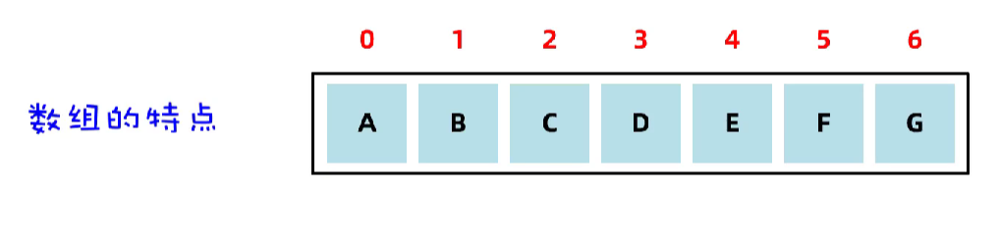

- 特点：

  - **查询速度快**（注意：是根据索引查询数据快）：查询数据通过地址值和索引定位，查询任意数据耗时相同。
  - **删除效率低**：可能需要把后面很多的数据进行前移。
  - **添加效率极低**：可能需要把后面很多的数据后移，再添加元素；或者也可能需要进行数组的扩容。

- 底层原理

  - 利用无参构造器创建的集合，会在底层创建一个默认长度为0的数组

  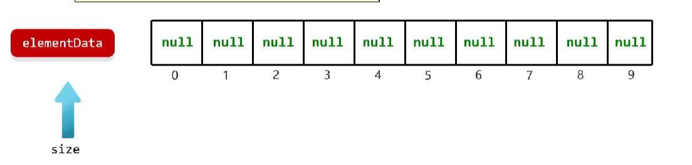

  - 添加一个元素时，底层会创建一个新的长度为10的数组，同时size指向下一次存储位置，也是元素个数

  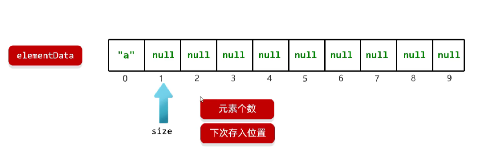

  - 存满时，**会扩容1.5倍**

  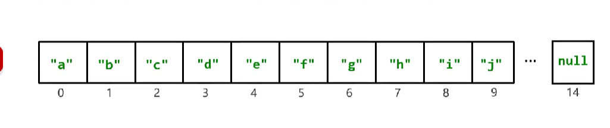

  - **如果一次添加添加多个元素，1.5倍还放不下，则新创建数组的长度以实际为准**

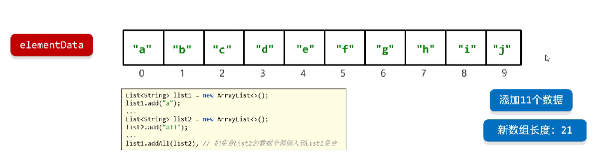

- 使用场景
  - ArrayList 适合：根据索引查询数据，比如根据随机索引取数据（高效）！或者数据量不是很大时！
  - ArrayList 不适合：数据量大的同时，又要频繁的进行增删操作！

#### 2.4 LinkedList底层原理

- 基于**双链表**实现的

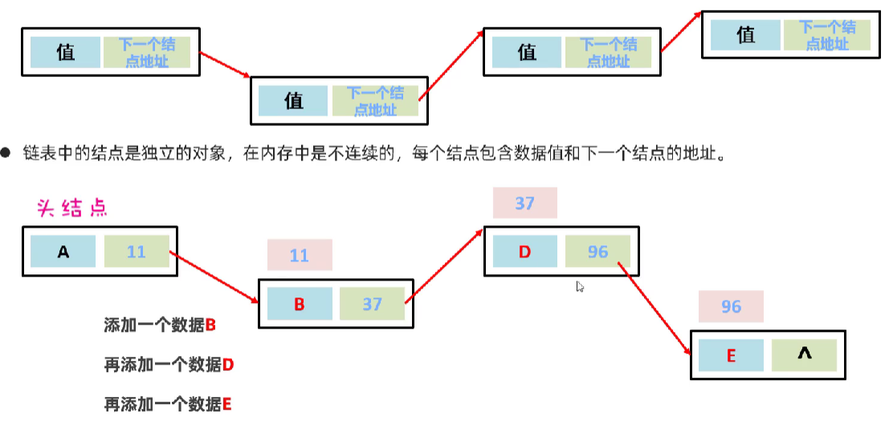

- 特点
  - **查询慢**：无论查询哪个数据都要从头开始找
  - **链表增删相对快**：因为只需要修改节点的下一个节点地址即可
- 双向链表
  - **查询慢**：无论查询哪个数据都要从头往后或者从后往前开始找
  - **链表增删相对快**：因为只需要修改节点的前一个和下一个节点地址即可
  - **对首尾元素进行增删改查的速度极快**：因为存储了头尾节点，可以快速定位

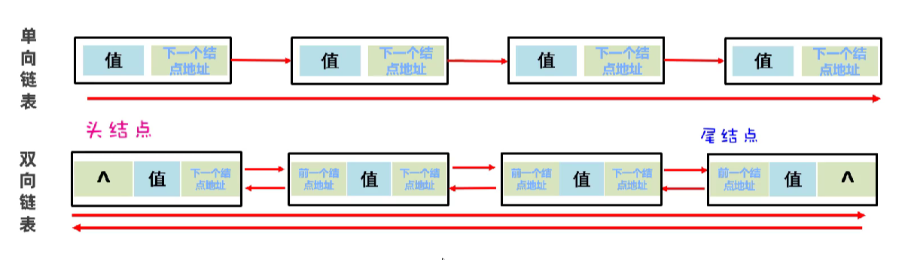

- LinkedList 新增了：很多首尾操作的特有方法

|         方法名称          |               说明               |
| :-----------------------: | :------------------------------: |
| public void addFirst(E e) |    在该列表开头插入指定的元素    |
| public void addLast(E e)  |  将指定的元素追加到此列表的末尾  |
|    public E getFirst()    |     返回此列表中的第一个元素     |
|    public E getLast()     |    返回此列表中的最后一个元素    |
|  public E removeFirst()   |  从此列表中删除并返回第一个元素  |
|   public E removeLast()   | 从此列表中删除并返回最后一个元素 |

- 使用场景

  - **可以用来设计队列**：**先进先出，后进后出**，设计排队的思想

  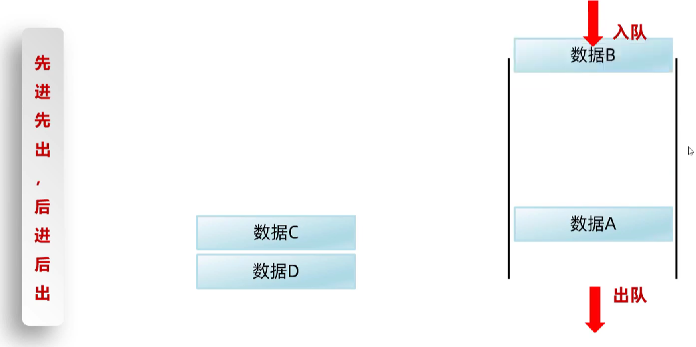

  ~~~java
  package org.example.listdemo;
  
  import java.util.LinkedList;
  
  public class ListTest3 {
      public static void main(String[] args) {
          // 1、创建一个队列
          LinkedList<String> queue = new LinkedList<>();
          queue.addLast("第1号人");
          queue.addLast("第2号人");
          queue.addLast("第3号人");
          queue.addLast("第4号人");
          System.out.println(queue);
          // 出队
          System.out.println(queue.removeFirst());
          System.out.println(queue.removeFirst());
          System.out.println(queue.removeFirst());
          System.out.println(queue);
      }
  }
  ~~~

  - **可以用来设计栈**：**先进后出，后进先出**：设计手枪子弹的思想

  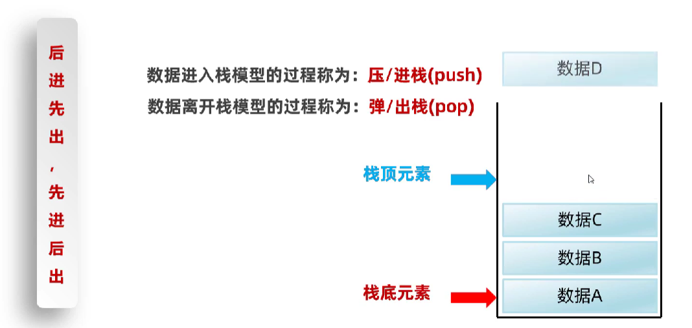

  ~~~java
  package org.example.listdemo;
  
  import java.util.LinkedList;
  
  public class ListTest3 {
      public static void main(String[] args) {
          // 1、创建一个栈对象。
          LinkedList<String> stack = new LinkedList<>();
  
          // 原生api
          // 压栈
          stack.addFirst("第 1 颗子弹");
          stack.addFirst("第 2 颗子弹");
          stack.addFirst("第 3 颗子弹");
          stack.addFirst("第 4 颗子弹");
          System.out.println(stack);
          // 出栈
          System.out.println(stack.removeFirst());
          System.out.println(stack.removeFirst());
          System.out.println(stack);
  
          // push和pop
          // 压栈
          stack.push("第 1 颗子弹");
          stack.push("第 2 颗子弹");
          stack.push("第 3 颗子弹");
          stack.push("第 4 颗子弹");
          System.out.println(stack);
          // 出栈
          System.out.println(stack.pop());
          System.out.println(stack.pop());
          System.out.println(stack);
      }
  }
  
  
  
  
  /**
   * push方法底层
   */
  public void push(E e) {
      addFirst(e);
  }
  
  /**
   * pop方法底层
   */
  public E pop() {
      return removeFirst();
  }
  ~~~

  

### 2.3 Set

- 特点

  - 无序：添加数据的顺序和获取出的数据顺序不一致

  - 无索引：不能通过索引操作元素

  - 不可重复：存储的元素不可以重复

- 三个实现类

  - HashSet ：无序、不重复、无索引
  - LinkedHashSet：**有序**、不重复、无索引
  - TreeSet：**可排序(他会把数据按照大小进行排序，默认升序)**、不重复、无索引

~~~java
package org.example.setdemo;

import java.util.Set;
import java.util.TreeSet;

public class SetDemo1 {
    public static void main(String[] args) {

        // 1、创建一个Set集合的对象
        // Set<Integer> set = new HashSet<>(); // 创建了一个HashSet的集合对象。 一行经典代码  HashSet：无序不重复 无索引
        // Set<Integer> set = new LinkedHashSet<>(); // 有序 不重复 无索引
        Set<Integer> set = new TreeSet<>(); // 可排序（升序） 不重复 无索引
        set.add(666);
        set.add(555);
        set.add(555);
        set.add(888);
        set.add(888);
        set.add(777);
        set.add(777);
        System.out.println(set);
    }
}
~~~

- **Set要用到的常用方法，基本上就是Collection提供的**

#### 2.3.1 哈希值

- 就是一个 int 类型的数值，Java 中每个对象都有一个哈希值。
- Java 中的所有对象，都可以调用 Object 类提供的 hashCode 方法，返回该对象自己的哈希值。

~~~java
public int hashCode(); // 返回对象的哈希码值。
~~~

- 对象哈希值的特点
  - **同一个对象多次调用 hashCode() 方法返回的哈希值是相同的**
  - 不同的对象，它们的哈希值一般不相同，**但也有可能会相同（哈希碰撞）**
  - int 范围：-21 亿多～21 亿多，而可表示对象数量：45 亿个对象，对象数量远多于int范围，所以肯定有碰撞

~~~java
package org.example.setdemo;

import org.example.collectiondemo.Student;

public class SetDemo2 {
    public static void main(String[] args) {
        Student s1 = new Student("郭姝萌", 25);
        Student s2 = new Student("紫霞", 22);

        System.out.println(s1.hashCode());
        System.out.println(s1.hashCode());
        System.out.println(s2.hashCode());

        String str1 = new String("abc");
        String str2 = new String("acD");

        System.out.println(str1.hashCode());
        System.out.println(str2.hashCode());
    }
}

/**
 同一个对象多次调用必定相同
 990368553
 990368553
 
 不同对象hash值可能不同
 1096979270
 
 不同对象hash值可能相同
 96354
 96354
 */
~~~

#### 2.3.2 HashSet底层原理

- 基于**哈希表**实现的
- 哈希表是一种增删改查数据性能都比较好的数据结构
- 哈希表
  - JDK8之前，哈希表 = **数组 + 链表**
  - JDK8开始，哈希表 = **数组 + 链表 + ****红黑树**
- **在JDK8之前的底层原理**
  - 无序原因：因为他是求了一遍余再放的，还要放在链表里，所以是无序的
  - 不重复：他会比较，比较相同就不会存入
  - 无索引：都无序了，肯定没有索引
  - 增删改查快：
    - 根据哈希值求余算法直接得到索引下标，再顺着链表找肯定快
    - 都找到索引了，增删改肯定快了
  - 缺点：
    - 如果数据过多，会导致链越来越长，这时候就会影响性能
  - **扩容机制**
    - 比如默认加载因子是0.75，数组总长为16，那么当数组坑占满 0.75 * 16 = 12个的时候，就证明此时数据量多了，需要扩容一倍

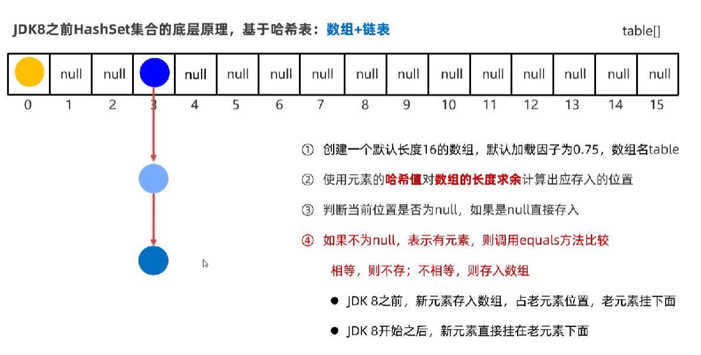

- JDK1.8开始后

  - 即便扩容了，可能还是会存在某个节点上的链过长，这个时候就得引入红黑树的机制了
  - **当链表长度超过8，且数组长度大于等于64时，自动将链表转为红黑树**
    - 红黑树存数据，hash值小的在左边，大的在右边

  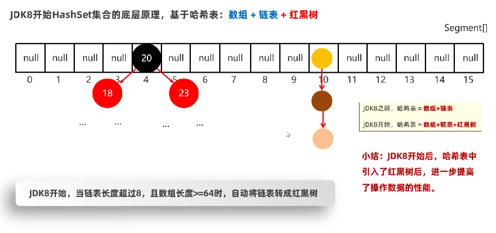

- 红黑树
  - 特点
    - 每个节点要么是**红色**，要么是**黑色**；
    - **根节点必须是黑色**；
    - **所有叶子节点（NIL 节点，空节点）都是黑色**；
    - 如果一个节点是红色，那么它的**两个子节点必须都是黑色**（不能有连续的红色节点）；
    - 从任意一个节点到其所有后代叶子节点的路径上，**包含相同数量的黑色节点**（黑高一致）。
  - 存储结构
    - 键（Key）：用于排序和查找；
    - 值（Value）：要存储的实际数据；
    - 颜色（红 / 黑）；
    - 左子节点、右子节点、父节点引用；
    - （可选）NIL 空节点（统一处理叶子节点，避免空指针）。
  - 特点
    - **有序存储**：按键的大小排序，遍历可以得到有序序列；
    - **高效操作**：插入、删除、查找的时间复杂度都是 O(logn)，比普通二叉树稳定（不会退化成链表）；
    - **空间开销**：每个节点需要存储颜色、父 / 子节点引用，比普通 BST 多一点空间，但换来了平衡；
    - **应用场景**：Java 的`TreeMap`/`TreeSet`、Linux 内核的内存管理、C++ STL 的`map`/`set`等。

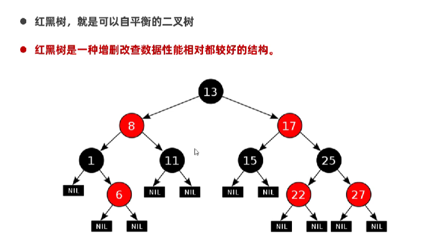

- **理解HashSet集合去重复机制**
  - HashSet集合默认不能对内容一样的两个不同对象去重
  - 比如：内容一样的两个学生对象存入到HashSet集合中，HashSet是不能去重的
  - 原因：因为HashSet的存储首先是得到hash值，再用equals判定，如果都相同的话才不会存入，而默认的Object方法hash值可能不同
  - **如果希望Set集合认为两个内容一样的对象是重复的，必须重写对象的equals()和hashcode()方法**

