# 一、概述

## 1、概念

- **“设计模式” 最初并不是出现在软件设计中，而是被用于建筑领域的设计中。**
- 1977 年美国著名建筑大师、加利福尼亚大学伯克利分校环境结构中心主任克里斯托夫・亚历山大（Christopher Alexander）在他的著作《建筑模式语言：城镇、建筑、构造》中描述了一些常见的建筑设计问题，并提出了 253 种关于对城镇、邻里、住宅、花园和房间等进行设计的基本模式。
- 1990 年软件工程界开始研讨设计模式的话题，后来召开了多次关于设计模式的研讨会。直到 1995 年，艾瑞克・伽马（Erich Gamma）、理查德・海尔姆（Richard Helm）、拉尔夫・约翰森（Ralph Johnson）、约翰・威利斯迪斯（John Vlissides）等 4 位作者合作出版了《设计模式：可复用面向对象软件的基础》一书，在此书中收录了 23 个设计模式，这是设计模式领域里程碑的事件，导致了软件设计模式的突破。这 4 位作者在软件开发领域里也以他们的 “四人组”（Gang of Four，GoF）著称。

## 2、软件设计模式的概念

- 软件设计模式（Software Design Pattern），又称设计模式，**是一套被反复使用、多数人知晓的、经过分类编目的、代码设计经验的总结**。它描述了在软件设计过程中的一些**不断重复发生的问题，以及该问题的解决方案**。也就是说，**它是解决特定问题的一系列套路**，是前辈们的代码设计经验的总结，具有一定的普遍性，可以反复使用。

##  3、学习设计模式的必要性

- **设计模式的本质是面向对象设计原则的实际运用，是对类的封装性、继承性和多态性以及类的关联关系和组合关系的充分理解。**

- 正确使用设计模式具有以下优点：

  - 可以提高程序员的思维能力、编程能力和设计能力。

  - 使程序设计更加标准化、代码编制更加工程化，使软件开发效率大大提高，从而缩短软件的开发周期。

  - 使设计的代码可重用性高、可读性强、可靠性高、灵活性好、可维护性强。

## 4、设计模式分类

- **创建型模式**
  - 用于描述 “怎样创建对象”，它的主要特点是 “将对象的创建与使用分离”。GoF 中提供了单例、原型、工厂方法、抽象工厂、建造者等 5 种创建型模式。

- **结构型模式**
  - 用于描述如何将类或对象按某种布局组成更大的结构，GoF 中提供了代理、适配器、桥接、装饰、外观、享元、组合等 7 种结构型模式。

- **行为型模式**
  - 用于描述类或对象之间怎样相互协作共同完成单个对象都无法单独完成的任务，以及怎样分配职责。GoF 中提供了模板方法、策略、命令、职责链、状态、观察者、中介者、迭代器、访问者、备忘录、解释器等 11 种行为型模式。

# 二、UML

- 统一建模语言（Unified Modeling Language，UML）是用来**设计软件的可视化建模语言**。它的特点是简单、统一、图形化、能表达软件设计中的动态与静态信息。

- UML 从目标系统的不同角度出发，定义了用例图、类图、对象图、状态图、活动图、时序图、协作图、构件图、部署图等 9 种图。

## 1、类图概述

- 类图 (Class diagram) 是**显示了模型的静态结构，特别是模型中存在的类、类的内部结构以及它们与其他类的关系等**。类图不显示暂时性的信息。类图是面向对象建模的主要组成部分。

## 2、类图的作用

- 在软件工程中，类图是一种静态的结构图，描述了系统的类的集合，类的属性和类之间的关系，可以简化了人们对系统的理解；
- 类图是系统分析和设计阶段的重要产物，是系统编码和测试的重要模型。

## 3、类图表示法

### 3.1 类的表示方式

- 在 UML 类图中，类使用包含类名、属性 (field) 和方法 (method) 且带有分割线的矩形来表示，比如下图表示一个 Employee 类，它包含 name,age 和 address 这 3 个属性，以及 work () 方法

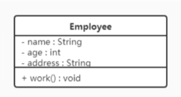

- 属性 / 方法名称前加的加号和减号表示了这个属性 / 方法的可见性，UML 类图中表示可见性的符号有三种：
  - +：表示 public
  - -：表示 private
  - \#：表示 protected
- 属性的完整表示方式是：**可见性 名称：类型 [= 缺省值]**
- 方法的完整表示方式是：**可见性 名称 (参数列表) [ : 返回类型]**

- 注意：中括号中的内容表示是可选的

- 例子
  - method () 方法：修饰符为 public，没有参数，没有返回值。
  - method1 () 方法：修饰符为 private，没有参数，返回值类型为 String。
  - method2 () 方法：修饰符为 protected，接收两个参数，第一个参数类型为 int，第二个参数类型为 String，返回值类型是 int

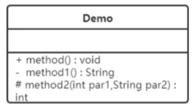

### 3.2 类与类之间关系的表示方式

#### 3.2.1 关联关系

- **关联关系是对象之间的一种引用关系，用于表示一类对象与另一类对象之间的联系**，如老师和学生、师傅和徒弟、丈夫和妻子等。关联关系是类与类之间最常用的一种关系，分为一般关联关系、聚合关系和组合关系。我们先介绍一般关联。

- 关联又可以分为单向关联，双向关联，自关联

  - **单向关联**：在 UML 类图中单向关联用一个带箭头的实线表示。下图表示每个顾客都有一个地址，这通过让 Customer 类持有一个类型为 Address 的成员变量类实现

  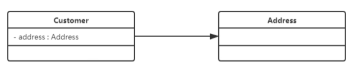

  - **双向关联**：在 UML 类图中，双向关联用一个不带箭头的直线表示。下图中在 Customer 类中维护一个`List<Product>`，表示一个顾客可以购买多个商品；在 Product 类中维护一个 Customer 类型的成员变量表示这个产品被哪个顾客所购买
    - 从下图中我们很容易看出，所谓的双向关联就是双方各自持有对方类型的成员变量

  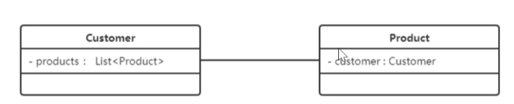

  - **自关联**：自关联在UML类图中用一个带有箭头且指向自身的线表示。下面的图就是Node类包含类型为Node的成员变量，也就是“自己包含自己”

  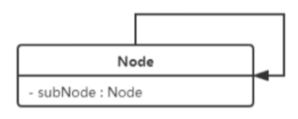

#### 3.2.2 聚合关系

- 聚合关系是关联关系的一种，是强关联关系，是**整体和部分之间的关系**

- 聚合关系也是通过成员对象来实现的，其中**成员对象是整体对象的一部分，但是成员对象可以脱离整体对象而独立存在**。例如，学校与老师的关系，学校包含老师，但如果学校停办了，老师依然存在。

- 在 UML 类图中，聚合关系可以用带空心菱形的实线来表示，菱形指向整体。下图所示是大学和教师的关系图：

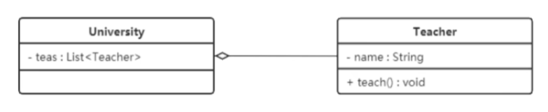

#### 3.2.3 组合关系

- **组合表示类之间的整体与部分的关系**，但它是一种更强烈的聚合关系。
- 在组合关系中，**整体对象可以控制部分对象的生命周期，一旦整体对象不存在，部分对象也将不存在，部分对象不能脱离整体对象而存在**。例如，头和嘴的关系，没有了头，嘴也就不存在了。
- 在 UML 类图中，组合关系用带实心菱形的实线来表示，菱形指向整体。下图所示是头和嘴的关系图：

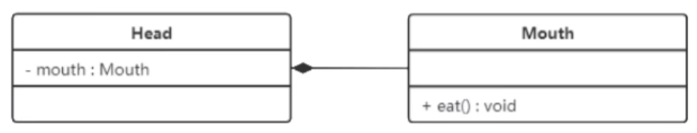

#### 3.2.4 依赖关系

- **依赖关系是一种使用关系**，它是对象之间耦合度最弱的一种关联方式，是临时性的关联。**在代码中，某个类的方法通过局部变量、方法的参数或者对静态方法的调用来访问另一个类（被依赖类）中的某些方法来完成一些职责**
- 在 UML 类图中，依赖关系使用带箭头的虚线来表示，箭头从使用类指向被依赖的类。下图所示是司机和汽车的关系图，司机驾驶汽车

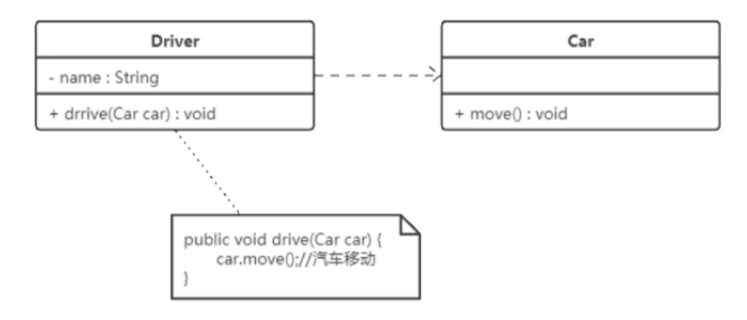

#### 3.2.5 继承关系

- 继承关系是对象之间耦合度最大的一种关系，表示一般与特殊的关系，**是父类与子类之间的关系，是一种继承关系**。

- 在 UML 类图中，泛化关系用带空心三角箭头的实线来表示，箭头从子类指向父类。在代码实现时，使用面向对象的继承机制来实现泛化关系。例如，Student 类和 Teacher 类都是 Person 类的子类，其类图如下图所示：

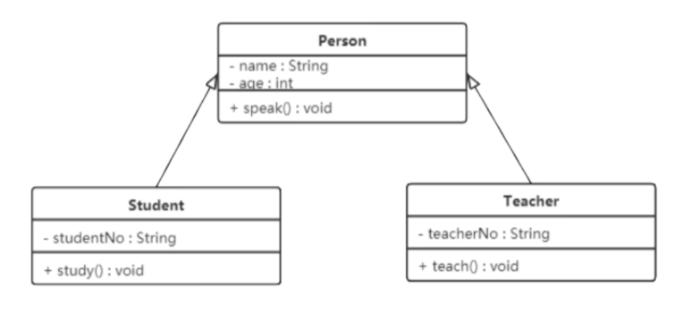

#### 3.2.6 实现关系

- 实现关系是接口与实现类之间的关系。在这种关系中，类实现了接口，类中的操作实现了接口中所声明的所有的抽象操作。

- 在 UML 类图中，实现关系使用带空心三角箭头的虚线来表示，箭头从实现类指向接口。例如，汽车和船实现了交通工具，其类图如图 9 所示

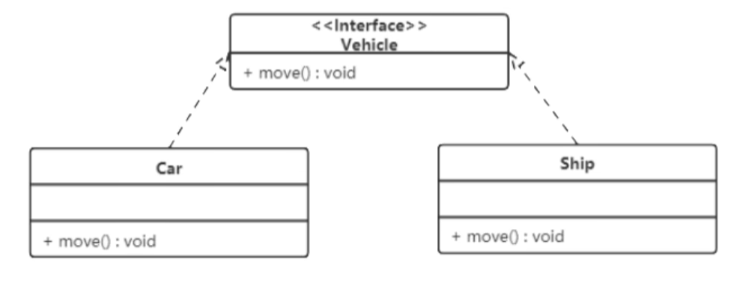

# 三、软件设计原则

在软件开发中，为了提高软件系统的可维护性和可复用性，增加软件的可扩展性和灵活性，程序员要尽量根据6条原则来开发程序，从而提高软件开发效率、节约软件开发成本和维护成本

## 1、开闭原则

- **对扩展开放，对修改关闭**。**在程序需要进行拓展的时候，不能去修改原有的代码，实现一个热插拔的效果**。简言之，是为了使程序的扩展性好，易于维护和升级。

- 想要达到这样的效果，我们需要使用接口和抽象类。

- 因为抽象灵活性好，适应性广，只要抽象的合理，可以基本保持软件架构的稳定。而软件中易变的细节可以从抽象派生来的实现类来进行扩展，当软件需要发生变化时，只需要根据需求重新派生一个实现类来扩展就可以了。

- 下面以搜狗输入法的皮肤为例介绍开闭原则的应用。
  - 【例】搜狗输入法的皮肤设计。
  - 分析：搜狗输入法的皮肤是输入法背景图片、窗口颜色和声音等元素的组合。用户可以根据自己的喜爱更换自己的输入法的皮肤，也可以从网上下载新的皮肤。这些皮肤有共同的特点，可以为其定义一个抽象类（AbstractSkin），而每个具体的皮肤（DefaultSpecificSkin 和 HeimaSpecificSkin）是其子类。用户窗体（SouGouInput）依赖AbstractSkin，可以根据需要选择或者增加新的主题，而不需要修改原代码，所以它是满足开闭原则的

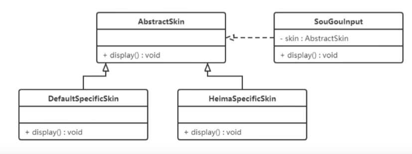

- 代码实现

  - 抽象父类：AbstractSkin

  ~~~java
  package org.example.principle.demo1;
  
  /**
   * 抽象皮肤类
   */
  public abstract class AbstractSkin {
      /**
       * 抽象显示方法
       */
      public abstract void display();
  }
  ~~~

  - 子类：DefaultSkin

  ~~~java
  package org.example.principle.demo1;
  
  /**
   * 默认皮肤类
   */
  public class DefaultSkin extends AbstractSkin {
  
      @Override
      public void display() {
          System.out.println("默认皮肤");
      }
  }
  ~~~

  - 子类：HeimaSkin

  ~~~java
  package org.example.principle.demo1;
  
  /**
   * 黑马皮肤类
   */
  public class HeimaSkin extends AbstractSkin {
  
      @Override
      public void display() {
          System.out.println("黑马皮肤");
      }
  }
  ~~~

  - 使用类：SouGouInput

  ~~~java
  package org.example.principle.demo1;
  
  /**
   * 搜狗输入法
   */
  public class SouGouInput {
      private AbstractSkin abstractSkin;
  
      void setAbstractSkin(AbstractSkin abstractSkin) {
          this.abstractSkin = abstractSkin;
      }
  
      public void display() {
          abstractSkin.display();
      }
  }
  ~~~

  - 使用：Main

  ~~~java
  package org.example.principle.demo1;
  
  /**
   * 使用
   */
  public class Main {
      public static void main(String[] args) {
          // 1、创建搜狗输入法对象
          SouGouInput souGouInput = new SouGouInput();
          // 2.1 创建皮肤对象
  //        DefaultSkin defaultSkin = new DefaultSkin();
          HeimaSkin heimaSkin = new HeimaSkin();
          // 3、设置皮肤
          souGouInput.setAbstractSkin(heimaSkin);
          // 4、显示
          souGouInput.display();
      }
  }
  ~~~

- 总结：

  - 不需要修改源代码，只需要实现不同的子类，就可以实现皮肤的修改

## 2、里氏代换原则

# 四、创建者模式

# 五、结构性模式

# 六、行为型模式

- 行为型模式用于描述程序在运行时复杂的**流程控制**，即**描述多个类或对象之间怎样相互协作共同完成单个对象无法单独完成的任务**，它涉及算法与对象间职责的分配。行为型模式分为类行为模式和对象行为模式：
  - **类行为模式**：采用继承机制来在类间分派行为
  - **对象行为模式**：采用组合或聚合在对象间分配行为
- 由于组合关系或聚合关系比继承关系耦合度低，满足“合成复用原则”，所以**对象行为模式比类行为模式具有更大的灵活性**
- 行为型模式分为：
  - 模板方法模式（类行为型模式）
  - 策略模式
  - 命令模式
  - 职责链模式
  - 状态模式
  - 观察者模式
  - 中介者模式
  - 迭代器模式
  - 访问者模式
  - 备忘录模式
  - 解释器模式（类行为型模式）
- 以上 11 种行为型模式，除了模板方法模式和解释器模式是类行为型模式，其他的全部属于对象行为型模式

## 1、模板方法模式

### 1.1 概述

- 在面向对象程序设计过程中，程序员常常会遇到这种情况：设计一个系统时知道了算法所需的关键步骤，而且确定了这些步骤的执行顺序，但某些步骤的具体实现还未知，或者说某些步骤的实现与具体的环境相关。

- 例如，去银行办理业务一般要经过以下 4 个流程：取号、排队、办理具体业务、对银行工作人员进行评分等，其中取号、排队和对银行工作人员进行评分的业务对每个客户是一样的，可以在父类中实现，但是办理具体业务却因人而异，它可能是存款、取款或者转账等，可以延迟到子类中实现。

- 模板方法模式：**定义一个操作中的算法骨架，而将算法的一些步骤延迟到子类中，使得子类可以不改变该算法结构的情况下重定义该算法的某些特定步骤。**

### 1.2 结构

- 模板方法（Template Method）模式包含以下主要角色：
  - **抽象类**（Abstract Class）：负责给出一个算法的轮廓和骨架。它由一个模板方法和若干个基本方法构成。
    - **模板方法**：定义了算法的骨架，按某种顺序调用其包含的基本方法。比如上述例子中的银行业务的四个固定顺序流程
    - **基本方法**：是实现算法各个步骤的方法，是模板方法的组成部分。基本方法又可以分为三种：
      - **抽象方法** (Abstract Method) ：一个抽象方法由抽象类声明、由其具体子类实现。
      - **具体方法** (Concrete Method) ：一个具体方法由一个抽象类或具体类声明并实现，其子类可以进行覆盖也可以直接继承。
      - **钩子方法** (Hook Method) ：在抽象类中已经实现，包括用于判断的逻辑方法和需要子类重写的空方法两种。一般钩子方法是用于判断的逻辑方法，这类方法名一般为 isXxx，返回值类型为 boolean 类型。
  - **具体子类**（Concrete Class）：实现抽象类中所定义的抽象方法和钩子方法，它们是一个顶级逻辑的组成步骤。

# 七、自定义Spring框架

