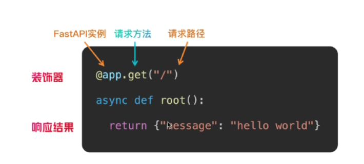

# 一、FastAPI 介绍

## 1、什么是 FastAPI

- FastAPI 是一个现代的、基于 Python 3.7+ 的 Web 框架，用于构建 API 服务。它使用 Python 的类型提示（type hints）作为核心特性，并基于 Starlette 和 Pydantic 构建，既兼具高性能，又拥有优秀的开发体验。

- 这个框架的目标是让你：

  - 编写更少的代码，做更多的事

  - 获得自动生成的 API 文档

  - 保持高性能（媲美 Node.js、Go）

  - 拥有类型安全的开发体验

- FastAPI 被广泛用于构建 RESTful API、微服务架构，甚至可以作为完整的后端框架来使用

## 2、FastAPI 主要特性

- 高性能：得益于 Starlette 和 Pydantic 的加持，FastAPI 拥有非常高的性能，接近 Node.js 和 Go，是现今最快的 Python Web 框架之一。性能对比（基于 TechEmpower 等基准测试，简化为每秒请求数）：
  - FastAPI：~3000 请求/秒（异步，轻量）
  - Flask：~1000 请求/秒（同步，受 WSGI 限制）
  - Django：~800 请求/秒（同步，ORM 和中间件开销较大）
- 开发效率高：FastAPI 使用 Python 类型提示（通过 Pydantic）进行数据验证，减少手动校验代码。类型提示使代码更易读，IDE（如 VSCode）提供自动补全和错误提示。
- 自动生成 API 文档：FastAPI 内置 Swagger UI 和 ReDoc，自动生成交互式 API 文档。开发者只需编写代码，文档即自动生成，减少维护成本。
- 异步支持：支持 async/await 语法，适合高并发场景（如实时聊天、流处理）。比传统同步框架（如 Flask）更适合现代 Web 应用

## 3、FastAPI 的适用场景

- RESTful API 接口
- 微服务系统（配合 Docker / Kubernetes）
- AI / ML 服务接口（如模型预测 API）
- 高并发的异步后台任务
- 快速开发原型项目

许多大型项目（如 Uber、Netflix 内部项目、Microsoft 等）都在使用 FastAPI，社区活跃，生态逐渐成熟

# 二、快速入门

## 1、环境准备

- python：FastAPI 要求 Python 版本为 3.8 及以上。

- uv：建议使用 uv 进行项目依赖包管理。

- ASGI 服务器：FastAPI 本身不包含运行服务器，所以你需要同时安装一个 ASGI 服务器。推荐使用 Uvicorn

- 使用 pycharm 新建项目

## 2、开发步骤

- 新建一个文件夹：FastApiDemo
- **用uv初始化开发环境：uv init**
- 添加依赖

~~~bash
# fastapi的依赖
uv add fastapi
# ASGI 服务器：FastAPI 本身不包含运行服务器，所以你需要同时安装一个 ASGI 服务器。推荐使用 Uvicorn
uv add uvicorn
~~~

- 创建一个名为 `main.py` 的文件，并写入以下代码：

~~~python
from fastapi import FastAPI

app = FastAPI()

@app.get("/")
async def root():
    """
    处理根路径的GET请求
    
    Returns:
        dict: 包含欢迎消息的字典，格式为{"message": "Hello World"}
    """
    return {"message": "Hello World"}
~~~

- **运行服务器：uvicorn main:app --reload**
  - `main`：表示 Python 文件名（不带 `.py`）。
  - `app`：表示 FastAPI 应用的实例名。
  - `--reload`：启用热重载，适合开发阶段使用。

- 访问以下地址即可看到运行结果：
  - API 接口：http://127.0.0.1:8000
  - Swagger 文档：http://127.0.0.1:8000/docs
  - ReDoc 文档：http://127.0.0.1:8000/redoc

# 三、详细解析

## 1、路由

### 1.1 什么是路由

- 在 Web 开发中，“路由（Route）”指的是将 **URL 路径**与对应的**处理逻辑（函数）**关联起来。它决定了当用户访问某个特定网址时，服务器应该执行那段代码来返回结果

- FastAPI 中通过装饰器（如 `@app.get()`、`@app.post()` 等）来定义路由，告诉框架：**当客户端访问某个路径，并使用某个方法时，应该调用哪个函数来处理请求**

### 1.2 路由写法

~~~bash
@app.get("/")
async def root():
    return {"message": "Hello World"}
~~~

- **FastAPI路由定义基于python的装饰器模式**
  - app：FastApi的示例
  - get：请求方法
  - ("/")：请求地址
  - return：返回结果

### 1.3 支持的请求方法

- FastAPI 支持所有常见的 HTTP 请求方法：

  | 方法      | 说明                     |
  | --------- | ------------------------ |
  | `GET`     | 获取资源                 |
  | `POST`    | 创建资源                 |
  | `PUT`     | 更新整个资源（完全替换） |
  | `PATCH`   | 部分更新资源（局部修改） |
  | `DELETE`  | 删除资源                 |
  | `OPTIONS` | 获取服务器支持的通信选项 |
  | `HEAD`    | 获取响应头而不返回响应体 |

- 常用的是前五种（GET、POST、PUT、PATCH、DELETE）

### 1.4 使用案例

#### 1.4.1 定义基本路由

~~~python
from fastapi import FastAPI

app = FastAPI()

@app.get("/")
async def read_root():
    """
    处理根路径的GET请求

    Returns:
        dict: 包含欢迎消息的字典，格式为{"message": "Hello, FastAPI!"}
    """
    return {"message": "Hello World"}
~~~

- 访问 `http://127.0.0.1:8000/` 时，FastAPI 会执行 `read_root()` 函数，返回一个 JSON 响应。

#### 1.4.2 为同一路径定义多个方法

~~~python
from fastapi import FastAPI
from pydantic import BaseModel

app = FastAPI()

class Item(BaseModel):
    """
    商品数据模型类

    Attributes:
        name (str): 商品名称
        price (float): 商品价格
    """
    name: str
    price: float

@app.get("/items/")
def read_items():
    """
    获取商品列表接口

    Returns:
        list: 包含商品信息的字典列表，每个字典包含商品名称和价格
    """
    return [{"name": "Apple", "price": 3.5}, {"name": "Banana", "price": 2.0}]

@app.post("/items/")
def create_item(item: Item):
    """
    创建新商品接口

    Args:
        item (Item): 商品对象，包含名称和价格信息

    Returns:
        dict: 包含创建成功消息和商品信息的字典
    """
    return {"message": "Item created", "item": item}
~~~

- 访问 `GET /items/` 会返回一个商品列表；
- 向 `POST /items/` 发送 JSON 数据，会创建一个新商品。

这种方式正是 RESTful API 设计的核心：一个路径代表一个资源，不同方法代表对该资源的不同操作

#### 1.4.3 使用路径参数定义路由

- 可以在路径中使用变量来动态匹配内容，例如：

~~~python
from fastapi import FastAPI

app = FastAPI()

@app.get("/users/{user_id}")
def get_user(user_id: int):
    """
    根据用户ID获取用户信息
    
    参数:
        user_id (int): 用户的唯一标识符
        
    返回:
        dict: 包含用户ID的字典对象
    """
    return {"user_id": user_id}
~~~

- 访问 `/users/123` 时，`user_id` 的值将为 `123`，类型为整数。
- FastAPI 会自动进行类型转换和验证，如果传入的是非整数，例如 `/users/abc`，会返回 422 错误

#### 1.4.4 多个路径指向同一个函数

- 你可以为不同路径设置相同的处理函数，实现路径别名的效果。例如：

~~~python
from fastapi import FastAPI

app = FastAPI()

@app.get("/home")
@app.get("/index")
def homepage():
    """
    处理主页请求的视图函数
    
    该函数绑定到两个路由路径："/home" 和 "/index"，当用户访问这两个路径时，
    将返回欢迎信息。
    
    返回值:
        dict: 包含欢迎消息的字典，格式为 {"message": "Welcome to homepage!"}
    """
    return {"message": "Welcome to homepage!"}
~~~

- 这样无论访问 `/home` 还是 `/index`，都会返回相同的结果

## 2、参数

### 2.1 路径参数

- **路径参数（Path Parameter）是 URL 路径中的一部分，用来表示某个资源的标识**。通常用于获取某个特定实体的信息，例如用户 ID、文章 ID 等

- 位置：URL路径的一部分 /book/id
- 作用：指向唯一的、特定的资源
- 方法：GET
- 写法

~~~python
~~~

