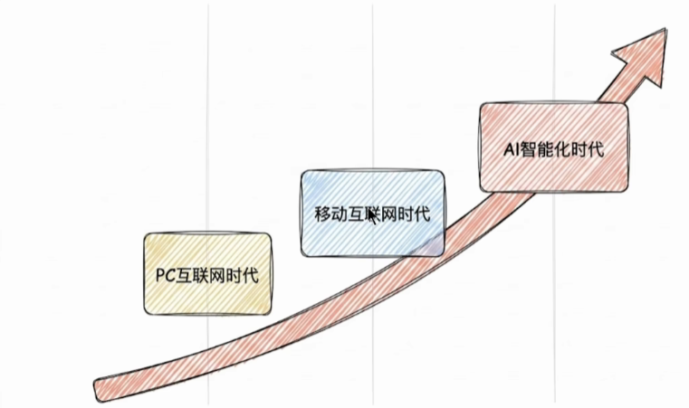
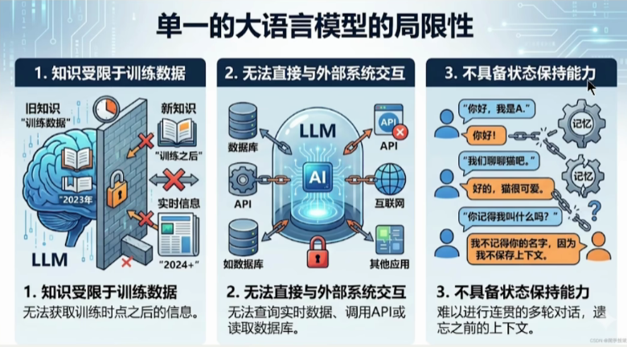

https://lc.opxqo.cn/02.html#11-%E4%B8%80%E5%BC%A0%E8%80%81%E5%9B%BE%E7%9C%8B%E5%A4%A7%E6%A8%A1%E5%9E%8B%E7%9A%84%E8%B0%83%E7%94%A8

# 一、概述

## 1、为什么需要LangChain

### 1.1 从传统应用到智能体时代

- PC互联网时代
- 移动互联网时代
- AI 智能化时代

### 1.2 单一的大语言模型的局限性

- 单一的大语言模型有局限性
  - **知识受限于训练数据**，无法获取训练时点之后的信息
  - **无法直接与外部系统交互**，无法查询实时数据，调用API或读取数据库
  - **不具备状态保持能力**，难以及逆行连贯的多轮对话，遗忘之前的上下文

- 所以要构建真正的AI应用，必须将大语言模型与外部工具、数据源和记忆机制有机结合，从而催生了LangChain框架的设计理念
- LangChain，是当前构建生产级AI智能体系统的首选

### 1.3 LangChain框架定位

- LangChain 作为大模型与应用间的中间层，可统一调用各类大模型、管理提示词与上下文，还能集成外部工具和数据源，快速搭建具备推理、行动能力的智能体。
- 核心定位三点：
  1. **打通大模型与外部资源**：统一接口对接数据库、检索引擎、API、文件系统等；
  2. **封装底层复杂逻辑**：抽象工具调用、记忆等能力，降低智能体开发难度；
  3. **支撑多智能体协作**：依托 LangGraph 等生态，从单智能体拓展至多智能体协作，可构建工业级智能体

### 1.4 LangChain应用场景

- 主要应用场景如下

  - **检索增强生成（RAG）**

    - 流程：用户提问 → 调用外部知识库 → 大模型结合检索信息推理 → 输出精准答案

    - 价值：解决大模型 “幻觉” 和知识滞后问题，让回答更可靠、贴合业务数据

  - **Agent 智能体构建**

    - 流程：用户目标（如 “预订巴黎行程”）→ 推理引擎规划 → Agent 调用航班查询、酒店预订等工具 → 完成复杂任务

    - 价值：让大模型具备自主规划、工具调用和多步执行能力，实现 “目标驱动” 的智能体

  - **对话系统与聊天机器人**

    - 流程：多轮对话 → 上下文感知与用户偏好学习 → 对接订单数据库、教材等业务数据

    - 价值：构建连贯、个性化的对话交互，适用于客服、教育助手等场景

  - **多模态应用开发**

    - 视觉方向：用户上传图片 → 图像识别 API → 生成描述 → 大模型问答

    - 语音方向：用户语音 → 转文字 → 处理 → 生成语音回复

    - 价值：打通图文、语音等多模态交互，拓展大模型的输入输出形态

  - **内容生成与自动化写作**

    - 流程：业务系统数据 / 法律模板 → 提示模板生成 → 输出解析 → 生成规范周报、法律文件等

    - 价值：自动化生成结构化、合规的文档，提升办公效率

  - **数据连接与处理**

    - 流程：PDF/Excel 等文件 → 文本提取 / 自然语言转等文 → 统一数据处理 → 生成 SQL 查询 → 输出趋势报告
    - 价值：让大模型直接对接企业数据资产，用自然语言完成数据分析与可视化

## 2、LangChain是什么

### 2.1 是什么

- LangChain 是一个基于 python 语言的模块化、可组合、面向开发者的开源框架，**旨在简化基于大型语言模型的应用程序开发**。它由 Harrison Chase 于 2022 年 10 月发起，迅速成为 GitHub 上增长最快的开源项目之一。

- 顾名思义，LangChain中的“Lang”是指language，即⼤语⾔模型，“Chain”即“链”，也就是**将⼤模型与外部数据&各种组件连接成链，以此构建AI应⽤程序**
  - LangChain ≠ LLMs
  - LangChain 之于 LLMs，类似于Spring之于 Java
  - LangChain 之于 LLMs，类似于Django、Flask之于 Python
- **学习LangChain框架，高效开发大模型应用**

### 2.2 为什么使用LangChain

- 当ChatGPT、QwenLM、DeepSeek等大语言模型（LLM）横空出世时，开发者们立刻意识到：LLM不是终点，而是构建智能应用的“大脑”。但要让这个“大脑”真正解决实际问题，还需要解决**三个关键痛点**：
  - **信息过时**：LLM的知识截止于训练数据的时间节点（如GPT-4的训练数据截止到2023年），无法回答诸如“2024年最新AI论文内容”或“今天纽约股市收盘价”这样的问题
  - **无法动手**：LLM虽然能生成自然语言，但它不能执行外部操作，比如调用API、计算数值、查询数据库、发送邮件等。它就像一个只会思考的“脑壳”，没有“手脚”。
  - **记忆有限**：LLM的上下文窗口（例如GPT-4最多支持32,768个tokens）限制了它处理长文本的能力，难以记住对话历史或文档细节。
- 因此，我们需要一个框架，**将LLM的“大脑”与“感官（数据）”、“手脚（工具）”、“记忆（上下文）”连接起来，让它从“聊天机器人”升级为“能解决具体问题的助手”**
- 不使用LangChain，确实可以使用GPT 或GLM4 等模型的API进行开发。比如，搭建“智能体”（Agent）、问答系统、对话机器人等复杂的 LLM 应用，但使用LangChain的**好处**有：
  - **简化开发难度**：更简单、更高效、效果更好
  - **学习成本更低**：不同模型的API不同，调用方式也有区别，切换模型时学习成本高。使用LangChain，可以以统一、规范的方式进行调用，有更好的移植性。
  - **现成的链式组装**：LangChain提供了一些现成的链式组装，用于完成特定的高级任务。让复杂的逻辑变得结构化、易组合、易扩展

- 总结：**LangChain是一个能构建LLM应用的全套工具集，涉及到prompt构建、LLM接入、记忆管理、工具调用、RAG、智能体开发等模块**

### 2.3 主要模块

- **langchain-core**：官方推荐的核心 API。比如 Runnable, BaseMessage 等
- **langchain-classic**：冗余代码或不推荐使用的经典 API 移到此。比如 0.x 中常用而 1.x 移除的 API 都在这里。
- **langchain-community**：第三方集成，比如：合作伙伴包 `langchain-openai`, `langchain-anthropic` 等，按需安装、避免臃肿。
- **langgraph**：深度整合 LangGraph 1.0，协调多个 Chain、Agent、Tools 完成更复杂（下方文字被遮挡，推测为 “任务，可能也需要调用到 LangGraph 的”）

### 2.4 API文档

- 官网：https://www.langchain.com/

- Github 地址：https://github.com/langchain-ai

- 中文文档地址：https://docs.langchain.org.cn/oss/python/langchain/overview

- 英文文档地址：https://docs.langchain.com/oss/python/langchain/overview

- API 文档查询地址：https://reference.langchain.com/python/langchain/

## 3、LangChain四大支柱

- 截至 2025 年 11 月，LangChain 已从一个独立的开发框架，成长为一个覆盖智能体系统全生命周期的技术生态。该生态由四大核心支柱构成：LangChain、LangGraph、Deep Agent 与 LangSmith。

- LangChain 智能体生态全生命周期

  - **智能体抽象层（Deep Agent）**：复杂任务拆解、自主决策

  - **运行时编排层（LangGraph）**：多智能体协作、状态管理

  - **基础能力层（LangChain）**：大模型连接、工具调用、数据加载

  - **监控与评估层（LangSmith）**：应用监控、性能评估、问题调试

- 核心支柱构成

  - LangChain（基础能力层）

  - LangGraph（运行时编排层）

  - Deep Agent（智能体抽象层）
  - LangSmith（监控与评估层）

- 它们分别对应基础能力层、运行时编排层、智能体抽象层、监控与评估层，共同构建了一个从技术验证到生产部署、从单体智能到复杂协作的项目闭环

### 3.1 LangChain：智能体开发的基石

- LangChain 是整个生态的核心与起点，为开发者提供了模型调用、工具与中间件集成、智能体构建等一整套基础能力。

- 其核心价值如下：

  - **统一的模型抽象层**：屏蔽了不同模型服务提供商（如 OpenAI、Anthropic、Ollama 等）的接口差异，提供一致的调用方式。

  - **高度模块化的设计**：使用 Message、Tool、Agent、Middleware 等组件实现灵活的组合与扩展。

  - **丰富的集成生态**：预置了丰富的数据源、API、中间件等，构成了强大的 AI 能力枢纽。

- 在整体架构中，LangChain 如同智能体的操作系统内核，是所有上层能力构建的基础。

- **结论**：**如果你需要构建简单的智能体应用，无需复杂的编排需求，那就选择 LangChain**

### 3.2  LangGraph：复杂工作流的编排引擎

- 当智能体的任务从单一指令执行扩展为多步骤、有状态的复杂工作流时，LangGraph 应运而生。

- 其核心思想是**将智能体内部抽象为一张有向图**。

  - **节点（Node）**：代表独立的功能单元或决策点。

  - **边（Edge）**：定义了节点之间的流转条件与路径。

  - **状态（State）**：作为一个共享上下文，在节点间传递并持久化存储任务信息。

- 通过这种图式结构，LangGraph 让智能体的工作流节点交互变得显式、可控、可观测

- 官方也强调：“快速起步用 LangChain，复杂控制用 LangGraph，二者并行协同”
  - LangChain = 能力抽象层（LLM / Tool / Message 标准化），负责 “有什么能力”
  - LangGraph = 执行与编排层（状态机 / 工作流 / 多 Agent 系统），负责 “怎么跑”

### 3.3 Deep Agent：智能体的执行框架

- Deep Agent 是新推出的全新组件，被定位为 Agent Harness（智能体执行框架）。它**构建于 LangChain 与 LangGraph 之上**，增加了规划能力、文件系统、子 Agent 等高级功能。旨在让开发者**无须从零构建**复杂的控制逻辑，即可创建具备深度规划、长期记忆与多专家协作能力的智能体。

- Deep Agent 的核心能力如下：

  - **显式规划**：自主生成、执行并动态调整多步任务计划。

  - **虚拟文件系统**：为智能体提供结构化的中间结果与知识存储。

  - **子智能体**：支持任务在多个智能体之间的分解与协作。

  - **长期记忆**：通过与 LangGraph 状态存储的结合，实现跨对话的经验积累。

  - **可扩展中间件**：允许嵌入安全审计、性能监控或自定义业务逻辑

### 3.4 三者关系

- 三个框架不是竞争关系，并非排斥，复杂项目完全可以同时使用到这三层

- 从LangChain快速搭建，用LangGraph打磨生产稳定性，再用Deep Agents赋予Agent更强的自主能力，这才是完整的LangChain生态

### 3.5 LangSmith：可视化监控与测试平台

- 当智能体系统逐渐复杂时，单靠日志与打印输出（print）调试已无法满足调试与质量管理的需求。

- LangSmith 是 LangChain 官方推出的**可视化监控与测试平台，用于跟踪、记录和分析智能体在运行过程中的完整调用链路**，让智能体的内部运行过程变得透明和可评估

- LangSmith 的核心目标如下：

  - **全链路追踪**：可视化追踪模型调用、提示词输入、结果输出、工具使用等行为。

  - **调试与优化**：发现运行中智能体的异常行为与性能瓶颈。

  - **评测与质量控制**：支持人工与自动化评测，量化智能体表现。

  - **团队协作**：支持多人共享测试集与调用记录。

- LangSmith 官网：`https://www.langchain.com/langsmith`

- LangSmith 的引入使得智能体的开发、调试与运维形成了完整的质量闭环

## 4、大模型应用场景介绍

### 4.1 RAG开发

- 1、背景

  - **大模型的知识冻结**：随着 LLM 规模扩大，训练成本与周期相应增加，模型无法实时学习到最新的信息或动态变化。导致 LLM 难以应对诸如“请推荐现在的热门影片”等时间敏感的问题。

  - **大模型幻觉**：涉及到大模型从未在训练过程中学习过的信息时，大模型无法给出准确的答复，转而开始臆想和编造答案。

- 2、举例：LLM在考试的时候面对陌生的领域，答复能力有限，然后就准备放飞自我了，而此时RAG给了一些提示和思路，让LLM懂了开始往这个提示的方向做，最终考试的正确率从60%到了90%！

- 3、何为RAG：Retrieval-Augmented Generation（检索增强生成）

- 4、这些过程中的难点：1、文件解析 2、文件切割 3、知识检索 4、知识重排序

  - 1、文件解析：如果是pdf，内部包含文件、图片、表格，图片上还有文字，需要处理。

  - 2、文件切割：没有固定的格式

  - 3、在 RAG 应用中，随着文档数量增加，召回准确率会下降，引入reranker（重排器）可对初步召回的较多 chunk（如 top 20 或 top 50）进行精排，提高召回准确率，防止LLM 处理无关信息，减少时间和成本。此外，与基于基本矢量搜索的 RAG 相比，reranker增强型 RAG 的成本更高，但与仅依靠LLM 生成答案相比，它的成本低些。Reranker的使用场景：

    - 适合：追求回答高精度和高相关性的场景中特别适合使用 Reranker，例如专业知识库或者客服系统等应用。

    - 不适合：引入reranker会增加召回时间，增加检索延迟。服务对响应时间要求高时，使用reranker可能不合适

### 4.2 Agent开发

- 充分利用 LLM 的推理决策能力，通过增加规划、记忆和工具调用的能力，构造一个能够独立思考、逐步完成给定目标的 Agent（智能体）
- 一个数学公式来表示：**Agent = LLM + Planning + Tools + Memory + Action**

- 类比：打车到西藏玩

  - 大脑中枢：规划行程的你
  - 规划：步骤1：规划打车路线，步骤2：订饭店、酒店，。。。
  - 调用工具：调用MCP或FunctionCalling等API，滴滴打车、携程、美团订酒店饭店
  - 记忆能力：沟通时，要知道上下文。比如订酒店得知道是西藏路上的酒店，不能聊着聊着忘了最初的目的。
  - 能够执行上述操作。说走就走，不能纸上谈兵

- 智能体核心要素被细化为以下模块：

  - 1、**大模型（LLM）作为“大脑”**：提供推理、规划和知识理解能力，是AI Agent的决策中枢。大脑主要由一个大型语言模型 LLM 组成，承担着信息处理和决策等功能， 并可以呈现推理和规划的过程，能很好地应对未知任务。

  - 2、**规划决策（Planning）**：通过任务分解、反思与自省框架实现复杂任务处理。例如，利用思维链（Chain of Thought）将目标拆解为子任务，并通过反馈优化策略
  - 3、**工具使用（Tool Use）**：调用外部工具（如API、数据库）扩展能力边界
  - 4、**记忆（Memory）**：智能体像人类一样，能留存学到的知识以及交互习惯等，这样的机制能让智能体在处理重复工作时调用以前的经验，从而避免用户进行大量重复交互
    - 短期记忆：存储单次对话周期的上下文信息，属于临时信息存储机制。受限于模型的上下文窗口长度。
    - 长期记忆：可以横跨多个会话或时间周期，可存储并调用核心知识，非即时任务。比如，关于用户的偏好，过去执行过的指令等。长期记忆，可以通过模型参数微调（固化知识）、知识图谱（结构化语义网络）或向量数据库（相似性检索）方式实现。
  - 5、**行动（Action）**：实际执行决策的模块，涵盖软件接口操作（如自动订票）和物理交互（如机器人执行搬运）。比如：检索、推理、编程等

- 智能体会形成完整的计划流程。例如先读取以前工作的经验和记忆，之后规划子目标并使用相应工具去处理问题，最后输出给用户并完成反思

### 4.3 大模型应用开发的4个场景

#### 4.3.1 纯 Prompt

- Prompt是操作大模型的唯一接口
- 当人看：你说一句，ta回一句，你再说一句，ta再回一句...

#### 4.3.2 Agent + Function Calling

- Agent：AI 主动提要求
- Function Calling：需要对接外部系统时，AI 要求执行某个函数
- 当人看：你问 ta「我明天去杭州出差，要带伞吗？」，ta 让你先看天气预报，你看了告诉ta，ta 再告诉你要不要带伞

#### 4.3.3 RAG 

- RAG：需要补充领域知识时使用

  - Embeddings：把文字转换为更易于相似度计算的编码。这种编码叫向量

  - 向量数据库：把向量存起来，方便查找
  - 向量搜索：根据输入向量，找到最相似的向量

- 举例：考试答题时，到书上找相关内容，再结合题目组成答案

#### 4.3.4 Fine-tuning(精调/微调)

- 举例：努力学习考试内容，长期记住，活学活用。

### 4.4 如何选择相关技术

# 二、模型调用和创建

## 1、准备工作

### 1.1 大模型的调用步骤

- 在LangChain v0.3版本中，提到了Model I/O，包括输入提示(Format)、调用模型(Predict)、输出解析(Parse)。分别对应着Prompt Template ， Model 和Output Parser 

- 关于模型调用模块，如今对话模型已经是主要形式。从历史上解读：
  - 在GPT-3时代，大模型以补全模型为主，只能以类似“成语接龙”的方式对文本进行补全，并且实际运行效果也非常不稳定。此时LangChain借助一些高层封装的API，能够让模型完成对话、调用外部工具、甚至是结构化输出等功能，为开发者提供了极大的便利。
  - 伴随着GPT-3.5模型的发布，对话模型正式登上历史的舞台，并逐渐成为主流。而得益于对话模型更强的指令跟随能力，很多GPT-3需要借助LangChain才能完成的工作，已经成为GPT-3.5原生自带的一些功能。

- 所以，本章只提供了对话模型的创建，而没有了非对话模型

### 1.2 模型初始化的分类方式

- 简单来说，就是用谁家的API以什么方式创建存放在哪个位置的大模型

- 角度1：调用谁家的API
  - 使用模型提供商的库
  - 使用LangChain统一方式（推荐）

- 角度2：模型初始化时，几个重要参数(如BASE_URL、API-KEY)的书写位置的不同：
  - 使用配置文件（推荐）
  - 硬编码：写在代码文件中

- 角度3：调用的模型所在位置

  - 在线部署的大模型

  - 本地部署的大模型

- LangChain作为一个“工具”，不提供任何 LLMs，而是依赖于第三方集成各种大模型。这里就看大模型到底部署在哪里

### 1.3 线上大模型服务平台

- 有许多提供大模型API服务的平台，使用时只需要注册、充值并创建API-Key，之后即可使用API-Key与URL来调用平台提供的相应的模型的服务。

| 平台       | 网址                                           | 备注                 |
| ---------- | ---------------------------------------------- | -------------------- |
| OpenRouter | https://openrouter.ai/                         | 全球主流，含国外模型 |
| CloseAI    | https://platform.closeai-asia.com/             | 亚洲最大，含国外模型 |
| 阿里云百炼 | https://bailian.console.aliyun.com/            | 企业端友好           |
| 硅基流动   | https://www.siliconflow.cn/                    | 性价比高，适合个人   |
| 百度千帆   | https://console.bce.baidu.com/qianfan/overview | 主打百度生态         |
| 火山引擎   | https://console.volcengine.com/ark/            | 主打字节多模态生态   |

- 说明：每个平台配置时，都需要几个要素：模型名、api-key 、base-url 。

- 如果大家想使用国外的大模型，就选择前两个；如果只使用国内的大模型，可以选择后四个。

## 2、使用模型提供商库初始化

- 在 LangChain 中初始化模型，主要可以通过直接**使用特定的 Model Class** 和**使用统一的 init_chat_model 函数**这两种方式来实现。
- 这里先讲方式 1，这种方式最直接。LangChain 为一些大模型供应商提供了专门的 Model 类，导入对应的具体类（如 `ChatOpenAI`、`ChatAnthropic`、`ChatDeepSeek`、`ChatOllama`、`ChatHunyuan`、`ChatTongyi`、`ChatZhipuAI`）并进行实例化。
- 官网链接：https://reference.langchain.com/python/langchain-community/chat-models

### 2.1 通过专用API调用

注意：使用不同的模型可能传入的参数名称不同，可以参考对应的源码

#### 2.1.1 DeepSeek大模型

- 官网：https://www.deepseek.com/
- 步骤1：安装依赖
  - 说明：langchain-deepseek 是使用deepseek 大模型必要依赖。
  - 注意：langchain-deepseek 依赖于langchain-openai ，安装前者，pip会自动从pypi拉取元数据解析依赖，后者也会被安装。所以我们把langchain-openai 也放在此处。

~~~bash
# 初始化项目
uv init
# 安装ChatOpenAI依赖包
uv add langchain-openai
# 安装ChatDeepSeek 依赖包
uv add langchain-deepseek
# 用于环境管理的包
uv add python-dotenv
~~~

- 步骤2：创建.env环境变量

~~~bash
DEEPSEEK_API_KEY=<Your API Key>
DEEPSEEK_BASE_URL=https://api.deepseek.com
~~~

- 步骤3：读取配置并初始化模型

~~~python
from langchain_deepseek import ChatDeepSeek
import os
from dotenv import load_dotenv

# 通过load_dotenv()将.env中的变量加载为环境变量
# override=True表示：无论你当前的操作系统、终端或者虚拟环境中是否已经存在同名的环境变量，
load_dotenv(override=True)

# 从环境变量读取配置
DEEPSEEK_API_KEY = os.getenv("DEEPSEEK_API_KEY")
DEEPSEEK_BASE_URL = os.getenv("DEEPSEEK_BASE_URL")

# 创建DeepSeek LLM
deepseek_llm = ChatDeepSeek(
    api_key=DEEPSEEK_API_KEY,
    api_base=DEEPSEEK_BASE_URL,
    model_name="deepseek-v4-flash",
)

print(deepseek_llm.invoke("你好"))
~~~

- 步骤3优化：依靠默认行为读取 .env 环境变量

~~~python
from langchain_deepseek import ChatDeepSeek
import os
from dotenv import load_dotenv

# 通过load_dotenv()将.env中的变量加载为环境变量
# override=True表示：无论你当前的操作系统、终端或者虚拟环境中是否已经存在同名的环境变量，
load_dotenv(override=True)

# 从环境变量读取配置
DEEPSEEK_API_KEY = os.getenv("DEEPSEEK_API_KEY")
DEEPSEEK_BASE_URL = os.getenv("DEEPSEEK_BASE_URL")

# 创建DeepSeek LLM
deepseek_llm = ChatDeepSeek(
    model_name="deepseek-v4-flash"
)

print(deepseek_llm.invoke("你好"))
~~~

- 调用ChatDeepSeek要求系统存在名为DEEPSEEK_API_KEY的环境变量。URL通过源码可以查看，有默认值。如下：

~~~python
api_key: SecretStr | None = Field(
    default_factory=secret_from_env("DEEPSEEK_API_KEY",
                                 default=None),
)
"""DeepSeek API key"""
api_base: str = Field(
    default_factory=from_env("DEEPSEEK_API_BASE",
                         default=DEFAULT_API_BASE),
)
"""DeepSeek API base URL"""
DEFAULT_API_BASE = "https://api.deepseek.com/v1"
~~~

