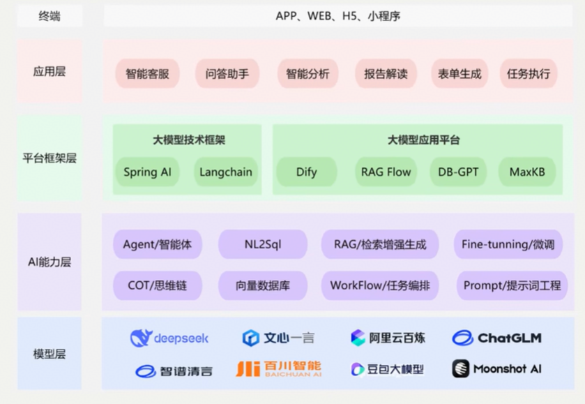

# 一、LangChain介绍

## 1、什么是 LangChain

- LangChain 是一个基于 python 语言的模块化、可组合、面向开发者的开源框架，**旨在简化基于大型语言模型的应用程序开发**。它由 Harrison Chase 于 2022 年 10 月发起，迅速成为 GitHub 上增长最快的开源项目之一。

- 顾名思义，LangChain中的“Lang”是指language，即⼤语⾔模型，“Chain”即“链”，也就是**将⼤模型与外部数据&各种组件连接成链，以此构建AI应⽤程序**
  - LangChain ≠ LLMs
  - LangChain 之于 LLMs，类似于Spring之于 Java
  - LangChain 之于 LLMs，类似于Django、Flask之于 Python
- **学习LangChain框架，高效开发大模型应用**

## 2、为什么需要LangChain

- 当ChatGPT、QwenLM、DeepSeek等大语言模型（LLM）横空出世时，开发者们立刻意识到：LLM不是终点，而是构建智能应用的“大脑”。但要让这个“大脑”真正解决实际问题，还需要解决**三个关键痛点**：
  - **信息过时**：LLM的知识截止于训练数据的时间节点（如GPT-4的训练数据截止到2023年），无法回答诸如“2024年最新AI论文内容”或“今天纽约股市收盘价”这样的问题
  - **无法动手**：LLM虽然能生成自然语言，但它不能执行外部操作，比如调用API、计算数值、查询数据库、发送邮件等。它就像一个只会思考的“脑壳”，没有“手脚”。
  - **记忆有限**：LLM的上下文窗口（例如GPT-4最多支持32,768个tokens）限制了它处理长文本的能力，难以记住对话历史或文档细节。
- 因此，我们需要一个框架，**将LLM的“大脑”与“感官（数据）”、“手脚（工具）”、“记忆（上下文）”连接起来，让它从“聊天机器人”升级为“能解决具体问题的助手”**
- 不使用LangChain，确实可以使用GPT 或GLM4 等模型的API进行开发。比如，搭建“智能体”（Agent）、问答系统、对话机器人等复杂的 LLM 应用，但使用LangChain的**好处**有：
  - **简化开发难度**：更简单、更高效、效果更好
  - **学习成本更低**：不同模型的API不同，调用方式也有区别，切换模型时学习成本高。使用LangChain，可以以统一、规范的方式进行调用，有更好的移植性。
  - **现成的链式组装**：LangChain提供了一些现成的链式组装，用于完成特定的高级任务。让复杂的逻辑变得结构化、易组合、易扩展

- 总结：**LangChain是一个能构建LLM应用的全套工具集，涉及到prompt构建、LLM接入、记忆管理、工具调用、RAG、智能体开发等模块**

## 3、使用场景

- 可以实现的项目

| 项目名称                         | 技术点                          |
| -------------------------------- | ------------------------------- |
| 文档问答助手                     | Prompt + Embeding + RetrievalQA |
| 智能日程规划助手                 | Agent + Tool + Memory           |
| LLM + 数据库问答                 | SQLDatabaseToolkit + Agent      |
| 多模型路由对话系统               | RouterChain + 多LLM             |
| 互联网智能客服                   | ConversationChain + RAG + Agent |
| 企业只是库助手（RAG + 本地模型） | VectorDB + LLM + Streamlit      |

- LangChain的位置

## 4、资料介绍

- 官网地址：https://www.langchain.com/langchain

- 官网文档：https://python.langchain.com/docs/introduction/
- API文档：https://python.langchain.com/api_reference

## 5、总体架构设计

# 二、开发环境配置

- 创建项目

~~~bash
# 创建项目
uv init LangChainDemo                                
# 进入项目目录
cd LangChainDemo 
# 安装Langchain
uv add langchain     
~~~

- 创建密钥环境变量，创建.env文件

~~~bash
DEEPSEEK_API_KEY=XXXX
QWEN_API_KEY=XXXX
OPENAI_API_KEY=XXX
~~~

- 通过 python-dotenv 库读取 env 文件中的环境变量，并加载到当前运行的环境中，代码如下：

~~~python
import os
from dotenv import load_dotenv 
load_dotenv(override=True)

deepseek_api_key = os.getenv("DEEPSEEK_API_KEY")
# print(deepseek_api_key)  # 可以通过打印查看
~~~

