# 一、前置知识

## 1、了解知识

- Python 是荷兰计算机科学家吉多・范罗苏姆（Guido van Rossum，龟叔）在 1991 发布的一门语法简单、容易上手的**编程语言**。

- 语言：是人类进行沟通交流的主要表达方式。

- 编程语言：是人类与计算机之间进行信息交流的一种特殊的语言。
- 总结：**python是一门语法简单、容易上手且应用非常广泛的编程语言**


## 2、win环境安装

### 2.1 下载

- python官网：https://www.python.org/


- 官网下载Windows版本：https://www.python.org/downloads/windows/


- 下载后如图所示


### 2.2 安装

- 点击安装程序


- 如下图，建议选择自定义安装，确保勾选 "Add Python.exe to PATH" 选项（将 Python 添加到系统环境变量中，这样可以在命令行中直接运行 python 命令）


- 如下图，直接默认下一步

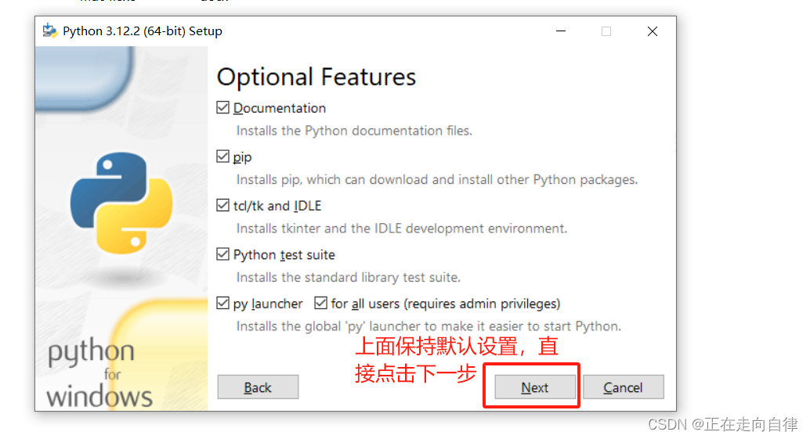

- 正在安装中

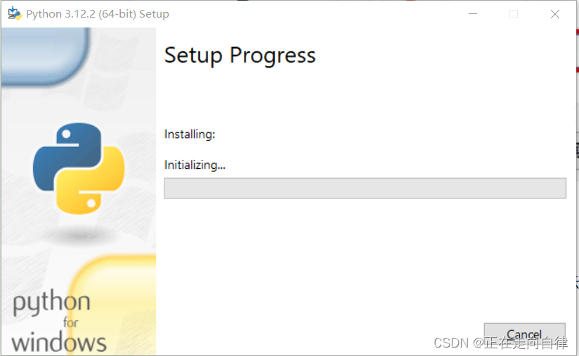

- 如下图，有一个提示Disable path length limit 点击关闭长度的限制，点击它然后安装完成。

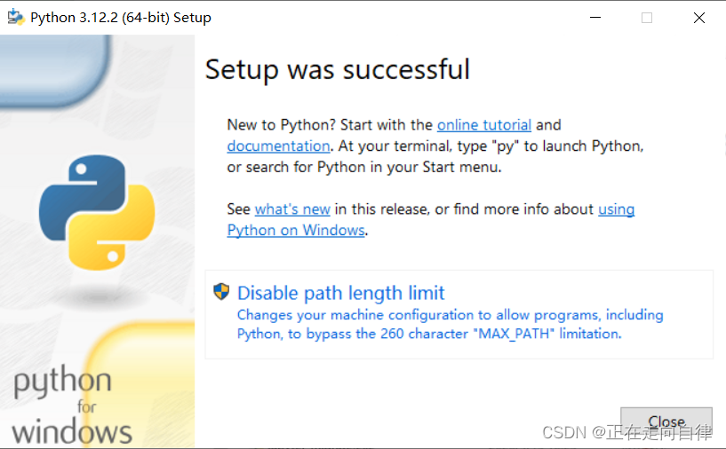


### 2.3 验证安装

- 打开终端或命令提示符cmd（Windows用户）。

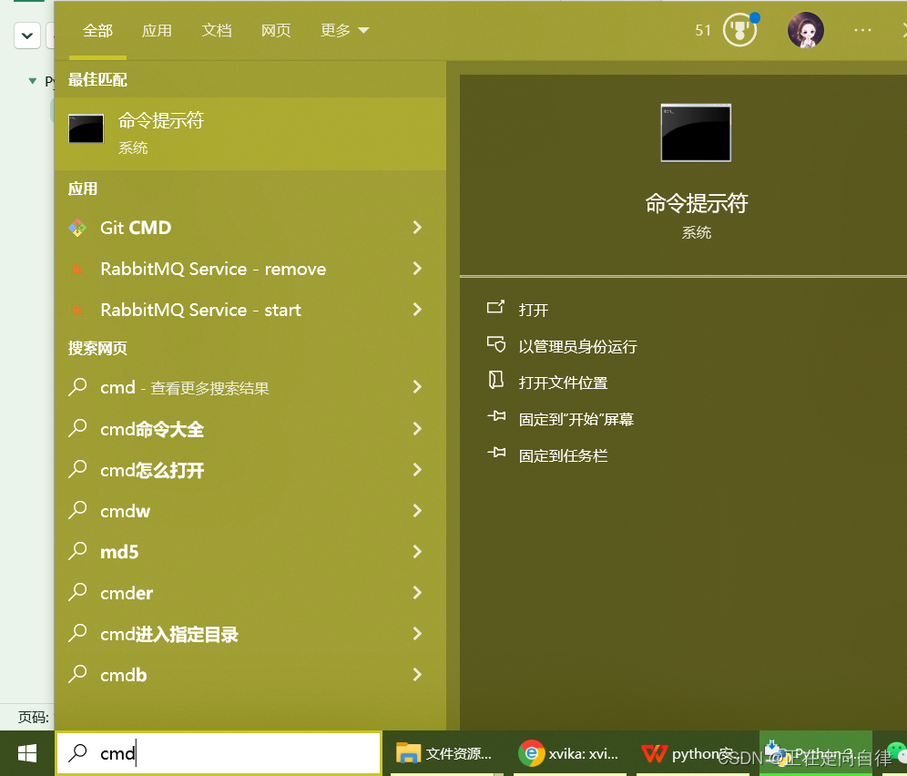

-  输入“python --version”或“python3 --version”，确认Python是否已成功安装。如果输出版本号，则表示安装成功。


- 输入“python”或“python3”，进入Python交互式环境。你可以在这里编写和运行Python代码。


- 查看pip版本

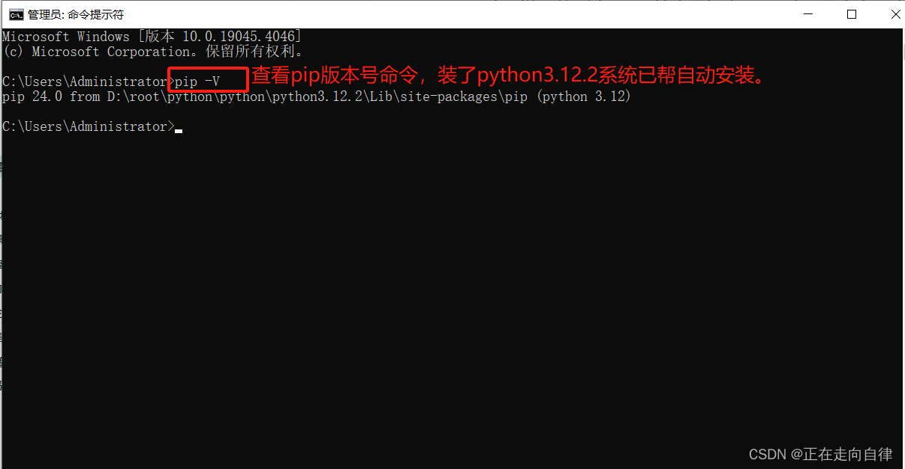


## 3、第一个python程序

- 打开cmd，输入python进入交互界面，输入下面代码后回车

~~~python
print('hello world')
~~~

- 输出：hello world

- 注意：<font color="red">**输入的双引号和括号都要使用英文的**</font>


## 4、第一个程序的常见问题

- 在命令提示符内输入 `python` 时，出现提示：

  ```
  'python' 不是内部或外部命令，也不是可运行的程序或批处理文件。
  ```

  - 原因：安装 Python 时，没有勾选 **Add Python 3.10 to PATH** 选项。

  - 解决步骤：

    1. 卸载当前 Python 程序。

    1. 重新运行 Python 安装程序，**务必勾选** `Add Python 3.10 to PATH` 选项（同时可勾选 `Install launcher for all users (recommended)`）。

    1. 安装完成后，重新打开命令提示符程序，即可正常使用 `python` 命令。

- 在命令提示符内直接执行 Python 代码时，出现提示：

  ```
  无法初始化设备 PRN
  ```

  - 原因：**没有进入 Python 解释器环境**，直接在 CMD 中执行了 Python 代码，系统误将 `print` 识别为 DOS 打印命令。
  - 解决步骤：
    - 在命令提示符中先输入 `python`，按下回车，等待出现 `>>>` 标记，代表已进入 Python 交互环境。
    - 在 `>>>` 后输入 Python 代码（如 `print("Hello World!!!!")`），再按下回车执行。

- 在 Python 交互环境中执行代码时，出现语法错误：

  ```
  SyntaxError: invalid character '“' (U+201C)
  ```

  - 原因：代码中使用了**中文符号**，Python 语法只识别英文符号。
  - 需要检查并修正的符号：
    - **双引号**：必须使用英文双引号 `" "`，不能使用中文双引号 `“ ”`
    - **小括号**：必须使用英文小括号 `( )`，不能使用中文小括号 `（ ）`


## 5、python解释器

- 计算机只认识二进制，即：0和1
- 所以计算机并不认识python代码，但是<font color="red">**通过python解释器程序将代码翻译成二进制**</font>，然后计算机就认识了


- python解释器的功能
  - 宏观功能
    - 翻译代码
    - 提交给计算机运行
  - 直接功能
    - 将 Python 代码翻译成计算机认识的 0 和 1 并提交计算机执行
    - 在解释器环境内可以一行行的执行我们输入的代码
    - 也可以使用解释器程序，去执行`.py`代码文件

- 解释器放在：python安装目录/python.exe
- cmd中执行python就是执行的这里的python.exe


- .py文件是什么

  - python语言的代码文件，里面记录了python代码

- 执行多行代码方式

  - 编写一个python.py文件

  ~~~python
  print('lzy')
  print('djb')
  ~~~

  - 然后通过cmd命令：python py文件

  ~~~bash
  python D:\test.py
  ~~~

- cmd退出python模式

  - exit()


# 二、一阶段

## 1、基础语法

### 1.1 字面量

- 字面量：在代码中，<font color="red">**被写下来的固定的值**</font>，称为字面量
- python中有6种数据类型

| 类型               | 描述                   | 说明                                                         |
| ------------------ | ---------------------- | ------------------------------------------------------------ |
| 数字（Number）     | 整数（int）            | 整数（int），如：10、-10                                     |
|                    | 浮点数（float）        | 浮点数（float），如：13.14、-13.14                           |
|                    | 复数（complex）        | 复数（complex），如：4+3 j，以 j 结尾表示复数                |
|                    | 布尔（bool）           | 布尔（bool）表达现实生活中的逻辑，即真和假，True表示真，False表示假。<font color="red">**True本质上是一个数字记作1，False记作0**</font> |
| 字符串（String）   | 描述文本的一种数据类型 | 字符串（String）由任意数量的字符组成                         |
| 列表（List）       | 有序的可变序列         | 使用最频繁的数据类型，可有序记录一堆数据                     |
| 元组（Tuple）      | 有序的不可变序列       | 可有序记录一堆不可变的python数据集合                         |
| 集合（Set）        | 无序不重复集合         | 可无序记录一堆不重复的python数据集合                         |
| 字典（Dictionary） | 无序key-value集合      | 可有序记录一堆key-value型的python数据集合                    |

- 字符串（String）：又称文本，由任意数量的字符如中文、英文、各类符号、数字等组成。所以叫做字符的串
  - python中，<font color="red">**字符串需要用引号包起来，被引号包起来的，都是字符串**</font>
  - 如："lzy"、"djb"
- 最常用的字面量

| 类型           | 程序中的写法 | 说明                                                         |
| -------------- | ------------ | ------------------------------------------------------------ |
| 整数           | 666、-88     | 和现实中的写法一致                                           |
| 浮点数（小数） | 13.14、-5.21 | 和现实中的写法一致                                           |
| 字符串（文本） | "lzy"        | <font color="red">**程序中需要加上双引号来表示字符串**</font> |

- 用print打印上述字面量

~~~python
print(666)
print(13.14)
print("lzy")
~~~


### 1.2 注释

- 注释：在程序代码中对程序代码进行解释说明的文字

- 作用：注释不是程序，<font color="red">**不能被执行**</font>，只是对程序代码进行解释说明，让别人可以看懂程序代码的作用，能够大大增强程序的可读性

- 注释类型

  - 单行注释：以 <font color="red">**#开头**</font>，#右边的所有文字当作说明，而不是真正要执行的程序，起辅助说明作用
    - 注：<font color="red">**#号和注释内容一般建议一个空格隔开**</font>

  ~~~python
  # 这是单行注释
  print("单行注释")
  ~~~

  - 多行注释：以<font color="red">**一对三个双括号**</font>引起来，("""注释内容""")来解释说明一段代码的作用和使用方法

  ~~~python
  """
  多行注释1
  多行注释2
  """
  print("多行注释")
  ~~~


### 1.3 变量

- 变量：<font color="red">**在程序运行时**</font>，能<font color="red">**存储**</font>计算结果或能<font color="red">**表示值**</font>的抽象概念
- 简单的说，<font color="red">**变量就是程序时，记录数据用的**</font>
- 定义格式
  - 变量名：每一个变量都有自己的名称，称之为：<font color="red">**变量名，也就是变量本身**</font>
  - =：赋值，表示<font color="red">**将等号右边的值，赋给左侧的变量**</font>
  - 变量值：每一个变量都有自己存储的值（内容），称之为：<font color="red">**变量值**</font>

~~~python
变量名 = 变量值
~~~

- 变量的特征：变量值可以改变

~~~python
# 定义一个变量
money = 10
print("金额为：", money)

# 变量改变
money = money + 1
print("修改后的金额为：", money)

"""
输出：
金额为： 10
修改后的金额为： 11
"""
~~~


### 1.4 数据类型

- 用type查看数据的类型
  - 可以查看字面量的类型
  - 可以查看变量的类型
  - <font color="red">**type带返回值，一般用print()打印type输出**</font>

~~~python
type(被查看数据)
print(type(被查看数据))
~~~

- 例子

~~~python
# 打印字面量类型
print(type(10))
print(type(1.15))
print(type("lzy"))

# 打印变量量类型
a = 10
b = 1.15
c = "lzy"
print(type(a))
print(type(b))
print(type(c))

"""
输出：
<class 'int'>
<class 'float'>
<class 'str'>
<class 'int'>
<class 'float'>
<class 'str'>
"""
~~~

- 问题：
  - 通过type(变量)可以输出类型，那么是查看变量的类型还是数据的类型
    - <font color="red">**查看的是：变量存储的数据的类型**</font>。因为变量无类型，但是它存储的数据有
    - <font color="red">**变量是没有类型的**</font>


### 1.5 数据类型转换

- 数据类型之间，在特定的场景下，是可以互相转换的，如字符串转数字、数字转字符串等
- 数据类型转换的场景
  - 从文件中读取的数字，默认是字符串，需要转为数字类型
  - 后续input()语句，默认结果是字符串，若需要数字也需要转换
  - 将数字转换成字符串用于写到外部系统
  - 等等
- 转换方法：<font color="red">**这三个方法都是带返回值的，可以直接用print()打印**</font>

| 语句(函数) | 说明                |
| ---------- | ------------------- |
| int(x)     | 将x转换为一个整数   |
| float(x)   | 将x转换为一个浮点数 |
| str(x)     | 将x转换为一个字符串 |

- 注意：
  - <font color="red">**浮点数转整数，会丢失精度，也就是小数部分**</font>
  - <font color="red">**字符串转数字，字符串必须要是数字才可以转，不然就会报错**</font>
- 例子

~~~python
# 整数转浮点数
float_num = float(10)
print(float_num)

# 浮点数转整数
int_num = int(1.5)
print(int_num)

# 数字转字符串
num_str = str(11)
print(type(num_str), num_str)

float_str = str(1.5)
print(type(float_str), float_str)

# 字符串转数字
num1 = int("10")
print(type(num1), num1)

num2 = float(1.5)
print(type(num2), num2)

num3 = int("lzy")
print(type(num3), num3)


"""
10.0
1
<class 'str'> 11
<class 'str'> 1.5
<class 'int'> 10
<class 'float'> 1.5
Traceback (most recent call last):
  File "D:\AI\code\final\multimodal\api\multimodal\Test.py", line 23, in <module>
    num3 = int("lzy")
           ^^^^^^^^^^
ValueError: invalid literal for int() with base 10: 'lzy'
"""
~~~


### 1.6 标识符

- 在python程序中，可以给很多东西取名，比如：
  - 变量名
  - 方法名
  - 类名
- 这些名字，统一称为标识符，用来左内容的标识
- 总结：<font color="red">**标识符是用户在编程的时候所使用的一系列名字，用于给变量、类、方法等命名**</font>

- 标识符命名规则
  - <font color="red">**内容限定**</font>：只允许出现英文、中文、数字、下划线_这四类
    - 不推荐使用中文
    - 数字不可以开头
  - <font color="red">**大小写敏感**</font>：小写字母和大写字母是不一样的
  - <font color="red">**不可以使用关键字**</font>：python中有一系列单词是关键字，有特定作用，所以标识符命名不可以用这些

~~~python
# 内容限定：只允许出现英文、中文、数字、下划线_这四类，数字不可以开头
# 错误代码示例：1_name = "张三"
# 错误代码示例：name_! = "张三"
name_1 = "张三"
print(name_1)

# 大小写敏感
a = "lzy"
A = "lzy"
print(a)
print(A)

# 不可以使用关键字
# 错误代码示例：True = "123"
~~~

- 标识符命名规范

  - 变量命名
    - 明了：变量名要能明确知道他是干啥的
    - 简洁：在确保"明了"的前提下，减少名字长度
    - <font color="red">**多个单词组合变量名，要使用下划线做分隔**</font>
    - <font color="red">**命名变量中的英文字母要全小写**</font>

  ~~~python
  single_name = "lzy"
  ~~~


### 1.7 运算符

- 算术运算符

| 运算符 | 描述   | 实例                                          |
| ------ | ------ | --------------------------------------------- |
| +      | 加     | 两个对象相加a + b 输出结果30                  |
| -      | 减     | 一个数减另一个数 a - b = 10                   |
| *      | 乘     | 两个数相乘                                    |
| /      | 除     | b / a 输出结果为2                             |
| //     | 取整数 | 返回商的整数部分 9 // 2 = 4，9.0 // 2.0 = 4.0 |
| %      | 取余   | 返回除法的余数b % a 输出结果为0               |
| **     | 指数   | a**b为10的3次方，输出1000                     |

- 例子

```python
# 算术运算符
print("1 + 1 = ", 1 + 1)
print("1 - 1 = ", 1 - 1)
print("2 * 2 = ", 2 * 2)
print("3 / 2 = ", 3 / 2)
print("3 // 2 = ", 3 // 2)
print("10 ** 3 = ", 10 ** 3)

"""
输出结果
1 + 1 =  2
1 - 1 =  0
2 * 2 =  4
3 / 2 =  1.5
3 // 2 =  1
10 ** 3 =  1000
"""
```

- 赋值运算符

| 运算符 | 描述       | 实例                                                         |
| ------ | ---------- | ------------------------------------------------------------ |
| =      | 赋值运算符 | 把=右边的结果赋给左边的变量，如num = 1 + 2 * 3，结果num的值为7 |

- 复合赋值运算符

| 运算符 | 描述           | 实例                       |
| ------ | -------------- | -------------------------- |
| +=     | 加法赋值运算符 | c += a 等价于 c = c + a    |
| -=     | 减法赋值运算符 | c -= a 等价于 c = c - a    |
| *=     | 乘法赋值运算符 | c *= a 等价于 c = c * a    |
| /=     | 除法赋值运算符 | c /= a 等价于 c = c / a    |
| %=     | 取余赋值运算符 | c %= a 等价于 c = c % a    |
| **=    | 幂赋值运算符   | c \**= a 等价于 c = c ** a |
| //=    | 取整赋值运算符 | c //= a 等价于 c = c // a  |

- 例子

~~~python
# 赋值运算符
num = 1
num += 2
print("num += 2：", num)
num -= 2
print("num -= 2：", num)
num *= 2
print("num *= 2：", num)
num /= 2
print("num /= 2：", num)
num %= 2
print("num %= 2：", num)
num //= 2
print("num //= 2：", num)
num **= 2
print("num **= 2：", num)

"""
输出结果
num += 2： 3
num -= 2： 1
num *= 2： 2
num /= 2： 1.0
num %= 2： 1.0
num //= 2： 0.0
num **= 2： 0.0
"""
~~~


### 1.8 字符串扩展

#### 1.8.1 字符串的三种定义方式

- 字符串在python中有多种定义形式
  - 单引号定义法：name = 'lzy'
  - 双引号定义法：name = "lzy"
  - 三引号定义法：name = """lzy"""
    - 三引号定义法，和多行注释一样，支持换行操作
    - 使用变量接收它，它就是字符串
    - 不使用变量接收，就可以作为多行注释使用

~~~python
# 单引号
name1 = '单引号'

# 双引号
name2 = "双引号"

# 三引号
name3 = """
三引号1
三引号2
三引号3
"""

print(name1)
print(name2)
print(name3)

"""
输出结果
单引号
双引号

三引号1
三引号2
三引号3
"""
~~~

- 如果要定义的字符串本身，就包含：单引号或者双引号本身
  - 单引号定义法：可以含双引号
  - 双引号定义法：可以含单引号
  - 可以使用转义字符（\）来将引号解除效用，变成普通字符串

~~~python
# 单引号
name1 = '单引号"'

# 双引号
name2 = "双引号'"

# 转义字符
name3 = "\"转义字符\""
name4 = '\'转义字符\''

print(name1)
print(name2)
print(name3)
print(name4)
"""
输出结果
单引号"
双引号'
"转义字符"
'转义字符'
"""
~~~


#### 1.8.2 字符串拼接

- 如果有两个字符串（文本）字面量，可以将其拼接成一个字符串，通过+号即可完成
  - print("lzy " + "djb")
  - 输出：lzy djb
- 字面量和变量 或 变量和变量之间也可以使用拼接

~~~python
# 正常拼接
name = "lzy"
address = "湖北武汉"
print("你好 " + name)
print(name + "住在" + address)

# 非正常拼接
age = 18
print("年龄 " + age)

"""
输出结果
Traceback (most recent call last):
  File "D:\AI\code\final\multimodal\api\multimodal\Test.py", line 9, in <module>
    print("年龄 " + age)
          ~~~~~~~~^~~~~
TypeError: can only concatenate str (not "int") to str
你好 lzy
lzy住在湖北武汉
"""
~~~

- 注意：<font color="red">**无法和非字符串之间进行拼接**</font>


#### 1.8.3 字符串格式化

- 问题：
  - <font color="red">**变量过多，拼接起来很麻烦**</font>
  - <font color="red">**字符串无法和数字或者其他类型完成拼接**</font>
- 使用字符串格式化的语法，完成字符串和变量的快速拼接
  - 其中%s
    - %表示：占位
    - s表示：将变量变成字符串放入占位的地方
    - 所以，综合起来的意思：先占个位置，等会有个变量过来，就把它变成字符串放到占位的位置
  - <font color="red">**多个变量占位，变量要用括号包起来，并按照占位顺序填入**</font>

~~~python
name = "lzy"
massage = "你好 %s" % name
print(massage)

age = 18
message = "%s今年%s岁" % (name, age)
print(message)

"""
结果
你好 lzy
lzy今年18岁
"""
~~~

- python中常用的数据类占位符

| 格式符号 | 转化                             |
| -------- | -------------------------------- |
| %s       | 将内容转换为字符串，放入占位位置 |
| %d       | 将内容转换为整数，放入占位位置   |
| %f       | 将内容转换为浮点数，放入占位位置 |

~~~python
name = "lzy"
age = 18
salary = 8888.88
message = "%s今年%d岁,工资%f" % (name, age, salary)
print(message)

"""
结果：
lzy今年18岁,工资8888.880000
"""
~~~


#### 1.8.4 格式化的精度控制

- 问题：上面的小数格式化的时候，8888.88输出后面多了4个0，现在想要只保留两位小数
- 使用辅助符号 "m.n" 来控制数据的宽度和精度
  - m：控制宽度，要求是数字（很少使用），<font color="red">**设置的宽度小于数字自身，不生效**</font>
  - n：控制小数点精度，要求是数字，<font color="red">**会进行小数的四舍五入**</font>
- 示例：
  - %5d，表示将整数的宽度控制在5位，如数字11，被设置成5d，就会变成：\[空格]\[空格]\[空格]11，用三个空格在左边补齐宽度
  - %5.2f，表示将宽度控制为5，小数点精度设置为2，小数点和小数部分也算入宽度计算。如11.345设置了%7.2f后，结果是\[空格]\[空格]11.35，2个空格补齐宽度，小数部分限制2位精度，四舍五入位.35

~~~python
num1 = 11
num2 = 11.345
print("数字11宽度限制5，结果是%5d" % num1)
print("数字11宽度限制1，结果是%1d" % num1)
print("数字11.345宽度限制7，小数精度为2，结果是%7.2f" % num2)
print("数字11.345不限制宽度，小数精度为2，结果是%.2fd" % num2)

"""
输出结果
数字11宽度限制5，结果是   11
数字11宽度限制1，结果是11
数字11.345宽度限制7，小数精度为2，结果是  11.35
数字11.345不限制宽度，小数精度为2，结果是11.35d
"""
~~~


#### 1.8.5 字符串格式化2

- 通过语法：<font color="red">**f"内容{变量}"的格式来快速格式化**</font>
- 特点
  - 不理会类型
  - 不做精度控制
- 适用于对精度没有要求的时候快速使用

~~~python
name = "lzy"
age = 18
message = f"{name}的年龄为{age}"
print(message)

"""
输出结果
lzy的年龄为18
"""
~~~


#### 1.8.6 表达式格式化

- 表达式：一条具有明确执行结果的代码语句
  - 如：1 + 1、5 * 2就是表达式，因为有具体结果，结果为一个数字
- 或者常见的表达式定义
  - name = "lzy"   age = 11 + 11
- 在字符串格式化的时候，可以直接格式化一个表达式
  - f"{表达式}"
  - "%s、%d、%f" % (表达式1, 表达式2, 表达式3)

~~~python
print("1 + 1的结果：%d" % (1 + 1))
print(f"1 + 1的结果：{1 + 1}")
print("字符串在python代码中的类型是：%s" % type("字符串"))

"""
输出结果
1 + 1的结果：2
1 + 1的结果：2
字符串在python代码中的类型是：<class 'str'>
"""
~~~


### 1.9 数据输入

- print()函数可以将内容（字面量、变量等）输出到屏幕上

- 与之对应的就是input()语句，用来获取键盘输入

  - 数据输入：input
  - 数据输出：print

- 使用方法

  - 使用input()语句从键盘获取输入
  - 使用一个变量接收（存储）input语句获取的键盘输入数据
  - 获取到的数据永远都是<font color="red">**字符串类型**</font>

  ~~~python
  变量 = input()
  或
  变量 = input(提示信息)
  ~~~

- 例子：

~~~python
a = input("你是谁：")
print(f"你是{a}")

"""
结果
你是谁：lzy
你是lzy
"""
~~~


## 2、判断语句

### 2.1 布尔类型和比较运算符

-   布尔（bool）表达现实生活中的逻辑，即真和假，True表示真，False表示假。<font color="red">**True本质上是一个数字记作1，False记作0**</font>
- 布尔类型的字面量
  - True 表示 真（是）
  - False 表示 假（否）
- 定义变量存储布尔类型数据：<font color="red">**变量名 = 布尔类型字面量**</font>
- 布尔类型不仅可以通过自行定义出来，也可以通过计算得来，即：<font color="red">**通过比较运算符进行比较运算得到布尔类型的结果**</font>

```python
result = 10 > 5
print(f"10 > 5的结果是：{result}, 类型为：{type(result)}")

result = (True == 1)
print(result)

"""
结果
10 > 5的结果是：True, 类型为：<class 'bool'>
True
"""
```

- 比较运算符

| 运算符 | 描述                                                         | 示例                          |
| ------ | ------------------------------------------------------------ | ----------------------------- |
| ==     | 判断内容<font color="red">**是否相等**</font>，满足为True，不满足为False | a = 3, b = 3, (a == b) 为True |
| !=     | 判断内容<font color="red">**是否不相等**</font>，满足为True，不满足为False | a = 1, b = 3, (a != b) 为True |
| >      | 判断运算符左侧内容<font color="red">**是否大于**</font>右侧内容，满足为True，不满足为False | a = 7, b = 3, (a > b) 为True  |
| <      | 判断运算符左侧内容<font color="red">**是否小于**</font>右侧内容，满足为True，不满足为False | a = 3, b = 7, (a < b) 为True  |
| \>=    | 判断运算符左侧内容<font color="red">**是否大于等于**</font>右侧内容，满足为True，不满足为False | a = 3, b = 3, (a >= b) 为True |
| <=     | 判断运算符左侧内容<font color="red">**是否小于等于**</font>右侧内容，满足为True，不满足为False | a = 3, b = 3, (a <= b) 为True |

- 例子

~~~python
bool_1 = True
bool_2 = False
print(f"bool_1的变量内容是：{bool_1}, 类型是{type(bool_1)}")
print(f"bool_2的变量内容是：{bool_2}, 类型是{type(bool_2)}")

num1 = 10
num2 = 5
print(f"10 == 5的而己过：{num1 == num2}")
print(f"10 != 5的而己过：{num1 != num2}")
print(f"10 > 5的而己过：{num1 > num2}")
print(f"10 < 5的而己过：{num1 < num2}")
print(f"10 >= 5的而己过：{num1 >= num2}")
print(f"10 <= 5的而己过：{num1 <= num2}")

"""
输出结果
bool_1的变量内容是：True, 类型是<class 'bool'>
bool_2的变量内容是：False, 类型是<class 'bool'>
10 == 5的而己过：False
10 != 5的而己过：True
10 > 5的而己过：True
10 < 5的而己过：False
10 >= 5的而己过：True
10 <= 5的而己过：False
"""
~~~


### 2.2 if语句的基本格式

- if语句的基本格式
  - <font color="red">**注意缩进**</font>：属于if语句的代码块，需要在前面填充4个空格
  - <font color="red">**条件判断后面有个冒号**</font>
  - 判断语句的结果必须是布尔类型True或者False
  - True会执行if内代码语句
  - False不会执行

~~~python
if 要判断的条件:
    条件成立时，要做的事情
~~~

- 例子

~~~python
age = 17
if age < 18:
    print("不可以羞羞")
    
"""
输出结果
不可以羞羞
"""
~~~


### 2.3 if else语句

- if else语句的基本格式
  - <font color="red">**注意缩进**</font>：属于if语句和else的代码块，需要在前面填充4个空格
  - <font color="red">**条件判断和else后面有个冒号**</font>
  - 判断语句的结果必须是布尔类型True或者False
  - True会执行if内代码语句
  - False会执行else内代码语句
  - else不需要判断条件，当if的条件不满足的时候else会执行

~~~python
if 条件:
    满足条件要做的事1
    满足条件要做的事2
    满足条件要做的事3
    ...
else:
    不满足条件要做的事1
    不满足条件要做的事2
    不满足条件要做的事3
    ...
~~~

- 例子：

~~~python
age = 18
if age >= 18:
    print("成年人")
else:
    print("未成年")
    
"""
输出结果
成年人
"""
~~~


### 2.4 if elif else语句

- if elif else语句的基本格式
  - <font color="red">**注意缩进**</font>：属于if语句、elif语句和else的代码块，需要在前面填充4个空格
  - <font color="red">**if语句、elif语句和else后面有个冒号**</font>
  - 判断语句的结果必须是布尔类型True或者False
  - 满足那个条件就执行哪个代码块的代码，所有条件都不满足就执行else的代码块内容
  - <font color="red">**判断条件是互斥且有序的**</font>，上一个条件满足就不会执行后面的代码块
  - elif可以写多个
  - else可省略不写，相当于三个独立的if判断

```python
if 条件1:
    满足条件1要做的事
    满足条件1要做的事
    ...
elif 条件2:
    满足条件2要做的事
    满足条件2要做的事
    ...
elif 条件3:
    满足条件3要做的事
    满足条件3要做的事
    ...
else:
    不满足条件要做的事1
    不满足条件要做的事2
    ...
```

- 例子：

```python
score = 60
if score >= 90.0:
    print(f"{score}分是A等")
elif score >= 80.0:
    print(f"{score}分是B等")
elif score >= 70.0:
    print(f"{score}分是C等")
elif score >= 60.0:
    print(f"{score}分是D等")
else:
    print(f"{score}分是不及格")
    
"""
输出结果
60分是D等
"""
```


### 2.5 判断语句的嵌套

- 基础语法格式如下

~~~python
if 条件1:
    满足条件1要做的事情1
    满足条件1要做的事情2
    
    if 条件2:
        满足条件2要做的事情1
        满足条件2要做的事情1
~~~

- 第二个if，属于第一个if内，只有第一个if满足条件，才会执行第二个if
- 嵌套的关键点
  - <font color="red">**空格缩进**</font>
  - 通过空格缩进，来决定语句之间的：<font color="red">**层级关系**</font>

- 例子

~~~python
print("欢迎来到动物园")
if int(input("请输入你的身高：")) > 120:
    print("你的身高大于120cm，不免费")
    print("如果你的vip等级高于3，可以免费")

    if int(input("请输入你的vip等级：")) > 3:
        print("你的vip等级高于3，可免费")
    else:
        print("你的vip等级不高于3，不可免费")
else:
    print("身高太低，免费")
    
"""
结果
欢迎来到动物园
请输入你的身高：123
你的身高大于120cm，不免费
如果你的vip等级高于3，可以免费
请输入你的vip等级：4
你的vip等级高于3，可免费
"""
~~~

- 总结
  - 嵌套判断语句可以用于多条件、多层次的逻辑判断
  - 嵌套判断语句可以根据需求，自由组合if elif else来构建多层次判断
  - 嵌套判断语句，<font color="red">**一定要注意空格缩进，python通过空格缩进来决定层级关系**</font>


## 3、循环语句

### 3.1 while循环

#### 3.1.1 while循环的基础语法

- while循环语句的语法
- 只要条件满足时，会无限循环执行
- 注意
  - while的条件需要得到布尔类型，True表示继续循环，False表示结束循环
  - 需要设置循环终止的条件，如：i += 1配合i < 10，就能确保10次后停止，否则将会无限循环
  - 空格缩进和if判断一样，都需要设置

~~~python
while 条件:
    条件满足时，做的事情
    条件满足时，做的事情
    条件满足时，做的事情
    ...
~~~

- 例子

~~~python
i = 0
while i < 10:
    print("我喜欢你")
    i += 1
    
"""
输出结果
我喜欢你
我喜欢你
我喜欢你
我喜欢你
我喜欢你
我喜欢你
我喜欢你
我喜欢你
我喜欢你
我喜欢你
"""
~~~


#### 3.1.2 while例子

- while循环例1：求1到100的和

~~~python
# 求1~100的和
sum = 0
i = 1
while i < 100:
    sum = sum + i
    i = i + 1

print(f"1~100的和{sum}")

"""
输出结果
1~100的和4950
"""
~~~

- 猜数字游戏

~~~python
# 获取范围在1-100的随机数字
import random
num = random.randint(1, 100)
# 定义一个变量，记录总共猜测了多少次
count = 0

# 通过一个布尔类型的变量，做循环是否继续的标记
flag = True
while flag:
    guess_num = int(input("请输入你猜测的数字:"))
    count += 1
    if guess_num == num:
        print("猜中了")
        # 设置为False就是终止循环的条件
        flag = False
    else:
        if guess_num > num:
            print("你猜的大了")
        else:
            print("你猜的小了")

print(f"你总共猜测了{count}次")
~~~


#### 3.1.3 while的嵌套

- 嵌套语句格式如下

~~~python
while 条件1:
    满足条件1要做的事情1
    满足条件1要做的事情2
    ...
    while 条件2:
        满足条件2要做的事情1
        满足条件2要做的事情1
        ...
~~~

- 使用注意的地方
  - 注意条件控制，避免无限循环
  - 多层嵌套，注意空格缩进来确定层级关系
- 例子

~~~python
"""
演示while循环的嵌套使用
"""

# 外层：表白100天的控制
# 内层：每天的表白都送10只玫瑰花的控制

i = 1
while i <= 100:
    print(f"今天是第{i}天，准备表白......")

    # 内层循环的控制变量
    j = 1
    while j <= 10:
        print(f"送给小美第{j}只玫瑰花")
        j += 1

    print("小美，我喜欢你")
    i += 1

print(f"坚持到第{i}天，表白成功")
~~~


#### 3.1.4 while循环例子

- 九九乘法表

~~~python
"""
演示使用while的嵌套循环
打印输出九九乘法表
"""

# 定义外层循环的控制变量
i = 1
while i <= 9:

    # 定义内层循环的控制变量
    j = 1
    while j <= i:
        # 内层循环的print语句，不要换行，通过\t制表符进行对齐
        print(f"{j} * {i} = {j * i}\t", end='')
        j += 1

    i += 1
    print()         # 输出一个换行
~~~


### 3.2 for循环

#### 3.2.1 for循环的基础用法

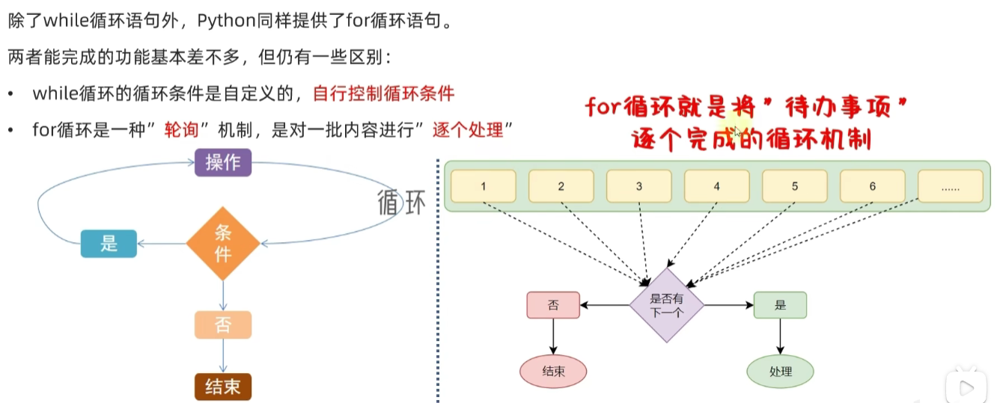

- 语法

~~~python
for 临时变量 in 待处理数据集:
    循环满足条件时执行的代码
~~~

- 例子

~~~python
# 定义字符串name
name = "lzy"

# for循环处理字符串
for x in name:
    print(x)
    
"""
执行结果
l
z
y
"""
~~~

- 注意
  - 同 while 循环不同，<font color="red">**for 循环是无法定义循环条件的**</font>。只能从被处理的数据集中，依次取出内容进行处理。所以，理论上讲，Python 的 for 循环无法构建无限循环（被处理的数据集不可能无限大）
  - 注意缩进


#### 3.2.2 for例子

```python
"""
演示for循环的练习题：数一数有几个a
"""
# 统计如下字符串中，有多少个字母a
name = "itheima is a brand of itcast"
# 定义数量
count = 0
for i in name:
    if i == "a":
        count += 1

print(f"name中有{count}个a")

"""
输出结果
name中有4个a
"""
```


#### 3.2.3 range语句

~~~python
for 临时变量 in 待处理数据集:
    循环满足条件时执行的代码
~~~

- 语法中的：待处理数据集，严格来说，称之为：<font color="red">**序列类型**</font>
- 序列类型指，**其内容可以一个个依次取出的一种类型**，包括：
  - 字符串
  - 列表
  - 元组
  - 等

- for 循环语句，本质上是遍历：序列类型。
- <font color="red">**通过`range`语句，获得一个简单的数字序列。**</font>
- 语法 1：`range(num)`
  - 获取一个从 0 开始，到`num`结束的数字序列（不含`num`本身）。
  - 如`range(5)`取得的数据是：`[0, 1, 2, 3, 4]`
- 语法 2：`range(num1, num2)`
  - 获得一个从`num1`开始，到`num2`结束的数字序列（不含`num2`本身）。
  - 如，`range(5, 10)`取得的数据是：`[5, 6, 7, 8, 9]`
- 语法 3：`range(num1, num2, step)`
  - 获得一个从`num1`开始，到`num2`结束的数字序列（不含`num2`本身）。
  - 数字之间的步长，以`step`为准（`step`默认为 1）。
  - 如，`range(5, 10, 2)`取得的数据是：`[5, 7, 9]`

~~~python
# range语法1 range(num)
# for x in range(10):
#     print(x)

# range 语法2 range(num1, num2)
# for x in range(5, 10):
#     # 从5开始，到10结束（不包含10本身）的一个数字序列，数字之间间隔是1
#     print(x)

# range 语法3 range(num1, num2, step)
# for x in range(5, 10, 2):
#     # 从5开始，到10结束（不包含10本身）的一个数字序列，数字之间的间隔是2
#     print(x)

for x in range(10):
    print("送玫瑰花")
~~~


#### 3.2.4 range例子

- 求100以内的偶数个数

~~~python
count = 0
for x in range (1, 100):
    if x % 2 == 0:
        count += 1

print(count)
~~~


#### 3.2.5 for循环临时变量作用域

- for 循环中的临时变量，其作用域限定为：<font color="red">**循环内**</font>

- 这种限定：

  - 是<font color="red">**编程规范**</font>的限定，而非强制限定

  - 不遵守也能正常运行，但是不建议这样做

  - 如需访问临时变量，可以预先在循环外定义它

```python
for i in range(3):
    print(i)

print(i)

"""
执行结果
0
1
2
2
"""
```


#### 3.2.6 for循环的嵌套

- 嵌套语句格式如下

~~~python
for 临时变量 in 待处理数据集(序列):
    # 外层循环满足条件时执行的代码
    循环满足条件应做的事情 1
    循环满足条件应做的事情 2
    ...
    循环满足条件应做的事情 N

    # 内层嵌套for循环
    for 临时变量 in 待处理数据集(序列):
        # 内层循环满足条件时执行的代码
        循环满足条件应做的事情 1
        循环满足条件应做的事情 2
        ...
        循环满足条件应做的事情 N
~~~

- 使用注意的地方
  - for循环和while循环可以一起用
  - 多层嵌套，注意空格缩进来确定层级关系

- 例子

~~~python
"""
演示for循环的嵌套使用
"""

# 外层：表白100天的控制
# 内层：每天的表白都送10只玫瑰花的控制

i = 0
for i in range(101):
    print(f"今天是第{i}天，准备表白......")
    # 内层循环的控制变量
    for j in range(11):
        print(f"送给小美第{j}只玫瑰花")
    print("小美，我喜欢你")

print(f"坚持到第{i}天，表白成功")
~~~


#### 3.2.7 for循环嵌套例子

- 九九乘法表

~~~python
"""
演示使用for的嵌套循环
打印输出九九乘法表
"""

# 定义外层循环的控制变量
for i in range(1, 10):
    # 定义内层循环的控制变量
    for j in range(1, i + 1):
        # 内层循环的print语句，不要换行，通过\t制表符进行对齐
        print(f"{j} * {i} = {j * i}\t", end='')

    print()         # 输出一个换行
~~~


### 3.3 循环中断

- 思考：无论是 while 循环或是 for 循环，都是重复性的执行特定操作。

- 在这个重复的过程中，会出现一些其它情况让我们不得不：

  - 暂时跳过某次循环，直接进行下一次

  - 提前退出循环，不再继续

- 对于这种场景，Python 提供`continue`和`break`关键字

- 用以对循环进行**临时跳过**和**直接结束**。


#### 3.3.1 continue语句

- `continue` 关键字用于：<font color="red">**中断本次循环，直接进入下一次循环**</font>
- `continue` 可以用于：`for` 循环和 `while` 循环，效果一致

~~~python
for i in range(1, 100):
    # 语句1
    continue
    # 语句2
~~~

- 在循环内，遇到 `continue` 就结束当前循环，直接进入下一次循环。
- 因此，`continue` 之后的**语句 2 不会被执行**。
- 应用场景
  - 在循环中，因某些原因（如满足特定条件）需要<font color="red">**临时跳过本次循环剩余逻辑**</font>时使用。
- 例子

~~~python
for i in range(1, 100):
    print("语句1")
    continue
    print("语句2")


"""
输出结果
只会输出语句1
"""
~~~


#### 3.3.2 break语句

- `break` 关键字用于：<font color="red">**直接结束循环**</font>
- `break` 可以用于：`for` 循环和 `while` 循环，效果一致

~~~python
for i in range(1, 100):
    # 语句1
    break
    # 语句2
    
# 语句3
~~~

- 在循环内，遇到 `break` 就结束整个循环
- 因此，`break` 之后**会直接执行语句3**。
- 应用场景
  - 在循环中，因某些原因（如满足特定条件）需要<font color="red">**直接结束循环**</font>时使用。
- 例子

~~~python
for i in range(1, 100):
    print("语句1")
    break
    print("语句2")

print("语句3")

"""
输出结果
语句1
语句3
"""
~~~


#### 3.3.3 总结

- continue和break，在for和while循环中作用一致
- 在嵌套循环中，只能作用在所在的循环上，无法对上层循环起作用


### 3.4 循环综合案例

- 某公司，账户余额有 1W 元，给 20 名员工发工资。
  - 员工编号从 1 到 20，从编号 1 开始，依次领取工资，每人可领取 1000 元
  - 领工资时，财务判断员工的绩效分（1-10）（随机生成），如果低于 5，不发工资，换下一位
  - 如果工资发完了，结束发工资。

~~~python
"""
某公司，账户余额有 1W 元，给 20 名员工发工资。
- 员工编号从 1 到 20，从编号 1 开始，依次领取工资，每人可领取 1000 元
- 领工资时，财务判断员工的绩效分（1-10）（随机生成），如果低于 5，不发工资，换下一位
- 如果工资发完了，结束发工资。
"""
import random

# 定义工资
money = 10000

for i in range(1, 11):
    # 随机生成绩效分
    score = random.randint(1, 10)
    # 绩效分低于5不发工资
    if score < 5:
        print(f"员工{i}绩效分低于5，不发工资，下一位")
        continue

    # 检查余额是否够发工资
    if money >= 1000:
        money -= 1000
        print(f"员工{i}发放工资1000元，账户余额剩余{money}元")
    else:
        print("账户余额不足，工资发完了，结束发工资")
        break
        
        
"""
输出结果：
员工1发放工资1000元，账户余额剩余9000元
员工2绩效分低于5，不发工资，下一位
员工3绩效分低于5，不发工资，下一位
员工4绩效分低于5，不发工资，下一位
员工5发放工资1000元，账户余额剩余8000元
员工6发放工资1000元，账户余额剩余7000元
员工7发放工资1000元，账户余额剩余6000元
员工8发放工资1000元，账户余额剩余5000元
员工9绩效分低于5，不发工资，下一位
员工10发放工资1000元，账户余额剩余4000元
"""
~~~


## 4、函数

### 4.1 基本概念

- 函数：是<font color="red">**组织好的，可重复使用的**</font>，用来<font color="red">**实现特定功能**</font>的代码段
- 优点
  - 将功能封装在函数内，可供随时随地重复使用
  - 提高程序的复用性，减少重复代码，提高开发效率


### 4.2 定义语法

- 定义语法

~~~python
def 函数名(传入参数):
    函数体
    return 返回值
~~~

- 注意：
  - <font color="red">**def关键字来定义**</font>
  - <font color="red">**传入参数和返回值可以省略**</font>
  - <font color="red">**函数必须先定义后使用**</font>

- 例子：编写一个获取字符串长度的函数

~~~python
"""
无参无返回函数
"""
def print_data():
    print("这是print_data函数")
    

"""
有参有返回函数
求字符串长度
"""
def get_str_len(data):
    count = 0
    for item in data:
        count += 1
    print(f"{data}的长度为{count}")
    return count

str1 = "lzy"
str2 = "love"
str3 = "djb"
get_str_len(str1)
get_str_len(str2)
get_str_len(str3)
print_data()

"""
输出结果
lzy的长度为3
love的长度为4
djb的长度为3
这是print_data函数
"""
~~~


### 4.3 传入参数

- 传入参数的功能：在函数进行计算的时候，接收外部（调用时）提供的数据
- 定义语法

~~~python
def 函数名(传入参数):
    函数体
    return 返回值
~~~

- 调用语法

~~~python
函数名(传入参数1, 传入参数2, ...)
~~~

- 定义一个两数相加的函数

~~~python
# 定义一个两数相加的函数
def add_data(x, y):
    print(f"{x} + {y} = {x+y}")
    return x + y

# 调用计算1 + 2
add_data(1, 2)
# 调用计算5 + 6
add_data(5, 6)


"""
1 + 2 = 3
5 + 6 = 11
"""
~~~

- 上述代码总结：

  - 函数定义中，提供的`x`和`y`，称之为：<font color="red">**形式参数（形参）**</font>，表示函数声明将要使用 2 个参数
    - 参数之间使用逗号进行分隔

  - 函数调用中，提供的`5`和`6`，称之为：<font color="red">**实际参数（实参）**</font>，表示函数执行时真正使用的参数值
    - 传入的时候，按照顺序传入数据，使用逗号分隔
  - 函数的参数数量不限，使用逗号分隔
  - 传入参数的时候，要和形式参数一一对应，逗号隔开


### 4.4 函数返回值

- 所谓 **“返回值”**，就是程序中函数完成事情后，最后给调用者的结果
- 用return关键字返回数据，用变量在外部进行接收
- 注意：<font color="red">**函数体在遇到return后就结束了，所以写在return后的代码就不会执行**</font>

- 定义语法

~~~python
def 函数名(传入参数):
    函数体
    return 返回值

变量 = 函数名(参数)
~~~

- 例子

~~~python
# 定义一个两数相加的函数
def add_data(x, y):

    return x + y

# 调用计算1 + 2
a = add_data(1, 2)
# 调用计算5 + 6
b = add_data(5, 6)
print(f"{a}， {b}")


"""
3，11
"""
~~~


### 4.5 None

- 思考：如果函数没有使用`return`语句返回数据，那么函数有返回值吗？
  - 实际上是：**有**的。

- Python 中有一个特殊的字面量：`None`，其类型是：`<class 'NoneType'>`
- 无返回值的函数，实际上就是返回了：`None`这个字面量
- `None`表示：<font color="red">**空的、无实际意义**</font>的意思
- 函数返回的`None`，就表示，这个函数没有返回什么有意义的内容。
- 也就是返回了**空**的意思。

~~~python
def say_hello():
    print("Hello...")

# 使用变量接收say_hello函数的返回值
result = say_hello()
# 打印返回值
print(result)          # 结果 None
# 打印返回值类型
print(type(result))    # 结果 <class 'NoneType'>
~~~

- `None`可以主动使用`return`返回，效果等同于不写`return`语句：

~~~python
def say_hello():
    print("Hello...")
    return None

# 使用变量接收say_hello函数的返回值
result = say_hello()
# 打印返回值
print(result)    # 结果 None
~~~

- 总结
  - 函数没有`return`时，默认返回`None`、
  - 主动写`return None`和不写`return`效果完全一样
  - None`代表 “空、无意义”，类型是`NoneType

- None 类型的应用场景

  - `None` 作为特殊字面量，用于表示**空、无意义**，主要应用场景：

  - <font color="red">**函数无返回值**</font>

    - 函数没有 `return` 语句时，默认返回 `None`；也可主动写 `return None`，效果一致。

  - <font color="red">**if 判断**</font>

    - 在 `if` 判断中，`None` 等同于 `False`。
    - 常用于函数返回 `None`，配合 `if` 做逻辑处理。

    ~~~python
    def check_age(age):
        if age > 18:
            return "SUCCESS"
        return None
    
    result = check_age(5)
    if not result:
        print("未成年，不可进入")  # 会执行，因为 result 是 None
    ~~~

  - <font color="red">**声明无内容的变量**</font>

    - 定义变量但暂时不需要具体值时，可用 `None` 占位：

    ~~~python
    # 暂不赋予变量具体值
    name = None
    ~~~

    

### 4.6 函数的说明

- 函数是纯代码语言，想要理解其含义，就需要一行行去阅读理解代码，效率比较低。
- 我们可以给函数添加**说明文档**，辅助理解函数的作用。

~~~python
def func(x, y):
    """
    函数说明
    :param x: 形参x的说明
    :param y: 形参y的说明
    :return: 返回值的说明
    """
    # 函数体
    return 返回值
~~~

- 通过多行注释（`"""..."""`）的形式，对函数进行说明解释
- 内容应写在函数体之前

- 示例代码

~~~python
def add(x, y):
    """
    计算两个数的和
    :param x: 第一个加数
    :param y: 第二个加数
    :return: 两个数的和
    """
    return x + y

# 查看函数说明文档
help(add)
~~~


### 4.7 函数嵌套

- 所谓函数嵌套调用指的是<font color="red">**一个函数里面又调用了另外一个函数**</font>

~~~python
def func_b():
    print("---2---")

def func_a():
    print("---1---")
    # 嵌套调用func_b
    func_b()
    print("---3---")

# 调用函数func_a
func_a()
~~~

- 如果函数a中，调用了另一个函数b，那么<font color="red">**先把函数b中的任务都执行完毕后才会回到上次函数a执行的位置**</font>
- b完成后，继续执行函数a的剩余部分


###  4.8 变量的作用域

- 变量作用域指的是变量的作用范围（变量在哪里可用，在哪里不可用），主要分为两类：**局部变量**和**全局变量**。

- 局部变量
  - 所谓局部变量是定义在**函数体内部**的变量，即只在函数体内部生效。
  - `num` 是定义在 `testA` 函数内部的变量，在函数外部访问会立即报错。
  - 局部变量的作用：在函数体内部**临时保存数据**，函数执行结束后，局部变量会被销毁。

~~~python
def testA():
    num = 100  # 局部变量
    print(num)

testA()        # 输出 100
print(num)     # 报错：name 'num' is not defined
~~~

- 所谓全局变量，**指的是在函数体内、外都能生效的变量**
  - 思考：如果有一个数据，在函数 A 和函数 B 中都要使用，该怎么办？
  - 答：将这个数据存储在一个全局变量里面


~~~python
# 定义全局变量a
num = 100

def testA():
    print(num)  # 访问全局变量num，并打印变量num存储的数据

def testB():
    print(num)  # 访问全局变量num，并打印变量num存储的数据

testA()  # 100
testB()  # 100
~~~

- global关键字
  - <font color="red">**在函数内部修改全局变量的值，出了函数不会生效**</font>
  - 如果想要在函数内部修改，需要加上global关键字

~~~python
num = 100

def a():
    print(num)

def b():
    global num		# 声明num为全局变量，在函数内部修改会在全局生效
    num = 200
    print(num)

a()
b()
print(num)


"""
输出结果
100
200
100
"""
~~~


### 4.9 综合案例

- 定义一个全局变量：`money`，用来记录银行卡余额（默认5000000）

- 定义一个全局变量：`name`，用来记录客户姓名（启动程序时输入）

- 定义如下的函数：

  - 查询余额函数

  - 存款函数

  - 取款函数

  - 主菜单函数

- 要求：

  - 程序启动后要求输入客户姓名

  - 查询余额、存款、取款后都会返回主菜单

  - 存款、取款后，都应显示一下当前余额

  - 客户选择退出或输入错误，程序会退出，否则一直运行

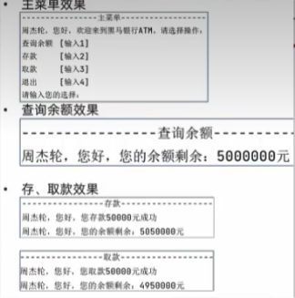

~~~python
"""
- 定义一个全局变量：`money`，用来记录银行卡余额（默认5000000）
- 定义一个全局变量：`name`，用来记录客户姓名（启动程序时输入）
- 定义如下的函数：
  - 查询余额函数
  - 存款函数
  - 取款函数
  - 主菜单函数
- 要求：
  - 程序启动后要求输入客户姓名
  - 查询余额、存款、取款后都会返回主菜单
  - 存款、取款后，都应显示一下当前余额
  - 客户选择退出或输入错误，程序会退出，否则一直运行
"""

# 定义全局变量：银行卡余额
money = 5000000
# 定义全局变量：客户姓名
name = ''


def get_money():
    """
    查询余额函数
    """
    print("-------------查询余额--------------")
    print(f"{name}，您好，您的余额剩余：{money}元")

def add_money(account):
    """
    存款函数
    :param account: 存款金额
    """
    global money
    money += account
    print("-------------存款--------------")
    print(f"{name}，您好，您存款{account}元成功")
    get_money()

def sub_money(account):
    """
    取款函数
    :param account: 取款金额
    """
    global money
    money -= account
    print("-------------取款--------------")
    print(f"{name}，您好，您取款{account}元成功")
    get_money()

def main():
    global name
    name = input("请输入你的姓名：")
    while True:
        print("-------------主菜单--------------")
        print(f"{name}，您好，欢迎来到ATM")
        print("查询余额 [输入1]")
        print("存款    [输入2]")
        print("取款    [输入3]")
        print("退出    [输入4]")
        type = input("请输入您的选择:")
        if type == "1":
            get_money()
        elif type == "2":
            add_money(5000)
        elif type == "3":
            sub_money(5000)
        else:
            print("退出系统，再见！")
            break

main()

"""
结果
请输入你的姓名：lzy
-------------主菜单--------------
lzy，您好，欢迎来到ATM
查询余额 [输入1]
存款    [输入2]
取款    [输入3]
退出    [输入4]
请输入您的选择:1
-------------查询余额--------------
lzy，您好，您的余额剩余：5000000元
-------------主菜单--------------
lzy，您好，欢迎来到ATM
查询余额 [输入1]
存款    [输入2]
取款    [输入3]
退出    [输入4]
请输入您的选择:2
-------------存款--------------
lzy，您好，您存款5000元成功
-------------查询余额--------------
lzy，您好，您的余额剩余：5005000元
-------------主菜单--------------
lzy，您好，欢迎来到ATM
查询余额 [输入1]
存款    [输入2]
取款    [输入3]
退出    [输入4]
请输入您的选择:3
-------------取款--------------
lzy，您好，您取款5000元成功
-------------查询余额--------------
lzy，您好，您的余额剩余：5000000元
-------------主菜单--------------
lzy，您好，欢迎来到ATM
查询余额 [输入1]
存款    [输入2]
取款    [输入3]
退出    [输入4]
请输入您的选择:4
退出系统，再见！
"""
~~~


## 5、数据容器

### 5.1 容器入门

- 什么是容器
  - 一种<font color="red">**可以容纳多份数据**</font>的数据类型，容纳的<font color="red">**每一份数据称之为1个元素**</font>
  - 每一个元素，可以是<font color="red">**任意类型**</font>的数据，如字符串、数字、布尔等
- 数据容器根据特点的不同，如
  - 是否支持重复元素
  - 是否可以修改
  - 是否有序等
- 分为5类
  - 列表（list）
  - 元组（tuple）
  - 字符串（str）
  - 集合（set）
  - 字典（dict）


### 5.2 列表（list）

#### 5.2.1 定义

- 问题引入

  - 思考：有一个人的姓名 (TOM) 怎么在程序中存储？
    - 答：**字符串变量**

  - 思考：如果一个班级 100 位学生，每个人的姓名都要存储，应该如何书写程序？声明 100 个变量吗？
    - 答：No，我们使用列表就可以了， 列表一次可以存储多个数据

- 定义基本语法

~~~python
# 字面量
[元素1, 元素2, 元素3, 元素4, ...]

# 定义变量
变量名称 = [元素1, 元素2, 元素3, 元素4, ...]

# 定义空列表
变量名称 = []
变量名称 = list()
~~~

- **列表核心概念：**
  - 列表内的<font color="red">**每一个数据，称之为元素**</font>
  - 以 `[]` 作为标识
  - 列表内每一个元素之间用 `,`（逗号）隔开

~~~python
# 字符串列表
name_list = ["lzy", "djb", "hz"]
print(name_list)
print(type(name_list))

# 不同类型的列表
my_list = ["lzy", 18, True]
print(my_list)
print(type(my_list))

# 嵌套列表
sub_list = [[1, 2, 3], [4, 5, 6], [7, 8, 9]]
print(sub_list)
print(type(sub_list))

"""
输出
['lzy', 'djb', 'hz']
<class 'list'>
['lzy', 18, True]
<class 'list'>
[[1, 2, 3], [4, 5, 6], [7, 8, 9]]
<class 'list'>
"""
~~~


#### 5.2.2 下标索引

- 可以通过下标索引取出对应位置的数据：<font color="red">**列表[下标]**</font>

- 要注意下标的范围，超出范围无法取出元素，并会报错：<font color="red">**IndexError: list index out of range**</font>

- 正向下标索引

  - 列表中的每一个元素，都有其位置下标索引，从前往后的方向，<font color="red">**从0开始，依次递增**</font>
  - 只需要按照下标索引，即可取出对应位置的元素

  ~~~python
  # 字符串列表
  name_list = ["lzy", "djb", "hz"]
  # 通过下标索引取出对应的数据
  print(name_list[0])       # 输出: lzy
  print(name_list[1])       # 输出: djb
  print(name_list[2])       # 输出: hz
  ~~~

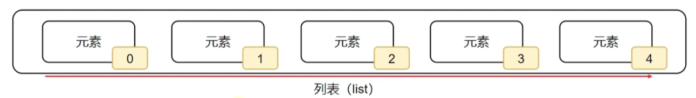

- 反向下标索引

  - 从后往前：<font color="red">**从-1开始，依次递减**</font>

  ~~~python
  # 字符串列表
  name_list = ["lzy", "djb", "hz"]
  # 通过下标索引取出对应的数据
  print(name_list[-1])       # 输出: hz
  print(name_list[-2])       # 输出: djb
  print(name_list[-3])       # 输出: lzy
  ~~~

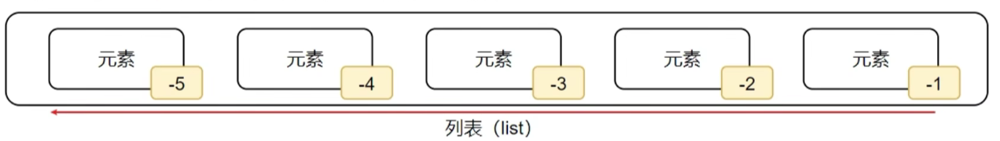

- 嵌套索引

  - 每个子列表作为一个元素看待
  - 然后每个子列表，又是一个列表，继续取对应的下标索引

  ~~~python
  # 嵌套列表
  sub_list = [[1, 2, 3], [4, 5, 6], [7, 8, 9]]
  # 通过下标索引取出对应的数据
  print(sub_list[0])       # 输出: [1, 2, 3]
  print(sub_list[0])       # 输出: [4, 5, 6]
  print(sub_list[2])       # 输出: [7, 8, 9]
  # 子列表的下标索引
  print(sub_list[0][0])       # 输出: 1
  print(sub_list[0][1])       # 输出: 2
  print(sub_list[0][2])       # 输出: 3
  ~~~

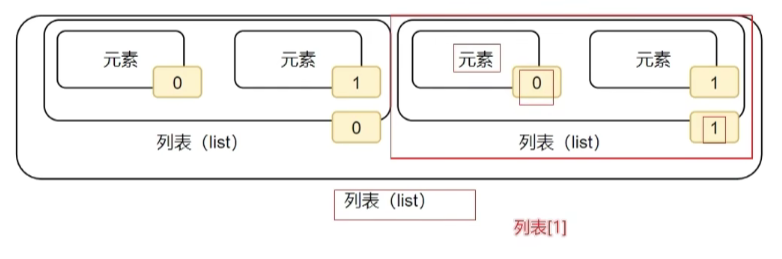

#### 5.2.3 常用操作

- 常用方法

| 方法 / 语法               | 功能描述                                         |
| ------------------------- | ------------------------------------------------ |
| `列表.append(元素)`       | 向列表中追加一个元素                             |
| `列表.extend(容器)`       | 将数据容器的内容依次取出，追加到列表尾部         |
| `列表.insert(下标, 元素)` | 在指定下标处，插入指定的元素                     |
| `del 列表[下标]`          | 删除列表指定下标元素                             |
| `列表.pop(下标)`          | 删除列表指定下标元素                             |
| `列表.remove(元素)`       | 从前向后，删除此元素第一个匹配项                 |
| `列表.clear()`            | 清空列表                                         |
| `列表.count(元素)`        | 统计此元素在列表中出现的次数                     |
| `列表.index(元素)`        | 查找指定元素在列表的下标，找不到报错`ValueError` |
| `len(列表)`               | 统计容器内有多少元素                             |

- 特点
  - 可以容纳多个元素（上限为 `2**63-1`，即 9223372036854775807 个）
  - 可以容纳不同类型的元素（混装）
  - 数据是<font color="red">**有序存储**</font>的（有下标序号）
  - <font color="red">**允许重复**</font>数据存在
  - <font color="red">**可以修改**</font>（增加或删除元素等）
- 例子

~~~python
# 定义一个列表
name_list = ["Java", "Python", "C/C++"]

# 1.1 查找某元素在列表内的下标索引
index = name_list.index("Java")
print(f"Java在列表中的下标索引值是: {index}")
# 1.2 如果被查找的元素不存在，会报错
# index = name_list.index("php")
# print(f"php在列表中的下标索引值是: {index}")     # 没有值会报错：ValueError: 'php' is not in list

# 2. 修改特定下标索引的值
name_list[2] = "php"
print(f"列表被修改后的值: {name_list}")

# 3. 在指定下标位置插入新元素
name_list.insert(2, "Go")
print(f"列表插入值后的值: {name_list}")

# 4. 在列表的尾部追加``单个``新元素
name_list.append("golang")
print(f"在列表的尾部追加后的值: {name_list}")

# 5. 在列表的尾部追加``一批``新元素
my_list = ["1", "2", "3"]
name_list.extend(my_list)
print(f"在列表的尾部追加一批后的值: {name_list}")


# 6. 删除指定下标索引的元素（2种方式）
# 6.1 方式1: del 列表[下标]
name_list = ["Java", "Python", "C/C++"]
del name_list[1]
print(f"列表删除后的值: {name_list}")

# 6.2 方式2: 列表.pop(下标)，同时可以取出元素让变量接收
name_list = ["Java", "Python", "C/C++"]
name = name_list.pop(1)
print(f"列表删除后的值: {name_list}")
print(f"删除后接收的值: {name}")

# 6.3 方式3：从前向后，删除此元素第一个匹配项
name_list = ["Java", "Python", "C/C++"]
name_list.remove("Python")
print(f"列表删除后的值: {name_list}")

# 7. 清空列表
name_list = ["Java", "Python", "C/C++"]
name = name_list.clear()
print(f"清空列表后的值: {name_list}")

# 8. 统计列表某一个元素的数量
name_list = ["Java", "Python", "C/C++", "Java", "Java"]
count = name_list.count("Java")
print(f"列表中Java的数量: {count}")

# 8. 统计列表所有元素的数量
name_list = ["Java", "Python", "C/C++", "Java", "Java"]
count = len(name_list)
print(f"列表所有元素的数量: {count}")


"""
Java在列表中的下标索引值是: 0
列表被修改后的值: ['Java', 'Python', 'php']
列表插入值后的值: ['Java', 'Python', 'Go', 'php']
在列表的尾部追加后的值: ['Java', 'Python', 'Go', 'php', 'golang']
在列表的尾部追加一批后的值: ['Java', 'Python', 'Go', 'php', 'golang', '1', '2', '3']
列表删除后的值: ['Java', 'C/C++']
列表删除后的值: ['Java', 'C/C++']
删除后接收的值: Python
列表删除后的值: ['Java', 'C/C++']
清空列表后的值: []
列表中Java的数量: 3
列表所有元素的数量: 5
"""
~~~


#### 5.2.4 案例

```python
"""
有一个列表，内容是：[21, 25, 21, 23, 22, 20]，记录的是一批学生的年龄
请通过列表的功能（方法），对其进行
定义这个列表，并用变量接收它
追加一个数字 31，到列表的尾部
追加一个新列表[29, 33, 30]，到列表的尾部
取出第一个元素（应是：21）
取出最后一个元素（应是：30）
查找元素 31，在列表中的下标位置
"""

# 1. 定义列表
num_list = [21, 25, 21, 23, 22, 20]

# 2. 追加31到尾部
num_list.append(31)

# 3. 追加新列表到尾部
num_list.extend([29, 33, 30])

# 4. 取出第一个元素
first = num_list[0]
print(f"第一个元素：{first}")  # 输出 21

# 5. 取出最后一个元素
last = num_list[-1]
print(f"最后一个元素：{last}")  # 输出 30

# 6. 查找31的下标
index = num_list.index(31)
print(f"元素31的下标位置：{index}")  # 输出 6
```


#### 5.2.5 列表遍历

- 什么是遍历？
  - 将容器内的元素依次**取出，并处理**，称之为遍历操作。

- 如何遍历列表的元素？
  - 可以使用 **while 或 for** 循环。
- while循环的语法：

~~~python
while 下标索引变量 < 列表元素数量:
    临时变量 = 列表[下标索引变量]
    下标索引变量+1
~~~

- for 循环的语法：

```python
for 临时变量 in 列表容器:
    # 对临时变量进行处理
```

- for 循环和 while 对比

  - for 循环更简单，while 更灵活

  - for 用于从容器内依次取出元素并处理，while 用以任何需要循环的场景

~~~python
def while_function(my_list):
    """
    while的循环
    :param my_list:
    :return:
    """
    index = 0
    while index < len(my_list):
        print(my_list[index])
        index += 1


def for_function(my_list):
    """
    for的循环
    :param my_list:
    :return:
    """
    for item in my_list:
        print(item)


# 定义列表
num_list = [1, 2, 3, 4, 5, 6, 7, 8, 9, 10]
while_function(num_list)
for_function(num_list)
~~~


#### 5.2.6 特点总结

- 可以容纳多个数据

- 可以容纳不同类型的数据（混装）

- 数据是有序存储的（下标索引）

- 允许重复数据存在

- <font color="red">**可以修改**</font>（增加或删除元素等）

- 支持 for 循环


### 5.3 元组（tuple）

#### 5.3.1 定义

- 思考：列表是<font color="red">**可以修改**</font>的。
  - 如果想要传递的信息，<font color="red">**不被篡改**</font>，列表就不合适了。
  - 元组同列表一样，都是可以封装多个、不同类型的元素在内。
- 但最大的不同点在于：
  - <font color="red">**元组一旦定义完成，就不可修改**</font>
  - 所以，当我们需要在程序内封装数据，又不希望封装的数据被篡改，那么元组就非常合适了
- 定义
  - 定义元组使用<font color="red">**小括号**</font>，且使用<font color="red">**逗号**</font>隔开各个数据，数据可以是<font color="red">**不同的数据类型**</font>
  - 注意事项：<font color="red">**元组只有一个数据的时候，这个数据后面要添加逗号**</font>
  - <font color="red">**元组支持嵌套**</font>
  - 取值跟列表一样，通过下标索引来取

~~~python
# 定义元组字面量
(元素, 元素, ... , 元素)
# 定义元组变量
变量名称 = (元素, 元素, ... , 元素)
# 定义空元组
变量名称 = ()        # 方式1
变量名称 = tuple()   # 方式2
# 根据下标索引取值
元组[索引下标]
~~~

- 例子

~~~python
# 定义一个3个元素的元组
t1 = ("lzy", 18, True)
# 定义一个1个元素的元组
t2 = ("djb",)
# 定义一个嵌套元组
t3 = ((1, 2, 3), (4, 5, 6))
print(t1)
print(type(t1))
print(t2)
print(type(t2))
print(t3)
print(type(t3))
# 根据索引下标取值
print(t1[1])
print(t3[1][1])

"""
输出结果
('lzy', 18, True)
<class 'tuple'>
('djb',)
<class 'tuple'>
((1, 2, 3), (4, 5, 6))
<class 'tuple'>
18
5
"""
~~~


#### 5.3.2 常用方法

| 编号 | 方法        | 作用                                               |
| ---- | ----------- | -------------------------------------------------- |
| 1    | `index()`   | 查找某个数据，如果数据存在返回对应的下标，否则报错 |
| 2    | `count()`   | 统计某个数据在当前元组出现的次数                   |
| 3    | `len(元组)` | 统计元组内的元素个数                               |

- 例子

~~~python
# 定义一个元组
t1 = ("lzy", "hz", "djb", "lzy", "djb")

# index查找方法
index = t1.index("hz")
print(f"hz的下标是：{index}")

# count统计方法
num = t1.count("lzy")
print(f"lzy的出现的个数是：{num}")

# len统计个数方法
num = len(t1)
print(f"t1元组中的元素个数是：{num}")


"""
输出结果
hz的下标是：1
lzy的出现的个数是：2
t1元组中的元素个数是：5
"""
~~~


#### 5.3.3 遍历

- while循环的语法：

~~~python
while 下标索引变量 < 元组元素数量:
    临时变量 = 元组[下标索引变量]
    下标索引变量+1
~~~

- for 循环的语法：

```python
for 临时变量 in 元组容器:
    # 对临时变量进行处理
```

- 例子

~~~python
def while_function(my_tuple):
    """
    while的循环
    :param my_tuple:
    :return:
    """
    index = 0
    while index < len(my_tuple):
        print(my_tuple[index])
        index += 1


def for_function(my_tuple):
    """
    for的循环
    :param my_tuple:
    :return:
    """
    for item in my_tuple:
        print(item)


# 定义元组
num_tuple = (1, 2, 3, 4, 5, 6, 7, 8, 9, 10)
while_function(num_tuple)
for_function(num_tuple)
~~~


#### 5.3.4 不可修改

- <font color="red">**元组定义之后就不可修改**</font>
- 如果尝试修改，就会报错：<font color="red">**TypeError: 'tuple' object does not support item assignment**</font>

~~~python
t1 = (1, 2, 3, 4, 5)
# 尝试修改
t1[0] = 100
print(t1)

"""
报错：
Traceback (most recent call last):
  File "D:\pythonProject\Test\test1.py", line 3, in <module>
    t1[0] = 100
    ~~^^^
TypeError: 'tuple' object does not support item assignment
"""
~~~


#### 5.3.5 特点总结

- 可以容纳多个数据

- 可以容纳不同类型的数据（混装）

- 数据是有序存储的（下标索引）

- 允许重复数据存在

- <font color="red">**不可以修改**</font>（增加或删除元素等）

- 支持 for 循环


### 5.4 字符串（str）

#### 5.4.1 定义

- 定义

  - 尽管字符串看起来并不像：列表、元组那样，一看就是存放了许多数据的容器。
  - 但不可否认的是，字符串同样也是数据容器的一员。

  - <font color="red">**字符串是字符的容器，一个字符串可以存放任意数量的字符**</font>

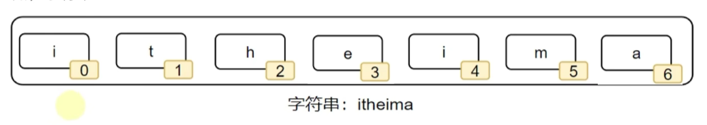

- 和其它容器如：列表、元组一样，字符串也可以通过下标进行访问
  - 从前向后，下标从 0 开始
  - 从后向前，下标从 - 1 开始

~~~python
# 通过下标获取特定位置字符
name = "itheima"
print(name[0])   # 结果i
print(name[-1])  # 结果a
~~~

- 字符串是一个：<font color="red">**无法修改**</font>的数据容器。
  - 修改指定下标的字符（如：`字符串[0] = "a"`）
  - 移除特定下标的字符（如：`del 字符串[0]`、`字符串.remove()`、`字符串.pop()`等）
  - 追加字符等（如：`字符串.append()`）
  - 均无法完成。如果必须要做，<font color="red">**只能通过创建新字符串来间接实现**</font>
  - 修改报错：TypeError: 'str' object does not support item assignment

~~~python
# 定义一个字符串
str1 = "lzy love djb"
# 输出索引下标为1的
print(str1[1])
# 尝试修改
str1[1] = "x"


"""
z
Traceback (most recent call last):
  File "D:\pythonProject\Test\test1.py", line 6, in <module>
    str1[1] = "x"
    ~~~~^^^
TypeError: 'str' object does not support item assignment
"""
~~~


#### 5.4.2 常用方法

- 字符串的常用操作

- | 方法 / 语法                      | 功能描述                                                     |
  | -------------------------------- | ------------------------------------------------------------ |
  | 字符串.index(字符串)             | 查找特定字符串的下标索引值                                   |
  | 字符串.replace(字符串1, 字符串2) | 将字符串内的全部**字符串1**，替换为**字符串 2**<br />注意：<font color="red">**不是修改字符串本身，而是得到了一个新字符串**</font> |
  | 字符串.split(分隔符字符串)       | 按照指定的**分隔符字符串**，将字符串划分为多个字符串，并存入**列表对象**中<br />**注意**：<font color="red">字符串本身不变，而是得到了一个**列表对象**</font> |
  | 字符串.strip()                   | 字符串的规整操作（去前后空格）                               |
  | 字符串.strip(字符串)             | 字符串的规整操作（去前后指定字符串）<br />注意：<font color="red">传入的若是"12"，其实就是"1"和"2"，都会移除，是按照单个字符</font> |
  | 字符串.count(字符串)             | 统计字符串内某字符串的出现次数                               |
  | len(字符串)                      | 统计字符串的字符个数                                         |

- 例子

~~~python
# 定义一个字符串
my_str = "lzy love djb"

# 通过索引下标取值
value1 = my_str[2]
value2 = my_str[-10]
print(f"从字符串{my_str}取下标为2的元素，值是：{value1}, 取下标为-10的元素，值是：{value2}")

# index方法，返回索引下标
index = my_str.index("love")
print(f"{my_str}中love的索引下标是：{index}")

# replace替换方法
new_str = my_str.replace("love", "like")
print(f"{my_str}替换后的新字符串是：{new_str}")

# spilt分割方法
my_list = my_str.split(" ")
print(f"{my_str}按空格分割后的新数据为：{my_list}")

# strip去除前后多余的字符串方法
# 不传值，就是去除前后的空格
my_str = "   lzy love djb  "
new_str = my_str.strip()
print(f"{my_str}去除前后空格后值为：{new_str}")

# 传值，就是去除前后的空格,传入的若是"12"，其实就是"1"和"2"，都会移除，是按照单个字符
my_str = "12lzy love djb21"
new_str = my_str.strip("12")
print(f"{my_str}去除前后12后值为：{new_str}")

# count统计字符串内某字符串的出现次数
count = my_str.count("love")
print(f"{my_str}中love出现的次数为：{count}")

# len统计字符串长度
count = len(my_str)
print(f"{my_str}字符串长度为：{count}")


"""
从字符串lzy love djb取下标为2的元素，值是：y, 取下标为-10的元素，值是：y
lzy love djb中love的索引下标是：4
lzy love djb替换后的新字符串是：lzy like djb
lzy love djb按空格分割后的新数据为：['lzy', 'love', 'djb']
   lzy love djb  去除前后空格后值为：lzy love djb
12lzy love djb21去除前后12后值为：lzy love djb
12lzy love djb21中love出现的次数为：1
12lzy love djb21字符串长度为：16
"""
~~~


#### 5.4.3 特点总结

- <font color="red">**只可以存储字符串**</font>
- 长度任意（取决于内存大小）
- 支持下标索引
- 允许重复字符串存在
- <font color="red">**不可以修改**</font>（增加或删除元素等）


### 5.5 数据容器（序列）的切片

#### 5.5.1 序列

- 序列是指：<font color="red">**内容连续、有序、可使用下标索引的一类数据容器**</font>
- font color="red">**列表、元组、字符串，均可以视为序列**</font>

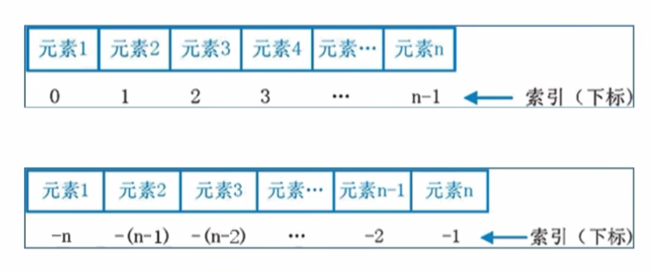


#### 5.5.2 切片

- 序列支持切片，即：列表、元组、字符串，均支持进行切片操作

- 切片：从一个序列中，取出一个子序列

- **语法：序列 [起始下标：结束下标：步长]**

- <font color="red">**表示从序列中，从指定位置开始，依次取出元素，到指定位置结束，得到一个新序列**</font>

  - 起始下标表示从何处开始，可以留空，留空视作从头开始

  - 结束下标<font color="red">**（不含）**</font>表示何处结束，可以留空，留空视作截取到结尾

  - 步长表示，依次取元素的间隔，可以省略，省略则表示为1
    - 步长 1 表示，一个个取元素
    - 步长 2 表示，每次跳过 1 个元素取
    - 步长 N 表示，每次跳过 N-1 个元素取
    - 步长为负数表示，反向取（注意，<font color="red">**起始下标和结束下标也要反向标记**</font>）

- 注意：<font color="red">**切片操作不会影响序列本身，而是会得到一个新的序列（列表、元组、字符串）**</font>

~~~python
# 对list进行切片，从1开始，4结束，步长1
my_list = [0, 1, 2, 3, 4, 5, 6]
new_list = my_list[1:5]
print(f"new_list: {new_list}")

# 对tuple进行切片，从头开始，到最后结束，步长1
my_tuple = [0, 1, 2, 3, 4, 5, 6]
new_tuple = my_tuple[::1]
print(f"new_tuple: {new_tuple}")

# 对str进行切片，从头开始，到最后结束，步长2
my_str = "0123456"
new_str = my_tuple[::2]
print(f"new_str: {new_str}")

# 对str进行切片，从头开始，到最后结束，步长-1,等于取反
new_str = my_tuple[::-1]
print(f"new_str: {new_str}")

# 对列表进行切片，从3开始，到1结束，步长-1
new_list = my_list[3:1:-1]
print(f"new_list: {new_list}")

# 对元组进行切片，从头开始，到尾结束，步长-2
new_tuple = my_tuple[::-2]
print(f"new_tuple: {new_tuple}")


"""
new_list: [1, 2, 3, 4]
new_tuple: [0, 1, 2, 3, 4, 5, 6]
new_str: [0, 2, 4, 6]
new_str: [6, 5, 4, 3, 2, 1, 0]
new_list: [3, 2]
new_tuple: [6, 4, 2, 0]
"""
~~~

- 例子

~~~python
my_str = "万过薪月，员序程马黑来，nohtyP"

# 倒序字符串，切片取出
result1 = my_str[::-1][9:14]
print(f"方式1结果：{result1}")

# 切片取出，然后倒序
result2 = my_str[5:10][::-1]
print(f"方式2结果：{result2}")


"""
方式1结果：马程序员，
方式2结果：黑马程序员
"""
~~~


### 5.6 集合（set）

#### 5.6.1 定义

- <font color="red">**不支持元素的重复（自带去重功能），并且内容无序**</font>

~~~python
# 定义集合字面量
{元素, 元素, ......, 元素}

# 定义集合变量
变量名称 = {元素, 元素, ......, 元素}

# 定义空集合
变量名称 = set()
~~~

- 和列表、元组、字符串等定义基本相同
  - 列表使用：[]
  - 元组使用：()
  - 字符串使用：""
  - 集合使用：{}

~~~~python
my_set = {"lzy", "lyx", "lzy", "lyx", "djb", "djb"}
my_set_empty = set()
print(f"my_set的内容是：{my_set}, 类型是：{type(my_set)}")
print(f"my_set_empty的内容是：{my_set_empty}, 类型是：{type(my_set_empty)}")

"""
my_set的内容是：{'lzy', 'djb', 'lyx'}, 类型是：<class 'set'>
my_set_empty的内容是：set(), 类型是：<class 'set'>
"""
~~~~


#### 5.6.2 常用方法

- 首先，因为集合是无序的，所以集合<font color="red">**不支持：下标索引访问**</font>
- 但是集合和列表一样，是<font color="red">**允许修改**</font>的，所以我们来看看集合的修改方法

|              方法              | 描述                                                         |
| :----------------------------: | :----------------------------------------------------------- |
|         集合.add(元素)         | 功能：将指定元素，添加到集合内<br />结果：集合本身被修改，添加了新元素 |
|       集合.remove(元素)        | 功能：将指定元素，从集合内移除<br />结果：集合本身被修改，移除了元素 |
|           集合.pop()           | 功能：从集合中随机取出一个元素<br />结果：会得到一个元素的结果，同时集合本身被修改，元素被移除 |
|          集合.clear()          | 功能：清空集合<br />结果：集合本身被清空                     |
|    集合1.difference(集合2)     | 功能：取出集合 1 和集合 2 的差集（即集合 1 有而集合 2 没有的元素）<br />结果：<font color="red">**得到一个新集合，集合 1 和集合 2 本身保持不变**</font> |
| 集合1.difference_update(集合2) | 功能：对比集合 1 和集合 2，<font color="red">**在集合 1 内删除和集合 2 相同的元素**</font><br />结果：<font color="red">**集合 1 被修改，集合 2 保持不变**</font> |
|       集合1.union(集合2)       | 功能：将集合 1 和集合 2 组合成新集合（自动去重）<br />结果：<font color="red">**得到新集合，集合 1 和集合 2 本身保持不变**</font> |
|           len(集合)            | 统计集合中的元素个数                                         |
|       for item in 集合:        | 遍历集合                                                     |

- 例子

~~~python
# 添加元素
my_set = {"Hello", "World"}
my_set.add("itheima")
print(my_set)  # 结果 {'Hello', 'itheima', 'World'}

# 移除元素
my_set = {"Hello", "World", "itheima"}
my_set.remove("Hello")
print(my_set)  # 结果 {'world', 'itheima'}

# pop随机移除元素
my_set = {"Hello", "World", "itheima"}
element = my_set.pop()
print(my_set)      # 结果 {'world', 'itheima'}
print(element)      # 结果 'Hello'

# 清空元素
my_set = {"Hello", "World", "itheima"}
my_set.clear()
print(my_set)       # 结果：set() （空集合）

# 取差集
set1 = {1, 2, 3}
set2 = {1, 5, 6}
set3 = set1.difference(set2)
print(set3)      # 结果：{2, 3}（得到的新集合）
print(set1)      # 结果：{1, 2, 3}（原集合不变）
print(set2)      # 结果：{1, 5, 6}（原集合不变）

# 集合合并
set1 = {1, 2, 3}
set2 = {1, 5, 6}
set3 = set1.union(set2)
print(set3)      # 结果：{1, 2, 3, 5, 6}（新集合）
print(set1)      # 结果：{1, 2, 3}（set1不变）
print(set2)      # 结果：{1, 5, 6}（set2不变）

# 消除差集
set1 = {1, 2, 3}
set2 = {1, 5, 6}
set1.difference_update(set2)
print(set1)      # 结果：{2, 3}
print(set2)      # 结果：{1, 5, 6}

# 统计集合个数
my_set = {1, 2, 3}
print(len(my_set))   # 结果：3

# 遍历集合
my_set = {1, 2, 3}
for item in my_set:
    print(item)

~~~


#### 5.6.3 特点总结

- 可以容纳多个数据
- 可以容纳不同类型的数据（混装）
- 数据是<font color="red">**无序存储的（不支持下标索引）**</font>
- <font color="red">**不允许重复**</font>数据存在
- <font color="red">**可以修改**</font>（增加或删除元素等）
- 支持 for 循环


### 5.7 字典

#### 5.7.1 定义

- 字典的定义，同样使用`{}`，不过存储的元素是一个个的：<font color="red">**键值对**</font>，如下语法：
- 注意：<font color="red">key值不可重复</font>，重复添加等同于覆盖原有数据

~~~python
# 定义字典字面量
{key: value, key: value, ......, key: value}

# 定义字典变量
my_dict = {key: value, key: value, ......, key: value}

# 定义空字典
my_dict = {}          # 空字典定义方式1
my_dict = dict()      # 空字典定义方式2
~~~

- 字典同集合一样，不可以使用下标索引。但是<font color="red">字典可以通过 **Key 值** 来取得对应的 Value</font>

~~~python
value = 字典["key"]
~~~

- 字典可以嵌套，value值为另一个字典

~~~python
{key: value, key: {key: value}}
~~~

- 嵌套字典取值

~~~python
value = 字典["key"]["key"]
~~~

- 例子

~~~python
# 定义一个字典
my_dict = {"id": "001", "name": "lzy", "age": 18}
print(my_dict["name"])
print(type(my_dict))

# 定义一个空字典
my_dict1 = {}
my_dict2 = dict()
print(type(my_dict1))
print(type(my_dict2))

# 字典嵌套
other_dict = {"id": "002", "name": "djb", "age": 18}
my_dict = {"id": "001", "name": "lzy", "age": 18, "lover": other_dict}
print(my_dict)
print(my_dict["lover"]["name"])

"""
lzy
<class 'dict'>
<class 'dict'>
<class 'dict'>
{'id': '001', 'name': 'lzy', 'age': 18, 'lover': {'id': '002', 'name': 'djb', 'age': 18}}
djb
"""
~~~


#### 5.7.2 常用操作

| 操作                | 说明                                                         |
| ------------------- | ------------------------------------------------------------ |
| `字典[Key]`         | 获取指定 Key 对应的 Value 值                                 |
| `字典[Key] = Value` | 添加或更新键值对<br /><font color="red">**字典 Key 不可以重复，所以对已存在的 Key 执行上述操作，就是更新 Value 值**</font> |
| `字典.pop(Key)`     | 获得指定 Key 的 Value，同时字典被修改，指定 Key 的数据被删除 |
| `字典.clear()`      | 字典被修改，元素被清空                                       |
| `字典.keys()`/      | 获取字典的全部 Key，可用于 for 循环遍历字典                  |
| `len(字典)`         | 计算字典内的元素数量                                         |

- 例子

```python
# 定义一个字典
a_dict = {"周杰伦": 90, "林俊杰": 91, "汪峰": 81, "王菲": 80}

# 获取指定 Key 对应的 Value 值
print(f"周杰伦的评分：{a_dict["周杰伦"]}")

# 添加元素
a_dict["陶喆"] = 89
print(f"添加元素后：{a_dict}")

# 修改元素
a_dict["陶喆"] = 88
print(f"修改元素后：{a_dict}")

# 获得指定 Key 的 Value，同时字典被修改，指定 Key 的数据被删除
num = a_dict.pop("陶喆")
print(f"删除元素后：{a_dict}")
print(f"删除元素：{num}")

# 获取所有key方法1
all_key = a_dict.keys()
for key in all_key:
    print(f"<UNK>{key}")

# 获取所有key方法2
for key in a_dict:
    print(f"<UNK>{key}")

# 获取长度
print(len(a_dict))


"""
周杰伦的评分：90
添加元素后：{'周杰伦': 90, '林俊杰': 91, '汪峰': 81, '王菲': 80, '陶喆': 89}
修改元素后：{'周杰伦': 90, '林俊杰': 91, '汪峰': 81, '王菲': 80, '陶喆': 88}
删除元素后：{'周杰伦': 90, '林俊杰': 91, '汪峰': 81, '王菲': 80}
删除元素：88
<UNK>周杰伦
<UNK>林俊杰
<UNK>汪峰
<UNK>王菲
<UNK>周杰伦
<UNK>林俊杰
<UNK>汪峰
<UNK>王菲
4
"""
```


#### 5.7.3 特点总结

- 可以容纳**多个数据**
- 可以容纳不同**类型的数据**
- 每一份数据是 **KeyValue 键值对**
- 可以通过 Key 获取到 Value，**Key 不可重复**（重复会覆盖）
- <font color="red">**不支持下标索引**</font>
- <font color="red">**可以修改**</font>（增加或删除更新元素等）
- <font color="red">**支持 for 循环，不支持 while 循环**</font>


### 5.8 容器特点对比

|              | 列表                             | 元组                               | 字符串             | 集合                   | 字典                                           |
| ------------ | -------------------------------- | ---------------------------------- | ------------------ | ---------------------- | ---------------------------------------------- |
| **元素数量** | 支持多个                         | 支持多个                           | 支持多个           | 支持多个               | 支持多个                                       |
| **元素类型** | 任意                             | 任意                               | 仅字符             | 任意                   | Key: ValueKey：除字典外任意类型Value：任意类型 |
| **下标索引** | 支持                             | 支持                               | 支持               | 不支持                 | 不支持                                         |
| **重复元素** | 支持                             | 支持                               | 支持               | 不支持                 | 不支持                                         |
| **可修改性** | 支持                             | 不支持                             | 不支持             | 支持                   | 支持                                           |
| **数据有序** | 是                               | 是                                 | 是                 | 否                     | 否                                             |
| **使用场景** | 可修改、可重复的一批数据记录场景 | 不可修改、可重复的一批数据记录场景 | 一串字符的记录场景 | 不可重复的数据记录场景 | 以 Key 检索 Value 的数据记录场景               |


### 5.9 容器的通用操作

- 在遍历上：
  - 五类数据都支持for循环
  - 列表、元组、字符串支持while循环；集合、字典不支持（没有索引下标）

| 功能                           | 描述                                                         |
| ------------------------------ | ------------------------------------------------------------ |
| 通用 `for` 循环                | 遍历容器（字典是遍历 key）                                   |
| `max()`                        | 容器内最大元素                                               |
| `min()`                        | 容器内最小元素                                               |
| `len()`                        | 容器元素个数                                                 |
| `list()`                       | 转换为列表                                                   |
| `tuple()`                      | 转换为元组                                                   |
| `str()`                        | 转换为字符串                                                 |
| `set()`                        | 转换为集合                                                   |
| `sorted(序列, [reverse=True])` | 排序，`reverse=True` 表示降序；返回一个<font color="red">**排好序的新列表**</font>（注意：`sorted` 不修改原序列，列表的 `sort()` 方法才会直接修改原列表） |

- 例子

~~~python
# 定义容器数据
my_list = [1, 2, 3, 4, 5]
my_tuple = (1, 2, 3, 4, 5)
my_str = "abcdefg"
my_set = {1, 2, 3, 4, 5}
my_dict = {"key1": 5, "key2": 4, "key3": 3, "key4": 2, "key5": 1}

# len 元素个数
print(f"列表 元素个数有: {len(my_list)}")
print(f"元组 元素个数有: {len(my_tuple)}")
print(f"字符串 元素个数有: {len(my_str)}")
print(f"集合 元素个数有: {len(my_set)}")
print(f"字典 元素个数有: {len(my_dict)}")

print("===================================")

# max 最大元素
print(f"列表 最大元素: {max(my_list)}")
print(f"元组 最大元素: {max(my_tuple)}")
print(f"字符串 最大元素: {max(my_str)}")
print(f"集合 最大元素: {max(my_set)}")
print(f"字典 最大元素: {max(my_dict)}")

print("===================================")

# min 最小元素
print(f"列表 最小元素: {min(my_list)}")
print(f"元组 最小元素: {min(my_tuple)}")
print(f"字符串 最小元素: {min(my_str)}")
print(f"集合 最小元素: {min(my_set)}")
print(f"字典 最小元素: {min(my_dict)}")

print("===================================")

# 类型转换: 容器转列表
print(f"列表 容器转列表: {list(my_list)}")
print(f"元组 容器转列表: {list(my_tuple)}")
print(f"字符串 容器转列表: {list(my_str)}")
print(f"集合 容器转列表: {list(my_set)}")
print(f"字典 容器转列表: {list(my_dict)}")

print("===================================")

# 类型转换: 容器转元组
print(f"列表 容器转元组: {tuple(my_list)}")
print(f"元组 容器转元组: {tuple(my_tuple)}")
print(f"字符串 容器转元组: {tuple(my_str)}")
print(f"集合 容器转元组: {tuple(my_set)}")
print(f"字典 容器转元组: {tuple(my_dict)}")

print("===================================")

# 类型转换: 容器转字符串
print(f"列表 容器转字符串: {str(my_list)}")
print(f"元组 容器转字符串: {str(my_tuple)}")
print(f"字符串 容器转字符串: {str(my_str)}")
print(f"集合 容器转字符串: {str(my_set)}")
print(f"字典 容器转字符串: {str(my_dict)}")

print("===================================")

# 类型转换: 容器转集合
print(f"列表 容器转集合: {set(my_list)}")
print(f"元组 容器转集合: {set(my_tuple)}")
print(f"字符串 容器转集合: {set(my_str)}")
print(f"集合 容器转集合: {set(my_set)}")
print(f"字典 容器转集合: {set(my_dict)}")


print("===================================")

# 类型转换: 容器排序
print(f"列表 容器排序: {sorted(my_list, reverse=True)}")
print(f"元组 容器排序: {sorted(my_tuple, reverse=True)}")
print(f"字符串 容器排序: {sorted(my_str, reverse=True)}")
print(f"集合 容器排序: {sorted(my_set, reverse=True)}")
print(f"字典 容器排序: {sorted(my_dict, reverse=True)}")
~~~


### 5.10 比较字符串大小

- ASCII 码表
  - 在程序中，字符串所用的所有字符如：
    - 大小写英文单词
    - 数字
    - 特殊符号（!、\、|、@、#、空格等）
  - 都有其对应的 ASCII 码表值
  - 每一个字符都能对应上一个：<font color="red">**数字的码值**</font>
  - <font color="red">**字符串进行比较就是基于数字的码值大小进行比较的**</font>

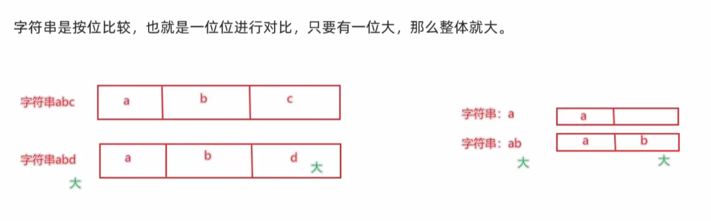

~~~python
# abc 比较 abd
print(f"abd大于abc，结果：{'abd' > 'abc'}")
# a 比较 ab
print(f"ab大于a，结果：{'ab' > 'a'}")
# a 比较 A
print(f"a 大于 A，结果：{'a' > 'A'}")
# key1 比较 key2
print(f"key2 大于 key1，结果：{'key2' > 'key1'}")

"""
abd大于abc，结果：True
ab大于a，结果：True
a 大于 A，结果：True
key2 大于 key1，结果：True
"""
~~~


## 6、函数进阶

### 6.1 函数多返回值

- 问题
  - 如果一个函数写两个`return`（如下所示），程序如何执行？
  - 答：只执行了第一个`return`，原因是`return`会退出当前函数，导致`return`下方的代码不会执行。

~~~python
def return_num():
    return 1
    return 2

result = return_num()
print(result)  # 1
~~~

- <font color="red">**函数多返回值的写法**</font>
  - **返回规则**：多个变量用逗号隔开
  - **接收规则**：按照返回值的顺序，写对应顺序的多个变量接收即可，变量之间用逗号隔开。
  - **数据类型**：支持不同类型的数据一起`return`。

~~~python
# 定义一个多返回值的函数
def test_return():
    return "lzy", 1, False

x, y, z = test_return()
print(x)  # 结果 "lzy"
print(y)  # 结果 1
print(z)  # 结果 False
~~~


### 6.2 函数多种传参方式

#### 6.2.1 位置参数

- **定义**：调用函数时根据函数定义的参数位置来传递参数

~~~python
def user_info(name, age, gender):
    print(f'您的名字是{name}，年龄是{age}，性别是{gender}')

user_info('TOM', 20, '男')
~~~

- 注意：传递的参数和定义的参数的<font color="red">**顺序及个数必须一致**</font>


#### 6.2.2 关键字参数

- **定义**：函数调用时通过「**键 = 值**」形式传递参数
- **作用**：可以让函数更加清晰、容易使用，同时也清除了参数的顺序需求

~~~python
def user_info(name, age, gender):
    print(f"您的名字是：{name}，年龄是：{age}，性别是：{gender}")

# 关键字传参
user_info(name="小明", age=20, gender="男")

# 可以不按照固定顺序
user_info(age=20, gender="男", name="小明")

# 可以和位置参数混用，位置参数必须在前，且匹配参数顺序
user_info("小明", age=20, gender="男")
~~~

- 注意：函数调用时，如果有位置参数，<font color="red">**位置参数必须在关键字参数的前面，但关键字参数之间不存在先后顺序**</font>
  - 如果没遵循这个原则，就会报错：SyntaxError: positional argument follows keyword argument


#### 6.2.3 缺省参数（默认参数）

- **定义**：缺省参数也叫默认参数，用于定义函数，为参数提供默认值，调用函数时可不传该默认参数的值（注意：所有位置参数必须出现在默认参数前，包括函数定义和调用）。

- **作用**：当调用函数时没有传递参数，就会使用缺省参数对应的默认值。

~~~python
def user_info(name, age, gender='男'):
    print(f'您的名字是{name}，年龄是{age}，性别是{gender}')

# 不传默认参数，使用默认值
user_info('TOM', 20)
# 传值则覆盖默认值
user_info('Rose', 18, '女')
~~~

- **注意**：函数调用时，<font color="red">**如果为缺省参数传值则修改默认参数值，否则使用这个默认值**</font>


#### 6.2.4 不定长参数不定长参数

- **定义**：不定长参数也叫**可变参数**，用于 <font color="red">**不确定调用时会传递多少个参数（不传参也可以）** </font>的场景。

- **作用**：当调用函数时不确定参数个数时，可以使用不定长参数。

- **不定长参数的类型**：

  - <font color="red">**位置传递（不定长参数之位置传递）**</font>

    - <font color="red">**用 * 号定义**</font>

    ~~~python
    def user_info(*args):
        print(args)
        print(type(args))			# <class 'tuple'>
    
    # 输出: ('TOM',)
    user_info('TOM')
    # 输出: ('TOM', 18)
    user_info('TOM', 18)
    ~~~
  
    - 注意：传进的所有参数都会被`args`变量收集，它会根据传进参数的位置<font color="red">合并为一个**元组 (tuple)**</font>，`args`是元组类型，这就是位置传递。
  
  - <font color="red">**关键字传递（不定长参数之关键字传递）**</font>
  
    - <font color="red">**用 \** 号定义**</font>
  
    ~~~python
    def user_info(**kwargs):
        print(kwargs)
        print(type(kwargs))			# <class 'dict'>
    
    # 输出: {'name': 'TOM', 'age': 18, 'id': 110}
    user_info(name='TOM', age=18, id=110)
    ~~~
    
    - 注意：参数是 “键 = 值” 形式的情况下，所有的 “键 = 值” 都会被`kwargs`接受，同时会根据 “键 = 值” 自动<font color="red">组织成**字典（dict）** </font>类型的数据，`kwargs`是字典类型


### 6.3 匿名函数

#### 6.3.1 函数作为参数传递

- 函数本身可以作为参数，传入另一个函数中进行使用
- 将函数传入的作用在于：<font color="red">**传入计算逻辑，而非传入数据**</font>
- <font color="red">**任何逻辑都可以自行定义并作为函传入**</font>
- 例如
  - 函数 compute，作为参数，传入了 param_func 函数中使用
    - param_func 需要一个函数作为参数传入，这个函数需要接收 2 个数字进行计算，计算逻辑由这个被传入函数决定
    - compute 函数接收 2 个数字对其进行计算，compute 函数作为参数，传递给了 test_func 函数使用
    - 最终，在 param_func 函数内部，由传入的 func 函数，完成了对数字的计算操作

~~~python
# 定义一个参数为函数的函数
def param_func(func):
    result = func(1, 2)
    print(result)

# 定义一个加法函数
def add(x, y):
    return x + y

# 定义一个减法函数
def sub(x, y):
    return x - y

# 定义一个除法函数
def mul(x, y):
    return x * y

# 调用时传入这些函数
param_func(add)  # 结果：3
param_func(sub)  # 结果：-1
param_func(mul)  # 结果：2
~~~


#### 6.3.2 lambda匿名函数

- 函数定义的两种方式
  - <font color="red">**def 关键字**</font>：可以定义<font color="red">**带有名称**</font>的函数，这类函数可以基于名称<font color="red">**重复使用**</font>
  - <font color="red">**lambda 关键字**</font>：可以定义<font color="red">**匿名函数（无名称）**</font>，这类函数只可<font color="red">**临时使用一次**</font>
- 定义语法：
  - `lambda` 是关键字，专门用于定义匿名函数。
  - <font color="red">**传入参数**</font>：表示匿名函数的形式参数，例如 `x, y` 代表接收 2 个参数。
  - <font color="red">**函数体**</font>：是函数的执行逻辑，<font color="red">**只能写一行代码**</font>，无法编写多行逻辑。

~~~python
lambda 传入参数: 函数体(一行代码)
~~~

- 例子

~~~python
# 定义一个参数为函数的函数
def param_func(func):
    result = func(1, 2)
    print(result)

# 通过def关键字，定义一个函数，并传入
# ===================================
# 定义一个加法函数
def add(x, y):
    return x + y
# 调用时传入这个函数
param_func(add)  # 结果：3


# 通过lambda关键字，传入一个一次性使用的匿名函数
# ===================================
param_func(lambda x, y: x + y)  # 结果：3
~~~


## 7、文件操作

### 7.1 文件的编码

- 思考：
  - 问题：计算机只能识别0和1，那么丰富的文本文件是如何被计算机识别，并存储在硬盘的？
  - 答案：<font color="red">**使用编码技术（密码本）将内容翻译成1和1存入**</font>
- 编码技术：<font color="red">**翻译的规则，记录了如何将内容翻译成二进制，以及如何将二进制翻译回可识别内容**</font>
- 计算机中有许多可用编码：
  - UTF-8
  - GBK
  - Big5
  - 等
- <font color="red">**不同的编码，将内容翻译成二进制也是不同的**</font>

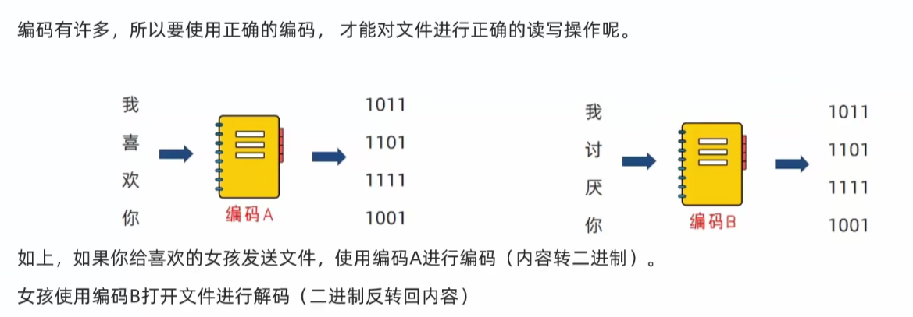

- <font color="red">**UTF-8是目前全球通用的编码格式**</font>
- 除非有特殊需求，否则，一律使用UTF-8格式进行文件编码即可


### 7.2 文件读取

- 文件作用

  - 内存中存放的数据在计算机关机后就会消失。要长久保存数据，就要使用硬盘、光盘、U 盘等设备。为了便于数据的管理和检索，引入了 <font color="red">**“文件”** </font>的概念。

  - <font color="red">**一篇文章、一段视频、一个可执行程序，都可以被保存为一个文件，并赋予一个文件名。**</font>操作系统以文件为单位管理磁盘中的数据。一般来说，<font color="red">**文件可分为文本文件、视频文件、音频文件、图像文件、可执行文件等多种类别。**</font>

- 文件操作

  - 主要包含：<font color="red">**打开、关闭、读、写等操作**</font>

- 文件的操作步骤，大致分为三个步骤

  - 打开文件
  - 读写文件
  - 关闭文件

- 注意：**可以只打开和关闭文件，但是不进行读写**


#### 7.2.1 open()打开函数

- 在 Python 中，<font color="red">**使用`open`函数，可以打开一个已经存在的文件，或者创建一个新文件**</font>，语法如下：
  - **name**：要打开的目标文件名的字符串（可以包含文件所在的具体路径）
  - **mode**：设置打开文件的模式（访问模式）：只读、写入、追加等
  - **encoding**：编码格式（推荐使用 UTF-8）

~~~python
open(name, mode, encoding)
~~~

- 示例代码

~~~python
f = open('D:/pythonProject/Test/test.txt', 'r', encoding="UTF-8")
# encoding的顺序不是第三位，所以不能用位置参数，用关键字参数直接指定
print(type(f))
# 输出：<class '_io.TextIOWrapper'>
~~~

- 注意：此时的`f`是`open`函数的**文件对象**，对象是 Python 中一种特殊的数据类型，拥有属性和方法，可以使用`对象.属性`或`对象.方法`对其进行访问，后续面向对象课程会给大家进行详细的介绍

- <font color="red">**mode 常用的三种基础访问模式**</font>

| 模式  | 描述                                                         |
| ----- | ------------------------------------------------------------ |
| **r** | 以只读方式打开文件。文件的指针将会放在文件的开头。这是默认模式。 |
| **w** | 打开一个文件只用于写入。如果该文件已存在则打开文件，并从开头开始编辑，**原有内容会被删除**。如果该文件不存在，创建新文件。 |
| **a** | 打开一个文件用于追加。如果该文件已存在，**新的内容将会被写入到已有内容之后**。如果该文件不存在，创建新文件进行写入。 |


#### 7.2.2 读取方法

- read()方法

  - `num` 表示要从文件中读取的数据的长度（单位是字节）。
  - 如果没有传入 `num`，就表示读取文件中**所有数据**。

  ~~~python
  文件对象.read(num)
  ~~~

  - 例子

  ~~~python
  f = open('D:/pythonProject/Test/test.txt', 'r', encoding="UTF-8")
  # encoding的顺序不是第三位，所以不能用位置参数，用关键字参数直接指定
  
  print(type(f))
  print(f"读取10个字节的结果：{f.read(10)}")
  print(f"read方法读取全部内容的结果：{f.read()}")
  
  """
  <class '_io.TextIOWrapper'>
  读取10个字节的结果：李卓洋
  111111
  read方法读取全部内容的结果：
  222222
  333333
  444444
  555555
  """
  ~~~

- readlines () 方法
  - `readlines()` <font color="red">**会按行一次性读取整个文件内容，返回一个列表**</font>，列表中每一行数据作为一个元素。

~~~python
f = open('D:/pythonProject/Test/test.txt', 'r', encoding="UTF-8")
# encoding的顺序不是第三位，所以不能用位置参数，用关键字参数直接指定

content = f.readlines()
print(content)
print(type(content))

# 关闭文件
f.close()

"""
['111111\n', '222222\n', '333333\n', '444444\n', '555555']
<class 'list'>
"""
~~~

- readline () 方法

  - `readline()` 方法： <font color="red">**一次读取一行内容**</font>

  ~~~python
  f = open('D:/pythonProject/Test/test.txt', 'r', encoding="UTF-8")
  # encoding的顺序不是第三位，所以不能用位置参数，用关键字参数直接指定
  
  print(f"第一行数据：{f.readline()}")
  print(f"第二行数据：{f.readline()}")
  print(f"第三行数据：{f.readline()}")
  
  
  """
  第一行数据：李卓洋
  
  第二行数据：111111
  
  第三行数据：222222
  """
  ~~~

- for循环读取文件

  - 每一个 `line` 临时变量，就记录了文件的一行数据。

  ~~~python
  for line in f:
      print(line)
  ~~~

  - 例子

  ~~~python
  f = open('D:/pythonProject/Test/test.txt', 'r', encoding="UTF-8")
  # encoding的顺序不是第三位，所以不能用位置参数，用关键字参数直接指定
  
  for line in f:
      print(line)
  
  
  """
  李卓洋
  
  111111
  
  222222
  
  333333
  
  444444
  
  555555
  """
  ~~~


#### 7.2.3 close()关闭函数

~~~python
f = open("python.txt", "r")
f.close()
~~~

- 最后通过 `close()`，关闭文件对象，也就是关闭对文件的占用
- <font color="red">**如果不调用 `close()`，同时程序没有停止运行，那么这个文件将一直被 Python 程序占用**</font>

~~~python
f = open('D:/pythonProject/Test/test.txt', 'r', encoding="UTF-8")
# encoding的顺序不是第三位，所以不能用位置参数，用关键字参数直接指定

# 关闭文件
f.close()
~~~


#### 7.2.4 with open语句

~~~python
with open("python.txt", "r") as f:
    f.readlines()
~~~

- 通过在 `with open` 的语句块中对文件进行操作
- 可以在操作完成后<font color="red">**自动关闭（close）文件**</font>，避免遗忘掉 `close()` 方法

~~~python
# 通过with open语句，代码执行完后会自动关闭close文件
with open('D:/pythonProject/Test/test.txt', 'r', encoding="UTF-8") as f:
    print(f.read())

"""
李卓洋
111111
222222
333333
444444
555555
"""
~~~


#### 7.2.5 读取案例

- 通过 Windows 的文本编辑器软件，将如下内容复制到 `word.txt` 中：

~~~bash
itheima itcast python
itheima python itcast
beijing shanghai itheima
shenzhen guangzhou itheima
wuhan hangzhou itheima
zhengzhou bigdata itheima
~~~

- 通过文件读取操作，读取此文件，统计 `itheima` 单词出现的次数。

~~~python
"""
通过文件读取操作，读取此文件，统计 `itheima` 单词出现的次数。
"""

# 方式一：一次性读取所有，然后直接用count方法取出有多少次
with open('D:/pythonProject/Test/word.txt', 'r', encoding="UTF-8") as f:
    content = f.read()
    num = content.count('itheima')
    print(f"itheima出现的次数：{num}")

# 方式二：读取每行数据，然偶判断每行数据有多少
# 单词出现次数
count = 0
with open('D:/pythonProject/Test/word.txt', 'r', encoding="UTF-8") as f:
    # 读取文件的每行数据
    lines = f.readlines()
    # 将每行数据按照空格分割成单个单词
    for line in lines:
        # 去除每行数据开头的\n和空格
        line = line.strip()
        words = line.split(" ")
        # 判断每个单词是否是itheima
        for word in words:
            if word == "itheima":
                count = count + 1

# 关闭文件
f.close()

print(f"itheima出现的次数：{count}")
~~~


### 7.3 文件写入

- 使用write方法写入文件

~~~python
# 打开文件
f = open('python.txt', 'w')

# 读写（写入）
f.write('hello world')

# 内容刷新写入
f.flush()  # 手动刷新缓冲区
f.close()  # 关闭文件（close 会自动调用 flush）
~~~

- 注意事项
  - 直接调用 `write()`，内容并不会立即写入磁盘，而是先积攒在程序的**内存缓冲区**中。
  - 调用 `flush()` 时，缓冲区中的内容才会真正写入文件。
  - 设计目的：避免频繁操作硬盘，提升效率（攒够一批数据后一次性写入磁盘）。
  - 补充：调用 `close()` 时会自动执行 `flush()`，所以一般场景下可以省略 `flush()`，直接用 `close()` 或 `with open` 即可。
  - 模式为w：打开一个文件只用于写入。如果该文件已存在则打开文件，并从开头开始编辑，**原有内容会被删除**。如果该文件不存在，创建新文件。
  - 模式为a：打开一个文件用于追加。如果该文件已存在，**新的内容将会被写入到已有内容之后**。如果该文件不存在，创建新文件进行写入
- 例子

~~~python
# 不存在的文件
# 打开文件
with open('D:/pythonProject/Test/test.txt', 'w', encoding="UTF-8") as f:
    # 写入文件
    f.write("李卓洋")
    # 刷新缓存区
    f.flush()

# 关闭文件
f.close()

"""李卓洋"""


# 存在的文件追加
# 打开文件
with open('D:/pythonProject/Test/test.txt', 'a', encoding="UTF-8") as f:
    # 写入文件
    f.write("李卓洋")
    # 刷新缓存区
    f.flush()

# 关闭文件
f.close()
"""李卓洋李卓洋"""
~~~


### 7.4 文件综合案例

- **需求**：有一份账单文件bill.txt，记录了消费收入的具体记录，内容如下：

~~~bash
name,date,money,type,remarks
周杰轮,2022-01-01,100000,消费,正式
周杰轮,2022-01-02,300000,收入,正式
周杰轮,2022-01-03,100000,消费,测试
林俊节,2022-01-01,300000,收入,正式
林俊节,2022-01-02,100000,消费,测试
林俊节,2022-01-03,100000,消费,正式
林俊节,2022-01-04,100000,消费,测试
林俊节,2022-01-05,500000,收入,正式
张学油,2022-01-01,100000,消费,正式
张学油,2022-01-02,500000,收入,正式
张学油,2022-01-03,900000,收入,测试
王力鸿,2022-01-01,500000,消费,正式
王力鸿,2022-01-02,300000,消费,测试
王力鸿,2022-01-03,950000,收入,正式
刘德滑,2022-01-01,300000,消费,测试
刘德滑,2022-01-02,100000,消费,正式
刘德滑,2022-01-03,300000,消费,正式
~~~

- 任务
  - 读取文件 `bill.txt`
  - 将文件写出到 `bill.txt.bak` 文件作为备份
  - 同时，将文件内标记为**测试**的数据行丢弃

~~~python
# 打开读取文件
reda_f = open('D:/pythonProject/Test/bill.txt', 'r', encoding="UTF-8")
# 打开写入文件
write_f = open('D:/pythonProject/Test/bill.txt.bak', 'w', encoding="UTF-8")

# 读取每行数据
for line in reda_f:
    # 遇到测试就跳过
    if line.count("测试"):
        continue
    # 否则就写入
    write_f.write(line)

# 刷新
write_f.flush()

# 关闭文件
reda_f.close()
write_f.close()
~~~


## 8、异常、模块和包

### 8.1 异常

- 什么是异常：当检测到一个错误时，python解释器就无法继续执行了，反而出现了一些错误的提示，这就是所谓的异常，也就是常说的bug
- 总的来说：<font color="red">**就是程序运行过程中出现了错误**</font>


#### 8.1.1 捕获异常

- 为什么要捕获异常
  - 世界上没有完美的程序，任何程序在运行的过程中，都有可能出现：异常，也就是出现 bug，导致程序无法完美运行下去
  - 我们要做的，不是力求程序完美运行。而是在力所能及的范围内，对可能出现的 bug，进行提前准备、提前处理
  - 这种行为我们称之为：<font color="red">**异常处理（捕获异常）**</font>
- 当我们的程序遇到了 BUG，那么接下来有两种情况：
  - ① 整个程序因为一个 BUG 停止运行
  - ② 对 BUG 进行提醒，整个程序继续运行
  - 在真实工作中，我们肯定不能因为一个小的 BUG 就让整个程序全部奔溃，也就是我们希望的是达到②的这种情况
- <font color="red">**捕获异常的作用在于：提前假设某处会出现异常，做好提前准备，当真的出现异常的时候，可以有后续手段**</font>


#### 8.1.2 基本语法

- <font color="red">**语法1：捕获常规异常**</font>

  ~~~python
  try:
      可能发生错误的代码
  except:
      如果出现异常执行的代码
  ~~~

  - 例子

  ~~~python
  try:
      f = open('linux.txt', 'r')
  except:
      print("出现异常了，因为文件不存在，我将open的形式，改为w模式去打开")
      f = open('linux.txt', 'w')
      
  """
  不加异常，这里会直接报错，文件不存在：
  Traceback (most recent call last):
    File "D:\pythonProject\Test\test1.py", line 1, in <module>
      f = open('linux.txt', 'r')
  FileNotFoundError: [Errno 2] No such file or directory: 'linux.txt'
  
  加了之后会优雅打印：
  出现异常了，因为文件不存在，我将open的形式，改为w模式去打开
  """
  ~~~

- <font color="red">**语法2：捕获指定异常**</font>

  - 注意事项
    - <font color="red"> **如果尝试执行的代码的异常类型和要捕获的异常类型不一致，则无法捕获异常**</font>
    -  <font color="red"> **一般 try 下方只放一行尝试执行的代码**</font>

  ~~~python
  try:
      可能发生错误的代码
  except 指定异常 as e:
      如果出现异常执行的代码
  ~~~

  - 例子

  ~~~python
  try:
      num = 1 / 0
      f = open('linux.txt', 'r')
  except FileNotFoundError as e:
      print(f"文件未找到：{e}")
  
     
  """
  只能捕获文件未找到的异常，计算异常捕获不到
  文件未找到：[Errno 2] No such file or directory: 'linux.txt'
  """
  ~~~

- <font color="red">**语法3：捕获指定异常**</font>

  - 当捕获多个异常时，可以把要捕获的异常类型的名字，放到`except`后，并使用元组的方式进行书写，用逗号隔开

  ~~~python
  try:
      可能发生错误的代码
  except (异常1, 异常2, ...):
      如果出现异常执行的代码
  ~~~

  - 例子

  ~~~python
  try:
      num = 1 / 0
  except (FileNotFoundError, ZeroDivisionError) as e:
      print(f"文件未找到：{e}")
  
      
  """
  文件未找到：division by zero
  """
  ~~~

- <font color="red">**语法4：捕获所有异常**</font>

  - 异常为最顶层：Exception

  ~~~python
  try:
      可能发生错误的代码
  except Exception as e:
      如果出现异常执行的代码
  ~~~

  - 例子

  ~~~python
  try:
      num = 1 / 0
  except Exception as e:
      print(f"文件未找到：{e}")
  
      
  """
  文件未找到：division by zero
  """
  ~~~


#### 8.1.3 异常的else和finally

- <font color="red">**else是没有出现异常的时候执行的**</font>
- <font color="red">**finally是不管有没有异常的时候都会执行**</font>

~~~python
try:
    可能发生错误的代码
except Exception as e:
    如果出现异常执行的代码
else: 
    没有出现异常的时候执行的代码
finally:
    不管有没有异常的时候都会执行
~~~

- 例子

~~~python
try:
    num = 1 / 0
except Exception as e:
    print(f"出现了异常：{e}")
else:
    print("没有出现异常")
finally:
    print("最终代码")
    
"""
出现了异常：division by zero
最终代码
"""


try:
    num = 1
except Exception as e:
    print(f"出现了异常：{e}")
else:
    print("没有出现异常")
finally:
    print("最终代码")
    
"""
没有出现异常
最终代码
"""
~~~


#### 8.1.4 异常传递性

- 异常是具有传递性的。
- 当函数`func01`中发生异常，并且没有捕获处理这个异常的时候，异常会传递到函数`func02`；当`func02`也没有捕获处理这个异常的时候，`main`函数会捕获这个异常，这就是**异常的传递性**。
- 提示：<font color="red">**当所有函数都没有捕获异常的时候，程序就会报错**</font>

~~~python
def func01():
    print("这是func01开始")
    num = 1 / 0  # 异常在func01中没有被捕获
    print("这是func01结束")

def func02():
    print("这是func02开始")
    func01()  # 异常在func02中没有被捕获
    print("这是func02结束")

def main():
    try:
        func02()
    except Exception as e:  # 异常在main中被捕获
        print(e)

main()

"""
这是func02开始
这是func01开始
division by zero
"""
~~~


### 8.2 模块

#### 8.2.1 模块概念

- Python 模块（Module），<font color="red">**是一个 Python 文件，以 `.py` 结尾**</font>。模块能定义函数、类和变量，模块里也能包含可执行的代码。

- 作用：Python 中有很多各种不同的模块，每一个模块都可以帮助我们快速实现一些功能，比如实现和时间相关的功能就可以使用 `time` 模块。<font color="red">**可以认为一个模块就是一个工具包，每一个工具包中都有各种不同的工具供我们使用，进而实现各种不同的功能**</font>
- 大白话：模块就是一个 Python 文件，里面有类、函数、变量等，我们可以拿过来用（导入模块去使用）


#### 8.2.2 导入方式

- 模块在使用前需要先导入，导入的语法如下：、

~~~python
[from 模块名] import [模块 | 类 | 变量 | 函数 | *] [as 别名]
~~~

- 常用的组合形式如下：
  - `import 模块名`
  - `from 模块名 import 类、变量、方法等`
  - `from 模块名 import *`
  - `import 模块名 as 别名`
  - `from 模块名 import 功能名 as 别名`
- 注意事项
  - from可以省略，直接import即可
  - as可以省略
  - 通过"."来确定层级关系
  - 模块的导入一般写在文件的最开头位置
- 基本语法

~~~python
import 模块名
import 模块名1, 模块名2

模块名.功能名()
~~~

- 例子

~~~python
# 使用 import 导入 time 模块
import time       # 导入Python内置的time模块（time.py这个代码文件）
print("你好")
time.sleep(5)     # 通过. 就可以使用模块内部的全部功能（类、函数、变量）
print("我好")

# 使用 from 导入 time 的 sleep 功能
from time import sleep
print("你好")
sleep(5)
print("我好")


# 使用 * 导入 time 模块的全部功能
from time import *    # *表示全部的意思
print("你好")
sleep(5)
print("我好")


# 使用 as 给特定功能加上别名
from time import sleep as sl
print("你好")
sl(5)
print("我好")
~~~


#### 8.2.3 自定义模块

- Python 中已经帮我们实现了很多的模块。不过有时候我们需要一些个性化的模块，这里就可以通过**自定义模块**实现，也就是自己制作一个模块

- <font color="red">**每个 Python 文件都可以作为一个模块，模块的名字就是文件名。自定义模块名必须要符合标识符命名规则**</font>

- 注意：

  - <font color="red">**如果导入多个模块的时候，且模块内有相同功能，当调用这个同名功能时，后面导入的模块功能会覆盖前面的**</font>

- 例子

  - 新建一个 Python 文件，命名为 `my_module1.py`，并定义 `test` 函数：

  ~~~python
  def add(x, y):
      return x + y
  
  def sub(x, y):
      return x - y
  ~~~

  - 新建测试文件 `test_my_module.py`，导入并使用自定义模块：

  ~~~python
  # 写法一：导入自定义模块
  from my_module1 import add
  from my_module1 import sub
  # 调用模块中的方法
  num1 = add(10, 2)
  num2 = sub(10, 2)
  print(num1)
  print(num2)
  
  
  # 写法二：导入自定义模块
  import my_module1
  # 调用模块中的方法
  num1 = my_module1.add(10, 2)
  num2 = my_module1.sub(10, 2)
  print(num1)
  print(num2)
  
  
  # 写法三：导入自定义模块
  from my_module1 import *
  # 调用模块中的方法
  num1 = add(10, 2)
  num2 = sub(10, 2)
  print(num1)
  print(num2)
  ~~~


#### 8.2.4 \_\_main\_\_方法

- 在实际开发中，当一个开发人员编写完一个模块后，为了让模块能够在项目中达到想要的效果，这个开发人员会自行在 py 文件中添加一些测试信息，例如，在`my_module1.py`文件中添加测试代码`test(1, 1)`

~~~python
def test(a, b):
    print(a + b)

test(1, 1)
~~~

- 问题：此时，无论是当前文件，还是其他已经导入了该模块的文件，在运行的时候都会**自动执行`test`函数的调用**。

- 解决方案：使用 `if __name__ == '__main__':` 包裹测试代码，让测试代码<font color="red">**只在当前文件运行时执行，被其他文件导入时不执行**</font>

~~~python
def test(a, b):
    print(a + b)

# 只在当前文件中调用该函数，其他导入的文件内不会执行这部分代码
if __name__ == '__main__':
    test(1, 1)
~~~


#### 8.2.5 \_\_all\_\_方法

- <font color="red">**如果一个模块文件中有 `__all__` 变量，当使用 `from xxx import *` 导入时，只能导入这个列表中的元素**</font>
- 可以控制哪些方法能给外部导入
- my_module1.py

~~~python
__all__ = ['test_A']

def test_A():
    print('testA')

def test_B():
    print('testB')
~~~

- test_my_module.py

~~~python
from my_module1 import *
# 只能使用 test_A 函数，test_B 无法被导入
test_A()
~~~


### 8.3 包

#### 8.3.1 概念

- 从物理上看，<font color="red">**包就是一个文件夹**</font>，在该文件夹下包含了一个 `__init__.py` 文件，该文件夹可用于包含多个模块文件。
- 从逻辑上看，包的本质依然是<font color="red">**模块**</font>

- 包的作用：当我们的模块文件越来越多时，包可以帮助我们**管理这些模块**，包的作用就是包含多个模块，让代码结构更清晰、更易于维护。

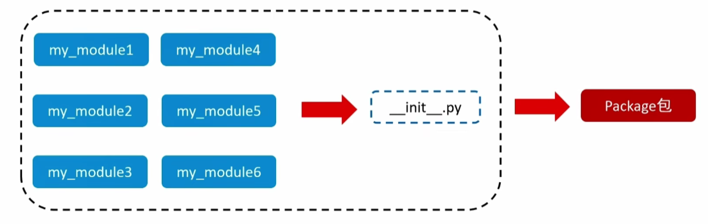


#### 8.3.2 自定义新建包

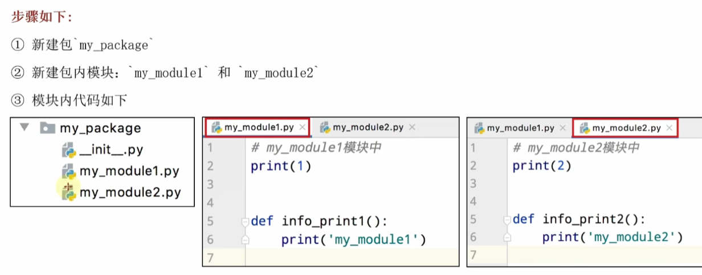

- <font color="red">**新建包之后，包内会有一个"\_\_init_\_.py"文件，这个文件控制着包的导入行为**</font>
- 通过\_\_init\_\_.py判定这个文件夹是不是包，没有的话就是普通的文件夹

- \_\_init\_\_.py

~~~python
__all__ = ['my_module1']
~~~

- 调用方

~~~python
# # 传统方式一
# import my_package.my_module1
# import my_package.my_module2
# print(my_package.my_module1.add(10, 2))
# print(my_package.my_module2.sub(10, 2))
#
#
# # 传统方式二
# from my_package import my_module1
# from my_package import my_module2
# print(my_module1.add(10, 2))
# print(my_module2.sub(10, 2))
#
#
# # 传统方式三
# from my_package.my_module1 import add
# from my_package.my_module2 import sub
# print(add(10, 2))
# print(sub(10, 2))


# 方式四
from my_package import *
print(my_module1.add(10, 2))
print(my_module2.sub(10, 2))
~~~


#### 8.3.3 安装第三方包

- 我们知道，包可以包含一堆的 Python 模块，而每个模块又内含许多的功能。

- 所以，我们可以认为：**一个包，就是一堆同类型功能的集合体**。

- 在 Python 程序的生态中，有许多非常多的第三方包（非 Python 官方），可以极大的帮助我们提高开发效率，如：

  - 科学计算中常用的：`numpy`包

  - 数据分析中常用的：`pandas`包

  - 大数据计算中常用的：`pyspark`、`apache-flink`包

  - 图形可视化常用的：`matplotlib`、`pyecharts`

  - 人工智能常用的：`tensorflow`

  - 等

- 这些第三方的包，极大的丰富了 Python 的生态，提升了开发效率。

- 但是由于是第三方，所以 Python 没有内置，所以我们需要**安装它们**才可以导入使用哦。
- 如何安装第三方包

~~~bash
pip install 包名称
pip install -i https://pypi.tuna.tsinghua.edu.cn/simple 包名称
~~~


#### 4、创建隔离化项目

- 新建文件夹，并进入到文件夹里，cmd打开
- 创建虚拟环境：<font color="red">**python -m venv venv**</font>，这将创建一个名为`venv`的虚拟环境目录
- 激活虚拟环境：
  - win：<font color="red">**.\venv\Scripts\activate**</font>
  - macOS和Linux：<font color="red">**source venv/bin/activate**</font>

- pip安装依赖


## 9、一阶段基础综合案例

### 9.1 JSON

- JSON 是一种**轻量级的数据交互格式**，可以按照 JSON 指定的格式去**组织和封装**数据。

- JSON 本质上是一个带有**特定格式的字符串**。

- 主要功能：JSON 是一种在各个**编程语言**中流通的数据格式，负责不同编程语言中的**数据传递和交互**，类似于：

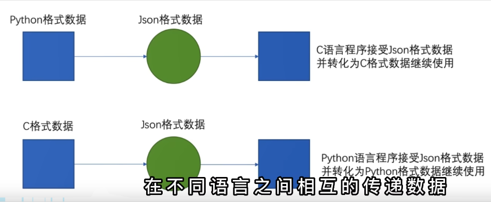

- JSON 格式的数据要求很严格，主要有以下两种常见形式：

  -  **对象格式（字典）**
    - 用 `{}` 包裹，键值对结构，键必须是双引号字符串
    - 对应 Python 中的 `dict` 类型

  ```json
  {"name":"admin","age":18}
  ```

  - **数组格式（列表）**

    - 用 `[]` 包裹，元素可以是对象或其他 JSON 类型。

    - 对应 Python 中的 `list` 类型。

  ```json
  [{"name":"admin","age":18},{"name":"root","age":16},{"name":"张三","age":20}]
  ```


# 三、二阶段

## 1、面向对象

### 1.1 初识对象

- 在程序中是可以做到和生活中那样，设计表格、生产表格、填写表格的组织形式的。、

  - 在程序中<font color="red">**设计表格**</font>，我们称之为：<font color="red">**设计类（class）**</font>

  ~~~python
  class Student:
      name = None  # 记录学生姓名
  ~~~

  - 在程序中<font color="red">**打印生产表格**</font>，我们称之为：<font color="red">**创建对象**</font>

  ~~~python
  # 基于类创建对象
  stu_1 = Student()
  stu_2 = Student()
  ~~~

  - 在程序中<font color="red">**填写表格**</font>，我们称之为：<font color="red">**对象属性赋值**</font>

  ~~~python
  stu_1.name = "周杰伦"  # 为学生1对象赋予名称属性值
  stu_2.name = "林军杰"  # 为学生2对象赋予名称属性值
  ~~~

- 例子

~~~python
# 1. 设计一个类（类比生活中：设计一张登记表）
class Student:
    name = None          # 记录学生姓名
    gender = None        # 记录学生性别
    nationality = None   # 记录学生国籍
    native_place = None  # 记录学生籍贯
    age = None           # 记录学生年龄

# 2. 创建一个对象（类比生活中：打印一张登记表）
stu_1 = Student()

# 3. 对象属性进行赋值（类比生活中：填写表单）
stu_1.name = "lzy"
stu_1.gender = "男"
stu_1.nationality = "中国"
stu_1.native_place = "湖北省"
stu_1.age = 28

# 4. 获取对象中的记录信息
print(stu_1.name)
print(stu_1.gender)
print(stu_1.nationality)
print(stu_1.native_place)
print(stu_1.age)


"""
lzy
男
中国
湖北省
28
"""
~~~


### 1.2 类的定义和使用

- 类的使用语法：
  - `class` 是关键字，表示要定义类了
  - <font color="red">**类的属性**</font>：即定义在类中的变量（成员变量）
  - <font color="red">**类的行为**</font>：即定义在类中的函数（成员方法）

~~~python
class 类名称:
    # 类的属性
    # 类的行为
~~~

- 创建类对象的语法：

~~~python
对象 = 类名称()
~~~

- 例如：

~~~python
class Student:
    name = None    # 学生的姓名
    age = None     # 学生的年龄

    def say_hi(self):
        print(f"Hi大家好，我是{self.name}")

stu = Student()
stu.name = "周杰伦"
stu.say_hi()  # 输出：Hi大家好，我是周杰伦
~~~

- 类中：
  - 不仅可以定义属性用来记录数据
  - 也可以定义函数，用来记录行为
  - 类中定义的属性（变量），我们称之为：**成员变量**
  - 类中定义的行为（函数），我们称之为：**成员方法**

- 在类中定义成员方法和定义函数基本一致，但仍有细微区别：
  - 可以看到，在方法定义的参数列表中，有一个：`self` 关键字
  - `self` 关键字是成员方法定义的时候，<font color="red">**必须填写**</font>的。
    - 它用来表示类对象自身的意思
    - 当我们使用类对象调用方法时，`self` 会自动被 Python 传入
    - 在方法内部，想要访问类的成员变量，<font color="red">**必须使用 `self`**</font>
    - `self`出现在形参列表中，但是不会占用参数位置，无需理会

~~~python
def 方法名(self, 形参1, ......, 形参N):
    方法体
~~~


### 1.3 类和对象

- **现实世界的事物由什么组成？**

  - 属性

  - 行为

    > 类也可以包含属性和行为，所以使用类描述现实世界事物是非常合适的

- **类和对象的关系是什么？**

  - 类是程序中的 **“设计图纸”**
  - 对象是基于图纸生产的 **具体实体**

- **什么是面向对象编程？**

  > 面向对象编程就是，使用对象进行编程。
  >
  > 即：设计类，创建类的对象，并使用对象来完成具体的工作

~~~python
# 设计一个闹钟类
class Clock:
    id = None       # 序列化（序列号）
    price = None    # 价格

    def ring(self):
        import winsound
        print(f"闹钟ID：{self.id}，价格：{self.price}")
        winsound.Beep(2000, 3000)

# 构建2个闹钟对象并让其工作
# 闹钟1
clock1 = Clock()
clock1.id = "003032"
clock1.price = 19.99
clock1.ring()

# 闹钟2
clock2 = Clock()
clock2.id = "005051"
clock2.price = 29.99
clock2.ring()
~~~


### 1.4 构造方法

- 在上述代码中，为对象的属性赋值需要依次进行，略显繁琐，需要引入一种更加高效的方法，一行代码完成所有数据赋值
- python类使用：<font color="red">**\_\_init\_\_()，称之为构造方法**</font>
  - 在创建类对象（构造类）的时候，<font color="red">**会自动执行**</font>
  - 在创建类对象（构造类）的时候，<font color="red">**将传入参数自动传递给\_\_init\_\_()方法使用**</font>
- 注意
  - 构造方法名称：`__init__`，<font color="red">**init 前后都有 2 个下划线**</font>，千万不要忘记。
  - 构造方法也是成员方法，<font color="red">**参数列表中必须提供 `self`**</font>。
  - 在构造方法内定义成员变量，需要使用 `self` 关键字原因：<font color="red">**变量定义在构造方法内部，要成为对象的成员变量，需要用 `self` 绑定到对象本身**</font>。

- 例子

~~~python
# 定义一个学生类
class Student():
    # 构造方法
    def __init__(self,name,age,tel):
        self.name = name
        self.age = age
        self.tel = tel

# 构造学生对象
stu = Student("lzy", 18, "18271660939")
print(stu.name)
print(stu.age)
print(stu.tel)
~~~


### 1.5 其他内置方法

- 上文学习的 `__init__` 构造方法，是 Python 类内置的方法之一。

- 这些内置的类方法各自有特殊功能，我们称之为：**魔术方法**。

- 常见魔术方法一览

|  魔术方法  |                           功能说明                           |
| :--------: | :----------------------------------------------------------: |
| `__init__` |     构造方法，用于初始化对象，等价于Java中的有参构造方法     |
| `__str__`  | 字符串方法，自定义对象打印时的输出，等价于Java中的toString()重写方法 |
|  `__lt__`  | 用于 `<`、`>` 符号的比较逻辑，等价于Java中的根据特定值比较方法 |
|  `__le__`  | 用于 `<=`、`>=` 符号的比较逻辑，等价于Java中的根据特定值比较方法 |
|  `__eq__`  |   用于 `==` 符号的比较逻辑，等价于Java中的根据equals()方法   |

- 例子

~~~python
# 定义一个学生类
class Student(object):
    # 构造方法
    def __init__(self, name, age):
        self.name = name
        self.age = age

    # 重写方法
    def __str__(self):
        return f"Name: {self.name}, Age: {self.age}"

    # 比较方法
    def __lt__(self, other):
        return self.age > other.age

    # 比较方法
    def __le__(self, other):
        return self.age >= other.age

    # 判断相同方法
    def __eq__(self, other):
        return self.name == other.name

# 声明两个对象实例
sut1 = Student('John', 22)
sut2 = Student('Nike', 23)
sut3 = Student('Nike', 22)

# 测试重写方法: Name: John, Age: 22
print(sut1.__str__())

# 测试比较方法：False，True
print(sut1.__lt__(sut2))
print(sut1.__le__(sut3))

# 测试判断相同方法：True
print(sut2 == sut3)
~~~


### 1.6 封装

- 封装表示的是：将现实世界事物的<font color="red">**属性和行为**</font>封装到类中，描述为：<font color="red">**成员变量和成员方法**</font>

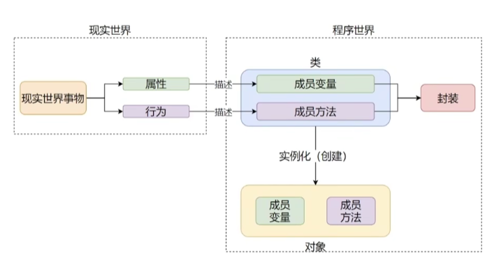、

- 现实生活中的事物，有属性和行为，但是不代表这些属性和行为都是开放给用户使用的

- Python 类的私有成员

  - 既然现实事物有不公开的属性和行为，那么作为现实事物在程序中映射的类，也应该支持这种封装。

  - 类中提供了**私有成员**的形式来实现。

    - 私有成员变量

    - 私有成员方法

  - 定义私有成员的方式

    - <font color="red">**私有成员变量：变量名以 `__` 开头（2 个下划线）**</font>

    - <font color="red">**私有成员方法：方法名以 `__` 开头（2 个下划线）**</font>

  ~~~py
  class Phone:
      IMEI = None       # 序列号（公有）
      producer = None   # 厂商（公有）
      __current_voltage = None     # 当前电压（私有）
  
      def call_by_5g(self):
          print("5g通话已开启")
  
      # 私有成员方法
      def __keep_single_core(self):
          print("让CPU以单核模式运行以节省电量")
  ~~~

- Python 私有成员的访问限制

  - <font color="red">**私有方法无法直接被类对象使用**</font>

  ~~~python
  class Phone:
      IMEI = None       # 序列号
      producer = None   # 厂商
      __current_voltage = None  # 当前电压（私有）
  
      def call_by_5g(self):
          print("5g通话已开启")
  
      # 私有成员方法
      def __keep_single_core(self):
          print("让CPU以单核模式运行以节省电量")
  
  phone = Phone()
  phone.__keep_single_core()  # 尝试直接调用私有方法
  
  
  """
  AttributeError: 'Phone' object has no attribute '__keep_single_core'
  说明私有方法无法在类外部直接调用
  """
  ~~~

  - <font color="red">**私有变量无法赋值，也无法获取值**</font>

  ~~~python
  class Phone:
      IMEI = None       # 序列号
      producer = None   # 厂商
      __current_voltage = None  # 当前电压（私有）
  
      def __call_by_5g(self):
          print("5g通话已开启")
  
  phone = Phone()
  phone.__current_voltage = 33  # 尝试给私有变量赋值（不报错，但无效）
  print(phone.__current_voltage)  # 尝试获取私有变量值（会报错）
  print(type(phone.__current_voltage))
  
  """
  33 
  <class 'int'> 这里看出它是新增了一个属性，而不是在私有变量上修改
  赋值操作不会报错，但不会真正修改类内部的私有变量
  取值操作会直接报错，说明私有变量无法在类外部直接访问
  """
  ~~~

- <font color="red">**私有成员无法被类对象直接使用，但可以被类内部的其他成员调用**</font>

~~~python
class Phone:
    __current_voltage = 0.5  # 当前手机运行电压（私有成员变量）

    def __keep_single_core(self):  # 私有成员方法
        print("让CPU以单核模式运行")

    def call_by_5g(self):  # 公有方法，内部可调用私有成员
        if self.__current_voltage >= 1:
            print("5g通话已开启")
        else:
            self.__keep_single_core()  # 在类内部调用私有方法
            print("电量不足，无法使用5g通话，并已设置为单核运行进行省电。")

phone = Phone()
phone.call_by_5g()


"""
让CPU以单核模式运行
电量不足，无法使用5g通话，并已设置为单核运行进行省电
"""
~~~


### 1.7 继承

#### 1.7.1 继承的定义和使用

- 继承就是一个类，继承（复制）另外一个类的成员变量和成员方法（不含私有）
- 语法

~~~python
class 类(父类[, 父类2, ... , 父类N])
	类内容体
~~~

- 子类构建的类对象，可以

  - <font color="red">**有自己的成员变量和成员方法**</font>
  - <font color="red">**使用父类的成员变量和成员方法**</font>

- 继承分为单继承和多继承

  - 单继承：只继承一个父类

  ~~~python
  # 单继承
  class Phone:
      IMEI = None     # 序列号
      producer = 'HM' # 厂商
  
      def call_by_4g(self):
          print('call_by_4g')
  
  class Phone2022(Phone):
      face_id = '10001'   # 面部识别ID
  
      def call_by_5g(self):
          print('call_by_5g')
  
  phone = Phone2022()
  # 使用父类的成员变量
  print(phone.producer)
  # 使用父类的成员方法
  phone.call_by_4g()
  # 使用自己的成员方法
  phone.call_by_5g()
  
  """
  HM
  call_by_4g
  call_by_5g
  """
  ~~~

  - 多继承：继承多个父类
    - pass是占位语句，用来保证函数（方法）或类定义的完整性，表示无内容，空的意思
    - <font color="red">**如果继承多个类，有相同的成员变量和成员方法，先继承的优先级高于后继承者**</font>

  ~~~python
  # 手机父类
  class Phone:
      IMEI = None     # 序列号
      producer = 'HM1' # 厂商
  
      def call_by_4g(self):
          print('call_by_4g')
  
  # NFC父类
  class NFCReader:
      nfc_reader = '第五代'
      producer = 'HM2'
  
      def read_nfc(self):
          print('read_nfc')
  
      def call_by_4g(self):
          print('write_nfc')
  
  # 红外遥控父类
  class RemoteControl:
      rc_type = '红外遥控'
  
      def connect(self):
          print('红外遥控开启')
  
  
  
  class MyPhone(Phone, NFCReader, RemoteControl):
      pass    # 表示空，为了语法不错误
  
  phone = MyPhone()
  # 使用Phone父类的成员变量
  print(phone.producer)
  # 使用父类的成员方法
  phone.call_by_4g()
  phone.read_nfc()
  phone.connect()
  
  """
  HM1
  call_by_4g
  read_nfc
  红外遥控开启
  """
  ~~~

  

#### 1.7.2 复写

- 定义：子类继承父类的成员属性和成员方法后，如果对其 “不满意”，那么可以进行复写。即：<font color="red">**在子类中重新定义同名的属性或方法即可**</font>
- 语法：在子类中重新实现同名成员方法或成员属性即可
- 在子类中，如何调用父类成员
  - 注意：只可以在子类内部调用父类的同名成员，子类的实体类对象调用默认是调用子类复写的

~~~python
# 方式一：调用父类成员
使用成员变量：父类名.成员变量
使用成员方法：父类名.成员方法(self)

# 方式二：使用super()调用父类成员
使用成员变量：super().成员变量
使用成员方法：super().成员方法()
~~~

- 例子

~~~python
class Phone:
    IMEI = None          # 序列号
    producer = "ITCAST"  # 厂商

    def call_by_5g(self):
        print("父类的5g通话")

class MyPhone(Phone):
    proucer = "ITHEIMA"       # 复写父类属性

    def call_by_5g(self):     # 复写父类方法
        print("开启CPU单核模式，确保通话的时候省电")
        # 方式一
        print(f"父类的厂商是：{Phone.producer}")
        Phone.call_by_5g(self)

        # 方式二
        print(f"父类的厂商是：{super().producer}")
        super().call_by_5g()
        print("关闭CPU单核模式，确保性能")

phone = MyPhone()
phone.call_by_5g()

"""
开启CPU单核模式，确保通话的时候省电
父类的厂商是：ITCAST
父类的5g通话
父类的厂商是：ITCAST
父类的5g通话
关闭CPU单核模式，确保性能
"""
~~~


### 1.8 类型注解

- Python 在 3.5 版本的时候引入了类型注解，以方便静态类型检查工具，IDE 等第三方工具。
- 类型注解：在代码中涉及数据交互的地方，提供数据类型的注解（显式的说明）。
- 主要功能：
  - 帮助第三方 IDE 工具（如 PyCharm）对代码进行类型推断，协助做代码提示
  - 帮助开发者自身对变量进行类型注释
- 支持：
  - 变量的类型注解
  - 函数（方法）形参列表和返回值的类型注解


#### 1.8.1 变量的类型注解

- 语法：<font color="red">**变量:类型**</font>
- 注意
  - 元组类型设置类型详细注解，需要将每一个元素都标记出来
  - 字典类型设置类型详细注解，需要 2 个类型，第一个是 key 第二个是 value

~~~python
# 基础数据类型注解
my_num: int = 1
my_fload: float = 3.1415926
my_str: str = "123"
my_bool: bool = True

# 类对象类型注解
class Student:
    pass
stu: Student = Student()

# 基础容器类型注解
new_list: list = [1, 2, 3]
new_tuple: tuple = (1, 2, 3)
new_set: set = {1, 2, 3}
new_dict: dict = {"itheima": 666}
new_str: str = "itheima"

# 详细容器类型注解
my_list: list[int] = [1, 2, 3]
my_tuple: tuple[str, int, bool] = ("itheima", 666, True)
my_set: set[int] = {1, 2, 3}
my_dict: dict[str, int] = {"itheima": 666}
~~~

- 除了使用 `变量: 类型` 这种语法做注解外，也可以在**注释中**进行类型注解。
  - 语法：<font color="red">**\# type: 类型**</font>

~~~python
class Student:
    pass

var_1 = random.randint(1, 10)    # type: int
var_2 = json.loads(data)         # type: dict[str, int]
var_3 = func()                   # type: Student
~~~

- 限制注意
  - 类型注解主要功能在于：
    - 帮助第三方 IDE 工具（如 PyCharm）对代码进行类型推断，协助做代码提示
    - 帮助开发者自身对变量进行类型注释（备注）
  - 并不会真正的对类型做验证和判断。也就是，类型注解仅仅是**提示性**的，不是**决定性**的。

- <font color="red">**核心说明**</font>：Python 的类型注解只是<font color="red">**提示性语法**</font>，不会在运行时强制检查类型，即便变量实际类型与注解不符，代码也能正常执行


#### 1.8.2 函数（方法）的类型注解

- 形参注解

  - 语法

  ~~~python
  def 函数方法名(形参名: 类型, 形参名: 类型, ...):
  	pass
  ~~~

  - 例子

  ~~~python
  def add(num1: int, num2: int):
      return num1 + num2
  ~~~

- 返回值注解

  - 语法

  ~~~python
  def 函数方法名(形参名: 类型, 形参名: 类型, ...) -> 返回值类型:
  	pass
  ~~~

  - 例子

  ~~~python
  def add(num1: int, num2: int) -> int: 
      return num1 + num2
  ~~~


#### 1.8.3 Union联合类型注解

- 使用场景：一个变量有多种不同类型时，这个时候就要用到Union联合类型注解
  - 比如一个列表中有多种数据类型，int和str，那么单个的类型注解就不能正确表述出来
  - 比如入参data有可能是str，也有可能是int

- 语法：
  - 导包：from typing import Union
  - <font color="red">**Union[类型1, 类型2]**</font>

```python
from typing import Union

my_list: list[Union[str, int]] = [1, 2, "123", "456"]
my_dict: dict[str, Union[str, int]] = {"k1": 1, "k2": 2, "k3": "123"}

def func(data: Union[str, int]) -> Union[str, int]:
    pass
```


### 1.9 多态

- 多态：多种状态，<font color="red">**即完成某个行为时，使用不同的对象会得到不同的状态**</font>
- 比如

~~~python
class Animal:
    def speak(self):
        pass

class Dog(Animal):
    def speak(self):
        print("汪汪汪")

class Cat(Animal):
    def speak(self):
        print("喵喵喵")
        
        
def make_noise(animal: Animal):
    animal.speak()

dog = Dog()
cat = Cat()

make_noise(dog)  # 输出：汪汪汪
make_noise(cat)  # 输出：喵喵喵
~~~

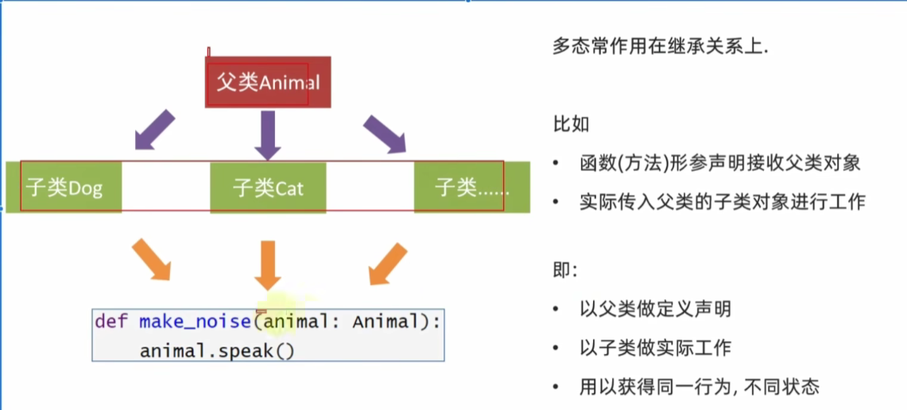

- 抽象方法

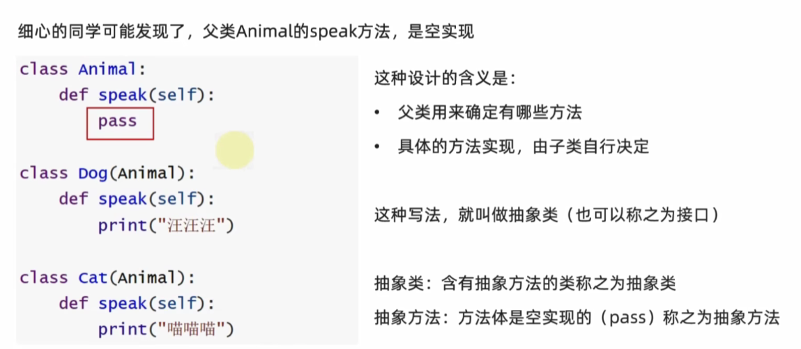

```python
# 演示抽象类
class AC:
    def cool_wind(self):
        """制冷"""
        pass

    def hot_wind(self):
        """制热"""
        pass

    def swing_l_r(self):
        """左右摆风"""
        pass

class Midea_AC(AC):
    def cool_wind(self):
        print("美的空调制冷")

    def hot_wind(self):
        print("美的空调制热")

    def swing_l_r(self):
        print("美的空调左右摆风")

class GREE_AC(AC):
    def cool_wind(self):
        print("格力空调制冷")

    def hot_wind(self):
        print("格力空调制热")

    def swing_l_r(self):
        print("格力空调左右摆风")

def make_cool(ac: AC):
    ac.cool_wind()

midea_ac = Midea_AC()
midea_ac.cool_wind()
gree_ac = GREE_AC()
gree_ac.cool_wind()


"""
美的空调制冷
格力空调制冷
"""
```

- 总结
  - 什么是多态？
    - 多态指的是，同一个行为，使用不同的对象获得不同的状态。
    - 如，定义函数（方法），通过类型注解声明需要父类对象，实际传入子类对象进行工作，从而获得不同的工作状态。
  - 什么是抽象类（接口）
    - 包含抽象方法的类，称之为抽象类。抽象方法是指：没有具体实现的方法（`pass`），称之为抽象方法。
  - 抽象类的作用
    - 多用于做顶层设计（设计标准），以便子类做具体实现
    - 也是对子类的一种软性约束，要求子类必须复写（实现）父类的一些方法。


## 2、SQL

### 2.1 python执行SQL

- 需要使用三方包：pip install -i https://pypi.tuna.tsinghua.edu.cn/simple pymysql

- 导包：from pymysql import Connection
- 数据库连接方式

```python
from pymysql import Connection

# 获取数据库连接对象
conn = Connection(
    host='localhost',
    port=3306,
    user='root',
    password='li998813'
)
# 打印软件信息
print(conn.get_server_info())
# 关闭数据库连接
conn.close()

"""
8.0.42
"""
```

- 非查询方法：增删改（exceute）

~~~python
from pymysql import Connection

# 获取数据库连接对象
conn = Connection(
    host='localhost',
    port=3306,
    user='root',
    password='li998813'
)

# 获取游标
cursor = conn.cursor()
# 选择数据库
conn.select_db("book")
# 执行DDL
cursor.execute(" create table test_table (id int, name varchar(20)) ")

# 关闭数据库连接
conn.close()
~~~

- 查询方法：查（execute）

~~~python
from pymysql import Connection

# 获取数据库连接对象
conn = Connection(
    host='localhost',
    port=3306,
    user='root',
    password='li998813'
)

# 获取游标
cursor = conn.cursor()
# 选择数据库
conn.select_db("book")
# 执行查询SQL
cursor.execute("select * from book")
# 结果接收
result = cursor.fetchall()
for row in result:
    print(row)

# 关闭数据库连接
conn.close()
~~~

- 总结
  - Python 中操作 MySQL 的第三方库
    - 使用第三方库为：**pymysql**
    - 安装命令：`pip install pymysql`
  - 获取数据库连接对象
    - 导包：`from pymysql import Connection`
    - 创建连接：`Connection(主机, 端口, 账户, 密码)` 即可得到连接对象
    - 关闭连接：`连接对象.close()` 用于关闭和 MySQL 数据库的连接
  - 执行 SQL 查询的步骤
    - 通过连接对象调用 `cursor()` 方法，得到**游标对象**
    - 执行 SQL 语句：`游标对象.execute(SQL语句)`
    - 查询结果会被封装到<font color="red">**元组**</font>内


### 2.2 DML提交

- 手动提交：在执行sql后，手动提交事物`conn.commit()`
- 自动提交：在创建连接的时候加上参数`conn.commit()`

```python
from pymysql import Connection

# 获取数据库连接对象
conn = Connection(
    host='localhost',
    port=3306,
    user='root',
    password='li998813',
    autocommit=True
)

# 获取游标
cursor = conn.cursor()
# 选择数据库
conn.select_db("book")

# 执行非查询SQL时要配合commit
cursor.execute(" update book set book_name = '123' where book_id = 1 ")
# 手动提交
conn.commit()


# 关闭数据库连接
conn.close()
```
