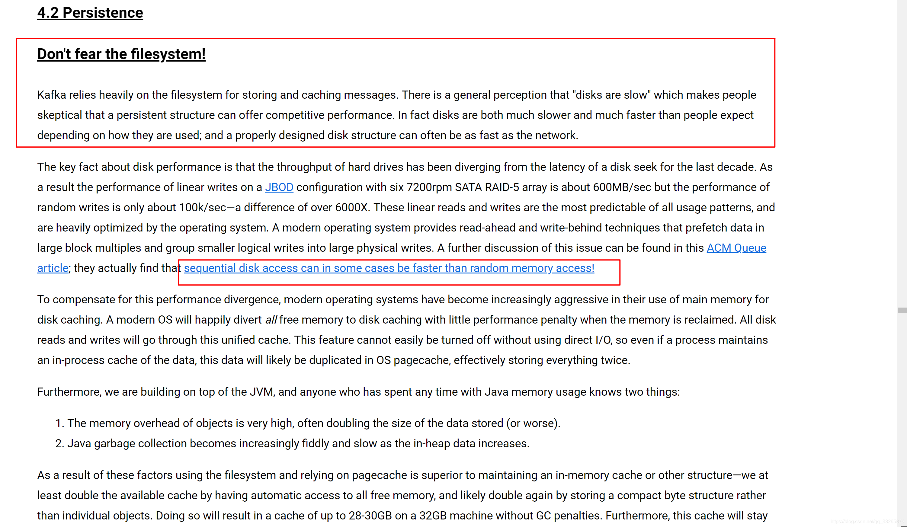

# 一、简介

## 1、是什么

<<<<<<< HEAD
- 官网：https://kafka.apache.org/
- 是一个开源**分布式事件流平台**，被用于高性能数据管道、流分析、数据集成和关键任务应用程序

=======
- 是一个**开源分布式事件流平台**，被数千家公司用于**高性能数据管道**、**流分析**、**数据集成**和**关键任务应用程序**

- kafka是一款**分布式的基于发布/订阅模式的消息队列**，是目前比较主流的消息中间件，kafka对消息保存时根据Topic（主题）进行归类，发送消息者称为Producer，消息接受者称为Consumer，此外kafka集群有多个kafka实例组成，每个实例(server)称为broker。无论是kafka集群，还是consumer**都依赖于zookeeper集群保存一些meta信息**，来保证系统可用性,所以安装kafka需要先间搭建zookeeper集群。
  - 为什么需要zookeeper：kafka集群中有一个broker会被选举为Controller，负责管理集群broker的上下线，及所有topic的分区副本分配和leader选举等工作。Controller的管理工作都是依赖于Zookeeper的。

## 2、kafka数据存储

- 作为一款消息中间件，很多人误以为写入kafka数据是存储在内存中，但是实际上**写入kafka的数据是存储在磁盘中**，很多人都认为磁盘很慢，为此，官网专门有一张对此作出了说明(不过听官网语气，大意是人们认为觉得磁盘很慢，但是官网说很快，总结一句话就是：我不要你觉得，我要我觉得)
- 在官方文档 4.2章持久化的介绍中，官网第一篇说了这样一句话:
  - **不要害怕文件系统！(文件系统即磁盘) **
  - kafka很大程度上是依赖于文件系统来缓存消息。人们普遍认为“磁盘速度很慢”，这使得人们怀疑其(kafka)持久化的架构及性能是否具有竞争力。实际上，磁盘的速度比人期望的更快或者更慢取决于他们(指磁盘)如何被使用。正确设计的磁盘结构通常可以和网络一样快。

- 上述的意思就是，磁盘其实并不慢，磁盘的快慢取决于人们如何去使用磁盘，那么，kafka如何在高效的使用磁盘，文档中我标记红框的那部分说了这样一句话：**顺序访问磁盘比随机访问内存更快！**那么kafka的高效的原因下面就总结出来了。

## 3、kafka高效的原因

- **顺序写磁盘**：Kafka的producer生产数据，要写入到log文件中，写的过程是一直追加到文件末端，为顺序写。官网有数据表明，同样的磁盘，顺序写能到600M/s，而随机写只有100K/s。这与磁盘的机械机构有关，顺序写之所以快，是因为其省去了大量磁头寻址的时间。
- **零拷贝技术**：“零拷贝技术”只用将磁盘文件的数据复制到页面缓存中一次，然后将数据从页面缓存直接发送到网络中（发送给不同的订阅者时，都可以使用同一个页面缓存），避免了重复复制操作。如果有10个消费者，传统方式下，数据复制次数为4*10=40次，而使用“零拷贝技术”只需要1+10=11次，一次为从磁盘复制到页面缓存，10次表示10个消费者各自读取一次页面缓存。
- **分区**：kafka对每个主题进行分区提高了并发，也提高了效率。

## 4、kafka的特点

- 类似于消息队列和商业的消息系统，kafka提供对流式数据的发布和订阅
- kafka提供一种持久的容错的方式存储流式数据
- kafka拥有良好的性能，可以及时地处理流式数据
- 每条记录由一个键，一个值和一个时间戳组成

5、
>>>>>>> f55ba7da807c28cea7652b0126831d18ef5fc82c
