# 1、消息队列

## 1.1 MQ的相关概念

### 1.1.1 什么是MQ

- MQ(message queue)，从字面意思上看，本质是个队列，遵循FIFO先入先出原则，且队列中存放的内容是message
- 是一种跨进程的通信机制，用于上下游传递消息
- 在互联网架构中，MQ是一种非常常见的上下游 “逻辑解耦+物理解耦” 的消息通信服务
- 使用了MQ后，消息发送上游只需要依赖MQ，不依赖其他服务


### 1.1.2 为什么要用MQ

1、流量消峰

​	比如，一个订单系统最多能处理一万次订单，这个处理能力应付正常时段的下单绰绰有余，正常时段下单一秒后就能返回结果。但是在高峰期，如果有两万次下单操作系统是处理不了的，只能限制订单超过一万后不允许用户下单。使用消息队列做缓冲，我们可以取消这个限制，把一秒内下的订单分散成一段时间来处理，这时候有些用户可能在下单十几秒后才能收到下单成功的操作，但是比不能下单的体验要好。

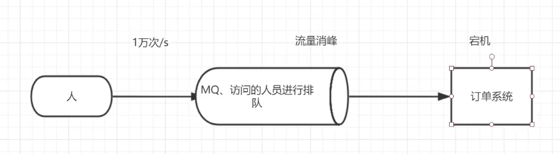


2、应用解耦

​	以电商应用为例，应用中有订单系统、库存系统、物流系统、支付系统。用户创建订单后，如果耦合调用库存系统、物流系统、支付系统，任何一个子系统出了故障，都会造成下单操作异常。当转变成基于消息队列的方式后，系统间调用的问题就会减少很多。比如物流系统因为发生故障，需要几分钟来修复。在这几分钟的时间里，物流系统要处理的内存被缓存在消息队列中，用户的下单操作可以正常完成。当物流系统恢复后，继续处理订单信息即可，期间用户感受不到系统的故障，提升系统的可用性。

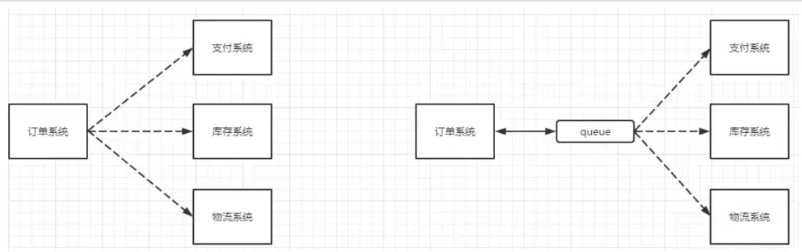


3、异步处理

​	有些服务间调用是异步的，例如A调用B，B需要花费很长时间执行，但是A需要知道B什么时候可以执行完。以前一般有两种方式，A过一段时间去调用B的查询api查询。或者A提供一个callback api，B执行完之后调用api通知A服务。这两种方式都不是很优雅。

​	使用消息队列后，A调用B服务后，只需要监听B处理完成的消息，当B处理完成后，会发送一条消息给MQ，MQ会将此消息转发给A服务。这样A服务既不用循环调用B的查询api，也不用提供callback api。同样B服务也不用做这些操作。A服务还能及时的得到异步处理成功的消息。

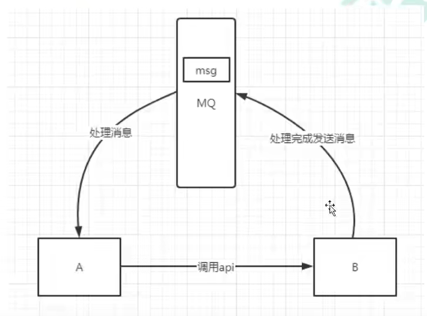


### 1.1.3 MQ的分类

1、ActiveMQ

- 优点：单机吞吐量万级，时效性ms级，可用性高，基于主从架构实现高可用性，消息可靠性较低的概率丢失数据
- 缺点：官方社区现在对ActiveMQ 5.x**维护越来越少，高吞吐量场景较少使用**


2、Kafka

​	大数据的杀手锏，是一款为**大数据而生**的消息中间件，以其**百万级TPS**的吞吐量名声大躁，在数据采集、传输、存储的过程中发挥着举足轻重的作用。

- 优点：性能卓越，单机写入TPS约在百万条/秒，最大的优点就是**吞吐量**。时效性ms级可用性非常高，kakfa是分布式的，一个数据多个副本，少数机器宕机，不会丢失数据，不会导致不可用，消费者采用Pull方式获取消息，消息有序，通过控制能够保证所有消息能被消费且仅被消费一次；有优秀的第三方Kafka web管理界面Kafka-Manager；在日志领域比较成熟，被多家公司和多个开源项目使用；功能支持：功较为简单，主要支持简单的MQ功能，在大数据领域的实时计算以及**日志采集**被大规模使用
- 缺点：kafka单机超过64个队列/分区，Load会发生明显的飙高现象（CPU），队列越多，load越高，发送消息相应时间变长，使用短轮询方式，实时性取决于轮询间隔时间，消费失败不支持重试(消息可能丢失)；支持消息顺序，但是一台代理宕机后，就会产生消息乱序，**社区更新较慢**；


3、RocketMQ

​	RocketMQ出自阿里巴巴的开源产品，用Java语言实现，在设计是参考了kafka，并作出了自己的改进。被阿里巴巴广泛应用在订单，交易，充值，流计算，消息推送，日志流式处理，binglog分发等场景。

- 优点：**单机吞吐量十万级**，可用性非常高，分布式架构，**消息可以做到0丢失**，MQ功能较为完善，还是分布式的，扩展性好，**支持10亿级别的消息堆积**，不会因为堆积导致性能下降。
- 缺点：**支持的客户端语言不多**，目前是Java和C++，其中C++不成熟；社区活跃度一般，没有在MQ核心中去实现JMS等接口，有些系统要迁移需要修改大量代码


4、RabbitMQ

​	在AMQP（高级消息队列协议）基础上完成，可复**用企业消息系统**，是当前最主流的消息中间件之一

- 优点：由于erlang语言的**高并发特性**，性能较好；**吞吐量到万级**，MQ功能比较完备、健壮、稳定、易用、跨平台、支持多种语言，如：Python、Ruby、.Net、Java、JMS、C、PHP等，支持Ajax文档齐全；开源提供的管理界面非常棒，用起来很好用；**社区活跃度高**；更新频率相当高
- 缺点：商业版需要收费，学习成本高


### 1.1.4 MQ的选择

1、kafka

​	主要特点是基于Pull的模式来处理消息消费，追求高吞吐量，一开始的目的就是用于日志收集和传输，适合产生**大量数据**的互联网服务的数据收集业务。**大型公司**建议可以选用，如果有**日志采集**功能，肯定首选kafka。

2、RocketMQ

​	天生为**金融互联网**领域而生，对于可靠性要求很高的场景，尤其是电商里面的订单扣款，以及业务削峰，在大量交易涌入时，后端可能无法及时处理的情况。RocketMQ在稳定性上值得信赖。

3、RabbitMQ

​	结合erlang语言本身的并发优势，性能好**时效性微秒级，社区活跃度也比较高**，管理界面用起来十分方便，如果数据量没那么大，中小型公司优先选择功能比较完善的RabbitMQ


## 1.2 RabbitMQ

### 1.2.1 RabbitMQ的概念

​	RabbitMQ是一个消息中间件：它接受并转发消息。可以把他当作一个快递站点，当需要发送包裹的时候，把包裹放到快递站，快递员最终会把你的快递送到收件人那里，按照这种逻辑RabbitMQ是一个快递站，一个快递员帮忙传递快件。RabbitMQ与快递站的主要区别在于，它不处理快件而是接收、存储和转发消息数据


### 1.2.2 四大核心概念

- 生产者：产生数据发送消息的程序是生产者
- 交换机：交换机是RabbitMQ非常重要的一个部件，一方面它接收来自生产者的消息 ，另一方面它将消息推送到队列中。交换机必须确切知道如何处理它接收到的消息，是将这些消息推送到特定队列还是多个队列，亦或者是把消息丢弃，这个得有交换机类型决定
- 队列：是RabbitMQ内部使用的一种数据结构，尽管消息流经RabbitMQ和应用程序，但他们只能存储在队列中。队列仅受主机的内存和磁盘限制的约束，本质上是一个大的消息缓冲区。许多生产者可以将消息发送到一个队列，许多消费者可以尝试从一个队列接收数据。这就是使用队列的方式
- 消费者：消费与接收具有相似含义。消费者大多时候是一个等待接收消息的程序。生产这和消息中间件很多时候并不在同一个机器上。同一个应用程序既可以是生产者也可以是消费者

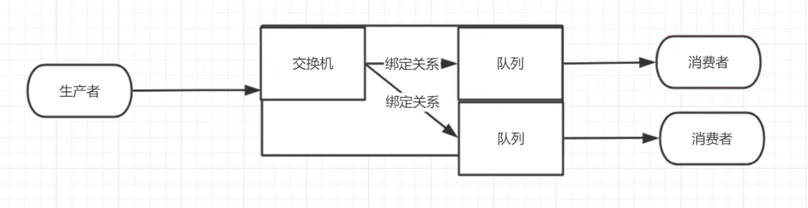


### 1.2.3 RabbitMQ核心部分

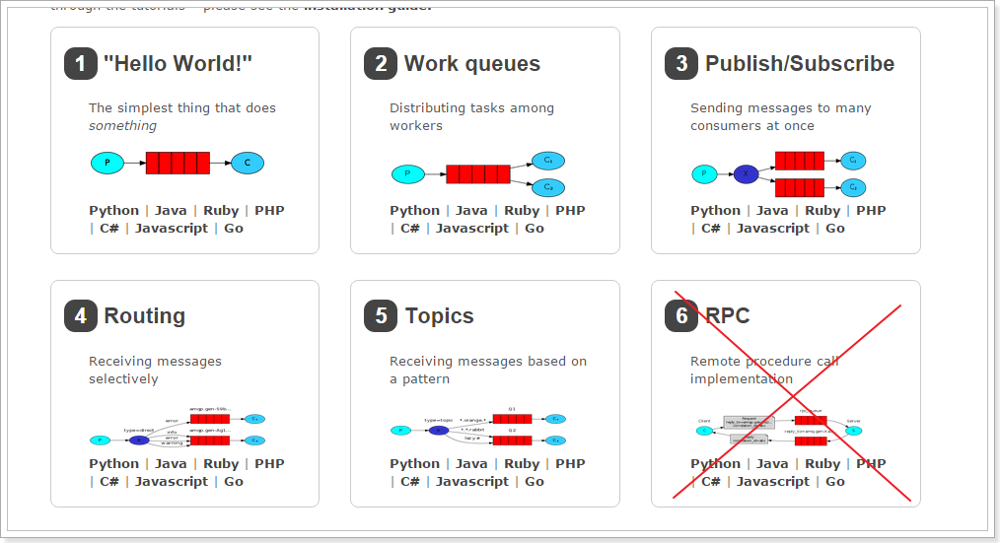


### 1.2.4 各个名词解释

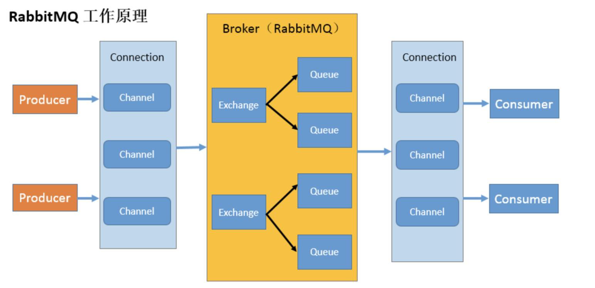

- Broker：接收和分发消息的应用，RabbitMQ server就是Message Broker
- Virtual host：出于多租户和安全因素设计的，把 AMQP 的基本组件划分到一个虚拟的分组中，类似于网络中的 namespace 概念。当多个不同的用户使用同一个 RabbitMQ server 提供的服务时，可以划分出多个 vhost，每个用户在自己的 vhost 创建 exchange 或 queue 等。
- Connection：连接，生产者/消费者与 Broker 之间的 TCP 网络连接。
- Channel：网络信道，如果每一次访问 RabbitMQ 都建立一个 Connection，在消息量大的时候建立连接的开销将是巨大的，效率也较低。Channel 是在 connection 内部建立的逻辑连接，如果应用程序支持多线程，通常每个 thread 创建单独的 channel 进行通讯，AMQP method 包含了 channel id 帮助客户端和 message broker 识别 channel，所以 channel 之间是完全隔离的。**Channel 作为轻量级的Connection 极大减少了操作系统建立 TCP connection 的开销**。
- Message：消息，服务与应用程序之间传送的数据，由Properties和body组成，Properties可是对消息进行修饰，比如消息的优先级，延迟等高级特性，Body则就是消息体的内容。
- Virtual Host：虚拟节点，用于进行逻辑隔离，最上层的消息路由，一个虚拟主机理由可以有若干个Exhange和Queue，同一个虚拟主机里面不能有相同名字的Exchange
- Exchange：交换机，是 message 到达 broker 的第一站，用于根据分发规则、匹配查询表中的 routing key，分发消息到 queue 中去，不具备消息存储的功能。常用的类型有：direct、topic、fanout。
- Bindings：exchange 和 queue 之间的虚拟连接，binding 中可以包含 routing key，Binding 信息被保存到 exchange 中的查询表中，用于 message 的分发依据。
- Routing key：是一个路由规则，虚拟机可以用它来确定如何路由一个特定消息
- Queue：消息队列，保存消息并将它们转发给消费者进行消费。


### 1.2.5 安装

1.官网网址

​	https://www.rabbitmq.com/download.html

2、docker安装

~~~bash
# 搜索镜像
docker search rabbitmq
# 拉取镜像
docker pull rabbitmq
# 启动镜像
docker run -d --hostname my-rabbit --name rabbit -p 15672:15672 -p 5672:5672 rabbitmq
# 开启web管理界面
docker ps 
docker exec -it 镜像ID /bin/bash
rabbitmq-plugins enable rabbitmq_management
# http://linuxip地址:15672，这里的用户名和密码默认都是guest
~~~

3、添加用户

~~~bash
# 查看用户
rabbitmqctl list_users
# 添加用户
rabbitmqctl add_user admin 123
# 赋予用户administrator角色
rabbitmqctl set_user_tags admin adminisrator
# 设置用户的权限
rabbitmqctl set_permissions -p / admin ".*" ".*" ".*"
~~~


# 2、Hello World

​	在本节中，将会编写两个程序。发送单个消息的生产者和接收消息并打印出来的消费者

- 下图中，"P"是生产者，C是消费者
- 中间的框是一个队列-RabbitMQ代表使用者保留的消息缓冲区

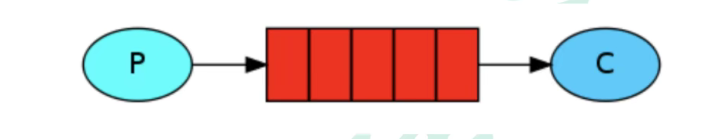


## 2.1 依赖

~~~xml
    <!-- 指定jdk版本 -->
    <build>
        <plugins>
            <plugin>
                <groupId>org.apache.maven.plugins</groupId>
                <artifactId>maven-compiler-plugin</artifactId>
                <configuration>
                    <source>8</source>
                    <target>8</target>
                </configuration>
            </plugin>
        </plugins>
    </build>

    <!-- 依赖 -->
    <dependencies>
        <!-- rabbitmq的依赖 -->
        <dependency>
            <groupId>com.rabbitmq</groupId>
            <artifactId>amqp-client</artifactId>
            <version>5.8.0</version>
        </dependency>
        <!-- 操作文件流的一个依赖 -->
        <dependency>
            <groupId>commons-io</groupId>
            <artifactId>commons-io</artifactId>
            <version>2.6</version>
        </dependency>
    </dependencies>
~~~


## 2.2 消息生产者

~~~java
package com.example.rabbitmq.one;

import com.rabbitmq.client.Channel;
import com.rabbitmq.client.Connection;
import com.rabbitmq.client.ConnectionFactory;

import java.io.IOException;
import java.util.concurrent.TimeoutException;

/**
 * 生产者：发消息
 */
public class Producer {

    // 队列名称
    public static final String QUEUE_NAME = "lsq";

    // 发消息
    public static void main(String[] args) throws IOException, TimeoutException {
        // 第1步，创建一个连接工厂
        ConnectionFactory factory = new ConnectionFactory();
        // 工厂Ip
        factory.setHost("192.168.126.134");
        // 工厂端口
        factory.setPort(5672);
        // 用户名
        factory.setUsername("admin");
        // 密码
        factory.setPassword("123");

        // 第2步，创建连接
        Connection connection = factory.newConnection("生成者1");
        // 获取信道
        Channel channel = connection.createChannel();
        /**
         * 生成一个队列
         * 1、队列名称
         * 2、队列里面的消息是否持久化（磁盘），默认情况消息存储在内存中(不持久化)
         * 3、该队列是否只供一个消费者进行消费 是否进行消息共享，true可以多个消费者消费 false：只能一个消费者消费
         * 4、是否自动删除 最后一个消费者断开连接后，该队列是否自动删除 true：自动删除 false：不自动删除
         * 5、其他参数
         */
        channel.queueDeclare(QUEUE_NAME, false, false, false, null);


        // 第3步，发消息
        String message = "i love lsq";
        /**
         * 信道发送一个消费
         * 1、发送到哪个交换机
         * 2、路由的key值是哪个 本次队列的名称
         * 3、其他参数信息
         * 4、发送消息的消息体
         */
        channel.basicPublish("", QUEUE_NAME, null, message.getBytes());
        System.out.println("发送完毕！");
    }
}
~~~


## 2.3 消息消费者

~~~java
package com.example.rabbitmq.one;

import com.rabbitmq.client.*;

import java.io.IOException;
import java.util.concurrent.TimeoutException;

/**
 * 消费者：接收消息
 */
public class Consumer {

    // 队列名称
    public static final String QUEUE_NAME = "lsq";

    // 接收消息
    public static void main(String[] args) throws IOException, TimeoutException {
        // 第1步，创建连接工厂
        ConnectionFactory factory = new ConnectionFactory();
        // 连接ip
        factory.setHost("192.168.126.134");
        // 工厂端口
        factory.setPort(5672);
        // 用户名
        factory.setUsername("admin");
        // 密码
        factory.setPassword("123");

        // 第2步，创建连接
        Connection connection = factory.newConnection();
        // 获取信道
        Channel channel = connection.createChannel();

        // 第三步，接收消息
        // 声明接收消息的回调
        DeliverCallback deliverCallback = (consumerTag, message) -> {
            System.out.println(new String(message.getBody()));
        };
        // 取消消费时的回调
        CancelCallback cancelCallback = consumerTag -> {
            System.out.println("消息消费被中断");
        };
        /**
         * 消费者消费消息
         * 1、消费哪个队列
         * 2、消费成功后是否自动应答 true：代表自动应答 false：代表手动应答
         * 3、消费者成功消费的回调
         * 4、消费者取消消费的回调
         */
        channel.basicConsume(QUEUE_NAME, true, deliverCallback, cancelCallback);
    }
}

~~~


# 3、Work Queues

​	工作队列（又称任务队列）的主要思想是避免立即执行资源密集型任务，而不得不等待它完成。相反我们安排任务在之后执行。我们把任务封装为消息并将其发送到队列。在后台运行的工作进程将弹出任务并最终执行作业。当有多个线程时，这些工作线程将一起处理这些任务。

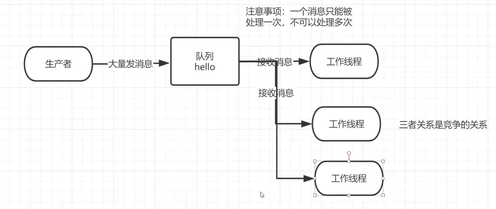

## 3.1 轮询分发消息

​	在这个案例里，我们会启动两个工作线程，一个消息发送线程。


### 3.1.1 抽取工作类

~~~java
package com.rabbitmq.util;

import com.rabbitmq.client.Channel;
import com.rabbitmq.client.Connection;
import com.rabbitmq.client.ConnectionFactory;

import java.io.IOException;
import java.util.concurrent.TimeoutException;

public class RabbitMqUtil {

    // 得到一个连接的channel
    public static Channel getChannel() throws IOException, TimeoutException {
        // 创建一个连接工厂
        ConnectionFactory factory = new ConnectionFactory();
        // 工厂IP 连接RabbitMQ的队列
        factory.setHost("192.168.126.134");
        // 端口
        factory.setPort(5672);
        // 用户名
        factory.setUsername("admin");
        // 密码
        factory.setPassword("123");
        // 创建一个连接
        Connection connection = factory.newConnection();
        // 返回一个信道
        Channel channel = connection.createChannel();
        return channel;
    }
}

~~~

### 3.1.2 启动两个工作线程

- 工作线程1：worker01

~~~java
package com.example.rabbitmq.two;

import com.example.rabbitmq.utils.RabbitMqUtil;
import com.rabbitmq.client.CancelCallback;
import com.rabbitmq.client.Channel;
import com.rabbitmq.client.DeliverCallback;

import java.io.IOException;
import java.util.concurrent.TimeoutException;

/**
 * 这是一个工作线程（相当于之前的消费者）
 */
public class Worker01 {

    // 队列名称
    public static final String QUEUE_NAME = "lsq";

    // 接收消息
    public static void main(String[] args) throws IOException, TimeoutException {
        // 调用工具类，获取信道
        Channel channel = RabbitMqUtil.getChannel();

        // 声明消费成功的回调
        DeliverCallback deliverCallback = (consumerTag, message) -> {
            System.out.println("接收到的消息" + new String(message.getBody()));
        };

        // 声明消费取消时的回调
        CancelCallback cancelCallback = (consumerTag) -> {
            System.out.println(consumerTag + "消费者取消消费接口回调逻辑！");
        };

        /**
         * 消费者消费消息
         * 1、消费哪个队列
         * 2、消费成功后是否自动应答 true：代表自动应答 false：代表手动应答
         * 3、消费者成功消费的回调
         * 4、消费者取消消费的回调
         */
        System.out.println("C1等待接收消息...");
        channel.basicConsume(QUEUE_NAME, true, deliverCallback, cancelCallback);
    }
}	
~~~

- 工作线程02：worker02

~~~java
package com.example.rabbitmq.two;

import com.example.rabbitmq.utils.RabbitMqUtil;
import com.rabbitmq.client.CancelCallback;
import com.rabbitmq.client.Channel;
import com.rabbitmq.client.DeliverCallback;

import java.io.IOException;
import java.util.concurrent.TimeoutException;

/**
 * 这是一个工作线程（相当于之前的消费者）
 */
public class Worker02 {

    // 队列名称
    public static final String QUEUE_NAME = "lsq";

    // 接收消息
    public static void main(String[] args) throws IOException, TimeoutException {
        // 调用工具类，获取信道
        Channel channel = RabbitMqUtil.getChannel();

        // 声明消费成功的回调
        DeliverCallback deliverCallback = (consumerTag, message) -> {
            System.out.println("接收到的消息:" + new String(message.getBody()));
        };

        // 声明消费取消时的回调
        CancelCallback cancelCallback = (consumerTag) -> {
            System.out.println(consumerTag + "消费者取消消费接口回调逻辑！");
        };

        /**
         * 消费者消费消息
         * 1、消费哪个队列
         * 2、消费成功后是否自动应答 true：代表自动应答 false：代表手动应答
         * 3、消费者成功消费的回调
         * 4、消费者取消消费的回调
         */
        System.out.println("C2等待接收消息...");
        channel.basicConsume(QUEUE_NAME, true, deliverCallback, cancelCallback);
    }
}

~~~

​	

### 3.1.3 启动一个生产者

~~~java
package com.example.rabbitmq.two;

import com.example.rabbitmq.utils.RabbitMqUtil;
import com.rabbitmq.client.Channel;

import java.io.IOException;
import java.util.Scanner;
import java.util.concurrent.TimeoutException;

/**
 * 生产者：生产大量消息的
 */
public class Task01 {

    // 队列名称
    public static final String QUEUE_NAME = "lsq";

    // 发消息
    public static void main(String[] args) throws IOException, TimeoutException {
        // 调用工具类生成信道
        Channel channel = RabbitMqUtil.getChannel();

        /**
         * 生成一个队列
         * 1、队列名称
         * 2、队列里面的消息是否持久化（磁盘），默认情况消息存储在内存中
         * 3、该队列是否只供一个消费者进行消费 是否进行消息共享，true可以多个消费者消费 false：只能一个消费者消费
         * 4、是否自动删除 最后一个消费者断开连接后，该队列是否自动删除 true：自动删除 false：不自动删除
         * 5、其他参数
         */
        channel.queueDeclare(QUEUE_NAME, false, false, false, null);

        // 从控制台输入信息
        Scanner scanner = new Scanner(System.in);
        while (scanner.hasNext()) {

            String message = scanner.next();
            /**
             * 信道发送一个消费
             * 1、发送到哪个交换机
             * 2、路由的key值是哪个 本次队列的名称
             * 3、其他参数信息
             * 4、发送消息的消息体
             */
            channel.basicPublish("", QUEUE_NAME, null, message.getBytes());
            System.out.println("发送消息成功！");
        }
    }
}

~~~


### 3.1.4 结果展示

- 轮询生产者：

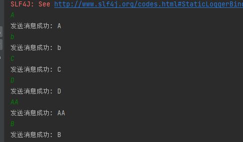

- 轮询消费者01：

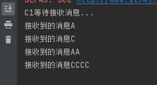

- 轮询消费者02：

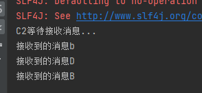


## 3.2 消息应答

### 3.2.1 概念

​	消费者完成了一个任务可能需要一段时间，如果其中一个消费者处理一个长的任务并仅只完成了部分突然它挂掉了，会发生什么情况。RabbitMQ一旦向消费者传递了一条消息，便立即将该消息标记为删除。在这种情况下，突然有个消费者挂掉了，我们将丢失正在处理的消息。以及后续发送该消费者的消息都会丢失，因为它无法接收到。

​	为了保证消息在发送过程中不丢失，rabbitmq引入消息应答机制，消息应答就是：**消费者在接收到消息并且处理该消息之后，告诉rabbitmq它已经处理了，rabbitmq可以把该消息删除了。**


### 3.2.2 自动应答

​	消息发送后立即被认为已经传送成功，这种模式需要在**高吞吐量和数据传输安全性方面做权衡**，因为这种模式如果在消息接收到之前，消费者那边出现连接或者channel关闭，那么消息就丢失了，当然另一方面这种模式消费者那边可以传递过载的消息。**没有对传递的消息数量进行限制**，当然这样有可能使得消费者这边由于接收太多还来不及处理的消息，导致这些消息的积压，最终使得内存耗尽，最终这些消费者线程被操作系统杀死，**所以这种模式仅适用在消费者可以高效并以某种速率能够处理这些消息的情况下使用**。


### 3.2.3 消息应答的方法

- Channel.basicAck（用于肯定确认）
  - RabbitMQ已知道该消息并成功的处理消息，可以将其丢弃了
- Channel.basicNack（用于否定确认）
- Channel.basicReject（用于否定确认）
  - 与Channel.basicNack相比少了一个参数
  - 不处理该消息了直接拒绝，可以将其丢弃了


### 3.2.4 Multiple的解释

手动应答的好处是可以批量应答并介绍网络拥堵

~~~java
channel.basicAck(deliveryTag, true);
/** true代表批量应答channel上未应答的消息
 *	比如说channel上又传送tag的消息5、6、7、8，当前tag是8，那么此时5-8的这些还未应答的消息都会被确认收到消息应答
 *	false：同上面相比，只会应答tag=8的消息，5、6、7这三个消息依然不会被确认收到消息应答
 */
~~~

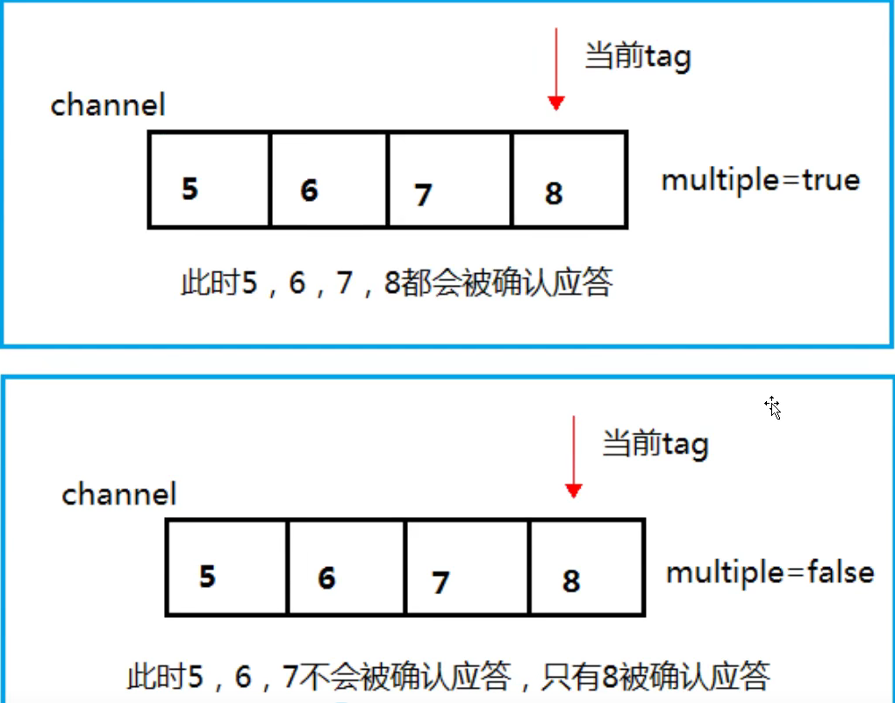


### 3.2.5 消息自动重新入队

​	如果消费者由于某些原因失去连接（其通道已关闭，连接已关闭或TCP连接丢失），导致消息未发送ACK确认，RabbitMQ将了解到消息未完全处理，并将对其重新排队。如果此时其他消费者可以处理，它将很快将其重新分发给另一个消费者。这样，即使某个消费者偶尔死亡，也可以确保不会丢失任何消息

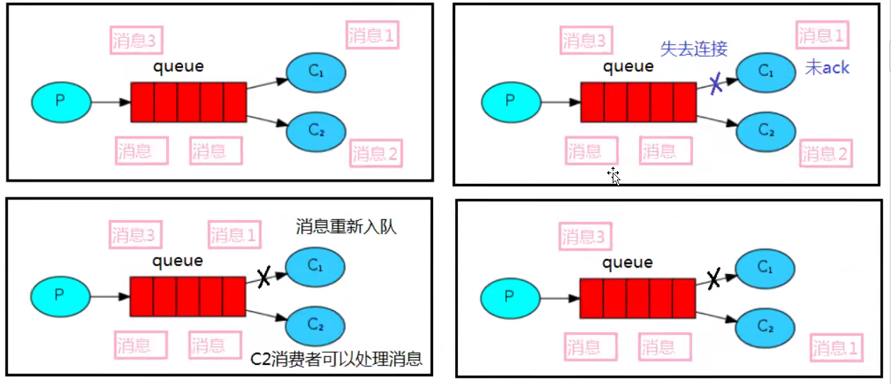


### 3.2.6 消息手动应答代码

- 默认消息采用的是自动应答，所以我们要想实现消息消费过程中不丢失，需要把自动应答改为手动应答
- channel.basicAck(message.getEnvelope().getDeliveryTag(), false);
- 下述就是消费者1

~~~java
package com.example.rabbitmq.three;

import com.example.rabbitmq.utils.RabbitMqUtil;
import com.example.rabbitmq.utils.SleepUtils;
import com.rabbitmq.client.CancelCallback;
import com.rabbitmq.client.Channel;
import com.rabbitmq.client.DeliverCallback;

import java.io.IOException;
import java.util.concurrent.TimeoutException;

/**
 * 消息在手动应答时不丢失，放回队列重新消费
 */
public class Work01 {

    // 队列名称
    public static final String task_queue_name = "ack_queue";

    // 接收消息
    public static void main(String[] args) throws IOException, TimeoutException {
        // 调用工具类获取信道
        Channel channel = RabbitMqUtil.getChannel();

        // 声明消费成功的回调
        DeliverCallback deliverCallback = (consumerTag, message) -> {
            // 沉睡1秒
            SleepUtils.sleep(1);
            System.out.println("接收到的消息:" + new String(message.getBody(),"UTF-8"));
            // 手动应答
            /**
             * 1、消息的标记 tag
             * 2、是否批量应答，false：不批量，true：批量
             */
            channel.basicAck(message.getEnvelope().getDeliveryTag(), false);
        };

        // 声明消费取消的回调
        CancelCallback cancelCallback = (consumerTag) -> {
            System.out.println(consumerTag + "消费者取消消费接口回调逻辑！");
        };

        System.out.println("C1等待接收消息处理事件较短！");
        /**
         * 消费者消费消息
         * 1、消费哪个队列
         * 2、消费成功后是否自动应答 true：代表自动应答 false：代表手动应答
         * 3、消费者成功消费的回调
         * 4、消费者取消消费的回调
         */
        channel.basicConsume(task_queue_name, false, deliverCallback, cancelCallback);
    }

}
~~~

- 消费者2

~~~java
package com.example.rabbitmq.three;

import com.example.rabbitmq.utils.RabbitMqUtil;
import com.example.rabbitmq.utils.SleepUtils;
import com.rabbitmq.client.CancelCallback;
import com.rabbitmq.client.Channel;
import com.rabbitmq.client.DeliverCallback;

import java.io.IOException;
import java.util.concurrent.TimeoutException;

/**
 * 消息在手动应答时不丢失，放回队列重新消费
 */
public class Work02 {

    // 队列名称
    public static final String task_queue_name = "ack_queue";

    // 接收消息
    public static void main(String[] args) throws IOException, TimeoutException {
        // 调用工具类获取信道
        Channel channel = RabbitMqUtil.getChannel();

        // 声明消费成功的回调
        DeliverCallback deliverCallback = (consumerTag, message) -> {
            // 沉睡30s
            SleepUtils.sleep(30);
            System.out.println("接收到的消息:" + new String(message.getBody(),"UTF-8"));
            // 手动应答
            /**
             * 1、消息的标记 tag
             * 2、是否批量应答，false：不批量，true：批量
             */
            channel.basicAck(message.getEnvelope().getDeliveryTag(), false);
        };

        // 声明消费取消的回调
        CancelCallback cancelCallback = (consumerTag) -> {
            System.out.println(consumerTag + "消费者取消消费接口回调逻辑！");
        };

        System.out.println("C2等待接收消息处理事件较长！");
        /**
         * 消费者消费消息
         * 1、消费哪个队列
         * 2、消费成功后是否自动应答 true：代表自动应答 false：代表手动应答
         * 3、消费者成功消费的回调
         * 4、消费者取消消费的回调
         */
        channel.basicConsume(task_queue_name, false, deliverCallback, cancelCallback);
    }

}
~~~


### 3.2.7 手动应答结果

- 发送aa，由消费者1消费
- 发送bb，正常由消费者2消费
- 发送cc，由消费者1消费
- 发送dd，如果失败，消息重新放回队列中，且由消费者1消费


## 3.3 RabbitMq持久化

### 3.3.1 概念

- 如何保障当RabbitMQ服务停掉以后消息生产者发送过来的消息不丢失
- 默认情况下，RabbitMQ退出或由于某种原因崩溃时，他忽视队列和消息，除非告知他不要这样做
- 确保消息不会丢失需要做两件事
  - 将队列和消息都标记为持久化


### 3.3.2 队列实现持久化

- 之前创建的队列都是非持久化的，rabbitmq如果重启的话，该队列就会被删除掉，如果要队列实现持久化，需要在声明队列的时候把durable参数设置为持久化

~~~java
/**
 * 生成一个队列
 * 1、队列名称
 * 2、队列里面的消息是否持久化（磁盘），默认情况消息存储在内存中
 * 3、该队列是否只供一个消费者进行消费 是否进行消息共享，true可以多个消费者消费 false：只能一个消费者消费
 * 4、是否自动删除 最后一个消费者断开连接后，该队列是否自动删除 true：自动删除 false：不自动删除
 * 5、其他参数
*/
boolean durable = ture;
channel.queueDeclare(task_queue_name, durable, false, false ,null);
~~~

- 注意：如果之前声明的队列不是持久化的，需要把原先的队列先删除，或者重新创建一个持久化的队列，否则就会出现错误
- 如果持久化的话，控制台显示如下

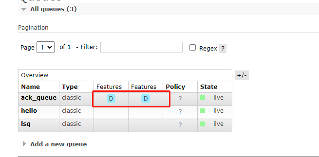


### 3.3.3 消息实现持久化

- 要想让消息实现持久化需要在消息生产者修改代码，MessageProperties.PERSISTENT_TEXT_PLAIN添加这个属性

~~~java
// 以前的
channel.basicPublish("", task_queue_name, null, message.getBytes());
// 现在的，当durable为true的时候
channel.basicPublish("", task_queue_name, MessageProperties.PERSISTENT_TEXT_PLAIN, message.getBytes());
~~~

- 将消息标记为持久化并不能完全保证不会丢失消息，尽管他告诉rabbitmq将消息保存到磁盘，但是这里依然存在当消息刚准备存储在磁盘的时候，还没有存储完，消息还在缓存的一个间隔点。此时并没有真正写入磁盘。持久性保证并不强，但是对于我们的简单任务队列而言，这已经绰绰有余


### 3.3.4 不公平分发

- 两个消费者都在处理任务，一个处理任务速度十分快，另一个速度却很慢，这时候采用轮询的方式就会浪费很多时间
- 为了避免这种情况，我们可以设置参数channel.basicQos(1);

~~~java
// 默认公平分发是0
int prefetchCount = 1;
channel.basicQos(prefetchCount);
~~~

- 消费者1

~~~java
package com.example.rabbitmq.three;

import com.example.rabbitmq.utils.RabbitMqUtil;
import com.example.rabbitmq.utils.SleepUtils;
import com.rabbitmq.client.CancelCallback;
import com.rabbitmq.client.Channel;
import com.rabbitmq.client.DeliverCallback;

import java.io.IOException;
import java.util.concurrent.TimeoutException;

/**
 * 消息在手动应答时不丢失，放回队列重新消费
 */
public class Work01 {

    // 队列名称
    public static final String task_queue_name = "ack_queue";

    // 接收消息
    public static void main(String[] args) throws IOException, TimeoutException {
        // 调用工具类获取信道
        Channel channel = RabbitMqUtil.getChannel();

        // 声明消费成功的回调
        DeliverCallback deliverCallback = (consumerTag, message) -> {
            // 沉睡1秒
            SleepUtils.sleep(1);
            System.out.println("接收到的消息:" + new String(message.getBody(),"UTF-8"));
            // 手动应答
            /**
             * 1、消息的标记 tag
             * 2、是否批量应答，false：不批量，true：批量
             */
            channel.basicAck(message.getEnvelope().getDeliveryTag(), false);
        };

        // 声明消费取消的回调
        CancelCallback cancelCallback = (consumerTag) -> {
            System.out.println(consumerTag + "消费者取消消费接口回调逻辑！");
        };

        System.out.println("C1等待接收消息处理事件较短！");

        // 设置不公平分发
        int prefetchCount = 1;
        channel.basicQos(prefetchCount);

        /**
         * 消费者消费消息
         * 1、消费哪个队列
         * 2、消费成功后是否自动应答 true：代表自动应答 false：代表手动应答
         * 3、消费者成功消费的回调
         * 4、消费者取消消费的回调
         */
        channel.basicConsume(task_queue_name, false, deliverCallback, cancelCallback);
    }
}
~~~

- 消费者2

~~~java
package com.example.rabbitmq.three;

import com.example.rabbitmq.utils.RabbitMqUtil;
import com.example.rabbitmq.utils.SleepUtils;
import com.rabbitmq.client.CancelCallback;
import com.rabbitmq.client.Channel;
import com.rabbitmq.client.DeliverCallback;

import java.io.IOException;
import java.util.concurrent.TimeoutException;

/**
 * 消息在手动应答时不丢失，放回队列重新消费
 */
public class Work02 {

    // 队列名称
    public static final String task_queue_name = "ack_queue";

    // 接收消息
    public static void main(String[] args) throws IOException, TimeoutException {
        // 调用工具类获取信道
        Channel channel = RabbitMqUtil.getChannel();

        // 声明消费成功的回调
        DeliverCallback deliverCallback = (consumerTag, message) -> {
            // 沉睡30s
            SleepUtils.sleep(30);
            System.out.println("接收到的消息:" + new String(message.getBody(),"UTF-8"));
            // 手动应答
            /**
             * 1、消息的标记 tag
             * 2、是否批量应答，false：不批量，true：批量
             */
            channel.basicAck(message.getEnvelope().getDeliveryTag(), false);
        };

        // 声明消费取消的回调
        CancelCallback cancelCallback = (consumerTag) -> {
            System.out.println(consumerTag + "消费者取消消费接口回调逻辑！");
        };

        System.out.println("C2等待接收消息处理事件较长！");

        // 设置不公平分发
        int prefetchCount = 1;
        channel.basicQos(prefetchCount);

        /**
         * 消费者消费消息
         * 1、消费哪个队列
         * 2、消费成功后是否自动应答 true：代表自动应答 false：代表手动应答
         * 3、消费者成功消费的回调
         * 4、消费者取消消费的回调
         */
        channel.basicConsume(task_queue_name, false, deliverCallback, cancelCallback);
    }

}
~~~

- 结果
  - aa由1执行
  - bb由2执行
  - cc由1执行
  - dd由1执行


### 3.3.5 预取值

- 默认采用轮询方式，但是当channel.basicQos(1);设置不为0的时候，会采用不公平分发
- 不公平分发会能者多劳，但是也可以限制他只工作多少个，这就是预取值
- channel.basicQos(1);设置为几，就是预取值为几，即他会从队列中找到这几个任务进行处理

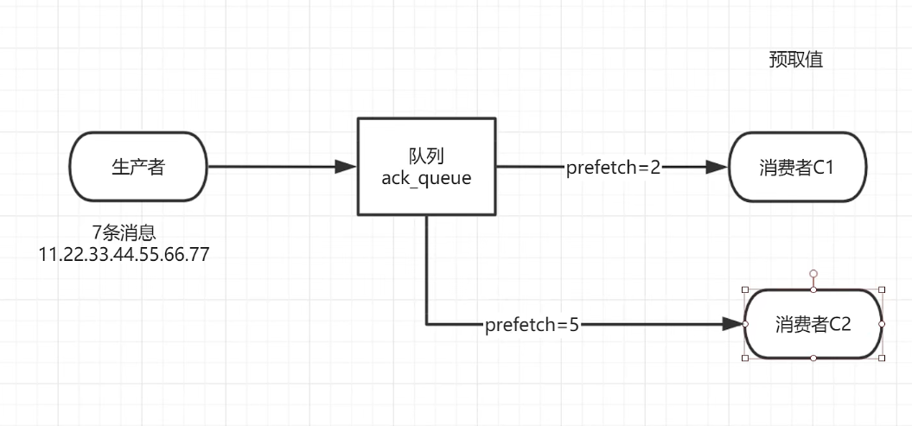

- 消费者1

~~~java
package com.example.rabbitmq.three;

import com.example.rabbitmq.utils.RabbitMqUtil;
import com.example.rabbitmq.utils.SleepUtils;
import com.rabbitmq.client.CancelCallback;
import com.rabbitmq.client.Channel;
import com.rabbitmq.client.DeliverCallback;

import java.io.IOException;
import java.util.concurrent.TimeoutException;

/**
 * 消息在手动应答时不丢失，放回队列重新消费
 */
public class Work01 {

    // 队列名称
    public static final String task_queue_name = "ack_queue";

    // 接收消息
    public static void main(String[] args) throws IOException, TimeoutException {
        // 调用工具类获取信道
        Channel channel = RabbitMqUtil.getChannel();

        // 声明消费成功的回调
        DeliverCallback deliverCallback = (consumerTag, message) -> {
            // 沉睡1秒
            SleepUtils.sleep(1);
            System.out.println("接收到的消息:" + new String(message.getBody(),"UTF-8"));
            // 手动应答
            /**
             * 1、消息的标记 tag
             * 2、是否批量应答，false：不批量，true：批量
             */
            channel.basicAck(message.getEnvelope().getDeliveryTag(), false);
        };

        // 声明消费取消的回调
        CancelCallback cancelCallback = (consumerTag) -> {
            System.out.println(consumerTag + "消费者取消消费接口回调逻辑！");
        };

        System.out.println("C1等待接收消息处理事件较短！");

        // 设置不公平分发
        int prefetchCount = 2;          // 预取值为2
        channel.basicQos(prefetchCount);

        /**
         * 消费者消费消息
         * 1、消费哪个队列
         * 2、消费成功后是否自动应答 true：代表自动应答 false：代表手动应答
         * 3、消费者成功消费的回调
         * 4、消费者取消消费的回调
         */
        channel.basicConsume(task_queue_name, false, deliverCallback, cancelCallback);
    }

}
~~~

- 消费者2

~~~java
package com.example.rabbitmq.three;

import com.example.rabbitmq.utils.RabbitMqUtil;
import com.example.rabbitmq.utils.SleepUtils;
import com.rabbitmq.client.CancelCallback;
import com.rabbitmq.client.Channel;
import com.rabbitmq.client.DeliverCallback;

import java.io.IOException;
import java.util.concurrent.TimeoutException;

/**
 * 消息在手动应答时不丢失，放回队列重新消费
 */
public class Work02 {

    // 队列名称
    public static final String task_queue_name = "ack_queue";

    // 接收消息
    public static void main(String[] args) throws IOException, TimeoutException {
        // 调用工具类获取信道
        Channel channel = RabbitMqUtil.getChannel();

        // 声明消费成功的回调
        DeliverCallback deliverCallback = (consumerTag, message) -> {
            // 沉睡30s
            SleepUtils.sleep(30);
            System.out.println("接收到的消息:" + new String(message.getBody(),"UTF-8"));
            // 手动应答
            /**
             * 1、消息的标记 tag
             * 2、是否批量应答，false：不批量，true：批量
             */
            channel.basicAck(message.getEnvelope().getDeliveryTag(), false);
        };

        // 声明消费取消的回调
        CancelCallback cancelCallback = (consumerTag) -> {
            System.out.println(consumerTag + "消费者取消消费接口回调逻辑！");
        };

        System.out.println("C2等待接收消息处理事件较长！");

        // 设置不公平分发
        int prefetchCount = 5;                  // 欲取值为5
        channel.basicQos(prefetchCount);

        /**
         * 消费者消费消息
         * 1、消费哪个队列
         * 2、消费成功后是否自动应答 true：代表自动应答 false：代表手动应答
         * 3、消费者成功消费的回调
         * 4、消费者取消消费的回调
         */
        channel.basicConsume(task_queue_name, false, deliverCallback, cancelCallback);
    }

}
~~~


# 4、发布确认

## 4.1 发布确认原理

- 消息生产者生产消息发送到rabbitmq上的时候，需要序列化
- 信道必须得序列化，消息也得序列化，才可将消息放到磁盘上
- 放到磁盘上，必须得跟生产者确认，确保是真的保存到磁盘上了

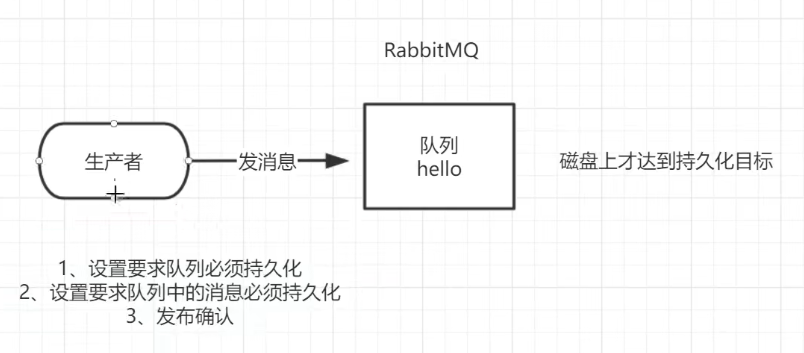


## 4.2 发布确认的策略

### 4.2.1 开启发布确认的方法

- 发布确认默认是没有开启的，如果要开启需要调用方法confirmSelect，每当你想使用发布确认，都需要在channel上调用该方法

~~~java
 // 获取信道
Channel channel = RabbitMqUtil.getChannel();
channel.confirmSelect();
~~~


### 4.2.2 单个确认发布

- 一种简单的确认方式，他是一种**同步确认发布**的方式，也就是发布一个消息之后只有它被确认发布，后续的消息才能继续发布
- waitForConfirmsOrDie(long)这个方法只有在消息被确认的时候才返回，如果在指定的时间范围内这个消息没有被确认那么将会抛出异常
- 缺点：**发布速度特别的慢**。因为如果没有确认发布的消息就会阻塞所有后续消息的发布，这种方式最多提供每秒不超过数百条发布消息的吞吐量

~~~java
// 单个确认
public static void publishMessageIndividually() throws Exception {
	Channel channel = RabbitMqUtil.getChannel();
    /**
     * 生成一个队列
     * 1、队列名称
     * 2、队列里面的消息是否持久化（磁盘），默认情况消息存储在内存中
     * 3、该队列是否只供一个消费者进行消费 是否进行消息共享，true可以多个消费者消费 false：只能一个消费者消费
     * 4、是否自动删除 最后一个消费者断开连接后，该队列是否自动删除 true：自动删除 false：不自动删除
     * 5、其他参数
     */
     String queueName = UUID.randomUUID().toString();
     channel.queueDeclare(queueName, false, false, false, null);

     // 开启发布确认
     channel.confirmSelect();

     // 开始时间
     long beginTime = System.currentTimeMillis();

     // 批量发送消息
     for(int i = 0; i < MESSAGE_COUNT; i++){
        String message = i + "";
        /**
         * 信道发送一个消费
         * 1、发送到哪个交换机
         * 2、路由的key值是哪个 本次队列的名称
         * 3、其他参数信息
         * 4、发送消息的消息体
         */
         channel.basicPublish("", queueName, null, message.getBytes());
         // 单个消息马上进行发布确认
         boolean flag = channel.waitForConfirms();
         if(flag) {            
             System.out.println("消息发送成功！");
         }
     }

     // 结束时间
     long endTime = System.currentTimeMillis();
     System.out.println("发布" + MESSAGE_COUNT + "个单独确认消息，耗时:" + (endTime - beginTime) + "ms");
}
~~~

- 发布1000个单独确认消息，耗时:762ms


### 4.3.3 批量确认发布

- 与单个等待确认消息相比，先发布一批消息然后一起确认
- 可以极大提高吞吐量
- 缺点：当发生故障导致发布出现问题时，不知道是哪个消息出现问题，我们必须将整个批处理保存在内存中，以记录重要的信息而后重新发布消息
- **同步确认发布**，会阻塞消息的发布

~~~java
// 批量确认发布
public static void publishMessageBatch() throws Exception{
	Channel channel = RabbitMqUtil.getChannel();

	/**
	 * 生成一个队列
	 * 1、队列名称
	 * 2、队列里面的消息是否持久化（磁盘），默认情况消息存储在内存中
	 * 3、该队列是否只供一个消费者进行消费 是否进行消息共享，true可以多个消费者消费 false：只能一个消费者消费
	 * 4、是否自动删除 最后一个消费者断开连接后，该队列是否自动删除 true：自动删除 false：不自动删除
	 * 5、其他参数
	 */
    String queueName = UUID.randomUUID().toString();
    channel.queueDeclare(queueName, false,false, false, null);
    
    // 开启发布确认
    channel.confirmSelect();
	
    // 发布开始时间
    long beginTime = System.currentTimeMillis();

    // 批量确认消息大小
    int batchSize = 100;

    // 批量发送消息
    for(int i = 0; i < MESSAGE_COUNT; i++) {
    	String message = i + "";
        /**
         * 信道发送一个消费
         * 1、发送到哪个交换机
         * 2、路由的key值是哪个 本次队列的名称
         * 3、其他参数信息
         * 4、发送消息的消息体
         */
        channel.basicPublish("", queueName, null, message.getBytes());

        // 判断达到100条消息的时候，批量确认一次
        if(i%batchSize == 0){
            // 发布确认
            channel.waitForConfirms();
        }
    }

    // 结束时间
    long endTime = System.currentTimeMillis();
    System.out.println("发布" + MESSAGE_COUNT + "个批量确认消息，耗时:" + (endTime - beginTime) + "ms");
}
~~~

- 发布1000个批量确认消息，耗时:74ms


### 4.3.4 异步确认发布

- 性价比最高，可靠性和效率都是最好的
- 他是利用回调函数来达到消息可靠性传递的
- 这个中间件也是通过函数回调来保证是否投递成功

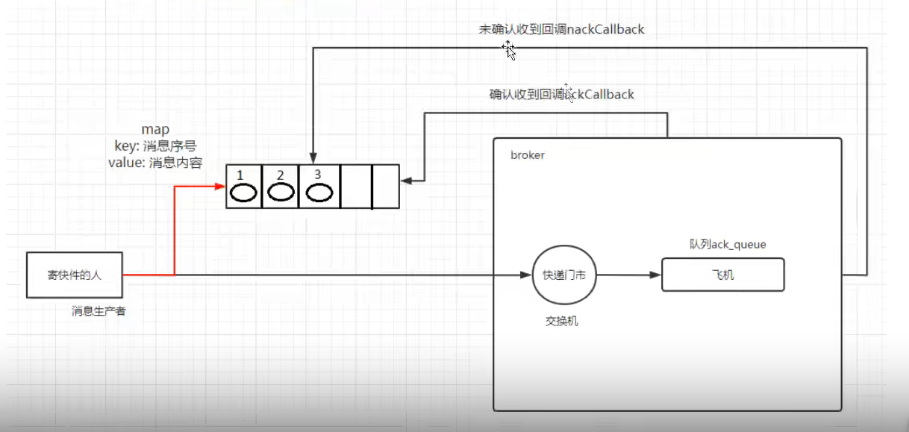

~~~java
// 异步确认发布
    public static void publishMessageAsync() throws Exception {
        // 调用工具类获取信道
        Channel channel = RabbitMqUtil.getChannel();
        /**
         * 生成一个队列
         * 1、队列名称
         * 2、队列里面的消息是否持久化（磁盘），默认情况消息存储在内存中
         * 3、该队列是否只供一个消费者进行消费 是否进行消息共享，true可以多个消费者消费 false：只能一个消费者消费
         * 4、是否自动删除 最后一个消费者断开连接后，该队列是否自动删除 true：自动删除 false：不自动删除
         * 5、其他参数
         */
        String queueName = UUID.randomUUID().toString();
        channel.queueDeclare(queueName, false, false, false, null);

        // 开启确认发布
        channel.confirmSelect();

        // 开始时间
        long beginTime = System.currentTimeMillis();

        // 消息确认成功回调
        ConfirmCallback ackCallback = (deliveryTag, multiple) -> {
            System.out.println("确认的消息：" + deliveryTag);
        };

        /**
         * 消息确认失败回调
         * 1、消息的标记
         * 2、是否为批量确认
         */
        ConfirmCallback nackCallback = (deliveryTag, multiple) -> {
            System.out.println("未确认的消息：" + deliveryTag);
        };

        /**
         *  准备消息监听器 监听哪些消息成功了 哪些消息失败
         *  1、消息确认成功
         *  2、消息确认失败
         */
        channel.addConfirmListener(ackCallback, nackCallback);

        // 批量发送消息
        for(int i = 0; i < MESSAGE_COUNT; i++) {
            String message = i + "";
            /**
             * 信道发送一个消费
             * 1、发送到哪个交换机
             * 2、路由的key值是哪个 本次队列的名称
             * 3、其他参数信息
             * 4、发送消息的消息体
             */
            channel.basicPublish("", queueName, null, message.getBytes());
        }

        // 结束时间
        long endTime = System.currentTimeMillis();
        System.out.println("发布" + MESSAGE_COUNT + "个异步确认消息，耗时:" + (endTime - beginTime) + "ms");
    }
~~~

- 发布1000个异步确认消息，耗时:34ms


### 4.3.5 如何处理异步未确认消息

- 最好的解决方案就是把未确认的消息放到一个基于内存的能被发布线程访问的队列
- 比如说用ConcurrentLinkedQueue这个队列在confirm callbacks与发布线程之间进行消息的传递

~~~java
// 异步确认发布
    public static void publishMessageAsync() throws Exception {
        // 调用工具类获取信道
        Channel channel = RabbitMqUtil.getChannel();
        /**
         * 生成一个队列
         * 1、队列名称
         * 2、队列里面的消息是否持久化（磁盘），默认情况消息存储在内存中
         * 3、该队列是否只供一个消费者进行消费 是否进行消息共享，true可以多个消费者消费 false：只能一个消费者消费
         * 4、是否自动删除 最后一个消费者断开连接后，该队列是否自动删除 true：自动删除 false：不自动删除
         * 5、其他参数
         */
        String queueName = UUID.randomUUID().toString();
        channel.queueDeclare(queueName, false, false, false, null);
        // 开启确认发布
        channel.confirmSelect();

        /**
         * 线程安全有序的一个哈希表 适用于高并发的情况下
         * 1、轻松的将序号与消息进行关联
         * 2、轻松批量删除条目 只要给到序号
         * 3、支持高并发（多线程）
         */
        ConcurrentSkipListMap<Long, String> outstanddingConfirms = new ConcurrentSkipListMap<>();

        // 消息确认成功回调
        ConfirmCallback ackCallback = (deliveryTag, multiple) -> {
            if(multiple) {
                // 2、删除已经确认的消息 剩下的就是未确认的消息
                // 批量确认及时清理
                ConcurrentNavigableMap<Long, String> confirmed = outstanddingConfirms.headMap(deliveryTag);
                confirmed.clear();
            } else {
                outstanddingConfirms.remove(deliveryTag);
            }
            System.out.println("确认的消息：" + deliveryTag);

        };

        /**
         * 消息确认失败回调
         * 1、消息的标记
         * 2、是否为批量确认
         */
        ConfirmCallback nackCallback = (deliveryTag, multiple) -> {
            // 3、打印未确认的消息
            String message = outstanddingConfirms.get(deliveryTag);
            System.out.println("未确认的消息：" + message + "未确认的消息tag：" + deliveryTag);
        };

        /**
         *  准备消息监听器 监听哪些消息成功了 哪些消息失败
         *  1、消息确认成功
         *  2、消息确认失败
         */
        channel.addConfirmListener(ackCallback, nackCallback);

        // 开始时间
        long beginTime = System.currentTimeMillis();
        // 批量发送消息
        for(int i = 0; i < MESSAGE_COUNT; i++) {
            String message = i + "";
            /**
             * 信道发送一个消费
             * 1、发送到哪个交换机
             * 2、路由的key值是哪个 本次队列的名称
             * 3、其他参数信息
             * 4、发送消息的消息体
             */
            channel.basicPublish("", queueName, null, message.getBytes());
            // 1、此处记录下所有要发送的消息 消息的总和
            outstanddingConfirms.put(channel.getNextPublishSeqNo(), message);
        }

        // 结束时间
        long endTime = System.currentTimeMillis();
        System.out.println("发布" + MESSAGE_COUNT + "个单独确认消息，耗时:" + (endTime - beginTime) + "ms");
    }
~~~


# 5、交换机

- 前面的都是每个任务都恰好交付给一个消费者（工作进程）

- ### 现在有个需求，需要把消息传达给多个消费者，这种称为“发布/订阅”模式

- 为了说明这种情况，将构建一个简单的日志系统。它由两个程序组成：第一个程序将发出日志消息，第二个程序是消费者。启动两个消费者，其中一个消费者接收到消息后把日志存储在磁盘，另外一个消费者接收到消息后把消息打印在屏幕上，事实上第一个程序发出的日志消息将广播给所有消费者


## 5.1 Exchanges

### 5.1.1 Exchanges概念

- RabbitMQ消息传递模型的核心思想：**生产者生产的消息从不会直接发送到队列**。实际上，通常生产者都不知道这些消息传递到了哪些队列中
- 相反，**生产者只能将消息发送到交换机**
- 交换机的工作内容：一方面接收来自生产者的消息，另一方面将他们推入队列
- 交换机必须确切知道如何处理收到的消息：是把他们放到特定的队列还是把他们放到许多队列中还是应该丢弃他们，这都由交换机的类型来决定

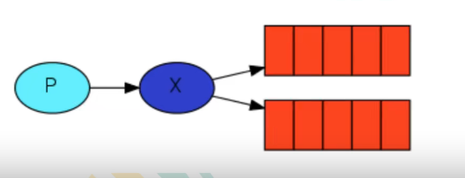


### 5.1.2 Exchanges的类型

- 直接（direct）
- 主题（topic）
- 标题（headers）
- 扇出（fanout）


### 5.1.3 无名exchange

- 在之前没用到具体的交换机，但是仍然能够将消息发送到队列。这是因为之前用到的都是默认交换，通过空字符串("")进行标识

~~~java
channel.basicPublish("", queueName, null, message.getBytes());
~~~

- 第一个参数是交换机的名称。空字符串标识默认或无名交换机：消息能路由发送到队列中其实是由routingKey(bindingkey)绑定key指定的，如果它存在的话


## 5.2 临时队列

- 前面使用的都是具有特定名称的队列，队列名称指定消费者去消费哪个队列的消息
- 当连接到Rabbit时，需要一个全新的空队列，为此可以创建一个具有**随机名称的队列**，或者能让服务器为我们选择一个随即队列名称。其次**一旦断开了消费者的连接，队列将会被自动删除**
- 创建临时队列的方式：

~~~java
String queueName = channel.queueDeclare().getQueue()；
~~~

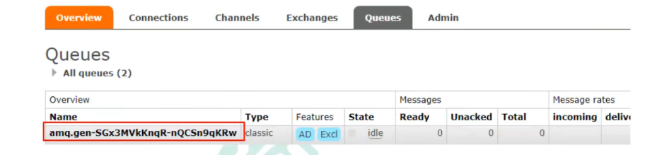


## 5.3 绑定(bindings)

- binding就是exchange和queue之间的桥梁，告诉exchange和那个队列进行了绑定关系

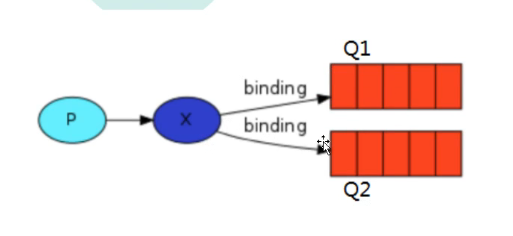


## 5.4 Fanout exchange

### 5.4.1 Fanout介绍

- 将接收到的所有**消息广播**到它知道的所有队列中。系统中默认有些exchange类型

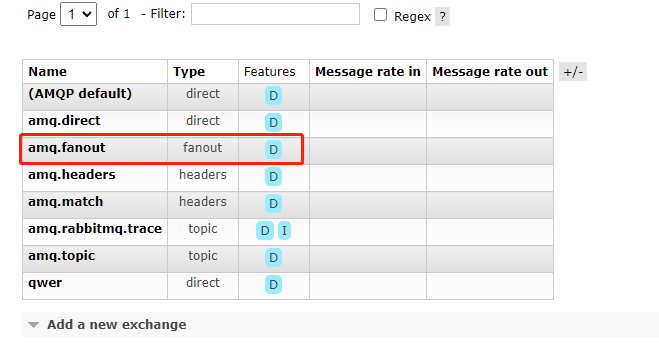


### 5.4.2 实战

- 消息生产者

~~~java
package com.example.rabbitmq.five;

import com.example.rabbitmq.utils.RabbitMqUtil;
import com.rabbitmq.client.Channel;

import java.util.Scanner;

/**
 * 发消息 交换机
 */
public class EmitLog {

    // 交换机的名称
    public static final String EXCHANGE_NAME = "logs";

    public static void main(String[] args) throws  Exception{
        // 调用工具类获取信道
        Channel channel = RabbitMqUtil.getChannel();
        // 声明交换机
        channel.exchangeDeclare(EXCHANGE_NAME, "fanout");

        Scanner scanner = new Scanner(System.in);
        while (scanner.hasNext()) {
            String message = scanner.next();
            channel.basicPublish(EXCHANGE_NAME, "", null,message.getBytes());
            System.out.println("生产者发出消息：" + message);
        }
    }
}

~~~

- 消息接收者1

~~~java
package com.example.rabbitmq.five;

import com.example.rabbitmq.utils.RabbitMqUtil;
import com.rabbitmq.client.CancelCallback;
import com.rabbitmq.client.Channel;
import com.rabbitmq.client.DeliverCallback;

/**
 * 消息接收
 */
public class ReceiveLogs01 {

    // 交换机的名称
    public static final String EXCHANGE_NAME = "logs";

    public static void main(String[] args) throws  Exception{
        // 调用工具类获取信道
        Channel channel = RabbitMqUtil.getChannel();
        // 声明一个交换机，扇出类型
        channel.exchangeDeclare(EXCHANGE_NAME, "fanout");
        // 声明一个队列 临时队列 队列名称是随机的 当消费者断开与队列的连接的时候，队列就自动删除
        String queueName = channel.queueDeclare().getQueue();
        // 绑定交换机和队列
        channel.queueBind(queueName, EXCHANGE_NAME, "");
        System.out.println("等待接收消息，把接收到的消息打印在屏幕上！");

        // 消息成功的回调
        DeliverCallback deliverCallback = (consumerTag, message) -> {
            System.out.println("ReceiveLogs01控制台打印收到的消息：" + new String(message.getBody(), "UTF-8"));
        };
        // 消息失败的回调
        CancelCallback cancelCallback = (consumerTag) -> { };
        // 消费消息
        channel.basicConsume(queueName, true, deliverCallback, cancelCallback);

    }
}
~~~

- 消息接收者2

~~~java
package com.example.rabbitmq.five;

import com.example.rabbitmq.utils.RabbitMqUtil;
import com.rabbitmq.client.CancelCallback;
import com.rabbitmq.client.Channel;
import com.rabbitmq.client.DeliverCallback;

/**
 * 消息接收
 */
public class ReceiveLogs02 {

    // 交换机的名称
    public static final String EXCHANGE_NAME = "logs";

    public static void main(String[] args) throws  Exception{
        // 调用工具类获取信道
        Channel channel = RabbitMqUtil.getChannel();
        // 声明一个交换机，扇出类型
        channel.exchangeDeclare(EXCHANGE_NAME, "fanout");
        // 声明一个队列 临时队列 队列名称是随机的 当消费者断开与队列的连接的时候，队列就自动删除
        String queueName = channel.queueDeclare().getQueue();
        // 绑定交换机和队列
        channel.queueBind(queueName, EXCHANGE_NAME, "");
        System.out.println("等待接收消息，把接收到的消息打印在屏幕上！");

        // 消息成功的回调
        DeliverCallback deliverCallback = (consumerTag, message) -> {
            System.out.println("ReceiveLogs02控制台打印收到的消息：" + new String(message.getBody(), "UTF-8"));
        };
        // 消息失败的回调
        CancelCallback cancelCallback = (consumerTag) -> { };
        // 消费消息
        channel.basicConsume(queueName, true, deliverCallback, cancelCallback);

    }
}
~~~

- 结果
  - 发布的消息，二者都会接收


## 5.5 Direct exchange

- 每个队列和交换机之间会通过routingKey进行绑定
- 发送消息时，根据routingKey可以选择对那个队列进行发送
- **接收指定的日志**

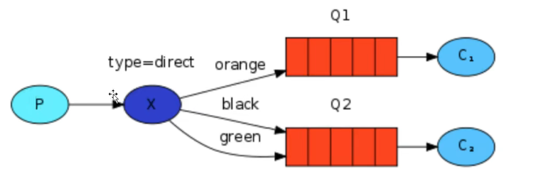

- 消费者1

~~~java
package com.example.rabbitmq.six;

import com.example.rabbitmq.utils.RabbitMqUtil;
import com.rabbitmq.client.BuiltinExchangeType;
import com.rabbitmq.client.CancelCallback;
import com.rabbitmq.client.Channel;
import com.rabbitmq.client.DeliverCallback;

/**
 * 直接交换机
 */
public class ReceiveLogsDirect01 {

    // 交换机名称
    public static final String exchange_name = "direct_name";

    public static void main(String[] args) throws Exception {
        // 调用工具类获取信道
        Channel channel = RabbitMqUtil.getChannel();
        // 声明一个交换机
        channel.exchangeDeclare(exchange_name, BuiltinExchangeType.DIRECT);
        // 声明一个队列
        channel.queueDeclare("console",false,false,false,null);
        // 将交换机和队列绑定
        channel.queueBind("console", exchange_name, "info");
        channel.queueBind("console", exchange_name, "warning");
        // 消息成功的回调
        DeliverCallback deliverCallback = (consumerTag, message) -> {
            System.out.println("ReceiveLogsDirect01控制台打印收到的消息：" + new String(message.getBody(), "UTF-8"));
        };
        // 消息失败的回调
        CancelCallback cancelCallback = (consumerTag) -> { };
        // 消费消息
        channel.basicConsume("console", true, deliverCallback, cancelCallback);

    }
}
~~~

- 消费者2

~~~java
package com.example.rabbitmq.six;

import com.example.rabbitmq.utils.RabbitMqUtil;
import com.rabbitmq.client.BuiltinExchangeType;
import com.rabbitmq.client.CancelCallback;
import com.rabbitmq.client.Channel;
import com.rabbitmq.client.DeliverCallback;

/**
 * 直接交换机
 */
public class ReceiveLogsDirect02 {

    // 交换机名称
    public static final String exchange_name = "direct_name";

    public static void main(String[] args) throws Exception {
        // 调用工具类获取信道
        Channel channel = RabbitMqUtil.getChannel();
        // 声明一个交换机
        channel.exchangeDeclare(exchange_name, BuiltinExchangeType.DIRECT);
        // 声明一个队列
        channel.queueDeclare("disk",false,false,false,null);
        // 将交换机和队列绑定
        channel.queueBind("disk", exchange_name, "error");
        // 消息成功的回调
        DeliverCallback deliverCallback = (consumerTag, message) -> {
            System.out.println("ReceiveLogsDirect02控制台打印收到的消息：" + new String(message.getBody(), "UTF-8"));
        };
        // 消息失败的回调
        CancelCallback cancelCallback = (consumerTag) -> { };
        // 消费消息
        channel.basicConsume("disk", true, deliverCallback, cancelCallback);

    }
}
~~~

- 生产者

~~~java
package com.example.rabbitmq.six;

import com.example.rabbitmq.utils.RabbitMqUtil;
import com.rabbitmq.client.Channel;

import java.util.Scanner;

/**
 * 发送消息
 */
public class DirectLogs {

    // 交换机名称
    public static final String exchange_name = "direct_name";

    public static void main(String[] args) throws Exception{
        // 调用工具类获取信道
        Channel channel = RabbitMqUtil.getChannel();
        // 发送消息
        Scanner scanner = new Scanner(System.in);
        while (scanner.hasNext()) {
            String message = scanner.next();
            /**
             * 信道发送一个消费
             * 1、发送到哪个交换机
             * 2、路由的key值是哪个 本次队列的名称
             * 3、其他参数信息
             * 4、发送消息的消息体
             */
            channel.basicPublish(exchange_name, "error", null, message.getBytes());
            System.out.println("发送成功！");
        }
    }
}
~~~

- 结果：
  - 如果对info或者warning发送，console就会接收到
  - 如果对error发送，只有disk才会接收到


## 5.6 Topic exchange

### 5.6.1 之前的问题

- 比如想接收的日志类型有info.base和info.advantage，某个队列只想接收info.base，direct就办不到，就是无法发送到多个指定队列


### 5.6.2 Topic要求

- topic交换机的消息routingKey不能随意写，**必须是一个单词列表，以点号分隔开**，且最多不能超过255个字节
- 比如
  - stock.usd.myse
  - nyse.vmw
- 替换符
  - *(星号)可以代替一个单词
  - (井号)#可以代替零个或多个单词


### 5.6.3 Topic匹配案例

- 当一个队列绑定键是#，这个队列就可以接收所有数据，有点像fanout
- 当没有#和*出现时，就是direct了

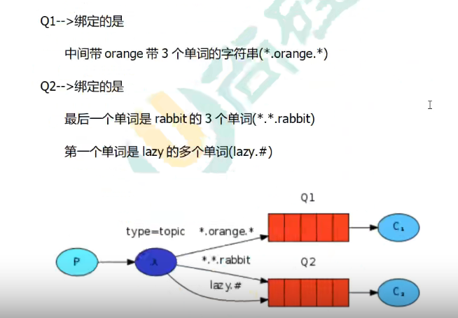

- quick.orange.rabbit：被队列Q1Q2接收
- lazy.orange.elephant：被队列Q1Q2接收
- quick.brown.fox：不匹配任何会被删除
- lazy.orange.male.rabbit：只符合Q2


### 5.6.4 实战

- 消息消费者1

~~~java
package com.example.rabbitmq.seven;

import com.example.rabbitmq.utils.RabbitMqUtil;
import com.rabbitmq.client.BuiltinExchangeType;
import com.rabbitmq.client.CancelCallback;
import com.rabbitmq.client.Channel;
import com.rabbitmq.client.DeliverCallback;

/**
 * Topic交换机
 */
public class ReceiveLogsTopic01 {

    // 交换机名称
    public static final String EXCHANGE_NAME = "topic_logs";

    // 发送消息
    public static void main(String[] args) throws Exception {
        // 调用工具类获取信道
        Channel channel = RabbitMqUtil.getChannel();
        // 声明一个交换机
        channel.exchangeDeclare(EXCHANGE_NAME, BuiltinExchangeType.TOPIC);
        /**
         * 生成一个队列
         * 1、队列名称
         * 2、队列里面的消息是否持久化（磁盘），默认情况消息存储在内存中(不持久化)
         * 3、该队列是否只供一个消费者进行消费 是否进行消息共享，true可以多个消费者消费 false：只能一个消费者消费
         * 4、是否自动删除 最后一个消费者断开连接后，该队列是否自动删除 true：自动删除 false：不自动删除
         * 5、其他参数
         */
        channel.queueDeclare("Q1", false, false, false, null);
        // 将队列和交换机绑定
        channel.queueBind("Q1", EXCHANGE_NAME, "*.orange.*");
        // 消息成功的回调
        DeliverCallback deliverCallback = (consumerTag, message) -> {
            System.out.println("ReceiveLogsTopic01控制台打印收到的消息：" + new String(message.getBody(), "UTF-8"));
            System.out.println("接收队列：Q1, 绑定键" + message.getEnvelope().getRoutingKey());
        };
        // 消息失败的回调
        CancelCallback cancelCallback = (consumerTag) -> { };
        /**
         * 消费者消费消息
         * 1、消费哪个队列
         * 2、消费成功后是否自动应答 true：代表自动应答 false：代表手动应答
         * 3、消费者成功消费的回调
         * 4、消费者取消消费的回调
         */
        channel.basicConsume("Q1", true, deliverCallback, cancelCallback);
    }
}
~~~

- 消息消费者2

~~~java
package com.example.rabbitmq.seven;

import com.example.rabbitmq.utils.RabbitMqUtil;
import com.rabbitmq.client.BuiltinExchangeType;
import com.rabbitmq.client.CancelCallback;
import com.rabbitmq.client.Channel;
import com.rabbitmq.client.DeliverCallback;

/**
 * Topic交换机
 */
public class ReceiveLogsTopic02 {

    // 交换机名称
    public static final String EXCHANGE_NAME = "topic_logs";

    // 发送消息
    public static void main(String[] args) throws Exception {
        // 调用工具类获取信道
        Channel channel = RabbitMqUtil.getChannel();
        // 声明一个交换机
        channel.exchangeDeclare(EXCHANGE_NAME, BuiltinExchangeType.TOPIC);
        /**
         * 生成一个队列
         * 1、队列名称
         * 2、队列里面的消息是否持久化（磁盘），默认情况消息存储在内存中(不持久化)
         * 3、该队列是否只供一个消费者进行消费 是否进行消息共享，true可以多个消费者消费 false：只能一个消费者消费
         * 4、是否自动删除 最后一个消费者断开连接后，该队列是否自动删除 true：自动删除 false：不自动删除
         * 5、其他参数
         */
        channel.queueDeclare("Q2", false, false, false, null);
        // 将队列和交换机绑定
        channel.queueBind("Q2", EXCHANGE_NAME, "*.*.rabbitmq");
        channel.queueBind("Q2", EXCHANGE_NAME, "lazy.#");
        // 消息成功的回调
        DeliverCallback deliverCallback = (consumerTag, message) -> {
            System.out.println("ReceiveLogsTopic02控制台打印收到的消息：" + new String(message.getBody(), "UTF-8"));
            System.out.println("接收队列：Q2, 绑定键" + message.getEnvelope().getRoutingKey());
        };
        // 消息失败的回调
        CancelCallback cancelCallback = (consumerTag) -> { };
        /**
         * 消费者消费消息
         * 1、消费哪个队列
         * 2、消费成功后是否自动应答 true：代表自动应答 false：代表手动应答
         * 3、消费者成功消费的回调
         * 4、消费者取消消费的回调
         */
        channel.basicConsume("Q2", true, deliverCallback, cancelCallback);
    }
}
~~~

- 消息生产者

~~~java
package com.example.rabbitmq.seven;

import com.example.rabbitmq.utils.RabbitMqUtil;
import com.rabbitmq.client.Channel;

import java.util.Scanner;

/**
 * 消息生产者
 */
public class EmitLogsTopic {

    // 交换机名称
    public static final String EXCHANGE_NAME = "topic_logs";

    // 发送消息
    public static void main(String[] args)  throws Exception {
        // 调用工具类获取信道
        Channel channel = RabbitMqUtil.getChannel();
        // 发送消息
        Scanner scanner = new Scanner(System.in);
        while (scanner.hasNext()){
            String message = scanner.next();
            /**
             * 信道发送一个消费
             * 1、发送到哪个交换机
             * 2、路由的key值是哪个 本次队列的名称
             * 3、其他参数信息
             * 4、发送消息的消息体
             */
            channel.basicPublish(EXCHANGE_NAME, "lazy.orange.male.rabbit", null, message.getBytes());
            System.out.println("发送成功！");
        }

    }
}
~~~


# 6、死信

## 6.1 概念

- 顾名思义，就是无法被消费的消息
- 一般来说，producer将消息投递到broker或者直接到queue中，consumer从queue取出进行消费，但某些时候**由于特定的原因导致queue中的某些消息无法被消费**，这样的消息如果没有后续的处理，就变成了死信，有死信自然就有了死信队列
- 应用场景：
  - 为了保证订单业务的消息数据不丢失，需要使用到RabbitMQ的死信队列机制，当消息消费发生异常时，将消息投入死信队列中
  - 用户在商城中下单成功并点击去支付后在指定时间未支付时自动失效


## 6.2 死信的来源

- 消息TTL(存活时间)过期
- 队列达到最大长度（队列满了，无法再添加数据到mq中）
- 消息被拒绝（basic.reject或basic.nack）并且requeue=false


## 6.3 死信实战之时间过期

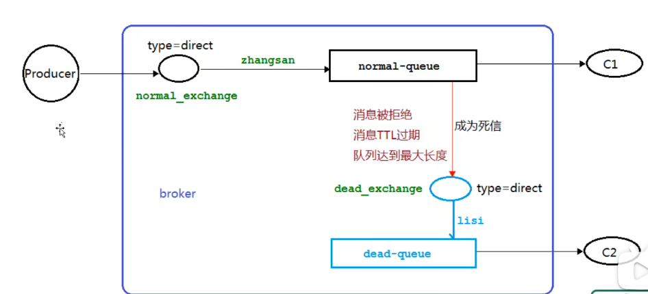

- 消费者1

~~~java
package com.example.rabbitmq.eight;

import com.example.rabbitmq.utils.RabbitMqUtil;
import com.rabbitmq.client.BuiltinExchangeType;
import com.rabbitmq.client.CancelCallback;
import com.rabbitmq.client.Channel;
import com.rabbitmq.client.DeliverCallback;

import java.util.HashMap;
import java.util.Map;

/**
 * 死信实战
 * 消费者1
 */
public class Consumer01 {

    // 普通交换机的名称
    public static final String NORMAL_EXCHANGE = "normal_exchange";
    // 死信交换机的名称
    public static final String DEAD_EXCHANGE = "dead_exchange";
    // 普通队列的名称
    public static final String NORMAL_QUEUE = "normal_queue";
    // 死信队列的名称
    public static final String DEAD_QUEUE = "dead_queue";

    public static void main(String[] args) throws Exception {
        // 获取信道
        Channel channel = RabbitMqUtil.getChannel();
        // 声明铍铜交换机和死信交换机 类型为direct
        channel.exchangeDeclare(NORMAL_EXCHANGE, BuiltinExchangeType.DIRECT);
        channel.exchangeDeclare(DEAD_EXCHANGE, BuiltinExchangeType.DIRECT);
        // 声明普通队列
        /**
         *  普通队列的参数
         *  1、正常队列设置死信交换机
         *  2、设置死信RoutingKey
         *  3、过期时间 10000ms = 10s
         */
        Map<String, Object> arguments = new HashMap<>();
        arguments.put("x-dead-letter-exchange", DEAD_EXCHANGE);
        arguments.put("x-dead-letter-routing-key", "lisi");
        arguments.put("x-message-ttl", 10000);
        channel.queueDeclare(NORMAL_QUEUE, false, false, false, arguments);
        // 声明死信队列
        channel.queueDeclare(DEAD_QUEUE, false, false, false, null);

        // 普通交换机和普通队列绑定
        channel.queueBind(NORMAL_QUEUE, NORMAL_EXCHANGE,"zhangsan");
        // 死信交换机和死信队列绑定
        channel.queueBind(DEAD_QUEUE, DEAD_EXCHANGE,"lisi");
        System.out.println("等待接收消息......");

        // 声明接收消息的回调
        DeliverCallback deliverCallback = (consumerTag, message) -> {
            System.out.println("consumer1接收的消息是：" + new String(message.getBody()));
        };
        // 取消消费时的回调
        CancelCallback cancelCallback = consumerTag -> {
            System.out.println("消息消费被中断");
        };
        /**
         * 消费者消费消息
         * 1、消费哪个队列
         * 2、消费成功后是否自动应答 true：代表自动应答 false：代表手动应答
         * 3、消费者成功消费的回调
         * 4、消费者取消消费的回调
         */
        channel.basicConsume(NORMAL_QUEUE, true, deliverCallback, cancelCallback);

    }
}
~~~

- 生产者

~~~java
package com.example.rabbitmq.eight;

import com.example.rabbitmq.utils.RabbitMqUtil;
import com.rabbitmq.client.AMQP;
import com.rabbitmq.client.Channel;

/**
 * 死信队列之生产者
 */
public class Producer {

    // 普通交换机的名称
    public static final String NORMAL_EXCHANGE = "normal_exchange";

    // 发消息
    public static void main(String[] args) throws  Exception {
        // 获取信道
        Channel channel = RabbitMqUtil.getChannel();
        // 死信消息 设置TTL时间 单位是ms
        AMQP.BasicProperties properties = new AMQP.BasicProperties().builder().expiration("10000").build();
        // 发送消息
        for(int i = 0; i < 10; i++) {
            String message = i + "info";
            /**
             * 信道发送一个消费
             * 1、发送到哪个交换机
             * 2、路由的key值是哪个 本次队列的名称
             * 3、其他参数信息
             * 4、发送消息的消息体
             */
            channel.basicPublish(NORMAL_EXCHANGE, "zhangsan", null, message.getBytes());
        }

    }

}
~~~

- 结果
  - 发送10条消息到普通队列中，但是关闭了消费者，这十条消息会先出现在普通队列中，但是10秒过期时间到了后，就会出现在死信队列中


- 消费者2：专门用来消费死信队列的消息

```java
package com.example.rabbitmq.eight;

import com.example.rabbitmq.utils.RabbitMqUtil;
import com.rabbitmq.client.CancelCallback;
import com.rabbitmq.client.Channel;
import com.rabbitmq.client.DeliverCallback;

/**
 * 死信队列消费
 */
public class Consumer02 {

    // 死信队列的名称
    public static final String DEAD_QUEUE = "dead_queue";

    public static void main(String[] args) throws Exception {
        Channel channel = RabbitMqUtil.getChannel();
        System.out.println("等待接收消息...");

        // 声明接收消息的回调
        DeliverCallback deliverCallback = (consumerTag, message) -> {
            System.out.println("consumer1接收的消息是：" + new String(message.getBody()));
        };
        // 取消消费时的回调
        CancelCallback cancelCallback = consumerTag -> {
            System.out.println("消息消费被中断");
        };
        /**
         * 消费者消费消息
         * 1、消费哪个队列
         * 2、消费成功后是否自动应答 true：代表自动应答 false：代表手动应答
         * 3、消费者成功消费的回调
         * 4、消费者取消消费的回调
         */
        channel.basicConsume(DEAD_QUEUE, true, deliverCallback, cancelCallback);
    }
}

```


## 6.4 死信实战之队列达到最大长度

- 消费者

~~~java
package com.example.rabbitmq.eight;

import com.example.rabbitmq.utils.RabbitMqUtil;
import com.rabbitmq.client.BuiltinExchangeType;
import com.rabbitmq.client.CancelCallback;
import com.rabbitmq.client.Channel;
import com.rabbitmq.client.DeliverCallback;

import java.util.HashMap;
import java.util.Map;

/**
 * 死信实战
 * 消费者1
 */
public class Consumer01 {

    // 普通交换机的名称
    public static final String NORMAL_EXCHANGE = "normal_exchange";
    // 死信交换机的名称
    public static final String DEAD_EXCHANGE = "dead_exchange";
    // 普通队列的名称
    public static final String NORMAL_QUEUE = "normal_queue";
    // 死信队列的名称
    public static final String DEAD_QUEUE = "dead_queue";

    public static void main(String[] args) throws Exception {
        // 获取信道
        Channel channel = RabbitMqUtil.getChannel();
        // 声明铍铜交换机和死信交换机 类型为direct
        channel.exchangeDeclare(NORMAL_EXCHANGE, BuiltinExchangeType.DIRECT);
        channel.exchangeDeclare(DEAD_EXCHANGE, BuiltinExchangeType.DIRECT);
        // 声明普通队列
        /**
         *  普通队列的参数
         *  1、正常队列设置死信交换机
         *  2、设置死信RoutingKey
         *  3、过期时间 10000ms = 10s
         */
        Map<String, Object> arguments = new HashMap<>();
        arguments.put("x-dead-letter-exchange", DEAD_EXCHANGE);
        arguments.put("x-dead-letter-routing-key", "lisi");
        //arguments.put("x-message-ttl", 10000);
        arguments.put("x-max-length", 6);
        channel.queueDeclare(NORMAL_QUEUE, false, false, false, arguments);
        // 声明死信队列
        channel.queueDeclare(DEAD_QUEUE, false, false, false, null);

        // 普通交换机和普通队列绑定
        channel.queueBind(NORMAL_QUEUE, NORMAL_EXCHANGE,"zhangsan");
        // 死信交换机和死信队列绑定
        channel.queueBind(DEAD_QUEUE, DEAD_EXCHANGE,"lisi");
        System.out.println("等待接收消息......");

        // 声明接收消息的回调
        DeliverCallback deliverCallback = (consumerTag, message) -> {
            System.out.println("consumer1接收的消息是：" + new String(message.getBody()));
        };
        // 取消消费时的回调
        CancelCallback cancelCallback = consumerTag -> {
            System.out.println("消息消费被中断");
        };
        /**
         * 消费者消费消息
         * 1、消费哪个队列
         * 2、消费成功后是否自动应答 true：代表自动应答 false：代表手动应答
         * 3、消费者成功消费的回调
         * 4、消费者取消消费的回调
         */
        channel.basicConsume(NORMAL_QUEUE, true, deliverCallback, cancelCallback);

    }
}
~~~

- 生产者

~~~java
package com.example.rabbitmq.eight;

import com.example.rabbitmq.utils.RabbitMqUtil;
import com.rabbitmq.client.AMQP;
import com.rabbitmq.client.Channel;

/**
 * 死信队列之生产者
 */
public class Producer {

    // 普通交换机的名称
    public static final String NORMAL_EXCHANGE = "normal_exchange";

    // 发消息
    public static void main(String[] args) throws  Exception {
        // 获取信道
        Channel channel = RabbitMqUtil.getChannel();
        // 死信消息 设置TTL时间 单位是ms
        //AMQP.BasicProperties properties = new AMQP.BasicProperties().builder().expiration("10000").build();
        // 发送消息
        for(int i = 0; i < 10; i++) {
            String message = i + "info";
            /**
             * 信道发送一个消费
             * 1、发送到哪个交换机
             * 2、路由的key值是哪个 本次队列的名称
             * 3、其他参数信息
             * 4、发送消息的消息体
             */
            channel.basicPublish(NORMAL_EXCHANGE, "zhangsan", null, message.getBytes());
        }

    }

}
~~~

- 结果：发送十条数据，6条在普通队列中，4条在死信队列中


## 6.5 死信实战之消息被拒

- 消费者1

~~~java
package com.example.rabbitmq.eight;

import com.example.rabbitmq.utils.RabbitMqUtil;
import com.rabbitmq.client.BuiltinExchangeType;
import com.rabbitmq.client.CancelCallback;
import com.rabbitmq.client.Channel;
import com.rabbitmq.client.DeliverCallback;

import java.util.HashMap;
import java.util.Map;

/**
 * 死信实战
 * 消费者1
 */
public class Consumer01 {

    // 普通交换机的名称
    public static final String NORMAL_EXCHANGE = "normal_exchange";
    // 死信交换机的名称
    public static final String DEAD_EXCHANGE = "dead_exchange";
    // 普通队列的名称
    public static final String NORMAL_QUEUE = "normal_queue";
    // 死信队列的名称
    public static final String DEAD_QUEUE = "dead_queue";

    public static void main(String[] args) throws Exception {
        // 获取信道
        Channel channel = RabbitMqUtil.getChannel();
        // 声明铍铜交换机和死信交换机 类型为direct
        channel.exchangeDeclare(NORMAL_EXCHANGE, BuiltinExchangeType.DIRECT);
        channel.exchangeDeclare(DEAD_EXCHANGE, BuiltinExchangeType.DIRECT);
        // 声明普通队列
        /**
         *  普通队列的参数
         *  1、正常队列设置死信交换机
         *  2、设置死信RoutingKey
         *  3、过期时间 10000ms = 10s
         */
        Map<String, Object> arguments = new HashMap<>();
        arguments.put("x-dead-letter-exchange", DEAD_EXCHANGE);
        arguments.put("x-dead-letter-routing-key", "lisi");
        //arguments.put("x-message-ttl", 10000);
        //arguments.put("x-max-length", 6);
        channel.queueDeclare(NORMAL_QUEUE, false, false, false, arguments);
        // 声明死信队列
        channel.queueDeclare(DEAD_QUEUE, false, false, false, null);

        // 普通交换机和普通队列绑定
        channel.queueBind(NORMAL_QUEUE, NORMAL_EXCHANGE,"zhangsan");
        // 死信交换机和死信队列绑定
        channel.queueBind(DEAD_QUEUE, DEAD_EXCHANGE,"lisi");
        System.out.println("等待接收消息......");

        // 声明接收消息的回调
        DeliverCallback deliverCallback = (consumerTag, message) -> {
            String msg = new String(message.getBody(),"UTF-8");
            if(msg.equals("info5")){
                channel.basicReject(message.getEnvelope().getDeliveryTag(),false);
                System.out.println("consumer1接收的消息是：" + new String(message.getBody()) + "，此消息是拒绝的");
            } else {
                System.out.println("consumer1接收的消息是：" + new String(message.getBody()));
                channel.basicAck(message.getEnvelope().getDeliveryTag(), false);
            }
        };
        // 取消消费时的回调
        CancelCallback cancelCallback = consumerTag -> {
            System.out.println("消息消费被中断");
        };
        /**
         * 消费者消费消息
         * 1、消费哪个队列
         * 2、消费成功后是否自动应答 true：代表自动应答 false：代表手动应答
         * 3、消费者成功消费的回调
         * 4、消费者取消消费的回调
         */
        channel.basicConsume(NORMAL_QUEUE, false, deliverCallback, cancelCallback);

    }
}
~~~

- 发送十条数据，info5会进入到死信队列，其他的都在普通队列


# 7、延迟队列

## 7.1 概念

- 队列内部有序
- 最重要的特征就体现在它的延迟属性上，延迟队列中的元素是希望在指定时间到了以后或之前取出和处理
- 简单来说，延迟队列就是用来存放需要在指定时间被处理的元素的队列


## 7.2 使用场景

- 订单十分钟之内未支付则自动取消
- 新创建的店铺，如果在十天内都没上传过商品，则自动发送消息提醒
- 用户注册成功后，如果三天内没有登了则进行短信提醒
- 用户发起退款，如果三天内没有处理则通知相关人员
- 预定会议后，需要在十分钟通知各个与会人员参加会议


## 7.3 队列TTL

### 7.3.1 代码架构

- 创建两个队列QA和QB，两者队列TTL分别设置10s和40s，然后再创建一个交换机X和死信交换机Y，类型都为direct，创建一个死信队列QD

 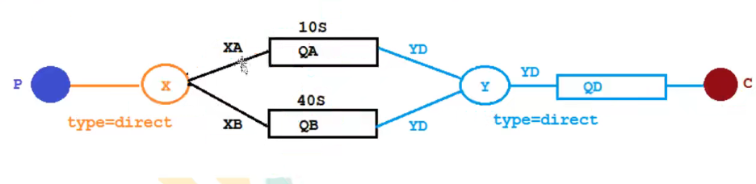


### 7.3.2 配置文件类代码

~~~java
package com.example.springbootrabbitmq.config;

import org.springframework.amqp.core.*;
import org.springframework.beans.factory.annotation.Qualifier;
import org.springframework.context.annotation.Bean;
import org.springframework.context.annotation.Configuration;

import java.util.HashMap;
import java.util.Map;

/**
 * TTL队列 配置文件类代码
 */
@Configuration
public class TtlQueueConfig {

    // 普通交换机的名称
    public static final String X_EXCHANGE = "X";
    //死信交换机名称
    public static final String Y_DEAD_LETTER_EXCHANGE = "Y";
    // 普通队列名称
    public static final String QUEUE_A = "QA";
    public static final String QUEUE_B = "QB";
    // 死信队列名称
    public static final String DEAD_LETTER_QUEUE = "QD";

    // 声明xExchange交换机
    @Bean("xExchange")
    public DirectExchange xExchange() {
        return new DirectExchange(X_EXCHANGE);
    }

    // 声明xExchange交换机
    @Bean("yExchange")
    public DirectExchange yExchange() {
        return new DirectExchange(Y_DEAD_LETTER_EXCHANGE);
    }

    // 声明普通队列 queueA TTL为10s
    @Bean("queueA")
    public Queue queueA() {
        Map<String, Object> arguments = new HashMap<>(3);
        // 设置死信交换机
        arguments.put("x-dead-letter-exchange", Y_DEAD_LETTER_EXCHANGE);
        // 设置死信RoutingKey
        arguments.put("x-dead-letter-routing-key", "YD");
        // 设置TTL
        arguments.put("x-message-ttl", 10000);
        return QueueBuilder.durable(QUEUE_A).withArguments(arguments).build();
    }

    // 声明普通队列 queueB TTL为40s
    @Bean("queueB")
    public Queue queueB() {
        Map<String, Object> arguments = new HashMap<>(3);
        // 设置死信交换机
        arguments.put("x-dead-letter-exchange", Y_DEAD_LETTER_EXCHANGE);
        // 设置死信RoutingKey
        arguments.put("x-dead-letter-routing-key", "YD");
        // 设置TTL
        arguments.put("x-message-ttl", 40000);
        return QueueBuilder.durable(QUEUE_B).withArguments(arguments).build();
    }

    // 声明死信队列
    @Bean("queueD")
    public Queue queueD() {
        return QueueBuilder.durable(DEAD_LETTER_QUEUE).build();
    }

    // 绑定
    @Bean
    public Binding queueABindingX(@Qualifier("queueA") Queue queueA, @Qualifier("xExchange") DirectExchange xExchange){
        return BindingBuilder.bind(queueA).to(xExchange).with("XA");
    }

    @Bean
    public Binding queueBBindingX(@Qualifier("queueB") Queue queueB, @Qualifier("xExchange") DirectExchange xExchange){
        return BindingBuilder.bind(queueB).to(xExchange).with("XB");
    }

    @Bean
    public Binding queueDBindingY(@Qualifier("queueD") Queue queueD, @Qualifier("yExchange") DirectExchange yExchange){
        return BindingBuilder.bind(queueD).to(yExchange).with("YD");
    }
}
~~~


### 7.3.3 生产者代码

```java
package com.example.springbootrabbitmq.controller;

import lombok.extern.slf4j.Slf4j;
import org.springframework.amqp.rabbit.core.RabbitTemplate;
import org.springframework.web.bind.annotation.GetMapping;
import org.springframework.web.bind.annotation.PathVariable;
import org.springframework.web.bind.annotation.RequestMapping;
import org.springframework.web.bind.annotation.RestController;

import javax.annotation.Resource;
import java.util.Date;


/**
 * 生产者
 */
@Slf4j
@RestController
@RequestMapping("/ttl")
public class SendMsgController {

    @Resource
    private RabbitTemplate rabbitTemplate;

    // 发送消息
    @GetMapping("/sendMsg/{message}")
    public void sendMsg(@PathVariable String message) {
        log.info("当前时间：{},发送一条消息给两个TTL队列",new Date().toString(), message);
        rabbitTemplate.convertAndSend("X","XA","来自10s的消息队列" + message);
        rabbitTemplate.convertAndSend("X","XB","来自40s的消息队列" + message);
    }

}
```


### 7.3.4 消费者代码

```java
package com.example.springbootrabbitmq.consumer;

import com.rabbitmq.client.Channel;
import lombok.extern.slf4j.Slf4j;
import org.springframework.amqp.core.Message;
import org.springframework.amqp.rabbit.annotation.RabbitListener;
import org.springframework.stereotype.Component;

import java.util.Date;

@Slf4j
@Component
public class DeadLetterQueueConsumer {

    // 接收消息
    @RabbitListener(queues = "QD")
    public void receiveD(Message message, Channel channel) throws Exception {
        String msg = new String(message.getBody());
        log.info("当前时间：{},收到死信队列的消息:{}", new Date().toString(), msg);
    }
}

```


## 7.4 延迟队列优化

### 7.4.1 代码架构图

- 以往的代码会有问题
  - 延迟队列的延迟性有局限性，延迟多久都写死了
- 在这就新建一个队列QC，该队列不设置TTL时间

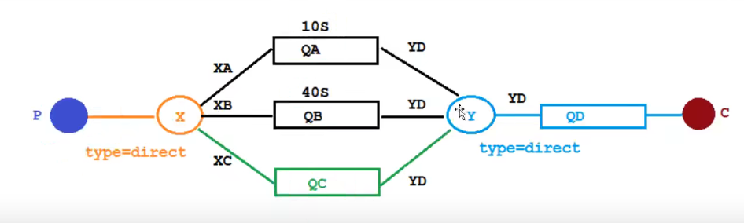


### 7.4.2 配置文件类

```java
package com.example.springbootrabbitmq.config;

import org.springframework.amqp.core.*;
import org.springframework.beans.factory.annotation.Qualifier;
import org.springframework.context.annotation.Bean;
import org.springframework.context.annotation.Configuration;

import java.util.HashMap;
import java.util.Map;

/**
 * TTL队列 配置文件类代码
 */
@Configuration
public class TtlQueueConfig {

    // 普通交换机的名称
    public static final String X_EXCHANGE = "X";
    //死信交换机名称
    public static final String Y_DEAD_LETTER_EXCHANGE = "Y";
    // 普通队列名称
    public static final String QUEUE_A = "QA";
    public static final String QUEUE_B = "QB";
    public static final String QUEUE_C = "QC";
    // 死信队列名称
    public static final String DEAD_LETTER_QUEUE = "QD";

    // 声明xExchange交换机
    @Bean("xExchange")
    public DirectExchange xExchange() {
        return new DirectExchange(X_EXCHANGE);
    }

    // 声明yExchange交换机
    @Bean("yExchange")
    public DirectExchange yExchange() {
        return new DirectExchange(Y_DEAD_LETTER_EXCHANGE);
    }

    // 声明普通队列 queueA TTL为10s
    @Bean("queueA")
    public Queue queueA() {
        Map<String, Object> arguments = new HashMap<>(3);
        // 设置死信交换机
        arguments.put("x-dead-letter-exchange", Y_DEAD_LETTER_EXCHANGE);
        // 设置死信RoutingKey
        arguments.put("x-dead-letter-routing-key", "YD");
        // 设置TTL
        arguments.put("x-message-ttl", 10000);
        return QueueBuilder.durable(QUEUE_A).withArguments(arguments).build();
    }

    // 声明普通队列 queueB TTL为40s
    @Bean("queueB")
    public Queue queueB() {
        Map<String, Object> arguments = new HashMap<>(3);
        // 设置死信交换机
        arguments.put("x-dead-letter-exchange", Y_DEAD_LETTER_EXCHANGE);
        // 设置死信RoutingKey
        arguments.put("x-dead-letter-routing-key", "YD");
        // 设置TTL
        arguments.put("x-message-ttl", 40000);
        return QueueBuilder.durable(QUEUE_B).withArguments(arguments).build();
    }

    // 声明普通队列 queueC
    @Bean("queueC")
    public Queue queueC() {
        Map<String, Object> arguments = new HashMap<>(3);
        // 设置死信交换机
        arguments.put("x-dead-letter-exchange", Y_DEAD_LETTER_EXCHANGE);
        // 设置死信RoutingKey
        arguments.put("x-dead-letter-routing-key", "YD");
        return QueueBuilder.durable(QUEUE_C).withArguments(arguments).build();
    }

    // 声明死信队列
    @Bean("queueD")
    public Queue queueD() {
        return QueueBuilder.durable(DEAD_LETTER_QUEUE).build();
    }

    // 绑定
    @Bean
    public Binding queueABindingX(@Qualifier("queueA") Queue queueA, @Qualifier("xExchange") DirectExchange xExchange){
        return BindingBuilder.bind(queueA).to(xExchange).with("XA");
    }

    @Bean
    public Binding queueBBindingX(@Qualifier("queueB") Queue queueB, @Qualifier("xExchange") DirectExchange xExchange){
        return BindingBuilder.bind(queueB).to(xExchange).with("XB");
    }

    @Bean
    public Binding queueDBindingY(@Qualifier("queueD") Queue queueD, @Qualifier("yExchange") DirectExchange yExchange){
        return BindingBuilder.bind(queueD).to(yExchange).with("YD");
    }

    @Bean
    public Binding queueCBindingX(@Qualifier("queueC") Queue queueC, @Qualifier("xExchange") DirectExchange xExchange){
        return BindingBuilder.bind(queueC).to(xExchange).with("XC");
    }
}

```


### 7.4.3 生产者

```java
// 发送消息
@GetMapping("/sendExpirationMsg/{message}/{ttlTime}")
public void sendExpirationMsg(@PathVariable String message,@PathVariable String ttlTime) {
    log.info("当前时间：{},发送一条时长: {},的消息给两个TTL队列QC：{}",new Date().toString(), ttlTime, message);
    rabbitTemplate.convertAndSend("X","XC", message, msg -> {
        msg.getMessageProperties().setExpiration(ttlTime);
        return msg;
    });
}
```


### 7.4.4 优化后的问题

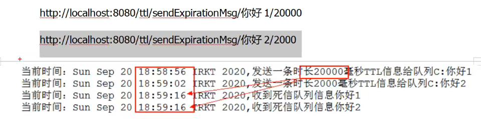

- RabbitMQ只会检查第一个消息是否过期，如果过期则丢到死信队列
- **如果第一个消息的延时时长很长，而第二个消息的延时时长很短，第二个消息并不会优先得到执行**


## 7.5 延时队列插件安装

~~~bash
#拷贝到对应rabbitmq容器中
docker cp /home/lzy/桌面/rabbitmq_delayed_message_exchange-3.9.0.ez 6182134b6df4:/plugins
#进入容器
docker exec -it 6182134b6df4 /bin/bash
#启用插件
rabbitmq-plugins enable rabbitmq_delayed_message_exchange
#查看
rabbitmq-plugins list
#退出rabbitmq容器
exit
#重新启动容器
docker restart 6182134b6df4
~~~

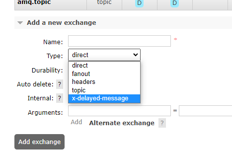


## 7.6 基于插件的延迟队列

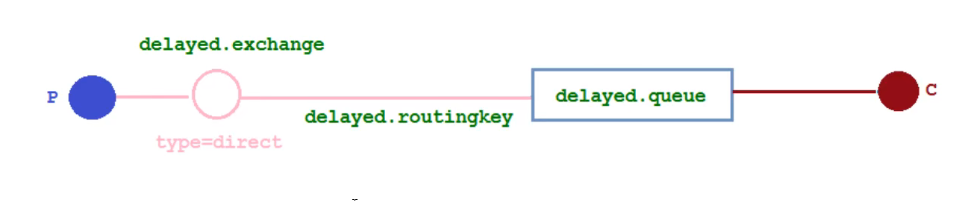

- 配置文件类

~~~java
package com.example.springbootrabbitmq.config;

import org.springframework.amqp.core.Binding;
import org.springframework.amqp.core.BindingBuilder;
import org.springframework.amqp.core.CustomExchange;
import org.springframework.amqp.core.Queue;
import org.springframework.beans.factory.annotation.Qualifier;
import org.springframework.context.annotation.Bean;
import org.springframework.context.annotation.Configuration;

import java.util.HashMap;
import java.util.Map;

/**
 * 延迟队列配置类
 */
@Configuration
public class DelayedQueueConfig {

    // 队列
    public static final String DELAYED_QUEUE_NAME = "delayed.queue";
    // 交换机
    public static final String DELAYED_EXCHANGE_NAME = "delayed.queue";
    // routingKey
    public static final String DELAYED_ROUTING_KEY = "delayed.routingkey";

    // 声明交换机 基于交换机的
    @Bean
    public CustomExchange delayedExchange() {
        Map<String, Object> arguments = new HashMap<>();
        // 交换机类型
        arguments.put("x-delayed-type","direct");
        /**
         * 1、交换机名称
         * 2、交换机类型
         * 3、是否需要持久化
         * 4、是否需要自动删除
         * 5、其他参数
         */
        return new CustomExchange(DELAYED_EXCHANGE_NAME, "x-delayed-message", false, false, arguments);
    }

    // 声明队列
    @Bean("delayedQueue")
    public Queue delayedQueue() {
        return new Queue(DELAYED_QUEUE_NAME);
    }

    // 绑定
    @Bean
    public Binding delayedQueueBinding(@Qualifier("delayedQueue") Queue delayedQueue, @Qualifier("delayedExchange") CustomExchange delayedExchange){
        return BindingBuilder.bind(delayedQueue).to(delayedExchange).with(DELAYED_ROUTING_KEY).noargs();
    }
}

~~~

- 生产者

~~~java
// 基于插件的发送消息
@GetMapping("/sendDelayMsg/{message}/{delayTime}")
public void sendDelayMsg(@PathVariable String message,@PathVariable Integer delayTime) {
	log.info("当前时间：{},发送一条延迟时间：{}的延迟消息：{}",new Date().toString(), delayTime, message);
	rabbitTemplate.convertAndSend(DelayedQueueConfig.DELAYED_EXCHANGE_NAME, DelayedQueueConfig.DELAYED_ROUTING_KEY, message, msg ->{
    	// 设置延迟时间
        msg.getMessageProperties().setDelay(delayTime);
        return msg;
    });
}
~~~

- 消费者

~~~java
package com.example.springbootrabbitmq.consumer;

import com.example.springbootrabbitmq.config.DelayedQueueConfig;
import lombok.extern.slf4j.Slf4j;
import org.springframework.amqp.core.Message;
import org.springframework.amqp.rabbit.annotation.RabbitListener;
import org.springframework.stereotype.Component;

/**
 * 延迟队列消费者
 */
@Slf4j
@Component
public class DelayQueueConsumer {

    @RabbitListener(queues = DelayedQueueConfig.DELAYED_QUEUE_NAME)
    public void receiveDelayQueue(Message message) {
        String msg = new String(message.getBody());
        log.info("打印消息：" + msg);
    }

}

~~~

- 结果

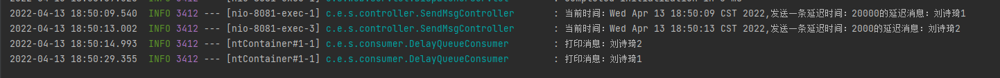


# 8、整合SpringBoot

- 依赖

~~~xml
    <dependencies>
        <!-- RabbitMQ依赖 -->
        <dependency>
            <groupId>org.springframework.boot</groupId>
            <artifactId>spring-boot-starter-amqp</artifactId>
        </dependency>
        <dependency>
            <groupId>org.springframework.boot</groupId>
            <artifactId>spring-boot-starter-web</artifactId>
        </dependency>
        <dependency>
            <groupId>org.springframework.boot</groupId>
            <artifactId>spring-boot-starter-test</artifactId>
            <scope>test</scope>
            <exclusions>
                <exclusion>
                    <groupId>org.junit.vintage</groupId>
                    <artifactId>junit-vintage-engine</artifactId>
                </exclusion>
            </exclusions>
        </dependency>
        <dependency>
            <groupId>com.alibaba</groupId>
            <artifactId>fastjson</artifactId>
            <version>1.2.67</version>
        </dependency>
        <dependency>
            <groupId>org.projectlombok</groupId>
            <artifactId>lombok</artifactId>
        </dependency>
        <!-- swagger -->
        <dependency>
            <groupId>io.springfox</groupId>
            <artifactId>springfox-swagger2</artifactId>
            <version>2.9.2</version>
        </dependency>
        <dependency>
            <groupId>io.springfox</groupId>
            <artifactId>springfox-swagger-ui</artifactId>
            <version>2.9.2</version>
        </dependency>
        <!-- rabbitmq测试依赖 -->
        <dependency>
            <groupId>org.springframework.amqp</groupId>
            <artifactId>spring-rabbit-test</artifactId>
            <scope>test</scope>
        </dependency>
        <dependency>
            <groupId>org.springframework.boot</groupId>
            <artifactId>spring-boot-starter</artifactId>
        </dependency>
    </dependencies>
~~~

- yml

```yaml
server:
  port: 8081
spring:
  rabbitmq:
    port: 5672
    host: 192.168.126.134
    username: admin
    password: 123
```


# 9、发布确认高级

​	在生产环境中由于一些不明原因，导致rabbitmq重启，在rabbitmq重启期间生产者消息投递失败，导致消息丢失，需要手动处理和恢复，如何才能进行rabbitmq的消息可靠投递呢？特别是在比较极端的情况，rabbitmq集群不可用的时候，无法投递消息该如何处理


## 9.1 发布确认springboot版本

### 9.1.1 确认机制方案

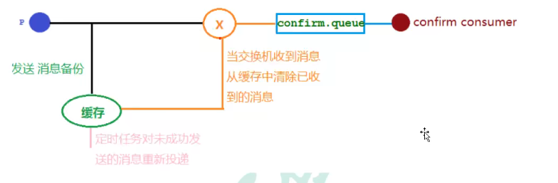


### 9.1.2 代码架构图

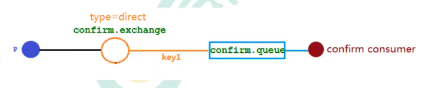


### 9.1.3 配置文件

~~~yaml
server:
  port: 8081
spring:
  rabbitmq:
    port: 5672
    host: 192.168.126.134
    username: admin
    password: 123
    publisher-confirm-type: correlated
~~~

- publisher-confirm-type: correlated
  - none：禁用发布确认模式，是默认值
  - correlated：发布确认成功到交换机后会触发回调方法
  - simple：
    - 效果一：和correlated一样会触发回调方法
    - 效果二：发布消息成功后使用rabbitTemplate调用waitForConfirms或waitForConfirmsOrDie方法等待broker节点返回发送结果，根据返回结果来判定下一步的逻辑，要注意的是waitForConfirmsOrDie方法如果返回false则会关闭channel，则接下来就无法发送消息到broker


### 9.1.4 配置类

```java
package com.example.springbootrabbitmq.config;

import org.springframework.amqp.core.*;
import org.springframework.beans.factory.annotation.Qualifier;
import org.springframework.context.annotation.Bean;
import org.springframework.context.annotation.Configuration;

/**
 * 发布确认高级配置类
 */
@Configuration
public class ConfirmConfig {

    // 交换机名称
    public static final String CONFIRM_EXCHANGE_NAME = "confirm_exchange";
    // 队列名称
    public static final String CONFIRM_QUEUE_NAME = "confirm_queue";
    // routingKey
    public static final String CONFIRM_ROUTING_KEY = "key1";

    // 声明交换机
    @Bean
    public DirectExchange confirmExchange() {
        return new DirectExchange(CONFIRM_EXCHANGE_NAME);
    }

    // 声明队列
    @Bean("confirmQueue")
    public Queue confirmQueue() {
        return QueueBuilder.durable(CONFIRM_QUEUE_NAME).build();
    }

    // 绑定
    @Bean
    public Binding confirmQueueBindingExchange(@Qualifier("confirmQueue") Queue confirmQueue, @Qualifier("confirmExchange") DirectExchange confirmExchange) {
        return BindingBuilder.bind(confirmQueue).to(confirmExchange).with(CONFIRM_ROUTING_KEY);
    }

}

```


### 9.1.5 生产者

```java
package com.example.springbootrabbitmq.controller;

import com.example.springbootrabbitmq.config.ConfirmConfig;
import lombok.extern.slf4j.Slf4j;
import org.springframework.amqp.rabbit.connection.CorrelationData;
import org.springframework.amqp.rabbit.core.RabbitTemplate;
import org.springframework.web.bind.annotation.GetMapping;
import org.springframework.web.bind.annotation.PathVariable;
import org.springframework.web.bind.annotation.RequestMapping;
import org.springframework.web.bind.annotation.RestController;

import javax.annotation.Resource;
import java.util.Date;

/**
 * 消息生产者
 */
@Slf4j
@RestController
@RequestMapping("/confirm")
public class ProducerController {

    @Resource
    private RabbitTemplate rabbitTemplate;

    // 发送消息
    @GetMapping("/sendConfimrMsg/{message}")
    public void sendConfimrMsg(@PathVariable String message) {
        CorrelationData correlationData = new CorrelationData("1");
        log.info("当前时间：{},发送一条消息:{}",new Date().toString(), message);
        rabbitTemplate.convertAndSend(ConfirmConfig.CONFIRM_EXCHANGE_NAME,ConfirmConfig.CONFIRM_ROUTING_KEY,message,correlationData);
    }

}

```


### 9.1.6 消费者

```java
package com.example.springbootrabbitmq.consumer;

import com.example.springbootrabbitmq.config.ConfirmConfig;
import lombok.extern.slf4j.Slf4j;
import org.springframework.amqp.core.Message;
import org.springframework.amqp.rabbit.annotation.RabbitListener;
import org.springframework.stereotype.Component;

/**
 * 发布确认消费者
 */
@Component
@Slf4j
public class ConfirmConsumer {

    @RabbitListener(queues = ConfirmConfig.CONFIRM_QUEUE_NAME)
    public void receiveConfirmMessage(Message message){
        String msg = new String(message.getBody());
        log.info("消息为：" + msg);
    }

}

```


### 9.1.7 回调接口

```java
package com.example.springbootrabbitmq.config;

import lombok.extern.slf4j.Slf4j;
import org.springframework.amqp.rabbit.connection.CorrelationData;
import org.springframework.amqp.rabbit.core.RabbitTemplate;
import org.springframework.stereotype.Component;

import javax.annotation.PostConstruct;
import javax.annotation.Resource;

@Slf4j
@Component
public class MyCallBack implements RabbitTemplate.ConfirmCallback {

    @Resource
    private RabbitTemplate rabbitTemplate;

    // 注入
    @PostConstruct
    public void init(){
        rabbitTemplate.setConfirmCallback(this);
    }

    /**
     * 交换机确认回调方法
     * 1、发消息 交换机接收到了 回调
     *      1.1 correlationData 保存回调消息的ID及相关信息
     *      1.2 交换机收到的消息 ack = true
     *      1.3 cause null
     * 2、发消息 交换机接受失败了 回调
     *      2.1 correlationData 保存回调消息的ID及相关信息
     *      2.2 交换机收到的消息 ack = false
     *      2.3 cause 失败的原因
     */
    @Override
    public void confirm(CorrelationData correlationData, boolean ack, String cause) {
        String id = correlationData != null ? correlationData.getId() : "";
        if(ack) {
            log.info("交换机已经收到id为：{}的消息", id);
        } else
            log.info("交换机还未收到id为：{}的消息，原因是：{}", id, cause);
    }


}

```


### 9.1.8 结果分析

- 如果发送到正确的交换机，会触发回调，打印一句接收到正确的消息
- 如果发送到错误的交换机，会触发回调，打印依据没有接收到消息
- 如果发送错误的队列，则只会看到一条记录，不会收到两条消息


## 9.2 回退消息

### 9.2.1 Mandatory参数

- 在进开启生产者确认机制的情况下，交换机接收到消息后，会直接给消息生产者发送确认消息，如果发现该消息不可路由，那么消息会被直接丢弃，此时生产者是不知道消息被丢弃这个事件的
- **通过设置mandatory参数可以在当消息传递过程中不可达目的地时将消息返回给生产者**


### 9.2.2 消息回退

- 配置文件

~~~yaml
server:
  port: 8081
spring:
  rabbitmq:
    port: 5672
    host: 192.168.126.134
    username: admin
    password: 123
    publisher-confirm-type: correlated      # 消息确认
    publisher-returns: true           # 消息退回
~~~

- 回调接口

~~~java
package com.example.springbootrabbitmq.config;

import lombok.extern.slf4j.Slf4j;
import org.springframework.amqp.core.Message;
import org.springframework.amqp.rabbit.connection.CorrelationData;
import org.springframework.amqp.rabbit.core.RabbitTemplate;
import org.springframework.stereotype.Component;

import javax.annotation.PostConstruct;
import javax.annotation.Resource;

@Slf4j
@Component
public class MyCallBack implements RabbitTemplate.ConfirmCallback,RabbitTemplate.ReturnCallback {

    @Resource
    private RabbitTemplate rabbitTemplate;

    // 注入
    @PostConstruct
    public void init(){
        rabbitTemplate.setConfirmCallback(this);
        rabbitTemplate.setReturnCallback(this);
    }

    /**
     * 交换机确认回调方法
     * 1、发消息 交换机接收到了 回调
     *      1.1 correlationData 保存回调消息的ID及相关信息
     *      1.2 交换机收到的消息 ack = true
     *      1.3 cause null
     * 2、发消息 交换机接受失败了 回调
     *      2.1 correlationData 保存回调消息的ID及相关信息
     *      2.2 交换机收到的消息 ack = false
     *      2.3 cause 失败的原因
     */
    @Override
    public void confirm(CorrelationData correlationData, boolean ack, String cause) {
        String id = correlationData != null ? correlationData.getId() : "";
        if(ack) {
            log.info("交换机已经收到id为：{}的消息", id);
        } else
            log.info("交换机还未收到id为：{}的消息，原因是：{}", id, cause);
    }


    /**
     * 消息回退方法：只有在消息不可达目的地的时候才会回退消息给生产者
     * 参数列表：消息，退回编码，退回原因，交换机，routingKey
     */
    @Override
    public void returnedMessage(Message message, int replyCode, String replyText, String exchange, String routingKey) {
        log.info("消息{}，被交换机{}退回，退回原因：{}，路由key：{}", new String(message.getBody()), exchange, replyText, routingKey);
    }
}
~~~


## 9.3 备份交换机

### 9.3.1 备份交换机架构图

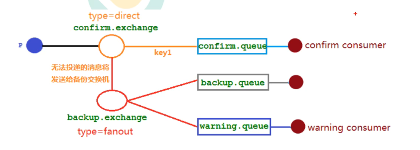


### 9.3.2 修改配置类

~~~java
package com.example.springbootrabbitmq.config;

import org.springframework.amqp.core.*;
import org.springframework.beans.factory.annotation.Qualifier;
import org.springframework.context.annotation.Bean;
import org.springframework.context.annotation.Configuration;

/**
 * 发布确认高级配置类
 */
@Configuration
public class ConfirmConfig {

    // 交换机名称
    public static final String CONFIRM_EXCHANGE_NAME = "confirm_exchange";
    // 队列名称
    public static final String CONFIRM_QUEUE_NAME = "confirm_queue";
    // routingKey
    public static final String CONFIRM_ROUTING_KEY = "key1";
    // 备份交换机
    public static final String BACKUP_EXCHANGE_NAME = "backup_exchange";
    // 回退队列
    public static final String BACKUP_QUEUE_NAME = "backup_queue";
    // 警告队列
    public static final String WARNING_QUEUE_NAME = "warning_queue";

    // 声明交换机
    @Bean
    public DirectExchange confirmExchange() {
        // 声明交换机，指向备份交换机
        return ExchangeBuilder.directExchange(CONFIRM_EXCHANGE_NAME).durable(true).withArgument("alternate-exchange",BACKUP_EXCHANGE_NAME).build();
    }

    // 声明备份交换机
    @Bean
    public FanoutExchange backupExchange() {
        return new FanoutExchange(BACKUP_EXCHANGE_NAME);
    }

    // 声明队列
    @Bean("confirmQueue")
    public Queue confirmQueue() {
        return QueueBuilder.durable(CONFIRM_QUEUE_NAME).build();
    }

    // 声明回退队列
    @Bean("backupQueue")
    public Queue backupQueue(){
        return QueueBuilder.durable(BACKUP_QUEUE_NAME).build();
    }

    // 声明警告队列
    @Bean("warningQueue")
    public Queue warningQueue(){
        return QueueBuilder.durable(WARNING_QUEUE_NAME).build();
    }

    // 绑定
    @Bean
    public Binding confirmQueueBindingExchange(@Qualifier("confirmQueue") Queue confirmQueue, @Qualifier("confirmExchange") DirectExchange confirmExchange) {
        return BindingBuilder.bind(confirmQueue).to(confirmExchange).with(CONFIRM_ROUTING_KEY);
    }

    @Bean
    public Binding backupQueueBindingBackupExchange(@Qualifier("backupQueue") Queue backupQueue, @Qualifier("backupExchange") FanoutExchange backupExchange) {
        return BindingBuilder.bind(backupQueue).to(backupExchange);
    }

    @Bean
    public Binding warningQueueBindingBackupExchange(@Qualifier("warningQueue") Queue warningQueue, @Qualifier("backupExchange") FanoutExchange backupExchange) {
        return BindingBuilder.bind(warningQueue).to(backupExchange);
    }

}
~~~


### 9.3.3 结果分析

- 如果正常发送消息，就会被正常队列消费
- 如果发送的消息出问题了，无法被路由，就会流转到备份交换机，由备份交换机消费


# 10、其他问题

## 10.1 幂等性问题

### 10.1.1 概念

- 幂等性：用户对于同一操作发起的一次请求或者多次请求的结果是一致的，不会因为多次点击而产生副作用
- MQ中的消息会产生重复性消费的问题：消费者消费之后会返回ack给MQ，但是此时如果网络不好，故MQ未收到确认消息，该条消息会发给其他消费者或者网络好了之后再次发送给该消费者，但实际上这条消息已经被消费过了。这就是消费者消费重复的消息


### 10.2 解决方案

- 唯一Id+指纹码机制
  - 指纹码：利用一些规则或者时间戳拼接生成而来，但是一定要保证唯一性，查询他是否存在于数据库中。优势就是：简单。劣势：单个数据库会有写入性能瓶颈
- Redis原子性
  - 利用Redis执行setnx命令，天然具有幂等性。从而实现不重复消费


## 10.2 优先级队列

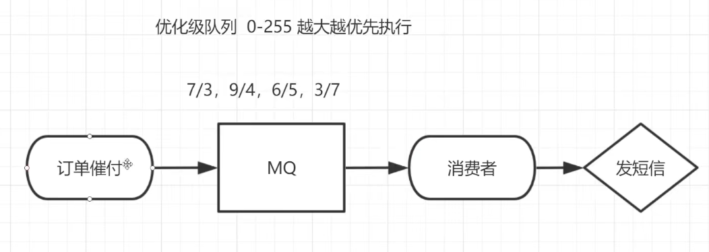

- 根据权重来分配，权重大的先执行


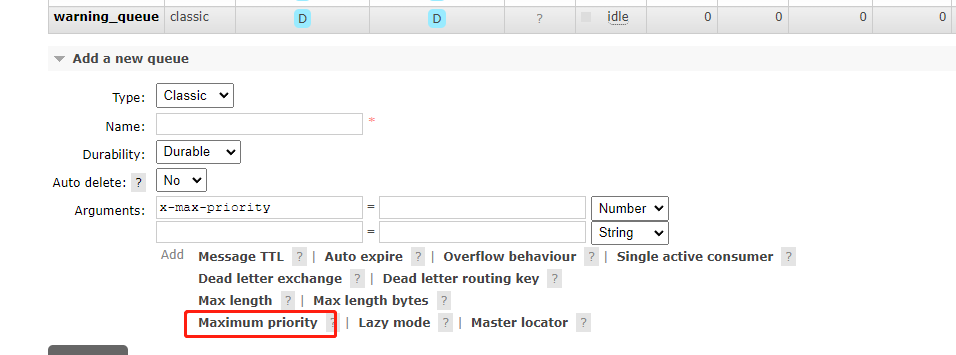

- 代码设置

  - 队列设置优先级

  ~~~java
  Map<String, Object> arguments = new HashMap<>();
  // 交换机类型
  arguments.put("x-max-priority",10);
  channel.queueDeclare("hello", false,false,false,arguments);
  ~~~

  - 消息中代码设置优先级

  ~~~java
  AMQP.BasicProperties properties() = new AMQP.BasicProperties().builder().priority(5).build();
  ~~~

  


## 10.3 惰性队列

- 惰性队列会尽可能地将消息存入磁盘中，消费者消费到对应的消息时才会被加载到内存中


- 惰性队列会将接受到的消息直接存入文件系统中，而不管是持久化的或者是非持久化的，这样可以减少了内存的消耗，但是会增加I/O的使用，如果消息是持久的，那么这样的I/O操作不可避免，惰性队列和持久化的消息可谓是“最佳拍档”.
- 如果惰性队列中存储的是非持久化的消息，内存的使用率会一直很稳定，但是重启之后消息一样会丢失.
- 应用场景
  - 需要支持更多的消息存储
  - 消费者由于各种各样的原因（如消费者下线、宕机或者由于维护而关闭等等）导致长时间不能消费消息而造成堆积时

~~~java
Map<String, Object> arguments = new HashMap<>();
// 交换机类型
arguments.put("x-queue-mode","lazy");
channel.queueDeclare("hello", false,false,false,arguments);
~~~

| 队列类型 | 发送消息量 | 每一个消息大小 | 消耗内存 |
| -------- | ---------- | -------------- | -------- |
| 惰性队列 | 一千万     | 1KB            | 1.5MB    |
| 普通队列 | 一千万     | 1KB            | 1.2GB    |