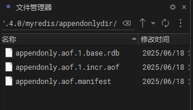
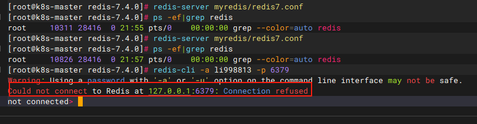
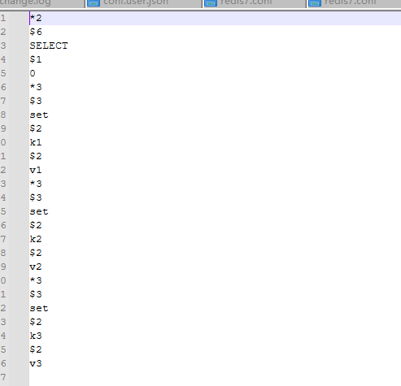
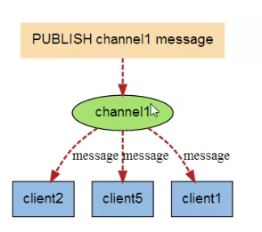
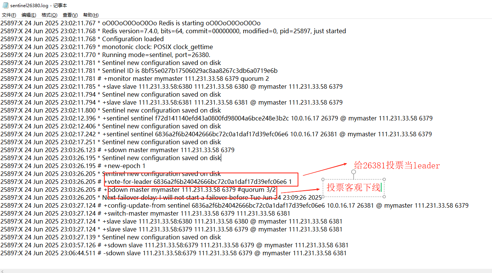
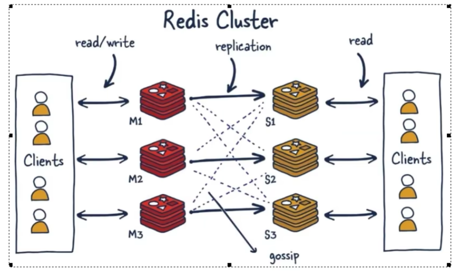
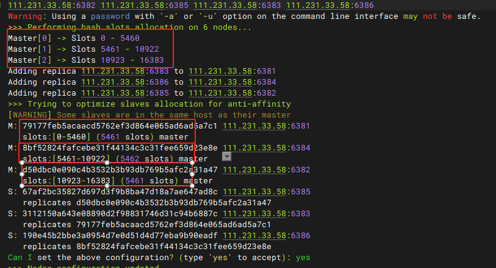
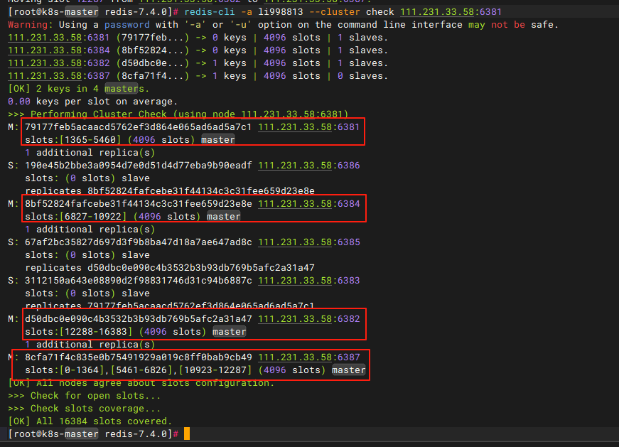
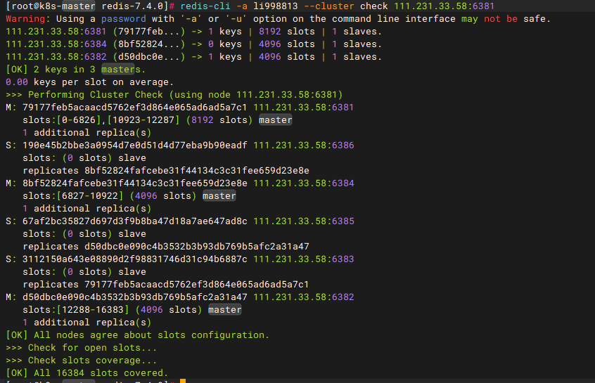

# 一、基础篇

## 1、概述

### 1.1 Redis是什么

- Remote Dictionary Server（**远程字典服务**）
- 使用**ANSIC语言**编写且遵守**BSD协议**，是一个高性能的key-value数据库，提供了丰富的数据结构，例如：String、Hash、List、Set、SortedSet等
- <font color="red">**数据是存储在内存中的**</font>
- Redis支持事务、持久化、LUA脚本、发布/订阅、缓存淘汰、流技术等多种功能特性，提供了主从模式、Redis Sentinel和Redis Cluster集群架构方案
- 总结：<font color="red">**基于内存的KV键值对内存数据库**</font>


### 1.2 能干嘛

- 主流功能与应用

  - **分布式缓存，挡在MySQL数据库之前的带刀护卫**
    - 与传统数据库MySQL关系
      - Redis是key-value数据库(NoSQL一种)，MySQL是关系型数据库
      - <font color="red">**Redis数据操作主要在内存，MySQL主要存储在磁盘**</font>
      - Redis在某些场景中明显优于MySQL，比如计数器、排行榜等方面
      - Redis通常用于一些特定场景，需要和MySQL一起使用
      - **两者并不是相互替换和竞争关系，而实共用和配合使用**

  

  - **内存存储和持久化（RDB+AOF）**，Redis支持异步将内存中的数据写到硬盘上，同时不影响继续服务

  - **高可用架构配置**：单机、主从、哨兵、集群

  - **缓存穿透、击穿、雪崩**

  - **分布式锁**

  - **队列**：Redis提供list和set操作，使得Redis能作为一个很好的消息队列平台来使用

  - **排行榜+点赞**：通过zset可以实现


### 1.3 优势

- **性能极高**：Redis读的速度是11w次/秒，写的速度是8w1次/秒
- **Redis数据类型丰富**：不仅仅支持简单的key-value类型的数据，同时还支持list、set、zset、hash等数据结构的存储
- **Redis支持数据的持久化**：可以将内存中的数据保存在磁盘中，重启的时候可以再次加载进行使用
- **Redis支持数据的备份**，即：master-slave模式的数据备份


### 1.4 总结


### 1.5 文档地址

- 官方文档英文：https://redis.io/
- 官方文档中文：https://www.redis.cn/
- **中文知识文档（重点）**：**https://redis.com.cn/documentation.html**
- 源码地址：https://github.com/redis/redis
- 在线测试：https://try.redis.io
- **命令参考手册（重点）**：**http://doc.redisfans.com/**


## 2、安装配置

### 2.1 安装前配置

- **Linux环境安装Redis必须先具备gcc编译环境：因为redis是C语言开发的**

  - gcc是 [GNU](https://so.csdn.net/so/search?q=GNU&spm=1001.2101.3001.7020) 编译器集合（GNU Compiler Collection）的核心组件之一，**用于编译 C、C++ 和其他语言的源代码**。它是 Linux 系统和开源项目中最常用的编译工具。
  - 查看是否安装gcc：gcc -v

  

  - 安装gcc：yum -y install gcc-c++

  


### 2.2 下载安装


- 1、下载地址：https://redis.io/downloads/，上传到opt目录
- 2、进入到opt目录：cd /opt，解压命令：**tar -zxvf redis-7.4.0.tar.gz**
- 3、进入redis目录：**cd redis-7.4.0**
- 4、执行make编译命令：**make && make install**，直到出现这个就证明编译安装成功


- 5、查看默认安装目录：**usr/local/bin**

  - Linux下的usr/local相当于windows系统中的C:/Program Files
  - 安装后查看：
    - redis-benchmark：性能测试工具，服务启动后运行该命令，查看自己本机性能
    - redis-check-aof：恢复有问题的AOF文件
    - redis-check-dump：修复有问题的dump.rdb文件
    - <font color="red">redis-cli：客户端，操作入口</font>
    - redis-sentinel：redis集群使用
    - <font color="red">redis-server：redis服务器启动命令</font>

  

- 6、将redis解压包下默认的配置文件redis.conf拷贝到自己定义好的一个路径下
  - mkdir myredis
  - cp redis.conf myredis/redis7.conf
- 7、<font color="red">**修改myredis/redis7.conf配置文件做初始化设置**</font>，改完记得重启才能生效
  - <font color="red">**默认daemonize no  改为  daemonize yes**</font>，意思是改为后台服务端启动
  - <font color="red">**默认protected-mode yes  改为  protected-mode no**</font>，如果想要让别人访问连接，这里的保护模式就得禁用掉
  - <font color="red">**默认bind 127.0.0.1 -::1注释掉，这个意思是默认只能访问本机，不注释掉会影响远程IP访问**</font>
  - <font color="red">**添加redis密码：requirepass li998813**</font>

- 8、**服务端启动（在/usr/local/bin目录下运行redis-server，启用myredis/redis7.conf配置文件）**：redis-server myredis/redis7.conf
- 9、查看是否启动成功：ps -ef|grep redis|grep -v grep
- 10、连接服务：redis-cli -a li998813 -p 6379，注意：-p不写默认是访问6379
- 11、关闭
  - 单实例关闭：redis-cli -a li998813 shutdown，不写端口默认关闭6379
  - 多实例关闭，指定端口关闭：redis-cli -p 6379 shutdown
- 12、卸载
  - 停止redis-server服务
  - 删除/usr/local/bin目录下与redis所有相关的文件
    - ls -l /usr/local/bin/redis-*
    - rm -rf /usr/local/bin/redis-*


## 3、十大数据类型


- **String（字符串）**
  - String是redis最基本的类型，一个key对应一个value
  - <font color="red">**String类型是二进制安全的**</font>，意思是redis的String可以包含任何数据，比如jpg图片或者序列化的对象
  - String类型redis最基本的数据类型，<font color="red">**一个redis中字符串value最多可以是512M**</font>
- **List（列表）**
  - redis列表是简单的字符串列表，按照插入顺序排序。<font color="red">**可以添加一个元素到列表的头部（左边）或者尾部（右边）**</font>
  - <font color="red">**它的底层实际是一个双端链表**</font>，最多可以包含2^32 - 1（4294967295，每个列表超过40亿个元素）
- **Hash（哈希表）：键值对**
  - Redis hash是一个String类型的field（字段）和value（值）的映射表，hash特别适用于存储对象
  - Redis中每个hash可以存储2^32 - 1键值对（40多亿）
- **Set（集合）**
  - Redis的Set是String类型的<font color="red">**无序集合**</font>，集合成员是唯一的，这就意味着集合中不能出现重复的数据，集合对象的编码可以是intset或者hashtable
  - <font color="red">**Redis中Set集合是通过哈希表实现的，所以添加、删除、查找的时间复杂度都是0(1)**</font>
  - 集合中最大的成员数是2^32 - 1（4294967295，每个集合可存储40多亿个成员）
- **Zset（有序集合），又叫sorted set**
  - Redis的Zset和set一样是String类型元素的集合，且不允许重复的成员
  - <font color="red">**不同的是每个元素都会关联一个double类型的分数**</font>，redis正是通过分数来为集合中的成员进行<font color="red">**从小到大**</font>的排序
  - <font color="red">**Zset的成员是唯一的，但分数（score）却可以重复**</font>
  - <font color="red">**Zset集合是通过哈希表实现的，所以添加、删除、查找的时间复杂度都是0(1)**</font>
  - 集合中最大的成员数是2^32 - 1
- **GEO（地理空间）**
  - 主要用于存储地理位置信息，并对存储的信息进行操作，包括
    - 添加地理位置的坐标
    - 获取地理位置的坐标
    - 计算两个位置之间的距离
    - 根据用户给定的经纬度坐标来获取指定范围内的地理位置集合
- **HyperLogLog（基数统计）**
  - 是用来做<font color="red">**基数统计**</font>的算法，优点是：在输入元素的数量或者体积非常大的时候，计算基数所需的空间总是固定且很小
  - 在redis里，每个HyperLogLog键只需要花费12KB的内存，就可以计算接近2^64个不同元素的基数，这和计算基数时，元素越多耗费内存越多的集合成鲜明对比
  - 但是，每个HyperLogLog指挥根据输入元素来计算基数，并不会存储输入元素本身，所以HyperLogLog不能像集合那样，返回输入的各个元素
- **bitmap（位图）**
  - **由0和1状态表现的二进制位的bit数组**
  - 一个字节（一个byte）= 8位，每位专门用来存储0或者1，每位就是一个bit
- **bitfield（位域）**
  - 通过bitfield命令可以一次性操作多个<font color="red">**比特位域（指的是连续的多个比特位）**</font>，它会执行一系列操作并返回一个相应数组，这个数组中的元素对应参数列表中的相应操作的执行结果
- **Stream（redis流）**
  - Redis Stream主要用于消息队列，redis本身有一个发布订阅（pub/sub）来实现消息队列的功能，但是缺点是消息无法持久化，如果出现网络断开，redis宕机等，消息就会被丢弃。简单来说，发布订阅（pub/sub）可以分发消息，但无法记录历史消息
  - <font color="red">**Redis Stream提供了消息的持久化和主备复制功能，可以让任何客户端访问任何时刻的数据，并且能记住每个客户端的访问位置，还能保证消息不丢失**</font>


### 3.1 Redis键（key）常用命令

- keys *：查看当前库所有的key
- exists key：判断某个key是否存在，如果多个key用空格隔开，返回存在的个数
- type key：查看key是什么类型
- del key：删除指定的key数据
- unlink key：非阻塞删除，仅仅将key从keyspace元数据中删除，真正的删除会在后续异步中操作
- ttl key：查看还有多少秒过期，-1表示永不过期，-2表示已经过期
- expire key：为给定的key设置过期时间，单位秒
- move key dbindex [0-15]：将当前数据库的key移动到给定的数据库db中
- select dbindex：切换数据库[0-15]，默认为0
- dbsize：查看当前数据库key的数量
- flushdb：清空当前库
- flushall：通杀全部库
- config get key：获取配置文件的配置


### 3.2 大小写和帮助命令

- 命令不区分大小写，而key是区分大小写的
- 帮助命令：help @类型
  - help @String
  - help @hash
  - help @list


### 3.3 String命令

#### 3.3.1 set key value设置值

- set key value [NX|XX] [GET] [EX seconds|PX milliseconds|EXAT unix-time-seconds|PXAT unix-time-milliseconds|KEEPTTL]
  - 可选参数
    - EX seconds：以秒为单位设置过期时间
    - PX milliseconds：以毫秒为单位设置过期时间
    - EXAT timestamp：设置以秒为单位的UNIX单位时间戳所对应的时间为过期时间
    - PXAT milliseconds-timestamp：设置以毫秒为单位的UNIX单位时间戳所对应的时间为过期时间
    - NX：键不存在的时候设置值
    - XX：键存在的时候设置值
    - KEEPTTL：保留设置前指定键的生存时间
    - GET：返回指定键原本的值，若键不存在时返回nil

~~~bash
# NX：键不存在的时候设置值。
# 场景1：没有k1
set k1 v1 nx
# 结果：OK，即：成功
# 场景2：若已经有k1
set k1 v1 nx
# 结果：(nil)，即：失败

# XX：键存在的时候设置值。
# 场景1：没有k1
set k1 v1 xx
# 结果：(nil)，即：失败
# 场景2：若已经有k1
set k1 v1xx xx
# 结果：OK，即：成功，此时k1=v1xx


# get：先返回原来的值，再设置新值，若键不存在时返回nil
set k1 v2 get
# 结果：v1xx

# ex: 设置有效时间，单位：秒
set k1 v1 ex 100
ttl
# 结果：93（还有多少秒过期）

# ex: 设置有效时间，单位：秒
set k1 v1 ex 100
ttl
# 结果：93（还有多少秒过期），过期了会打印-1

# px: 设置有效时间，单位：毫秒
set k1 v1 px 10000
ttl
# 结果：8（还有多少秒过期），过期了会打印-1

# exat timestamp: 设置以秒为单位的UNIX单位时间戳所对应的时间为过期时间，即：到所设置的这个时间戳时间时过期
set k1 v1 exat 1749845320
ttl k1
# 结果: 115174(还有多少秒过期)

# pxat milliseconds-timestamp: 设置以毫秒为单位的UNIX单位时间戳所对应的时间为过期时间，即：到所设置的这个时间戳时间时过期
set k1 v1 pxat 1749845220000
ttl k1
# 结果: 114895(还有多少秒过期)

# keepttl：保留设置前指定键的生存时间
# 场景：设置k1过期时间30s
set k1 v1 ex 30
# 结果：13
set k1 v2 ex 90
# 不用keepttl结果：87，值和过期时间会被覆盖
set k1 v2 keepttl
# 用keepttl结果：10，过期时间保持原来的，只是单纯的值覆盖
~~~


#### 3.3.2 批量设置/获取多个键值

- 批量设置/获取多个键值：
  - 设置：mset key value [key value ...]
  - 获取：mget key [key ...]
  - 批量没有的话设置值：msetnx key value [key value ...]
- 注意：<font color="red">**redis命令是原子性的，所以如果msetnx设置的时候，中间只要有一个key是已经有的，那么所有key值设置都不生效**</font>

~~~bash
# 批量设置
mset k1 v1 k2 v2 k3 v3

# 批量获取
mget k1 k2 k3
# 结果
v1
v2
v3

# 没有的情况，输出nil
mget k1 k5
# 结果
v1
nil

# 批量没有的话设置值
msetnx k4 v4 k5 v5
# 结果：1（生效）

# 中间有一个键是已有的
msetnx k1 v6 k6 v6
# 结果：0（不生效）
~~~


#### 3.3.3 获取指定区间的值

- getrange beginIndex endIndex：获取指定区间的值，类似Java中的substring，endIndex=-1时即到末尾
- setrange beginIndex value：从指定下标开始值覆盖

~~~bash
# 现在有k1 = abcd1234
set k1 abcd1234

# 获取指定区间的值
getrange k1 0 -1
# 结果：abcd1234
getrange k1 0 3
# 结果：abcd
getrange k1 4 -1
# 结果：1234

# 覆盖
setrange k1 0 1234
# 结果：8(8位)，k1=12341234
setrange k1 0 qwertyuiop
# 结果：10(10位)，k1=qwertyuiop
setrange k1 3 aaa
# 结果：10(10位)，k1=qweaaauiop
~~~


#### 3.3.4 数值增减

- <font color="red">**一定要是数字才能进行加减**</font>
- 递增数字：incr key
- 增加指定的整数：incrby key increment
- 递减数字：decr key
- 增减指定的整数：decrby key decrement

~~~bash
# 设置k1=0
set k1 0
# 结果：k1=0

incr k1
# 结果：k1=1

incrby k1 5
# 结果：k1=6

decr k1
# 结果：k1=5

decrby k1 3
# 结果：k1=2
~~~


#### 3.3.5 获取字符串长度和内容追加

- 获取字符串长度：strlen key
- 追加内容：append key value

~~~bash
# 设置k1=abcd1234
set k1 abcd1234

# 获取字符串长度
strlen k1
# 结果：8

# 追加内容
append k1 5678
get k1
# 结果：abcd12345678
~~~


#### 3.3.6 分布式锁

- setnx key value（set if not exist）：没有此键才设置
- setex key ttl value（set with expire）：设置键的时候加上过期时间

~~~bash
# 设置键的时候加上过期时间
setex k1 15 v1
ttl k1
# 结果：13（13秒过期）

# 没有此键设置
setnx k1 v1
# 结果：没有k1时：1；有k1时：0
~~~


#### 3.3.7 先get再set

- getset key value：先get再set 
- 等价于：set key value get

~~~bash
# 先有值：k1=abc
set k1 abc

getset k1 qwe
# 打印：abc，此时k1=qwe
~~~


#### 3.3.8 应用场景

- 通过自增自减实现：抖音点赞某个视频或商品，点一次加一次
- 是否喜欢的文章


### 3.4 List命令

- <font color="red">**一个双端链表的结构**</font>，主要功能有push/pop等，一般用在栈、队列、消息队列等场景
- left、right都可以插入添加
- 如果键不存在，创建新的链表
- 如果键已存在，新增内容
- 如果值全移除，对应的键也就消失了
- <font color="red">**它的底层实际是个双向链表，对两端的操作性能很高，通过索引下标的操作中间的节点性能会比较差**</font>


#### 3.4.1 设置/获取值

- lpush key v1 [v2 v3 ...]：从左边开始压入值
- rpush key v1 [v2 v3 ...]：从右边开始压入值
- lrange key begin end：从左边开始获取值

~~~bash
# 从左边开始压入值
lpush k1 1 2 3 4 5

# 从右边开始压入值
rpush k2 11 22 33 44 55

# 获取k1类型
type k1
# 结果：list

# 从左边开始获取所有值
lrange k1 0 -1
# 结果：5 4 3 2 1

# 从左边开始获取指定下标的值
lrange k2 0 2
# 结果：11 22 33
~~~


#### 3.4.2 弹出元素

- lpop key [count]：从左边弹出指定个数元素，没写count就是一个
- rpop key [count]：从右边弹出指定个数元素，没写count就是一个

~~~bash
# 现有数组：5 4 3 2 1
lpop k1
# 结果：5，此时k1=[4 3 2 1]

rpop k1 2
# 结果：1 2，此时k1=[4 3]
~~~


#### 3.4.3 按照索引下标获得元素

- lindex key index：按照索引下标获得元素（从左到右）

~~~bash
# k1=[4,3]
# k2=[11,22,33,44,55]

lindex k1 0
# 结果：4
lindex k2 3
# 结果：44
~~~


#### 3.4.4 获取列表中元素个数

- llen key：获取列表中元素个数

~~~bash
llen k1 
# 结果：2
llen k2
# 结果：5
~~~


#### 3.4.5 删除指定元素

- lrem key N v1：删除N个值等于v1的元素
- 从左往右删除
- lrem key 0 值：表示删除全部给定的值，<font color="red">**零个就是全部值**</font>

~~~bash
# k3=[33 33 33 33 33 22 22 22 22 11 11 11]
lpush k3 11 11 11 22 22 22 22 33 33 33 33 33

# 删除2个值为11元素
lrem k3 2 11
# 结果：k3=[33 33 33 33 33 22 22 22 22 11]

# 删除全部的33
lrem k3 0 33
# 结果：k3=[22 22 22 22 11]


# k4=[11 22 11 22 11 22 11 22]
lpush k4 22 11 22 11 22 11 22 11
# 删除2个11（从左往右删）
lrem k4 2 11
# 结果：k3=[22 22 11 22 11 22]
~~~


#### 3.4.6 保留指定下标区间的值

- ltrim key begin end：保留指定下标区间的值

~~~bash
# list1=[1 2 3 4 5 6 7 8 9]
lpush list1 9 8 7 6 5 4 3 2 1
# 保留4 5 6
ltrim list1 3 5
# 结果：list1=[4 5 6]
~~~


#### 3.4.7 从一个列表出去压入另一个列表

- rpoplpush 源列表 目的列表：移除源列表的最后一个元素，并将该元素添加到另一个列表并返回

~~~bash
# list1=[1 2 3 4 5]
# list2=[6 7 8 9]
lpush list1 5 4 3 2 1
lpush list2 9 8 7 6
rpoplpush list1 list2
# 结果：
# list1=[1 2 3 4]
# list2=[5 6 7 8 9]
~~~


#### 3.4.8 对指定下标设置值

- lset key index value：对指定下标设置值

~~~bash
# list1=[1 2 3 4]
lset list1 0 5
# 结果：list1=[5 2 3 4]
~~~


#### 3.4.9 在已有值前后加值

- linsert key before/after 已有的值 插入的新值
- <font color="red">**只在从左到右第一个前后加**</font>

~~~bash
# list1=[1 2 3 4]
# 在1前面加0
linsert list1 before 1 0
# 结果：list1=[0 1 2 3 4]

# list2=[1 1 2 3]
# 在1后面加5
linsert list2 after 1 5
# 结果：list2=[1 5 1 2 3]
~~~


### 3.5 Hash命令

- KV模式不变，但是这里的V是一个键值对
- 类似Java中的：Map<String, Map<String, String>>


#### 3.5.1 设置/获取值

- hset key field1 value1 field2 value2 ...：设置hash的值
- hget key field1：获取hash的值
- hmset key field1 value1 field2 value2 ...：设置hash的值
- hmget key field1 field2 ...：批量获取值
- hgetall key：获取某个key的所有属性值
- hdel key field1 [field2 ...]：删除key的某些属性
- 注意：<font color="red">**redis后续做了优化，hset现在也可以设置多个值，所以看上去和hmset一样，hmset算是弃用了，后续用hset即可**</font>

~~~bash
# 设置值user01的属性值
hset user01 id 001 name lzy age 18
# 获取user01的属性值
hget user01 name
# 结果lzy

# 批量设置值user02的属性值
hmset user02 id 002 name xhh age 18
# 批量获取user02的值
hmget user02 id name age
# 结果：002 xhh 18

# 获取key的所有值
hgetall user01
# 结果：
1) "id"
2) "001"
3) "name"
4) "lzy"
5) "age"
6) "18"

# 删除user01的age
hdel user01 age
hgetall user01
# 结果：
1) "id"
2) "001"
3) "name"
4) "lzy"
~~~


#### 3.5.2 获取key的全部属性数量

- hlen key：获取key的全部属性数量

~~~bash
# 获取key的全部数量
hlen user01
# 结果：(integer) 2
~~~


#### 3.5.3 判断某个key中是否有field

- hexists key field：判断某个key中是否有field

~~~bash
# 判断某个key中是否有field
hexists user01 id
# 结果：(integer) 1 (有)
hexists user01 xxx
# 结果：(integer) 0 (无)
~~~


#### 3.5.4 获取所有的field/value

- hkeys key：获取key的所有属性
- hvals key：获取key的所有属性值

~~~bash
# 获取key的所有属性
hkeys user01
# 结果：
1) "id"
2) "name"

# 获取key的所有属性值
hvals user01
# 结果：
1) "001"
2) "lzy"
~~~


#### 3.5.5 自增

- hincrby key field increment：将key的field属性自增指定值（整数）
- hincrbyfloat key field increment：将key的field属性自增指定值（浮点数）

~~~bash
# 现有key：
1) "id"
2) "001"
3) "name"
4) "lzy"
5) "age"
6) "18"
7) "score"
8) "79.5"

# 自增整数
hincrby user01 age 2
# 结果：(integer) 20，即：age=18+2=20

# 自增负整数
hincrby user01 age -2
# 结果：(integer) 18，即：age=20-2=18

# 自增小数
hincrbyfloat user01 score 0.5
# 结果："80"，即：age=79.5+0.5=80

# 自增负小数
hincrbyfloat user01 score -0.5
# 结果："79.5"，即：age=80-0.5=79.5
~~~


#### 3.5.6 不存在则赋值，存在则无效

- hsetnx key field value：

~~~bash
# 没有值则赋值成功
hsetnx user01 email 163.com
# 结果：(integer) 1

# 有值则无效
127.0.0.1:6379> hsetnx user01 email 163.com
# 结果：(integer) 0
~~~


### 3.6 Set命令

- Redis的Set是String类型的<font color="red">**无序集合**</font>，集合成员是唯一的，这就意味着集合中不能出现重复的数据，集合对象的编码可以是intset或者hashtable
- <font color="red">**Redis中Set集合是通过哈希表实现的，所以添加、删除、查找的时间复杂度都是0(1)**</font>
- 单值多value，且无重复


#### 3.6.1 添加元素

- sadd key member1 member2 ... ：添加元素
- 值不会重复，如果设置重复的只会塞一次

~~~bash
# 添加不重复的
sadd set1 1 2 3
# 结果：(integer) 3
# set1=[1, 2, 3]

# 添加重复的
sadd set2 1 1 1 2 2 2 3 3 3
# 结果：(integer) 3
# set1=[1, 2, 3]，重复的只会塞一次
~~~


#### 3.6.2 遍历集合中所有元素

- smembers key：遍历集合中所有元素

~~~bash
# 遍历set1
smembers set1
# 结果：
1) "1"
2) "2"
3) "3"

# 遍历set2
smembers set2
# 结果：
1) "1"
2) "2"
3) "3"
~~~


#### 3.6.3 判断元素是否在集合中

- sismember key member：判断元素是否在集合中

~~~bash
# 判断元素有
sismember set1 2
# 结果：(integer) 1

# 判断元素无
sismember set1 5
# 结果：(integer) 0
~~~


#### 3.6.4 删除元素

- srem key member [member ... ]：删除元素

~~~bash
# 删除元素
srem set1 1 2
# 结果：(integer) 2（删除成功2个）
# 此时set1=[3]
~~~


#### 3.6.5 统计集合中元素个数

- scard key：统计集合中元素个数

~~~bash
# 统计set2中有多少个元素
scard set2
# 结果：(integer) 3
~~~


#### 3.6.6 随机展示元素

- srandmember key count：从集合中随机**展示设置的数字个数**元素，且不会删除

~~~bash
# set1=[1,2,3,4,5,6,7,8,9]
srandmember set1 3
# 结果：
1) "6"
2) "5"
3) "8"
# 此时：set1=[1,2,3,4,5,6,7,8,9]
~~~


#### 3.6.7 随机出栈

- spop key count：从集合中随机弹出几个元素，出一个删一个

~~~bash
# set1=[1,2,3,4,5,6,7,8,9]
spop set1 2
# 结果：
1) "2"
2) "5"
# 此时：set1=[1,3,5,6,7,8,9]
~~~


#### 3.6.8 移动元素到另一个集合

- smove key1 key2 value：将key1里的已存在的某个值移动到key2中

~~~bash
# set1=[1,2,3]，set2=[a,b,c]
# 移动已经存在的值
smove set1 set2 2
# 结果：(integer) 1
# 此时：set1=[1,3]，set2=[a,b,c,2]

# 移动已经不存在的值
smove set1 set2 8
# 结果：(integer) 0
~~~


#### 3.6.9 集合运算

- 差集运算A-B，即属于A但不属于B的元素构成的集合：sdiff key [key ...] ，谁在前以谁为基础模板
- 集合的并集运算A∪B，属于A或者属于B的元素合并后的集合：sunion key [key ...] 
- 集合的交集运算A∩B，属于A的同时也属于B的共同元素组成的集合：sinter key [key ...] 
- 获取交集数量：sintercard numkeys key [key ...]  [limit]，即：**它不返回结果，只返回结果的基数，返回由所有给定集合的交集产生的集合的基数**
  - limit参数：显示几个，如果超出最大数量，则返回值就是这个最大数量

~~~bash
# set1=[a b c 1 2], set2=[1 2 3 a x], set3=[1 2 3 m n]
# set1和set2的差集
sdiff set1 set2
# 结果：
1) "b"
2) "c"

# set2和set1的差集
sdiff set2 set1
# 结果：
1) "3"
2) "x"

# set1和set2、set3的差集
sdiff set1 set2 set3
# 结果：
1) "b"
2) "c"

# 求并集
sunion set1 set2 set3
# 结果：
1) "a"
2) "b"
3) "c"
4) "1"
5) "2"
6) "m"
7) "3"
8) "x"
9) "n"

# 求交集
sinter set1 set2 set3
# 结果：
1) "1"
2) "2"

# 求交集数量
sintercard 2 set1 set2
# 结果：(integer) 3，即：a 1 2
sintercard 3 set1 set2 set3
# 结果：(integer) 2，即：1 2
sintercard 3 set1 set2 set3 limit 1
# 结果：(integer) 1，加了limit，就返回1
sintercard 3 set1 set2 set3 limit 2
# 结果：(integer) 2，加了limit，就返回2
sintercard 3 set1 set2 set3 limit 3
# 结果：(integer) 2，加了limit，超过最大数了就返回2
~~~


#### 3.6.10 使用场景

- 微信抽奖小程序，spop，出一个就删一个

- 推荐可能认识好友：sdiff

- 微信朋友圈点赞

  - sadd：新增点赞
  - srem：取消点赞
  - smembers：展现所有点赞用户
  - scard：点赞用户数统计
  - sismember：判断某个朋友是否对楼主点赞过


### 3.7 Zset命令

- Redis的Zset和set一样是String类型元素的集合，且不允许重复的成员
- <font color="red">**不同的是每个元素都会关联一个double类型的分数**</font>，redis正是通过分数来为集合中的成员进行<font color="red">**从小到大**</font>的排序
- <font color="red">**Zset的成员是唯一的，但分数（score）却可以重复**</font>
- <font color="red">**Zset集合是通过哈希表实现的，所以添加、删除、查找的时间复杂度都是0(1)**</font>
- 总结：在set的基础上，每个val值前加一个score分数值，之前set是k1 v1 v2 v3，现在zset是k1 score1 v1 score2 v2，**向有序集合中加入一个元素和该元素的分数**


#### 3.7.1 添加元素

- zadd key score member [score member ...]：添加元素
- 应用场景：排行榜

~~~bash
zadd zset1 60 v1 70 v2 80 v3 90 v4 100 v5
# 结果：(integer) 5
~~~


#### 3.7.2 遍历元素

- zrange key start stop [withscores]：按照元素分数**从小到大**的顺序返回索引从start到stop之间的所有元素
- zrevrange key start stop [withscores]：按照元素分数**从大到小**的顺序返回索引从start到stop之间的所有元素
- withscores加上则带上分数输出，不加则只输出值

~~~bash
# 从小到大不加分数输出
zrange zset1 0 -1
# 结果：
1) "v1"
2) "v2"
3) "v3"
4) "v4"
5) "v5"

# 从小到大加分数输出
zrange zset1 0 2 withscores
# 结果：
1) "v1"
2) "60"
3) "v2"
4) "70"
5) "v3"
6) "80"


# 从大到小不加分数输出
zrevrange zset1 0 -1
# 结果：
1) "v5"
2) "v4"
3) "v3"
4) "v2"
5) "v1"

# 从大到小加分数输出
zrevrange zset1 0 2 withscores
# 结果：
1) "v5"
2) "100"
3) "v4"
4) "90"
5) "v3"
6) "80"
~~~


#### 3.7.3 获取指定分数范围的元素

- zrangebyscore key [(]min max [withscores] [limit offset count]：获取指定分数范围的元素
- 参数
  - withscores：带分数
  - (：不包含
  - limit：返回限制，limit 开始下标 多少个

~~~bash
# 60到80之间的不带分数
zrangebyscore zset1 60 80
# 结果
1) "v1"
2) "v2"
3) "v3"

# 60到80之间的不带分数
zrangebyscore zset1 60 80 withscores
# 结果
1) "v1"
2) "60"
3) "v2"
4) "70"
5) "v3"
6) "80"

# 60到80之间的不带分数，不包含60
zrangebyscore zset1 (60 80 withscores
# 结果
1) "v2"
2) "70"
3) "v3"
4) "80"

# 60到80之间的不带分数，只要第3个和第4个
zrangebyscore zset1 60 100 withscores limit 2 2
# 结果
1) "v3"
2) "80"
3) "v4"
4) "90"
~~~


#### 3.7.4 获取元素的分数

- zscore key member：获取元素的分数

~~~bash
# 获取元素的分数
zscore zset1 v3
# 结果："80"
~~~


#### 3.7.5 获取集合中元素的数量

- zcard key：获取集合中元素的数量

~~~bash
# 获取集合中元素的数量
zcard zset1
# 结果：(integer) 5
~~~


#### 3.7.6 删除元素

- zrem key member：删除元素

~~~bash
# 删除zset1集合中的v5
zrem zset1 v5
# 结果：(integer) 1
# 此时：zset1为
1) "v1"
2) "v2"
3) "v3"
4) "v4"
~~~


#### 3.7.8 增加某个元素的分数

- zincrby key increment member：增加某个元素的分数

~~~bash
# 增加v4的分数5分
zincrby zset1 5 v4
# 结果："95"
~~~


#### 3.7.9 获取指定分数范围内的元素个数

- zcount key min max：获取指定分数范围内的元素个数

~~~bash
# 获取60到90之间的元素个数
zcount zset1 60 90
# 结果：(integer) 3
~~~


#### 3.7.10 弹出元素

- zmpop numbers key [key ...]  <min | max> [count count]：从键名列表中的第一个非空排序集中弹出一个或多个元素，它们是成员分数对
- 参数
  - numbers：几个集合
  - min | max：最大值或者最小值
  - count：弹出几个
- 注意：弹出元素的是按照集合的顺序，比如zmpop 2 zset1 zset2 min count 2，**则先弹zset1的，直到zset2的全部弹完才动zset2**

~~~bash
# zset1=[60 v1 70 v2 80 v3 95 v4]
# zset2=[1 m1 2 m2 3 m3]
# 从两个集合中弹出2个最小值
zmpop 2 zset1 zset2 min count 2
# 结果：
1) "zset1"
2) 1) 1) "v1"
      2) "60"
   2) 1) "v2"
      2) "70"
~~~


#### 3.7.11 获得下标值

- zrank key value：作用是获取下标值
- zrevrank key value：作用是逆序获取下标值

~~~bash
# zset1=[v1 v2 v3 v4]
# 正序获取v3的下标值
zrank zset1 v3
# 结果：(integer) 2

# 逆序获取v3的下标值
zrevrank zset1 v3
# 结果：(integer) 1
~~~


#### 3.7.12 使用场景

- 根据商品销售对商品进行排序
  - 分数就是销售量
  - member就是商品


### 3.8 bitmap

- 是什么：<font color="red">**由0和1状态表现的二进制位的bit数组**</font>
- 需求场景
  - 用户是否登录过Y、N，比如京东每日签到送京豆
  - 电影、广告是否被点击播放过
  - 钉钉打卡上下班，签到统计
- 说明：<font color="red">**用String类型作为底层数据结构实现的一种统计二值状态的数据类型**</font>
- <font color="red">**位图本质是数组**</font>，它是基于String数据类型的按位的操作。该数组由多个二进制位组成，每个二进制位都对应一个偏移量（我们称之为一个索引）
- Bitmap支持的最大位数是2^32位，它可以极大的节约存储空间，使用512M内存就可以存储多大42.9亿的字节信息（2^32=4294967296）


- 能干嘛：用于状态统计，Y/N，类似AtomicBoolean


#### 3.8.1 基本命令

|               命令                |                             作用                             | 时间复杂度 |
| :-------------------------------: | :----------------------------------------------------------: | :--------: |
|      setbit key offset value      |                给指定key的值的第offset赋值val                |    O(1)    |
|         getbit key offset         |                   获取指定key的第offset位                    |    O(1)    |
|      bitcount key start end       |            返回指定key中的[start, end]中为1的数量            |    O(n)    |
| bitop operation destkey key [...] | 对不同的二进制存储数据进行位运算（AND、OR、NOT、XOR），destkey 是目标位图 |    O(n)    |
|            strlen key             |        获取key值的大小，这里是获取字节数，8bit=1字节         |            |

~~~bash
# 往k1中第0位和第1位塞1
setbit k1 0 1
setbit k1 1 1

# 获取第0的值
getbit k1 0
# 结果：(integer) 1
# 获取第1的值
getbit k1 1
# 结果：(integer) 1

# 返回指定k1中的[0, 8]中为1的数量
bitcount k1 0 8
# 结果：(integer) 4

# 返回指定k1中1的数量
bitcount k1
# 结果：(integer) 4

# 获取k1的大小长度
strlen k1
# 结果：(integer) 2，16bit=2字节

# 对不同的集合进行位运算
# k1=1010,k2=0101,k3=1111
# 与运算
bitop and k4 k1 k2 k3
# 结果：k4=0000

# 或运算
bitop or k5 k1 k2 k3
# 结果：k5=1111

# 补集：注意补集后只能接单一的位图
bitop not k6 k1
# 结果：k6=0101

# 异或操作
bitop xor k7 k1 k2
# 结果：k7=1111
~~~


#### 3.8.2 使用场景

- 一年时间用户的登陆天数：登录设为1即可，这样设计的好处strlen key，365天才46字节，很节省空间
- 1000w用户也才46M空间
- 此外，实际中使用中，最好对bitmap设置过期时间，让redis自动删除不再需要的签到记录以节省内存性能


### 3.9 HyperLogLog

- 是用来做<font color="red">**基数统计**</font>的算法，优点是：**在输入元素的数量或者体积非常大的时候，计算基数所需的空间总是固定且很小**
- 在redis里，每个HyperLogLog键只需要花费12KB的内存，就可以计算接近2^64个不同元素的基数，这和计算基数时，元素越多耗费内存越多的集合成鲜明对比
- 但是，每个HyperLogLog指挥根据输入元素来计算基数，并不会存储输入元素本身，所以HyperLogLog不能像集合那样，返回输入的各个元素


#### 3.9.1 一些概念

- **基数：是一种数据集，去重复后的真实个数**
  - 例子：U={2,4,6,8,10,4,8,77,39}，去掉重复后的集合U={2,4,6,8,10,77,39}，基数就是7
- 基数统计：用于统计一个集合中不重复的元素个数，就是对集合去重复后剩余元素的计算
- **HyperLogLog就是去重复统计功能的算法**
- 总结：去重脱水后的真实数据


#### 3.9.2 命令

- 添加指定元素到HyperLogLog中：pfadd key element [element ...]
- 返回给定的HyperLogLog的基数估算值：pfcount key [key ...]
- 将多个HyperLogLog合并成一个HyperLogLog：pfmerge destkey sourcekey [sourcekey  ...]

~~~bash
# 添加hll01={1,3,5,7,9}，hll02={2,4,4,4,4,6,8,9}
pfadd hll01 1 3 5 7 9
# 结果：(integer) 1
pfadd hll02 2 4 4 4 4 6 8 9
# 结果：(integer) 1

# 统计基数
pfcount hll02
# 结果：(integer) 5

# 统计基数
pfcount hll01 hll02
# 结果：(integer) 9

# 合并
pfmerge hll03 hll01 hll02
# 结果：OK
pfcount hll03
# 结果：(integer) 9

# 类型
type hll03
# 结果：string
~~~


#### 3.9.3 使用场景

- 统计某个网站的UV(独立访客)：即同一个ip多次登录只算一个用户
- 用户搜索网站关键词的数量
- 统计用户每天搜索不同词条个数


### 3.10 GEO

- 主要用于存储地理位置信息，并对存储的信息进行操作，包括

  - 添加地理位置的坐标

  - 获取地理位置的坐标

  - 计算两个位置之间的距离

  - 根据用户给定的经纬度坐标来获取指定范围内的地理位置集合


#### 3.10.1 出现背景

- 移动互联网时代LBS应用越来越多，高德地图附近的核酸点、附近美食、附近好友都需要地理位置的使用
  - 传统方式都是使用二维的经纬度表示，经都范围(-180, 180]，纬度范围(-90, 90]，只要确定一个点的经纬度就可以取得在地球上的位置
  - 例如滴滴打车，最直观的操作就是实时记录各个车的位置
  - 要找车的时候，就在数据库中查找距离我们(x0, y0)附近r公里范围内的车辆
  	 使用select taxi from position where x0-r < x < x0 + r and y0 - r < y < y0 + r					 

- 这样产生的问题
  - 查询性能问题，如果并发高，数据量大这种查询是要搞垮数据库的
  - 这个查询是矩形访问，而不是以我为中心r公里为半径的圆形访问
  - 精准度的问题，地球不是平面坐标系，是一个圆球，这种矩形计算在长距离计算时会有很大误差


#### 3.10.2 原理

- 核心思想就是将球体转换为平面，区块转为一点

- 主要分三步
  - 将三维的地球变为二维的坐标
  - 再将二维的坐标转换为一维的点块
  - 最后将一维的点块转换为二进制再通过base32编码


#### 3.10.3 命令

- geoadd 多个经度(longitude)、维度(latitude)、位置名称(member)，添加到指定key中：**geoadd key longitude latitude member [longitude latitude member ...]**
- geopos：从键里返回所有给定位置元素的位置（经度和维度）：**geopos key member [member ...]**
- geodist：返回两个给定位置之间的距离：**geodist key member1 member2 [m|km|ft|mi]**，m：米；km：千米；ft：英尺；mi：英里
- geoRadius：以给定的经纬度为中心，返回与中心的距离不超过给定最大距离的所有位置元素
  - **geoRadius key 经度(longitude) 维度(latitude) num [m|km|ft|mi] withdist withcoord withhash count 10 desc**
    - withdist：返回位置的同时，将位置元素与中心之间的距离一并返回，距离单位和用户给定的单位一致
    - withcoord：将位置元素的经纬度一并返回
    - withhash：以52位有符号整数的形式，返回未知元素经过geohash编码的有序集合分支
    - count：限定返回记录数
- geoRadiusByMember：跟geoRadius类似，这个可以直接用成员member来代替上面的指定经纬度
  - **geoRadius key member num [m|km|ft|mi] withdist withcoord withhash count 10 desc**
- geohash：返回一个或多个位置元素的geohash表示，即geohash算法生成base32编码值：**geohash key member [member ...]**

~~~bash
base32
geohash # 添加
127.0.0.1:6379> geoadd city 116.403963 39.915119 "天安门" 116.403414 39.924091 "故宫" 116.024067 40.362639 "长城"
(integer) 3

# 查看类型:zset
127.0.0.1:6379> type city  
zset

# 通过zset命令查看，得到乱码，这时要在客户端启动加个--raw解决
127.0.0.1:6379> zrange city 0 -1
1) "\xe5\xa4\xa9\xe5\xae\x89\xe9\x97\xa8"
2) "\xe6\x95\x85\xe5\xae\xab"
3) "\xe9\x95\xbf\xe5\x9f\x8e"

# 乱码问题解决
redis-cli -a li998813 -p 6379 --raw
127.0.0.1:6379> zrange city 0 -1
天安门
故宫
长城

# 返回经纬度
127.0.0.1:6379> geopos city 天安门 故宫 长城
116.40396326780319214
39.91511970338637383
116.40341609716415405
39.92409008156928252
116.02406591176986694
40.36263993239462167

# 返回base32
127.0.0.1:6379> geohash city 天安门 故宫 长城
wx4g0f6f2v0
wx4g0gfqsj0
wx4t85y1kt0

# 计算两个位置之间的距离
127.0.0.1:6379> geodist city 天安门 长城 km
0.9988
127.0.0.1:6379> geodist city 天安门 长城 km
59.3390

# 当前位置在王府井：(116.418017 39.914402)
georadius city 116.418017 39.914402 10 km withdist withcoord count 10 asc
天安门
1.2016
116.40396326780319214
39.91511970338637383
故宫
1.6470
116.40341609716415405
39.92409008156928252

# 以故宫为中心返回
georadiusbymember city 故宫 10 km withdist withcoord count 10 asc
天安门
1.2016
116.40396326780319214
39.91511970338637383
~~~


#### 3.10.4 常用场景

- 美团地图位置附近的酒店推送
- 高德地图附近的核酸检测点


### 3.11 Stream流

#### 3.11.1 是什么

- Redis5.0 之前的痛点，Redis消息队列的2种方案：

  - List实现消息队列，List实现方式其实就是点对点的模式

  

  - Pub/Sub

  

  - Redis5.0版本新增了一个更强大的数据结构---Stream

- **Stream流就是Redis版的MQ消息中间件+阻塞队列**

- **type stream：返回stream，证明他的类型是单独的stream类型**


#### 3.11.2 能干嘛

- 实现消息队列，它支持消息的持久化、支持自动生成全局唯一ID、支持ack确认消息的模式、支持消费组模式等，让消息队列更加的稳定和可靠
- 底层原理说明


#### 3.11.3 命令

- 队列指令


- 消费组指令
  - XINFO GROUPS 打印消费组的详细信息
  - XINFO STREAM 打印stream的详细信息


- 四个特殊符号


#### 3.11.4 队列相关指令

##### 3.11.4.1 添加消息到队列末尾

- XADD 队列名 * key value [key value]
  - 用于向stream队列中添加消息，如果指定的stream队列不存在，则该命令执行时会新建一个stream队列
  - *号表示服务器自动生成MessageID（类似MySQL里主键auto_increment）,后面再接一堆业务key/value


~~~bash
# 用*号自增添加
127.0.0.1:6379> xadd mystream * id 001 name lzy
"1751084823740-0"
127.0.0.1:6379> xadd mystream * id 002 name lsq
"1751084832498-0"

# 自定义添加相同的messageID：报错
127.0.0.1:6379> xadd mystream 1751084832498-0 id 001 name lzy
(error) ERR The ID specified in XADD is equal or smaller than the target stream top item

# 自定义添加比之前小的messageID：报错
127.0.0.1:6379> xadd mystream 1751084832497-0 id 001 name lzy
(error) ERR The ID specified in XADD is equal or smaller than the target stream top item

# 自定义添加比之前大的messageID：成功
127.0.0.1:6379> xadd mystream 1751084832500-0 id 001 name lzy
"1751084832500-0"
~~~


##### 3.11.4.2 升序获取消息列表

- xrange stream名 start end：用于获取消息列表（可以指定范围），忽略删除的消息，**升序**
- start表示开始值，-代表最小值
- end表示结束值，+代表最大值
- count表示最多获取多少个值

~~~bash
# 用-+获取所有，-代表最小值，+代表最大值，升序
127.0.0.1:6379> xrange mystream - +
1) 1) "1751084823740-0"
   2) 1) "id"
      2) "001"
      3) "name"
      4) "lzy"
2) 1) "1751084832498-0"
   2) 1) "id"
      2) "002"
      3) "name"
      4) "lsq"
3) 1) "1751084832500-0"
   2) 1) "id"
      2) "001"
      3) "name"
      4) "lzy"
      
      
# 用count获取指定个数的值，-代表最小值，+代表最大值
127.0.0.1:6379> xrange mystream - + count 1
1) 1) "1751084823740-0"
   2) 1) "id"
      2) "001"
      3) "name"
      4) "lzy"


# 获取指定区间的值，小值在前，大值在后
127.0.0.1:6379> xrange mystream 1751084823740-0 1751084832499-0
1) 1) "1751084823740-0"
   2) 1) "id"
      2) "001"
      3) "name"
      4) "lzy"
2) 1) "1751084832498-0"
   2) 1) "id"
      2) "002"
      3) "name"
      4) "lsq"
~~~


##### 3.11.4.3 降序获取消息列表

- xrevrange stream名 end start：用于获取消息列表（可以指定范围），忽略删除的消息，**降序**
- end表示开始值，+代表最大值
- start表示结束值，-代表最小值
- count表示最多获取多少个值

~~~bash
# 获取指定区间的值，大值在前，小值在后
127.0.0.1:6379> xrevrange mystream 1751084832499-0 1751084823740-0
1) 1) "1751084832498-0"
   2) 1) "id"
      2) "002"
      3) "name"
      4) "lsq"
2) 1) "1751084823740-0"
   2) 1) "id"
      2) "001"
      3) "name"
      4) "lzy"
      
      
# 用count获取指定个数的值，-代表最小值，+代表最大值
127.0.0.1:6379> xrevrange mystream + - count 1
1) 1) "1751084832500-0"
   2) 1) "id"
      2) "001"
      3) "name"
      4) "lzy"


# 获取指定区间的值，降序
127.0.0.1:6379> xrevrange mystream + -
1) 1) "1751084832500-0"
   2) 1) "id"
      2) "001"
      3) "name"
      4) "lzy"
2) 1) "1751084832498-0"
   2) 1) "id"
      2) "002"
      3) "name"
      4) "lsq"
3) 1) "1751084823740-0"
   2) 1) "id"
      2) "001"
      3) "name"
      4) "lzy"
~~~


##### 3.11.4.4 删除

- xdel stream名 messageID：根据消息主键ID删除

~~~bash
127.0.0.1:6379> xrevrange mystream + -
1) 1) "1751084832500-0"
   2) 1) "id"
      2) "001"
      3) "name"
      4) "lzy"
2) 1) "1751084832498-0"
   2) 1) "id"
      2) "002"
      3) "name"
      4) "lsq"
3) 1) "1751084823740-0"
   2) 1) "id"
      2) "001"
      3) "name"
      4) "lzy"
127.0.0.1:6379> xdel mystream 1751084832500-0
(integer) 1
~~~


##### 3.11.4.5 获取有多少个记录

- xlen stream名

~~~bash
127.0.0.1:6379> xlen mystream
(integer) 2
~~~


##### 3.11.4.6 截取

- xtrim stream名 maxlen count minid messageID：用于对stream的长度进行截取，如超长会进行截取
  - maxlen：允许的最大长度，对流进行修建限制长度
  - minid：允许的最小id，从某个id值开始比该id值小的将会抛弃

~~~bash
127.0.0.1:6379> xrange mystream - +
1) 1) "1751084823740-0"
   2) 1) "id"
      2) "001"
      3) "name"
      4) "lzy"
2) 1) "1751084832498-0"
   2) 1) "id"
      2) "002"
      3) "name"
      4) "lsq"
3) 1) "1751108838302-0"
   2) 1) "k1"
      2) "v1"
4) 1) "1751108841955-0"
   2) 1) "k2"
      2) "v2"
      
# 限制stream的流长度为2，从后面选ID值较大的两个
127.0.0.1:6379> xtrim mystream maxlen 2
(integer) 2
127.0.0.1:6379> xrange mystream - +
1) 1) "1751108838302-0"
   2) 1) "k1"
      2) "v1"
2) 1) "1751108841955-0"
   2) 1) "k2"
      2) "v2"

# 用minid限制抛弃比指定值还小的ID，若没有比其还小的，则不截取，有比其小的就截取
127.0.0.1:6379> xtrim mystream minid 1751108838302-0
(integer) 0
127.0.0.1:6379> xtrim mystream minid 1751108838303-0
(integer) 1
127.0.0.1:6379> xrange mystream - +
1) 1) "1751108841955-0"
   2) 1) "k2"
      2) "v2"
~~~


##### 3.11.4.7 获取消息

- xread [count count] [block milliseconds] streams key [key...] id [id ...]：用于获取消息（阻塞/非阻塞），只会返回大于指定ID的消息
  - count：最多读取多少条消息
  - block：是否以阻塞的方式获取消息，默认不阻塞，如果milliseconds设置为0，代表永远阻塞

- 非阻塞方式

  - $代表特殊ID，表示以当前stream已经存储的最大ID作为最后一个ID，当前stream中不存在大于当前最大ID的消息，因此返回nil
  - 0-0代表从最小的ID开始获取stream的消息，当不指定count，那么返回stream中的所有消息，注意也可以使用0（00/000也可以）

  ~~~bash
  127.0.0.1:6379> xrange mystream - +
  1) 1) "1751109813700-0"
     2) 1) "k1"
        2) "v1"
  2) 1) "1751109816036-0"
     2) 1) "k2"
        2) "v2"
  3) 1) "1751109819377-0"
     2) 1) "k3"
        2) "v3"
  4) 1) "1751109822388-0"
     2) 1) "k4"
        2) "v4"
  5) 1) "1751109825422-0"
     2) 1) "k5"
        2) "v5"
        
  # $代表特殊ID，表示以当前stream已经存储的最大ID作为最后一个ID，当前stream中不存在大于当前最大ID的消息，因此返回nil
  # = xread count 2 streams mystream 1751109825422-0（队列中的最大值）
  127.0.0.1:6379> xread count 2 streams mystream $
  (nil)
  
  # 0-0代表从最小的ID开始获取stream的消息，当不指定count，那么返回stream中的所有消息，注意也可以使用0（00/000也可以）
  127.0.0.1:6379> xread count 2 streams mystream 000
  1) 1) "mystream"
     2) 1) 1) "1751109813700-0"
           2) 1) "k1"
              2) "v1"
        2) 1) "1751109816036-0"
           2) 1) "k2"
              2) "v2"
              
  # 获取比1751109819377-0大的两个
  127.0.0.1:6379> xread count 2 streams mystream 1751109819377-0
  1) 1) "mystream"
     2) 1) 1) "1751109822388-0"
           2) 1) "k4"
              2) "v4"
        2) 1) "1751109825422-0"
           2) 1) "k5"
              2) "v5"
  ~~~

- 阻塞方式：若设置block 0，则会永久阻塞，一直等待有符合条件的消息读出

  - 这里客户端1执行命令后，会一直阻塞，没有输出，直到客户端2添加一个新的消息后，才会有比当前队列中最大ID值还大的消息，才会有所输出，所用时间36.89s

  ~~~bash
  # 客户端1
  127.0.0.1:6379> xread count 1 block 0 streams mystream $
  1) 1) "mystream"
     2) 1) 1) "1751110987694-0"
           2) 1) "k6"
              2) "v6"
  (36.89s)
  
  
  # 客户端2
  127.0.0.1:6379> xadd mystream * k6 v6
  "1751110987694-0"
  ~~~

  


#### 3.11.5 消费组相关指令

##### 3.11.5.1 创建消费组

- xgroup create stream名 消费组名 $|0
  - $表示从stream尾部开始消费
  - 0表示从stream头部开始消费
- 创建消费组的时候必须指定ID，ID为0表示从头开始消费，**为$表示只消费新的消息**，队尾新来

~~~bash
127.0.0.1:6379> xgroup create mystream groupA 0
OK
127.0.0.1:6379> xgroup create mystream groupB $
OK
~~~


##### 3.11.5.2 消费消息

- xreadgroup group 消费组名 消费者名 [count count] [block milliseconds] [noack] streams key [key...] id  [id...] >
  - \>表示从第一条尚未被消费的消息开始读取
  - 消费组groupA内的消费者consumer1从mystrean消息队列中读取所有消息
  - <font color="red">**同一消费组的消费者只能消费一次同一条消息，不同消费组的消费者可以消费同一条消息**</font>
  - <font color="red">**消费组的目的：为了负载均衡，一个消费组多个消费者一人消费一点，免得同一个消费者压力太大**</font>

~~~bash
# A组的consumer1读完全部消息
127.0.0.1:6379> xreadgroup group groupA consumer1 streams mystream >
1) 1) "mystream"
   2) 1) 1) "1751109813700-0"
         2) 1) "k1"
            2) "v1"
      2) 1) "1751109816036-0"
         2) 1) "k2"
            2) "v2"
      3) 1) "1751109819377-0"
         2) 1) "k3"
            2) "v3"
      4) 1) "1751109822388-0"
         2) 1) "k4"
            2) "v4"
      5) 1) "1751109825422-0"
         2) 1) "k5"
            2) "v5"
      6) 1) "1751110987694-0"
         2) 1) "k6"
            2) "v6"

# A组的consumer1读完全部消息,A组其他消费者就不能再消费了
127.0.0.1:6379> xreadgroup group groupA consumer2 streams mystream >
(nil)

# B组的consumer1消费消息
127.0.0.1:6379> xreadgroup group groupB consumer1 streams mystream >
1) 1) "mystream"
   2) 1) 1) "1751119008135-0"
         2) 1) "k1"
            2) "v1"
      2) 1) "1751119010955-0"
         2) 1) "k2"
            2) "v2"
      3) 1) "1751119013495-0"
         2) 1) "k3"
            2) "v3"
      4) 1) "1751119015867-0"
         2) 1) "k4"
            2) "v4"
      5) 1) "1751119018787-0"
         2) 1) "k5"
            2) "v5"
      6) 1) "1751119021492-0"
         2) 1) "k6"
            2) "v6"

# C组的consumer1、consumer2、consumer3各消费2个
127.0.0.1:6379> xgroup create mystream groupC 0 
OK
127.0.0.1:6379> xreadgroup group groupC consumer1 count 2 streams mystream > 
1) 1) "mystream"
   2) 1) 1) "1751119157540-0"
         2) 1) "k1"
            2) "v1"
      2) 1) "1751119160085-0"
         2) 1) "k2"
            2) "v2"
127.0.0.1:6379> xreadgroup group groupC consumer2 count 2 streams mystream > 
1) 1) "mystream"
   2) 1) 1) "1751119163205-0"
         2) 1) "k3"
            2) "v3"
      2) 1) "1751119166034-0"
         2) 1) "k4"
            2) "v4"
127.0.0.1:6379> xreadgroup group groupC consumer3 count 2 streams mystream > 
1) 1) "mystream"
   2) 1) 1) "1751119168814-0"
         2) 1) "k5"
            2) "v5"
      2) 1) "1751119172257-0"
         2) 1) "k6"
            2) "v6"
            
            
# $创建的消费组只会从队尾消费，即新创建的消息
127.0.0.1:6379> xgroup create mystream groupD $
OK
127.0.0.1:6379> xreadgroup group groupD consumer1 streams mystream >
(nil)
127.0.0.1:6379> xadd mystream * k7 v7
"1751119503701-0"
127.0.0.1:6379> xreadgroup group groupD consumer1 streams mystream >
1) 1) "mystream"
   2) 1) 1) "1751119503701-0"
         2) 1) "k7"
            2) "v7"
~~~


##### 3.11.5.3 查询消费情况

- xpending stream名 组名：查询每个消费组内所有的消费者 <font color="red">**已读取、但尚未确认** </font>的消息
- xpending stream名 组名 start end count consumer1：查询某个消费者具体读取了哪些数据
  - start：开始索引，-为最小值
  - end：结束索引，+为最大值
  - count为查看数量

~~~BASH
127.0.0.1:6379> xrange mystream - +
1) 1) "1751119157540-0"
   2) 1) "k1"
      2) "v1"
2) 1) "1751119160085-0"
   2) 1) "k2"
      2) "v2"
3) 1) "1751119163205-0"
   2) 1) "k3"
      2) "v3"
4) 1) "1751119166034-0"
   2) 1) "k4"
      2) "v4"
5) 1) "1751119168814-0"
   2) 1) "k5"
      2) "v5"
6) 1) "1751119172257-0"
   2) 1) "k6"
      2) "v6"
7) 1) "1751119503701-0"
   2) 1) "k7"
      2) "v7"

# 查看消费组所有的消费者 已读取、但尚未确认 的消息
127.0.0.1:6379> xpending mystream groupC
1) (integer) 6
2) "1751119157540-0"
3) "1751119172257-0"
4) 1) 1) "consumer1"
      2) "2"
   2) 1) "consumer2"
      2) "2"
   3) 1) "consumer3"
      2) "2"
      
# 查看某个消费者的消费情况
127.0.0.1:6379> xpending mystream groupC - + 10 consumer1
1) 1) "1751119157540-0"
   2) "consumer1"
   3) (integer) 1606416
   4) (integer) 1
2) 1) "1751119160085-0"
   2) "consumer1"
   3) (integer) 1606416
   4) (integer) 1
~~~


##### 3.11.5.4 ack发送确认签收

- xack stream名 组名 messageID：确认签收某个组名中stream消息

~~~bash
# groupC中consumer1已读未签收的消息有两条
127.0.0.1:6379> xpending mystream groupC - + 10 consumer1
1) 1) "1751119157540-0"
   2) "consumer1"
   3) (integer) 2317604
   4) (integer) 1
2) 1) "1751119160085-0"
   2) "consumer1"
   3) (integer) 2317604
   4) (integer) 1
   
# 发送已读已确认
127.0.0.1:6379> xack mystream groupC 1751119157540-0
(integer) 1

# 已读已确认后再查看已读未签收的消息只有1条
127.0.0.1:6379> xpending mystream groupC - + 10 consumer1
1) 1) "1751119160085-0"
   2) "consumer1"
   3) (integer) 2335937
   4) (integer) 1
~~~


#### 3.11.6 xinfo打印情况

- xinfo stream stream名：打印出stream的详细信息
- xinfo groups stream名：打印出消费组的详细信息
- xinfo consumers stream名 组名：打印出消费组中消费者的情况

~~~bash
# 打印stream的详细信息
127.0.0.1:6379> xinfo stream mystream
 1) "length"
 2) (integer) 7
 3) "radix-tree-keys"
 4) (integer) 1
 5) "radix-tree-nodes"
 6) (integer) 2
 7) "last-generated-id"
 8) "1751119503701-0"
 9) "max-deleted-entry-id"
10) "0-0"
11) "entries-added"
12) (integer) 7
13) "recorded-first-entry-id"
14) "1751119157540-0"
15) "groups"
16) (integer) 4
17) "first-entry"
18) 1) "1751119157540-0"
    2) 1) "k1"
       2) "v1"
19) "last-entry"
20) 1) "1751119503701-0"
    2) 1) "k7"
       2) "v7"
       
#  打印group的详细信息
127.0.0.1:6379> xinfo groups mystream
1)  1) "name"
    2) "groupA"
    3) "consumers"
    4) (integer) 0
    5) "pending"
    6) (integer) 0
    7) "last-delivered-id"
    8) "0-0"
    9) "entries-read"
   10) (nil)
   11) "lag"
   12) (integer) 7
2)  1) "name"
    2) "groupB"
    3) "consumers"
    4) (integer) 0
    5) "pending"
    6) (integer) 0
    7) "last-delivered-id"
    8) "0-0"
    9) "entries-read"
   10) (nil)
   11) "lag"
   12) (integer) 7
3)  1) "name"
    2) "groupC"
    3) "consumers"
    4) (integer) 3
    5) "pending"
    6) (integer) 5
    7) "last-delivered-id"
    8) "1751119172257-0"
    9) "entries-read"
   10) (integer) 6
   11) "lag"
   12) (integer) 1
4)  1) "name"
    2) "groupD"
    3) "consumers"
    4) (integer) 1
    5) "pending"
    6) (integer) 1
    7) "last-delivered-id"
    8) "1751119503701-0"
    9) "entries-read"
   10) (integer) 7
   11) "lag"
   12) (integer) 0
   

# 查看消费者情况
127.0.0.1:6379> xinfo consumers mystream groupC
1) 1) "name"
   2) "consumer1"
   3) "pending"
   4) (integer) 1
   5) "idle"
   6) (integer) 2839131
   7) "inactive"
   8) (integer) 2839131
2) 1) "name"
   2) "consumer2"
   3) "pending"
   4) (integer) 2
   5) "idle"
   6) (integer) 2835056
   7) "inactive"
   8) (integer) 2835056
3) 1) "name"
   2) "consumer3"
   3) "pending"
   4) (integer) 2
   5) "idle"
   6) (integer) 2831191
   7) "inactive"
   8) (integer) 2831191
~~~


### 3.12 bitfields位域(了解)

#### 3.12.1 概念

- **位域是一种特殊的数据结构，用于存储和操作二进制位数据**
- 字符串与位域：虽然Redis字符串是最基本的数据类型之一，支持丰富的操作，但在处理位级数据时，字符串的效率较低。相比之下，位域通过压缩存储多个小的整数或状态信息，极大地提高了内存的使用效率

- 一句话：<font color="red">**将redis字符串看作是一个由二进制位组成的数据，并能对边长位宽和任意没有字节对齐的指定整型位域进行寻址和修改**</font>


#### 3.12.2 作用

- 位域修改
- 溢出控制


#### 3.12.3 命令

- **BITFIELD key [GET type offset]**：获取指定键的位域值。
  - key：要操作的Redis键。
  - GET：表示要从字符串值中读取位。
  - type：指定读取数据的类型（u表示无符号整数，i表示有符号整数）。
  - offset：位字段的起始偏移位置，从0开始计数。
- **BITFIELD key [SET type offset value]**：设置指定位域的值并返回其原值
  - SET：表示要设置字符串值中的位。
  - type：指定读取数据的类型（u表示无符号整数，i表示有符号整数）。
  - offset：位字段的起始偏移位置，从0开始计数。
  - value：是要设置的值。
- **BITFIELD key [INCRBY type offset increment]**：对指定位域的值进行自增操作
  - key：要操作的Redis键。
  - INCRBY：表示自增。
  - type：指定读取数据的类型（u表示无符号整数，i表示有符号整数）。
  - offset：位字段的起始偏移位置，从0开始计数。
  - increment：是自增的数值。

~~~bash
# 设置一个bitkey，值为hello，h：104，e：101，l：108，o：111
127.0.0.1:6379> set bitkey hello
OK

# 获取每个位上的值
127.0.0.1:6379> bitfield bitkey get u8 0
1) (integer) 104
127.0.0.1:6379> bitfield bitkey get u8 8
1) (integer) 101
127.0.0.1:6379> bitfield bitkey get u8 16
1) (integer) 108
127.0.0.1:6379> bitfield bitkey get u8 24
1) (integer) 108
127.0.0.1:6379> bitfield bitkey get u8 32
1) (integer) 111

# 设置第8位开始，u8无符号整数120：x
127.0.0.1:6379> bitfield bitkey set i8 8 120
1) (integer) 101
127.0.0.1:6379> get bitkey
"hxllo"

# 设置第8位开始自增，u8无符号整数121：y
127.0.0.1:6379> bitfield bitkey incrby u8 8 1
1) (integer) 121
127.0.0.1:6379> get bitkey
"hyllo"
~~~


#### 3.12.4 溢出控制

- bitfield mykey overflow 溢出类型 操作

  - WRAP：使用回绕方法处理有符号整数和无符号整数的溢出情况。（默认方式，不写即为WRAP）

  - SAT：使用饱和计算方法处理溢出，超过最大值再增加则数值不变。下溢计算的结果为最小的整数值，而上溢计算的结果为最大的整数值。

  - FAIL：命令将拒绝执行那些会导致上溢或者下溢情况出现的计算，并向用户返回空值表示计算未被执行。

~~~bash
# 回绕方法：数据范围是[-128, 127]，如果溢出就加1继续计算，比如127：01111111，继续加1就是10000000，变成了-128；129就相当于加2，那就是10000001，-127
127.0.0.1:6379> bitfield bitkey overflow wrap set i8 0 129
1) (integer) 104
127.0.0.1:6379> bitfield bitkey get i8 0
1) (integer) -127
# 回绕方法：数据范围是[-128, 127]，-128是10000000，-129就相当于-1，即：01111111，127
127.0.0.1:6379> bitfield bitkey overflow wrap set i8 0 -129
1) (integer) -127
127.0.0.1:6379> bitfield bitkey get i8 0
1) (integer) 127

# 饱和计算方法：数据范围是[-128, 127]，超过127就是127，低于-128，就是-128
127.0.0.1:6379> bitfield bitkey overflow sat set i8 0 -130
1) (integer) 126
127.0.0.1:6379> bitfield bitkey get i8 0
1) (integer) -128
127.0.0.1:6379> bitfield bitkey overflow sat set i8 0 130
1) (integer) -128
127.0.0.1:6379> bitfield bitkey get i8 0
1) (integer) 127

# 拒绝访问：不在范围就直接拒绝操作
127.0.0.1:6379> bitfield bitkey overflow fail set i8 0 130
1) (nil)
~~~


## 4、持久化

### 4.1 概述

- 作用：把内存中的数据写入到磁盘中
- 为什么要持久化：因为redis是一种内存数据库，在运行使用过程中，数据是在内存中的，内存是断电就会消失，那么此时redis的数据也会消失。为了解决这种问题，需要重启数据就能恢复，就需要持久化，从磁盘中读回数据
- 持久化方式有两种
  - RDB：通俗来说就是把内存数据文件整个保存，要用直接读取就行（默认）
  - AOF：通俗来说就是把所有数据写命令记录下来，要用的时候一个个按照命令执行


### 4.2 RDB

#### 4.2.1 概念

- 是什么

  - **RDB持久性以指定的时间间隔执行数据集的时间点快照**

  - 实现类似照片记录效果的方式，<font color="red">**就是把某一时刻的数据和状态以文件的形式写到磁盘上**</font>，也就是快照。这样一来即使故障宕机，快照文件也不会丢失，数据的可靠性也就得到了保障。

  - 这个快照文件成为RDB文件(dump.rdb)，其中，RDB也就是Redis Database的缩写

- 能干嘛

  - 在指定的时间间隔内将内存中的数据集快照写入磁盘，也就是行话讲的Snapshot内存快照，它恢复时再将硬盘快照文件直接读会到内存中
  - 一锅端：Redis的数据都在内存中，保存备份时它执行的是<font color="red">**全量快照**</font>，也就是说，把内存中的所有数据记录到磁盘中

- RDB保存的是dump.rdb文件


#### 4.2.2 自动触发机制

##### 4.2.2.1 时间间隔配置

- 配置格式：save seconds times
  - seconds：时间间隔
  - times：修改次数
  - 即：表示m秒内数据集存在n次修改时，自动触发bgsave

- 6.0.16版本以下的配置文件
  - 自动触发：在Redis.conf配置文件中的SNAPSHOTTING片段下配置save参数，来触发Redis的RDB持久化条件
  - 比如：save m n：表示m秒内数据集存在n次修改时，自动触发bgsave
    - save 900 1：每隔900s（15min），如果有超过1个key发生了变化，就写一份新的RDB文件
    - save 300 10：每隔300s（5min），如果有超过10个key发生了变化，就写一份新的RDB文件、
    - save 60 10000：每隔60s（1min），如果有超过10000个key发生了变化，就写一份新的RDB文件


- 6.2版本和7.0版本配置文件
  - 比如：save m n：表示m秒内数据集存在n次修改时，自动触发bgsave
    - save 3600 1：每隔3600s（1hour），如果有超过1个key发生了变化，就写一份新的RDB文件
    - save 300 100：每隔300s（5min），如果有超过100个key发生了变化，就写一份新的RDB文件、
    - save 60 10000：每隔60s（1min），如果有超过10000个key发生了变化，就写一份新的RDB文件


- 总结：<font color="red">**只是时间刻度发生变化，设置公式还是一致**</font>


##### 4.2.2.2 配置文件之dump文件

- 默认存放地址修改为：dir ./myredis/dumpfiles/
  - 此文件路径需要提前建好：mkdir dumpfiles


- dump文件默认文件名修改为：dbfilename dump6379.rdb


- 修改触发机制：save 5 2
- 重启服务：
  - shutdown
  - redis-server myredis/redis7.conf
- 脸上客户端：redis-cli -a li998813 -p 6379
- **读取配置看是否生效**
  - config get requirepass：获取密码
  - config get dir：获取rdb文件存放地址

- 测试
  - 5s内输入两次操作命令：会在指定目录下生成121Bytes的dump6379.rdb文件
  - 超过5s内输入两次操作命令：dump6379.rdb文件变成了128Bytes

- 原因：<font color="red">**两种情况可以直接合并为一个：若自上次rdb文件保存后，时间超过5秒，且在此期间累计的修改次数>=2次，就会触发备份**</font>。每5s检查一次，检查点如果没有两个key就不写，达到两个立即写，5s最多写一次

  - 在题目描述的情况下，RDB 设置了每 5 秒进行一次快照，但是如果在 5 秒内修改次数超过了 2 次，也会进行快照。**这是因为在 Redis 中，保存快照并不是在规定的时间到达后才进行，而是在修改数据时和时间间隔条件的双重限制下才进行的。**
  - 如果限制只按时间间隔来进行保存快照，则会出现两个问题：
    - 如果时间间隔太大，那么 Redis 持久化的数据可能会丢失，并且故障恢复时的数据可能会受到影响。
    - 如果时间间隔太小，那么数据的保存成本就会过高，并可能导致 Redis 运行效率下降。

  		因此，**Redis 引入了按时间和数据修改次数双重限制的快照保存机制，以在灵活性和效率之间取得平衡**。如果在 5 秒内修改的次数超过 2 次，则说明数据的变化较快，在此情况下保存快照并不会带来明显的性能问题。因此，Redis 将其纳入保存快照的范围，以保证数据的安全和一致性	

- 总结：<font color="red">**每5s检查够不够2次操作**</font>


##### 4.2.2.3 如何恢复数据

- 案例步骤：
  - 将原本的dump6379.rdb更名为dump6379.rdb.bak
  - flushdb后将新生成的dump6379.rdb删除
  - 再将dump6379.rdb.bak改名为dump6379.rdb
  - 重启服务重新检查

- <font color="red">**将备份文件(dump.rdb)移动到 Redis 安装目录并启动服务即可**</font>
- 备份成功后故意用flushdb清空redis，看看是否可以恢复数据
  - 执行flushall/flushdb命令也会产生dump.rdb文件，但里面是空的，无意义

- <font color="red">**物理恢复，一定要将服务产生的RDB文件备份一份，然后分机隔离，避免生产上物理损坏后备份文件也挂了。**</font>


#### 4.2.3 手动触发

- <font color="red">**redis提供了两个命令来生成RDB文件，分别是save和bgsave**</font>
- **save**：在主程序中执行会**阻塞**当前redis服务器，直到持久化工作完成执行save命令期间，Redis不能处理其他命令，<font color="red">**线上禁止使用**</font>

- **bgsave(默认)**：redis会在后台异步进行快照操作，**不阻塞**快照同时还可以相应客户端请求，该触发方式会fork一个子进程由子进程复制持久化过程
  - Redis会使用bgsave对当前内存中的所有数据做快照，<font color="red">**这个操作是子进程在后台完成的，这就允许主进程同时可以修改数据**。</font>
- LASTSAVE：可以通过lastsave命令获取最后一次成功执行快照的时间

~~~bash
# 执行一次命令
set k5 v5
# 手动触发save
save
# 结果：会将数据写入到dump.rdb
lastsave
# 结果：(integer) 1749998208

# 再写一次命令
set k6 v6
# 手动触发bgsave
bgsave
# 结果：会将数据写入到dump.rdb
lastsave
# 结果：(integer) 1749998246
~~~


#### 4.2.4 优缺点

- 优点
  - 适合大规模的数据恢复
  - 按照业务定时备份
  - 对数据完整性和一致性要求不高
  - rdb文件在内存中的加载速度比aof高很多
- 缺点
  - 在一定间隔时间做一次备份，如果redis意外down掉的话，就会丢失从当前至最近一次快照期间的数据，<font color="red">**快照之间的数据会丢失**</font>
  - 内存数据的全量同步，如果数据两太大会导致I/O严重影响服务器性能
  - RDB依赖于主进程的fork，在更大的数据集中，这可能会导致服务器请求的瞬间延迟。fork的时候内存中的数据被克隆了一份，大致2倍的膨胀性，需要考虑


#### 4.2.5 模拟数据丢失场景

~~~bash
# 操作命令
set k1 v1
set k2 v2
set k3 v3
# 这个时候只会在2的时候触发自动备份，3不会触发，因为还没达到次数

# kill -9模拟服务器宕机
kill -9 30293

# 重启服务
redis-server myredis/redis7.conf

# 检查多少个key
keys *
# 结果
1) "k1"
2) "k2"
~~~


#### 4.2.6 检查修复rdb文件

- 进入到redis安装目录，执行redis-check-rdb命令 
- redis-check-rdb rdb文件路径

~~~bash
# 进入到redis的安装目录
cd /usr/local/bin/
# 启动检查修复命令
redis-check-rdb /opt/redis-7.4.0/myredis/dumpfiles/dump6379.rdb
~~~


#### 4.2.7 那些情况会发生rdb快照

- 配置文件中默认的快照配置
- 手动save/bgsave命令
- 执行flushdb/fulshall命令也会产生dump.rdb文件，但是也会将命令记录到dump.rdb文件中，恢复后依旧是空，无意义
- 执行shutdown且没有设置开启AOF持久化
- 主从复制时，主节点自动触发


#### 4.2.8 如何禁用快照

- 动态所有停止RDB保存规则的方法：redis-cli config set value ""
- 手动修改配置文件：把这个配置打开


#### 4.2.9 RDB优化配置项详解

- save <seconds> <changes>：配置快照保存条件
- dir：配置快照保存目录地址
- dbfilename：配置快照的文件名
- stop-writes-on-bgsave-error：默认yes。如果配置成no，表示不在乎数据不一致或者有其他的手段发现和控制这种不一致，**那么在快照写入失败时，也能确保redis继续接受新的写请求**


- rdbcompression：默认yes，对于存储到磁盘中的快照，可以设置是否进行**压缩存储**。如果是的话，Redis会采用LZF算法进行压缩。如果你不想消耗CPU来进行压缩的话，可以设置为关闭此功能


- rdbchecksum：默认yes，在存储快照后，**还可以让redis使用CRC64算法来进行数据校验**，但是这样做会增加大约10%的性能消耗，如果希望获取到最大的性能提升，可以关闭此功能


- rdb-del-sync-files：**在没有持久化的情况下删除复制中使用的RDB文件**。默认情况下no，此选项是禁用的。


#### 4.2.10 总结


### 4.3 AOF

#### 4.3.1 概念

- 是什么：<font color="red">**以日志的形式来记录每个写操作**</font>，将redis执行过的所有写指令记录下来（读操作不记录），只需追加文件但不可改写文件，redis启动之初会读取该文件重新构建数据，换言之，<font color="red">**redis重启的话就会根据日志文件的内容将写指令从前到后执行一次以完成数据的恢复工作**</font>
- 默认情况下，redis是没有开启AOF（append only file）的
- 能干嘛：解决RDB持久化导致的数据丢失情况
- 开启AOF功能需要设置配置：<font color="red">**appendonly yes**</font>
- AOF保存的是appendonly.aof文件


#### 4.3.2 AOF持久化工作流程


1. Client作为命令的来源，会有多个源头以及源源不断的请求命令
2. 在这些命令到达Redis Server以后并不是直接写入AOF文件，会将这些命令先放入AOF缓存区中进行保存。**这里的AOF缓存区实际上是内存的一片区域，存在的目的是当这些命令达到一定量以后再写入磁盘，避免频繁的磁盘IO操作**
3. AOF缓冲会根据AOF缓存区<font color="red">**同步文件的三种写回策略**</font>将命令写入磁盘的AOF文件
4. 随着写入AOF文件的内容的增加为避免文件膨胀，会根据规则进行命令的合并（又称<font color="red">**AOF重写**</font>），从而起到AOF文件压缩的目的
5. 当Redis Server服务器重启的时候会根据AOF文件载入数据


#### 4.3.3 三种写回策略

- always：同步写回，每个写命令执行完立即同步的将日志写回磁盘AOF文件
- everysec（默认）：每秒写回，每个写命令执行完，只是先把日志写到AOF文件的内存缓冲区，每隔1s把缓冲区的内容写入到磁盘AOF文件
- no：操作系统控制写回，每个命令执行完，只是先把日志写到AOF文件的内存缓冲区，由操作系统决定何时将缓冲区内容写回磁盘

|  配置项  |     写回时机     |           优点           |               缺点               |
| :------: | :--------------: | :----------------------: | :------------------------------: |
|  always  |     同步写回     | 可靠性高，数据基本不丢失 | 每个写命令都要落盘，性能影响较大 |
| everysec |     每秒写回     |         性能适中         |        宕机时丢失1s内数据        |
|    no    | 操作心痛控制写回 |          性能好          |        宕机时丢失数据较多        |


#### 4.3.4 配置文件

- aof默认关闭，如何**开启：appendonly yes**
- 使用默认的写回策略：**appendfsync everysec**
- aof文件保存路径
  - redis6：aof保存文件的位置和rdb保存文件的位置是一样的，都是通过redis.conf配置文件的dir配置
  - redis7：<font color="red">**dir + appenddirname** </font>这两个形成的最终路径，比如：dir ./myredis，appenddirname "appendonlydir"，则最终路径：./myredis/appendonlydir

- 文件保存名称
  - redis6：有且仅有一个，appendonlydir
  - redis7：appendfilename "appendonly.aof"，<font color="red">**采用Multi Part AOF的设计** </font>，就是将原来的单个AOF文件拆分成多个AOF文件，分别是
    - **BASE：基础AOF**，一般由子进程通过重写产生，最多只有一个
    - **INCR：增量AOF**，一般会在AOFRW(重写)开始执行时被创建，该文件可能存在多个
    - **HISTORY：历史AOF**，由BASE和INCR变化而来，每次AOFRW(重写)成功完成时，本次AOFRW(重写)之前对应的BASE和INCR都会变成HISTORY，HISTORY类型的AOF会被redis自动删除
    - **为了管理这些AOF文件，引入了一个manifest（清单）文件来跟踪，管理这些AOF**。同时，<font color="red">**为了便于AOF备份和拷贝，将所有的AOF和manifest文件放入一个单独的文件目录中，目录由appenddirname来配置**</font>，目录下文件：
      - 基本文件：appendonly.aof.1.base.aof
      - 增量文件：appendonly.aof.1.incr.aof、appendonly.aof.2.incr.aof ...
      - 清单文件：appendonly.aof.manifest




#### 4.3.5 恢复数据案例

- set了三个值之后，会在配置的dir目录下生成dump6379.rdb文件和aof的文件目录


- 删除dump6379.rdb并将aof文件夹改名为appendonlydirbak
- flushdb清空redis数据库
- 关闭redis服务，然后再重启服务，发现没有key值
- 然后将appendonlydirbak改回appendonlydir重启服务，发现有key值
- 注意：
  - **后续set等命令只会写进incr文件**
  - **get命令不会写进aof文件中**


#### 4.3.6 aof文件异常处理

- 现象：每秒钟都会写入到aof文件中，但是如果因为网络波动问题导致内容才写一半，redis挂了，那么就会出现aof文件异常
- 模拟：往incr文件中乱写一段模拟网络闪断文件写error


- 重启服务，发现无法启动



- <font color="red">**异常修复命令：redis-check-aof --fix appendonly.aof.1.incr.aof**</font>


- 修改成功后的文件内容如下：删除了多余错误的文件内容




#### 4.3.7 优缺点

- 优点：<font color="red">**更好的保护数据不丢失、性能高、可做紧急恢复**</font>
  - **使用AOF更加持久**：可以有不同的fsync策略：根本不fsync、每秒fsync、每次查询时fsync。使用每秒fsync的默认策略，写入性能仍然很棒。fsync是使用后台线程执行的，当没有fsync正在进行时，主线程将努力执行写入，因此只会丢失一秒钟的写入
  - **AOF日志时一个仅附加日志，因此不会出现寻道问题，也不会在断电时出现损坏问题**，即便某种原因（磁盘已满或者其他原因）日志写一半的命令结尾，redis-check-aof工具也能修复
  - 当AOF变得太大时，redis能够在后台自动重写AOF。重写是完全安全的，因此当redis继续附加到旧文件时，会使用创建当前数据集所需的最少操作集生成一个全新的文件，一旦第二个文件准备就绪，redis就会切换两者并开放式附加到新的那一个
  - AOF以易于理解和解析的格式依次包含所有操作的日志，**甚至可以轻松导出并修改AOF文件**。即便不小心flushdb刷新了所有内容，只要在此期间没有执行日志重写，可以通过停止服务器、删除最新命令重启来恢复数据

- 缺点：
  - **相同数据集的数据而言aof文件要远大于rdb文件，恢复速度慢于rdb**
  - **aof运行效率要慢于rdb**，每秒同步策略效率较好，不同步效率和rdb相同（即每次命令直接写入aof文件，不缓存）


#### 4.3.8 aof重写机制

- <font color="red">**启动AOF文件的内容压缩，只保留可以恢复数据的最小指令集**</font>
  - 例子：现在有3条命令，set k1 v1、set k1 v2、set k1 v3，如果不重写，那么这三条命令都会保存在aof文件中，但是实际上恢复数据只需要set k1 v3这一条命令即可，所以，开启重写后就会只保留set k1 v3这一条命令，相当于给aof文件瘦身减肥，性能更好
- <font color="red">**aof重写不仅降低了文件的占用空间，同时更小的aof文件也可以更快的被redis加载**</font>
- 触发机制
  - 自动触发：满足配置文件中的选项后，redis会记录上次重写的aof文件大小，<font color="red">**默认配置是当aof文件大小是上次rewrite后大小的一倍且文件大于64M时触发**</font>
    - auto-aof-rewrite-percentage 100：超过上次rewrite后大小的百分之多少
    - auto-aof-rewrite-min-size 64mb：此时文件大小
    - <font color="red">**同时满足，且的关系**</font>
  - 手动触发：客户端向服务器发送bgrewriteaof指令

- 自动触发案例步骤

  - 开启aof
  - 重写峰值文件大小为1k：auto-aof-rewrite-min-size 1kb
  - 关闭aof+rdb混合，设置为no：aof-use-rdb-preamble no
  - 删除之前的rdb和aof文件，避免混淆
  - set k1 v1、set k1 v2、set k1 v3 ...一直这样重写k1的值，最终观察aof文件

  - 案例结果：
    - 当文件大小达到1kb时，会生成新的base和incr文件，而base中会保留最小指令集，新的命令则写入incr文件中


- 手动触发案例
  - bgrewriteaof


- 结论：<font color="red">**AOF文件重写不是对原文件进行重新整理，而是直接读取服务器现有的键值对，然后用一条命令去代替之前记录的这个键值对的多条命令，生成一个新的文件后去替换原来的AOF文件**</font>
  - AOF文件重写触发机制：通过redis,conf配置文件中的auto-aof-rewrite-percentage 100，以及auto-aof-rewrite-min-size 64mb配置，也就是说默认情况下，<font color="red">**当AOF文件大小是上次rewrite后大小的一倍且文件大于64MB时触发**</font>

- 重写原理
  - 1：在重写开始前，redis 会创建一个 “重写子进程”，这个子进程会读取现有的 AOF 文件，并将其包含的指令进行分析压缩并写入到一个临时文件中。
  - 2：与此同时，主进程会将新接收到的写指令一边累积到内存缓冲区中，一边继续写入到原有的 AOF 文件中，这样做是保证原有的 AOF 文件的可用性，避免在重写过程中出现意外。
  - 3：当 “重写子进程” 完成重写工作后，它会给父进程发一个信号，父进程收到信号后就会将内存中缓存的写指令追加到新 AOF 文件中
  - 4：当追加结束后，redis 就会用新 AOF 文件来代替旧 AOF 文件，之后再有新的写指令，就都会追加到新的 AOF 文件中
  - 5：**重写 aof 文件的操作，并没有读取旧的 aof 文件，而是将整个内存中的数据库内容用命令的方式重写了一个新的 aof 文件**，这点和快照有点类似


#### 4.3.9 配置总结

| 配置指令                                                    | 配置含义                   | 配置示例                                                     |
| ----------------------------------------------------------- | -------------------------- | ------------------------------------------------------------ |
| appendonly                                                  | 是否开启 aof               | appendonly yes                                               |
| appendfilename                                              | 文件名称                   | appendfilename "appendonly.aof"                              |
| appendfsync                                                 | 同步方式                   | everysec/always/no                                           |
| no-appendfsync-on-rewrite                                   | aof 重写期间是否同步       | no-appendfsync-on-rewrite no                                 |
| auto-aof-rewrite-percentage <br />auto-aof-rewrite-min-size | 重写触发配置、文件重写策略 | auto-aof-rewrite-percentage 100 <br />auto-aof-rewrite-min-size 64MB |


### 4.4 RBD和AOF

- 同时开启rdb和aof时，重启时只会加载aof文件，不会加载rdb文件


- **官方建议两者配合使用：aof-use-rdb-preamble yes**
- 混合方式：**RDB做全量持久化，AOF做增量持久化**
  - 先使用RDB进行快照存储，然后使用AOF持久化记录所有的写操作，当重写策略满足或手动触发重写的时候，<font color="red">**将最新的数据存储为新的rdb记录**</font>。这样重启的话，服务会从rdb和aof两部分恢复数据，既保证了数据完整性，又提高了恢复数据的性能。
  - 简单来说，混合方式产生的文件一部分是rdb格式，一部分是aof格式。<font color="red">**AOF包括了RDB头部+AOF混写**</font>


### 4.5 纯缓存模式

- 如果只想提高缓存效率，不想有持久化分散性能，可以禁用rdb和aof
- 禁用rdb：save ""，但是仍然可以用save、bgsave生成rdb文件
- 禁用aof：appendonly no，但是仍然可以用bgrewriteaof生成aof文件


## 5、redis事务

### 5.1 基本概念

- 是什么：可以一次性执行多个命令，本质是一组命令的集合。开启事务后，会把所有的命令加入到一个队列中，在这个事务中的所有命令都会序列化，<font color="red">**按顺序的串行化执行而不会被其他命令插入，不许加塞**</font>

- 能干嘛：一个队列中，一次性、顺序性、排他性的执行一系列命令
- Redis事务 VS 数据库事务

|        不同        |                             解释                             |
| :----------------: | :----------------------------------------------------------: |
|   单独的隔离操作   | Redis 的事务仅仅是保证事务里的操作会被连续独占的执行，<font color="red">**redis 命令执行是单线程架构，在执行完事务内所有指令前是不可能再去同时执行其他客户端的请求的**</font> |
| 没有隔离级别的概念 | 因为事务提交前任何指令都不会被实际执行，也就不存在 “事务内的查询要看到事务里的更新，在事务外查询不能看到” 这种问题了 |
|    不保证原子性    | Redis 的事务不保证原子性，也就是不保证所有指令同时成功或同时失败，<font color="red">**只有决定是否开始执行全部指令的能力，没有执行到一半进行回滚的能力**</font> |
|       排它性       |  Redis 会保证一个事务内的命令依次执行，而不会被其它命令插入  |


### 5.2 常用命令

- discard：取消事务，放弃执行事务块内的所有命令
- exec：执行事务块内的所有命令
- multi：标记一个事务块的开始
- unwatch：取消watch命令对所有key的监视
- watch key [key ...]：监视一个或多个key，如果在事务执行之前这些key被其他命令所改动，那么事务将被打断


### 5.3 案例

#### 5.3.1 正常执行案例

~~~bash
127.0.0.1:6379> multi				# 开启事务
OK
127.0.0.1:6379(TX)> set k1 v1		# 设置命令
QUEUED
127.0.0.1:6379(TX)> set k2 v2
QUEUED
127.0.0.1:6379(TX)> set k3 0
QUEUED
127.0.0.1:6379(TX)> incr k3
QUEUED
127.0.0.1:6379(TX)> exec			# 执行事务
1) OK
2) OK
3) OK
4) (integer) 1
# 成功响应

# 检验结果：值已变
127.0.0.1:6379> get k1
"v1"
127.0.0.1:6379> get k2
"v2"
127.0.0.1:6379> get k3
"1"
~~~


#### 5.3.2 放弃事务案例

~~~bash
127.0.0.1:6379> multi				# 开启事务
OK
127.0.0.1:6379(TX)> set k1 v11		# 设置命令	
QUEUED
127.0.0.1:6379(TX)> set k2 v22
QUEUED
127.0.0.1:6379(TX)> incr k3
QUEUED
127.0.0.1:6379(TX)> discard			# 放弃取消事务
OK

# 检验结果：值没变
127.0.0.1:6379> get k1
"v1"
127.0.0.1:6379> get k2
"v2"
127.0.0.1:6379> get k3
"1"
~~~


#### 5.3.3 全体连坐

- 一个语法出错，全体连坐。**如果任何一个命令语法有错，redis直接返回错误，所有的命令都不执行**

~~~bash
127.0.0.1:6379> multi									# 开启事务
OK
127.0.0.1:6379(TX)> set k1 v11							# 设置命令
QUEUED
127.0.0.1:6379(TX)> set k2 v22
QUEUED
127.0.0.1:6379(TX)> set k3								# 设置错误命令，会返回有错误
(error) ERR wrong number of arguments for 'set' command
127.0.0.1:6379(TX)> exec								# 执行说全部discard了
(error) EXECABORT Transaction discarded because of previous errors.

# 检验结果：值没变
127.0.0.1:6379> get k1
"v1"
127.0.0.1:6379> get k2
"v2"
127.0.0.1:6379> get k3
"1"
~~~


#### 5.3.4 冤有头债有主

- 前期语法编译是没错的，但是在exec执行后报错，这个时候冤有头债有主，对的执行错的停
- 注意：<font color="red">**和传统数据库事务不同，不一定要全部成功或者全部失败**</font>

~~~bash
127.0.0.1:6379> multi						# 开启事务
OK
127.0.0.1:6379(TX)> set k1 v11				# 设置命令
QUEUED
127.0.0.1:6379(TX)> incr k2 				# k2不是数字，所以incr是不对的，但是语法上没错，所以暂时不会报错
QUEUED
127.0.0.1:6379(TX)> set k3 v33
QUEUED
127.0.0.1:6379(TX)> exec				    # 执行时发现incr k2不对，这个时候1和3执行成功，2失败
1) OK
2) (error) ERR value is not an integer or out of range
3) OK

# 检验结果：k1和k3都变了，k2没变
127.0.0.1:6379> get k1
"v11"
127.0.0.1:6379> get k2
"v2"
127.0.0.1:6379> get k3
"v33"
~~~


#### 5.3.5 watch监控

- 悲观锁：顾名思义很悲观，每次去拿数据的时候都认为别人会修改，所以每次在拿数据的时候都会上锁，这样别人想拿这个数据就会被block直到它拿到锁
- 乐观锁：顾名思义很乐观，每次去拿数据的时候都认为被人不会修改，**所以不会上锁**，但是在更新的时候会判断以下在此期间别人有没有去更新这个数据。<font color="red">**提交策略：提交版本必须大于记录当前版本才能执行更新**</font>
- <font color="red">**redis使用watch来提供乐观锁定，类似于cas**</font>
  - 一旦执行了exec之前加的监控锁都会被取消掉
  - 当客户端连接丢失的时候（比如退出连接），所有的东西都会被取消监视
- 案例1：成功的

~~~bash
127.0.0.1:6379> set name lzy			# 设置两个值
OK
127.0.0.1:6379> set balance 100
OK
127.0.0.1:6379> watch balance			# 监视balance这个字段
OK
127.0.0.1:6379> multi					# 开启事务
OK
127.0.0.1:6379(TX)> set name lzy1
QUEUED
127.0.0.1:6379(TX)> set balance 110
QUEUED
127.0.0.1:6379(TX)> exec			    # 因为在此期间没有其他客户端修改，所以可以正常执行
1) OK
2) OK

# 检验结果：值变化了
127.0.0.1:6379> get name
"lzy1"
127.0.0.1:6379> get balance
"110"
~~~

- 案例2：失败的

~~~bash
# 客户端1
127.0.0.1:6379> watch balance				# 监视balance
OK
127.0.0.1:6379> multi						# 开启事务，这个之后客户端2会修改balance的值
OK
127.0.0.1:6379(TX)> set name lzy2
QUEUED
127.0.0.1:6379(TX)> set balance 150
QUEUED
127.0.0.1:6379(TX)> exec					# 执行发现balance已经被修改了，所以会全部失败，返回nil
(nil)

# 检验结果：没有生效
127.0.0.1:6379> get name
"lzy1"
127.0.0.1:6379> get balance
"120"
~~~

- 案例3：放弃监控

~~~bash
# 客户端1
127.0.0.1:6379> unwatch						# 取消所有key的监控
OK
127.0.0.1:6379> multi						# 开启事务，这个之后客户端2会修改balance的值
OK
127.0.0.1:6379(TX)> set name lzy3
QUEUED
127.0.0.1:6379(TX)> set balance 200
QUEUED
127.0.0.1:6379(TX)> exec					# 执行发现balance已经被修改了，所以会全部失败，返回nil
1) OK
2) OK

# 检验结果：没有生效
127.0.0.1:6379> get name
"lzy3"
127.0.0.1:6379> get balance
"200"
~~~


### 5.4 总结

- 开启：以mulit开启一个事务
- 入队：将多个命令入队到事务中，接到这些命令并不会立即执行，而是放到等待执行的事务队列中
- 执行：由exec命令触发事务


## 6、redis管道

### 6.1 问题由来

- Redis 是一种基于<font color="red">**客户端 - 服务端模型**</font>以及请求 / 响应协议的 TCP 服务。一个请求会遵循以下步骤:
  - 客户端向服务端发送命令分四步 (发送命令→命令排队→命令执行→返回结果)，并监听 Socket 返回，通常以<font color="red">**阻塞模式**</font>等待服务端响应。
  - 服务端处理命令，并将结果返回给客户端。
- 上述两步称为：Round Trip Time (简称 RTT, 数据包往返于两端的时间)


- 如果同时需要执行大量的命令，那么就要等待上一条命令应答后再执行，这中间不仅仅多了 RTT（Round Time Trip），而且还频繁调用系统 IO，发送网络请求，同时需要 redis 调用多次 read () 和 write () 系统方法，系统方法会将数据从用户态转移到内核态，这样就会对进程上下文有比较大的影响了，性能不太好


### 6.2 解决思路

- 管道（pipeline）可以一次性发送多条命令给服务端，服务端依次处理完毕后，<font color="red">**通过一条响应一次性将结果返回，通过减少客户端与redis的通信次数来实现降低往返时延时间。**</font>pipeline实现原理是队列，先进先出特性就是保证数据的顺序性


- 定义：Pipeline是为了解决RTT往返时间，仅仅是将命令打包一次性发送，对整个redis的执行不造成其他任何影响
- 总结：<font color="red">**批处理命令变种优化措施**</font>，类似redis的原生批命令（mget和mset）


### 6.3 案例

- 准备一个命令脚本，把所有的命令写进这个脚本里，cmd.txt内容如下

~~~bash
set k100 v100
set k200 v200
hset k300 name lzy
hset k300 age 20
hset k300 sex 男
lpush list 1 2 3 4 5
~~~

- 执行命令：<font color="red">**cat cmd.txt | redis-cli -a li998813 -p 6379 --pipe**</font>
  - 命令解释：将cat显示出来的数据作为后面执行的参数
  - --pipe：管道形式执行

~~~bash
# 管道方式执行
[root@k8s-master lzy]# cat cmd.txt | redis-cli -a li998813 -p 6379 --pipe
Warning: Using a password with '-a' or '-u' option on the command line interface may not be safe.
All data transferred. Waiting for the last reply...
Last reply received from server.
errors: 0, replies: 6

# 执行结果：数据成功执行
127.0.0.1:6379> get k100
"v100"
127.0.0.1:6379> get k200
"v200"
~~~


### 6.4 总结

- 与原生批量命令对比
  - 原生批量命令是原子性（如：mset、mget），<font color="red">**pipeline是非原子性的**</font>
  - 原生批量命令一次只能执行一种命令，pipeline支持批量执行不同的命令
  - 原生批量命令是服务端实现，而pipeline需要服务端和客户端共同完成
- 与事务对比
  - 事务不保证原子性，但是有，执行的时候不会被其他命令所打扰；管道不具备原子性
  - 管道一次性将多条命令发送到服务器，事务是一条一条的发，事务只有在接收到exec命令后才会执行，管道不会
  - 执行事务时会阻塞其他命令的执行，执行管道中的命令则不会
- 使用pipeline注意事项
  - pipeline缓冲的指令只是会依次执行，不保证原子性，如果执行中指令发生异常，将会继续执行后续的指令
  - 使用pipeline组装的命令个数不要太多，不然数据量过大客户端阻塞的时间可能很久，同时服务端此时也会被迫回复一个队列答复，占用很多内存


## 7、发布订阅（了解）

### 7.1 概念

- 是什么：是一种消息通信模式：发送者（PUBLIC）发送消息，订阅者（SUBSCRIBER）接收消息，可以实现进程间的消息传递
- 总结：redis可以实现消息中间件mq的功能，通过发布订阅实现消息的引导和分流
- 能干嘛： redis客户端可以订阅任意数量的频道，就像微信关注多个公众号
  - 当有新消息通过publish命令发送给频道channel1时，客户端就可以接收到



- 发布订阅其实就是一个轻量的队列，只不过数据不会被持久化，一般用来处理**实时性较高的异步消息**


### 7.2 常用命令

| 命令         | 用法                                        | 描述                             |
| :----------- | :------------------------------------------ | :------------------------------- |
| PSUBSCRIBE   | PSUBSCRIBE pattern [pattern ...]            | 订阅一个或多个符合给定模式的频道 |
| PUBSUB       | PUBSUB subcommand [argument [argument ...]] | 查看订阅与发布系统状态           |
| PUBLISH      | PUBLISH channel message                     | 将信息发送到指定的频道           |
| PUNSUBSCRIBE | PUNSUBSCRIBE [pattern [pattern ...]]        | 退订所有给定模式的频道           |
| SUBSCRIBE    | SUBSCRIBE channel [channel ...]             | 订阅给定的一个或多个频道的信息   |
| UNSUBSCRIBE  | UNSUBSCRIBE [channel [channel ...]]         | 退订给定的频道                   |


### 7.3 订阅频道

- SUBSCRIBE channel [channel ...]：订阅一个或多个符合给定模式的频道
- <font color="red">**推荐先执行订阅后再进行发布，订阅成功之前发布的消息是收不到的**</font>
- 订阅的客户端每次可以收到一个3个参数的消息
  - 消息的种类
  - 始发频道的名称
  - 消息的实际内容

~~~bash
# 客户端1
127.0.0.1:6379> subscribe c1
1) "subscribe"
2) "c1"
3) (integer) 1

# 客户端2
127.0.0.1:6379> subscribe c1 c2
1) "subscribe"
2) "c1"
3) (integer) 1
1) "subscribe"
2) "c2"
3) (integer) 2
~~~


### 7.4 发送消息到指定频道

-  PUBLISH channel message：发送消息到指定频道

~~~bash
# 客户端3：返回2个订阅客户端收到
127.0.0.1:6379> publish c1 hello-c1
(integer) 2

# 客户端1
1) "message"
2) "c1"
3) "hello-c1"

# 客户端2
1) "message"
2) "c1"
3) "hello-c1"
~~~


### 7.5 按模式批量订阅

- PSUBSCRIBE pattern [pattern ...]：订阅一个或多个符合给定模式的频道
  - *是所有，?是占位符
  - 接收消息时会接收到4个参数的消息
    - 消息类型
    - 订阅频道
    - 发送消息频道
    - 消息内容

~~~bash
# 客户端1：订阅了c开头的所有，d开头后占一位的频道
127.0.0.1:6379> psubscribe c* d?
1) "psubscribe"
2) "c*"
3) (integer) 1
1) "psubscribe"
2) "d?"
3) (integer) 2

# 客户端2：订阅了c1
127.0.0.1:6379> subscribe c1
1) "subscribe"
2) "c1"
3) (integer) 1

# 客户端3：发送消息
127.0.0.1:6379> publish c1 hello-c1		# 客户端1、2都能接收
(integer) 2
127.0.0.1:6379> publish c11 hello-c11	# 客户端1接收
(integer) 1
127.0.0.1:6379> publish d1 hello-d1		# 客户端1接收
(integer) 1
127.0.0.1:6379> publish d11 hello-d11	# 都不能接收
(integer) 0

# 客户端1接收
1) "pmessage"
2) "c*"
3) "c1"
4) "hello-c1"
1) "pmessage"
2) "c*"
3) "c11"
4) "hello-c11"
1) "pmessage"
2) "d?"
3) "d1"
4) "hello-d1"

# 客户端2接收
1) "message"
2) "c1"
3) "hello-c1"
~~~


### 7.6 查看订阅与发布系统状态

- PUBSUB channels：有活跃频道组成的列表
- PUBSUB numsub channel：某个频道有几个订阅者
- PUBSUB numpat：只统计psubscribe命令执行的，返回客户端订阅的唯一<font color="red">**模式的数量**</font>

~~~bash
# 有活跃频道组成的列表：客户端2订阅了c1
127.0.0.1:6379> PUBSUB channels
1) "c1"

# 某个频道有几个订阅者：客户端2订阅了c1
127.0.0.1:6379> pubsub numsub c1
1) "c1"
2) (integer) 

# 只统计psubscribe命令执行的：客户端1订阅了两种：c*和d?
127.0.0.1:6379> pubsub numpat
(integer) 2
~~~


### 7.7 取消订阅

- ctrl+c退出等待模式后，输入命令取消订阅

  - UNSUBSCRIBE [channel [channel ...]]：指退订给定的频道

  - PUNSUBSCRIBE [pattern [pattern ...]]：推定通配符频道

~~~bash
# 客户端1：退订通配符频道
127.0.0.1:6379> punsubscribe d? c*
1) "punsubscribe"
2) "d?"
3) (integer) 0
1) "punsubscribe"
2) "c*"
3) (integer) 0

# 客户端2：退订指定频道
127.0.0.1:6379> unsubscribe c1
1) "unsubscribe"
2) "c1"
3) (integer) 0
~~~


### 7.7 总结

- **发布的消息在 Redis 系统中不能持久化**，因此，必须先执行订阅，再等待消息发布。如果先发布了消息，那么该消息由于没有订阅者，消息将被直接丢弃
- 消息只管发送对于发布者而言消息是即发即失的，不管接收，也没有 ACK 机制，无法保证消息的消费成功。
- 以上的缺点导致 Redis 的 Pub/Sub 模式就像个小玩具，在生产环境中几乎无用武之地，为此Redis5.0 版本新增了 Stream 数据结构，不但支持多播，还支持数据持久化，相比 Pub/Sub 更加的强大


## 8、主从复制

### 8.1 概念

- 主从复制：<font color="red">**master以写为主，slave以读为主**</font>
- <font color="red">**当master数据变化的时候，自动将新的数据异步同步到其他slave数据库**</font>


- 能干嘛
  - 读写分离
  - 容灾恢复
  - 数据备份
  - 水平扩容支撑高并发
- 怎么玩：配从库不配主库
  - master如果配置了requirepass参数，需要密码登录
  - 那么slave就需要配置masterauth来设置校验密码，否则的话master会拒绝slave的访问请求
- 基本操作命令
  - info replication：可以查看复制节点的主从关系和配置信息
  - replicaof 主库IP 主库端口：要配成谁的从机（拜谁的码头），一般写进redis.conf配置文件
  - slaveof 主库IP 主库端口：（拜谁的码头命令版，上面的是配置版）
    - 每次与master断开之后，都需要重新连接，除非配置进了redis.conf文件
    - 在运行期间修改slave节点的信息，如果该数据库已经是某个主数据库的从数据库，那么会停止与原主数据库的同步关系<font color="red">**转而和新的主数据库同步，重新拜码头**</font>
  - slaveof no one：是当前数据库停止与其他数据库的同步，<font color="red">**转为主数据库，自立为王**</font>


### 8.2 一主二仆之配置文件


#### 8.2.1 配置步骤

- 主机master：将默认的redis.conf复制一份，修改配置
  - 开启daemonize yes：后台运行，意思是改为后台服务端启动
  - 注释掉bind 127.0.0.1 -::1：让别的机器也可以访问
  - protected-mode no：保护模式关闭，让别人也访问连接
  - port 6379：指定端口
  - dir ./myredis/6379：指定当前工作目录
  - pidfile /var/run/redis_6379.pid：pid文件名字
  - logfile /opt/redis-7.4.0/myredis/6379/6379.log：日志路径
  - requirepass li998813：设置密码
  - dbfilename dump6379.rdb：dump文件名
- 从机slave：前面的保持一致，记得不同的文件将6379全部换了，换成对应的端口
  - replicaof 111.231.33.58 6379：认主机的ip和端口
  - masterauth li998813：认主机也要密码认证


#### 8.2.2 启动

- 进入到/opt/redis-7.4.0/目录
  - 先启动master：redis-server myredis/redis6379.conf
  - 启动slave1：redis-server myredis/redis6380.conf
  - 启动slave2：redis-server myredis/redis6381.conf

- 查看主机日志看是否成功


- 查看从机日志查看是否成功


- 主机命令查看是否成功：**info replication**


- 从机命令查看是否成功：**info replication**


- 通过在6379上写入命令，在6380和6381上查看是否有

~~~bash
# 在6379上设置k1 v1
set k1 v1

# 在6380上获取k1
get k1 
# 结果：v1

# 在6381上获取k1
get k1 
# 结果：v1
~~~


#### 8.2.3 问题总结

- **从机不能执行写操作**，会报错：(error) READONLY You can't write against a read only replica.
- **slave如果掉队是从开始复制还是从切入点开始复制**：<font color="red">**首次从开始复制，后续跟随，master写，slave跟**</font>
  - master启动，写到k3
  - slave1跟着master同时启动，跟着写到k3
  - **slave2在master写到k3后再启动，之前的也可以复制**
- **主机shutdown后，从机不动，原地待命，从机数据可以正常使用，等待主机重启归来**


- 主机shutdown后，重启后主从关系还在，从机还是能够顺利复制


- 从机shutdown后，master继续，从机重启后还是能跟上大部队


### 8.3 一主二仆之命令

- 步骤

  - 注释还原从机6380和6381的两个配置文件，将这两行配置挂载主机的配置注释
    - replicaof 111.231.33.58 6379：认主机的ip和端口
    - masterauth li998813：认主机也要密码认证
  - 启动三台redis服务
    - redis-server myredis/redis6379.conf
    - redis-server myredis/redis6380.conf
    - redis-server myredis/redis6381.conf
  - 分别查看三台主机是否都是master主机：info replication

  

  - 在6380和6381中执行命令：<font color="red">**slaveof 111.231.33.58 6379**</font>
  - 稍等片刻分别查看状态是否已经挂载到主机


- 注意：<font color="red">**手动命令执行后，若从机shutdown重启后，主从关系就会失效**</font>


### 8.4 薪火相传

- 上一个slave可以是下一个slave的master，slave同样可以接收其他slave的连接和同步请求，那么该slave作为链条中的下一个master，可以有效减轻主master的写压力
- <font color="red">**中途变更转向，会清除之前的数据，重新建立拷贝最新的**</font>


- 在6381中将挂载主机换到6380：slaveof 111.231.33.58 6380


- 注意：<font color="red">**6380此时还是不能写操作**</font>


### 8.5 反客为主

- slaveof no one：脱离现有体系，自己变为master


### 8.6 复制原理和工作流程

- slave启动，同步初请
  - slave启动成功连接到master后会发送一个sync命令
  - slave首次全新连接master，一次完全同步（全量复制）将被自动执行，slave自身原有数据会被master数据覆盖清除

- 首次连接，全量复制
  - master节点收到sync命令后会在后台开始保存快照（即RDB持久化，主从复制会触发RDB），同时收集所有接收到的用于修改数据集命令缓存起来，master节点执行RDB持久化后，master将rdb快照文件和缓存的命令发送到所有slave，已完成一次完全同步
  - 而slave服务在接收到数据库文件数据后，将其存盘并加载到内存中，从而完成复制初始化
- 心跳持续，保持通信
  - repl-ping-replica-period 10
  - master发出PING包的周期，默认是10秒
- 进入平稳，增量复制
  - master 继续将新的所有收集到的修改命令自动一次传给slave，完成同步
- 从机下线，重连续传
  - master 会检查backlog里面的offset，master和slave都会保存一个复制的offset怀有一个masterId
  - offset 是保存在backlog 中的。master只会把已经复制的offset后面的数据赋值给slave，类似断电续传


### 8.7 缺点

- 复制延时，信号衰减
  - 由于所有的写操作都是先在Master上操作，然后同步更新到Slave上，所以从Master同步到Slave机器有一定的延迟，当系统很繁忙的时候，延迟问题会更加严重，Slave机器数量的增加也会使这个问题更加严重。


- master挂了
  - 默认情况下不会在slave节点自动重选一个master
  - 需要人工干预


## 9、哨兵sentinel

### 9.1 概念

- 是什么：吹哨人巡查监控后台master主机是否故障，如果故障了根据<font color="red">**投票数**</font>自动将某一个从库转换为新主库，继续对外服务
- 作用：俗称无人值守运维
  - 监控redis运行状态，包括master和slave
  - 当master宕机后，自动将slave切换为新的master


### 9.2 能干嘛

- 主从监控：监控主从redis库运行是否正常
- 消息通知：哨兵可以将故障转移的结果发送给客户端
- 故障转移：如果master异常，则会进行主从切换，将其中一个slave作为新的master
- 配置中心：客户端通过连接哨兵来获得当前redis服务的主节点


### 9.3 案例

#### 9.3.1 架构

- 3个哨兵：自动监控和维护集群，不存放数据，只是吹哨人
- 一主二从：用于数据读取和存放


#### 9.3.2 sentinel.conf配置文件

- 常见配置

  - protected-mode no：安全保护模式，如果想要让别人访问连接，这里的保护模式就得禁用掉

  - bind：服务监听地址，用于客户端连接，默认本机地址

  - daemonize yes：是否以后台daemon方式运行

  - port 26379：端口

  - logfile ""：日志文件路径

  - pidfile /var/run/redis-sentinel.pid：pid文件路径

  - dir /temp：工作目录

- 重要配置

  - <font color="red">**sentinel monitor master-name ip port quorum**</font>
    - 设置要监控的master服务器
    - quorum表示最少有几个哨兵认为可客观下线，同意故障迁移的法定票数，即：<font color="red">**确认客观下线的最少的哨兵数量**</font>
    - 网络是不可靠的，有时候一个 sentinel 会因为网络堵塞而误以为一个 master redis 已经死掉了，在 sentinel 集群环境下需要多个 sentinel 互相沟通来确认某个 master 是否真的死了，quorum 这个参数是进行客观下线的一个依据，意思是至少有 quorum 个 sentinel 认为这个 master 有故障，才会对这个 master 进行下线以及故障转移。因为有的时候，某个 sentinel 节点可能因为自身网络原因，导致无法连接 master，而此时 master 并没有出现故障，所以，这就<font color="red">**需要多个 sentinel 都一致认为该 master 有问题**</font>，才可以进行下一步操作，这就保证了公平性和高可用。

  - <font color="red">**sentinel auth-pass master-name password**</font>：master设置了密码，连接master服务的密码

- 其他配置

  - sentinel down-after-milliseconds <master-name> <milliseconds>：指定多少毫秒之后，主节点没有应答哨兵，此时哨兵主观上认为主节点下线
  - sentinel parallel-syncs <master-name> <nums>：表示允许并行同步的 slave 个数，当 Master 挂了后，哨兵会选出新的 Master, 此时，剩余的 slave 会向新的 master 发起同步数据
  - sentinel failover-timeout <master-name> <milliseconds>：故障转移的超时时间，进行故障转移时，如果超过设置的毫秒，表示故障转移失败
  - sentinel notification-script <master-name> <script-path> ：配置当某一事件发生时所需要执行的脚本
  - sentinel client-reconfig-script <master-name> <script-path>：客户端重新配置主节点参数脚本


#### 9.3.3 案例配置步骤

- 将redis解压包中的默认sentinel.conf配置文件拷贝到myredis下，复制三份
- sentinel26379.conf

~~~bash
bind 0.0.0.0
daemonize yes
protected-mode no
port 26379
logfile /opt/redis-7.4.0/myredis/sentinel26379.log
pidfile /var/run/redis-sentinel26379.pid
dir /opt/redis-7.4.0/myredis
sentinel monitor mymaster 111.231.33.58 6379 2
sentinel auth-pass mymaster li998813
~~~

- sentinel26380.conf

~~~bash
bind 0.0.0.0
daemonize yes
protected-mode no
port 26380
logfile /opt/redis-7.4.0/myredis/sentinel26380.log
pidfile /var/run/redis-sentinel26380.pid
dir /opt/redis-7.4.0/myredis
sentinel monitor mymaster 111.231.33.58 6379 2
sentinel auth-pass mymaster li998813
~~~

- sentinel26381.conf

~~~bash
bind 0.0.0.0
daemonize yes
protected-mode no
port 26381
logfile /opt/redis-7.4.0/myredis/sentinel26381.log
pidfile /var/run/redis-sentinel26381.pid
dir /opt/redis-7.4.0/myredis
sentinel monitor mymaster 111.231.33.58 6379 2
sentinel auth-pass mymaster li998813
~~~

- 因为6379主master后续可能会变成从机，所以需要设置访问主机的密码，即：masterauth li998813，<font color="red">**不然后续可能报错master-link-status:down**</font>
- 按照之前一主二仆的方式配置启动三台redis服务器，info replication检查是否正常并且能够正常复制同步
  - redis-server myredis/redis6379.conf
  - redis-server myredis/redis6380.conf
  - redis-server myredis/redis6381.conf

- 启动三个哨兵：<font color="red">**redis-sentinel /path/to/sentinel.conf --sentinel**</font>，--sentinel 可选
  - redis-sentinel myredis/sentinel26379.conf --sentinel
  - redis-sentinel myredis/sentinel26380.conf --sentinel
  - redis-sentinel myredis/sentinel26381.conf --sentinel


- info replication再检查一次各个服务是否正常，并看主从能否正常同步命令

- 哨兵日志：这里看26379，其他两个是一样，只不过哨兵ID和兄弟节点换了位置


- 成功启动后，会在原有sentinel.conf配置文件上追加内容，这里以26379举例


#### 9.3.4 模拟master宕机

- 手动shutdown主机6379
- <font color="red">**两台从机数据是否是OK的：是**</font>
- <font color="red">**是否会从剩下2台机器上选出新的master：是**</font>


- <font color="red">**之前宕机的master主机重启回来，会变成salve从机**</font>


- **sentinel.log分析**


- **redis.conf配置文件**

  - redis6379.conf：添加指向6381的配置和rdb

  

  - redis6381.conf：注释之前指向6379的配置，末尾加上rdb的配置

  

- 总结：
  - <font color="red">**文件的内容，在运行期间会被 sentinel 动态进行更改**</font>
  - <font color="red">**Master-Slave 切换后，master_redis.conf、slave_redis.conf 和 sentinel.conf 的内容都会发生改变，即 master_redis.conf 中会多一行 slaveof 的配置，sentinel.conf 的监控目标会随之调换**</font>


#### 9.3.5 两个小坑

- 6379宕机后，从机可能会短暂的出现Borken Pipe失败，这是正常现象，因为可能还没来得及建立新的连接


- 因为6379主master后续可能会变成从机，所以需要设置访问主机的密码，即：masterauth li998813，<font color="red">**不然后续可能报错master-link-status:down**</font>


#### 9.3.6 其他问题

- 生产上都是不同机房不同服务器，很少出现3个哨兵全部挂掉的情况
- 可以同时监控多个master，一行一个


### 9.4 哨兵运行流程

- **运行流程总结**：当一个主从配置中的master失效之后，sentinel可以选举出一个新的master，用于自动接替原master的工作，主从配置中的其他redis服务器自动指向新的master同步数据。一般建议sentinel采取奇数台，防止某一台sentinel无法连接到master导致误切换

- **运行流程，故障切换**

  - <font color="red">**1、SDown主观下线(Subjectively Down)**</font>

    - SDown（主观不可用）是在单个sentinel自己主观上检测到的关于master的状态，从sentinel的角度来看，如果发送了ping心跳后，在一定时间内没有收到合法的回复，就达到了SDOWN条件
    - sentinel配置文件中的down-after-milliseconds设置了判断主观下线的时间长度

    

  - <font color="red">**2、ODown客观下线（Objectively Down）**</font>

    - ODOWN需要一定数量的sentinel，<font color="red">**多个哨兵达成一致意见**</font>才能认为一个master客观上已经宕机

    

  - <font color="red">**3、选举出领导者哨兵(哨兵中选出兵王)**</font>

    - 当主节点被判断客观下线后，各个哨兵节点会进行协商，先选举出一个<font color="red">**领导者哨兵节点**</font>，并由领导者节点进行failover(故障迁移)

    - 三个哨兵日志文件的解析分析

      - 领导者哨兵日志

      

      - 非领导者哨兵日志

      

    - 哨兵领导者选举机制：<font color="red">**Raft算法**</font>

      - 监视该主节点的所有哨兵都有可能被选为领导者，选举使用的算法是<font color="red">**Raft算法**</font>，基本思路就是<font color="red">**先到先得**</font>：即在一轮选举中，哨兵A向B发送成为领导者的申请，如果B没有同意过其他哨兵，就会同意A成为领导者

      

  - <font color="red">**4、由领导者开始推动故障切换流程并选出一个新的master**</font>

    - <font color="red">**4.1新主登基：某个salve被选中成为新的master**</font>，选出新master的规则如下，剩余salve节点健康前提下

      - redis.conf文件中，优先级slave-priority或者replica-priority最高的节点，默认100（数字越小优先级越高）
      - 复制偏移位置offset最大的从节点，比如俩节点，一个节点复制8个，一个复制10个，那肯定选能复制10个的从节点
      - 最小run ID的从节点：字典顺序，ASCII码

      

    - <font color="red">**4.2群臣俯首，即原有slave从机拜新的码头：**</font>执行salveof no one命令让选出来的从节点成为新的主节点，并通过salveof命令让其他节点成为其从节点

      - sentinel leader会对选举出的新master执行salveof no one操作，将其提升为master节点
      - sentinel leader向其他salve发送命令，让剩余的salve成为新master的slave

    - <font color="red">**4.3旧主拜服，老master回来也得认怂：**</font>将之前已下线的老master设置为新选出来的master的从节点，当老master重新上线后，它会成为新master的从节点

      - sentinel leader会让原来的master降级为slave

  - 总结：上述的failover操作均由sentinel自己独立完成，完全无需人工干预

  


### 9.5 哨兵使用建议

- 哨兵节点的数量应为多个，哨兵本身应该集群，保证高可用
- 哨兵节点的数量应该是奇数
  - **满足选举 “多数决” 条件**：哨兵判断主节点客观下线、执行故障转移，需多数哨兵达成共识（即投票数超总数一半 ）。奇数个节点（如 3、5 个），能在投票时更高效满足 “超过半数” 要求。比如 3 个哨兵，2 票就能过半；若为偶数（如 4 个），需 3 票才过半，增加了达成一致的难度，甚至可能因票数平分无法推进故障转移。
  - **避免投票 “平局”**：奇数个节点投票时，天然减少了票数相等的可能，让选举更快出结果。若为偶数，一旦出现平分（如 2 个哨兵投不同结果），就无法确定最终决策，影响故障转移效率，甚至导致集群不可用。
- 各个哨兵节点的配置应一致
- 如果哨兵节点部署在 Docker 等容器里面，尤其要注意端口的正确映射
- 哨兵集群 + 主从复制，并不能保证数据零丢失
  - 主master宕机，哨兵从发现到故障迁移最少要10s钟，那么中间这10s不能承接业务，数据会丢失


## 10、集群cluster

### 10.1 概述

#### 10.1.1 概念

- 是什么：<font color="red">**由于数据量过大，单个master复制集难以承担**</font>，因此需要对多个复制集进行集群，<font color="red">**形成水平扩展每个复制集只负责存储整个数据集的一部分**</font>，这就是redis的集群，其作用是提供在 多个redis节点间共享数据的程序集

‘

- redis集群是一个提供在多个redis节点间共享数据的程序集
- <font color="red">**redis集群可以支持多个master**</font>


#### 10.1.2 能干嘛

- Redis 集群支持多个 Master，每个 Master 又可以挂载多个 Slave
  - 读写分离
  - 支持数据的高可用
  - 支持海量数据的读写存储操作
- 由于 Cluster 自带 Sentinel 的故障转移机制，内置了高可用的支持，<font color="red">**无需再去使用哨兵功能**</font>
- 客户端与 Redis 的节点连接，不再需要连接集群中所有的节点，只需要任意连接集群中的一个可用节点即可
- <font color="red">**槽位 slot **</font>负责分配到各个物理服务节点，由对应的集群来负责维护节点、插槽和数据之间的关系


### 10.2 哈希槽

#### 10.2.1 redis集群的槽位slot

- <font color="red">**redis集群没有使用一致性hash，而是引入了哈希槽的概念。**</font>举个例子，去学校报到，学校会在每个门设置一个接待点，那么这个槽位就跟这个接待点一样，对外开放，最终反正都能让你登记进入学校
- redis集群有16384个哈希槽，每个key通过CRC16校验后对16384取模来决定放置哪个槽，集群的每个节点负责一部分的hash槽
- 举个例子：当前集群有3个节点


#### 10.2.2 redis集群的分片

- 分片是什么：**使用redis集群时会将存储的数据分散到多台redis机器上，这成为分片**。简言之，集群中的每个redis实例都被认为是整个数据的一个分片
- 举个例子：一个城市有多个全季，入住的旅客根据自己的距离到最近的全季入住，这每个全季就类似一个分片，整个城市的全季加起来就是一个整体集群
- 如何找到给定key的分片：为了找到给定key的分片，对key进行CRC16(key)算法处理并通过对总分片数量取模。然后，<font color="red">**使用确定性哈希函数**</font>，这意味着给定的key<font color="red">**将多次始终映射到同一个分片**</font>，就可以推断将来读取特定key的位置


#### 10.2.3 分片+槽位优势

- <font color="red">**最大优势，方便扩缩容和数据分派查找**</font>
- 这种结构很容易添加或者删除节点。比如如果我想新添加个节点 D, 我需要从节点 A,B,C 中得部分槽到 D 上。如果我想移除节点 A, 需要将 A 中的槽移到 B 和 C 节点上，然后将没有任何槽的 A 节点从集群中移除即可。由于从一个节点将哈希槽移动到另一个节点并不会停止服务，所以无论添加删除或者改变某个节点的哈希槽的数量都不会造成集群不可用的状态.


#### 10.2.4 slot槽位映射

##### 10.2.4.1 哈希槽取余分区


- 2亿条记录就是2亿个kv，单机不行必须要分布式多机，假设有3台机器构成一个集群，用户每次读写操作都根据公式：hash(key) % N个机器台数，计算出哈希值，用来决定数据映射到那个节点上
- 优点：简单粗暴，直接有效，只需要预估好数据规划好节点，例如3台，8台，10台，就能保证一段时间的数据支撑。使用hash算法让固定的一部分请求落到同一台服务器上，这样每台服务器固定处理一部分请求（并维护这些请求的信息），起到负载均衡+分而治之的作用
- 缺点：原来规划好的节点，进行扩容或缩容就比较麻烦，不断扩缩，每次数据变动导致节点有变动，映射关系需要重新进行计算，在服务器个数固定不变时没有问题，如果需要弹性扩容或故障停机的情况下，原来的取模公式就会发生变化：hash(key)/3会变成hash(key)/?。此时地址经过取余运算的结果将发生很大变化，根据公式获得的服务器也会变得不可控。
  - 某个redis机器宕机，由于台数数量变化，会导致hash取余全部数据重新洗牌


##### 10.2.4.2 一致性哈希算法分区

- 是什么：设计目标是<font color="red">**为了解决分布式缓存数据变动和映射问题，某个机器宕机了，分母数量改变了，自然取余数就不行了**</font>

- 能干嘛：当服务器个数发生变化时，尽量减少影响客户端到服务器的映射关系

- 3大步骤

  - 算法构建一致性哈希环
    - 一致性哈希算法必然有个 hash 函数并按照算法产生 hash 值，这个算法的所有可能哈希值会构成一个全量集，这个集合可以成为一个 hash 空间 [0,2^32-1]，这个是一个线性空间，但是在算法中，我们通过适当的逻辑控制将它首尾相连 (0 = 2^32), 这样让它逻辑上形成了一个环形空间。
    - 它也是按照使用取模的方法，<font color="red">**前面笔记介绍的节点取模法是对节点（服务器）的数量进行取模。而一致性 Hash 算法是对 2^32 取模**</font>，简单来说，<font color="red">**一致性 Hash 算法将整个哈希值空间组织成一个虚拟的圆环**</font>，如假设某哈希函数 H 的值空间为 0-2^32-1（即哈希值是一个 32 位无符号整形），整个哈希环如下图：整个空间按顺时针方向组织，圆环的正上方的点代表 0，0 点右侧的第一个点代表 1，以此类推，2、3、4、…… 直到 2^32-1，也就是说 0 点左侧的第一个点代表 2^32-1，0 和 2^32-1 在零点中方向重合，我们把这个由 2^32 个点组成的圆环称为 Hash 环。

  

  - redis服务器IP节点映射
    - 将集群中各个IP节点映射到环上的某一位置
    - 将各个服务器使用hash进行一次哈希，具体可以选择服务器的IP或主机名作为关键字进行哈希，这样每台服务器就能确定其在哈希环上的位置。
    - 假如4个节点NodeA、B、C、D经过IP地址的哈希函数计算(hash(IP))，使用IP地址哈希后在环空间的位置如下

  

  - key落到服务器的落键规则
    - 当我们需要存储一个 kv 键值对时，首先计算 key 的 hash 值hash (key)，将这个 key 使用相同的函数 Hash 计算出哈希值并确定此数据在环上的位置，<font color="red">**从此位置沿环顺时针 “行走”，第一台遇到的服务器就是其应该定位到的服务器**</font>，并将该键值对存储在该节点上。
    - 如我们有 Object A、Object B、Object C、Object D 四个数据对象，经过哈希计算后，在环空间上的位置如下：根据一致性 Hash 算法，数据 A 会被定为到 Node A 上，B 被定为到 Node B 上，C 被定为到 Node C 上，D 被定为到 Node D 上。
  
  

- 优点

  - <font color="red">**容错性**</font>：假设 Node C 宕机，可以看到此时对象 A、B、D 不会受到影响。一般的，在一致性 Hash 算法中，如果一台服务器不可用，则<font color="red">**受影响的数据仅仅是此服务器到其环空间中前一台服务器（即沿着逆时针方向行走遇到的第一台服务器）之间数据**</font>，其它不会受到影响。简单说，<font color="red">**就是 C 挂了，受到影响的只是 B、C 之间的数据且这些数据会转移到 D 进行存储**</font>。

  

  - <font color="red">**扩展性**</font>：数据量增加了，需要增加一台节点 NodeX，X 的位置在 A 和 B 之间，那收到影响的也就是 A 到 X 之间的数据，重新把 A 到 X 的数据录入到 X 上即可，不会导致 hash 取余全部数据重新洗牌。

  

- 缺点：<font color="red">**Hash环的数据倾斜问题**</font>。一致性 Hash 算法在<font color="red">**服务节点太少**</font>时，容易因为节点分布不均匀而造成<font color="red">**数据倾斜**</font>（被缓存的对象大部分集中缓存在某一台服务器上）问题，例如系统中只有两台服务器，大部分数据都会在A上，少部分才会落到B


##### 10.2.4.3 哈希槽分区

- 为什么出现：为了解决一致性哈希算法的数据倾斜问题
- 是什么：哈希槽实质就是一个数组，数组[0, 2^14 - 1]形成的hash slot空间
- 能干什么：解决均匀分配问题，<font color="red">**在数据和节点之间又加了一层，把这层称为哈希槽（slot），用于管理数据和节点之间的关系**</font>，现在就相当于节点上放的是槽，槽里放的是数据


- 槽解决的是粒度问题，相当于把粒度变大了，这样便于数据移动。哈希解决的是映射问题，使用key的哈希值来计算所在的槽，便于数据分配
- <font color="red">**一个集群只能有16384个槽**</font>，编号0~16383(0 ~ 2^14 - 1)。这些槽会分配给集群中的所有主节点，分配策略没有要求
- <font color="red">**集群会记录节点和槽的对应关系**</font>，解决了节点和槽的关系后，接下来就要对key求哈希值，然后对16384取模，余数是几，key就会落入到对应的槽里。
- HASH_SLOT = CRC16(key) mod 16384，以槽为单位移动数据，因为槽的数目是固定的，处理起来比较容易，这样数据移动问题就解决了


##### 10.2.4.4 哈希槽为什么是16384个

- CRC16 算法产生的 hash 值有 16bit，该算法可以产生 2^16=65536 个值。换句话说值是分布在 0~65535 之间，有更大的 65536 不用为什么只用 16384 就够？作者在做 mod 运算的时候，为什么不 mod65536，而选择 mod16384？HASH_SLOT = CRC16 (key) mod 65536


- **如果槽位为 65536，发送心跳信息的消息头达 8k，发送的心跳包过于庞大。**
  - 在消息头中最占空间的是 myslots [CLUSTER_SLOTS/8]。当槽位为 65536 时，这块的大小是：65536÷8÷1024=8kb
  - 在消息头中最占空间的是 myslots [CLUSTER_SLOTS/8]。当槽位为 16384 时，这块的大小是：16384÷8÷1024=2kb
  - 因为每秒钟，redis 节点需要发送一定数量的 ping 消息作为心跳包，如果槽位为 65536，这个 ping 消息的消息头太大了，浪费带宽
- **redis 的集群主节点数量基本不可能超过 1000 个。**
  - 集群节点越多，心跳包的消息体内携带的数据越多。如果节点过 1000 个，也会导致网络拥堵。因此 redis 作者不建议 redis cluster 节点数量超过 1000 个。 那么，对于节点数在 1000 以内的 redis cluster 集群，16384 个槽位够用了。没有必要拓展到 65536 个。
- **槽位越小，节点少的情况下，压缩比高，容易传输**
  - Redis 主节点的配置信息中它所负责的哈希槽是通过一张 bitmap 的形式来保存的，在传输过程中会对 bitmap 进行压缩，但是如果 bitmap 的填充率 slots / N 很高的话 (N 表示节点数)，bitmap 的压缩率就很低。 如果节点数很少，而哈希槽数量很多的话，bitmap 的压缩率就很低。


##### 10.2.4.5 三者总结

- 哈希槽取余算法分区就是对redis服务器个数固定取余，然后数据节点信息落到服务器上

- 一致性哈希算法分区是构建哈希环，然后看数据节点离哪个服务器近就落在哪，即：数据节点信息还是直接落到服务器上
- 哈希槽分区是在服务器前面加一层，所有数据节点落在哈希槽上，然后根据集群记录的哈希槽和服务器的对应关系，数据再映射到对应的服务器上


#### 10.2.5 redis集群不保证强一致性

- <font color="red">**Redis 集群不保证强一致性**</font>，这意味着在特定的条件下，Redis 集群可能会丢掉一些被系统收到的写入请求命令
- 比如：M1现在有3条写命令，但是S1只同步了2条，这个时候M1挂了，那么将会提S1上来作为新的master，此时S1只有2条写命令，这个时候数据一致性就没法保证了


### 10.3 集群搭建

- 配置架构：三主三从


- 配置命令解释

  - cluster-enabled yes：开启集群模式
  - cluster-config-file nodes-6381.conf：集群的配置文件
  - cluster-node-timeout 5000：超时时间

- 配置步骤

  - 新建：mkdir -p /myredis/cluster

    - 然后同时在cluster分别新建6381、6382、6383、6384、6385、6386目录

  - 新建配置文件，以6381为例，其他的都照着一样写就行，记得端口改下

    - redisCluster6381.conf

    ~~~bash
    bind 0.0.0.0
    daemonize yes
    protected-mode no
    port 6381
    logfile /opt/redis-7.4.0/myredis/cluster/6381/cluster6381.log
    pidfile /opt/redis-7.4.0/myredis/cluster/6381/cluster6381.pid
    dir ./myredis/cluster/6381
    dbfilename dump6381.rdb
    appendonly yes
    appendfilename "appendonly6381.aof"
    requirepass li998813
    masterauth li998813
    
    cluster-enabled yes
    cluster-config-file nodes-6381.conf
    cluster-node-timeout 5000
    ~~~

  - 分别启动6个实例：

    - redis-server myredis/cluster/redisCluster6381.conf
    - redis-server myredis/cluster/redisCluster6382.conf
    - redis-server myredis/cluster/redisCluster6383.conf
    - redis-server myredis/cluster/redisCluster6384.conf
    - redis-server myredis/cluster/redisCluster6385.conf
    - redis-server myredis/cluster/redisCluster6386.conf

    

  - <font color="red">**通过redis-cli命令为6台主机构建集群关系**</font>

    - --cluster- replicas 1 表示为每个master创建一一个slave节点，写在前面的几个就是master，后面的就是slave，而且master和slave对应的这个关系会随机分配，每次都不一样，可能这次是：主6381--->从6384、主6382-->从6385、主6383-->从6386，下次就不一样了
    - 注意端口要关防火墙
    - 云服务器要开两种端口
      - 客户端端口：即你启动 Redis 实例时配置的端口（如 `6381、6382` 等 ）。
      - 集群总线端口：**客户端端口 + 10000** ，比如客户端端口是 `6381`，总线端口就是 `16381` ；端口 `6384` 对应总线端口 `16384` ，以此类推。
    - 对应关系就是前面的几个为master，后面的为salve

  ~~~bash
  # 一定要注意，此处要修改自己的IP为真实IP
  redis-cli -a li998813 --cluster create --cluster-replicas 1 111.231.33.58:6381 111.231.33.58:6384 111.231.33.58:6382 111.231.33.58:6385 111.231.33.58:6383 111.231.33.58:6386
  
  
  # 这是测试主从关系的，本知识中内容是基于上面的命令做的，这个命令不用管，一主一从
  # 设置对应关系
  redis-cli -a li998813 --cluster create --cluster-replicas 1 111.231.33.58:6381 111.231.33.58:6382 111.231.33.58:6383 111.231.33.58:6384 111.231.33.58:6385 111.231.33.58:6386 111.231.33.58:6387 111.231.33.58:6388
  # 对应关系
  6381 -> 6388
  6382 -> 6386
  6383 -> 6383
  6384 -> 6384
  ~~~

  - 正常情况下，会让输入yes

  

  - 出现这些就是搭建成功

  


### 10.4 检验集群状态

- 搭建成功会产生node文件


- 连入6381：redis-cli -a li998813 -p 6381
- **info replication查看master状态**


- **cluster nodes查看集群主从关系**
  - 6381:master —> 6383:slave
  - 6382:master —> 6385:slave
  - 6384:master —> 6386:slave


- **cluster info查看集群相关情况**


### 10.5 集群读写

- 直接在6381上写命令，可能会报错

~~~bash
127.0.0.1:6381> set k1 v1
(error) MOVED 12706 111.231.33.58:6382
~~~



- <font color="red">**要注意槽位的区间，需要路由到位**</font>
- 解决方案：<font color="red">**防止路由失效加参数-c**</font>
  - redis-cli -a li998813 -p 6381 -c
- 重新设置key

~~~bash
127.0.0.1:6381> set k1 v1
-> Redirected to slot [12706] located at 111.231.33.58:6382   # 重定向到6382
OK
111.231.33.58:6382> set k2 v2
-> Redirected to slot [449] located at 111.231.33.58:6381		# 重定向到6381
OK
~~~

- 查看某个key该属于对应的槽位值：cluster keyslot 键名称

~~~bash
111.231.33.58:6381> cluster keyslot k1
(integer) 12706
111.231.33.58:6381> cluster keyslot k2
(integer) 449
~~~


### 11.6 容错切换迁移

- **现在cluster nodes查看集群主从关系**
  - 6381:master —> 6383:slave
  - 6382:master —> 6385:slave
  - 6384:master —> 6386:slave
- <font color="red">**如果6381挂了，6383会上位变成master**</font>


- <font color="red">**随后6381回来的话，会变成slave**</font>


- <font color="red">**Redis 集群不保证强一致性**</font>，这意味着在特定的条件下，Redis 集群可能会丢掉一些被系统收到的写入请求命令
  - 比如：M1现在有3条写命令，但是S1只同步了2条，这个时候M1挂了，那么将会提S1上来作为新的master，此时S1只有2条写命令，这个时候数据一致性就没法保证了
- <font color="red">**手动故障迁移 or 节点从属调整**</font>
  - 6381现在是slave，6383是master，现在想换一下位置
  - 重新登录6381，执行：<font color="red">**cluster failover**</font>


### 11.7 主从扩容

- 按照之前的配置文件新建redisCluster6387和redisCluster6388两个实例，此时他们俩都是master

- 将新增的6387节点（空槽号）作为master节点加入原集群
  - <font color="red">**redis-cli -a 密码 --cluster add-node 自己实际 IP 地址：6387 自己实际 IP 地址：6381**</font>
  - 6387 就是将要作为 master 新增节点
  - 6381 就是原来集群节点里面的领路人，相当于 6387 拜拜 6381 的码头从而找到组织加入集群
  - redis-cli -a li998813 --cluster add-node 111.231.33.58:6387 111.231.33.58:6381


- 第一次检查集群情况：redis-cli -a li998813 --cluster check 111.231.33.58:6381


- 槽位重新分配
  - <font color="red">**命令:redis-cli -a 密码 --cluster reshard IP 地址：端口号**</font>
  - redis-cli -a li998813 --cluster reshard 111.231.33.58:6381


- 第二次检查集群情况：redis-cli -a li998813 --cluster check 111.231.33.58:6381
  - <font color="red">**前三个master的槽位号都是连续的，但是6387新增的则是3段**</font>
  - 因为重新分配成本太高，所以前三家各自匀点出来，才凑够了6387这个节点的槽位



- 将新的slave机器加入到集群中
  - <font color="red">**redis-cli -a 密码 --cluster add-node ip: 新 slave 端口 ip: 新 master 端口 --cluster-slave --cluster-master-id 新主机节点 ID**</font>
  - redis-cli -a li998813 --cluster add-node 111.231.33.58:6388 111.231.33.58:6387 --cluster-slave --cluster-master-id 8cfa71f4c835e0b75491929a019c8ff0bab9cb49


- 查看节点配置
  - cluster nodes


### 11.8 集群缩容

- 6387和6388下线
- 检查集群情况第一次，redis-cli -a li998813 --cluster check 111.231.33.58:6381
  - 先获得从节点6388的节点ID：ff0a2d165993b99a87177aacfbe2f121f9477ddc


- 从集群中将4号从节点6388删除
  - <font color="red">**命令：redis-cli -a 密码 --cluster del-node ip: 从机端口 从机 6388 节点 ID**</font>
  - redis-cli -a li998813 --cluster del-node 111.231.33.58:6388 ff0a2d165993b99a87177aacfbe2f121f9477ddc


- 检查集群情况第二次，redis-cli -a li998813 --cluster check 111.231.33.58:6381


- 将6387的槽号清空，重新分配，本例是全部给6381
  - <font color="red">**命令:redis-cli -a 密码 --cluster reshard IP 地址：端口号**</font>
  - redis-cli -a li998813 --cluster reshard 111.231.33.58:6381


- 检查集群情况第三次，redis-cli -a li998813 --cluster check 111.231.33.58:6381
  - 6381现在是8192个，6387变为0个


- 删除6387
  - <font color="red">**命令：redis-cli -a 密码 --cluster del-node ip: 从机端口 从机 6387 节点 ID**</font>
  - redis-cli -a li998813 --cluster del-node 111.231.33.58:6387 8cfa71f4c835e0b75491929a019c8ff0bab9cb49
- 最后一次检查：redis-cli -a li998813 --cluster check 111.231.33.58:6381




### 11.9 通识占位符

- 不在同一个slot槽位下的多键操作支持不好，这个时候就要用到通识占位符
- 例子：比如在6381上设置多个值，这多个值会落到不同的槽位上，然后映射到不同节点，如果直接用mget批量获取，不在同一个槽位范围内是会报错的

~~~bash
127.0.0.1:6381> set k1 v1
-> Redirected to slot [16287] located at 111.231.33.58:6382
OK
127.0.0.1:6381> set k2 v3
OK
127.0.0.1:6381> set k3 v3
OK
127.0.0.1:6381> set k4 v4
-> Redirected to slot [16287] located at 111.231.33.58:6382
OK
127.0.0.1:6381> mget k1 k2 k3 k4
(error) CROSSSLOT Keys in request don't hash to the same slot
~~~

- <font color="red">**不在同一个 slot 槽位下的键值无法使用 mset、mget 等多键操作**</font>
- <font color="red">**可以通过 {} 来定义同一个组的概念，使 key 中 {} 内相同内容的键值对放到一个 slot 槽位去**</font>，对照下图类似 k1k2k3 都映射为 x，自然槽位一样
  - mset key{组} 值 ...
  - mget key{组} ...

~~~bash
[root@k8s-master ~]# redis-cli -a li998813 -p 6381 -c
Warning: Using a password with '-a' or '-u' option on the command line interface may not be safe.
127.0.0.1:6381> set k1{x} v1
-> Redirected to slot [16287] located at 111.231.33.58:6382
OK
111.231.33.58:6382> set k2{x} v2
OK
111.231.33.58:6382> set k3{x} v3
OK
111.231.33.58:6382> set k4{x} v4
OK
111.231.33.58:6382> mget k1{x} k2{x} k3{x} k4{x}
1) "v1"
2) "v2"
3) "v3"
4) "v4"
~~~


### 11.10 常用命令

- <font color="red">**集群是否完整才能对外提供服务：cluster - require - full - coverage**</font>
  - 默认 YES，现在集群架构是 3 主 3 从的 redis cluster 由 3 个 master 平分 16384 个 slot，每个 master 的小集群负责 1/3 的 slot，对应一部分数据。
    cluster - require - full - coverage：默认值 yes，即需要集群完整性，方可对外提供服务。**通常情况，如果这 3 个小集群中，任何一个（1 主 1 从）挂了，你这个集群对外可提供的数据只有 2/3 了，整个集群是不完整的，redis 默认在这种情况下，是不会对外提供服务的**。
  - 如果你的诉求是，集群不完整的话也需要对外提供服务，需要将该参数设置为 no，这样的话你挂了的那个小集群是不行了，但是其他的小集群仍然可以对外提供服务。


- cluster countKeySinSlot 槽位数字编号：查看槽位是否被占用
  - 1：被占用
  - 0：没有被占用

~~~bash
111.231.33.58:6382> cluster countKeySinSlot 1033			# 没有占用
(integer) 0
111.231.33.58:6382> set k2 v2
-> Redirected to slot [449] located at 111.231.33.58:6381
OK
111.231.33.58:6381> cluster countKeySinSlot 449				# 被占用
(integer) 1
~~~

- cluster keyslot 键名称：查看键的槽位

~~~bash
111.231.33.58:6381> cluster keyslot k2
(integer) 449
~~~


## 11、集成SpringBoot

### 11.1 注意事项

- bind配置注释掉
- 保护模式设置为no
- linux系统防火墙设置
- redis服务器的IP地址和密码是否正确
- 忘记写访问redis的服务端口号和auth密码


### 11.2 集成Jedis

- **Redis Client是Redis官网推荐的一个面向Java客户端，库文件实现了对各类API进行封装调用**，即把前面的十大类型的操作命令封装成API，可以直接通过Java API实现之前的命令操作

- 实现步骤

  - pom文件

  ~~~xml
  <dependencies>
      <!-- Spring Boot 核心依赖 -->
      <dependency>
          <groupId>org.springframework.boot</groupId>
          <artifactId>spring-boot-starter</artifactId>
          <version>3.3.4</version>
      </dependency>
      <!-- Jedis -->
      <dependency>
          <groupId>redis.clients</groupId>
          <artifactId>jedis</artifactId>
          <version>5.2.0</version>
      </dependency>
  </dependencies>
  ~~~
  
  - jedis使用
  
  ~~~java
  package org.example.demo;
  
  import redis.clients.jedis.Jedis;
  
  import java.util.Set;
  
  /**
   * 测试Jedis
   */
  public class JedisDemo {
      public static void main(String[] args) {
          // 通过IP和端口获取connection连接
          Jedis jedis = new Jedis("111.231.33.58", 6379);
          // 指定访问服务器的密码
          jedis.auth("li998813");
          // 获得了jedis客户端，就可以像jdbc一样访问redis
          System.out.println(jedis.ping());
  
          // keys *
          Set<String> keys = jedis.keys("*");
          System.out.println(keys);
  
          // string
          jedis.set("k1", "v1");
          System.out.println(jedis.get("k1"));
  
          // list
          jedis.lpush("list", "11", "22", "33");
          System.out.println(jedis.lrange("list", 0, -1));
  
          // 设置有效时间
          jedis.expire("k1", 120);
          System.out.println(jedis.ttl("k1"));
      }
  }
  
  // 输出结果
  PONG
  [k1, bitkey, mystream, list]
  v1
  [33, 22, 11, 33, 22, 11]
  120
  ~~~


### 11.3 集成lettuce

- 是什么：Redis的Java驱动包
- Jedis 和 Lettuce 的区别：
  - jedis 和 Lettuce 都是 Redis 的客户端，它们都可以连接 Redis 服务器，但是在 SpringBoot2.0 之后默认都是使用的 Lettuce 这个客户端连接 Redis 服务器。<font color="red">**因为当使用 Jedis 客户端连接 Redis 服务器的时候，每个线程都要拿自己创建的 Jedis 实例去连接 Redis 客户端，当有很多个线程的时候，不仅开销大需要反复的创建关闭一个 Jedis 连接，而且也是线程不安全的，一个线程通过 Jedis 实例更改 Redis 服务器中的数据之后会影响另一个线程**</font>
  - 但是如果使用 Lettuce 这个客户端连接 Redis 服务器的时候，就不会出现上面的情况，<font color="red">**Lettuce 底层使用的是 Netty，当有多个线程都需要连接 Redis 服务器的时候，可以保证只创建一个 Lettuce 连接，使所有的线程共享这一个 Lettuce 连接，这样可以减少创建关闭一个 Lettuce 连接时候的开销；而且这种方式也是线程安全的，不会出现一个线程通过 Lettuce 更改 Redis 服务器中的数据之后而影响另一个线程的情况；**</font>

- pom文件

~~~xml
<!-- lettuce -->
<dependency>
    <groupId>io.lettuce</groupId>
    <artifactId>lettuce-core</artifactId>
    <version>6.3.2.RELEASE</version>
</dependency>
~~~

- 业务类

~~~java
package org.example.demo;

import io.lettuce.core.RedisClient;
import io.lettuce.core.RedisURI;
import io.lettuce.core.api.StatefulRedisConnection;
import io.lettuce.core.api.sync.RedisCommands;

/**
 * lettuce业务类
 */
public class LettuceDemo {
    public static void main(String[] args) {
        // 使用构建器链式编程来build一个RedisURI对象
        RedisURI uri = RedisURI.builder()
                .redis("111.231.33.58")
                .withPort(6379)
                .withAuthentication("default", "li998813")
                .build();

        // 连接客户端
        RedisClient redisClient = RedisClient.create(uri);
        StatefulRedisConnection<String, String> conn = redisClient.connect();

        // 通过conn创建操作的command
        RedisCommands<String, String> command = conn.sync();

        // 操作
        command.set("k1", "11");
        command.set("k2", "22");
        System.out.println(command.get("k1"));
        System.out.println(command.get("k2"));

        // 关闭释放连接
        conn.close();
        redisClient.shutdown();
    }
}

// 打印结果
11
22
~~~


### 11.4 RedisTemplate

#### 11.4.1 单机版

- pom文件

~~~xml
<!-- RedisTemplate -->
<dependency>
    <groupId>org.springframework.boot</groupId>
    <artifactId>spring-boot-starter-data-redis</artifactId>
    <version>3.3.4</version>
</dependency>
<dependency>
    <groupId>org.apache.commons</groupId>
    <artifactId>commons-pool2</artifactId>
    <version>2.12.0</version>
</dependency>
~~~

- yml

~~~yml
spring:
  data:
    redis:
      host: 111.231.33.58  # Redis服务器的IP地址，若Redis部署在其他机器，改成对应的IP
      port: 6379  # Redis服务器的端口号，默认是6379
      password: li998813 # 如果Redis设置了密码，在这里填写密码，没有密码则留空
      database: 0  # 使用的Redis数据库索引，Redis有0 - 15共16个数据库，默认使用0号库
      lettuce:
        pool:
          max-active: 8  # 连接池最大连接数（使用负值表示没有限制）
          max-wait: -1ms  # 连接池最大阻塞等待时间（使用负值表示没有限制）
          max-idle: 8  # 连接池中的最大空闲连接
          min-idle: 0  # 连接池中的最小空闲连接
      timeout: 5000ms  # 连接超时时间（毫秒）
~~~

- RedisConfig配置

~~~java
package org.example.config;

import org.springframework.context.annotation.Configuration;

/**
 * redis的config配置文件
 */
@Configuration
public class RedisConfig {
}
~~~

- RedisService业务代码

```java
package org.example.service;

import org.example.config.RedisConfig;
import org.springframework.beans.factory.annotation.Autowired;
import org.springframework.data.redis.core.RedisTemplate;
import org.springframework.stereotype.Service;

/**
 * redis业务代码
 */
@Service
public class RedisService {

    @Autowired
    private RedisTemplate redisTemplate;

    /**
     * 添加key
     * @param key
     * @param value
     */
    public void addKey(String key, String value) {
        redisTemplate.opsForValue().set(key, value);
    }

    /**
     * 获得key
     * @param key
     * @return
     */
    public String getKey(String key) {
        return (String) redisTemplate.opsForValue().get(key);
    }
}
```

- controller

~~~java
package org.example.controller;


import org.example.service.RedisService;
import org.springframework.beans.factory.annotation.Autowired;
import org.springframework.web.bind.annotation.PathVariable;
import org.springframework.web.bind.annotation.RequestMapping;
import org.springframework.web.bind.annotation.RequestMethod;
import org.springframework.web.bind.annotation.RestController;


@RestController
public class RedisController {

    @Autowired
    private RedisService redisService;

    @RequestMapping(value = "/addKey/{key}/{value}", method = RequestMethod.GET)
    public void addKey(@PathVariable String key, @PathVariable String value) {
        redisService.addKey(key, value);
    }

    @RequestMapping(value = "/getKey/{key}", method = RequestMethod.GET)
    public String getKey(@PathVariable String key) {
        return redisService.getKey(key);
    }
}
~~~

- 测试
  - localhost:8080/addKey/k9/v9：添加key
  - localhost:8080/getKey/k9：获取key

- 问题：设置值都是正常的，取值也是正常的，只不过在redis客户端中查看的时候会有乱码
  - 键（key）和值（value）都是通过 Spring 提供的 Serializer 序列化到数据库的。
  - <font color="red">**RedisTemplate 默认使用的是 JdkSerializationRedisSerializer，StringRedisTemplate 默认使用的是 StringRedisSerializer**</font>
  - **KEY 被序列化成这样，线上通过 KEY 去查询对应的 VALUE 非常不方便**。


- 解决方案1：<font color="red">**将service中的RedisTemplate换成StringRedisTemplate**</font>

  - 如果有中文，就要加--raw参数启动客户端：redis-cli -a li998813 -p 6379 --raw

  

~~~java
package org.example.service;

import org.example.config.RedisConfig;
import org.springframework.beans.factory.annotation.Autowired;
import org.springframework.data.redis.core.RedisTemplate;
import org.springframework.data.redis.core.StringRedisTemplate;
import org.springframework.stereotype.Service;

/**
 * redis业务代码
 */
@Service
public class RedisService {

    @Autowired
    private StringRedisTemplate stringRedisTemplate;
//    private RedisTemplate redisTemplate;

    /**
     * 添加key
     * @param key
     * @param value
     */
    public void addKey(String key, String value) {
        stringRedisTemplate.opsForValue().set(key, value);
    }

    /**
     * 获得key
     * @param key
     * @return
     */
    public String getKey(String key) {
        return stringRedisTemplate.opsForValue().get(key);
    }
}
~~~

- 解决方式2：<font color="red">**RedisTemplate 默认使用的是 JdkSerializationRedisSerializer，所以初始化设置RedisTemplate **</font>


- RedisTemplate配置类

~~~java
package org.example.config;

import org.springframework.context.annotation.Bean;
import org.springframework.context.annotation.Configuration;
import org.springframework.data.redis.connection.RedisConnectionFactory;
import org.springframework.data.redis.core.RedisTemplate;
import org.springframework.data.redis.serializer.GenericJackson2JsonRedisSerializer;
import org.springframework.data.redis.serializer.StringRedisSerializer;

/**
 * redis的config配置文件
 */
@Configuration
public class RedisConfig {

    /**
     * *redis序列化的工具定置类，下面这个请一定开启配置
     * *127.0.0.1:6379> keys *
     * *1) “ord:102” 序列化过
     * *2)“\xaclxedlxeelx05tixeelaord:102” 野生，没有序列化过
     * *this.redisTemplate.opsForValue(); //提供了操作string类型的所有方法
     * *this.redisTemplate.opsForList();// 提供了操作List类型的所有方法
     * *this.redisTemplate.opsForset(); //提供了操作set类型的所有方法
     * *this.redisTemplate.opsForHash(); //提供了操作hash类型的所有方认
     * *this.redisTemplate.opsForZSet(); //提供了操作zset类型的所有方法
     * param RedisConnectionFactory
     * return
     */
    @Bean
    public RedisTemplate<String, Object> redisTemplate(RedisConnectionFactory redisConnectionFactory) {
        RedisTemplate<String,Object> redisTemplate = new RedisTemplate<>();
        redisTemplate.setConnectionFactory(redisConnectionFactory);
        // 设置key序列化方式string
        redisTemplate.setKeySerializer(new StringRedisSerializer());
        // 设置value的序列化方式json，使用GenericJackson2JsonRedisSerializer替换默认序列化
        redisTemplate.setValueSerializer(new GenericJackson2JsonRedisSerializer());

        redisTemplate.setHashKeySerializer(new StringRedisSerializer());
        redisTemplate.setHashValueSerializer(new GenericJackson2JsonRedisSerializer());
        redisTemplate.afterPropertiesSet();
        return redisTemplate;
    }

}
~~~


#### 11.4.2 集群版

- yml

~~~yml
# 集群版
spring:
  # redis-cluster配置
  data:
    redis:
      host: 111.231.33.58
      database: 0
      password: li998813
      time-out: 1000
      # 集群节点
      cluster:
        nodes: 111.231.33.58:6381,111.231.33.58:6382,111.231.33.58:6383,111.231.33.58:6384,111.231.33.58:6385,111.231.33.58:6386,111.231.33.58:6387,111.231.33.58:6388
        # 重定向最大次数
        max-redirects: 4
      lettuce:
        cluster:
          refresh:
            # 集群拓扑自适应刷新
            adaptive: true
            # 集群拓扑刷新周期 毫秒
            period: 3000
        pool:
          # 最大链接数量
          max-active: 8
          # 最大阻塞时间 负数没有限制
          max-wait: -1
          # 最大空闲链接
          max-idle: 8
          # 最小空闲链接
          min-idle: 0
~~~

- 测试：localhost:8080/addKey/k6/我是v6

~~~bash
111.231.33.58:6382> get k6
-> Redirected to slot [325] located at 111.231.33.58:6381
"我是v6"
~~~

- 注意：如果没有加集群拓扑自适应刷新，即：lettuce.cluster.refresh.adaptive这个，那么springboot是没法感知集群节点变化的
  - 比如：当6381挂了的时候，即便6388从机上位，springboot还是会报连接不上
  - 原因：<font color="red">**redis默认的连接池采用Lettuce，默认不会刷新节点拓扑**</font>


# 二、高级篇

## 1、单线程&多线程

### 1.1 为什么选择单线程

- 版本更新节点
  - 版本3.x ，最早版本，也就是大家口口相传的redis是单线程。
  - 版本4.x，严格意义来说也不是单线程，而是<font color="red">**负责处理客户端请求的线程是单线程，但是开始加了点多线程的东西(异步删除)**</font>
  - 2020年5月版本的6.0.x后及2022年出的7.0版本后，告别了大家印象中的单线程，用一种全新的多线程来解决问题。


- Redis的单线程

  - <font color="red">**Redis是单线程主要是指Redis的网络IO和键值对读写是由一个线程来完成的，Redis在处理客户端的请求时包括获取(socket 读)、解析、执行、内容返回(socket 写) 等都由一个顺序串行的主线程处理，这就是所谓的“单线程”。这也是Redis对外提供键值存储服务的主要流程。**</font>

  

  - <font color="red">**但Redis的其他功能，比如持久化RDB、AOF、异步删除、集群数据同步等等，其实是由额外的线程执行的。**</font>
  - <font color="red">**Redis命令工作线程是单线程的，但是，整个Redis来说，是多线程的；**</font>

- Redis3.X单线程时代但是性能依旧很快的主要原因？

  - **基于内存操作**: Redis 的所有数据都存在内存中，因此所有的运算都是内存级别的，所以他的性能比较高； 
  - **数据结构简单**: Redis 的数据结构是专门设计的，而这些简单的数据结构的查找和操作的时间大部分复杂度都是 0(1)，因此性能比较高；
  - **多路复用和非阻塞 I/O**: <font color="red">**Redis使用 I/O多路复用功能来监听多个 socket连接客户端**</font>，这样就可以使用一个线程连接来处理多个请求，减少线程切换带来的开销，同时也避免了 I/O 阻塞操作；
  - **避免上下文切换**: 因为是单线程模型，因此就避免了不必要的上下文切换和多线程竞争，这就省去了多线程切换带来的时间和性能上的消耗，而且单线程不会导致死锁问题的发生

- **Redis是单线程的。如何利用多个CPU /内核?** CPU并不是使用Redis的瓶颈，因为通常Redis要么受内存限制，要么受网络限制。例如，使用在平均Linux系统上运行的流水线Redis每秒可以发送一百万个请求，因此，如果您的应用程序主要使用O(N)或O(log(N) )命令，则几乎不会使用过多的CPU。
  
  - 但是，为了最大程度地利用CPU，您可以在同一框中启动多个Redis实例，并将它们视为不同的服务器。在某个时候，单个盒子可能还不够，因此，如果您要使用多个CPU，则可以开始考虑更早地进行分片的某种方法。您可以在“分区”页面中找到有关使用多个Redis实例的更多信息。
  - 但是，在Redis 4.0中，我们开始使Redis具有更多线程，目前，这仅限于在后台删除对象，以及阻塞正通过Redis模块实现的命令。对于将来的版本，计划是使Redis越来越线程化。
  - 他的大体意思是说 Redis 是基于内存操作的，因此他的瓶颈可能是机器的内存或者网络带宽而并非 CPU，既然 CPU 不是瓶颈，那么自然就采用单线程的解决方案了，况且使用多线程比较麻烦。但是在 Redis 4.0 中开始支持多线程了，例如后台删除、备份等功能
  - 新版本Redis官网原话，去掉了单线程
- <font color="red">**Redis4.0之前一直采用单线程的主要原因有以下三个**</font>
  
  1. 使用单线程模型是 Redis 的开发和维护更简单，因为单线程模型方便开发和调试;
  2. 即使使用单线程模型也并发的处理多客户端的请求，主要使用的是IO多路复用和非阻塞IO；
  3. 对于Redis系统来说，主要的性能瓶颈是内存或者网络带宽而并非 CPU。


### 1.2 为什么又加入多线程

- 单线程的问题，例子
  - 正常情况下使用 del 指令可以很快的删除数据，而当被删除的 key 是一个非常大的对象时，例如时包含了成千上万个元素的 hash 集合时，那么 del 指令就会造成 Redis 主线程卡顿
  - 这就是 redis3.x 单线程时代最经典的故障，大 key 删除的头疼问题
  - 由于 redis 是单线程的，del bigKey ……  等待很久这个线程才会释放，类似加了一个 synchronized 锁，高并发下，程序会堵的不成样子
- 如何解决
  - <font color="red">**使用惰性删除可以有效避免redis卡顿问题**</font>
  - 当Redis需要删除一个很大的数据时，因为是单线程原子命令操作，这就会导致 Redis 服务卡顿，于是在 Redis 4.0 中就新增了多线程的模块，当然此版本中的多线程主要是为了解决删除数据效率比较低的问题的。
    - unlink key
    - flushdb async
    - flushall async
  - 把删除工作交给了后台的小弟（子线程）异步来删除数据了
  - <font color="red">**lazy free 的本质就是把某些 cost (主要时间复制度，占用主线程 cpu 时间片) 较高删除操作，从 redis 主线程剥离让 bio 子线程来处理，极大地减少主线阻塞时间。从而减少删除导致性能和稳定性问题。**</font>


### 1.3 多线程特性和IO多路复用

- <font color="red">**redis的主要性能瓶颈是内存或者网络带宽而不是CPU**</font>


## 2、BigKey

### 2.1 面试题

- 海量数据里查询某一固定前缀的 key
- 如何生产上限制 keys */flushdb/flushall 等危险命令以防止误删误用？
- MEMORY USAGE 命令你用过吗？
- BigKey问题，多大算 big？你如何发现？如何删除？如何处理？
- BigKey你做过调优吗？惰性释放 lazyfree 了解过吗？
- Morekey问题，生产上redis 数据库有 100W 记录，你如何遍历？key * 可以吗？


### 2.2 Morekey案例

- 大批量往redis里面插入100w测试数据key

  - Linux Bash下面执行，生成一个插入100w数据的shell脚本

  ~~~bash
  # 生成100w条redis批量设置kv的语句（key=kn，value=vn），写入到/tmp目录下的redisTest.txt文件中
  # 即：往/tmp目录下的redisTest.txt文件中写入set k v这样的命令100w条
  for((i=1;i<=100*10000;i++)); do echo "set k$i v$i" >> /tmp/redisTest.txt ; done;
  ~~~

  - 通过redis管道--pipe命令插入100w大批量数据

  ~~~bash
  # cat展示所有的数据
  # 通过|管道符将前面的输出作为下一个命令的入参执行
  # 即：通过管道执行/tmp/redisTest.txt中所有的命令
  cat /tmp/redisTest.txt | redis-cli -h 127.0.0.1 -p 6379 -a li998813 --pipe
  ~~~

  

- 测试100w数据是否插入成功


### 2.3 禁用命令

- 线上redis是不能执行keys *相关命令的
  - 这个指令没有 offset、limit 参数，是要一次性吐出所有满足条件的 key，由于 redis 是单线程的，其所有操作都是原子的，而 keys 算法是遍历算法，复杂度是 O (n)，如果实例中有千万级以上的 key，这个指令就会导致 Redis 服务卡顿，所有读写 Redis 的其它的指令都会被延后甚至会超时报错，可能会引起缓存雪崩甚至数据库宕机。
  - 在生产环境上建议直接禁用或者重命名

- 通过配置设置禁用危险命令：redis.conf在SECURITY这一项中，<font color="red">**rename-command**</font>

~~~bash
rename-command keys ""
rename-command flushdb ""
rename-command flushall ""
~~~


- 重启服务测试：redis-server myredis/redis6379.conf


### 2.4 scan命令

- Redis SCAN 命令及其相关命令 SSCAN, HSCAN ZSCAN 命令都是用于增量遍历集合中的元素。
  - SCAN 命令用于迭代当前数据库中的数据库键
  - SSCAN 命令用于迭代集合键中的元素。
  - HSCAN 命令用于迭代哈希键中的键值对。
  - ZSCAN 命令用于迭代有序集合中的元素（包括元素成员和元素分值）。
- <font color="red">**基于游标的迭代器，需要基于上一次的游标延续之前的迭代过程，以 0 作为游标开始一次新的迭代，直到命令返回游标 0 完成一次遍历，不保证每次执行都返回某个给定数量的元素，支持模糊查询一次返回的数量不可控，只能是大概率符合 count 参数**</font>

- redis Scan 命令基本语法如下：SCAN cursor [MATCH pattern] [COUNT count]
  - cursor - 游标
  - pattern - 匹配的模式
  - count - 指定从数据集中返回多少元素，默认值为 10 
- <font color="red">**SCAN 命令是一个基于游标的迭代器，每次被调用之后，都会向用户返回一个新的游标，用户在下次迭代时需要使用这个新游标作为 SCAN 命令的游标参数，以此来延续之前的迭代过程。**</font>
- SCAN 返回一个包含两个元素的数组：
  - 第一个元素是用于进行下一次迭代的新游标
  - 第二个元素则是一个数组，这个数组中包含了所有被迭代的元素。如果新游标返回零表示迭代已结束

- SCAN 的遍历顺序
  - <font color="red">**非常特别，它不是从第一维数组的第零位一直遍历到末尾，而是采用了高位进位加法来遍历。之所以使用这样特殊的方式进行遍历，是考虑到字典的扩容和缩容时避免槽位的遍历重复和遗漏。**</font>


- 例子：上一个游标的返回是下一个游标的开始，直到最终返回0，则证明全部遍历完成

~~~bash
127.0.0.1:6379> scan 0 match k* count 10
1) "983040"
2)  1) "k936840"
    2) "k87383"
    3) "k373464"
    4) "k343989"
    5) "k442785"
    6) "k768139"
    7) "k979974"
    8) "k277928"
    9) "k692950"
   10) "k815668"
   11) "k956129"
127.0.0.1:6379> scan 983040 match k* count 10
1) "425984"
2)  1) "k761923"
    2) "k551615"
    3) "k514600"
    4) "k876275"
    5) "k175761"
    6) "k115369"
    7) "k345756"
    8) "k64048"
    9) "k98439"
   10) "k44135"
127.0.0.1:6379> scan 425984 match k* count 10
1) "16384"
2)  1) "k423654"
    2) "k791822"
    3) "k805770"
    4) "k493836"
    5) "k965986"
    6) "k135888"
    7) "k449174"
    8) "k158366"
    9) "k166045"
   10) "k242564"
~~~


### 2.5 BigKey相关问题

#### 2.5.1 多大算大key

- 阿里云规范：
  - 【强制】：拒绝 bigkey (防止网卡流量、慢查询)
    - <font color="red">**string 类型控制在 10KB 以内，hash、list、set、zset 元素个数不要超过 5000。**</font>
  - 反例：一个包含 200 万个元素的 list。
    - <font color="red">**非字符串的 bigkey，不要使用 del 删除，使用 hscan、sscan、zscan 方式渐进式删除**</font>
    - <font color="red">**同时要注意防止 bigkey 过期时间自动删除问题 **</font>(例如一个 200 万的 zset 设置 1 小时过期，会触发del操作，造成阻塞，而且该操作不会出现在慢查询中 (latency 可查))，

- <font color="red">**string是value，最大512MB但是>=10KB就是BigKey**</font>
- <font color="red">**hash、list、set、zset 元素个数超过5000就是BigKey**</font>


#### 2.5.2 那些危害

- 1.超时阻塞（慢查询）
  - 由于Redis单线程的特性，操作bigkey的通常比较耗时，也就意味着阻塞Redis可能性越大，这样会造成客户端阻塞或者引起故障切换，它们通常出现在慢查询中。

- 2.网络拥塞
  - bigkey也就意味着每次获取要产生的网络流量较大，假设一个bigkey为1MB，客户端每秒访问量为1000，那么每秒产生1000MB的流量，对于普通的千兆网卡(按照字节算是128MB/s)的服务器是不堪重负的。

- 3.过期删除阻塞
  - 有个bigkey，它安分守己（只执行简单的命令，例如hget、lpop、zscore等），但它设置了过期时间，当它过期后，会被删除，如果没有使用Redis 4.0的过期异步删除(lazyfree-lazy-expire yes)，就会存在阻塞Redis的可能性，而且这个过期删除不会从主节点的慢查询发现（因为这个删除不是客户端产生的，是内部循环事件，可以从latency命令中获取或者从slave节点慢查询发现）。

- 4.迁移困难（迁移中阻塞）
  - Redis 部署方式为 redis cluster的并迁移slot，当实际上是通过migrate命令来完成的，migrate实际上是通过dump + restore + del三个命令组合成原子命令完成，如果是bigkey，可能会使迁移失败，而且较慢的migrate会阻塞Redis。

- 5.内存空间不均匀
  - 在 Redis cluster集群中，会造成节点的内存使用不均匀。存在丢失数据的隐患。


#### 2.5.3 如何产生

- 一般来说，bigkey的产生都是由于程序设计不当，或者对于数据规模预料不清楚造成的，来看几个例子：
  - 社交类：粉丝列表，如果某些明星的粉丝数据，如果不精心设计下，一个明星的粉丝 百万很少了吧，你都把这百万的>粉丝数据放到一个key中存储，毫无疑问是bigkey
  - 统计类：比如按天存储某项功能或者网站的用户集合，用户很少，倒是没多大问题，一旦用户多了起来，必是bigkey
  - 缓存类：将数据从数据库加载出来以后序列化放到Redis里，这个方式非常常用，但有两个地方需要注意:
    - 第一，是不>是有必要把所有字段都缓存；
    - 第二，有没有相关关联的数据，不要为了图方便把相关数据都存一个key下，产生bigkey。


#### 2.5.4 如何发现

- <font color="red">**redis-cli --bigkeys**</font>

  - 好处：给出每种数据结构Top 1 bigkey，同时给出每种数据类型的键值个数+平均大小
  - 缺点：想查询大于10kb的所有key，--bigkeys就无能为力，需要用到memory usage来计算每个键值的字节数
  - <font color="red">**参数加上-i 0.1，就是每隔100条scan指令就会休眠0.1s，ops就不会剧烈抬升，但是扫描的时间会变长**</font>

  ~~~bash
  redis-cli -h 127.0.0.1 -p 6379 -a li998813 --bigkeys -i 0.1
  ~~~

  

  - 上图string的Top 1 bigkey是k1000000，占8个字节，还有平均大小

- <font color="red">**memory usage key [samples count]**</font>

  - MEMORY USAGE 命令给出一个 key 和它的值在 RAM 中所占用的字节数。返回的结果是 key 的值以及为管理该 key 分配的内存总字节数。对于嵌套数据类型，可以使用选项SAMPLES，其中 count 表示抽样的元素个数，默认值为 5。当需要抽样所有元素时，使用 SAMPLES 0。

  ~~~bash
  127.0.0.1:6379> memory usage k1000000
  (integer) 72
  ~~~


#### 2.5.5 如何删除

- <font color="red">**非字符串的 bigkey，不要使用 del 删除，使用 hscan、sscan、zscan 方式渐进式删除**</font>

- String：一般用del，如果过于庞大用unlink

- hash

  - 使用hscan每次获取少量的field-value，让hash里面的元素个数变少之后，再使用hdel删除每个field
  - hscan key cursor [MATCH pattern] [COUNT count]
    - cursor - 游标
    - pattern - 匹配的模式
    - count - 指定从数据集中返回多少元素，默认值为 10 
  - 返回每个元素都是一个元组，每一个元组元素由一个字段field和value组成

  ~~~java
  // hscan + hdel
  public void delBigHash(String host, int port, String password, String bigHashKey) {
      Jedis jedis = new Jedis(host, port);
      if (password != null && !"".equals(password)) {
          jedis.auth(password);
      }
  
      ScanParams scanParams = new ScanParams().count(100);
      String cursor = "0";
      do {
          ScanResult<Entry<String, String>> scanResult = jedis.hscan(bigHashKey, cursor, scanParams);
          List<Entry<String, String>> entryList = scanResult.getResult();
          if (entryList != null && !entryList.isEmpty()) {
              for (Entry<String, String> entry : entryList) {
                  jedis.hdel(bigHashKey, entry.getKey());
              }
          }
          cursor = scanResult.getStringCursor();
      } while (!"0".equals(cursor));
  
      // 删除 bigkey
      jedis.del(bigHashKey);
  }
  ~~~

- list

  - 使用ltrim渐进式逐步删除，直到全部删除完成

  - ltrim key start stop

    - Redis ltrim 对一个列表进行修剪 (trim)，就是说，让列表只保留指定区间内的元素，不在指定区间之内的元素都将被删除。
    - 下标 0 表示列表的第一个元素，以 1 表示列表的第二个元素，以此类推。你也可以使用负数下标，以 -1 表示列表的最后一个元素，-2 表示列表
      的倒数第二个元素，以此类推。

    

    ~~~java
    // ltrim
    public void delBigList(String host, int port, String password, String bigListKey) {
        Jedis jedis = new Jedis(host, port);
        if (password != null && !"".equals(password)) {
            jedis.auth(password);
        }
        long llen = jedis.llen(bigListKey);
        int counter = 0;
        int left = 100;
        while (counter < llen) {
            // 每次从左侧截掉100个
            jedis.ltrim(bigListKey, left, llen);
            counter += left;
        }
        // 最终删除key
        jedis.del(bigListKey);
    }
    ~~~

- set

  - 使用sscan每次获取部分元素，再使用srem命令删除每个元素
  - sscan key cursor [MATCH pattern] [COUNT count]
    - cursor - 游标
    - pattern - 匹配的模式
    - count - 指定从数据集中返回多少元素，默认值为 10 

  ~~~java
  // sscan + srem
  public void delBigSet(String host, int port, String password, String bigSetKey) {
      Jedis jedis = new Jedis(host, port);
      if (password != null && !"".equals(password)) {
          jedis.auth(password);
      }
      ScanParams scanParams = new ScanParams().count(100);
      String cursor = "0";
      do {
          ScanResult<String> scanResult = jedis.sscan(bigSetKey, cursor, scanParams);
          List<String> memberList = scanResult.getResult();
          if (memberList != null && !memberList.isEmpty()) {
              for (String member : memberList) {
                  jedis.srem(bigSetKey, member);
              }
          }
          cursor = scanResult.getStringCursor();
      } while (!"0".equals(cursor));
  
      // 删除 bigkey
      jedis.del(bigSetKey);
  }
  ~~~

- zset

  - 使用zscan每次获取部分元素，再使用sremrangebyrank命令删除每个元素
  - zscan key cursor [MATCH pattern] [COUNT count]
    - cursor - 游标
    - pattern - 匹配的模式
    - count - 指定从数据集中返回多少元素，默认值为 10 

  ~~~java
  // zscan + srem
  public void delBigZset(String host, int port, String password, String bigZsetKey) {
      Jedis jedis = new Jedis(host, port);
      if (password != null && !"".equals(password)) {
          jedis.auth(password);
      }
      ScanParams scanParams = new ScanParams().count(100);
      String cursor = "0";
      do {
          ScanResult<Tuple> scanResult = jedis.zscan(bigZsetKey, cursor, scanParams);
          List<Tuple> tupleList = scanResult.getResult();
          if (tupleList != null && !tupleList.isEmpty()) {
              for (Tuple tuple : tupleList) {
                  jedis.zrem(bigZsetKey, tuple.getElement());
              }
          }
          cursor = scanResult.getStringCursor();
      } while (!"0".equals(cursor));
  
      // 删除 bigkey
      jedis.del(bigZsetKey);
  }
  ~~~


### 2.6 BigKey生产调优

- 涉及到数据删除的场景有很多，盘点有如下场景：
  - 场景一：客户端执行的显示删除/清除命令，比如 del，flushdb 等；
  - 场景二：某些指令带有的隐式删除命令，比如 move , rename 等；
  - 场景三：到达过期时间的数据需要删除；
  - 场景四：使用内存达到 maxmemory 后被选出来要淘汰的数据需要删除；
  - 场景五：在主从同步全量同步阶段，从库收到主库的 RDB 文件后要先删除现有的数据再加载 RDB 文件；
- 而这些删除场景其实都存在阻塞主线程的风险：
  - big-key 带来的阻塞风险：在删除单个键值对的场景下，如果这个键值对小一般没什么问题，但是如果要删除的是一个 big-key，阻塞时间可能比较长，这对于响应时效性要求高的场景是不可以接受的；
  - 同时删除多个 key 带来的阻塞风险：即使没有 big-key 的存在，如果同一时间要删除的是多个键，阻塞时间也不可忽略。

- redis 是用 c 语言实现的，而我们知道 c 语言是没有垃圾回收的，也就说对于程序申请的内存是需要程序来释放的，因此，在 redis 中删除数据包含两个步骤：
  - 步骤一：将待删除数据对从字典表中删除；
  - 步骤二：释放待删除数据所占用的内存空间。
- 如果这两个步骤同步执行，就叫<font color="red">**同步删除**</font>；而如果只执行步骤一，将来通过后台线程来执行步骤二，就叫<font color="red">**异步删除**</font>。而<font color="red">**惰性删除**</font>里的惰性其实指的就是 删除时只执行步骤一，而将步骤二 "延迟" 到后台线程执行。
- 优化配置：开启惰性删除，<font color="red">**即使开启了惰性删除，并不代表着就一定会执行异步删除，redis 还会先评估删除开销，如果开销较小，会直接做同步删除**</font>。

~~~bash
lazyfree-lazy-user-del / lazyfree_lazy_user_flush  #（6.0 新增）: 对应场景一显示删除/清除命令场景；（改为yes）
lazyfree-lazy-server-del 						   # 对应场景二会隐式进行删除操作的命令执行场景；（改为yes）
lazyfree-lazy-expire							   # 对应场景三过期数据的删除场景；
lazyfree-lazy-eviction 							   # 对应场景四缓存淘汰时的数据删除场景。
replica-lazy-flush								   # 对应场景五从节点完成全量同步后，删除原有旧数据的场景。（改为yes）
~~~


## 3、缓存双写一致性之更新策略

### 3.1 面试题


- 你只要用缓存，就可能涉及到redis缓存与数据库双存储双写，你只要是双写，就一定会有数据一致性的问题，那么你如何解决一致性问题？
- 双写一致性，你先动缓存redis还是数据库MySQL哪一个？why？
- <font color="red">**延时删除**</font>你做过吗？会有哪些问题？
- 有这么一种情况，微服务查询redis无 MySQL有，为保证数据双写一致性回写redis你需要注意什么？<font color="red">**双检加锁策略**</font>你了解过吗？如何尽量避免缓存击穿？
- redis和MySQL双写100%会出纰漏，做不到强一致性，你如何保证<font color="red">**最终一致性**</font>？


### 3.2 缓存双写一致性的理解

- 如果redis中<font color="red">**有数据：需要和数据库的值相同**</font>
- 如果redis中<font color="red">**无数据：数据库中的值要是最新值，且准备回写redis**</font>

- 缓存按照操作来分：
  - 只读缓存
  - 读写缓存
    - 同步直写策略
      - 写数据库之后也同步写redis缓存，缓存和数据库中的数据一致；
      - 对于读写缓存来说，要想保证缓存和数据库中的数据一致，就要采用同步直写策略
    - 异步缓写策略
      - 正常业务中，MySQL数据变了，但是可以在业务上容许出现一定时间后才作用于redis，比如仓库、物流系统
      - 异常情况出现了， 不得不将失败的动作重新修补，有可能需要借助kafka或者RabbitMQ等消息中间件，实现重试重写

- <font color="red">**双检加锁策略**</font>

  - 多个线程同时去查询数据库的这条数据，那么我们可以在第一个查询数据的请求上使用一个互斥锁来锁住它。其他的线程走到这一步拿不到锁就等着，等第一个线程查询到了数据，然后做缓存
  - 后面的线程进来发现已经有缓存了，就直接走缓存
  - 原始代码：针对3.2这块，如果并发度高了的情况下，会出现两个隐患
    - 请求全部走到了MySQL，数据库压力剧增
    - 多个请求都会写回redis，可能会导致缓存数据被覆盖

  ~~~java
  public User findUserById(Interger id) {
  	User user = null;
      
      // 1、先从redis里面查询，如果有则直接返回结果，没有再去查询mysql
     	user = (User) redisTemplate.opsForValue().get(key);
      
      if (user == null) {
          // 2、redis中没有，继续查询mysql
          user = userMapper.selectById(id);
          if (user == null) {
  			// 3.1 mysql+redis都无数据
              // todo：为防止多次穿透，一般业务规定记录下null值的这个key，列入黑名单或者记录或者异常
              return user;
          } else {
              // 3.2 mysql有，则需要将数据写回redis，保证下一次缓存命中
              redisTemplate.opsForValue().set(key, user);
          }
      }
  	return user;
  }
  ~~~

  - 修改后代码：双检加锁
    - 多个线程同时去查询数据库这条数据，在第一个查询数据的请求上使用第一个**互斥锁来锁住它**
    - 其他线程走到这一步拿不到锁就等着，等第一个线程查询到了数据，然后做缓存
    - 后面的线程进来发现已经有缓存了，就直接走缓存

  ~~~java
  public User findUserById(Interger id) {
  	User user = null;
      
      // 1、先从redis里面查询，如果有则直接返回结果，没有再去查询mysql
     	user = (User) redisTemplate.opsForValue().get(key);
      
      if (user == null) {
          // 2、针对高qps的请求，进来先加锁，保证一个请求操作，让外面的redis等待一下，避免击穿redis
          synchronized (UserService.class) {
              // 3、redis中没有，继续查询mysql
  			user = userMapper.selectById(id);
              if (user == null) {
                  // 4.1 mysql+redis都无数据
                  // todo：为防止多次穿透，一般业务规定记录下null值的这个key，列入黑名单或者记录或者异常
                  return user;
              } else {
                  // 4.2 mysql有，则需要将数据写回redis，保证下一次缓存命中
                  redisTemplate.opsForValue().set(key, user);
              }
          }
      }
  	return user;
  }
  ~~~


4、


5、


## 6、布隆过滤器BloomFilter

### 6.1 面试题

- 现有50亿个电话号码，然后还有10万个电话号码，如何快速准确的判断这些号码**是否已经存在**
  - 判断50亿记录中有没有，不是让寸，有就返回1，没有就返回0
    - 通过数据库查询——实现有点难
    - 数据预放到内存集合中，50亿*8字节大约40G，内存太大
- 判断是否存在，布隆过滤器了解过吗
- 安全连接网址，全球数10亿的网址判断
- 黑名单校验，识别垃圾邮件
- 白名单校验，识别出合法用户进行后续处理


### 6.2 是什么

- 由一个初值都为0的bit数组和多个哈希函数构成，用来快速判断集合中是否存在某个元素
- 设计思想
