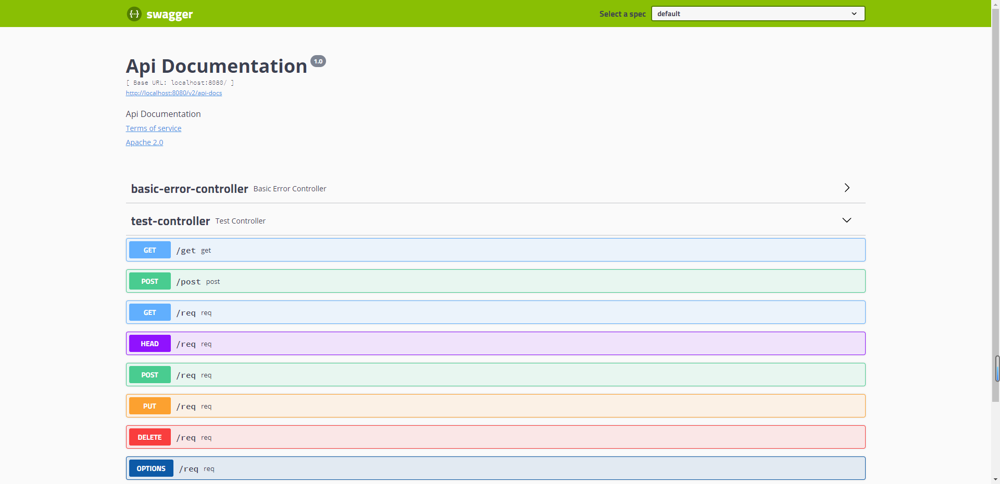

# 一、简介

## 1、介绍

### 1.1 前后端分离

- **前后端分离是为了前端与后端之间的职责更加明确**
- 后台： 负责业务处理
- 前端： 负责显示逻辑
- 在这种情况下，前端和后端可以分别交付给专业的开发人员去做，所以是必须要**定义前后端直接的对接接口**，否则各自为是则项目无法集成，这时就需要一个文档来定义统一的接口


### 1.2 在没有swagger之前

- 在没有swagger之间，我们可以使用word，excel等功能来书写接口定义文档，
- 弊端：**在接口发送改变时需要及时的同步接口文档，否则实际的接口与接口文档不相符，则接口文件就失去了 作用，甚至会起到反作用。**


### 1.3 swagger的作用

- **根据在代码中使用自定义的注解来生成接口文档**，这个在前后端分离的项目中很重要。
- 好处：**在开发接口时可以通过swagger将接口文档定义好，同时也方便以后的维护**


### 1.4 优点

- 号称时最流行的API框架
- 接口文档在线生成，避免同步的麻烦
- 可以支持在线对接口执行测试
- 支持多语言


## 2、Open API

- Open API规范以前叫做Swagger规范，是**REST API的API描述格式**
- Open API文件允许描述整个API，包括
  - **每个访问地址的类型**。POST或GET
  - **每个操作的参数**。包括输入输出参数
  - **认证方法**。比如加密、认证这些方法
  - **扩展描述。**连接信息、声明、使用团队和其他信息
- Open API规范可以使用YAML或JSON格式进行编写，这样更利于我们和机器进行阅读
- Open API规范（OAS）为REST API定义了一个**与语言无关的标准接口**，允许人和计算机发现和理解服务的功能，而无需访问源代码，文档或通过网络流量检查。正确定义后，消费者可以使用最少量的实现逻辑来理解远程服务并与之交互
- 然后**文档生成工具可以使用Open API定义来显示API**，使用各种编程语言生成服务器和客户端的代码生成工具，测试工具以及许多其他用例


## 3、Swagger简介

- Swagger是一套围绕Open API规范构建的开源**工具**，可以帮助设计、构建、记录和使用REST API
- Swagger工具包括的组件
  - Swagger-Editor：基于浏览器编辑器，可以在里面编写Open API规范。类似Markdown，具有实时预览描述文件的功能
  - **Swagger-UI：将Open API规范呈现为交互式API文档，用可视化UI展示描述文件**
  - Swagger-Codegen：**将Open API 规范生成为服务器存根和客户端库**。通过Swagger Codegen可以将描述文件生成html格式和cwiki形式的接口文档，同时也可以生成多种语言的客户端和服务端代码
  - Swagger-Inspector：和Swagger-UI有点类似，但是可以返回更多信息，也会保存请求的实际参数数据
  - Swagger-Hub：集成了上面所有项目的各个功能，你可以以项目和版本为单位，将描述文件上传到Swagger-Hub上。在Swagger-Hub中可以完成上面项目的所有工作，需要注册账号，分免费版和收费版
- 使用Swagger，就是把相关的信息存储在它定义的描述文件里（yml或json格式），再通过维护这个描述文件可以去更新接口文档，以及生成各端代码


# 二、Springfox

- 为什么会出现这个
  - 使用Swagger时，如果碰见版本更新或迭代时，只需要更改Swagger的描述文件即可
  - 但是在频繁的更新项目版本时，很多开发人员认为即使修改描述文件（yml或json）也是一定的工作负担，久而久之就直接修改代码，而不是修改描述文件了，这样基于描述文件生成接口文档也是去了意义
- 来源
  - Marty Pitt编写了一个基于Spring的组件swagger-springmvc，Spring-fox就是根据这个组件发展而来的全新项目
- **Spring-fox是根据代码生成接口文档，所以正常的进行更新项目版本，修改代码即可。而不需要跟随修改描述文件**
- **Spring-fox利用自身AOP特性**，把Swagger集成进来，底层还是Swagger，但是使用起来方便很多


# 三、Swagger用法

## 1、SpringBoot集成

- 引入依赖

~~~xml
<!--swagger依赖-->
<dependency>
	<groupId>io.springfox</groupId>
	<artifactId>springfox-swagger2</artifactId>
	<version>2.9.2</version>
</dependency>
<!--swagger ui-->
<dependency>
	<groupId>io.springfox</groupId>
	<artifactId>springfox-swagger-ui</artifactId>
	<version>2.9.2</version>
</dependency>
~~~

- 主启动类
  - @EnableSwagger2——是springfox提供的一个注解，代表swagger2相关技术开启。
  - 会扫描当前类所在包，及子包中所有的类型中的注解。做swagger文档的定值

~~~java
package com.example;

import org.springframework.boot.SpringApplication;
import org.springframework.boot.autoconfigure.SpringBootApplication;
import springfox.documentation.swagger2.annotations.EnableSwagger2;

/**
 * @EnableSwagger2——是springfox提供的一个注解，代表swagger2相关技术开启。
 * 会扫描当前类所在包，及子包中所有的类型中的注解。做swagger文档的定值
 */
@SpringBootApplication
@EnableSwagger2
public class SwaggerMain {
    public static void main(String[] args) {
        SpringApplication.run(SwaggerMain.class, args);
    }
}
~~~

- 编写controller

~~~java
package com.example.controller;

import org.springframework.web.bind.annotation.GetMapping;
import org.springframework.web.bind.annotation.PostMapping;
import org.springframework.web.bind.annotation.RequestMapping;
import org.springframework.web.bind.annotation.RestController;

@RestController
public class TestController {

    @GetMapping("/get")
    public String get(String a, String b) {
        return "get";
    }

    @PostMapping("/post")
    public String post() {
        return "post";
    }

    @RequestMapping("/req")
    public String req(String m) {
        return "req";
    }

}
~~~

- 访问：http://localhost:8080/swagger-ui.html





## 2、Swagger-UI使用

- 访问swagger-ui.html后可以在页面中看到所有需要生成接口文档的控制器名称，每个接口对应自己的请求方式
  - GetMapping对应GET
  - PostMapping对应POST
  - RequestMapping没有对应的，则会每种都生成


- 点开对应的请求，会有请求参数，可以通过try进行设置参数，然后得到执行代码

  - cmd执行 curl -X GET "http://localhost:8080/get?a=admin&b=123" -H "accept: */*" 便可访问测试接口

  

  - 同时可以看到对应的响应体和响应头
    - 200：响应成功
    - 401：没有权限
    - 403：服务器理解了本次请求但是拒绝执行该任务，该请求不该重发给服务器
    - 404：找不到对应的资源

  

  

  


# 四、Swagger配置

- 可以在项目中创建SwaggerConfig，进行配置文档内容


## 1、配置基本信息

```java
package com.example.config;

import org.springframework.context.annotation.Bean;
import org.springframework.context.annotation.Configuration;
import springfox.documentation.builders.ApiInfoBuilder;
import springfox.documentation.service.ApiInfo;
import springfox.documentation.service.Contact;
import springfox.documentation.spi.DocumentationType;
import springfox.documentation.spring.web.plugins.Docket;

@Configuration
public class SwaggerConfiguration {

    /**
     * 创建Docket类型的对象，并使用spring容器管理
     * Docket是Swagger中的全局配置对象
     * @return
     */
    @Bean
    public Docket docket() {
        Docket docket = new Docket(DocumentationType.SWAGGER_2);
        // API帮助文档的描述信息
        ApiInfo apiInfo = new ApiInfoBuilder()
                .contact(   // 配置swagger文档主体内容
                    new Contact("lzy",              // 文档的发布者名称
                            "http://www.hao123.com",  // 文档发布者的网站地址
                            "li2369273108@163.com") // 文档发布者的电子邮箱
                )
                .title("lzy的学习文档")
                .description("swagger框架学习文档，swagger是一个用于开发REST API的帮助文档")
                .version("1.1")
                .build();
        // 给docket上下文配置api描述信息
        docket.apiInfo(apiInfo);
        return docket;
    }
}
```

- new Contact()对应三个参数
  - name：主体部分显示的名字
  - url：点击后跳转的页面
  - email：发送的邮箱地址
- title：文档标题
- description：描述简介
- version：版本


## 2、扫描包配置

- **docket.select()** // 获取Docket中的选择器，返回ApiSelectorBuilder。构建选择器的。如：扫描什么包的注解
- **.apis(RequestHandlerSelectors.basePackage("com.example.controller"));**   // 设定扫描哪个包（包含子包）的注解

```java
package com.example.config;

import org.springframework.context.annotation.Bean;
import org.springframework.context.annotation.Configuration;
import springfox.documentation.builders.ApiInfoBuilder;
import springfox.documentation.builders.RequestHandlerSelectors;
import springfox.documentation.service.ApiInfo;
import springfox.documentation.service.Contact;
import springfox.documentation.spi.DocumentationType;
import springfox.documentation.spring.web.plugins.Docket;

@Configuration
public class SwaggerConfiguration {

    /**
     * 创建Docket类型的对象，并使用spring容器管理
     * Docket是Swagger中的全局配置对象
     * @return
     */
    @Bean
    public Docket docket() {
        Docket docket = new Docket(DocumentationType.SWAGGER_2);
        // API帮助文档的描述信息
        ApiInfo apiInfo = new ApiInfoBuilder()
                .contact(   // 配置swagger文档主体内容
                    new Contact("lzy",              // 文档的发布者名称
                            "http://www.hao123.com",  // 文档发布者的网站地址
                            "li2369273108@163.com") // 文档发布者的电子邮箱
                )
                .title("lzy的学习文档")
                .description("swagger框架学习文档，swagger是一个用于开发REST API的帮助文档")
                .version("1.1")
                .build();
        // 给docket上下文配置api描述信息
        docket.apiInfo(apiInfo);

        docket.select()        // 获取Docket中的选择器，返回ApiSelectorBuilder。构建选择器的。例如：扫描什么包的注解
                .apis(RequestHandlerSelectors.basePackage("com.example.controller")).build();   // 设定扫描哪个包（包含子包）的注解，加上后就不会有默认的basic-error-controller
        return docket;
    }
}
```


## 3、设置不需要生成接口文档的方法

### 3.1 自定义注解

- 定义自定义注解

```java
package com.example.anno;

import java.lang.annotation.ElementType;
import java.lang.annotation.Retention;
import java.lang.annotation.RetentionPolicy;
import java.lang.annotation.Target;

/**
 * @Target ———— 描述当前的注解可以定义在什么资源上
 *   属性 value
 *     —— 定义具体的资源。包括
 *        —— ElementType.METHOD：可以定义在方法上
 *        —— ElementType.TYPE：可以定义在类型上
 *        —— ElementType.FIELD：可以定义在属性上
 *        —— ElementType.PARAMETER：可以定义在方法参数上
 * @Retention ———— 当前注解在什么时候有效
 *   属性 value
 *     —— 定义具体的生效标记
 *        —— RetentionPolicy.RUNTIME：运行时有效
 *        —— RetentionPolicy.SOURCE：源码中有效
 *        —— RetentionPolicy.CLASS：字节码有效
 */
@Target(value = {ElementType.METHOD, ElementType.TYPE})
@Retention(RetentionPolicy.RUNTIME)
public @interface MyAnnotation4Swagger {
    // 自定义注解的属性。相当于 @MyAnnotation4Swagger(value = "")
    String value() default "";
}
```

- 将注解放到对应的类或方法上

~~~java
@RequestMapping("/req")
@MyAnnotation4Swagger
public String req(String m) {
	return "req";
}
~~~

- 在配置类中进行配置
  - Predicates.not() 取反：false ——> true, true ——> false
  - RequestHandlerSelectors.withMethodAnnotation()：当方法上有指定注解时返回true

~~~java
docket.select()        // 获取Docket中的选择器，返回ApiSelectorBuilder。构建选择器的。例如：扫描什么包的注解
	.apis(Predicates.not(                   // Predicates.not() 取反：false ——> true, true ——> false
		RequestHandlerSelectors.withMethodAnnotation(MyAnnotation4Swagger.class)        // withMethodAnnotation：当方法上有指定注解时返回true
	))
    .apis(RequestHandlerSelectors.basePackage("com.example.controller")) // 设定扫描哪个包（包含子包）的注解
    .build();
~~~

- 重新启动后，就不会在文档中再显示req方法了


### 3.2 范围限制

- docket.select().paths(PathSelectors.regex("/swagger/.*")，通过这个路径限制哪些显示在页面上

```java
docket.select()        // 获取Docket中的选择器，返回ApiSelectorBuilder。构建选择器的。例如：扫描什么包的注解
        .apis(Predicates.not(                   // Predicates.not() 取反：false ——> true, true ——> false
                RequestHandlerSelectors.withMethodAnnotation(MyAnnotation4Swagger.class)        // withMethodAnnotation：当方法上有指定注解时返回true
        ))
        .apis(RequestHandlerSelectors.basePackage("com.example.controller")) // 设定扫描哪个包（包含子包）的注解
        .paths(
                PathSelectors.regex("/swagger/.*")      // 使用正则表达式，约束生成API的范围，即：哪些显示在页面上
        )
        .build();
return docket;
```

- 多种匹配方式用or，几种任意一种满足即可

~~~java
docket.select() 
        .paths(
                Predicates.or(		// 多个规则符合任意一个规则即可
                	PathSelectors.regex("/swagger/.*"),
                    PathSelectors.regex("/swagger2/.*"),
                    PathSelectors.regex("/.*")
                )
        )
        .build();
~~~


# 五、常用注解

## 1、API

- @API是类上的注解。控制整个类生成接口信息的内容
- tags：类的名称。可以有多个值，多个值表示多个副本
- description：描述，已过时

~~~java
package com.example.controller;

import com.example.anno.MyAnnotation4Swagger;
import io.swagger.annotations.Api;
import org.springframework.web.bind.annotation.GetMapping;
import org.springframework.web.bind.annotation.PostMapping;
import org.springframework.web.bind.annotation.RequestMapping;
import org.springframework.web.bind.annotation.RestController;

/**
 * @Api —— 描述当前类型生成帮助文档的信息
 * 属性
 *    —— tags：给当前类型定义别名，可以有多个。定义几个别名，在ui视图中就显示几个控制器访问菜单那
 *    —— description：给当前类型生成的帮助文档定义一个描述信息
 */
@RestController
@Api(tags = {"MyDemo", "MyController", "Swagger学习控制器"}, description = "lzy学习swagger的教程")
public class TestController {

}
~~~


## 2、ApiOperation

- 作用在方法上的注解，给请求方法进行注释描述
- 参数
  - value：方法作用描述
  - notes：方法描述

```JAVA
@GetMapping("/get")
@ApiOperation(value = "这是一个get方法，执行数据查询操作", notes = "Swagger学习使用-处理GET请求的方法")
public String get(String a, String b) {
    return "get";
}
```


## 3、ApiParam

- 作用在方法参数上
- 参数
  - name：参数名称
  - value：参数描述
  - required：参数是否必传

```java
@GetMapping("/get")
@ApiOperation(value = "这是一个get方法，执行数据查询操作", notes = "Swagger学习使用-处理GET请求的方法")
public String get(
        @ApiParam(name = "用户名（a）", value = "新增用户时提供的用户名", required = true) String a,
        @ApiParam(name = "密码（b）", value = "新增用户时提供的密码", required = true)String b) {
    return "get";
}
```


## 4、ApiIgnore

- 作用在方法、类型、参数上面，让其不生成对应的接口文档信息
- 跟上面自定义注解一样的效果

```java
@GetMapping("/get")
@ApiIgnore
@ApiOperation(value = "这是一个get方法，执行数据查询操作", notes = "Swagger学习使用-处理GET请求的方法")
public String get(
        @ApiParam(name = "用户名（a）", value = "新增用户时提供的用户名", required = true) String a,
        @ApiParam(name = "密码（b）", value = "新增用户时提供的密码", required = true)String b) {
    return "get";
}

@PostMapping("/post")
public String post() {
    return "post";
}

@RequestMapping("/req")
public String req(@ApiIgnore String m) {
    return "req";
}
```


## 5、**ApiImplicitParam**

- 作用在方法上，给方法入参进行描述，等同于ApiParam

- 多个参数描述用ApiImplicitParams复数形式

- 属性

  - name：参数名
  - value：说明参数的意思
  - defaultValue：参数的默认值
  - dataType：参数类型
  - required：参数是否必须传

  ~~~java
  @PostMapping("/test")
  //    @ApiImplicitParam(name = "m", value = "m参数描述", required = true, paramType = "字符串", defaultValue = "m")
  @ApiImplicitParams(value = {
  	@ApiImplicitParam(name = "m", value = "m参数描述", required = true, paramType = "字符串", defaultValue = "m"),
      @ApiImplicitParam(name = "n", value = "n参数描述", required = true, paramType = "字符串", defaultValue = "n")
  })
  public String test(String m, String n) {
  	return "post";
  }
  ~~~


## 6、ApiModel

- ApiModel —— 描述一个实体类型，这个实体类型如果成为任何一个生成api帮助文档方法的返回值时，此注解被解析

~~~java
package com.example.entity;

import io.swagger.annotations.ApiModel;
import io.swagger.annotations.ApiModelProperty;

import java.io.Serializable;

/**
 * ApiModel —— 描述一个实体类型，这个实体类型如果成为任何一个生成api帮助文档方法的返回值时，此注解被解析
 */
@ApiModel(value = "自定义实体——MyEntity", description = "MyEntity存储用户数据")
public class MyEntity implements Serializable {

    @ApiModelProperty(value = "主键", name = "主键（id）", required = false, example = "1", hidden = false)
    private String id;
    @ApiModelProperty(value = "姓名", name = "姓名（name）", required = false, example = "张三", hidden = false)
    private String name;
    @ApiModelProperty(value = "密码", name = "密码（password）", required = false, example = "123", hidden = false)
    private String password;

    public MyEntity() {

    }

    public MyEntity(String id, String name, String password) {
        this.id = id;
        this.name = name;
        this.password = password;
    }

    public String getId() {
        return id;
    }

    public void setId(String id) {
        this.id = id;
    }

    public String getName() {
        return name;
    }

    public void setName(String name) {
        this.name = name;
    }

    public String getPassword() {
        return password;
    }

    public void setPassword(String password) {
        this.password = password;
    }
}
~~~

