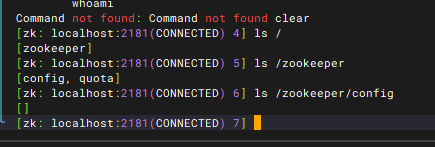

# 一、简介

## 1、是什么

- zookeeper是Apache公司Hadoop项目下的一个子项目，是一个**树形目录结构**
- zookeeper翻译过来就是动物园管理员，用来管Hadoop（大象）、Hive（蜜蜂）、Pig（小猪）的管理员，简称zk
- zookeeper是一个**分布式的、开源的分布式应用程序的协调服务**
- zookeeper提供的主要功能包括
  - 配置管理
  - 分布式锁
  - 集群管理

## 2、下载地址

- 环境准备：zookeeper服务器是用Java创建的，它运行在JVM之上。需要安装JDK 7或更高版本。
- 官网下载地址：https://zookeeper.apache.org/releases.html
- 首先，需要下载zookeeper，点击链接打开zookeeper官网[Apache zookeeper](https://zookeeper.apache.org/)，在官网首页点击Getting Started下面的Download进入下载页面

- 选择下载最新的稳定版本

- 然后点击任意链接开始下载zookeeper的压缩包

## 3、jdk安装

~~~bash
# 创建目录，将jdk安装包上传
mkdir/usr/java
cd /usr/java

# 解压
tar -zxvf jdk-8u121-linux-x64.tar.gz
~~~

- 修改/etc/profile，在结尾添加

~~~bash
export JAVA_HOME=/usr/java/jdk1.8.0_121
export JRE_HOME=$JAVA_HOME/jre
export CLASSPATH=.:$JAVA_HOME/lib:$JRE_HOME/lib
export PATH=$PATH:$JAVA_HOME/bin
~~~

- 让修改生效：source /etc/profile
- 验证JDK有效性：java -version

~~~bash
java version "1.8.0_121"
Java(TM) SE Runtime Environment (build 1.8.0_121-b13)
Java HotSpot(TM) 64-Bit Server VM (build 25.121-b13, mixed mode)
~~~

## 4、zookeeper安装

- 将下载的zookeeper放到/opt/zookeeper目录下
- tar -zxvf apache-zookeeper-3.8.4-bin.tar.gz
- 进入到conf目录拷贝一个zoo_sample.cfg并完成配置

~~~bash
#进入到conf目录
cd /opt/zookeeper/apache-zookeeper-3.8.4-bin/conf/
#拷贝
cp  zoo_sample.cfg  zoo.cfg
~~~

- 修改zoo.cfg

~~~bash
# 修改存储目录
dataDir=/opt/zookeeper/zkdata

# 默认是8080，因为8080可能被web应用使用，Springboot项目中tomcat的默认启动端口就是8080
admin.serverPort=9099
 
# 添加这个配置才能使用create -t ttl /node_name
extendedTypesEnabled=true
~~~

- 创建存储目录：mkdir  zkdata

- 启动zooKeeper：
  - 切换到zookeeper安装目录，通过以下命令之一启动zookeeper服务器：
    - cd /opt/zookeeper/apache-zookeeper-3.8.4-bin/bin
    - **./zkServer.sh start**
  - 如果配置文件名不是zoo.cfg，需要指定配置文件名：**./zkServer.sh start conf/配置文件名.cfg**

- 查看zookeeper状态：**./zkServer.sh status**
  - 单集群状态

# 二、zookeeper命令操作

## 1、zookeeper数据模型

- ZooKeeper 是一个**树形目录服务**，其数据模型和 Unix 的文件系统目录树很类似，拥有一个层次化结构。
- 这里面的每一个节点都被称为：ZNode，**每个节点上都会保存自己的数据和节点信息。**
- 节点可以拥有子节点，同时也允许少量（1MB）数据存储在该节点之下。
- 节点可以分为四大类：
  - PERSISTENT 持久化节点
  - EPHEMERAL 临时节点：-e
  - PERSISTENT_SEQUENTIAL 持久化顺序节点：-s
  - EPHEMERAL_SEQUENTIAL 临时顺序节点：-es

## 2、服务端常用命令

- 启动 ZooKeeper 服务：./zkServer.sh start

- 查看 ZooKeeper 服务状态：./zkServer.sh status

- 停止 ZooKeeper 服务：./zkServer.sh stop

- 重启 ZooKeeper 服务：./zkServer.sh restart

## 3、客户端命令

- 连接 Zookeeper服务端：./zkCli.sh -server ip:port
  - 如果是本机，后面的ip和端口可以省略不写

- 断开连接：quit

- 查看指定节点下有哪些子节点：ls 节点路径

- 创建节点包含数据：create 节点路径 [数据]

- 创建子节点：create 节点路径 [数据]

- 获取节点数据：get 节点路径

- 设置节点数据：set 节点路径 [数据]

- 删除节点：delete 节点路径

## 4、客户端非持久化命令

- 
