# 二、进阶篇

## 1、存储引擎

### 1.1 mysql的体系结构

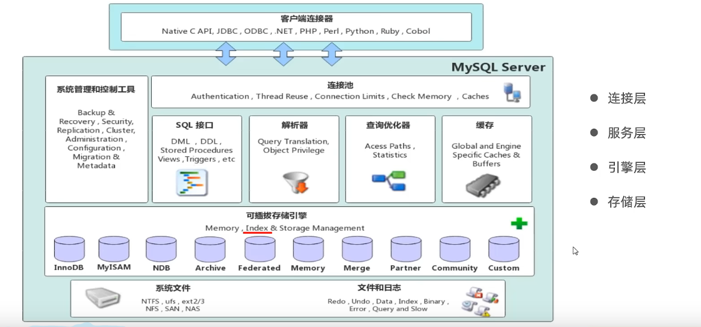

- 连接层：最上层是一些客户端和链接服务，主要完成一些类似于连接处理、授权认证、及相关的安全方案。服务器也会为安全接入的每个客户端验证它所具有的操作权限
- 服务层：第二层架构主要完成大多数的核心服务功能，如SQL接口，并完成缓存的查询，SQL的分析和优化，部分内置函数的执行。所有跨存储引擎的功能也在这一层实现，如过程、函数等
- 引擎层：存储引擎真正的负责了mysql中数据的存储和提取，服务器通过API和存储引擎进行通信。不同的存储引擎具有不同的功能，这样我们可以根据自己的需要，来选取合适的存储引擎
- 存储层：主要时将数据存储在文件系统之上，并完成与存储引擎的交互

### 1.2 存储引擎简介

- 存储引擎就是存储数据、建立索引、更新/查询数据等技术的实现方式
- 存储引擎是基于表的，而不是基于库的
- 存储引擎也可被称为表类型
- 默认是：InnoDB

~~~SQL
-- 1、创建表时，指定存储引擎
create table 表名(
	字段1 类型1 [comment 字段1注释],
    ...
    字段n 类型n [comment 字段n注释]
) engine = InnoDB [comment 表注释];

-- 2、查看当前数据库支持的存储引擎
show engines;
~~~

### 1.3 存储引擎特点

#### 1.3.1 InnoDB

- 简介
  - 一种兼顾**高可靠性**和**高性能**的通用存储引擎，在MYSQL5.5之后，InnoDB是默认的MYSQL存储引擎
- 特点
  - DML操作遵循ACID模型，支持**事务**
  - **行级锁**，提高并发访问性能
  - **支持外键**FOREIGN KEY约束，保证数据的完整性和正确性
- 文件
  - xxx.ibd：xxx代表的是表名，InnoDB引擎的每张表都会对应这样一个表空间文件，存储该表的表结构(frm，sdi)、数据和索引
  - 参数：innodb_file_per_table

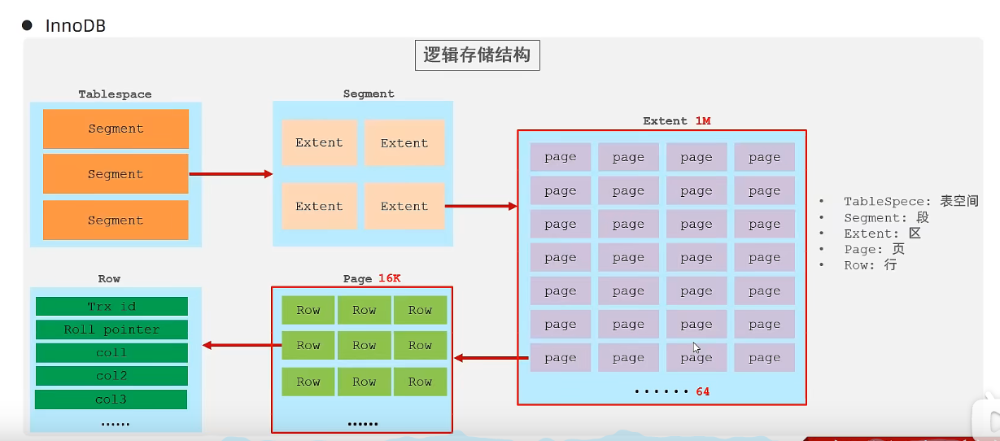

#### 1.3.2 MyISAM

- 简介
  - MyISAM是MySQL早期的默认存储引擎
- 特点
  - 不支持事务，不支持外键
  - 支持表锁，不支持行锁
  - 访问速度快
- 文件
  - xxx.sdi：存储表结构信息
  - xxx.MYD：存储数据
  - xxx.MYI：存储索引

#### 1.3.3 Memory

- 简介
  - Memory引擎的表数据是存储在内存中的，由于受到硬件问题、或断电问题的影响，只能将这些表作为临时表或缓存使用
- 特点
  - 内存存放
  - hash索引(默认)
- 文件
  - xxx.sdi：存储表结构信息

#### 1.3.4 区别

|     特点     | InnoDB | MyISAM | Memory |
| :----------: | :----: | :----: | :----: |
|   存储限制   |  64TB  |   有   |   有   |
| **事务安全** |  支持  |   -    |   -    |
|  **锁机制**  |  行锁  |  表锁  |  表锁  |
|  B+tree索引  |  支持  |  支持  |  支持  |
|   Hash索引   |   -    |   -    |  支持  |
|   全文索引   |  支持  |  支持  |   -    |
|   空间使用   |   高   |   低   |  N/A   |
|   内存使用   |   高   |   低   |  中等  |
| 批量插入速度 |   低   |   高   |   高   |
| **支持外键** |  支持  |   -    |   -    |

### 1.4 存储引擎选择

- InnoDB：**支持事务、外键**。如果应用对**事务的完整性**有比较高的要求，在**并发条件下要求数据的一致性**，数据操作除了插入和查询之外，还包含很多的更新、删除操作，就选InnoDB
- MyISAM：如果应用是**以读操作和插入操作为主，只有很少的更新和删除操作**，并且对事务的完整性、并发性要求不是很高，就选MyISAM
- Memory：将所有数据保存在内存中，访问速度快，**通常用于临时表及缓存**。Memory的缺陷就是对表的大小有限制，太大的表无法缓存在内存中，而且无法保障数据的安全性

## 2、索引

### 2.1 概述

- 索引（index）是帮助MySQL**高效获取数据**的**数据结构（有序）**。在数据之外，数据库系统还维护着满足特定查找算法的数据结构，这些数据结构以某种方式引用（指向）数据，这样就可以在这些数据结构上实现高级查找算法，这种数据结构就是索引。

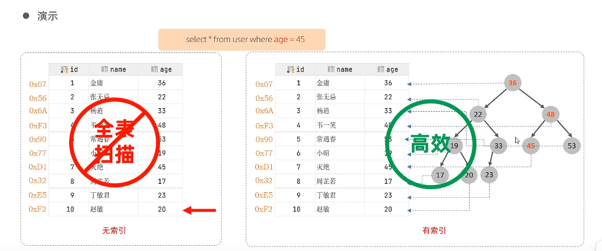

- 备注：上述二叉树索引结构的只是一个示意图
- 优缺点

|                            优势                             |                             劣势                             |
| :---------------------------------------------------------: | :----------------------------------------------------------: |
|           提高数据检索的效率，降低数据库的IO成本            |                    索引列也是要占用空间的                    |
| 通过索引列对数据进行排序，降低数据排序的成本，降低CPU的消耗 | 索引大大提高了查询效率，同时却也降低更新表的速度，如对表进行insert、update、delete时，也需要对索引维护，所以效率低 |

### 2.2 索引结构

- MySQL的索引是在存储引擎层实现的，不同的存储引擎有不同的结构
- 平时说的索引，如果没有特别指明，就是指**B+树结构组织的索引**

|      索引结构       |                             描述                             |     InnoDB      | MyISAM | Memory |
| :-----------------: | :----------------------------------------------------------: | :-------------: | :----: | :----: |
|     B+Tree索引      |          最常见的索引类型，大部分引擎都支持B+树索引          |      支持       |  支持  |  支持  |
|      Hash索引       | 底层数据结构是用哈希表实现的，只有精确匹配索引列的查询才有效，不支持范围查询 |     不支持      | 不支持 |  支持  |
|  R-tree(空间索引)   | 空间索引是MyISAM引擎的一个特殊索引类型，主要用于地理空间数据类型，通常使用较少 |     不支持      |  支持  | 不支持 |
| Full-text(全文索引) | 是一种通过建立倒排索引，快速匹配文档的方式。类似于Lucene，Solr，ES | 5.6版本之后支持 |  支持  | 不支持 |

### 2.3 BTree树

- 二叉树结构

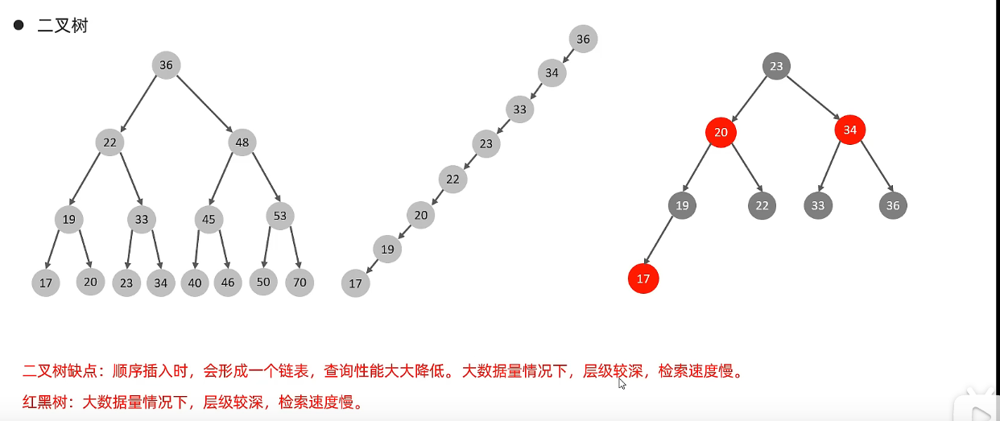

- B-Tree树

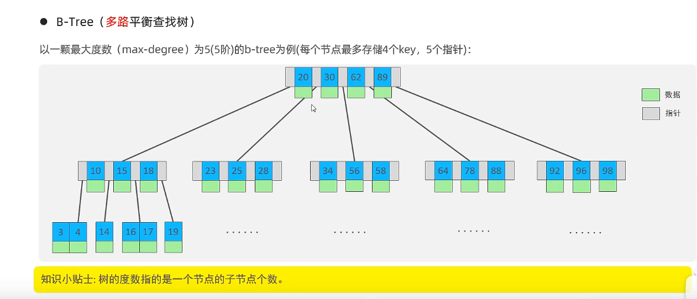

- B+Tree树
  - 所有数据都会出现在叶子节点
  - 叶子节点会形成一个单向链表

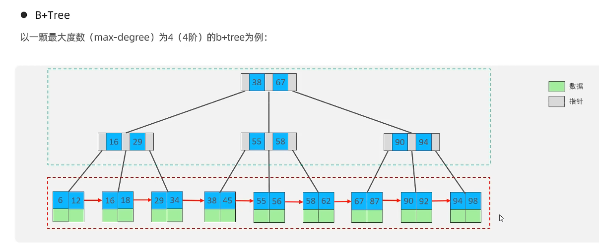

- Mysql的B+Tree树
  - 在原B+Tree的基础上，增加了一个指向相邻叶子节点的链表指针，就形成了带有顺序指针的B+Tree

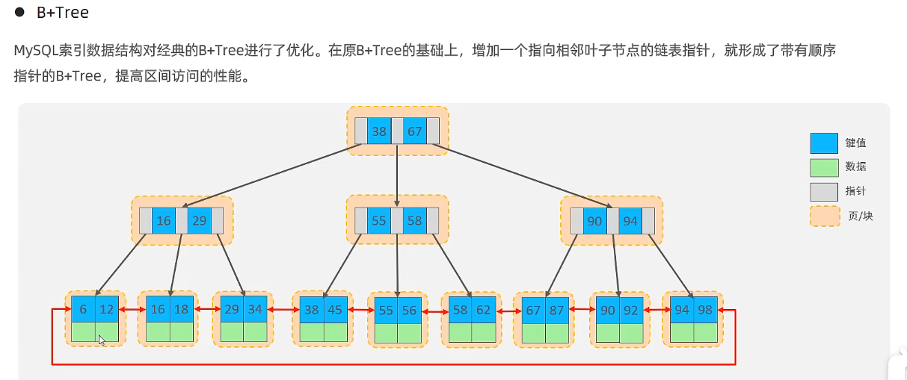

### 2.4 Hash索引

- 哈希索引就是采用一定的hash算法，将键值换算成新的hash值，映射到对应的槽位上，然后存储在hash表中
- 如果两个(或多个)键值，映射到一个相同的槽位上，他们就产生了hash冲突，可以通过链表来解决

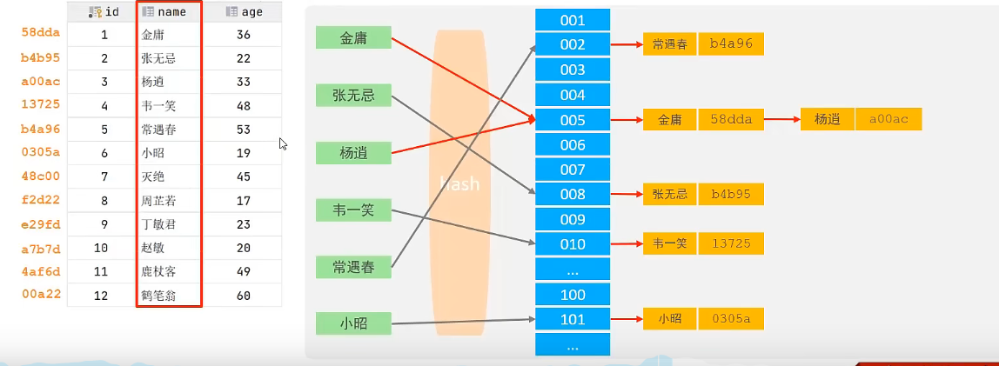

- 特点
  - hash索引只能用于对等比较（=，in），不支持范围查询（between，>，<，...）
  - 无法利用索引完成排序操作
  - 查询效率高，通常只需要一次检索就可以了，效率通常要高于B+tree索引
- 存储引擎支持
  - 在MySQL中，支持hash索引的是Memory引擎
  - InnoDB中具有自适应hash功能
  - hash索引是存储引擎根据B+Tree索引在指定条件下自动构建的 

### 2.5 思考

- 为什么InnoDB存储引擎选择使用B+tree索引结构
  - 相对二叉树，层级更少，搜索效率高
  - 对于B-tree，无论是叶子节点还是非叶子节点，都会保存数据，这样导致一页中存储的键值减少，指针跟着减少，要同样保存大量数据，只能增加树的高度，导致性能降低
  - 相对Hash索引，B+tree支持范围匹配及排序操作

### 2.6 索引分类

|   分类   |                         含义                         |           特点           |  关键字  |
| :------: | :--------------------------------------------------: | :----------------------: | :------: |
| 主键索引 |               针对于表中主键创建的索引               | 默认自动创建，只能有一个 | primary  |
| 唯一索引 |           避免同一个表中某数据列中的值重复           |        可以有多个        |  unique  |
| 常规索引 |                   快速定位特定数据                   |        可以有多个        |          |
| 全文索引 | 全文索引查找的是文本中的关键字，而不是比较索引中的值 |        可以有多个        | fulltext |

- 在InnoDB存储引擎中，根据索引的存储形式，又可以分为两种

|            分类             |                            含义                            |         特点         |
| :-------------------------: | :--------------------------------------------------------: | :------------------: |
| 聚集索引（Clustered Index） | 将数据存储与索引放到了一块，索引结构的叶子节点保存了行数据 | 必须有，而且只有一个 |
| 二级索引（Secondary Index） | 将数据与索引分开存储，索引结构的叶子节点关联的是对应的主键 |     可以存在多个     |

- 聚集索引的选取规则

  - 如果存在主键，主键索引就是聚集索引
  - 如果不存在主键，将使用第一个唯一（UNIQUE）索引作为聚集索引
  - 如果表没有主键，或没有合适的唯一索引，则InnoDB会自动生成一个rowid作为隐藏的聚集索引

  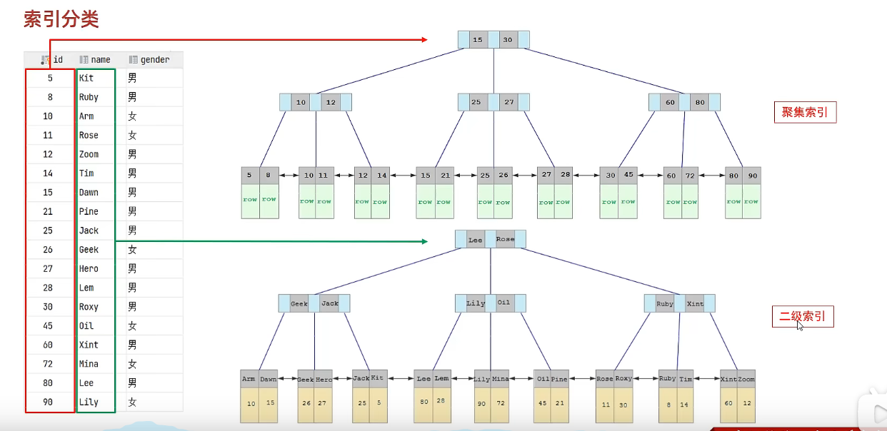

- 回表查询
  - 先根据名字通过二级索引查询出Arm的id值
  - 再根据id值通过聚集索引查询数据信息

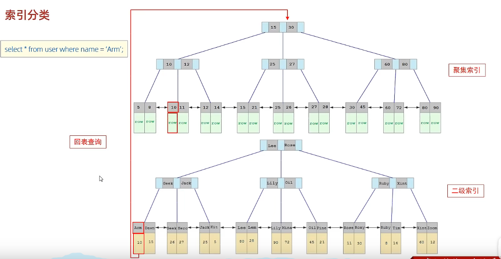

- 思考题

~~~sql
-- 以下哪个语句执行效率高,注意：id为主键，name字段创建的有索引
select * from user where id = 10;
select * from user where name = 'arm';
-- 第一条效率高，第二条有回表查询
~~~

### 2.7 索引语法

- 创建索引

~~~sql
create [unique | fulltext] index index_name on table_name(index_col_nmae,...);
-- unique：创建的是唯一索引
-- fulltext：创建的是全局索引
-- 只在一列上创建的索引：单列索引
-- 在多列上创建的是：联合索引或组合索引·
~~~

- 查看索引

~~~sql
show index from table_name;
~~~

- 删除索引

~~~sql
drop index index_name on table_name;W
~~~

- 案例

~~~sql
-- 1、name字段为姓名字段，该字段的值可能会重复，为该字段创建索引
create index idx_user_name on tb_user(name);

-- 2、phone手机号字段的值，是非空，且唯一的，为该字段创建唯一索引
cretae unique index idx_user_phone on tb_user(phone);

-- 3、为profession、age、status创建联合索引
create index idx_user_pro_age_sta on tb_user(profession,age, status);

-- 4、为email建立合适的索引来提升查询效率
create index idx_user_emial on tb_user(email);
~~~

### 2.8 SQL性能分析

- SQL执行频率
  - MySQL客户端连接成功后，通过show [session | global] status命令可以提供服务器状态信息
  - 通过下面指令可以查看当前数据库的insert、update、delete、select的访问频次

~~~sql
-- 7个下划线
-- global：全局
-- session：当前会话
show global status like 'Com_______';
~~~

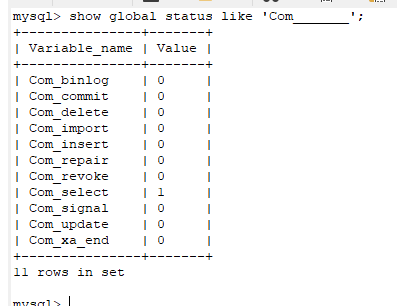

- 慢查询日志
  - 慢查询日志记录了所以执行时间超过指定参数（long_query_time，单位：秒，默认10秒）的所有语句的日志
  - MySQL的慢查询日志默认没有开启，需要在MySQL的配置文件（/etc/my.cnf）中配置如下信息
  - 通过以下指令重新启动MySQL服务器进行测试，查看慢日志文件中记录的信息/var/lib/mysql/localhost-slow.log

~~~bash
# 开启MySQL慢日志查询开关
slow_query_log = 1
# 设置慢查询日志的时间为2秒，SQL语句执行时间超过2秒，就会视为慢查询，记录慢查询日志
long_query_time=2
~~~

~~~sql
-- 查看慢查询是否开启
show variables like 'slow_query_log';
~~~

- profile详情

  - show profiles能够在做SQL优化时帮助我们了解时间都耗费到哪里去了。通过have_profiling参数，能够看到当前MySQL是否支持profiles操作：

  - ~~~sql
    select @@have_profiling;
    ~~~

  - 默认profiling是关闭的，可以通过set语句在session/global 级别开启profiling：

  - ~~~sql
    set profiling = 1;
    ~~~

  - 执行一系列的业务SQL的操作，然后通过如下指令查看指令的执行耗时

  - ~~~sql
    -- 查看每一条SQL的耗时基本情况
    show profiles;
    -- 查看指令query_id的SQL语句各个阶段的耗时情况
    show profile for query query_id;
    -- 查看指定query_id的SQL语句CPU的使用情况
    show profile cpu for query query_id;
    ~~~

- explain执行计划

  - explain或者desc命令获取MySQL如何执行select语句的信息，包括了select语句执行过程中表如何连接和连接的顺序

  - ~~~sql
    -- 直接在select语句之前加上关键字explain/desc
    explain select 字段列表 from 表名 where 条件;
    ~~~

  - explain各字段的含义

    - id：select查询的序列号，表示查询中执行select子句或者是操作表的顺序（id相同，执行顺序从上到下；id不同，值越大，越先执行）
    - select_type：表示select的类型，常见的取值有：
      - simple（简单表，即不适用表连接或者子查询）
      - primary（主查询，即外层的查询）
      - union（union中的第二个或者后面的查询语句）
      - subquery（select/where之后包含了子查询）
    - **type**：表示连接类型，性能由好到差的连接类型为：null、system、const、eq_ref、ref、range、index、all
    - possible_key：显示可能应用在这张表上的索引，一个或多个
    - key：实际用到的索引，如果是null，则没有使用索引
    - key_len：表示索引中使用的字节数，该值为索引字段最大可能长度，并非实际使用长度，在不损失精确性的前提下，长度越短越好
    - rows：MySQL认为必须要执行查询的行数，在InnoDB引擎的表中，是一个估计值，可能并不总是准确的
    - filtered：表示返回结果的行数占需读取行数的百分比，filtered的值越大越好

### 2.9 索引使用

#### 2.9.1 联合索引使用

- 最左前缀法则：
  - 如果索引了多列（联合索引），要遵守最左前缀法则
  - 查询从索引的最左列开始，并且不跳过索引中的列
  - 如果跳跃某一列，**索引将部分失效（后面的字段索引失效）**
  - 注意：只要where条件有即可，对前后顺序并没有固定要求

~~~sql
explain select * from tb_user where profession = '软件工程' and age = 31 and status = '0';
explain select * from tb_user where profession = '软件工程' and age = 31;
explain select * from tb_user where profession = '软件工程' and status = '0';
explain select * from tb_user where profession = '软件工程';
explain select * from tb_user where age = 31 and status = '0';
explain select * from tb_user where status = '0';
explain select * from tb_user where status = '0' and age = 31 and profession = '软件工程' ;
-- 第1条会直接用到联合索引，且索引字段长度为54
-- 第2条会直接用到联合索引，且索引字段长度为49，索引部分失效
-- 第3条会直接用到联合索引，且索引字段长度为47，索引部分失效
-- 第4条会直接用到联合索引，且索引字段长度为47，索引部分失效
-- 第5条不会用到索引，不满足最左前缀法则，不满足最左前缀法则
-- 第6条也不会用到索引，不满足最左前缀法则
-- 第7条会直接用到联合索引，且索引字段长度为54
~~~

- 在联合索引中，出现范围查询(>，<)，范围查询右侧的列索引失效
  - 所以，在业务允许的条件下，尽量使用>=或者<=可以规避

~~~sql
explain select * from tb_user where profession = '软件工程' and age > 30 and status = '0';
explain select * from tb_user where profession = '软件工程' and age >= 30 and status = '0';
-- 第1条会直接用到联合索引，且索引字段长度为49，status失效
-- 第2条会直接用到联合索引，且索引字段长度为54
~~~

#### 2.9.2 索引列

- 不要在索引列上进行运算操作，**索引将会失效**

~~~sql
explain select * from tb_user where substring(phone, 10, 2) = '15';
-- 索引失效了
~~~

- 字符串不加引号
  - 字符串类型字段使用时，不加引号，**索引将失效**

~~~sql
explain select * from tb_user where profession = '软件工程' and age = 31 and status = 0;
explain select * from tb_user where phone = 12345678900;
-- 第一条的status索引会失效
~~~

#### 2.9.3 模糊查询

- 如果仅仅是尾部模糊匹配，索引不会失效。如果是头部模糊匹配，索引失效

~~~sql
explain select * from tb_user where profession like '软件%';
explain select * from tb_user where profession like '%工程';
explain select * from tb_user where profession like '%工%';
-- 只有第一个有效，后面两个索引会失效，变成全表扫描
~~~

#### 2.9.4 or连接

- 用or分隔开的条件，如果or前的条件中的列有索引，而后面的列中没有索引，那么设计的索引都不会被用到
  - 为了规避这种情况，只需要在没有索引的列上创建索引即可 

~~~sql
explain select * from tb_user where id = 10 or age = 23;
explain select * from tb_user where phone = '12345678900' or age = 23;
-- 索引失效，因为age没有索引	
~~~

- 如果MySQL评估使用索引比全表更慢，则不适用索引

~~~sql
select * from tb_user where phone >= '17799990005';
select * from tb_user where phone >= '17799990015';
-- 因为查询语句会把表中大部分数据查询出来，所以走全表查询可能还快点，就不会走索引
~~~

#### 2.9.5 SQL提示

SQL提示，是优化数据库的一个重要手段，简单来说，就是在SQL语句中加入一些人为的提示来达到优化操作的目的

- use index：使用哪个索引（Mysql还是会自动判定谁更优，用更优的）

~~~sql
explain select * from tb_user use index(idx_user_pro) where profession = '软件工程';
~~~

- ignore index：忽略哪个索引

~~~sql
explain select * from tb_user ignore index(idx_user_pro) where profession = '软件工程';
~~~

- force index：必须使用哪个索引

~~~sql
explain select * from tb_user force index(idx_user_pro) where profession = '软件工程';
~~~

#### 2.9.6 覆盖索引

- 尽量使用覆盖索引（查询使用了索引，并且需要返回的列，在该索引中已经全部能够找到），减少select *

~~~sql
explain select id,profession from tb_user where profession = '软件工程' and age = 31 and status = '0';
explain select id,profession,age,status from tb_user where profession = '软件工程' and age = 31 and status = '0';
explain select id,profession,age,status,name from tb_user where profession = '软件工程' and age = 31 and status = '0';
explain select * from tb_user where profession = '软件工程' and age = 31 and status = '0';
~~~

- using index condition：查找使用了索引，但是需要回表查询数据
- using where; using index：查找使用了索引，但是需要的数据都在索引列中能找到，索引不需要回表查询

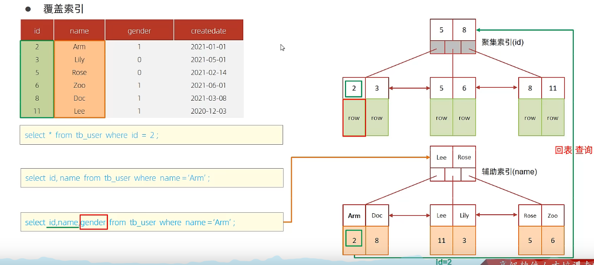

- 第一条语句直接走的聚集索引，没有发生回表，故而效率高
- 第二条根据name查询，name索引下的值存放的就是id值，故而是覆盖索引，不需要回表
- 第三条需要查询gender，但是在索引中没有覆盖，故而需要用id值去走聚集索引，发生回表

~~~sql
-- 一张表，有四个字段（id，username，password，status），由于数据量大，需要对以下SQL语句进行优化，该如何优化才是最优方案
select id,username,password from tb_user where username = 'lzy';
-- 对username和password建立联合索引，这样节点下面存放的就是id值，达到覆盖索引的效果，不必发生回表查询
~~~

#### 2.9.7 前缀索引

- 当字段类型为字符串（varchar，text等）时，有时候需要索引很长的字符串，这会让索引变得很大，查询时，浪费大量的磁盘IO，影响查询效率。此时可以只将字符串的一部分前缀，建立索引，这样可以大大节约索引空间，从而提高索引效率
- 语法

~~~sql
create index ids_xxxx on table_name(column(n));
~~~

- 前缀长度：可以根据索引的选择性来决定，而选择性是指不重复的索引值（基数）和数据表的记录总数的比值，索引选择性越高则查询效率越高，唯一索引的选择性是1，这是最好的索引选择性，性能也是最好的

~~~sql
select count(distinct email)/count(*) from tb_user;
select count(distinct substring(email,1,5))/count(*) from tb_user;
~~~

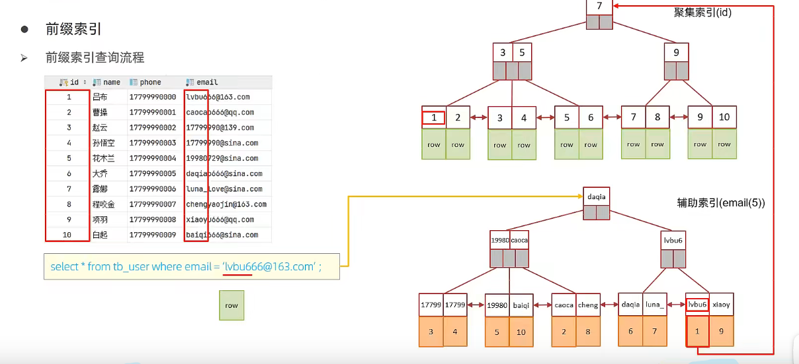

#### 2.9.8 单列索引和联合索引

- 单列索引：即一个索引只包含单个列
- 联合索引：即一个索引包含了多个列
- 在业务场景中，如果存在多个查询条件，考虑针对于查询字段建立索引时，建议建立联合索引，而非单列索引
- **多条件联合索引查询时，MySQL优化器会评估哪个字段的索引效率更高，会选择该索引完成本次查询**

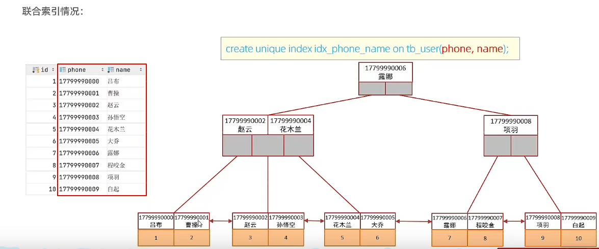

### 2.10 索引设计原则

- 针对于数据量较大，且查询比较频繁的表建立索引
- 针对于常作为查询条件（where）、排序（order by）、分组（group by）操作得到字段建立索引
- 尽量选择区分度高的列作为索引，尽量建立唯一索引，区分度越高，使用索引的效率越高
- 如果时字符串类型的字段，字段的长度较长，可以针对于字段的特点，建立前缀索引
- 尽量使用联合索引，减少单列索引，查询时，联合索引很多时候可以覆盖索引，节省存储空间，避免回表，提高查询效率
- 要控制索引的数量，索引并不是多多益善，索引越多，维护索引结构的代价就越大，会影响增删改查的效率
- 如果索引列不能存储NULL值，请在创建表时使用not null约束他。当优化器知道每列是否包含null值时，它可以更好的确定哪个索引最有效地用于查询

## 3、SQL优化

### 3.1 插入数据

- 批量插入：因为每次插入语句都会经过建立连接，数据交互等步骤，频繁插入会在这方面浪费很多性能，故而选择批量插入

~~~sql
insert into tb_user values(1,'tom'),(2,'cat'),(3,'Jerry');
~~~

- 手动提交事务：因为mysql的事务是自动提交的，所以每条语句执行都会开启事务关闭事务，频繁的开启关闭事务也会造成性能浪费，所以可以选择手动提交事务

~~~sql
start transaction;
insert into tb_user values(1,'tom'),(2,'cat'),(3,'Jerry');
insert into tb_user values(4,'tom'),(5,'cat'),(6,'Jerry');
insert into tb_user values(7,'tom'),(8,'cat'),(9,'Jerry');
commit;
~~~

- 主键顺序插入

~~~sql
-- 主键乱序插入：8 1 9 21 88 2 4 15 89 5 7 3
-- 主键顺序插入：1 2 3 4 5 7 8 9 15 21 88 89
~~~

- 大批量插入数据：如果一次性需要插入大批量数据，使用insert语句插入性能较低，此时可以使用MySQL数据库提供的load指令进行插入。**也需要顺序插入**。操作如下：

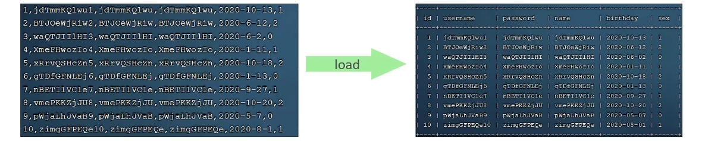

~~~mysql
# 客户端连接服务端时，加上参数 --local-infile
mysql --local-infile -uroot -p
# 设置全局参数local-infile为1，开启从本地加载文件导入数据的开关
set global local-infile = 1
# 执行load指令将准备好的数据，加载到表结构中
load data local infile '/root/sql1.log' into table 'tb_user' fields terminated by ',' lines terminated by '/n';
~~~

### 3.2 主键优化

- 数据组织方式：在InnoDB存储引擎中，表数据都是根据主键顺序组织存放的，这种存储方式的表称为**索引组织表 **
- 页分裂：页可以为空，也可以填充一半，也可以填充100%。每个页包含了2~N行数据（如果一行数据多大，会行溢出），根据主键排列
- 主键顺序插入

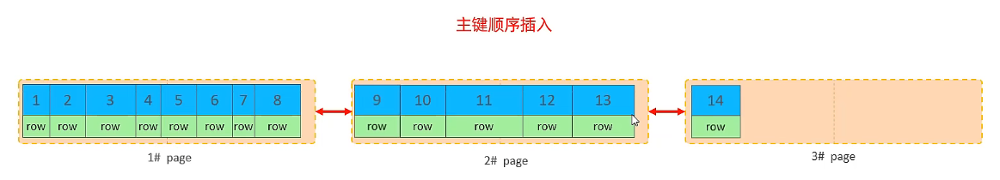

- 主键乱序插入

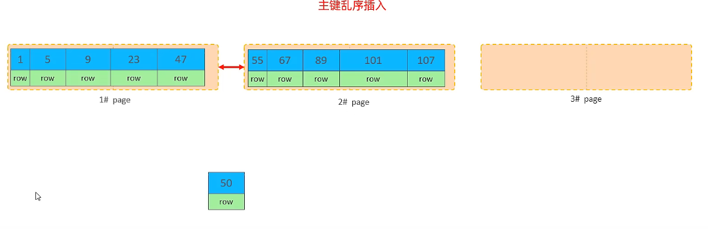

- 页分裂

  - 第一个页百分之50的地方进行分裂，放到第三个新开辟的页中
  - 然后50放到47后，组成第三页
  - 然后更换指针指向

  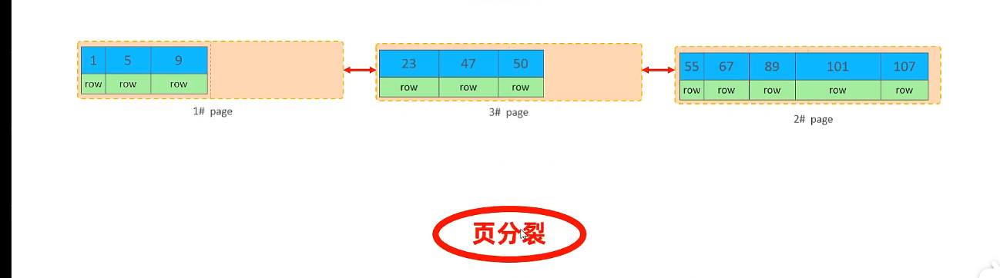

  ​

- 页合并
  - 当删除一行记录时，实际上记录并没有被物理删除，只是记录被标记（flaged）为删除并且它的空间变得允许被其他记录声明使用
  - 当页中删除的记录达到MERGE_THRESHOLD（默认为页的50%），InnoDB会开始寻找最靠近的页（前或后）看看是否可以将两个页合并以优化空间使用
  - MERGE_THRESHOLD：合并页的阈值，可以自己设置，在创建表或者创建索引时指定

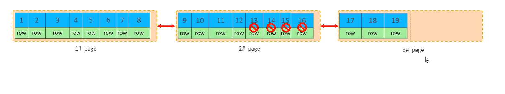

- 主键设计原则
  - 满足业务需求的情况下，尽量降低主键的长度
    - 因为二级索引存放的是主键，太长会造成空间浪费并且查询时浪费IO
  - 插入数据时，尽量选择顺序插入，选择使用AUTO_INCREMENT自增主键
  - 尽量不要使用UUID做主键或者其他自然主键，如身份证号
  - 业务操作时，避免对主键的修改

### 3.3 order by优化

- Using filesort：通过表的索引或全表扫描，读取满足条件的数据行，然后在排序缓冲区sort buffer中完成排序操作，所有不是通过索引直接返回排序结果的排序都交FileSort排序
- Using index：通过有序索引顺序扫描直接返回有序数据，这种情况即为using index，不需要额外排序，操作效率高

~~~sql
-- 没有创建索引时，根据age、phone进行排序
explain select id,age,phone from tb_user order by age,phone;		-- using filesort
-- 创建索引
create index idx_user_age_phone_aa on table tb_user(age,phone);		
-- 创建索引之后，根据age，phone进行升序排序	
explain select id,age,phone from tb_user order by age,phone;		-- using index
-- 创建索引之后，根据age，phone进行降序排序
explain select id,age,phone from tb_user order by age desc,phone desc;		--Backward index scan; Using index :逆向扫描索引
explain select id,age,phone from tb_user order by phone,age;		-- Using index;Using filesort：因为违背了最左前缀法则，order by要看顺序的
explain select id,age,phone from tb_user order by age asc,phone desc;    -- Using index;Using filesort：两者要保持一致的，不能一个正向扫描，一个逆向扫描
-- 再创建一个索引
create index idx_user_age_phone_ad on table tb_user(age asc,phone desc);
-- 创建索引之后
explain select id,age,phone from tb_user order by age asc,phone desc;    -- Using index
~~~

- order by优化方式
  - 根据排序字段建立合适的索引，多字段排序时，也遵循最左前缀法则
  - 尽量使用覆盖索引
  - 多字段排序，一个升序一个降序，此时需要注意联合索引再创建时的规则（asc/desc）
  - 如果不可避免的出现了filesort，大数据量排序时，可以适当增大排序缓冲区大小sort_buffer_size(默认256K)。因为一旦超过这个量，就会跑到磁盘中进行排序，很浪费性能

### 3.4 group by优化

- 在分组操作时，可以通过索引来提高效率
- 分组操作时，索引的使用也是满足最左前缀法则

~~~sql
explain select profession,count(*) from tb_user group by profession;
-- Using temporary：使用临时表，效率低
create index idx_user_pro_age_sta on table tb_user(profession,age,status);
-- 创建索引
explain select profession,count(*) from tb_user group by profession;
-- Using index：使用索引，效率高
explain select age,count(*) from tb_user group by age; 
-- Using index;Using temporary：因为不满足最左前缀法则，故而效率低
explain select age,count(*) from tb_user group by age; 
-- Using index;Using temporary：因为不满足最左前缀法则，故而效率低
explain select profession,age,count(*) from tb_user group by progession,age; 
-- Using index;满足最左前缀法则，故而效率高
explain select age,count(*) from tb_user where profession = '软件工程' group by age; 
-- Using index;满足最左前缀法则，故而效率高
~~~

### 3.5 limit优化

- 一个常见的问题：limit 2000000,10，此时需要MySQL排序前2000010记录，仅仅返回2000000~2000010的记录，其他记录丢弃，查询排序的代价非常大
- 优化思路：
  - 一般分页查询时，通过创建覆盖索引能够较好地提高性能，可以通过覆盖索引子查询形式进行优化

~~~sql
select * from tb_user s,(select id from tb_user order by id limit 9000000,10) a where s.id = a.id;
~~~

### 3.6 count优化

- MyISAM引擎把一个表的总行数存在了磁盘上，因此执行count(*)的时候会直接返回这个数，效率很高
- InnoDB引擎：执行count(*)的时候，需要把数据一行一行地从引擎里面读出来，然后累积计数。
- 优化思路：**自己计数**
- count的几种用法：count()是一个聚合函数，对于返回的结果集，一行行的判断，如果count函数的参数不是null，累计值就加1，否则不加，最后返回累计值
  - count(*)：InnoDB引擎并不会把全部字段取出来，而是专门做了优化，不取值，服务层直接按行进行累加
  - count(主键)：InnoDB引擎会遍历整张表，把每一行的主键id值都取出来，返回给服务层。服务层拿到主键后，直接按行进行累加（主键不可能为null）
  - count(字段)：
    - 没有not null约束：InnoDB引擎会遍历整张表把每一行的字段值都取出来，返回给服务层，服务层判断是否为null，不为null，计数累加
    - 有not null约束：InnoDB引擎会遍历整张表把每一行的字段值都取出来，返回给服务层，直接按进行累加
  - count(1)：InnoDB引擎遍历整张表，但不取值。服务层对于返回的每一行，放一个数字“1”进去，直接按行进行累加
- **按照效率排序：count(字段) < count(主键id) < count(1) < count(*)，所以尽量使用count(*)**

### 3.7 update优化

- InnoDB的行锁是针对索引加的锁，不是针对记录加的锁，并且该索引不能失效，否则会从行锁升级到表锁，影响并发效率

~~~sql
select student set no = '2000100100' where id = 1;
select student set no = '2000100105' where name = 'lzy';
-- 如果同时开启两个客户端连接，在事务中执行，第一条根据主键id进行修改，只会锁住这行数据，其他事务可以对其他行数据进行操作；但是根据name进行修改的话，不是索引项，就会锁住整张表，其他事务就不能对表进行数据操作
~~~

## 4、视图

### 4.1 概述

- 介绍：
  - 视图（View）是一种虚拟存在的表。视图中的数据并不在数据库中实际存在，行和列数据来自定义视图的查询中使用的表，并且是在使用视图时动态生成的
  - 通俗的讲，视图只保存了查询的SQL逻辑，不保存查询结果。所以我们在创建视图的时候，主要的work就落在创建这条SQL查询语句上
- 创建

~~~sql
create [or replace] view 视图名称[(列名列表)] as select语句 [with [cascaded | local] check option]
-- or replace:替换
~~~

- 查询

~~~sql
-- 查看创建视图语句
show create view 视图名称;
-- 查看视图数据
select * from 视图名称 ....;
~~~

- 修改

~~~sql
-- 方式一
create [or replace] view 视图名称[(列名列表)] as select语句 [with [cascaded | local] check option]
-- or replace:替换
-- 方式二
alter view 视图名称[(列名列表)] as select语句 [with [cascaded | local] check option]
~~~

- 删除

~~~sql
drop view [if exists] 视图名称 [视图名称] ...
~~~

- 案例

~~~sql
-- 创建视图
create or replace view stu_v_1 as select id,name from student where id <= 10;

-- 查看创建视图语句
show create view stu_v_1;

-- 查询视图
select * from stu_v_1;
select * from stu_v_1 where id < 3;

-- 修改视图
create or replace view stu_v_1 as select id,name,no from student where id <= 20;
alter view stu_v_1 as select id,name,no from student where id <= 20;
 
-- 删除视图
drop view if exists stu_v_1;
~~~

### 4.2 视图的检查选项

- 当使用with check option子句创建视图时，MySQL会通过视图检查正在更改的每个行
- 例如：插入、更新、删除，以使其符合视图的定义
- MySQL允许基于另一个视图创建视图，它还会检查依赖视图中的规则以保持一致性。
- 为了确定检查的范围，MySQL提供了两个选项，默认是cascaded
  - cascaded：不仅会检查当前的视图，还会检查他基于的视图，即使嵌套的视图没有检查选项，依然会把本视图的检查选项带入到下面
  - local：也会嵌套的去检查上面的视图，但是上面的视图如果有，就检查，没有则不检查
- cascade的案例

~~~sql
-- 案例1：此视图添加id为30的数据不会报错，依然会成功
create view v1 as select id,name from student where id <= 20;
-- 案例2：基于v1创建的视图v2，加上了cascaded，添加数据，不仅要符合>=10，也要符合v1的要求<=20，相当于给v1加了一个 with cascaded check option
create view v2 as select id,name from v1 where id >= 10 with cascaded check option;
-- 案例3：基于v2创建的视图v3，即使不加检查选项，但是添加数据的时候，会去寻找到嵌套下的v2，然后v2必须满足检查项，v1也需要满足with cascaded check option
create view v3 as select id,name from v2 where id >= 15;
~~~

- local的案例

~~~sql
-- 案例1：此视图添加id为30的数据不会报错，依然会成功
create view v1 as select id,name from student where id <= 20;
-- 案例2：基于v1创建的视图v2，加上了local，只需要满足v2的>=10,v1没有检查项，不用管
create view v2 as select id,name from v1 where id >= 10 with local check option;
-- 案例3：基于v2创建的视图v3，即使不加检查选项，但是添加数据的时候，会去寻找到嵌套下的v2，然后v2必须满足检查项
create view v3 as select id,name from v2 where id >= 15;
~~~

### 4.3 更新

- 要使视图可更新，视图中的行与基础表中的行之间必须存在一对一的关系。如果视图包含以下任何一项，则视图不可更新
  - 聚合函数或窗口函数：sum()、min()、max()、count()等
  - distinct
  - group by
  - having
  - union或者union all

### 4.4 作用

- 简单：
  - 视图可以简化用户对数据的理解，也可以简化操作。
  - 经常使用的查询可以被定义为视图，从而是的用户不必为以后的操作每次指定全部的条件
- 安全
  - 数据库可以授权，但不能授权到数据库特定行和特定列上。通过视图用户只能查询和修改他们所能见到的数据
- 数据独立
  - 视图可帮助用户屏蔽真实表结构变化带来的影响

## 5、存储过程

### 5.1 概述

- 介绍
  - 存储过程是事先经过编译并存储在数据库中的一段SQL语句的集合
  - 调用存储过程可以简化应用开发人员的很多work，减少数据在数据库和应用服务器之间的传输，对于提高数据处理的效率是有好处的
  - 存储过程的思想：就是数据库SQL语言层面的代码封装和重用
- 特点
  - 封装、复用
  - 可以接收参数，也可以返回数据
  - 减少网络交互，效率提升

### 5.2 操作

- 创建

~~~sql
create procedure 存储过程名称([参数列表])
begin
	-- SQL语句
end;
~~~

- 调用

~~~sql
call 名称([参数]);
~~~

- 查看

~~~sql
select * from information_schema.routines where routine_schema = 'xxx';  -- 查询指定数据库的存储过程及状态信息
show create procedure 存储过程名称;     -- 查询某个存储过程的定义
~~~

- 删除

~~~sql
drop procedure [if exists] 存储过程名称;
~~~

- 案例

~~~sql
-- 创建一个存储过程p1
create procedure p1()
begin
	select * from user;
end;

-- 调用存储过程p1
call p1();

-- 查看
select * from information_schema.ROUTINES where ROUTINE_SCHEMA = 'demo';
show create procedure p1;

-- 删除
drop procedure if exists p1;
~~~

- 注意：可以用delimiter设置SQL语句的结束语

~~~sql
delimiter $$;
-- 现在执行语句后面就必须加上$$
select * from user;$$
~~~

### 5.3 变量

#### 5.3.1 系统变量

- **系统变量**：MySQL服务器提供，不是用户定义的，属于服务器层面。分为全局变量（**GLOBAL**）、会话变量（**SESSION**）
- 查看系统变量

~~~sql
show [session | global] variables;   -- 查看所有系统变量
show [session | global] variables like '...';   -- 通过like模糊匹配查找系统变量
select @@[session | global]系统变量名;       -- 查看指定变量的值
~~~

- 设置系统变量

~~~sql
set [session | global] 系统变量名 = 值;
set @@[session | global] 系统变量名 = 值;
~~~

- 案例

~~~sql
-- 查看所有系统变量
show variables;
-- 查看有关事务提交的变量
show session variables like 'auto%';
-- 查找具体的系统变量
select @@autocommit;
select @@global.autocommit;

-- 设置系统变量
set session autocommit = 0;
set @@global.autocommit = 0;
~~~

- 注意
  - **如果没有指定session/global，默认值是session，会话变量**
  - **mysql服务重新启动之后，所设置的全局参数会失效，要想不失效，可以在/etc/my.cnf中配置**

#### 5.3.2 用户自定义变量

- 用户自定义变量：是用户根据自己需要定义的变量，用户变量不用提前声明，在用的时候直接用“@变量名”使用就可以。
- 作用域：当前连接
- 赋值

~~~sql
set @var_name = expr [,@var_name = expr] ...;
set @var_name := expr [,@var_name := expr] ...;

-- 或者
select @var_name := expr [,@var_name := expr] ...;
select 字段名 into @var_name from 表名;
~~~

- 使用

~~~sql
select @var_name;	
~~~

- 案例

~~~sql
-- 赋值
set @myname = 'lzy';
set @myage := 18;
set @mysex := '男',@myhobby := 'java';

select @mycolor := 'red';
select count(*) into @mycount from user;

-- 使用
select @myname,@myage,@mysex,@myhobby;
select @mycount;
~~~

- 注意：**用户定义的变量无需对其进行声明或初始化，只不过获取到的值是NULL**

#### 5.3.3 局部变量

- 局部变量：根据需要定义的在局部生效的变量

- 访问之前，需要declare声明
- 可以用作存储过程内的局部变量和输入参数，局部变量的范围是在其内声明的begin ... end块

- 声明：变量类型就是数据库字段类型：int、bigint、char、varchar、date、time等

~~~sql
declare 变量名 变量类型 [default ...];
~~~

- 赋值

~~~sql
set 变量名 = 值;
set 变量名 := 值;
select 字段 into 变量名 from 表名 ...;
~~~

- 案例

~~~sql
-- 声明、赋值
create procedure p2()
begin
	declare user_count int default = 0;
	select count(*) into user_count from user;
	select user_count;
end;

call p2();
~~~

### 5.4 if条件判断

- 语法

~~~sql
if 条件1 then
	...
elseif 条件2 then			-- 可选
	...
else
	...
end if;
~~~

- 案例

~~~mysql
-- 根据定义的分数score，判定当前分数对应的分数等级
-- score >= 85，优秀
-- score >=60 且 score < 85，及格
-- score < 60，不及格
create procedure p3()
begin
	declare score int default 58;
	declare result varchar(10);
	if score >= 85 then
		set result = '优秀';
	elseif score >=60 then
		set result = '及格';
	else 
		set result = '不及格';
	end if;
	select result;
end;
~~~

### 5.5 存储过程参数

| 类型  |                     含义                     | 备注 |
| :---: | :------------------------------------------: | :--: |
|  in   |   该类参数作为输入，也就是需要调用时传入值   | 默认 |
|  out  | 该类参数作为输出，也就是该参数可以作为返回值 |      |
| inout |    既可以作为输入参数，也可以作为输出参数    |      |

- 语法

~~~sql
create procedure 存储过程名称([in/out/inout 参数名 参数类型])
begin
	-- sql语句
end;
~~~

- 案例

~~~sql
-- 案例1
-- 根据传入的分数score，判定当前分数对应的分数等级，并返回
-- score >= 85，优秀
-- score >=60 且 score < 85，及格
-- score < 60，不及格
create procedure p4(in score int, out result varchar(10))
begin
	if score >= 85 then
		set result = '优秀';
	elseif score >=60 then
		set result = '及格';
	else 
		set result = '不及格';
	end if;
end;
-- 调用
call p4(99, @result);

-- 案例2
-- 将传入的200分制的分数，进行换算，换算百分制，然后返回分数
create procedure p5(inout score double)
begin
	set score := score/2;
end;
-- 调用
set @score = 198;
select @score;
~~~

### 5.6 case语法

- 语法1

~~~sql
case case_value
	when when_value1 then statement_list1
	[when when_value2 then statement_list2]
	...
	[else statement_list]
end case;
~~~

- 语法2

~~~sql
case
	when search_condition1 then statement_list1 
	[when search_condition2 then statement_list2]
	...
	[else statement_list]
end case;
~~~

- 案例

~~~sql
/*
 * 根据传入的月份，判定月份所属的计阶（要求采用case结构）
 * 1-3月份，第一季度
 * 4-6月份，第二季度
 * 7-9月份，第三季度
 * 10-12月份，第四季度
 */ 
 create procedure p6(in month int)
 begin
 	declare result varchar(10);
 	case 
 		when month >= 1 and month <= 3 then
 			set result := '第一季度';
 		when month >= 4 and month <= 6 then
 			set result := '第二季度';
 		when month >= 7 and month <= 9 then
 			set result := '第三季度';
 		when month >= 10 and month <= 12 then
 			set result := '第四季度';
 		else
 			set result := '非法参数';
 	end case;
 	select concat('所属的季度是：', result);
 end;
~~~

### 5.7 循环

#### 5.7.1 while

- while循环是有条件的循环控制语句。满足条件后，再执行循环体中的SQL语句。具体语法为

~~~sql
-- 先判定条件，如果条件为ture，则执行逻辑，否则，不执行逻辑
while 条件 do
	SQL逻辑...;
end whilel
~~~

- 案例

~~~sql
-- 计算从1累加到n的值，n为传入的参数值
create procedure p7(in n int)
begin
	declare result int default 0;
	while n >= 1 do
		set result = result + n;
		set n = n - 1;
	end while;
	select result;
end;

-- 执行
call p7(3);
~~~

#### 5.7.2 repeat

- repeat是有条件的循环控制语句，**当满足条件的时候退出循环**。具体语法

~~~sql
-- 先执行一次逻辑，然后判定逻辑是否满足，如果满足，则退出；不满足，则继续下一次循环
repeat
	SQL逻辑;
	until 条件
end repeat;
~~~

- 案例

~~~sql
-- 计算从1累加到n的值，n为传入的参数值
create procedure p8(in n int)
begin
	declare result int default 0;
	repeat
		set result = result + n;
		set n = n - 1;
		until n <= 0
	end repeat;
	select result;
end;

-- 执行
call p8(3);
~~~

#### 5.7.3 loop

- loop实现简单的循环，如果不在SQL逻辑中增加退出循环的条件，可以用其来实现简单的死循环
  - leave：配合循环使用，退出循环
  - iterate：必须用在循环中，作用就是跳过当前循环剩下的语句，直接进入下一次循环

~~~sql
[begin_label:] loop
	SQL逻辑...
end loop [end_label];

leave label;  			-- 退出指定标记的循环体
iterate label;			-- 直接进入下一次循环
~~~

- 案例

~~~sql
-- 计算从1累加到n的值，n为传入的参数值
create procedure p9(in n int)
begin
	declare result int default 0;
	sum:loop
		if n <=0 then
			leave sum;
		end if;
		set result = result + n;
		set n = n-1;
	end loop sum;
	select result;
end;

-- 计算1到n的偶数相加
create procedure p10(in n int)
begin
	declare result int default 0;
	sum:loop
		if n <=0 then
			leave sum;
		end if;
		if n%2 = 1 then
			set n = n-1;
			iterate sum;
		end if;
		set result = result + n;
		set n = n-1;
	end loop sum;
	select result;
end;
~~~

### 5.8 游标

- 游标：是用来存储和查询结果集的数据类型，在存储过程和函数中可以使用游标对结果集进行循环的处理。
- 游标的使用包括游标的声明、open、fetch和close
- 声明游标

~~~sql
declare 游标名称 cursor for 查询语句;
~~~

- 打开游标

~~~sql
open 游标名称;
~~~

- 获取游标记录

~~~sql
fetch 游标名称 into 变量[,变量];
~~~

- 关闭游标

~~~sql
close 游标名称;
~~~

- 条件处理程序：可以用来定义在流程控制结构执行过程中遇到问题时相应的处理步骤

~~~sql
declare handler_action handler for condition_vaule [,condition_vaule] ... statement;

handler_action
	continue: 继续执行当前程序
	exit: 中止执行当前程序
condition_vaule
	SQLSTATE sqlstate_value: 状态码，如02000
	SQLWARNING: 所有以01开头的SQLSTATE代码的简写
	NOT FOUND: 所有以02开头的SQLSTATE代码的简写
	SQLEXCEPTION: 所有没有被SQLWARNING或NOT FOUND捕获的SQLSTATE代码的简写
~~~

- 案例

~~~sql
-- 根据传入的uage，来查询用户表tb_user中，所有用户年龄小于等于uage的用户姓名（name）和专业（profession），并将用户的姓名和专业插入到所创建的一张新表中（id，name，profession）
-- A、声明游标，存储查询结果集
-- B、准备：创建表结构
-- C、开启游标
-- D、获取游标中的记录
-- E、插入数据到新表中
-- F、关闭游标
create procedure p12(in uage int)
begin
	declare uname varchar(100);
	declare uaddress varchar(100);
	declare u_cursor cursor for select name,address from user where age <= uage;
	declare exit handler for SQLSTATE '02000' close u_cursor;
	
	drop table if exists tb_user_add;
	create table if not exists tb_user_add(
    	id int primary key auto_increment,
        name varchar(100),
        address varchar(100)
    );
    
    open u_cursor;
    while true do
    	fetch u_cursor into uname,uaddress;
    	insert into tb_user_add values(null, uname, uaddress);
    end while;
    close u_cursor;
end;

-- 或者
create procedure p12(in uage int)
begin
	declare uname varchar(100);
	declare uaddress varchar(100);
	declare u_cursor cursor for select name,address from user where age <= uage;
	declare exit handler for not found close u_cursor;
	
	drop table if exists tb_user_add;
	create table if not exists tb_user_add(
    	id int primary key auto_increment,
        name varchar(100),
        address varchar(100)
    );
    
    open u_cursor;
    while true do
    	fetch u_cursor into uname,uaddress;
    	insert into tb_user_add values(null, uname, uaddress);
    end while;
    close u_cursor;
end;
~~~

### 5.9 存储函数

- 存储函数是有返回值的存储过程，存储函数的参数只能是in类型的。具体语法

~~~sql
create function 存储函数名称([参数列表])
returns type [characteristic ...]
begin
	-- SQL语句
	return ...;
end;

-- characteristic说明
-- deterministic：相同的输入参数总是产生相同的结果
-- no sql：不包含sql语句
-- reads sql data：包含读取数据的语句，但不包含写入数据的语句
~~~

- 案例

~~~sql
-- 从1到n的累加
create function fun1(n int)
returns int deterministic
begin
	declare total int default 0;
	while n > 0 do
		set total = total + n;
		set n = n - 1;
	end while;
	return total;
end;
-- 调用
select fun1(3);
~~~

## 6、触发器

### 6.1 介绍

- 触发器是与表有关的数据库对象，指在insert/update/delete之前或之后，触发并执行触发器中定义的SQL语句集合
- 触发器的这种特殊性可以协助应用哦个在数据库端确保数据的完整性，日志记录，数据校验等操作
- 使用别名OLD和NEW来引用触发器中发生变化的记录内容，这与其他的数据库是相似的
- 现在的触发器还只支持行级触发，不支持语句级触发

|  触发器类型  |                       NEW和OLD                       |
| :----------: | :--------------------------------------------------: |
| insert触发器 |            new表示将要或者已经新增的数据             |
| update触发器 | old表示修改之前的数据，new表示将要或已经修改后的数据 |
| delete触发器 |            old表示将要或者已经删除的数据             |

### 6.2 语法

- 创建

~~~sql
create trigger trigger_name
before/after insert/update/delete
on table_name for each row 		-- 行级触发器
begin
	trigger_stmt;
end;
~~~

- 查看

~~~sql
show triggers;
~~~

- 删除

~~~sql
drop trigger [schema_name.]trigger_name;		-- 如果没有指定schema_name，默认为当前数据库
~~~

### 6.3 案例

- 通过触发器记录user表的数据变更日志，将变更日志插入到日志表中user_logs中，包含增加、修改、删除

~~~sql
create table user_logs(
	id int(11) not null auto_increment,
    operation varchar(20) not null comment '操作类型,insert/update/delete', 
    operate_time datetime not null comment '操作时间',
    operate_id int(11) not null comment '操作的id',
    operate_params varchar(500) comment '操作参数',
    primary key(id)
) engine=innodb default charset=utf8;
~~~

- 插入数据触发器

~~~sql
create trigger user_insert_trigger
	after insert on user for each row
begin
	insert into user_logs(id, operation, operate_time, operate_id, operate_params) values(null, 'insert', now(), new.sno, concat('插入的数据内容为：id=', new.sno, ',name=', new.name, ',age=', new.age, ',sex=', new.sex, ',hobby=', new.hobby, ',address=', new.address));
end;

-- 插入测试
insert into user values('10004','lx',24,'女','asdas','湖北');
~~~

- 修改数据触发器

~~~sql
create trigger user_update_trigger
	after update on user for each row
begin
	insert into user_logs(id, operation, operate_time, operate_id, operate_params) values(null, 'update', now(), new.sno, concat('修改前的数据内容为：id=', old.sno, ',name=', old.name, ',age=', old.age, ',sex=', old.sex, ',hobby=', old.hobby, ',address=', old.address, ' | ', '修改后的数据内容为：id=', new.sno, ',name=', new.name, ',age=', new.age, ',sex=', new.sex, ',hobby=', new.hobby, ',address=', new.address));
end;

-- 修改测试
update user set name = 'lyx' where sno = '10004';
~~~

- 删除数据触发器

~~~sql
create trigger user_delete_trigger
	after delete on user for each row
begin
	insert into user_logs(id, operation, operate_time, operate_id, operate_params) values(null, 'delete', now(), old.sno, concat('删除前的数据内容为：id=', old.sno, ',name=', old.name, ',age=', old.age, ',sex=', old.sex, ',hobby=', old.hobby, ',address=', old.address));
end;

-- 修改测试
delete from user where sno = '10004';

-- 若删除所有的数据，则会生成多条日志记录，因为这是行级触发器，没条行数据变化的时候都会触发
delete from user;
~~~

## 7、锁

### 7.1 概述

- 锁是计算机协调多个进程或线程并发访问某一资源的机制。在数据库中，除传统的计算资源（CPU、RAM、I/O）的争用以外，数据也是一种供许多用户共享的资源。如何保证数据并发访问的一致性、有效性是所有数据库必须解决的一个问题，锁冲突也是影响数据库并发访问性能的一个重要因素。从这个角度来说，锁对数据库而言显得尤其重要，也更加复杂
- MySQL中的锁，按照锁的粒度分，分为以下三类
  - 全局锁：锁定数据库中的所有表
  - 表级锁：每次操作锁住整张表
  - 行级锁：每次操作锁住对应的行数据

### 7.2 全局锁

#### 7.2.1 介绍

- 全局锁就是对整个数据库实例加锁，加锁后整个实例就处于只读状态，后续的DML的写语句，DDL语句，已经更新操作的事务提交语句都会被阻塞
- 其典型的使用场景是做全库的逻辑备份，对所有的表进行锁定，从而获取一致性视图，保证数据的完整性

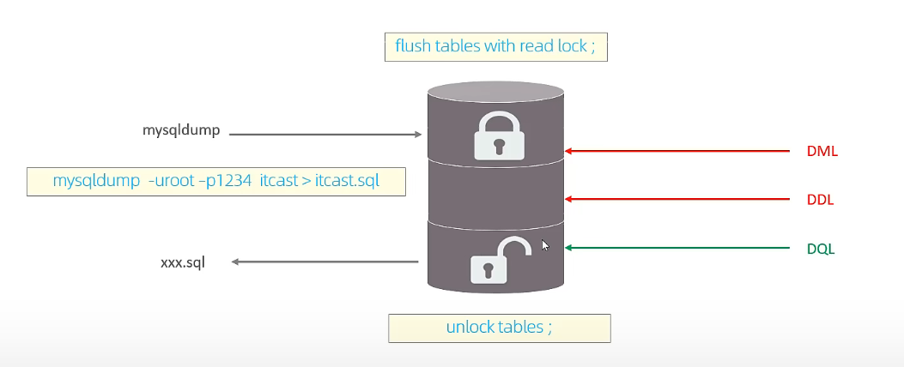

~~~sql
-- 加上全局锁
flush tables with read lock;

-- 备份
mysqldump -用户名 -密码 数据库 > 存放到哪个sql文件中;

-- 释放锁
unlock tables;
~~~

#### 7.2.2 演示

- 客户端1

~~~sql
-- 加上全局锁
flush tables with read lock;
~~~

- 客户端2

~~~sql
select * from user;				-- 可以正常查询数据
delete from user where sno = '10004';       -- 删除会阻塞
~~~

- 客户端3

~~~sql
-- 数据备份
mysqldump -h 192.168.233.234 -uroot -plzy123456 demo > D:/demo.sql;
~~~

- 客户端1

~~~sql
-- 释放锁
unlock tables;
~~~

- 客户端2

~~~sql
delete from user where sno = '10004';       -- 删除不会阻塞
~~~

#### 7.2.3 特点

- 数据库加全局锁，是一个比较重的操作，存在以下问题：
  - 如果在主库上备份，那么在备份期间都不能执行更新，业务基本上就得停摆
  - 如果在从库上备份，那么在备份期间从库不能执行主库同步过来的二进制日志（binlog），会导致主从延迟
- 在InnoDB引擎中，我们可以在备份时加上参数 --single-transaction 参数来完成不加锁的一致性数据备份

~~~sql
-- 备份
mysqldump --single-transaction -用户名 -密码 数据库 > 存放到哪个sql文件中;
~~~

### 7.3 表级锁

#### 7.3.1 表锁

- 表级锁，每次操作锁住整张表。锁定粒度大，发生锁冲突的概率最高，并发度最低。应用在MyISAM、InnoDB、BDB等存储引擎中

- 对于表级锁，主要分为以下三类

  - 表锁
  - 元数据锁（meta data lock，MDL）
  - 意向锁

- 对于表锁，分为两类

  - 表共享读锁（read lock）：当前客户端可以读，但是不可以写；其他客户端也可以读，但是不可写

  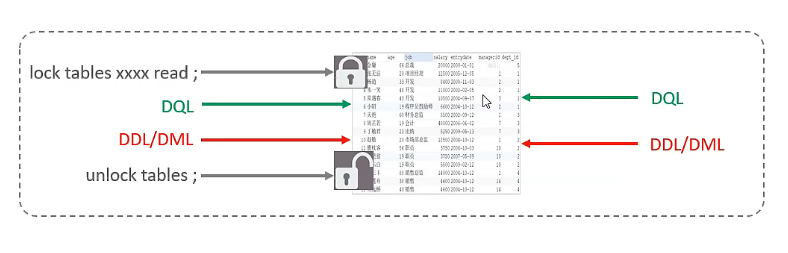

  - 表独占写锁（write lock）：当前客户端可读也可写；其他客户端不可读也不可写

  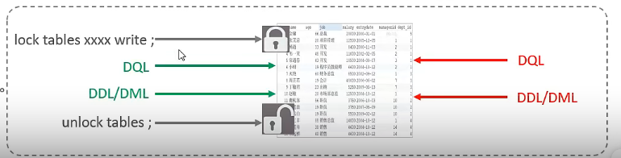

- 语法

~~~sql
-- 加锁
lock tables 表名... read/write;
-- 释放锁
unlock tables / 客户端断开连接	
~~~

- 客户端1

~~~sql
-- 给user表加上锁
lock tables user read;

select * from user;			-- 查询可以正常
update user set name = 'las' where sno = '10003';			-- 更新不可用，因为加上了锁

-- 释放锁
unlock tables：
~~~

- 客户端2

~~~sql
select * from user;			-- 查询可以正常
update user set name = 'las' where sno = '10003';			-- 更新不可用，因为加上了锁
~~~

#### 7.3.2 元数据锁

- MDL加锁过程是系统自动控制，无需显示使用，在访问一张表的时候会自动加上。
- MDL锁主要作用是维护表**元数据（表结构）**的数据一致性，在表上有活动事务的时候，不可以对**元数据（表结构）**进行写入操作
- **为了避免DML和DDL冲突，保证读写的正确性**
- 在MySQL5.5中引入了MDL，当对一张表进行增删改查的时候，加MDL读锁（共享）；当对表结构进行变更操作的时候，加MDL写锁（排他）
- 查看元数据锁

~~~sql
select object_type, object_schema, object_name, lock_type, lock_duration from performance_schema.metadata_locks; 
~~~

|                    对应SQL                    |                 锁类型                  |                       说明                       |
| :-------------------------------------------: | :-------------------------------------: | :----------------------------------------------: |
|          lock tables xxx read/write           | SHARED_READ_ONLY / SHARED_NO_READ_WRITE |                                                  |
|    select 、select ... lock in share mode     |               SHARED_READ               | 与SHARED_READ、SHARED_WRITE兼容，与EXCLUSIVE互斥 |
| insert、update、delete、select ... for update |              SHARED_WRITE               | 与SHARED_READ、SHARED_WRITE兼容，与EXCLUSIVE互斥 |
|                alter table ...                |                EXCLUSIVE                |                与其他的MDL都互斥                 |

- 客户端1

~~~sql
-- 开启事务
begin;

-- 使用select语句，会自动添加SHARED_READ锁
select * from user;

-- 提交事务
commit;
~~~

- 客户端2

~~~sql
-- 开启事务
begin;

-- 第一个事务没提交，可以查询，修改、新增等，因为SHARED_WRITE和SHARED_READ不互斥
select * from user;
-- 但是不能使用alter，因为SHARED_READ和SHARED_READ互斥，此时会阻塞
alter table user add column score int;

-- 提交事务
commit;
~~~

#### 7.3.3 意向锁

- 为了避免DML在执行时，加的行锁和表锁的冲突，在InnoDB中引入了意向锁，使得表锁不用检查每行数据是否加锁，使用意向锁来减少表锁的检查
- 意向锁分为两类
  - 意向共享锁（IS）：由语句select ... lock in share mode添加，与表锁共享锁（read）兼容，与表锁排他锁（write）互斥
  - 意向排他锁（IX）：由insert、update、delete、select ... for update添加，与表锁共享锁（read）及排他锁（write）都互斥。意向锁之间不会互斥
- 根据以下SQL可以查询意向锁及行锁的加锁情况

~~~sql
select object_schema, object_name, index_name, lock_type, lock_mode, lock_data from performance_schema.metadata_locks; 
~~~

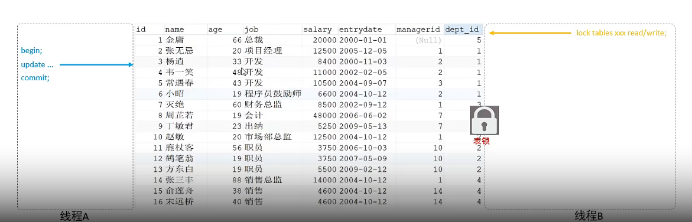

- 演示客户端1

~~~sql
-- 开启事务
begin;

-- 查询语句加锁
select * from user where sno = '10001' lock in share mode;
~~~

- 客户端2

~~~sql
select object_schema, object_name, index_name, lock_type, lock_mode, lock_data from performance_schema.metadata_locks; 
~~~

### 7.4 行级锁

#### 7.4.1 介绍

- 行级锁：每次操作锁住对应的行数据。锁度粒度最小，发生锁冲突的概率最低，并发度最高。应用在InnoDB存储引擎中
- InnoDB的数据是基于索引组成的，行锁是通过对索引上的索引项加锁来实现的，而不是对记录加的锁。
- 行级锁主要分类
  - 行锁：锁定单个行记录的锁，防止其他事务对此进行update和delete。在RC、RR隔离级别下都支持
  - 间隙锁：锁定索引记录间隙（不含该记录），确保索引记录间隙不变，防止其他事务在这个间隙进行insert，产生幻读。在RR隔离界别下都支持
  - 临键锁：行锁和间隙锁组合，同时锁住数据，并锁住数据前面的间隙Gap。在RR隔离级别下支持

#### 7.4.2 行锁

- InnoDB实现了以下两种类型的行锁
  - 共享锁（S）：允许一个事务去读一行，阻止其他事务获得相同数据集的排他锁
  - 排他锁（X）：允许获取排他锁的事务更新数据，阻止其他事务获得相同数据集的共享锁和排他锁

|        | 共享锁 | 排他锁 |
| :----: | :----: | :----: |
| 共享锁 |  兼容  |  冲突  |
| 排他锁 |  冲突  |  冲突  |

|              SQL              |  行锁类型  |                   说明                   |
| :---------------------------: | :--------: | :--------------------------------------: |
|            insert             |   排他锁   |                 自动加锁                 |
|            update             |   排他锁   |                 自动加锁                 |
|            delete             |   排他锁   |                 自动加锁                 |
|            select             | 不加任何锁 |                                          |
| select ... lock in share mode |   排他锁   | 需要手动在select之后加lock in share mode |
|     select .. for update      |   排他锁   |     需要手动在select之后加for update     |

