# 一、题一（数据流图）

## 1、基本概念

- 数据流图（DFD）基础
  - 数据流图也称数据流程图（Data Flow Diagram，DFD），是一种便于用户理解、分析系统数据流程的图形工具。它摆脱了系统的物理内容，精确地在逻辑上描述系统的功能、输入、输出和数据存储等，是系统逻辑模型的重要组成部分。

### 1.1 数据流图的基本图形元素

- 数据流图中的基本图形元素包括：

  - **数据流（Data Flow）**

  - **加工（Process）**

  - **数据存储（Data Store）**

  - **外部实体（External Agent）**

- 其中，数据流、加工和数据存储用于构建软件系统内部的数据处理模型；外部实体表示存在于系统之外的对象，用来帮助用户理解系统数据的来源和去向

| 元素     | 图形符号                                                     | 说明                                   |
| -------- | ------------------------------------------------------------ | -------------------------------------- |
| 外部实体 | 矩形**（通常以E出现）**             | 表示系统之外的对象，是数据的来源或去向 |
| 加工     | 圆角矩形 / 圆形**（通常以P出现）**  | 表示对数据进行处理和变换的操作         |
| 数据存储 | 两条平行线 / 右侧开口的矩形**（通常以D出现）** | 表示数据的保存场所                     |
| 数据流   | 带箭头的直线**（箭头侧是终点，反向是起点）** | 表示数据的流动方向和内容               |

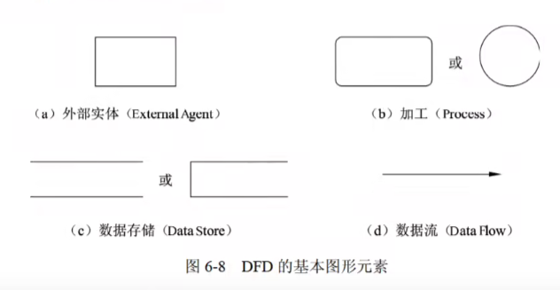

### 1.2 外部实体

- **符号**：矩形框
- **定义**：指当前系统之外的人、物、外部系统，是数据的来源或最终去向。

- 分类及示例

  - **人**：学生、老师、员工、主管、医生、客户、供应商……

  - **物**：传感器、控制器、单车、车辆、采购部门……

  - **外部系统**：支付系统、车辆交易系统、库存管理系统、道闸控制系统……

### 1.3 数据存储

- **符号**：右侧开口的矩形（或两条平行线）

- **核心作用**：存储数据和提供数据，具体为**存储加工的输出数据**，并为后续加工**提供输入数据**

- **典型例子**：客户表、订单表、学生表、巴士列表文件、维修记录文件、课表文件

### 1.4 加工

- **定义**：将输入数据处理后得到输出数据。

- **基本规则**：一个加工至少有一个输入数据流和一个输出数据流。

- **异常情况**：

  - **黑洞**：加工只有输入、没有输出。

  - **白洞**：加工只有输出、没有输入。

  - **灰洞**：加工的输入数据不足以产生输出数据。

### 1.5 数据流

- 数据流由一组固定成分的数据组成，表示数据的流向。在 DFD 中，数据流的流向可以有以下几种：

  - 从一个加工流向另一个加工

  - 从加工流向数据存储（写操作）

  - 从数据存储流向加工（读操作）

  - 从外部实体流向加工（输入）

  - 从加工流向外部实体（输出）

- **数据流的起点或终点必须有一个是加工**

## 2、问题1

- 问题样例
  - 使用说明中的词语，给出图 1-1 中的实体 E1～E3 的名称。
  - 使用说明中的词语，给出图 1-1 中的实体 E1～E5 的名称。
  - 根据说明中的词语，给出图 1-1 中的实体 E1～E2 的名称。

- **一般是让列出几个E，即外部实体的名称**
- **如何做：找当前系统之外的人、物、外部系统，是数据的来源或最终去向**

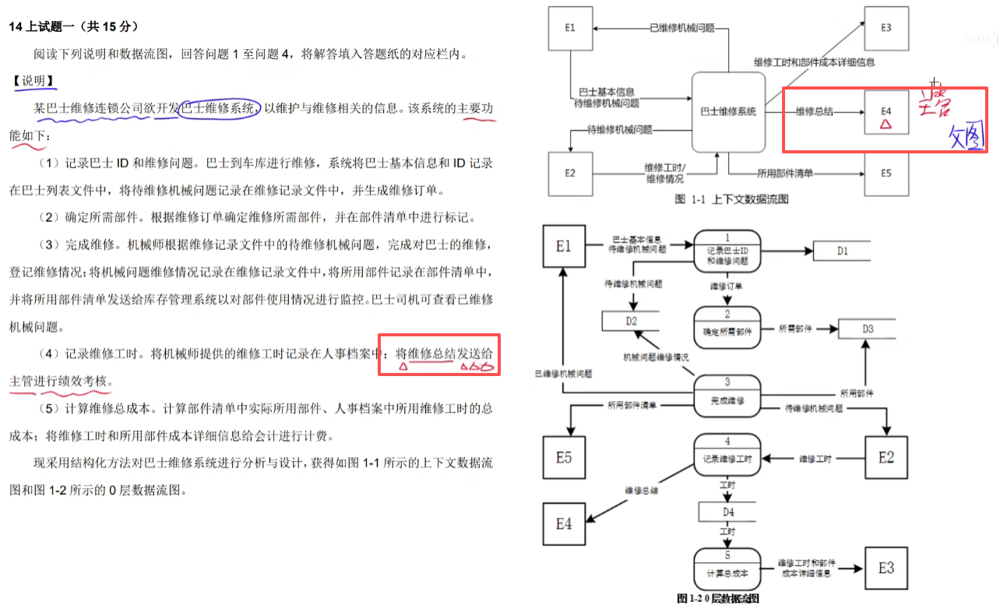

### 2.1 例题1

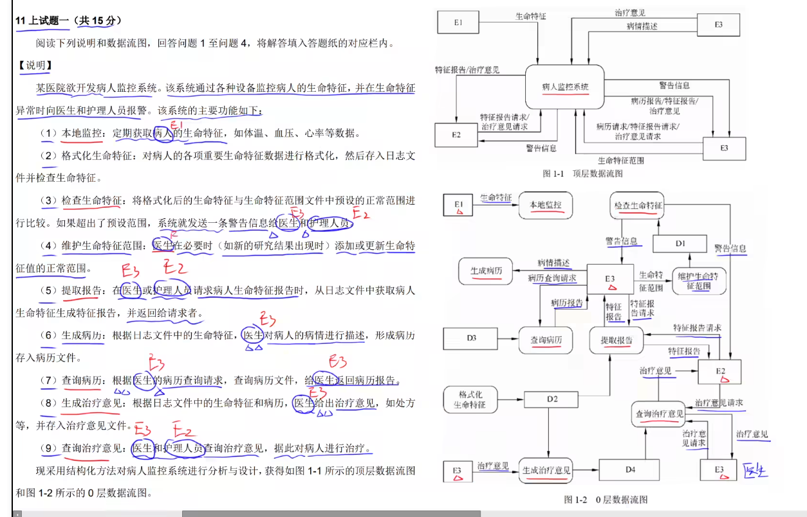

- E1：病人
- E2：护理人员
- E3：医生

### 2.2 例题2

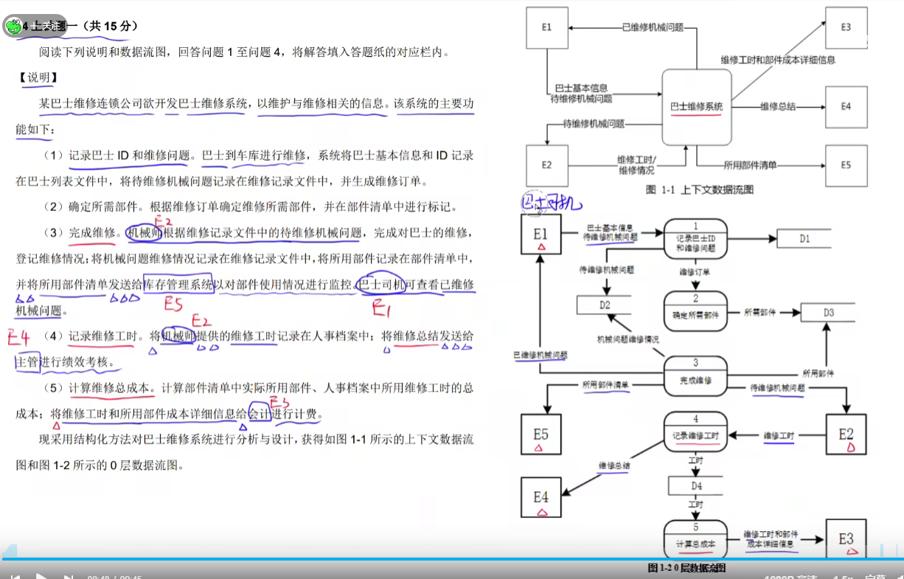

- E1：巴士司机
- E2：机械师
- E3：会计
- E4：主管
- E5：库存管理系统

### 2.3 例题3

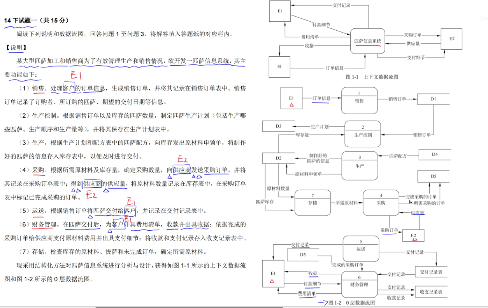

- E1：客户
- E2：供应商

## 3、问题2

- 问题样例
  - 使用说明中的词语，给出图 1-2 中的数据存储 D1～D4 的名称。
  - 使用说明中的词语，给出图 1-2 中的数据存储 D1～D4 的名称。
  - 根据说明中的词语，给出图 1-2 中的数据存储 D1～D5 的名称。

- **一般是让列出几个D，即数据存储的名称**
- **如何做：找各种表和文件**

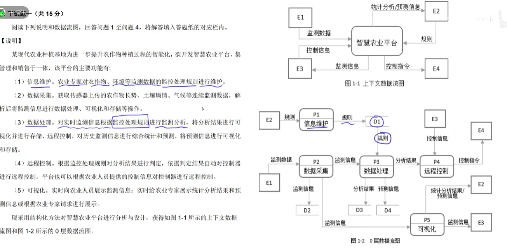

### 3.1 例题1

- D1：生命特征范围文件
- D2：日志文件
- D3：病例文件
- D4：治疗意见文件

### 3.2 例题2

- D1：巴士列表文件
- D2：维修记录文件
- D3：部件清单
- D4：人事档案

### 3.3 例题3

- D1：销售订单表
- D2：库存表
- D3：生产计划表
- D4：配方表
- D5：采购订单表

## 4、问题3

- 问题样例
  - 根据说明和图中术语，补充图 1-2 中缺失的数据流及其起点和终点（三条即可）
  - 图 1-2 中缺失了 4 条数据流，使用说明、图 1-1 和图 1-2 中的术语，给出数据流的名称及其起点和终点。
  - 根据说明和图中词语，补充图 **1-2** 中缺失的数据流及其起点和终点。

- **一般是让补充数据流的信息**

### 4.1 做题方法

####  4.1.1 父图子图平衡

- **将父图中的出现的在子图中找，如果有，就划掉；剩余的就是缺失的**
- 样例1：父图有：维修情况，子图没有

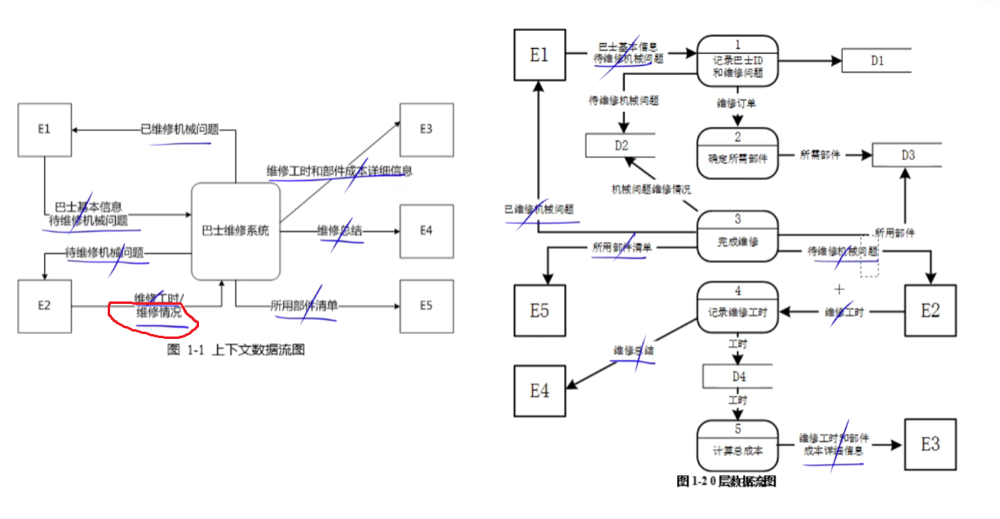

- 样例2：父图有：支付细节，子图没有

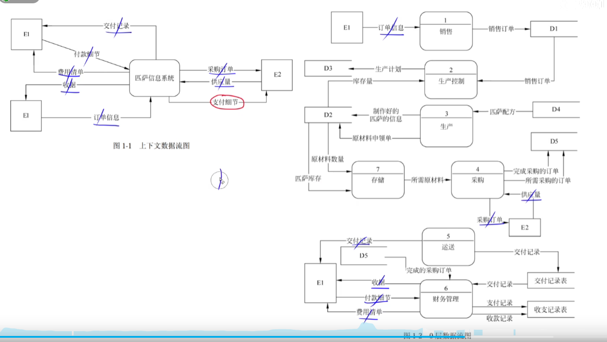

#### 4.1.2 加工既有输入数据流也有输出数据流

- **一个加工既有输入数据流也有输出数据流**
- 样例1：完成维修只有数据输出流，没有数据输入流

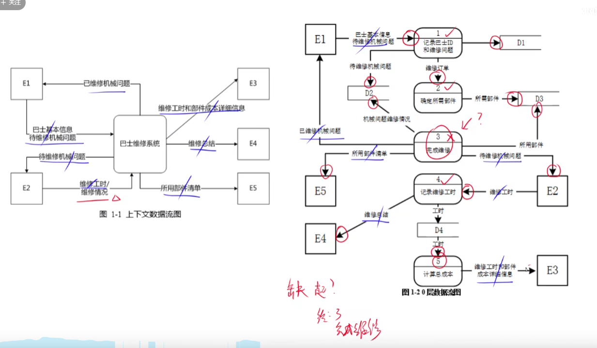

- 样例2：运送只有数据输出流，没有数据输入流

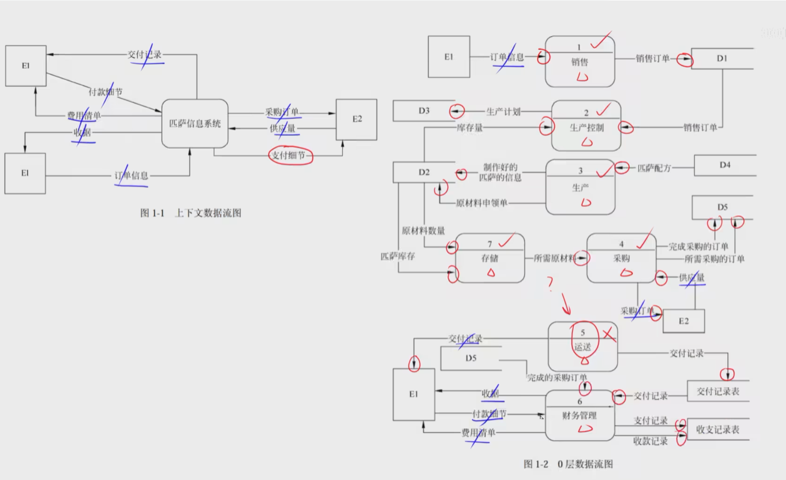

#### 4.1.3 数据守恒

- **根据左边的文字做阅读理解，有几个功能，就有几个加工；然后根据每个加工的做的事去右边对应的图对应，排除选项**

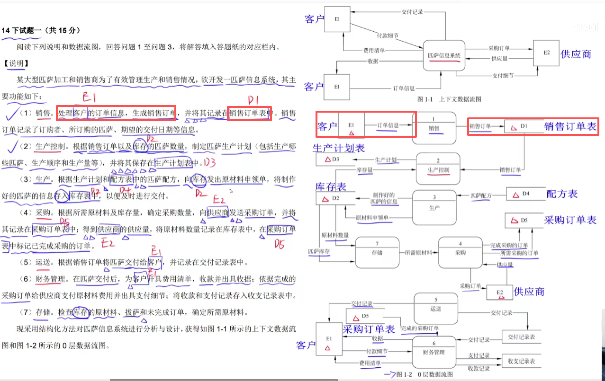

### 4.2 答题格式与注意事项

- 注意

  - **数据流的起点或重点一定要有一头是加工**

  - **箭头上的文字是数据流名称**

- 答题格式
  - 数据流名称
  - 起点
  - 终点
- 注意：**起点和终点保持一致，要么全写编号，要么全写中文，不要一个编号一个中文**

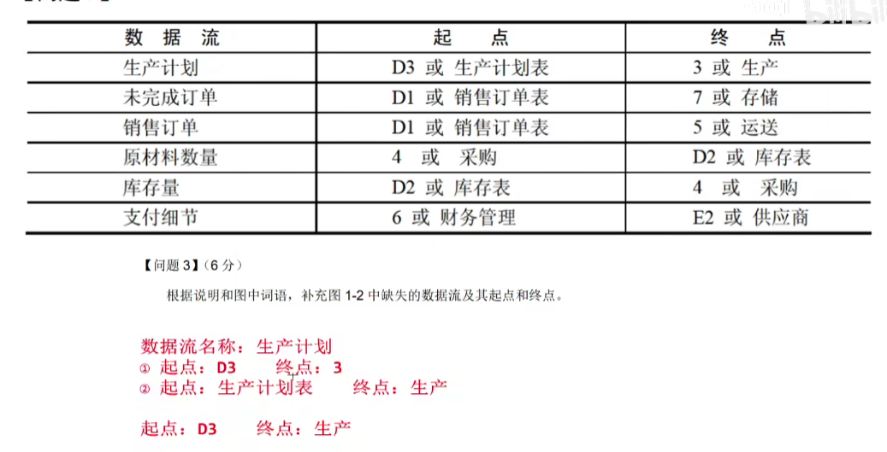

### 4.3 例题1

- 问题：图1-2中缺失了4条数据流，使用说明、图1-1和1-2中的术语，给出数据流的名称及其起点和终点
- 第一个
  - 数据流名称：重要生命体征
  - 起点：1（本地监控）
  - 终点：2（格式化生命体征）
- 第二个
  - 数据流名称：格式化后的生命特征 
  - 起点：D2（日志文件）
  - 终点：3（检查生命特征）
- 第三个
  - 数据流名称：存入病历文件
  - 起点：6（生成病历）
  - 终点：D3（病历文件）
- 第四个
  - 数据流名称：病历
  - 起点：（生成病历）
  - 终点：（病历文件）

# 二、题二（数据库）

## 1、基本概念

### 1.1 ER图

- 在 E-R 模型中，实体用矩形表示，通常矩形框内写明实体名。实体是现实世界中可以区别于其他对象的 “事件” 或 “物体”。例如，企业中的每个人都是一个实体。每个实体由一组特性（属性）来表示，其中的某一部分属性可以唯一标识实体，例如职工实体集中的职工号。实体集是具有相同属性的实体集合。例如，学校的所有教师具有相同的属性，因此教师的集合可以定义为一个实体集；学生具有相同的属性，因此学生的集合可以定义为另一个实体集

  - 矩形：实体

  - 椭圆：属性

  - 菱形：联系

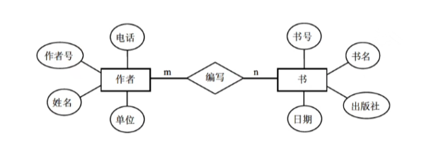

### 1.2 弱实体

- 在现实世界中有一种特殊的联系，这种联系代表实体间的所有（Ownership）关系，例如职工与家属的联系，家属总是属于某职工的。这种实体对于另一些实体具有很强的依赖关系，即一个实体的存在必须以另一个实体为前提，将这类实体称为**弱实体**。

- 在扩展的 E-R 图中，弱实体用**双线矩形框**表示。

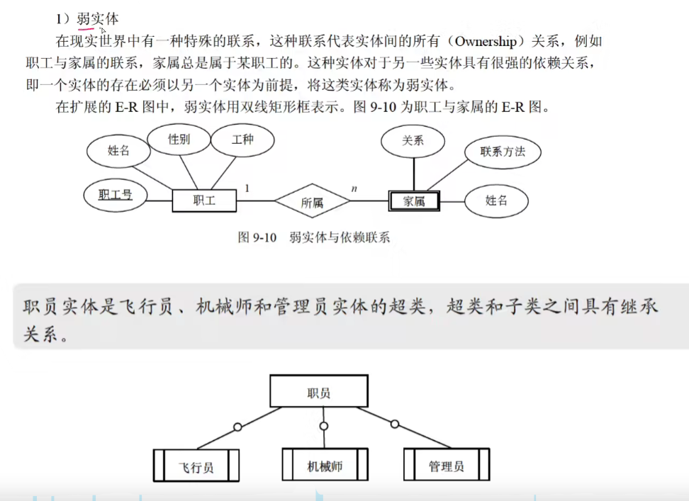

### 1.3 属性

- 属性是实体某方面的特性。例如，职工实体集具有职工号、姓名、年龄、参加工作时间和通信地址等属性。每个属性都有其取值范围，例如职工号为 000001～999999 的 6 位整型数，姓名为 10 位的字符串，年龄的取值范围为 18～60 等。在同一实体集中，每个实体的属性及其域是相同的，但可能取不同的值。E-R 模型中的属性有以下分类：

1. **简单属性和复合属性**

   简单属性是原子的、不可再分的，复合属性可以细分为更小的部分（即划分为别的属性）。有时用户希望访问整个属性，有时希望访问属性的某个成分，那么在模式设计时可采用复合属性。例如，职工实体集的通信地址可以进一步分为邮编、省、市、街道。若不特别声明，通常指的是简单属性。

2. **单值属性和多值属性**

   在前面所举的例子中，定义的属性对于一个特定的实体都只有单独的一个值。例如，对于一个特定的职工，只对应一个职工号、职工姓名，这样的属性称为单值属性。但是，在某些特定情况下，一个属性可能对应一组值。例如，职工可能有 0 个、1 个或多个亲属，那么职工的亲属的姓名可能有多个数目，这样的属性称为多值属性。

3. **NULL 属性**

   当实体在某个属性上没有值或属性值未知时，使用 NULL 值，表示无意义或不知道。

4. **派生属性**

   派生属性可以从其他属性得来。例如，职工实体集中有 “参加工作时间” 和 “工作年限” 属性，那么 “工作年限” 的值可以由当前时间和参加工作时间得到。这里，“工作年限” 就是一个派生属性

### 1.4 联系

- 两个实体之间的联系

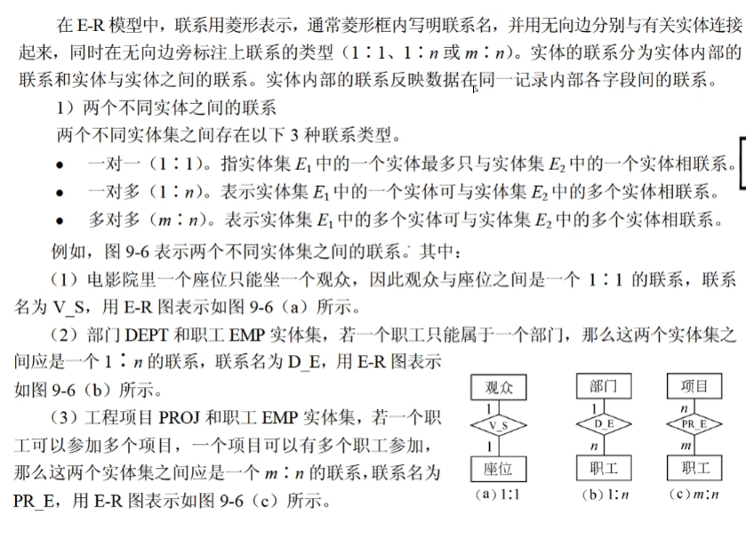

- 两个以上不同实体集之间的联系

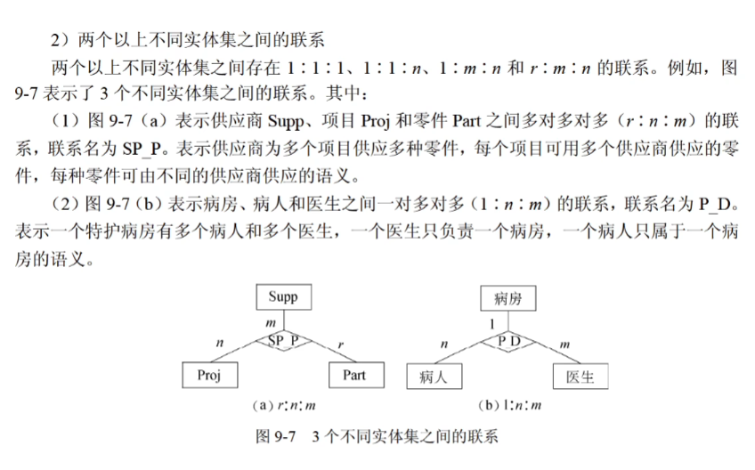

