# 一、计组

## 1、进制转化

| 进制         | 数码                | 基数 |   位权    |
| ------------ | ------------------- | ---- | :-------: |
| 十进制 (D)   | 0,1,2,3,4,5,6,7,8,9 | 10   | 10的k次方 |
| 二进制 (B)   | 0,1                 | 2    | 2的k次方  |
| 八进制 (O)   | 0,1,2,3,4,5,6,7,    | 8    | 8的k次方  |
| 十六进制 (H) | 0~9,A,B,C,D,E,F     | 16   | 16的k次方 |

- 十进制：逢十进位，没有单独的字符表示十。
- 提示
  - 小数点左边的位权阶数 k 从 0 开始，右边的位权阶数 k 从 - 1 开始。 比如十进制数 123.123D。
    - 比如小数点左边的123，分别就是10的2次方、10的1次方和10的0次方
    - 比如小数点右边的123，分别就是10的 -1 次方、10的 -2 次方和10的 -3 次方
  - 十六进制只需记忆 A（10）和 F（15）


### 1.1 R进制转十进制（按权展开法）

- R 进制转十进制使用按权展开法，其具体操作方式为：将 R 进制数的每一位数值用R的k次方形式表示，即幂的底数是 R，指数为 k，k 与该位和小数点之间的距离有关。当该位位于小数点左边，k 值是该位和小数点之间数码的个数，而当该位位于小数点右边，k 值是负值，其绝对值是该位和小数点之间数码的个数加 1。
  - 通俗理解：<font color="red">**把每一位的数和当前位的权值相乘后的结果累加起来。**</font>
  - 例子
    - 二进制转十进制
      - 111(B) = 1 * 2的2次方 + 1 * 2的1次方 + 1 * 2的0次方 = 4 + 2 + 1 = 8(D)
      - 10100.01(B) = 1 * 2的4次方 + 1 * 2的2次方 + 1 * 2的-2次方 = 16 + 4 + 0.25 = 20.25(D)
    - 八进制转十进制
      - 604(O) = 6 * 8的2次方 + 4 * 8的0次方 = 384 + 4 = 388(D)


### 1.2 **十进制转R进制（短除法）**

- 循环除基直到商到0，从下往上取余数

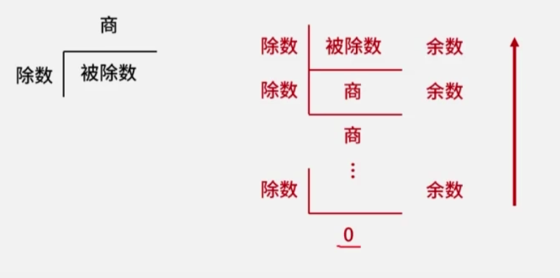

- 例子

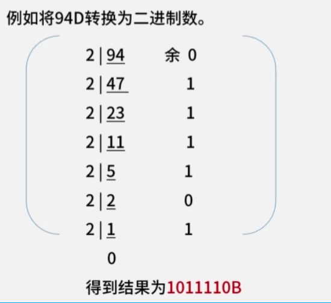


### 1.3 十进制转二进制（凑位权法）

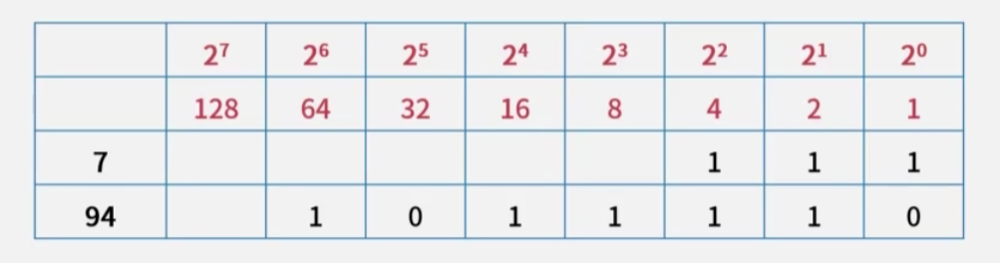

- 192(D) = 128 + 64 = 1100 0000(B)


### 1.4 二进制转八进制和十六进制

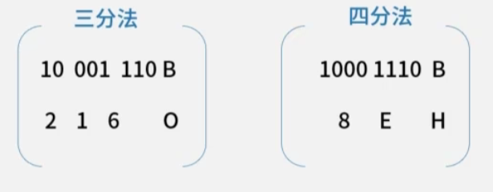

- 八进制的8正好对应2的三次方，十六进制的16正好对应2的四次方，所以二互转八将三个数字分为一组（从右到左），二互转十六将四个数字分为一组（从右往左）
- 例子
  - 31B5(H) = 0011 0001 1011 0101(B)


## 2、码制

### 2.1 码制转换

- **原码**：最高位是符号位，其余低位表示数值的绝对值，<font color="red">**直接表示该数据**</font>（0 表示正数，1 表示负数）

- **反码**：<font color="red">**正数的反码与原码相同**</font>，负数的反码是在负数原码基础上数值位取反（符号位不变）

- **补码**：<font color="red">**正数的补码与原码相同**</font>，负数的补码是在负数反码基础上末位补 1（符号位参与运算）

- **移码**：无论正负数，都是把补码的<font color="red">**符号位取反**</font>

|          | 数值 + 1         | 数值 - 1         | (+1) + (-1)         |
| -------- | ---------------- | ---------------- | ------------------- |
| **原码** | `0000 0001`      | `1000 0001`      | `1000 0010` = -2(D) |
| **反码** | `0000 0001` 同上 | `1111 1110` 绝反 | `1111 1111` = -0(D) |
| **补码** | `0000 0001` 同上 | `1111 1111` 补一 | `0000 0000` = 0(D)  |
| **移码** | `1000 0001` 符反 | `0111 1111` 符反 | `1000 0000` = 0(D)  |

- 注：<font color = "red">**补码和移码中， ±0 编码相同。**</font>

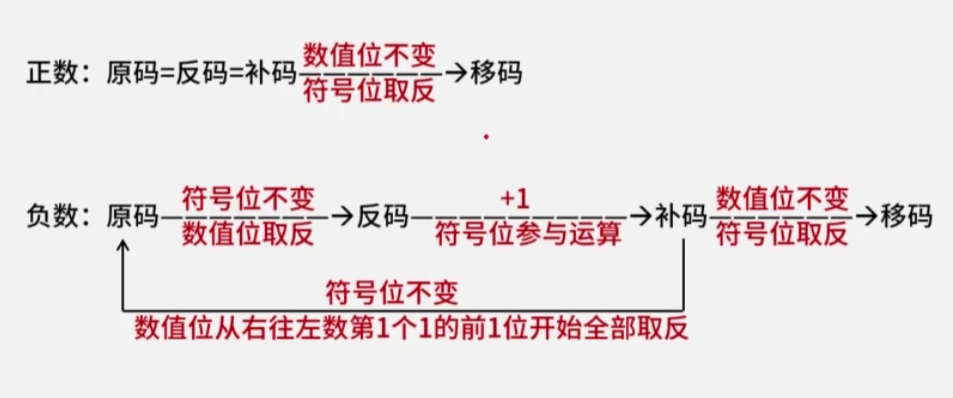

- 真题："2X"的补码是"90H"，那么X的真值是多少
  - 第一步：补码 = 90H = 1001 0000(B)
  - 第二步：原码为，数值位从右往左数第一个1前一位开始全部取反，即：第二位、第三位取反，为：1111 0000(B)
    - 验证：
      - 反码(符号位不变，其余取反)：1000 1111(B)
      - 补码(反码+1)：1001 0000(B)
  - 第三步：1111 0000(B) = - (64 + 32 + 16) (D)= -112(D)
  - 第四步：X = -112 / 2 = -56


### 2.2 定点整数表示范围

- 示例说明（n=4，共 4 个数位）

  - 转为二进制：`1111 ~ 0111`

  - 对应十进制范围：`-7 ~ +7`

  - 原码表示范围公式：`-(2^(n-1)-1) ~ +(2^(n-1)-1)`

  - <font color="red">**重点：补码和移码可以达到`-2^(n-1)`**</font>

| 码制 | 定点整数表示范围              | 数码个数  |
| ---- | ----------------------------- | --------- |
| 原码 | `-(2^(n-1)-1) ~ +(2^(n-1)-1)` | `2^n - 1` |
| 反码 | `-(2^(n-1)-1) ~ +(2^(n-1)-1)` | `2^n - 1` |
| 补码 | `-2^(n-1) ~ +(2^(n-1)-1)`     | `2^n`     |
| 移码 | `-2^(n-1) ~ +(2^(n-1)-1)`     | `2^n`     |

- 补充说明：公式中n为二进制数的总位数（包含符号位），以n=4为例：

  - 原码 / 反码：`-(2^(4-1)-1) = -7` 到 `+(2^(4-1)-1) = +7`，共`2^4 - 1 = 15`个有效编码（±0 重复）

  - 补码 / 移码：`-2^(4-1) = -8` 到 `+(2^(4-1)-1) = +7`，共`2^4 = 16`个唯一编码（0 的编码唯一，多表示一个最小值 - 8）

  - 补码 / 移码能多表示一个负数最小值，是计算机中补码作为整数存储标准的核心原因。

- 为什么补码和移码能多表示一个 `-2^(n-1)`？

  - 核心原因：<font color="red">**原码 / 反码存在「+0」和「-0」两个重复的 0 编码，浪费了 1 个编码空间；而补码 / 移码的 0 编码唯一，空出的编码刚好用来表示最小负数 `-2^(n-1)`**</font>

  - 以 `n=4`（4 位二进制，1 位符号位 + 3 位数值位）为例：

    - 原码的编码情况

      - 符号位规则：`0` 表示正数，`1` 表示负数
      - 正数编码：`0000(+0)`、`0001(+1)`、`0010(+2)`、`0011(+3)`、`0100(+4)`、`0101(+5)`、`0110(+6)`、`0111(+7)`
      - 负数编码：`1000(-0)`、`1001(-1)`、`1010(-2)`、`1011(-3)`、`1100(-4)`、`1101(-5)`、`1110(-6)`、`1111(-7)`
      - 问题出现了：`0000` 和 `1000` 都表示「0」，**两个编码对应同一个数值**，相当于浪费了 1 个编码位置。因此 4 位原码只能表示 `-7 ~ +7`，共 `2^4 - 1 = 15` 个不同数值。

    - 反码的编码情况

      - 正数反码 = 原码，负数反码 = 原码数值位取反、符号位不变
      - 正数编码：`0000(+0)`、`0001(+1)`...`0111(+7)`（和原码完全一致）
      - 负数编码：`1111(-0)`、`1110(-1)`、`1101(-2)`...`1000(-7)`
      - 同样的问题：`0000(+0)` 和 `1111(-0)` 两个编码都表示 0，再次浪费 1 个编码，范围同样是 `-7 ~ +7`，共 15 个数值。

    - 补码的编码情况

      - 正数补码 = 原码，负数补码 = 负数反码基础上末位补 1
      - 正数编码：`0000(+0)`、`0001(+1)`...`0111(+7)`（和原码完全一致）
      - 负数编码：

      ~~~bash
      -1：原码1001 → 反码1110 → 补码1111
      -2：原码1010 → 反码1101 → 补码1110
      ...
      -7：原码1111 → 反码1000 → 补码1001
      ~~~

      - 关键：-0 的补码计算
        - -0` 原码`1000` → 反码`1111` → 补码`1111 + 1 = 1 0000
        - 4 位二进制会**舍弃最高位的进位**，最终结果为 `0000`，和`+0`的补码完全一致！
      - 结果：补码中 0 的编码唯一（只有`0000`），原本`-0`占用的编码被空了出来，剩下`1000`这个编码没有对应数值。
      - <font color="red">我们把这个编码定义为**最小负数 `-2^(n-1)`**（n=4 时，`-2^(4-1) = -8`），因此补码的范围变成了 `-8 ~ +7`，共 `2^4 = 16` 个唯一数值，比原码 / 反码多了 1 个。</font>

    - 移码的编码情况

      - **移码 = 补码的符号位取反，数值位不变**
      - 补码的符号位：`0` 表示正数，`1` 表示负数
      - 移码的符号位：`1` 表示正数，`0` 表示负数（刚好取反）
      - <font color="red">结论：移码是补码的「符号位翻转版」，补码能表示 `-8`，移码自然也能表示 `-8`，范围和补码完全一致：`-2^(n-1) ~ +(2^(n-1)-1)`。</font>


### 2.3 定点小数表示范围

- 示例说明（n=4，共 4 个数位），小数点通常在符号位的后面，即：1号位是符号位，后面的234号位是小数值位
  - 二进制范围：`-0.111 ~ +0.111`
  - 原码表示范围公式：`-(1-2^-(n-1)) ~ +(1-2^-(n-1))`
    - 推导公式：
      - 0.111 + 0.001 = 1 => 0.111 = 1 - 0.001 => 0.111 = 1 - 2^-3
      - 即：最小数为 -(1-2^-(n-1))，n=4，那么就是 -(1-2^-(4-1)) = - (1-2^-3)
      - 最大数为 1-2^-(n-1)，n=4，那么就是 1-2^-(4-1) = 1-2^-3
  - <font color="red">**重点：补码和移码可以达到`-1.0`。**</font>

| 码制 | 定点小数表示范围                | 数码个数  |
| ---- | ------------------------------- | --------- |
| 原码 | `-(1-2^-(n-1)) ~ +(1-2^-(n-1))` | `2^n - 1` |
| 反码 | `-(1-2^-(n-1)) ~ +(1-2^-(n-1))` | `2^n - 1` |
| 补码 | `-1.0 ~ +(1-2^-(n-1))`          | `2^n`     |
| 移码 | `-1.0 ~ +(1-2^-(n-1))`          | `2^n`     |

- 同样的补码和移码多一位-1.0原因如下
  - 正数编码：`0000(+0)`、`0001(+1/8)`、`0010(+2/8)`、`0011(+3/8)`、`0100(+4/8)`、`0101(+5/8)`、`0110(+6/8)`、`0111(+7/8)`
  - 负数编码：
  
  ~~~bash
  -1/8：原码1001 → 反码1110 → 补码1111
  -2/8：原码1010 → 反码1101 → 补码1110
  ...
  -7/8：原码1111 → 反码1000 → 补码1001
  ~~~
  
  - 关键：-0 的补码计算
    - -0` 原码`1000` → 反码`1111` → 补码`1111 + 1 = 1 0000
    - 4 位二进制会**舍弃最高位的进位**，最终结果为 `0000`，和`+0`的补码完全一致！
  - 结果：补码中 0 的编码唯一（只有`0000`），原本`-0`占用的编码被空了出来，剩下`1000`这个编码没有对应数值。
  - <font color="red">我们把这个编码定义为**最小负数 `-1.0`**，因此补码的范围变成了 `-1.0 ~ +(1-2^-(n-1))`，比原码 / 反码多了 1 个。</font>

- 移码的编码情况

  - **移码 = 补码的符号位取反，数值位不变**

  - 补码的符号位：`0` 表示正数，`1` 表示负数

  - 移码的符号位：`1` 表示正数，`0` 表示负数（刚好取反）

  - <font color="red">结论：移码是补码的「符号位翻转版」，补码能表示 `-1.0`，移码自然也能表示 `-1.0`，范围和补码完全一致：`-1.0 ~ +(1-2^-(n-1))`。</font>


## 3、数据的表示

### 3.1 浮点数的表示

- 浮点数表示：
  - N = 尾数 * 基数 ^ 指数(阶)

- 运算过程：

  - **对阶 > 尾数计算 > 结果格式化**

  - 比如：1.23 ∗ 2 ^ 2 + 3.2 ∗ 2 ^ 4  ==> 0.0123 ∗ 2 ^ 4 + 3.2 * 2 ^ 4  = 3.2123 * 2 ^ 4 

- 特点：
  - 对阶时，**小数向大数看齐**，上述例子：将2变成4
  - 对阶是通过较小数的**尾数右移**实现的
  - 阶码的位数决定数的**表示范围**，位数越多范围越大
  - 尾数的位数决定数的有效**精度**，位数越多精度越高

- 例题

~~~bash
# 例题1
对于长度相同但格式不同的两种浮点数，假设前者阶码长、尾数短，后者阶码短、尾数长，其他规定都相同，则二者可表示数值的范围和精度情况为（C）。
A、二者可表示的数的范围和精度相同
B、前者所表示的数的范围更大且精度更高
C、前者所表示的数的范围更大但精度更低
D、前者所表示的数的范围更小但精度更高


# 例题2
某种机器的浮点数表示格式如下 (允许非规格化表示)。若阶码以补码表示，尾数以原码表示，则1 0001 0 0000000001表示的浮点数是（B）。
1位	 4位	      1位	    10位
阶符	阶码	数符（尾数正负）  尾数
A、2^−16 × 2^−10
B、2^−15 × 2^−10
C、2^-16 × (1−2^−10)
D、2^−15 × (1−2^−10)
# 解：
浮点数 = 尾数 * 基数 ^ 指数(阶)
1、在计算机中基数默认为2进制，所以基数为2
2、尾数是小数表示，所以0 0000000001这些都是小数部分，即0 0000000001(B)(原码) = 2^-10
3、阶数是整数表示，所以1 0001这些都是整数部分，1 0001(补码) -> 11111(原码) -> -15
综上：浮点数 = 2^-10 * 2^-15
~~~


## 4、算术与逻辑运算

- 逻辑变量之间的运算称为逻辑运算。二进制数**1 和 0**在逻辑上可以代表 **“真” 与 “假”**。
- 逻辑运算
  - **逻辑与（且）**
    - 符号：`&&`、`*`、`·`、`∩`、`∧`、AND
    - 规则：连接的两个逻辑值**全 1 时才取 1**
  - **逻辑或**
    - 符号：`||`、`+`、`∪`、`∨`、OR
    - 规则：连接的两个逻辑值**全 0 时才取 0*
  - **逻辑非**
    - 符号：`!`、`¬`、`～`、NOT、
    - 规则：将原逻辑值**取反即可**
  - **逻辑异或**
    - 符号：`⊕`、XOR
    - 规则：连接的两个逻辑值**不相同时才取 1，相同则取 0**
- 运算优先次序
  - <font color="red">**!（非）> &&（与） > ⊕（异或）> ||（或）**</font>

- 短路原则
  - 在逻辑表达式的求解中，并不是所有的逻辑运算符都要被执行。
    - `a&&b`：只有 a 为真时，才需要判断 b 的值。
    - `a||b`：只要 a 为真，就不必判断 b 的值，只有 a 为假，才判断 b。
  - 例子：
    - (m=a>b)&&(n=c>d)
    - 当 a=1，b=2，c=3，d=4，m 和 n 的原值为 1 时，由于 “a>b” 的值为 0，因此 m=0，而 n=“c>d” 不被执行。所以 n 的值不是 0 而仍保持原值 1。

- 例题

~~~bash
对布尔表达式进行短路求值是指：无须对表达式中所有操作数或运算符进行计算就可确定表达式的值。对于表达式 a or ((c<d) and b)，（B）时可进行短路计算。
A、d 为 true
B、a 为 true
C、b 为 true
D、c 为 true
~~~


## 5、校验码

### 5.1 奇偶校验码

- 奇偶校验码的编码方法是：由若干位有效信息（如一个字节），再加上一个二进制位（校验位）组成校验码。

  - **奇校验**：整个校验码（有效信息位和校验位）中 “1” 的个数为奇数。

  - **偶校验**：整个校验码（有效信息位和校验位）中 “1” 的个数为偶数。
- 例子：

  - 0 1001：校验码总共有偶数个1，如果为偶校验，那么此时校验位只能为0，这样加起来还是偶数个1，则为校验通过
  - 1 1001：校验码总共有偶数个1，如果为奇校验，那么此时校验位只能为1，这样加起来才是奇数个1，则为校验通过
- 奇偶校验，<font color="red">**可检查 （奇数个）的错误，不可纠错**。</font>

  - 例子
    - 1 1001：现在变成1 1101，那么有一位即奇数位变化了，有效信息中有三个奇数位，加上校验位的一位，就可以判定校验出错误了
    - 0 1001：现在变成0 1111，那么有两位即偶数位变化了，有效信息中有四个奇数位，加上校验位的0位，还是校验通过，但实际上已经变化了，所以校验不出来
- 例子

~~~bash
以下关于采用一位奇校验方法的叙述中，正确的是（C）。
A、若所有奇数位出错，则可以检测出该错误但无法纠正错误
B、若所有偶数位出错，则可以检测出该错误并加以纠正
C、若有奇数个数据位出错，则可以检测出该错误但无法纠正错误
D、若有偶数个数据位出错，则可以检测出该错误并加以纠正
# 解析
首先奇偶校验码不可纠错，所以排除BD，其次只能校验出奇数个数据位出错，而所有奇数位并不知道是否是奇数个还是偶数个，所以排除A，选C
~~~


### 5.2 CRC循环冗余校验码

- <font color="red">**可检查任意数的错，不可纠错**</font>

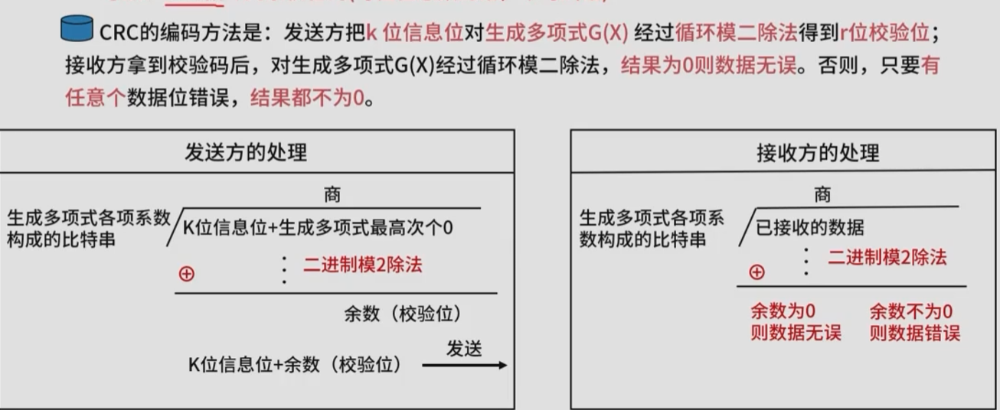

- 模二除法
  - 注意：<font color="red">**模二除法计算余数是用的异或**</font>
  - <font color="red">**生成被除数方法：数据位+多项式最高位的0个数**</font>，这里就是10110011 + 0000 = 101100110000
  - <font color="red">**生成除数方法：多项式系数组合**</font>，这里根据多项式生成为11001
  - <font color="red">**求余数为异或方式**</font>

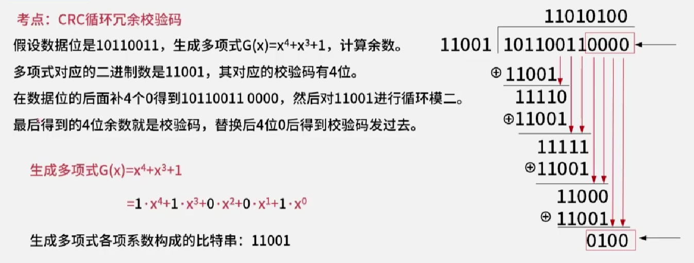


### 5.3 海明校验码

- <font color="red">**海明校验，可检任意数的错，也可纠错。**</font>
- 缺点：计算复杂。
- 海明校验码的原理是：在有效信息位中加入几个校验位形成海明码，使码距比较均匀地拉大，并把海明码的每个二进制位分配到几个奇偶校验组中。当某一位出错后，就会引起有关的几个校验位的值发生变化，这不但可以发现错误，还能指出错误的位置，为自动纠错提供了依据。
- 海明码校验位的数量公式：<font color="red">**2 ^ r ≥ m + r + 1**</font>。r 是校验位数量，m 是信息位数量。

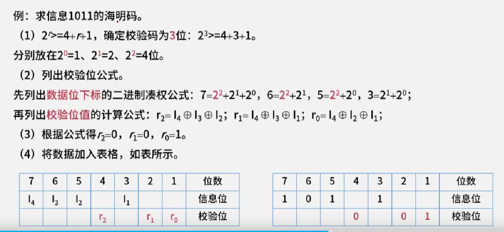

- 上述过程中第二步
  - 将<font color="red">**数据位下标凑权为二进制**</font>，I4的下标为7，7 = 4 + 2 + 1 = 2 ^ 2 + 2 ^ 1 + 2 ^ 0，I3的下标为6，6 = 4 + 2 = 2 ^ 2 + 2 ^ 1，I2的下标为5，5 = 4 + 1 = 2 ^ 2 + 2 ^ 0，I1的下标为3，3 = 2 + 1 = 2 ^ 1 + 2 ^ 0
  - <font color="red">**校验值求法**</font>：
    - r2在2 ^ 2的位置上，那么上面所有数据位中只要出现2 ^ 2的，就要拿来一起异或求值，即：I4 异或 I3  异或 I2，即：1 异或 0 异或 1 = 0
    - r1在2 ^ 1的位置上，那么上面所有数据位中只要出现2 ^ 1的，就要拿来一起异或求值，即：I4 异或 I3  异或 I1，即：1 异或 0 异或 1 = 0
    - r0在2 ^ 0的位置上，那么上面所有数据位中只要出现2 ^ 0的，就要拿来一起异或求值，即：I4 异或 I2  异或 I1，即：1 异或 1 异或 1 = 1
  - 所以最终海明码为：1010101
- 例题
  - 第一个空：2 ^ r >= m + r + 1，即：2 ^ r >= 32 + r +1，求得r = 6，选D
  - 第二个空：D5的下标为10 = 2 ^ 3 + 2 ^ 1，所以由第8位的P4和第2位的P1校验，选B

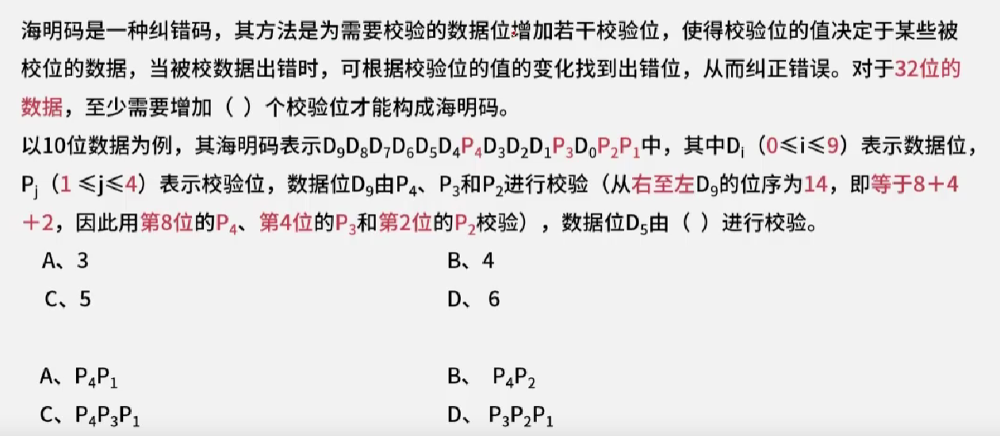


### 5.4 总结

|                      | 校验码位数             | 校验码位置       | 检错         | 纠错     | 校验方式                                                     |
| -------------------- | ---------------------- | ---------------- | ------------ | -------- | ------------------------------------------------------------ |
| **奇偶校验**         | 1                      | 一般拼接在头部   | 可检奇数个错 | 不可纠错 | 奇校验：最终 1 的个数是奇数个；偶校验：最终 1 的个数是偶数个； |
| **CRC 循环冗余校验** | 生成多项式最高次幂决定 | 拼接在信息位尾部 | 可检错       | 不可纠错 | 模二除法求余数，拼接作为校验位                               |
| **海明校验**         | 2r≥m+r+1               | 插入在信息位中间 | 可检错       | 可纠错   | 分组奇偶校验                                                 |


## 6、CPU的组成

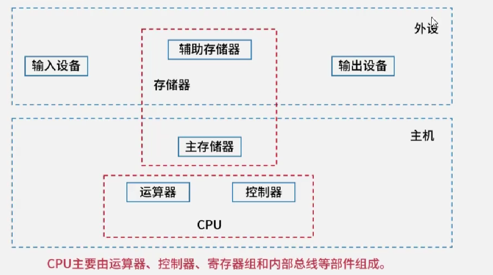

- <font color="red">**CPU主要由运算器、控制器、寄存器组和内部总线等部件组成**</font>
- 运算器部分
  - **算术逻辑单元 ALU**：数据的算术运算和逻辑运算
  - **累加寄存器 AC**：通用寄存器，为 ALU 提供一个工作区，用于暂存数据
  - **数据缓冲寄存器 DR**：写内存时，暂存指令或数据
  - **状态条件寄存器 PSW**：存状态标志与控制标志（争议：也有将其归为控制器的）
- 控制器部分
  - **程序计数器 PC**：存储下一条要执行指令的地址
  - **指令寄存器 IR**：存储即将执行的指令
  - **指令译码器 ID**：对指令中的操作码字段进行分析解释
  - **地址寄存器 AR**：保存当前 CPU 访问内存单元的地址
  - **时序部件**：提供时序控制信号

~~~bash
计算机执行指令的过程中，需要由（A）产生每条指令的操作信号并将信号送往相应的部件进行处理，以完成指定的操作。
A、CPU 的控制器
B、CPU 的运算器
C、DMA 控制器
D、Cache 控制器
~~~


## 15、可靠性


# 二、操作系统

## 1、简介

### 1.1 操作系统的功能

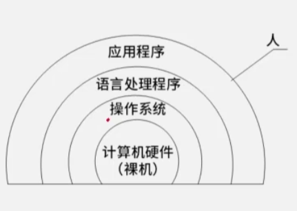

- 功能
  - 管理系统的硬件、软件、数据资源
  - 控制程序运行
  - 人机之间的接口
  - 应用软件与硬件之间的接口
- 五大管理功能
  - 进程管理
  - 存储管理
  - 文件管理
  - 设备管理
  - 作业管理
- 例题：选C

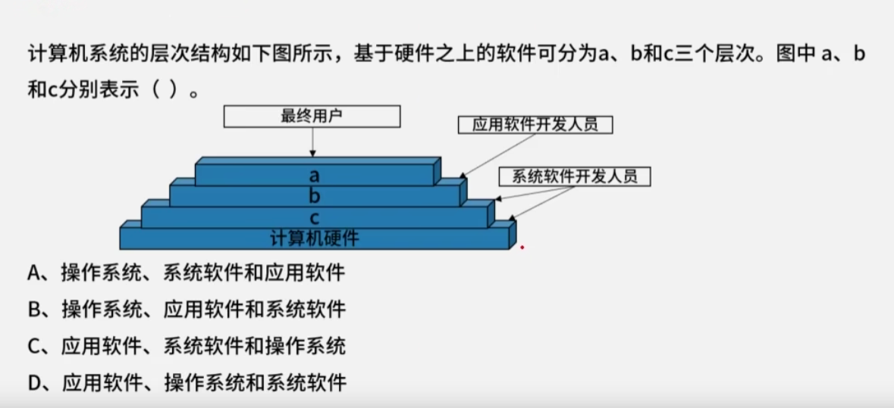


### 1.2 特殊的操作系统

- 操作系统分类及特点

| 分类           | 特点                                                         |
| -------------- | ------------------------------------------------------------ |
| 批处理操作系统 | 单道批：一次一个作业入内存，作业由程序、数据、作业说明书组成<br />多道批：一次多个作业入内存，特点：多道、宏观上并行微观上串行 |
| 分时操作系统   | 采用时间片轮转的方式为多个用户提供服务，每个用户感觉独占系统<br />特点：多路性、独立性、交互性和及时性 |
| 实时操作系统   | 分为实时控制系统和实时信息系统<br />交互能力要求不高，可靠性要求高（<font color="red">**规定时间内响应并处理**</font>） |
| 网络操作系统   | 方便有效共享网络资源，提供服务软件和有关协议的集合<br />主要的网络操作系统有：Unix、Linux 和 Windows Server 系统 |
| 分布式操作系统 | 任意两台计算机可以通过通信交换信息<br />是网络操作系统的更高级形式，具有透明性、可靠性和高性能等特性 |
| 微机操作系统   | Windows：Microsoft 开发的图形用户界面、多任务、多线程操作系统<br />Linux：免费使用和自由传播的类 Unix 操作系统，多用户、多任务、多线程和多 CPU 的操作系统 |
| 嵌入式操作系统 | 运行在智能芯片环境中<br />特点：微型化、**可定制**（针对硬件变化配置）、实时性、可靠性、**易移植性**（HAL 和 BSP 支持） |

- 例题

~~~bash
从减少成本和缩短研发周期考虑，要求嵌入式操作系统能运行在不同的微处理器平台上，能针对硬件变化进行结构与功能上的配置。该要求体现了嵌入式操作系统的（D）。
A、可定制性
B、实时性
C、可靠性
D、易移植性
~~~


## 2、进程与线程

### 2.1 进程

- **程序是由指令和数据组成，但这些指令要运行，数据要读写，就必须将指令加载至CPU，数据加载至内存**。在指令运行过程中还需要用到磁盘、网络等设备。**进程就是用来加载指令、管理内存、管理IO的**
- 当一个程序被运行，从磁盘加载这个程序的代码至内存，这时就开启了一个进程
- 进程就可以视为程序的一个实例。大部分程序可以同时运行多个实例进程（例如记事本、画图、浏览器等），也有的程序只能启动一个实例进程（例如网易云音乐、360安全卫士等）


### 2.2 线程

- 一个进程之内可以分为一到多个线程
- **一个线程就是一个指令流，将指令流中的一条条指令以一定的顺序交给CPU执行**
- Java中，**线程作为最小调度单位，进程作为资源分配的最小单位**，在windows中进程是不活动的，只是作为线程的容器


### 2.3 二者对比

- 进程基本上相互独立的，而线程存在于进程内，是进程的一个子集、
- 进程拥有共享的资源，如内存空间等，供其内部的线程共享
- 进程间通信较为复杂
  - 同一台计算机的进程通信为IPC（Inter-process communication）
  - 不同计算机之间的进程通信，需要通过网络，并遵守共同的协议，例如HTTP
- 线程通信相对简单，因为它们共享进程内的内存，一个例子是多个线程可以访问同一个共享变量
- 线程更轻量，线程上下文切换成本一般上要比进程上下文切换低


### 2.4 总结

- 进程与程序的区别：进程是程序的一次执行过程，没有程序就没有进程。
  - 程序是一个静态的概念，而进程是一个动态的概念，它由创建而产生，完成任务后因撤销而消亡。
- 进程是程序在一个数据集合上运行的过程，它是系统进行资源分配和调度的一个独立单位。它由程序块、数据块、进程控制块（PCB）三部分组成
- PCB：PCB 是进程存在的唯一标志。内容包含进程标识符、状态、位置信息、控制信息、队列指针（链接同一状态的进程）、优先级、现场保护区等。

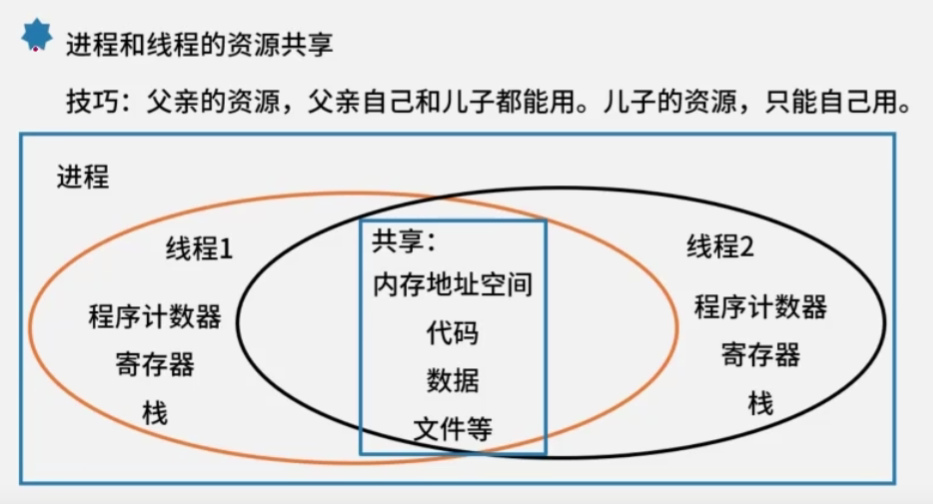

- 例题：选C

~~~bash
在支持多线程的操作系统中，假设进程 P 创建了 t1、t2、t3 线程，那么（C）。
A、该进程的代码段不能被 t1、t2、t3 共享
B、该进程的全局变量只能被共享
C、该进程中 t1、t2、t3 的栈指针不能被共享
D、该进程中 t1 的栈指针可以被 t2、t3 共享
~~~


## 3、进程的状态

- 【初始状态】：仅是在语言层面上创建了线程对象，还未与操作系统线程关联
- 【可运行状态】：（就绪状态）指该线程已经被创建（与操作系统线程关联），可以由CPU调度执行
- 【运行状态】：指获取了Cpu时间片运行中的状态
  - 当CPU时间片用完，会从【运行状态】转换至【可运行状态】，会导致线程的上下文切换
- 【阻塞状态】：**调度器不会考虑到把时间片分给它**
  - 如果调用了阻塞API，如BIO读写文件，这时该线程实际不会用到CPU，会导致上下文切换，进入【阻塞状态】
  - 等BIO操作完毕，会由操作系统唤醒阻塞的线程，转换至【可运行状态】
  - 与【可运行状态】的区别：对【阻塞状态】的线程来说，只要它们一直不唤醒，调度器就一直不会考虑调度它们
- 【终止状态】：线程已经执行完毕，生命周期已经结束，不会再转换为其他状态

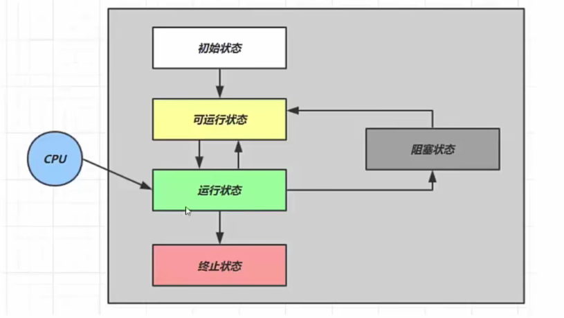

- 总结
  - 某一刻有且只有1个进程处于运行状态
  - 处于等待状态的进程得到所有资源后，不能立马进入运行状态

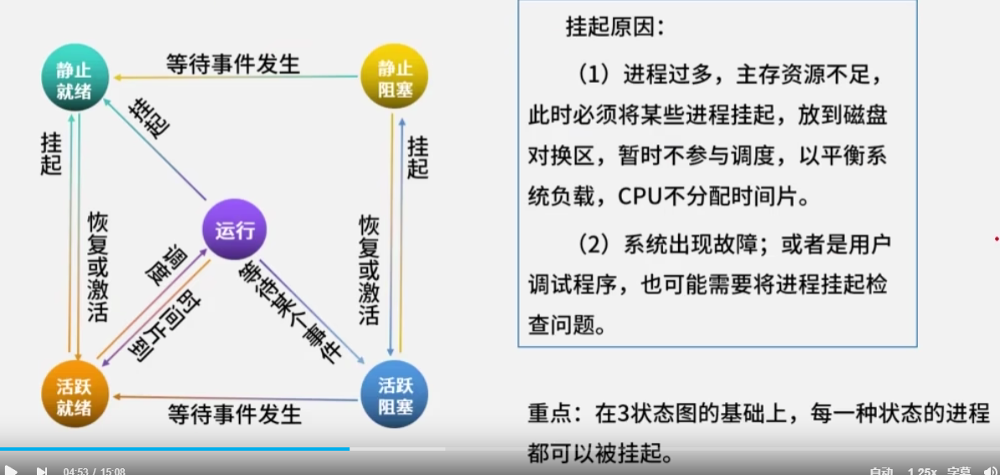


## 4、信号量和PV操作

- 信号量
  - 例子：
    - 用 S 表示打印机数量，那么有一台打印机就是 S = 1
    - 信号量为负数表示排队进程数，比如：S = -1，就是需要一台打印机
- PV：
  - P：代表申请锁定资源，那么资源数就会减少，信号量 - 1
  - V：代表释放解锁资源，资源数就会变多，信号量 + 1

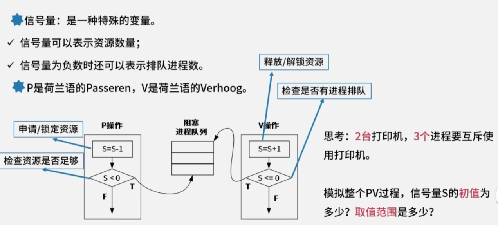

- 多个进程共享一台打印机问题（互斥模型）：

~~~text
P（S）；
使用打印机；
V（S）；
后续代码；
~~~

- 总结
  - 总结 1：P 是要，V 是给
  - 总结 2：互斥信号量 S 初始值为正
  - 总结 3：互斥操作一定是先 p 后 v
  - 总结 4：不同类型进程之间也可以有互斥
- 注：
  - <font color="red">**互斥信号量 S 的初值就是资源数量**</font>
  - <font color="red">**访问权是一类特殊的互斥资源，同一时刻仅允许 1 个人用，则信号量初值为 1**</font>

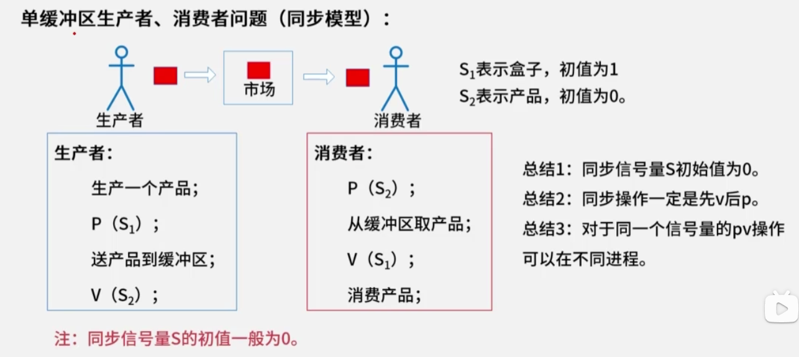

- 例题

~~~bash
假设系统中有n个进程共享3台扫描仪，并采用PV操作实现进程同步与互斥。若系统信号量S的当前值为−1，进程p1、p2又分别执行了 1 次P(S)操作，那么信号量S的值应为（B）。
A、3
B、-3
C、1
D、-1

# 解析：当前S=-1，又进行两次P(S)操作，那么就是S=S-1-1=-3
~~~


## 5、前趋图和PV操作

- 前趋图本质上就是同步图（有先后顺序的）
  - 如下面例子：搅拌一定要有肉、葱末和姜末，所以ABC一定在D前面，包饺子一定要在搅拌后

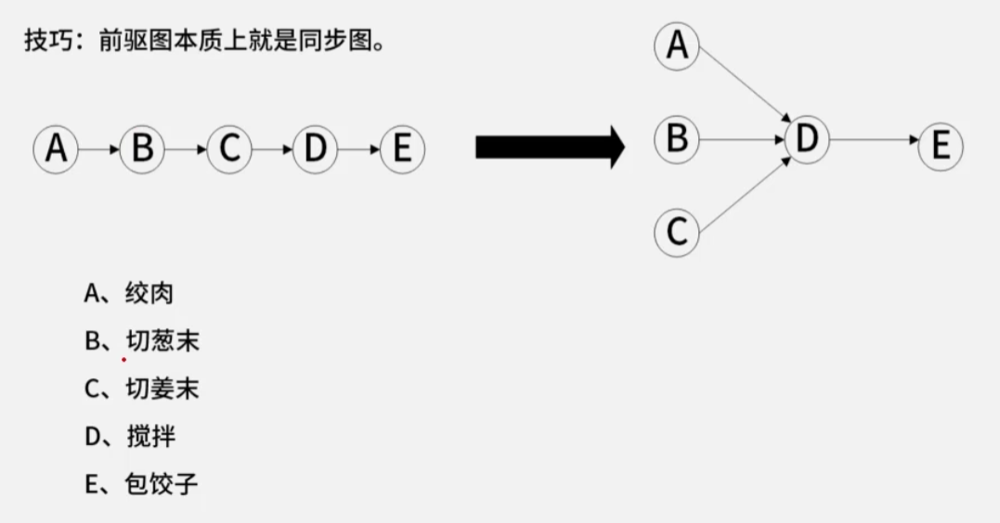

- 前趋图和PV操作结合

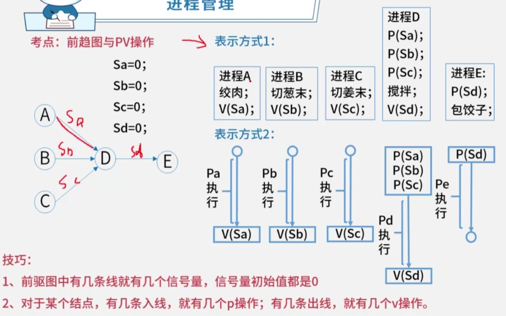

- 技巧：
  - <font color="red">**前趋图中有几条线就有几个信号量，信号量初始值都是0**</font>
  - <font color="red">**对于某个节点，有几条入线，就有几个p操作；有几条出线，就有几个v操作**</font>

- 前趋图例题：选CA
  - a：P1有2条出线，所以是2个V操作，即：V(S1)和V(S2)
  - b：P2有2条入线，所以是2个P操作，即：P(S1)和P(S3)
  - c：P2有1条出线，所以是1个V操作，即：V(S4)
  - d：P3有1条入线，所以是1个P操作，即：P(S2)
  - e：P3有2条出线，所以是2个V操作，即：V(S3)和V(S5)
  - f：P4有2条入线，所以是2个P操作，即：P(S4)和P(S5)

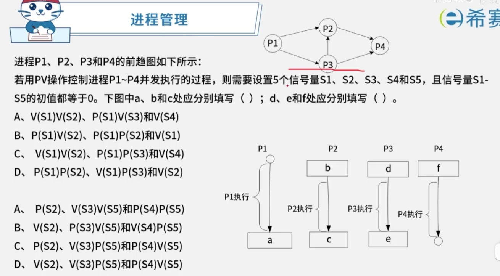


## 6、死锁问题


## 2.18 文件权限

### 2.18.1 查看权限

- 三种权限：
  - R（读）4
  - W（写）2
  - X（执行）1
- 三种角色：所属用户、所属组、其他用户
- 示例：登录 root 账号后查看 /tmp/123 权限
  - ls -l /tmp/123
  - 得到：`- rw- r-- r--`（1 3 3 3的格式）
  - 所以上述表示：/tmp/123 这个文件，root 用户有读写权限、root 组内的用户有读权限，其他用户有读权限。
  - 注意：`d`：代表目录，`-`：代表普通文件，`l`：代表链接文件

| 文件类型 | 所属用户权限 | 所属组权限 | 其他用户权限 |
| -------- | ------------ | ---------- | ------------ |
| `-`      | `rw-`        | `r--`      | `r--`        |

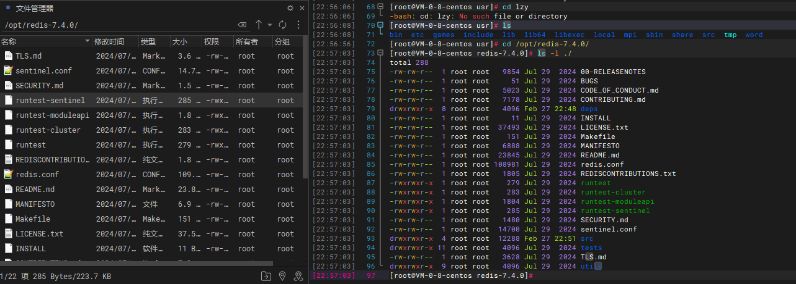


### 2.18.2 修改权限

- 三种权限：**4 R（读）**、**2 W（写）**、**1 X（执行）**

- 口诀：421 读写跑。

- 示例：给所有用户添加读、写和执行权限

```
chmod 777 某文件
```

- （三个数字分别对应：所属用户、所属组、其他用户）

- 权限的数字表示法

|  权限   |      说明      |  权限   |    说明    |
| :-----: | :------------: | :-----: | :--------: |
| rwx (7) | 可读可写可执行 | rw- (6) |  可读可写  |
| r-x (5) |   可读可执行   | -wx (3) | 可写可执行 |
| r-- (4) |      只读      | -w- (2) |    只写    |
| --x (1) |     只执行     | --- (0) |   无权限   |


# 四、数据结构

## 1、线性结构

### 1.1 线性表

#### 1.1.1 顺序表

- <font color="red">**数据在内存中紧邻**</font>：

  |  1   |  2   |  3   |  4   |  5   |  6   |  7   |  8   |
  | :--: | :--: | :--: | :--: | :--: | :--: | :--: | :--: |

  - <font color="red">**平均读取操作 1**</font>：直接通过下标读取，比如读a[4]
  - <font color="red">**平均查找操作数 (1 + n) / 2**</font>
    - 查找1比对次，查找2对2次，依次类推，查找n比对n次
    - 那么总查找次数即为：1 + 2 + ... + n = (1 + n) * n / 2，(首项+末项) * n / 2 
    - 平均查找次数即：(1 + n) * n / 2 * n = (1 + n) / 2
  - <font color="red">**平均插入操作数 n / 2**</font>
    - n个数字有个n+1个插入位置
    - 第一个插入位置，需要往后移动n个元素；第二个插入位置，需要往后移动n-1个元素，依次类推，第n+1个插入位置，需要往后移动0个元素
    - 那么总移动个数：n + (n - 1) + ... + 1 + 0 =  (n + 0) * (n + 1) / 2 = (n + 1) * n / 2，(首项+末项) * n / 2 
    - 平均移动次数：(1 + n) * n / 2 * (n + 1) = n / 2
  - <font color="red">**平均删除操作数 (n - 1) / 2**</font>
    - n个数字有个n个删除元素
    - 删除第一个元素，需要往前移动n-1个元素；删除第二个元素，需要往前移动n-2个元素，依次类推，删除第n个元素，需要往前移动0个元素
    - 那么总移动个数：(n - 1) + (n -2) + ... + 1 + 0 = (n - 1 + 0) * n / 2 = (n - 1) * n / 2，(首项+末项) * n / 2 
    - 平均移动次数：(n - 1) * n / 2 * n = (n - 1) / 2

- 特点：数组的内存是<font color="red">**连续分配**</font>的，并且是静态分配的，即在使用数组之前需要确定空间的大小，<font color="red">**灵活性差**</font>。<font color="red">**读数据快，其他操作效率慢**</font>

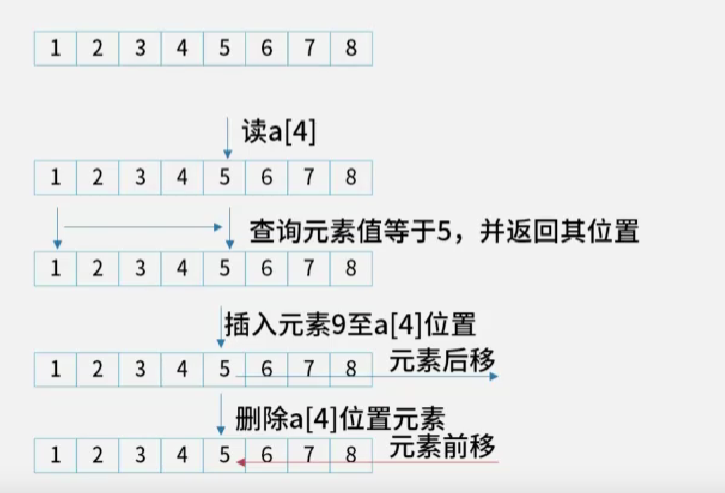


#### 1.1.2 链表

- <font color="red">**链表内部是不连续的**</font>。前一个元素紧邻的地址不一定是下一个元素。链表通过<font color="red">**当前元素存储下个元素地址**</font>的方式把所有元素串起来。不需要连续的空间，对内存友好。但是存储下个元素的地址，<font color="red">**耗费更多空间**</font>

  - 头指针：指向<font color="red">**头结点**</font>的<font color="red">**指针变量**</font>

  - 头结点：第一个有效结点之前的那个结点，存放链表首地址

  - 首结点：第一个有效结点（存有数据的结点）

  - 尾结点：最后一个有效结点

  - 尾指针：指向尾结点的指针变量

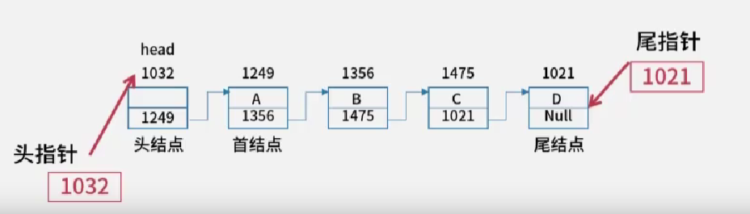

- 特点

  - n个节点离散分布，彼此通过指针相联系
  - 除头节点和尾节点外，每个节点只有一个前驱节点和一个后继节点。头节点没有前驱节点，尾节点没有后继节点
  - 头节点并不存放有效数据，只存放链表首地址。其头节点的数据类型和首节点类型一样
  - <font color="red">**加头节点的目的是方便对链表的操作，比如在链表头部进行节点的删除、插入**</font>

- 链表的每个节点实际上是一个<font color="red">**结构体变量**</font>，它由若干成员组成，包括<font color="red">**数据部分和存地址的指针变量**</font>

  ~~~c
  struct student {
      long num;
      float score;
      struct student *next;
  };
  // 其中：next是成员名，是指针类型，它指向struct student数据类型
  ~~~

  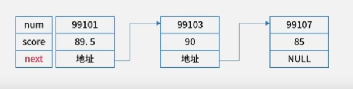

- 链表分为单链表、循环链表和双向链表

  - 单链表：只有指向下一个节点的地址变量，且尾节点的下一个节点地址为空null
  - 循环链表：尾节点的下一个节点地址 指向 头节点
  - 双向链表：增加指向前置节点的指针

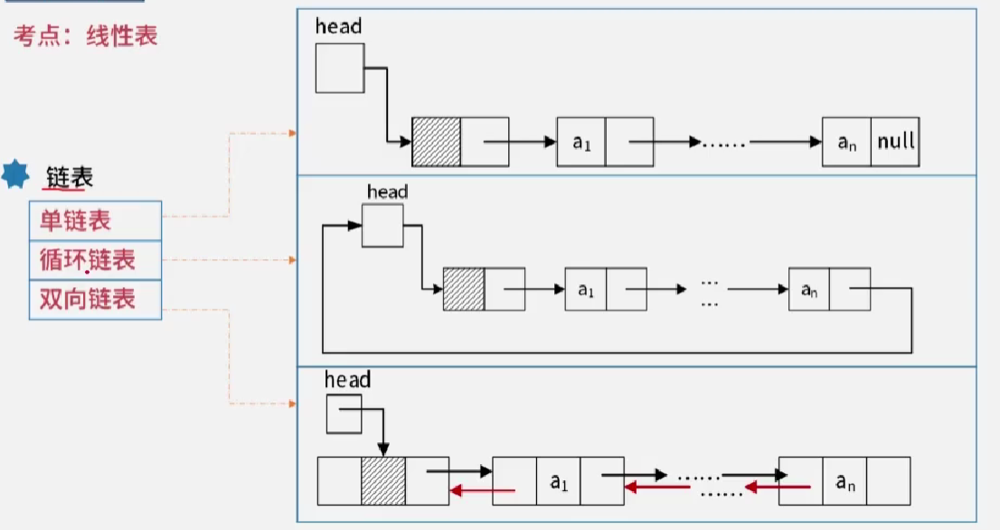

- 单链表的操作
  - 删除：时间复杂度O(1)
    - 将a2删除，只需将a1的后向指针指向a2的后向指针，即a3即可
    - a1.next = a2.next
  - 插入：时间复杂度O(1)
    - 将s节点插入到a1和a2中间，需要将a1的后向指针从a2改为x，x的后向指针指向a2
    - a1.next = x;  x.next = a2

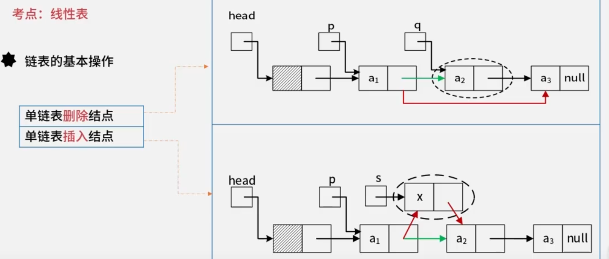

- 双向链表的操作
  - 删除：时间复杂度O(1)
    - 将a2删除，需将a1的后向指针指向a2的后向指针，即a3；将a3的前向指针指向a2的前向指针，即a1
    - a1.next = a2.next; a3.pre = a2.pre
  - 插入：时间复杂度O(1)
    - 将s节点插入到a1和a2中间，需要将a1的后向指针从a2改为x，x的后向指针指向a2；a2的前向指针从a1改为x，x的前向指针指向a1
    - a1.next = x;  x.next = a2; a2.pre = x; x.pre = a1;

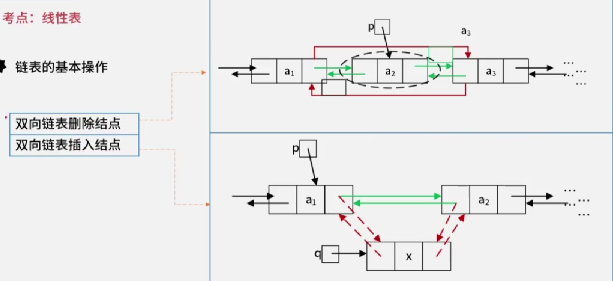


#### 1.1.3 总结

- 空间性能

| 具体项目 | 顺序存储  | 链式存储        |
| -------- | --------- | --------------- |
| 存储密度 | =1，更优✔ | <1              |
| 容量分配 | 事先确定❌ | 动态改变，更优✔ |

- 时间性能

| 具体项目 | 顺序存储                         | 链式存储                         |
| -------- | -------------------------------- | -------------------------------- |
| 读运算   | O(1)，更优                       | O(n)，最好情况为 1，最坏情况为 n |
| 查找运算 | O(n)                             | O(n)                             |
| 插入运算 | O(n)，最好情况为 0，最坏情况为 n | O(1)，更优                       |
| 删除运算 | O(n)，最好情况为 0，最坏情况为 n | O(1)，更优                       |

- 例题

~~~bash
设有一个包含 n 个元素的有序线性表。在等概率情况下删除其中的一个元素，若采用顺序存储结构，则平均需要移动（）个元素；若采用单链表存储，则平均需要移动（）个元素。
A、1       B、(n-1)/2        C、logn         D、n
A、0       B、1              C、(n-1)/2      D、n/2
# 解：
# 1、平均移动次数：(n - 1) * n / 2 * n = (n - 1) / 2，选B
# 2、单链表删除不需要移动元素，只需要修改后向指针指向的元素即可，选A
~~~


### 1.2 队列与栈

#### 1.2.1 队列与栈

- 队列：先进先出
- 栈：先进后出

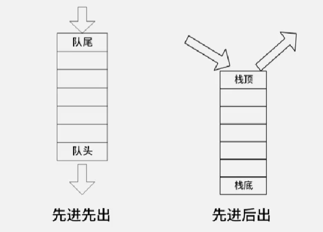

- 例题1

~~~bash
# 按照a、b、c的次入队和入栈，写出所有的出序列
# 出队：先进先出，所以出序也是a、b、c
# 出栈：
abc(a入a出，b入b出，c入c出)
acb(a入a出，b入，c入c出，b出)
bac(a入，b入b出，a出，cruc出)
bca(a入，b入b出，c入c出，a出)
cba(a入，b入，c入c出，b出，a出)
~~~

- 例题2

~~~bash
设有栈 S 和队列 Q 初始状态为空，数据元素序列 a,b,c,d,e,f 依次通过栈 S，且多个元素从 S 出栈后立即进入队列 Q，若出队的序列是 b,d,f,e,c,a，则 S 中的元素最多时，栈底到栈顶的元素依次为（C）。
A、a,b,c
B、a,c,d
C、a,c,e,f
D、a,d,f,e
# A、 a,b,c,那么出栈最先要么是c要么是d，跟入队顺序对不上，排除
# B、 a,c,d,那么出栈最先是b，其次是d，再入e，再入f，跟入队顺序对上了，但是S元素不是最多，因为此时已经有a,c,e,f，排除
# C、 上面B的分析，符合
# D、 a,d,f,e，那么出栈最先应该是b或者c，排除
~~~


#### 1.2.2 循环队列

- 通过整数取余运算实现

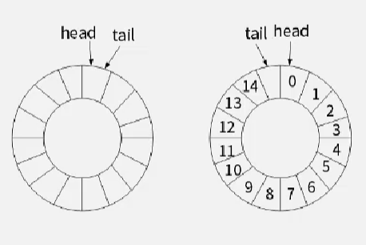

- <font color="red">**牺牲 1 个空位，区分队空 & 队满**</font>，因为如果不这样，那么多放一个15在里面，尾节点tail就到了0这了，那么就无法区分是队空队满了
  - 队空条件：head = tail
  - 队满条件：(tail + 1) % size = head
  - 队列长度：(tail - head + size) % size

- 优点：相比普通队列，此时入队和出队操作都<font color="red">**不需要移动队列中的其他元素**</font>

- 例题

~~~bash
双端队列是指在队列的两个端口都可以加入和删除元素，如下图所示。现在要求元素进队列和出队列必须在同一端口，即从 A 端进队的元素必须从 A 端出、从 B 端进队的元素必须从 B 端出，则对于 4 个元素的序列 a、b、c、d，若要求前 2 个元素（a、b）从 A 端口按次序全部进入队列，后两个元素（c、d）从 B 端口按次序全部进入队列，则不可能得到的出队序列是（A）。
--------------------
---->          ---->							
<----		   <----
--------------------
A、d、a、b、c
B、d、c、b、a
C、b、a、d、c
D、b、d、c、a
# 解：全部入栈后的顺序如下：
--------------------
b a             c  d
--------------------
# a不可能在b之前，c不可能在d之前，所以顺序为ba和dc，排除A
~~~


### 1.3 串

- 定义：串是仅由字符构成的有限序列，是一种线性表。一般记为S=′a1a2a3⋯an′，其中，S 是串名，**单引号**括起来的字符序列是串值。

- 串的存储

  - 顺序存储
  - 链式存储

- 串的几个基本概念

  - 空串与空格串

    - **空串**：长度为零，不包含任何字符。
    - **空格串**：由一个或多个空格组成的串。虽然空格是一个空白字符，但它也是一个字符，在计算串长度时要将其计算在内。

  - 子串与子序列

    - **子串**：由串中任意长度的<font color="red">**连续字符**</font>构成的序列称为子串。含有子串的串称为主串。

      子串在主串中的位置是指子串首次出现时，该子串的第一个字符在主串中的位置。

      空串是任意串的子串

    - **子序列**：一个串的 “子序列”（subsequence）是将这个串中的一些字符提取出来得到一个新串，并且不改变它们的<font color="red">**相对位置**</font>关系。

    - 例子：串：abdcdef，字串：abc/bcd，子序列：acd/adf

- 串比较与串相等

  - **串比较**：两个串比较大小时以字符的 ASCII 码值（或其他字符编码集合）作为依据。实质上，比较操作从两个的第一个字符开始进行，字符的码值大者所在的串为大；若其中一个串先结束，则以串长较大者为大。
  - **串相等**：指两个串长度相等且对应序号的字符也相同。

- 串的基本操作：

  - **赋值操作**`StrAssign(s,t)`：将串 t 的值赋给串 s。
  - **连接操作**`Concat(s,t)`：将串 t 接续在串 s 的尾部，形成一个新的串。
  - **求串长**`StrLength(s)`：返回串 s 的长度。
  - **串比较**`StrCompare(s,t)`：比较两个串的大小。返回值 - 1、0 和 1 分别表示`s<t`、`s=t`和`s>t`三种情况。
  - **求子串**`SubString(s,start,len)`：返回串 S 中从 start 开始的、长度为 len 的字符序列。

- 例题

~~~bash
下列有关字符串的描述中，说法正确的是（B）。
A. 空串就是指含有空白字符构成的串
B. 子串是指任意个连续的字符组成的子序列
C. 子序列是特殊的子串
D. 字符串的比较实质就是两个串的长度对比
# 分析
A、长度为零，不包含任何字符
C、子串是特殊的子序列，反了
D、字符串比较是比较字符的ASCII码值和串长
~~~


## 2、数组与矩阵

| 数组类型          | 存储地址计算                                                 |
| ----------------- | ------------------------------------------------------------ |
| 一维数组a[n]      | a[i]的存储地址为：a + i ∗ len<br />注：a为首地址，len为一个数组的长度 |
| 二维数组a\[m\][n] | a[i\][j]的存储地址（**按行存储**）为：a + (i ∗ n + j) ∗ len<br />a\[i][j]的存储地址（**按列存储**）为：a + (j ∗ m + i) ∗ len<br />注：a为首地址，len为一个数组的长度 |

- 例题解析：
  - a\[2][3] = a + (2 * 5 + 3) * 2 = (a + 26)B

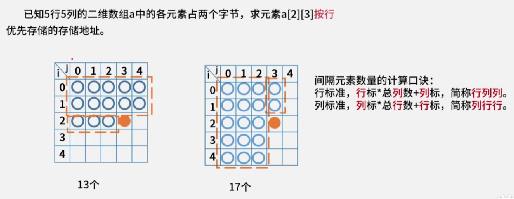

- 例题

~~~bash
二维数组a[1..N, 1..N]可以按行存储或按列存储。对于数组元素a[i,j]（1<=i,j<=N），当（B）时，在按行和按列两种存储方式下，其偏移量相同。
A、i≠j
B、i=j
C、i>j
D、i<j
~~~

- 稀疏矩阵

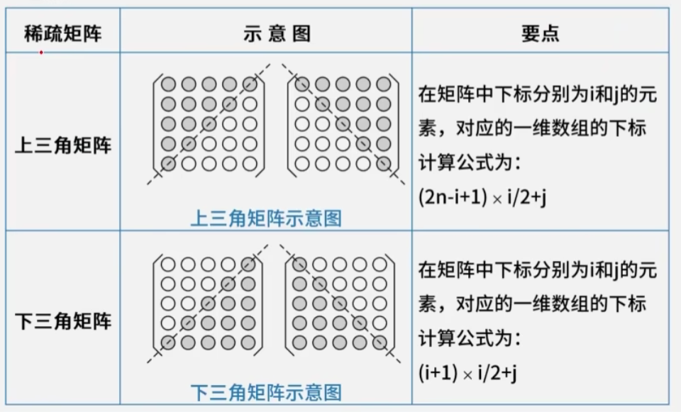

- 特殊矩阵

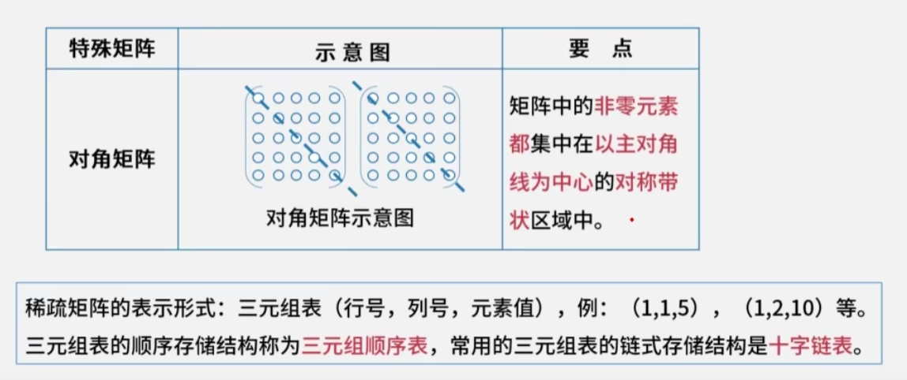

- 三对角矩阵

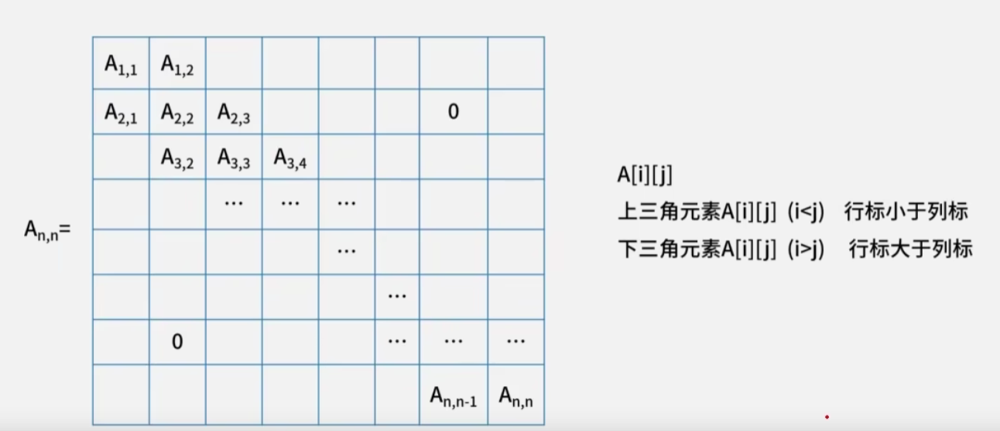

- 矩阵例题：这种题就带入就行了，选A

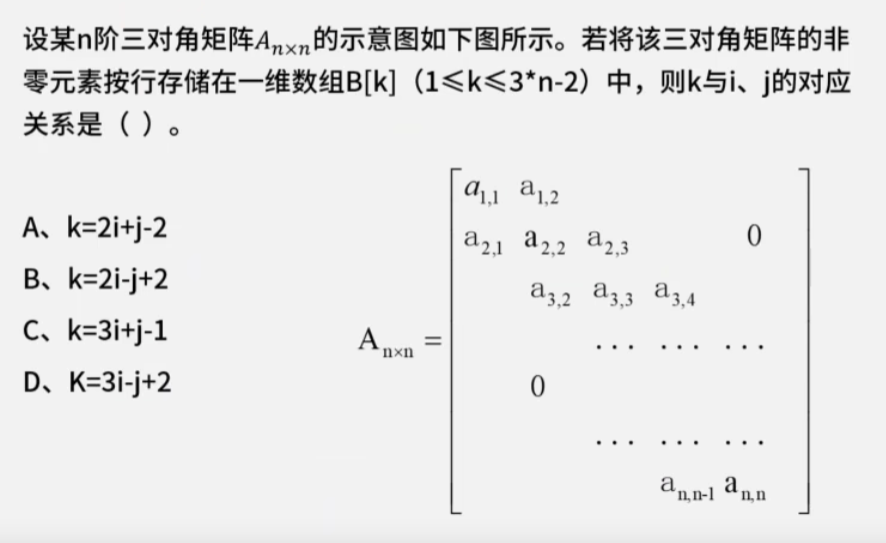


## 3、树

### 3.1 基本概念

- 基本概念

  - 结点（圆形）

  - 分支（结点下面的线）

  - 结点的度：该节点的子树数目

  - 树的度：各结点度的最大值

  - 叶子结点：度为 0 的结点 - 无分支

  - 分支结点（非终端结点）：度不为 0 的结点 - 有分支

  - 内部结点：除根以外的分支结点

  - 层次：根为第 1 层，以此类推

  - 树的高度：一棵树的最大层次数（总层数）

  - 父结点、子结点、兄弟结点

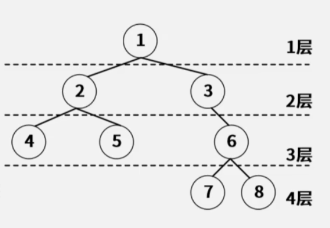

- 二叉树的定义：是n（n >= 0）个节点的有限集合，它或者是空树（n = 0），或者是由1个根节点及两棵不相交的且分别称为左、右子树的二叉树所构成。可见，二叉树同样<font color="red">**具有递归性**</font>

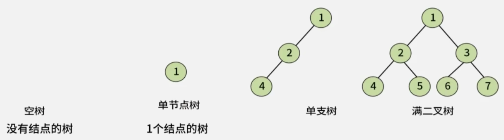

- <font color="red">**完全二叉树：把二叉树节点按照满二叉树编号后，还是完全连续的，就叫做完全二叉树**</font>

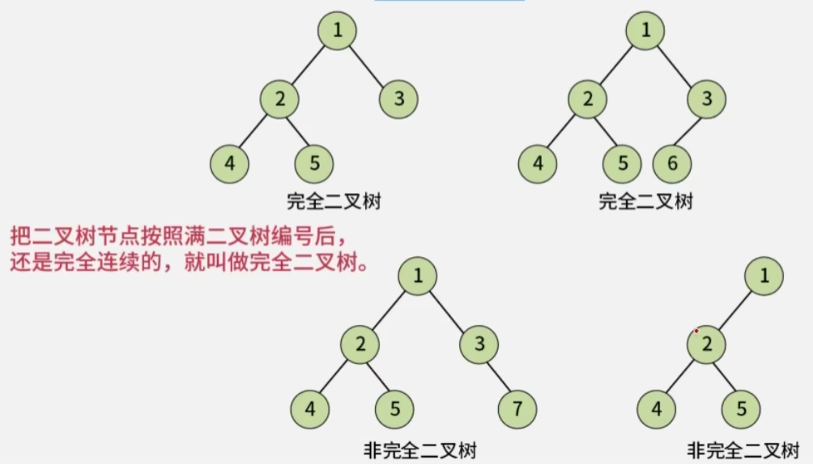


### 3.2 二叉树存储

- 数组存储方式
  - 方式1：直接按照顺序一个个连续存储，这样不能体现存储位置，无法还原
  - 方式2：以完全二叉树的大小分配空间，然后按顺序将对应的节点存储在各自的空位上，可以还原位置信息，只是浪费空间

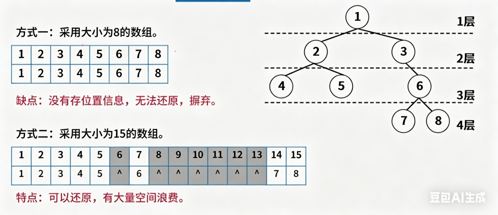

- 链表存储方式

~~~c
// 定义二叉树节点结构体
typedef struct BiTNode {
    // 数据域
    int data;
    // 左孩子指针
    struct BiTNode *lchild;
    // 右孩子指针
    struct BiTNode *rchild;
} BiTNode, *BiTree;
~~~

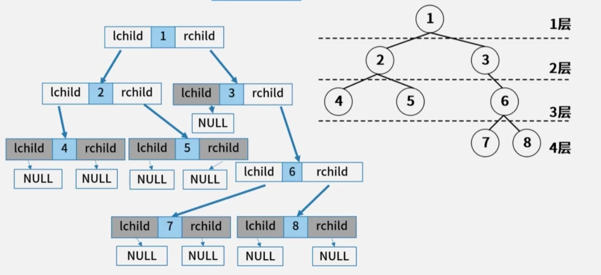


### 3.3 二叉树重要特性

- 二叉树的特性

  - **在二叉树的第 i 层最多有 2 ^ (i-1) 个节点（i >= 1）**

  - **深度为k的二叉树最多有个2 ^ k - 1个节点（i >= 1）**

- 满二叉树的特性

  - 如果对一棵有 n 个结点的**完全二叉树**的结点**按层序**编号（从第 1 层到 ⌊log2n⌋+1 层，每层从左到右），则对任一结点i (1≤i≤n)，有：
    - 如果i=1，则结点i无父结点，是二叉树的**根**；如果i>1，则父结点是⌊i/2⌋（向下求整）；
    - 如果2i>n，则结点i为叶子结点，无左子结点；否则，其左子结点是结点2i；
    - 如果2i+1>n，则结点i无右子结点，否则，其右子结点是结点2i+1。

- 对任何一棵二叉树，如果其叶子节点数为n0，度为2的节点数为n2，那么<font color="red">**n0 = n2 + 1**</font>
- 对于任何一棵非空树，无论二叉树与否，<font color="red">**节点数量 = 分支数量 + 1**</font>（两个节点之间一个分支连接）


- 二叉树的形态


- 例题

~~~bash
例1：设某二叉树采用二叉链表表示（即结点的两个指针分别指向左、右两个孩子）。当该二叉树包含k个节点时，其二叉链表节点中必有（C）个空的孩子指针
A、k-1
B、k
C、k+1
D、2k
# 解析: 
n0 + n1 + n2 = k
n0 = n2 + 1，即：n2 = n0 - 1 
所以：2n0 + n1 - 1 = k
n0有0个孩子指针，n1有1个孩子指针，n2有2个孩子指针
所以空指针数 = n0 * 2 + n1 * 1 = k+1

例2：具有3个节点的二叉树有5种，可推测出具有4个节点的二叉树有（C）种
A、10
B、11
C、14
D、15
# 解析：用带入法求得14


例3：已知树T的度为4，且度为4的节点数7个，度为3的节点数为5个，度为2的节点数为8个，度为1的节点树为10个，那么T的叶子节点个数为（C）。（注：树中节点个数称为节点的度，节点的度中最大值称为树的度）
A、30
B、35
C、40
D、49
# 解析：度为4的节点数有7个，那么就是4 * 7 = 28个分支，同理度为3有15个分支，度为2有16个分支，度为1有10个分支，总计69个分支。节点数 = 分支数 + 1 = 70个节点
# 树的度为4，即节点的度有4、3、2、1和0，那么n0 = 70 - 7 - 5 - 8- 10 = 40
~~~


### 3.4 二叉树遍历

- 层次遍历（从上往下，从左往右）：1、2、3、4、5、6、7、8
- 前序遍历（根-左-右）：1、2、4、5、7、8、3、6
- 中序遍历（左-根-右）：4、2、7、8、5、1、3、6
- 前序遍历（左-右-根）：4、8、7、5、2、6、3、1


- 技巧：
  - 前序和后序确定根节点，中序区分左右子树
- 比如：由前序序列为：ABHFDECG；中序序列为HBEDFAGC构造二叉树
  - 前序序列可判定A为根节点
  - 中序序列左子树HBEDF，右子树GC
  - 以此类推得到二叉树

~~~bash
某二叉树的中序、先序遍历分别为{20，30，10，50，40}、{10，20，30，40，50}，则该二叉树的后序遍历序列为(C)
A、50，40，30，20，10
B、30，20，10，50，40
C、30，20，50，40，10
D、20，30，10，40，50
# 解析：根节点为10；左子树为20，30；右子树为40，50
左子树中20为根节点，30为右子节点
右子树中40为根节点，50为左子节点
所以后序遍历：30、20、50、40、10
~~~


### 3.5 特殊二叉树

#### 3.5.1 二叉排序树/查找二叉树

- 定义
  - 左孩子的值大于根节点
  - 右孩子的值小于根节点
  - 左孩子 < 根 < 右孩子
- 特点
  - 二叉查找树的中序遍历序列为从小到大的序列
  - 值最小的节点无左子树，值最大的节点无右子树
  - 每一层从左到右进行遍历的序列为从小到大的序列
- 插入节点：<font color="red">**从顶部开始找，找到合适位置放置即可**</font>
  - <font color="red">**以第一个节点作为根节点**</font>，后续节点基于根节点插入合适的位置
  - 将要插入节点键值与插入后父节点键值进行比较，就能确定新根节点是父节点的左子节点还是右子节点
  - 注意：<font color="red">**同样的数据，插入顺序不同，最终组成的二叉排序树不一样**</font>


- 例题1：选B
  - 第一个序列就可以确定跟根节点，排除AD
  - 第二序列一定在第二层，所以选B


- 例题2

~~~bash
以下关于二叉排序树（或二叉查找树、二叉搜索树）的叙述中，正确的是（D）
A、对二叉排序树进行先序、中序和后序遍历，都得到节点关键字的有序序列
B、含有n个节点的二叉排序树高度为⌊log2n⌋+1
C、从根到任意一个叶子节点的路径上，节点的关键字呈现有序排列的特点
D、从左到右排列同层次的节点，其关键字呈现有序排列的特点
# 解析：
A、只有中序序列是有序的
B、不是完全树
C、路径上不是有序的
~~~


#### 3.5.2 最优二叉树/哈夫曼树

- 基本概念
  - 叶子节点的路径长度：节点到根的<font color="red">**分支线数量**</font>
  - 树的路径长度：<font color="red">**所有叶子节点路径之和**</font>
  - 权：叶子节点的数值
  - <font color="red">**叶子节点的带权路径长度：权重 * 路径**</font>
  - 树的带权路径长度（树的代价）：所有叶子节点带权路径之和
  - <font color="red">**根节点的权重 = 叶子节点的权重之和**</font>
  - <font color="red">**哈夫曼编码**</font>：从根节点到叶子节点的路径上，左分支记为 0，右分支记为 1，路径上的 0/1 序列即为该字符的编码
- 特点
  - 左图的带权路径长度：1 * 1 + 2 * 2 + 4  * 3  + 8 * 3 = 41
  - 右图的带权路径长度：1 * 3 + 2 * 3 + 4  * 2  + 8 * 1 = 25
  - 叶子节点的数量和权重一样的情况下，高权重叶子节点离根节点的距离越近（路径长度越短），<font color="red">**整体的带权路径长度就小**</font>。把优化叶子节点后得到的<font color="red">**最小带权路径长度的树**</font>就叫做最优二叉树/哈夫曼树


- 构造哈夫曼树


- 例题


## 4、图

### 4.1 图的定义

- 有向图和无向图，完全图和连通图
  - 在无向图中，若<font color="red">**每对**</font>顶点之间都有一条边相连，则称该图为完全图（complete graph）。
  - 在有向图中，若<font color="red">**每对**</font>顶点之间都有二条有向边相互连接，则称该图为**完全图**。
  - 连通图：指任意两个顶点之间都有<font color="red">**一个路径相连**</font>

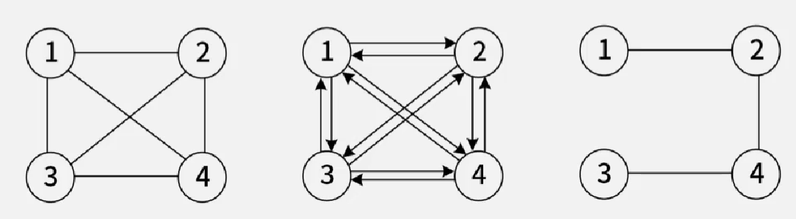


### 4.2 图的存储

#### 4.2.1 数组存储

- 用一个 n 阶方阵 R 来存放图中各结点的关联信息，其矩阵元素Rij定义为：
  - Rij={1 若顶点i到顶点j有邻接边，0 若顶点i到顶点j无邻接边}
- 注意
  - 无向图的矩阵一定对称
  - 有向图的矩阵可能对称
  - 不对称的矩阵一定是有向图
  - 对称的矩阵可能是有向图

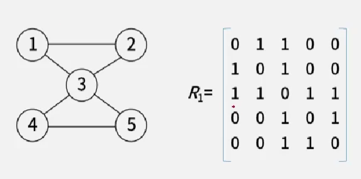


####  4.2.2 链表存储

- 把每个定点的邻接顶点用链表表示出来，然后用一个一维数组来顺序存储，上面每个链表的头指针
  - 有向图的邻接表有n + e个点
  - 无向图的邻接表有n + 2e个点

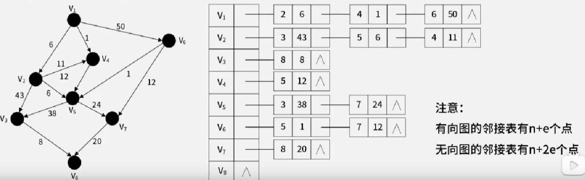

- 例题1

~~~bash
某简单无向连通图 G 的顶点数为 n，则图 G 最少和最多分别有（B）条边。
A、n，n^2/2
B、n-1，n*(n-1)/2
C、n，n*(n-1)/2
D、n-1，n^2/2

# 解析
最少的时候，只需要把每个点顺序连接起来即可，两个点之间一条边能连上，所以最少是n-1
最多的时候，每个点和其他的所有点之间都有一条线，所以是n*(n-1)，然后有重复，所以要除以2，就是n*(n-1)/2
~~~

- 例题2：选A、B
  - 邻接矩阵是有多少个点就是几乘几的矩阵，所以是5*5
  - 邻接链表，就是每个点有几个到别的点的线，所以2和3的表节点个数分别为2，2

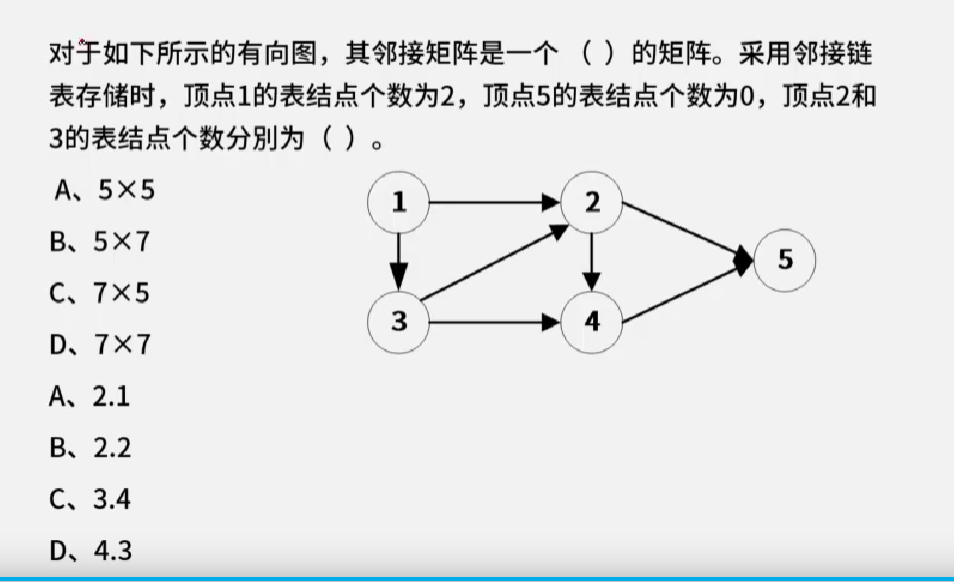


### 4.3 图的遍历

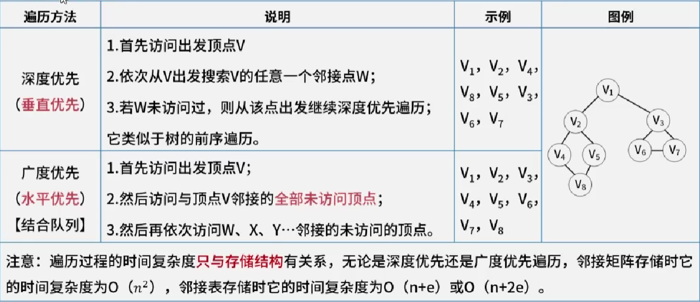

- 因为邻接矩阵是二维数组，所以时间复杂度为O(n^2)
- 邻接表是由n个头节点+e条线的，所以有向图和无向图分别为O(n+e)或者O(n+2e)
- 例题：选D、B
  - 1、广度优先
  - 2、深度优先
  - 3、即能算深度也能算广度
  - 4、深度优先

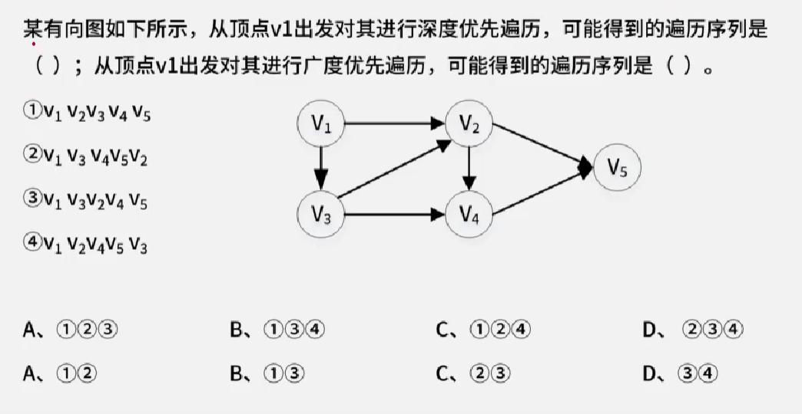


### 4.4 图的拓扑排序

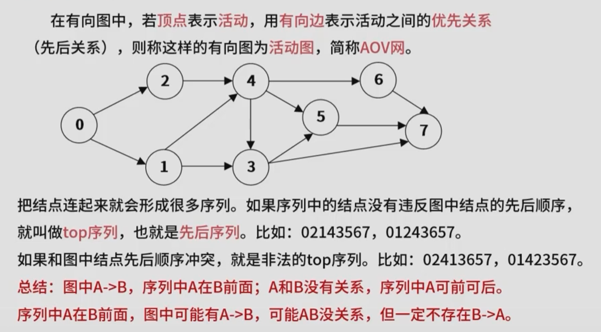

- 例题：选A
  - B中3在2前，错
  - C中2在1前，错
  - D中3在2前错

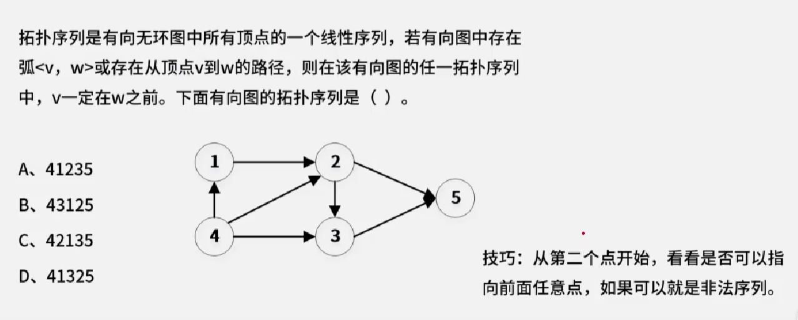

- 例题
  - A、可能不是直接连接的，中间隔了节点
  - C、不一定，也许2和3都是1后面的，2和3是并列的，那么拓扑结构可能是123，但是2和3之间没路径
  - D、必定不存在

~~~bash
对有向图 G 进行拓扑排序得到的拓扑序列中，顶点Vi在顶点Vj之前，则说明 G 中（B）。
A、一定存在有向弧<Vi,Vj>
B、一定不存在有向弧<Vj,Vi>
C、必定存在从Vi到Vj的路径
D、必定存在从Vj到Vi的路径
~~~


### 4.5 最小生成树和最短路径

- 最小生成树
  - 克鲁斯卡尔
    - AB：100（AB）
    - AE：200（ABE）
    - FD：200（FD）
    - AF：250（ABEFD）
    - CD：300（ABCDEF）
  - 普利姆算法
    - AB：100（AB）
    - AE：200（ABE）
    - AF：200（ABEF）
    - FD：250（ABEFD）
    - CD：300（ABCDEF）

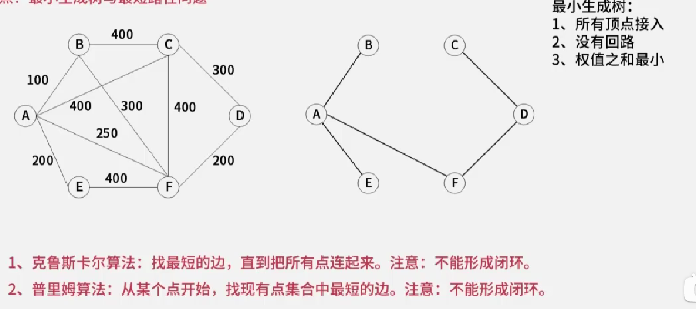

- 最短路径
  - 求A-E最短路径是多少
    - A-B-E：6+3=9
    - A-C-E：1+6=7
    - A-D-F-E：2+2+1=5
  - 那么最短路径是5

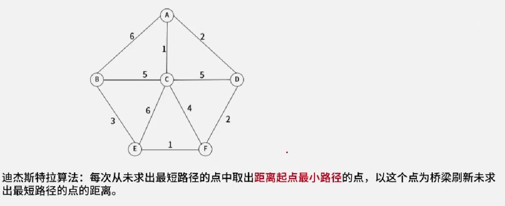
