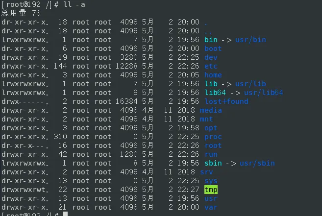
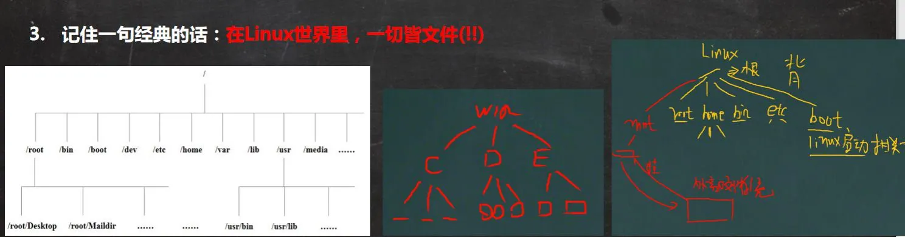

# 一、前置知识

## 1、计算机基础知识

- 计算机组成：CPU、内存、风扇、硬盘、显示器、主板、电源、声卡、网卡、显卡、鼠标、键盘等
- 计算机资源的分类
  - 硬件资源：一般硬件是指计算机的物理组成，由 **真实（看得见，摸得见）**的设备组成的
  - 软件资源：软件一般是指 **应用程序** ，应用程序是开发人员按照编程语言的特定规则去编写的程序。**操作系统属于软件资源的范畴，它属于特殊的软件**。

## 2、Linux发展史

# 二、安装

# 三、Linux目录结构

## 1、目录结构

### 1.1 基本介绍

- linux 的文件系统是采用**级层式的树状目录结构**，在此结构中的最上层是根目录“/”，然后在此目录下再创建其他的目录。 
- 深刻理解 linux 树状文件目录是非常重要的，这里我给大家说明一下。 
- 记住一句经典的话：**在 Linux 世界里，一切皆文件(!!)** 
- **在 Linux 系统中任何东西都是以文件的形式来存储的**

### 1.2 具体的目录结构

- **/bin**
  - [常用] (/usr/bin、/usr/local/bin)
  - 是 Binary 的缩写，**存放着最经常使用的命令**
- **/sbin**
  - (/usr/sbin、/usr/local/sbin)
  - s 就是 Super User的意思，**存放的是系统管理员使用的系统管理程序**
- **/home（常用）**
  - 存放普通用户的主目录，在Linux中每个用户都有一个自己的目录，一般该目录名是以用户的账号命名
- **/root（常用）**
  - 该目录是系统管理员，也称作是超级权限者的用户主目录
- **/lib**
  - library的缩写
  - **系统开机所需要最基本的动态连接共享库**，其作用类似于windows里的DDL文件。几乎所有的应用程序都需要用到这些共享库
- **/lost+found**
  - 这个目录一般情况下是空的，当系统非法关机后，这里就会存放一些文件
- /ect

	