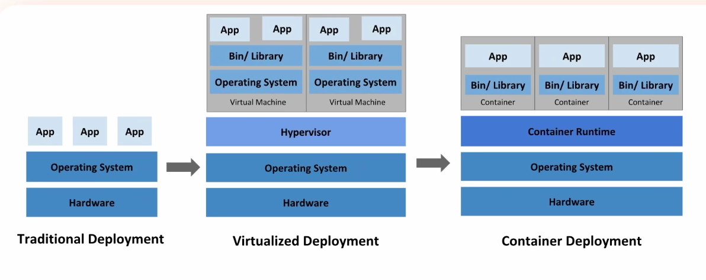
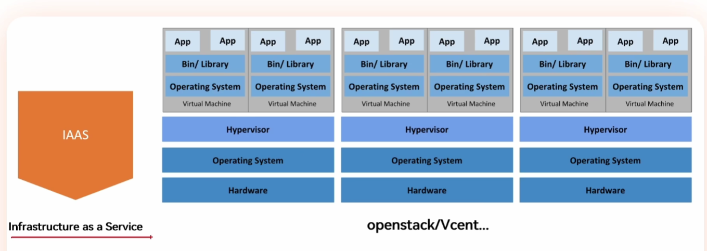
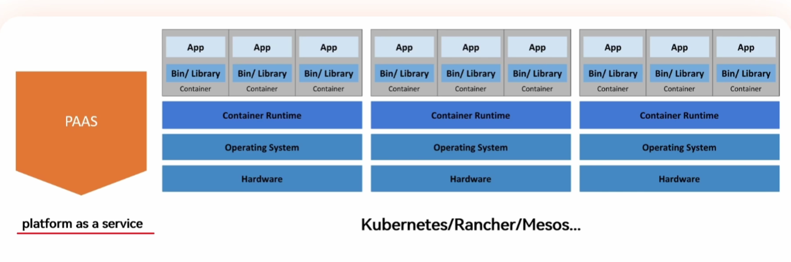
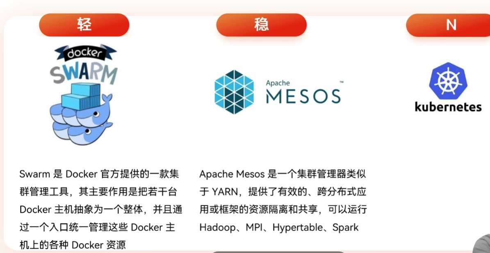
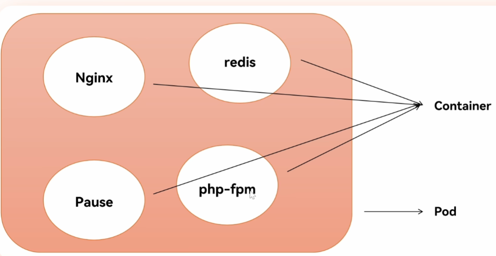
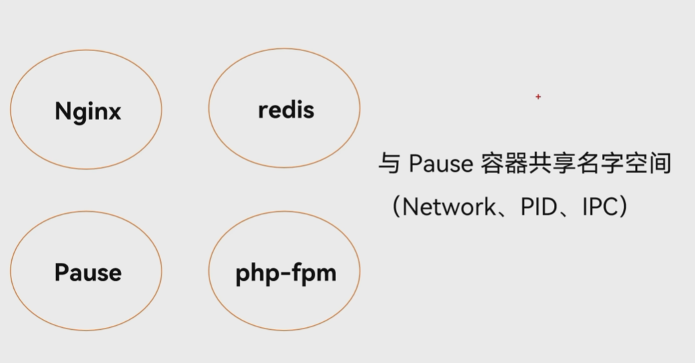

# 一、介绍说明

## 1、基础设施的变革

### 1.1 单机场景

- 传统方式：底层硬件 —> 操作系统 —> 各类软件App
  - 缺点：**安全性和资源利用率不可兼得**
    - 安全性：如果多个软件安装在一个物理机上，比如nginx和mysql啥的，当nginx被劫持时，他就会暴露mysql的数据目录，造成安全性问题
    - 资源利用率：如果不装在一个物理机上，那么一台物理机只运行一个nginx，那么资源会有大量闲置，也不好
- 虚拟化方式：底层硬件 —> 操作系统 —> 虚拟机层 —> 虚拟机 —> 各类软件App
  - 在之前的传统方案上多加了一层虚拟机层，这样就可以在同一台物理机上运行多个虚拟机（VM，也相当于操作系统），然后在这些单独的虚拟机里运行相对隔离的各种app软件
  - 优点：相对提高了资源的利用率
  - 缺点：虚拟机也是操作系统，操作系统需要消耗资源，这个资源不能供给给应用程序。**如果要跑应用的话，这一层不可获缺，但是他本身不提供资源。**随着虚拟机的数量增加，所需的操作系统的资源就也更多，故而浪费了大量的资源
- 容器化方式：底层硬件 —> 操作系统 —>容器层 —> 虚拟化容器 —> 各类软件App
  - 容器运行不同的程序，但是没有之前的虚拟机里的操作系统，也就是说，容器要比传统虚拟机更为轻便
  - 容器内的应用程序直接运行于宿主的内核（复用本地主机的操作系统），**容器内没有自己的内核且没有进行硬件虚拟**
  - 优点：资源利用率很好
  - 缺点：安全性会下降

### 1.2 集群方式—IAAS

- 通俗含义：基础设施即服务
- 举例：几年前如果你想在办公室或者公司的网站上运行一些企业应用，你需要去买服务器，或者别的高昂的硬件来控制本地应用，才能让你的业务正常运行。但现在可以租用IaaS公司提供的场外服务器，存储和网络硬件。这样一来，便大大的节省了维护成本和办公场地。
- 用户几乎无需承担任何运维工作，所有的软件维护、服务器管理等工作都由服务商负责，用户只需关注软件的使用即可
- 多台物理机上都有自己的操作系统，操作系统上跑虚拟化引擎，然后在上面安装多个虚拟机，然后在上面运行程序应用，然后这些物理机组成一个集群。当需要选择一台机器安装应用的时候，优先选择资源利用最小的机器。但是如果机器很多的情况，人为选择就很困难，这个时候就可以在这些物理机上安装一层IAAS框架，管理这些物理机，然后**用户不需要再自行选择物理机安装应用，只需要发送创建虚拟机的请求，IAAS框架会自动选择合适的物理机安装好虚拟机并把虚拟机访问接口返回给用户。**

### 1.3 集群方式—PAAS

- 通俗含义：平台即服务
- 举例： PaaS公司在网上提供各种开发和分发应用的解决方案，比如虚拟服务器和操作系统。这节省了你在硬件上的费用，也让分散的工作室之间的合作变得更加容易。网页应用管理，应用设计，应用虚拟主机，存储，安全以及应用开发协作工具等。
- 系统不需要去部署，环境也不需要去部署，只需要把应用扔到里面就可以提供访问

### 1.4 集群方式—SAAS

- 通俗含义：软件即服务

- 是一种**通过互联网提供软件服务**的交付模式。用户无需下载安装，只需订阅并通过浏览器或App登录即可使用。软件的维护、更新、安全等全部由服务提供商负责，用户只需专注于使用本身。用户能够以“**按需付费**”的方式灵活使用，大幅降低技术门槛和初期投入成本。这一模式突破了传统软件在部署、升级和兼容性上的限制，为企业提供了更轻量、高效的数字解决方案。它不仅简化了软件交付流程，还支持跨设备、跨地域的协同工作，成为现代企业高效运营的重要基础设施。

### 1.5 PAAS平台对比

# 二、安装前准备

## 1、Pod概念

### 1.1 介绍

- 是什么：k8s最小部署模块
- 类似毛豆：毛豆里面有很多豆子，这些豆子就好比单个容器，这一整个毛豆就是Pod，可以理解为容器组
- 比如下图：里面的是每个容器，然后这几个组合整个是一个Pod

### 1.2 Pause容器特性

- Pod内部第一个启动的容器
- 初始化网络栈
- 挂载需要的存储卷
- 回收僵尸进程
  - 例子：现在有一个1号进程启动了一个master进程，这个master进程会启动很多个word进程，这多个work进程都是master所管理的，当master进程出现意外没了，那么根据进程归属原则，这些work进程会归属到1号进程身上，但是他们既存在又不干活，这种就可以叫做僵尸进程，那么1号进程都需要负责 对他们进行回收杀死进程回收资源 

### 1.3 其他容器特性

- 共享Network：因为这些容器都放在同一个pod里了，那么就是想完成单一的任务模块，那么就需要网络共享，达到任务自洽
- 共享PID、IPC：因为Pause要知道他是那些进程的一号进程，这样才能对他们有效的管理。**因为pod是一种逻辑概念，并不真实存在**

